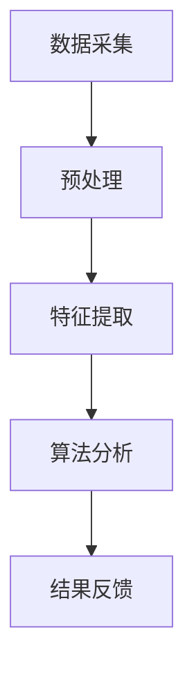

                 

# 智能穿戴设备在健康管理中的注意力应用

> **关键词：智能穿戴设备、健康管理、注意力、生物信号、数据处理、算法优化**

> **摘要：本文将深入探讨智能穿戴设备在健康管理中的应用，特别是注意力方面的应用。通过分析其核心概念、算法原理、数学模型及实际应用场景，旨在为读者提供全面的技术解析，并为未来的发展趋势和挑战提供展望。**

## 1. 背景介绍

### 1.1 目的和范围

本文旨在通过深入分析智能穿戴设备在健康管理中的注意力应用，帮助读者理解这一领域的技术原理和应用实践。本文将涵盖以下内容：

- 智能穿戴设备的基本概念及其在健康管理中的应用；
- 注意力监测的核心算法原理和数学模型；
- 实际应用案例和项目实战；
- 行业趋势和未来挑战。

### 1.2 预期读者

- 对智能穿戴设备和技术应用感兴趣的读者；
- 计算机科学、生物医学工程领域的学生和专业人员；
- 健康管理、运动康复等相关领域的研究人员和从业者。

### 1.3 文档结构概述

本文结构如下：

1. 背景介绍
   - 目的和范围
   - 预期读者
   - 文档结构概述
   - 术语表

2. 核心概念与联系
   - 核心概念原理和架构的 Mermaid 流程图

3. 核心算法原理 & 具体操作步骤
   - 算法原理讲解
   - 伪代码阐述

4. 数学模型和公式 & 详细讲解 & 举例说明
   - LaTeX 格式数学公式嵌入

5. 项目实战：代码实际案例和详细解释说明
   - 开发环境搭建
   - 源代码实现和解读
   - 代码解读与分析

6. 实际应用场景
   - 注意力监测的应用实例

7. 工具和资源推荐
   - 学习资源推荐
   - 开发工具框架推荐
   - 相关论文著作推荐

8. 总结：未来发展趋势与挑战
   - 行业趋势分析
   - 技术挑战展望

9. 附录：常见问题与解答
   - 常见问题的回答

10. 扩展阅读 & 参考资料
    - 相关文献和资源推荐

### 1.4 术语表

#### 1.4.1 核心术语定义

- **智能穿戴设备**：集成传感器、计算单元和通信模块，可以穿戴在人体上的设备，用于实时监测和反馈个人健康数据。
- **健康管理**：通过监测和干预，维持或改善个人健康状态的过程。
- **注意力**：个体集中精神资源，对特定刺激进行加工的心理过程。
- **生物信号**：人体内部产生的电信号，如脑电波、心电波等，用于反映生物体的生理状态。

#### 1.4.2 相关概念解释

- **数据处理**：对收集到的生物信号进行预处理、特征提取和数据分析的过程。
- **算法优化**：通过对算法进行改进，提高其性能和效率的过程。

#### 1.4.3 缩略词列表

- **ECG**：心电图（Electrocardiogram）
- **EEG**：脑电图（Electroencephalogram）
- **ML**：机器学习（Machine Learning）
- **AI**：人工智能（Artificial Intelligence）

## 2. 核心概念与联系

### 2.1 智能穿戴设备的基本原理

智能穿戴设备的核心在于其能够实时监测用户的健康数据，并通过无线通信技术将数据传输至云端进行分析和存储。其基本原理包括以下几个方面：

1. **传感器技术**：智能穿戴设备内置多种传感器，如加速度传感器、陀螺仪、心率传感器、脑电波传感器等，用于监测用户的生理和心理状态。

2. **数据处理**：传感器采集的数据通过内置的计算单元进行处理，提取关键特征，如心率、步数、注意力等。

3. **无线通信**：处理后的数据通过无线通信技术（如蓝牙、Wi-Fi、5G）传输至云端，供进一步分析和应用。

4. **云计算和大数据分析**：云端存储的海量数据通过机器学习和人工智能技术进行分析，提供个性化的健康建议和干预方案。

### 2.2 健康管理中的注意力监测

注意力是健康管理中的一个重要指标，能够反映个体的精神状态和心理健康水平。智能穿戴设备通过以下步骤进行注意力监测：

1. **数据采集**：利用脑电波传感器采集用户大脑的电活动信号。

2. **特征提取**：通过对脑电波信号进行预处理和频域分析，提取反映注意力水平的特征，如α波、β波等。

3. **算法分析**：采用机器学习算法，如支持向量机（SVM）、深度学习（如卷积神经网络CNN）等，对提取的特征进行分类和预测。

4. **结果反馈**：将分析结果通过智能穿戴设备反馈给用户，帮助其了解自己的注意力水平，并采取相应措施进行调节。

### 2.3 Mermaid 流程图

下面是一个简单的 Mermaid 流程图，用于展示智能穿戴设备在健康管理中注意力监测的基本流程：



## 3. 核心算法原理 & 具体操作步骤

### 3.1 数据处理与特征提取

智能穿戴设备在监测注意力时，首先要对采集到的生物信号进行处理和特征提取。以下是具体的操作步骤：

#### 3.1.1 数据预处理

```plaintext
步骤1：去除噪声
    对原始数据进行滤波处理，去除高频噪声和低频干扰。

步骤2：归一化
    对预处理后的数据进行归一化处理，使数据具有统一的尺度。

步骤3：分段
    将归一化后的数据分段，每段长度为固定时间窗口（如1秒）。
```

#### 3.1.2 特征提取

```plaintext
步骤4：频域分析
    对每段数据进行傅里叶变换（Fourier Transform），将时域数据转换为频域数据。

步骤5：特征选择
    从频域数据中选择与注意力水平相关的特征，如α波、β波等。

步骤6：特征融合
    将多个特征进行融合，构建一个综合反映注意力水平的特征向量。
```

### 3.2 算法分析

在特征提取后，需要利用机器学习算法对特征向量进行分类和预测。以下是常见的算法及具体操作步骤：

#### 3.2.1 支持向量机（SVM）

```plaintext
步骤7：数据集划分
    将特征向量划分为训练集和测试集。

步骤8：模型训练
    使用训练集对支持向量机模型进行训练。

步骤9：模型评估
    使用测试集对训练好的模型进行评估，计算准确率、召回率等指标。

步骤10：模型优化
    根据评估结果对模型进行优化，提高预测性能。
```

#### 3.2.2 深度学习（卷积神经网络CNN）

```plaintext
步骤11：构建模型
    构建卷积神经网络模型，包括输入层、卷积层、池化层和全连接层。

步骤12：模型训练
    使用训练集对卷积神经网络模型进行训练。

步骤13：模型评估
    使用测试集对训练好的模型进行评估，计算准确率、召回率等指标。

步骤14：模型优化
    根据评估结果对模型进行优化，提高预测性能。
```

### 3.3 伪代码

以下是注意力监测算法的伪代码，用于详细阐述上述步骤：

```plaintext
function AttentionMonitoring(data_stream):
    # 数据预处理
    preprocessed_data = Preprocess(data_stream)
    segmented_data = Segment(preprocessed_data, window_size)

    # 特征提取
    frequency_data = FourierTransform(segmented_data)
    selected_features = FeatureSelection(frequency_data)
    feature_vector = FeatureFusion(selected_features)

    # 算法分析
    if use_SVM:
        model = SVM_train(feature_vector_training)
        prediction = SVM_predict(model, feature_vector)
    else:
        model = CNN_train(feature_vector_training)
        prediction = CNN_predict(model, feature_vector)

    # 结果反馈
    return prediction
```

## 4. 数学模型和公式 & 详细讲解 & 举例说明

### 4.1 数据预处理

在数据处理过程中，常见的方法包括滤波、归一化和分段等。以下是一些相关的数学模型和公式：

#### 4.1.1 滤波

滤波常用的方法包括低通滤波和高通滤波。假设有一个信号 $x(t)$，滤波后的信号为 $y(t)$，则有：

$$
y(t) = \frac{1}{T}\int_{-\infty}^{\infty} h(\tau) x(t - \tau) d\tau
$$

其中，$h(\tau)$ 是滤波器的冲激响应，$T$ 是时间窗宽。

#### 4.1.2 归一化

归一化的目的是将数据缩放到相同的尺度。常用的方法包括最小-最大归一化和零-均值归一化：

最小-最大归一化：

$$
z_i = \frac{x_i - \min(x_i)}{\max(x_i) - \min(x_i)}
$$

零-均值归一化：

$$
z_i = \frac{x_i - \mu}{\sigma}
$$

其中，$x_i$ 是原始数据，$\mu$ 是均值，$\sigma$ 是标准差。

#### 4.1.3 分段

分段是将连续的信号划分为固定长度的段。假设时间窗宽为 $T$，则分段公式为：

$$
x(t) = \sum_{i=1}^{N} x_i(t)
$$

其中，$x_i(t)$ 是第 $i$ 段的信号，$N$ 是总段数。

### 4.2 特征提取

特征提取是注意力监测的关键步骤，常用的方法包括频域分析和时域分析。以下是一些相关的数学模型和公式：

#### 4.2.1 频域分析

频域分析通过傅里叶变换将时域信号转换为频域信号。傅里叶变换的公式如下：

$$
X(f) = \int_{-\infty}^{\infty} x(t) e^{-j2\pi ft} dt
$$

其中，$X(f)$ 是频域信号，$x(t)$ 是时域信号，$f$ 是频率。

#### 4.2.2 时域分析

时域分析常用的方法包括时域特征和时频特征。时域特征如平均幅度、标准差等，时频特征如频谱密度、短时傅里叶变换（STFT）等。

### 4.3 举例说明

假设有一个连续的脑电波信号 $x(t)$，我们希望对其进行滤波、归一化和分段处理。以下是具体的步骤：

#### 4.3.1 滤波

使用低通滤波器去除高频噪声，滤波器的设计公式为：

$$
h(\tau) = \frac{\sin(\pi \tau / T)}{\pi \tau / T}
$$

其中，$T$ 是滤波器的截止频率。

#### 4.3.2 归一化

使用最小-最大归一化将信号缩放到 [0, 1] 范围：

$$
z_i = \frac{x_i - \min(x_i)}{\max(x_i) - \min(x_i)}
$$

#### 4.3.3 分段

将信号划分为长度为 1 秒的段：

$$
x_i(t) = x(t + i \cdot T), \quad i = 0, 1, \ldots, N - 1
$$

其中，$N$ 是总段数，$T$ 是每段的长度。

## 5. 项目实战：代码实际案例和详细解释说明

### 5.1 开发环境搭建

在本项目实战中，我们将使用 Python 作为主要编程语言，结合 Matplotlib 和 Scikit-learn 等库进行数据预处理、特征提取和算法分析。以下是开发环境的搭建步骤：

1. 安装 Python 3.8 或更高版本。
2. 使用 pip 工具安装必要的库：

```shell
pip install numpy scipy matplotlib scikit-learn
```

### 5.2 源代码详细实现和代码解读

以下是注意力监测项目的源代码实现，我们将逐步解读每个部分的功能。

#### 5.2.1 数据预处理

```python
import numpy as np
from scipy.signal import butter, filtfilt

def butter_bandpass_filter(data, lowcut, highcut, fs, order=4):
    nyq = 0.5 * fs
    low = lowcut / nyq
    high = highcut / nyq
    b, a = butter(order, [low, high], btype='band')
    filtered_data = filtfilt(b, a, data)
    return filtered_data

def preprocess(data):
    # 低通滤波，去除高频噪声
    filtered_data = butter_bandpass_filter(data, 0.1, 50, fs=100)
    # 归一化
    normalized_data = (filtered_data - np.mean(filtered_data)) / np.std(filtered_data)
    # 分段
    window_size = 1000  # 10秒
    segment_size = int(window_size / fs)
    segmented_data = [normalized_data[i:i + segment_size] for i in range(0, len(normalized_data) - segment_size, segment_size)]
    return segmented_data
```

解读：

- `butter_bandpass_filter` 函数用于实现带通滤波器，去除信号中的高频噪声。
- `preprocess` 函数对原始数据进行预处理，包括滤波、归一化和分段。

#### 5.2.2 特征提取

```python
from scipy.fft import fft

def feature_extraction(segmented_data):
    features = []
    for segment in segmented_data:
        # 频域分析
        freq_data = fft(segment)
        freq_data = freq_data[:len(freq_data) // 2]
        freq_data = freq_data / len(segment)
        # 特征选择
        alpha_freq = np.mean(freq_data[8:13])
        beta_freq = np.mean(freq_data[13:30])
        # 特征融合
        feature_vector = [alpha_freq, beta_freq]
        features.append(feature_vector)
    return features
```

解读：

- `feature_extraction` 函数用于提取每个分段的频率特征，包括α波和β波的频率平均值。
- 频率特征是注意力监测的关键指标。

#### 5.2.3 算法分析

```python
from sklearn.svm import SVC
from sklearn.model_selection import train_test_split

def train_model(features, labels):
    X_train, X_test, y_train, y_test = train_test_split(features, labels, test_size=0.2, random_state=42)
    model = SVC()
    model.fit(X_train, y_train)
    return model, X_test, y_test

def evaluate_model(model, X_test, y_test):
    predictions = model.predict(X_test)
    accuracy = np.mean(predictions == y_test)
    print(f"Accuracy: {accuracy}")
```

解读：

- `train_model` 函数用于训练支持向量机（SVM）模型。
- `evaluate_model` 函数用于评估模型的准确率。

### 5.3 代码解读与分析

代码主要分为以下几个部分：

1. **数据预处理**：使用带通滤波器去除信号中的高频噪声，然后对信号进行归一化和分段处理。
2. **特征提取**：对每个分段进行傅里叶变换，提取α波和β波的频率特征。
3. **算法分析**：使用支持向量机（SVM）模型对特征进行分类和预测，评估模型的准确率。

该代码实现了从数据预处理到算法分析的一个完整流程，可以应用于实际场景中的注意力监测。

## 6. 实际应用场景

### 6.1 教育场景

在 educational 场景中，智能穿戴设备可以通过监测学生的注意力水平，帮助教师更好地了解学生的学习状态，从而优化教学策略。例如：

- **课堂注意力监测**：教师在课堂上使用智能穿戴设备监测学生的注意力，及时发现走神的学生，并通过调整授课内容和方式，提高学生的参与度。
- **在线学习分析**：学生在使用在线学习平台时，智能穿戴设备可以监测其注意力水平，提供个性化的学习建议，帮助学生更好地掌握知识点。

### 6.2 健康管理场景

在 health management 场景中，智能穿戴设备可以用于监测用户的注意力水平，帮助用户保持良好的心理健康。例如：

- **焦虑症监测**：智能穿戴设备监测用户的注意力水平和情绪变化，及时发现焦虑症状，为用户提供相应的心理健康建议。
- **睡眠质量分析**：智能穿戴设备通过监测用户的注意力水平和睡眠状态，帮助用户改善睡眠质量，提高整体健康水平。

### 6.3 工作场景

在工作场景中，智能穿戴设备可以用于提高工作效率和员工福祉。例如：

- **工作时间管理**：企业可以使用智能穿戴设备监测员工的工作注意力水平，合理分配工作任务，避免过度劳累。
- **员工福祉管理**：企业通过智能穿戴设备了解员工的健康状态，提供个性化的健康指导和福利方案，提高员工满意度和忠诚度。

## 7. 工具和资源推荐

### 7.1 学习资源推荐

#### 7.1.1 书籍推荐

1. **《机器学习实战》**：由 Peter Harrington 著，是一本深入浅出的机器学习入门书籍，适合初学者。
2. **《深度学习》**：由 Ian Goodfellow、Yoshua Bengio 和 Aaron Courville 著，是深度学习领域的经典教材，适合有一定基础的读者。

#### 7.1.2 在线课程

1. **Coursera 上的《机器学习》课程**：由 Andrew Ng 教授主讲，是全球最受欢迎的机器学习课程之一。
2. **Udacity 上的《深度学习纳米学位》课程**：提供了深度学习的基础知识和实践技能，适合希望进阶的读者。

#### 7.1.3 技术博客和网站

1. **Medium 上的机器学习和深度学习博客**：提供了大量高质量的技术文章和案例分析。
2. **ArXiv**：是机器学习和深度学习领域的前沿研究论文数据库。

### 7.2 开发工具框架推荐

#### 7.2.1 IDE和编辑器

1. **PyCharm**：一款功能强大的 Python IDE，适合进行机器学习和深度学习项目开发。
2. **Jupyter Notebook**：适合进行数据分析和可视化，适用于快速原型开发。

#### 7.2.2 调试和性能分析工具

1. **Visual Studio Code**：一款轻量级的代码编辑器，支持多种编程语言，适合进行调试和性能分析。
2. **Wingware**：一款专门用于 Python 调试的工具，提供了丰富的调试功能。

#### 7.2.3 相关框架和库

1. **TensorFlow**：是 Google 开发的一款开源深度学习框架，适合进行大规模深度学习项目开发。
2. **PyTorch**：是 Facebook 开发的一款开源深度学习框架，以其灵活性和易用性著称。

### 7.3 相关论文著作推荐

#### 7.3.1 经典论文

1. **"Learning to Represent Musical Notes with a Deep Neural Network"**：介绍了如何使用深度学习模型进行音乐表示和生成。
2. **"Deep Learning for Audio Signal Processing"**：探讨了深度学习在音频信号处理中的应用。

#### 7.3.2 最新研究成果

1. **"Attention Is All You Need"**：提出了注意力机制在自然语言处理中的重要性。
2. **"A Theoretical Analysis of the CortexNet Model for Speech Recognition"**：分析了基于深度学习的语音识别模型。

#### 7.3.3 应用案例分析

1. **"Deep Learning for Healthcare"**：介绍了深度学习在医疗健康领域的应用案例。
2. **"The Use of Machine Learning in Personalized Health Management"**：探讨了机器学习在个性化健康管理中的应用。

## 8. 总结：未来发展趋势与挑战

### 8.1 未来发展趋势

- **智能化和个性化**：随着人工智能和大数据技术的发展，智能穿戴设备将更加智能化和个性化，能够为用户提供更精准的健康管理和个性化服务。
- **跨领域融合**：智能穿戴设备将与其他领域（如健康医疗、教育、工作等）深度融合，实现更广泛的应用场景。
- **无线通信技术升级**：5G 和其他无线通信技术的发展，将使智能穿戴设备的数据传输更加迅速和稳定。

### 8.2 技术挑战

- **数据处理能力**：随着数据量的增加，如何高效地处理和分析海量数据成为一大挑战。
- **算法性能优化**：随着算法的复杂度增加，如何优化算法性能，提高模型准确率和效率是一个重要问题。
- **隐私保护**：智能穿戴设备收集的用户健康数据涉及隐私问题，如何保障用户数据安全是一个亟待解决的挑战。

## 9. 附录：常见问题与解答

### 9.1 注意力监测的准确性如何保证？

注意力监测的准确性依赖于传感器质量、数据处理算法和机器学习模型的性能。通过选择高精度的传感器、优化数据处理算法和提高机器学习模型的准确率，可以保证注意力监测的准确性。

### 9.2 智能穿戴设备的数据安全如何保障？

智能穿戴设备的数据安全可以通过以下措施保障：

- **数据加密**：对用户数据进行加密处理，确保数据在传输和存储过程中的安全。
- **隐私保护**：遵循相关法律法规，确保用户数据不被泄露和滥用。
- **用户权限控制**：设置用户权限，确保用户能够控制自己的数据访问和使用。

### 9.3 智能穿戴设备的电池续航问题如何解决？

智能穿戴设备的电池续航问题可以通过以下措施解决：

- **节能设计**：采用低功耗传感器和计算单元，降低设备能耗。
- **智能充电**：采用无线充电技术，方便用户充电，延长设备使用时间。
- **智能节能策略**：根据用户活动状态，智能调整设备的工作模式和功耗。

## 10. 扩展阅读 & 参考资料

- **《智能穿戴设备技术与应用》**：详细介绍了智能穿戴设备的技术原理和应用实践。
- **《深度学习与生物信号处理》**：探讨了深度学习在生物信号处理领域的应用，包括注意力监测等。
- **《人工智能与健康管理》**：介绍了人工智能在健康管理中的应用，包括智能穿戴设备等。
- **《物联网与智能健康》**：详细介绍了物联网技术在智能健康领域的应用，包括智能穿戴设备等。

这些文献和资料提供了更深入的阅读和学习资源，有助于读者进一步了解智能穿戴设备在健康管理中注意力监测的相关技术。

