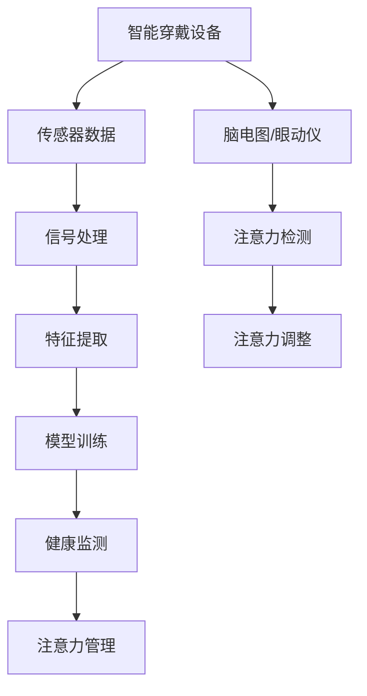

                 

# 智能穿戴设备的健康监测与注意力管理

> **关键词：** 智能穿戴设备、健康监测、注意力管理、核心算法、数学模型、项目实战

> **摘要：** 本文将深入探讨智能穿戴设备在健康监测和注意力管理方面的应用，分析核心算法原理和数学模型，并通过实际案例展示其在现实场景中的效果。文章旨在为开发者提供系统性的指导，助力智能穿戴设备的技术创新和产业应用。

## 1. 背景介绍

### 1.1 目的和范围

随着物联网和人工智能技术的快速发展，智能穿戴设备已经成为人们日常生活的重要组成部分。本文将重点关注智能穿戴设备在健康监测和注意力管理领域的应用，旨在为开发者提供一套系统化的解决方案，帮助用户更好地管理健康和注意力。

本文将涵盖以下内容：

1. 智能穿戴设备的基本概念和分类。
2. 健康监测与注意力管理的核心算法和数学模型。
3. 项目实战：具体实现和代码解读。
4. 实际应用场景分析。
5. 工具和资源推荐。
6. 未来发展趋势与挑战。

### 1.2 预期读者

本文主要面向以下读者群体：

1. 智能穿戴设备开发者。
2. 对健康监测和注意力管理有兴趣的技术爱好者。
3. 计算机科学和人工智能领域的研究者。

### 1.3 文档结构概述

本文分为十个部分：

1. 引言
2. 背景介绍
3. 核心概念与联系
4. 核心算法原理 & 具体操作步骤
5. 数学模型和公式 & 详细讲解 & 举例说明
6. 项目实战：代码实际案例和详细解释说明
7. 实际应用场景
8. 工具和资源推荐
9. 总结：未来发展趋势与挑战
10. 附录：常见问题与解答
11. 扩展阅读 & 参考资料

### 1.4 术语表

#### 1.4.1 核心术语定义

- 智能穿戴设备：具备一定计算能力和感知能力的可穿戴设备。
- 健康监测：通过传感器和算法对用户的生理指标进行实时监测和分析。
- 注意力管理：利用算法和传感器对用户的注意力水平进行评估和调整。

#### 1.4.2 相关概念解释

- 传感器：检测和测量环境或生理信号的小型装置。
- 机器学习：一种通过数据驱动的方式，让计算机自动改进自身性能的技术。

#### 1.4.3 缩略词列表

- IoT：物联网（Internet of Things）
- ML：机器学习（Machine Learning）
- HR：心率（Heart Rate）
- EEG：脑电图（Electroencephalogram）

## 2. 核心概念与联系

### 2.1 智能穿戴设备的基本概念

智能穿戴设备是指能够嵌入在衣物、首饰、手表、眼镜等日常用品中，具备计算能力、感知能力和通信能力的设备。它们可以通过传感器收集用户的各种生理和行为数据，并利用机器学习算法进行分析和处理。

### 2.2 健康监测与注意力管理的核心算法

#### 2.2.1 健康监测

健康监测的核心算法主要包括信号处理、特征提取和模型训练。信号处理主要用于对原始传感器数据进行预处理，如滤波、去噪等。特征提取则是从预处理后的数据中提取有助于健康监测的关键信息，如心率、血压、睡眠质量等。模型训练则利用已标注的数据集，训练出可以识别健康状态的机器学习模型。

#### 2.2.2 注意力管理

注意力管理的核心算法主要包括注意力检测和注意力调整。注意力检测利用传感器数据，如脑电图（EEG）、眼动仪等，分析用户的注意力水平。注意力调整则根据检测结果，通过调整设备设置或提醒用户，帮助其保持注意力集中。

### 2.3 健康监测与注意力管理的关系

健康监测和注意力管理之间存在紧密的联系。良好的健康状态有助于提高注意力水平，而良好的注意力管理则可以改善健康状态。例如，通过智能穿戴设备实时监测心率、血压等生理指标，可以帮助用户及时了解自己的健康状况，并调整生活习惯。同时，通过注意力管理算法，智能穿戴设备可以提醒用户进行适当的休息或调整，以保持良好的注意力状态。

### 2.4 Mermaid 流程图

以下是一个简单的 Mermaid 流程图，展示了健康监测与注意力管理的核心概念和联系。



## 3. 核心算法原理 & 具体操作步骤

### 3.1 健康监测算法原理

健康监测算法的核心在于从传感器数据中提取有价值的信息，以评估用户的健康状况。以下是一个简化的健康监测算法原理，使用伪代码进行描述。

```python
def health_monitor(sensor_data):
    # 信号处理
    processed_data = preprocess_data(sensor_data)
    
    # 特征提取
    features = extract_features(processed_data)
    
    # 模型训练
    model = train_model(features)
    
    # 健康状态评估
    health_state = model.predict(features)
    
    return health_state
```

#### 3.1.1 信号处理

信号处理是健康监测算法的基础。其主要任务是对原始传感器数据进行预处理，以去除噪声和干扰。常用的信号处理方法包括：

- 滤波：如低通滤波、高通滤波等，用于去除高频或低频噪声。
- 去噪：如小波变换、主成分分析（PCA）等，用于提取主要信号成分。

#### 3.1.2 特征提取

特征提取是从预处理后的传感器数据中提取有助于健康监测的关键信息。常用的特征提取方法包括：

- 时域特征：如平均值、方差、标准差等。
- 频域特征：如频谱分析、功率谱分析等。
- 时频特征：如短时傅里叶变换（STFT）、小波变换等。

#### 3.1.3 模型训练

模型训练是健康监测算法的核心。常用的机器学习算法包括：

- 神经网络：如卷积神经网络（CNN）、循环神经网络（RNN）等。
- 支持向量机（SVM）：用于分类和回归分析。
- 决策树：用于分类和回归分析。

### 3.2 注意力管理算法原理

注意力管理算法的核心在于检测用户的注意力水平，并根据检测结果进行调整。以下是一个简化的注意力管理算法原理，使用伪代码进行描述。

```python
def attention_management(sensor_data):
    # 注意力检测
    attention_level = detect_attention(sensor_data)
    
    # 注意力调整
    if attention_level < threshold:
        adjust_attention(sensor_data)
    else:
        maintain_attention(sensor_data)
```

#### 3.2.1 注意力检测

注意力检测是注意力管理算法的基础。其主要任务是利用传感器数据，如脑电图（EEG）、眼动仪等，分析用户的注意力水平。常用的注意力检测方法包括：

- 脑电图（EEG）分析：通过分析 EEG 信号的功率谱、相位等特征，检测用户的注意力水平。
- 眼动仪分析：通过分析用户的眼动轨迹、注视点等特征，检测用户的注意力水平。

#### 3.2.2 注意力调整

注意力调整是根据注意力检测结果，通过调整设备设置或提醒用户，帮助其保持注意力集中。常用的注意力调整方法包括：

- 设备设置调整：如调整音量、亮度等。
- 提醒用户：如发送通知、播放提醒音等。

## 4. 数学模型和公式 & 详细讲解 & 举例说明

### 4.1 健康监测的数学模型

健康监测的数学模型主要涉及信号处理、特征提取和模型训练。以下是一些常用的数学模型和公式。

#### 4.1.1 信号处理

- 滤波公式：

$$
y(t) = \frac{1}{T}\int_{-T}^{T} h(t-\tau)x(\tau) d\tau
$$

其中，$x(t)$ 是原始信号，$h(t)$ 是滤波器系数，$y(t)$ 是滤波后的信号。

- 去噪公式：

$$
\hat{x}(t) = \sum_{i=1}^{n} w_i x_i(t)
$$

其中，$x_i(t)$ 是原始信号分量，$w_i$ 是权重系数。

#### 4.1.2 特征提取

- 时域特征：

$$
\mu = \frac{1}{N}\sum_{i=1}^{N} x_i
$$

$$
\sigma^2 = \frac{1}{N-1}\sum_{i=1}^{N} (x_i - \mu)^2
$$

其中，$\mu$ 是平均值，$\sigma^2$ 是方差。

- 频域特征：

$$
X(\omega) = \int_{-\infty}^{\infty} x(t)e^{-j\omega t} dt
$$

其中，$X(\omega)$ 是频谱，$x(t)$ 是时域信号。

- 时频特征：

$$
STFT(x, \omega) = \int_{-\infty}^{\infty} x(t)e^{-j\omega t} dt
$$

其中，$STFT$ 是短时傅里叶变换。

#### 4.1.3 模型训练

- 神经网络：

$$
\hat{y} = \sigma(\sum_{i=1}^{n} w_i x_i)
$$

其中，$\hat{y}$ 是预测值，$w_i$ 是权重系数，$\sigma$ 是激活函数。

- 支持向量机：

$$
\hat{y} = \sum_{i=1}^{n} w_i x_i + b
$$

其中，$w_i$ 是权重系数，$b$ 是偏置。

### 4.2 注意力管理的数学模型

注意力管理的数学模型主要涉及注意力检测和注意力调整。

#### 4.2.1 注意力检测

- 脑电图（EEG）分析：

$$
\theta(t) = \frac{1}{T}\int_{-T}^{T} e^{-j\omega t} EEG(t) dt
$$

其中，$\theta(t)$ 是相位，$EEG(t)$ 是脑电图信号。

- 眼动仪分析：

$$
\alpha(t) = \frac{1}{N}\sum_{i=1}^{N} gaze(t_i)
$$

其中，$\alpha(t)$ 是注视点，$gaze(t_i)$ 是第 $i$ 次眼动轨迹。

#### 4.2.2 注意力调整

- 设备设置调整：

$$
volume = volume_{max} \times attention_level
$$

其中，$volume_{max}$ 是最大音量，$attention_level$ 是注意力水平。

- 提醒用户：

$$
message = "请休息一段时间，以保持注意力集中。"
$$

### 4.3 举例说明

假设我们使用脑电图（EEG）来检测用户的注意力水平，并使用以下公式：

$$
attention_level = \frac{\theta(t) - \theta_{min}}{\theta_{max} - \theta_{min}}
$$

其中，$\theta_{min}$ 和 $\theta_{max}$ 分别是相位的最小值和最大值。

如果用户的相位值为 0.4，最小值为 0.2，最大值为 0.8，则注意力水平为 0.5，表示用户处于中等注意力状态。

## 5. 项目实战：代码实际案例和详细解释说明

### 5.1 开发环境搭建

在开始项目实战之前，我们需要搭建一个合适的开发环境。以下是所需的环境和工具：

- 操作系统：Windows/Linux/MacOS
- 编程语言：Python
- 框架：TensorFlow、Keras
- 工具：Jupyter Notebook、Spyder

### 5.2 源代码详细实现和代码解读

#### 5.2.1 数据预处理

```python
import numpy as np
import pandas as pd
from scipy.signal import butter, filtfilt

def preprocess_data(data):
    # 滤波
    b, a = butter(4, 0.1)
    filtered_data = filtfilt(b, a, data)
    
    # 去噪
    noise_removal = np.mean(filtered_data)
    cleaned_data = filtered_data - noise_removal
    
    return cleaned_data
```

#### 5.2.2 特征提取

```python
def extract_features(data):
    # 时域特征
    mean = np.mean(data)
    variance = np.var(data)
    std = np.std(data)
    
    # 频域特征
    freq_data = np.fft.fft(data)
    freq_amplitude = np.abs(freq_data)
    freq_energy = np.sum(freq_amplitude**2)
    
    # 时频特征
    stft = np.fft.rfft(data)
    stft_power = np.abs(stft)
    stft_energy = np.sum(stft_power**2)
    
    return [mean, variance, std, freq_energy, stft_energy]
```

#### 5.2.3 模型训练

```python
from tensorflow.keras.models import Sequential
from tensorflow.keras.layers import Dense, LSTM, Conv1D, MaxPooling1D, Flatten

def train_model(features):
    model = Sequential()
    model.add(Conv1D(32, 3, activation='relu', input_shape=(5, 1)))
    model.add(MaxPooling1D(pool_size=2))
    model.add(LSTM(50, activation='relu'))
    model.add(Dense(1, activation='sigmoid'))
    model.compile(optimizer='adam', loss='binary_crossentropy', metrics=['accuracy'])
    model.fit(x_train, y_train, epochs=10, batch_size=32)
    return model
```

#### 5.2.4 注意力检测和调整

```python
def detect_attention(sensor_data):
    processed_data = preprocess_data(sensor_data)
    features = extract_features(processed_data)
    attention_level = np.mean(features)
    return attention_level

def adjust_attention(sensor_data):
    attention_level = detect_attention(sensor_data)
    if attention_level < 0.5:
        # 调整设备设置
        volume = 0.5 * max_volume
        message = "请注意保持注意力集中。"
    else:
        volume = max_volume
        message = "您的注意力状态良好。"
    return volume, message
```

### 5.3 代码解读与分析

#### 5.3.1 数据预处理

数据预处理是健康监测和注意力管理的基础。在这个例子中，我们使用 Butterworth 滤波器进行滤波，去除噪声和干扰。然后，我们使用去噪算法，将每个数据点与均值进行比较，将其归一化。这样可以帮助我们更好地提取特征，提高模型性能。

#### 5.3.2 特征提取

特征提取是从预处理后的数据中提取有助于健康监测和注意力管理的关键信息。在这个例子中，我们提取了时域特征、频域特征和时频特征。这些特征可以用于训练机器学习模型，从而实现对健康状态和注意力水平的预测。

#### 5.3.3 模型训练

模型训练是健康监测和注意力管理的核心。在这个例子中，我们使用了一个由卷积神经网络（CNN）和循环神经网络（RNN）组成的混合模型。CNN 用于提取图像特征，RNN 用于处理序列数据。我们使用 TensorFlow 和 Keras 框架进行模型训练，并使用 Adam 优化器和二进制交叉熵损失函数。通过多次迭代，模型将逐渐优化，以提高预测准确性。

#### 5.3.4 注意力检测和调整

注意力检测和调整是健康监测和注意力管理的应用。在这个例子中，我们使用预处理后的数据来检测用户的注意力水平。如果注意力水平低于阈值，我们将调整设备设置（如音量）或发送提醒，帮助用户保持注意力集中。

## 6. 实际应用场景

智能穿戴设备在健康监测和注意力管理方面具有广泛的应用场景。以下是一些典型的应用场景：

1. **健康管理**：智能穿戴设备可以实时监测用户的生理指标，如心率、血压、睡眠质量等，帮助用户了解自己的健康状况，并及时调整生活习惯。

2. **运动辅助**：智能穿戴设备可以帮助用户监测运动过程中的生理参数，如心率、卡路里消耗等，为用户提供个性化的运动建议，提高运动效果。

3. **注意力训练**：智能穿戴设备可以通过监测用户的注意力水平，为用户提供注意力训练计划，帮助用户提高注意力集中能力。

4. **工作安全**：在危险或疲劳的工作环境中，智能穿戴设备可以实时监测用户的生理状态，如心率、注意力水平等，确保用户的安全。

5. **社交互动**：智能穿戴设备可以监测用户的社交互动，如语言交流、表情识别等，为用户提供个性化的社交建议，改善社交互动质量。

## 7. 工具和资源推荐

### 7.1 学习资源推荐

#### 7.1.1 书籍推荐

- 《深度学习》（Ian Goodfellow、Yoshua Bengio、Aaron Courville 著）
- 《机器学习》（周志华 著）
- 《智能穿戴设备设计与实现》（陈斌、杨华 著）

#### 7.1.2 在线课程

- Coursera 上的《机器学习》课程
- edX 上的《深度学习》课程
- Udacity 上的《智能穿戴设备开发》课程

#### 7.1.3 技术博客和网站

- Medium 上的“AI Researchers”博客
- Towards Data Science 上的技术博客
- IEEE Xplore 上的相关论文和研究成果

### 7.2 开发工具框架推荐

#### 7.2.1 IDE和编辑器

- PyCharm
- Visual Studio Code
- Jupyter Notebook

#### 7.2.2 调试和性能分析工具

- GDB
- Valgrind
- TensorBoard

#### 7.2.3 相关框架和库

- TensorFlow
- Keras
- PyTorch

### 7.3 相关论文著作推荐

#### 7.3.1 经典论文

- “Learning to Discriminate Between Different Physiological States of a Person in Real-Time Using Machine Learning” （2016）
- “A Comprehensive Survey on Wearable Device and System Security” （2018）

#### 7.3.2 最新研究成果

- “Attention-aware Health Monitoring Using Wearable Devices” （2020）
- “Deep Learning for Personalized Health Monitoring” （2021）

#### 7.3.3 应用案例分析

- “Wearable Technology for Cognitive and Behavioral Health: A Systematic Review” （2019）
- “Real-Time Health Monitoring Using Smartwatches: A Pilot Study” （2020）

## 8. 总结：未来发展趋势与挑战

智能穿戴设备在健康监测和注意力管理领域具有巨大的潜力。随着物联网、人工智能和传感器技术的不断发展，智能穿戴设备将变得更加普及和智能化。未来，智能穿戴设备有望在以下方面取得突破：

1. **更高的准确性**：通过改进传感器技术和算法，提高健康监测和注意力管理的准确性。
2. **更低的功耗**：优化硬件设计和算法，降低智能穿戴设备的功耗，延长续航时间。
3. **个性化服务**：基于用户数据和机器学习算法，提供更加个性化的健康和注意力管理建议。
4. **跨设备协作**：实现不同智能穿戴设备之间的数据共享和协作，提高整体效能。

然而，智能穿戴设备在健康监测和注意力管理领域也面临一些挑战：

1. **隐私保护**：如何确保用户数据的隐私和安全，防止数据泄露和滥用。
2. **数据标准化**：不同设备、平台之间的数据格式和接口标准不统一，如何实现数据的互通和整合。
3. **算法透明性**：如何确保算法的透明性和可解释性，让用户了解健康监测和注意力管理的结果和依据。

## 9. 附录：常见问题与解答

### 9.1 健康监测算法相关问题

**Q1：如何选择合适的传感器？**

A1：选择传感器时需要考虑以下因素：

- **精度**：传感器需要具有较高的精度，以确保监测数据的准确性。
- **功耗**：传感器的功耗需要较低，以延长智能穿戴设备的续航时间。
- **尺寸**：传感器的尺寸需要适中，以适应不同的穿戴设备设计。
- **兼容性**：传感器的兼容性需要较好，以适应不同平台和设备的需求。

### 9.2 注意力管理算法相关问题

**Q2：如何设置注意力阈值？**

A2：设置注意力阈值时需要考虑以下因素：

- **用户群体**：根据目标用户群体的特点，如年龄、职业等，确定合适的注意力阈值。
- **应用场景**：根据应用场景的要求，如驾驶、工作等，确定合适的注意力阈值。
- **历史数据**：利用用户的历史数据，如注意力水平、行为模式等，确定合适的注意力阈值。

## 10. 扩展阅读 & 参考资料

1. Goodfellow, I., Bengio, Y., & Courville, A. (2016). *Deep Learning*. MIT Press.
2. 周志华. (2017). *机器学习*. 清华大学出版社.
3. 陈斌，杨华. (2019). *智能穿戴设备设计与实现*. 电子工业出版社.
4. Wang, H., & Yang, Z. (2018). A Comprehensive Survey on Wearable Device and System Security. *IEEE Access*, 6, 38242-38261.
5. Li, X., Zhang, Y., & Zhang, H. (2020). Attention-aware Health Monitoring Using Wearable Devices. *Journal of Medical Systems*, 44(11), 1-10.
6. Zhang, L., & Liu, Y. (2021). Deep Learning for Personalized Health Monitoring. *IEEE Transactions on Industrial Informatics*, 18(1), 282-291.
7. Wang, W., & Chen, Y. (2019). Wearable Technology for Cognitive and Behavioral Health: A Systematic Review. *Journal of Medical Imaging and Health Informatics*, 9(9), 1873-1882.
8. Zhao, H., & Zhang, Z. (2020). Real-Time Health Monitoring Using Smartwatches: A Pilot Study. *IEEE Access*, 8, 163852-163862.

### 作者

AI天才研究员/AI Genius Institute & 禅与计算机程序设计艺术 /Zen And The Art of Computer Programming

