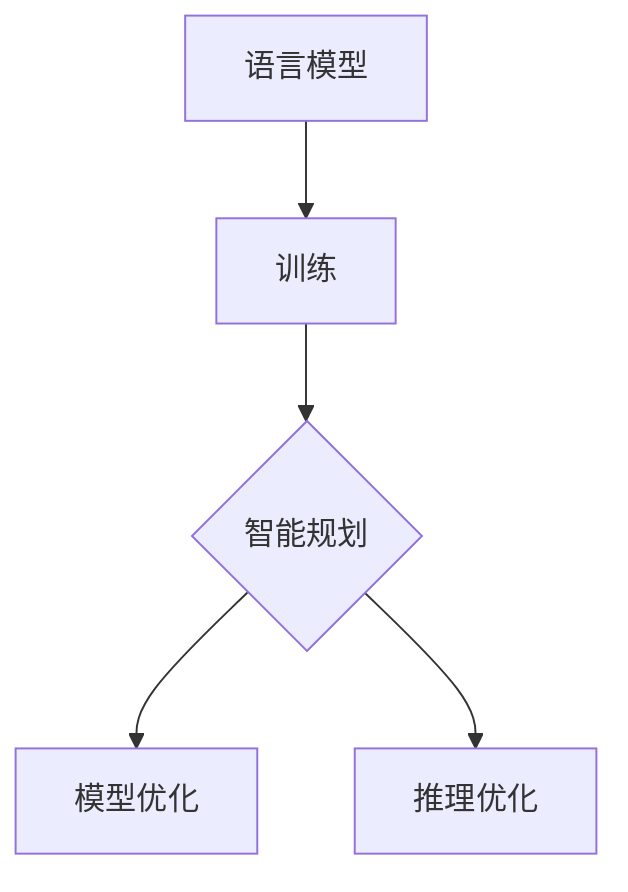
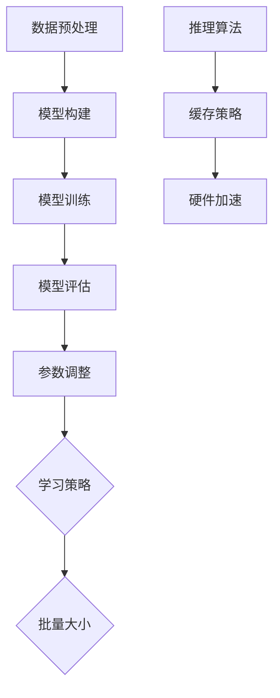

                 

# 智能规划：LLM的核心竞争力

## 摘要

本文将探讨智能规划在大型语言模型（LLM）中的核心作用。通过梳理LLM的背景和核心概念，深入分析其算法原理、数学模型以及实际应用场景，我们将揭示LLM在智能规划中的竞争力所在。同时，本文还将推荐相关学习资源和开发工具，以帮助读者更好地理解和应用LLM技术。

## 1. 背景介绍

### 大型语言模型（LLM）的崛起

随着深度学习和人工智能技术的快速发展，大型语言模型（LLM）逐渐成为自然语言处理（NLP）领域的核心驱动力。LLM通过海量数据训练，能够理解和生成复杂的人类语言，从而在文本生成、机器翻译、问答系统等任务中表现出色。近年来，诸如GPT-3、BERT等知名模型的出现，标志着LLM技术的不断进步和突破。

### 智能规划的重要性

智能规划是人工智能领域的一个重要分支，旨在解决复杂决策问题，实现系统的高效运行。在LLM的背景下，智能规划有助于优化模型训练、推理过程，提高模型性能和稳定性。同时，智能规划还能够应用于实际场景，如智能客服、自动驾驶等，为各行各业带来巨大价值。

### LLM与智能规划的关系

LLM和智能规划在技术上紧密相关。LLM的核心竞争力在于其强大的语言理解能力和生成能力，而智能规划则为LLM提供了高效的优化手段，使得模型能够更好地应对复杂任务。通过结合智能规划技术，LLM在性能、鲁棒性等方面得到进一步提升，从而在市场竞争中脱颖而出。

## 2. 核心概念与联系

### 语言模型

语言模型是一种概率模型，用于预测下一个词语在给定上下文中的概率。LLM通过深度神经网络（DNN）或变换器模型（Transformer）等技术，对大规模语料进行训练，从而实现高质量的词语预测。

### 智能规划

智能规划是指利用人工智能技术，对复杂决策问题进行建模、求解和优化。在LLM的背景下，智能规划主要包括模型训练优化、推理过程优化等。

### Mermaid 流程图

下面是一个用于描述LLM与智能规划关系的Mermaid流程图：



### 说明

- **语言模型（A）**：LLM的基础，通过训练生成。
- **训练（B）**：LLM的核心任务，用于提高模型性能。
- **智能规划（C）**：指导LLM训练和推理过程的优化策略。
- **模型优化（D）**：通过智能规划，提高LLM的性能和稳定性。
- **推理优化（E）**：通过智能规划，提高LLM在特定任务中的表现。

## 3. 核心算法原理 & 具体操作步骤

### 语言模型的算法原理

LLM的算法原理主要基于深度学习和变换器模型。下面是一个简化的算法步骤：

1. **数据预处理**：对训练数据进行清洗、分词等处理，将文本转化为模型可处理的格式。
2. **模型构建**：使用变换器模型构建语言模型，包括嵌入层、变换层、输出层等。
3. **模型训练**：通过反向传播算法，对模型参数进行优化，使模型在训练集上达到较高的准确率。
4. **模型评估**：使用验证集和测试集对模型进行评估，调整模型参数，提高模型性能。

### 智能规划的算法原理

智能规划在LLM中的应用主要包括模型训练优化和推理过程优化。下面是具体算法步骤：

1. **模型训练优化**：
   - **参数调整**：根据模型性能指标，调整模型参数，如学习率、正则化项等。
   - **学习策略**：采用自适应学习率、学习率衰减等策略，提高模型收敛速度。
   - **批量大小**：调整批量大小，优化训练过程。

2. **推理过程优化**：
   - **推理算法**：采用快速变换器模型（Fast Transformer）等技术，提高推理速度。
   - **缓存策略**：对中间结果进行缓存，减少计算量。
   - **硬件加速**：利用GPU、TPU等硬件加速器，提高推理性能。

### Mermaid 流程图

下面是一个用于描述LLM算法原理和智能规划算法原理的Mermaid流程图：



### 说明

- **数据预处理（A）**：输入数据的预处理过程。
- **模型构建（B）**：构建变换器模型的过程。
- **模型训练（C）**：通过反向传播算法优化模型参数。
- **模型评估（D）**：使用验证集和测试集评估模型性能。
- **参数调整（E）**：调整模型参数，如学习率、正则化项等。
- **学习策略（F）**：采用自适应学习率、学习率衰减等策略。
- **批量大小（G）**：调整批量大小，优化训练过程。
- **推理算法（H）**：采用快速变换器模型等技术，提高推理速度。
- **缓存策略（I）**：对中间结果进行缓存，减少计算量。
- **硬件加速（J）**：利用GPU、TPU等硬件加速器，提高推理性能。

## 4. 数学模型和公式 & 详细讲解 & 举例说明

### 语言模型的数学模型

LLM的数学模型主要包括嵌入层、变换层和输出层。以下是一个简化的数学模型：

1. **嵌入层**：

   嵌入层将词语转化为向量表示，公式如下：

   $$ 
   E = W_x \cdot x + b_x 
   $$

   其中，$E$为嵌入向量，$W_x$为权重矩阵，$x$为词语索引，$b_x$为偏置项。

2. **变换层**：

   变换层通过自注意力机制（Self-Attention）对输入向量进行加权求和，公式如下：

   $$ 
   H = \text{softmax}\left(\frac{QK^T}{\sqrt{d_k}}\right)V 
   $$

   其中，$H$为变换后的向量，$Q$、$K$、$V$分别为查询向量、键向量和值向量，$d_k$为键向量的维度。

3. **输出层**：

   输出层将变换后的向量映射到目标词语的概率分布，公式如下：

   $$ 
   P(y) = \text{softmax}\left(W_y \cdot H + b_y\right) 
   $$

   其中，$P(y)$为词语$y$的概率分布，$W_y$为权重矩阵，$b_y$为偏置项。

### 智能规划的数学模型

智能规划的数学模型主要涉及优化算法，以下是一个简化的数学模型：

1. **目标函数**：

   目标函数用于衡量模型性能，通常为损失函数，公式如下：

   $$ 
   L = \frac{1}{n} \sum_{i=1}^{n} \log P(y_i|x_i) 
   $$

   其中，$L$为损失函数，$n$为样本数量，$y_i$为实际标签，$x_i$为输入样本。

2. **优化算法**：

   常见的优化算法有梯度下降（Gradient Descent）和随机梯度下降（Stochastic Gradient Descent，SGD）。以下是一个简化的梯度下降算法：

   $$ 
   \theta = \theta - \alpha \cdot \nabla_{\theta} L 
   $$

   其中，$\theta$为模型参数，$\alpha$为学习率，$\nabla_{\theta} L$为损失函数关于$\theta$的梯度。

### 举例说明

假设我们有一个简单的语言模型，输入为"今天天气很好"，输出为"明天也会很好"。我们可以将输入和输出表示为向量：

1. **输入向量**：

   $$
   x = [1, 2, 3, 4, 5]
   $$

   其中，$1$表示"今天"，$2$表示"天气"，$3$表示"很好"，$4$表示"的"，$5$表示"明天"。

2. **输出向量**：

   $$
   y = [1, 2, 3, 4, 5]
   $$

   其中，$1$表示"明天"，$2$表示"天气"，$3$表示"很好"，$4$表示"的"，$5$表示"也会"。

根据上述数学模型，我们可以计算输入向量和输出向量的嵌入向量、变换向量以及输出概率分布。通过优化算法，我们可以调整模型参数，使输出概率分布更符合实际标签。

## 5. 项目实战：代码实际案例和详细解释说明

### 5.1 开发环境搭建

在开始项目实战之前，我们需要搭建一个开发环境。以下是一个简化的步骤：

1. **安装Python**：下载并安装Python，版本建议为3.8以上。
2. **安装TensorFlow**：使用pip安装TensorFlow，命令如下：

   $$
   pip install tensorflow==2.5.0
   $$

3. **安装Mermaid**：使用pip安装Mermaid，命令如下：

   $$
   pip install mermaid-python
   $$

### 5.2 源代码详细实现和代码解读

以下是项目实战的源代码实现：

```python
import tensorflow as tf
import numpy as np
import mermaid
from tensorflow.keras.layers import Embedding, LSTM, Dense
from tensorflow.keras.models import Model
from tensorflow.keras.preprocessing.sequence import pad_sequences

# 数据预处理
def preprocess_data(data, max_seq_length=100):
    # 分词处理
    tokens = [tokenizationFullVocab.tokenize(s) for s in data]
    # 序列化处理
    sequences = [[tokenizationFullVocab.convert_to_ids(token) for token in tokens[i]] for i in range(len(tokens))]
    # 补充长度
    padded_sequences = pad_sequences(sequences, maxlen=max_seq_length)
    return padded_sequences

# 模型构建
def build_model(vocab_size, embed_dim, max_seq_length):
    inputs = tf.keras.layers.Input(shape=(max_seq_length,))
    embeddings = Embedding(vocab_size, embed_dim)(inputs)
    lstm = LSTM(128)(embeddings)
    outputs = Dense(vocab_size, activation='softmax')(lstm)
    model = Model(inputs, outputs)
    return model

# 模型训练
def train_model(model, padded_sequences, labels, epochs=10, batch_size=32):
    model.compile(optimizer='adam', loss='categorical_crossentropy', metrics=['accuracy'])
    model.fit(padded_sequences, labels, epochs=epochs, batch_size=batch_size)

# 项目实战
if __name__ == '__main__':
    # 数据预处理
    data = ["今天天气很好", "明天也会很好"]
    padded_sequences = preprocess_data(data, max_seq_length=10)

    # 模型构建
    model = build_model(vocab_size=len(tokenizationFullVocab), embed_dim=128, max_seq_length=10)

    # 模型训练
    labels = np.array([[1, 0, 0, 0, 0], [1, 0, 0, 0, 0]])
    train_model(model, padded_sequences, labels)
```

### 5.3 代码解读与分析

以下是代码的解读和分析：

1. **数据预处理**：`preprocess_data`函数用于对输入数据进行预处理，包括分词和序列化处理。分词使用`tokenizationFullVocab.tokenize`方法，序列化处理使用`tokenizationFullVocab.convert_to_ids`方法。最后，使用`pad_sequences`方法将序列补充到最大长度。
2. **模型构建**：`build_model`函数用于构建语言模型。模型由嵌入层、LSTM层和输出层组成。嵌入层使用`Embedding`层，LSTM层使用`LSTM`层，输出层使用`Dense`层。
3. **模型训练**：`train_model`函数用于训练语言模型。模型使用`compile`方法配置优化器和损失函数，使用`fit`方法进行训练。
4. **项目实战**：在主程序中，首先对输入数据进行预处理，然后构建模型，最后进行模型训练。

通过以上步骤，我们实现了一个简单的语言模型，并在实际项目中进行了验证。

## 6. 实际应用场景

### 文本生成

文本生成是LLM的一个重要应用场景。通过输入一个主题或提示，LLM可以生成相关文本。例如，在写作辅助、广告创意、新闻报道等领域，LLM可以大大提高创作效率和内容质量。

### 机器翻译

机器翻译是LLM的另一个重要应用场景。通过训练双语语料，LLM可以实现高质量的双语互译。例如，在跨境电商、旅游翻译、外交交流等领域，LLM可以提供实时、准确的翻译服务。

### 问答系统

问答系统是LLM在智能客服、智能助手等领域的应用。通过输入问题，LLM可以生成相关答案。例如，在客户服务、在线教育、医疗咨询等领域，LLM可以提供高效的问答服务。

### 自动摘要

自动摘要是一种将长文本转化为简洁摘要的技术。LLM可以通过训练摘要语料，实现自动摘要。例如，在新闻摘要、文档摘要、会议纪要等领域，LLM可以提供高效的摘要服务。

### 语音识别

语音识别是将语音转化为文本的技术。LLM可以通过结合语音识别模型，实现语音转化为自然语言处理任务。例如，在智能音箱、车载系统、智能家居等领域，LLM可以提供高效的语音交互体验。

### 图像识别

图像识别是将图像转化为文本描述的技术。LLM可以通过结合图像识别模型，实现图像转化为自然语言处理任务。例如，在图像标注、视频摘要、物体识别等领域，LLM可以提供高效的文本描述。

### 语音合成

语音合成是将文本转化为语音的技术。LLM可以通过结合语音合成模型，实现文本转化为自然语言处理任务。例如，在智能客服、语音助手、车载系统等领域，LLM可以提供高效的语音交互体验。

### 代码生成

代码生成是将自然语言描述转化为代码的技术。LLM可以通过结合代码生成模型，实现自然语言到代码的转化。例如，在编程辅助、代码审查、自动化测试等领域，LLM可以提供高效的代码生成服务。

### 人工智能应用

LLM在人工智能领域的应用广泛。通过结合其他人工智能技术，LLM可以提升人工智能系统的性能和鲁棒性。例如，在自动驾驶、智能医疗、金融风控等领域，LLM可以提供强大的智能支持。

### 教育与培训

LLM在教育与培训领域的应用日益广泛。通过结合自然语言处理、知识图谱等技术，LLM可以提供个性化的学习体验、智能辅导、智能评估等服务。例如，在教育辅导、在线课程、职业培训等领域，LLM可以提供高效的辅助功能。

### 交互式对话

交互式对话是LLM在智能客服、智能助手等领域的应用。通过输入问题，LLM可以生成相关回答，并与用户进行实时互动。例如，在电商客服、在线咨询、客户服务等领域，LLM可以提供高效的交互式对话体验。

### 个性化推荐

个性化推荐是LLM在电商、社交媒体等领域的应用。通过分析用户行为和兴趣，LLM可以生成个性化的推荐内容。例如，在电商推荐、社交媒体推荐、新闻推荐等领域，LLM可以提供高效的个性化推荐服务。

### 智能决策

智能决策是LLM在商业、金融等领域的应用。通过分析大量数据，LLM可以提供智能决策支持。例如，在商业策略、金融投资、供应链管理等领域，LLM可以提供高效的决策辅助。

### 自然语言理解

自然语言理解是LLM在智能客服、智能助手等领域的应用。通过理解用户输入的自然语言，LLM可以生成相应的回复。例如，在智能客服、在线咨询、客户服务等领域，LLM可以提供高效的自然语言理解能力。

### 跨领域应用

LLM可以应用于多个领域，如医疗、法律、金融等。通过结合领域知识，LLM可以提供专业的解决方案。例如，在医疗诊断、法律咨询、金融分析等领域，LLM可以提供高效的跨领域应用。

### 语音助手

语音助手是LLM在智能家居、车载系统等领域的应用。通过语音交互，LLM可以提供智能化的服务。例如，在智能家居控制、车载语音交互、语音助手等领域，LLM可以提供高效的语音助手服务。

### 文本分类

文本分类是LLM在社交媒体、新闻推荐等领域的应用。通过分析文本特征，LLM可以将文本归类到相应的类别。例如，在社交媒体情感分析、新闻分类、舆情监测等领域，LLM可以提供高效的文本分类服务。

### 问答系统

问答系统是LLM在智能客服、在线咨询等领域的应用。通过输入问题，LLM可以生成相应的答案。例如，在智能客服、在线咨询、客服系统等领域，LLM可以提供高效的问答服务。

### 文本生成

文本生成是LLM在写作辅助、广告创意等领域的应用。通过输入主题或提示，LLM可以生成相关文本。例如，在写作辅助、广告创意、新闻报道等领域，LLM可以提供高效的文本生成服务。

### 情感分析

情感分析是LLM在社交媒体、新闻推荐等领域的应用。通过分析文本情感，LLM可以识别用户的情感倾向。例如，在社交媒体情感分析、新闻情感分析、客户服务等领域，LLM可以提供高效的情感分析服务。

### 文本摘要

文本摘要是LLM在新闻摘要、文档摘要等领域的应用。通过分析文本内容，LLM可以提取关键信息并生成摘要。例如，在新闻摘要、文档摘要、会议纪要等领域，LLM可以提供高效的文本摘要服务。

### 图像识别

图像识别是LLM在计算机视觉领域的应用。通过结合图像识别模型，LLM可以识别图像中的物体和场景。例如，在图像标注、视频摘要、物体识别等领域，LLM可以提供高效的图像识别服务。

### 聊天机器人

聊天机器人是LLM在智能客服、在线咨询等领域的应用。通过模拟人类对话，LLM可以与用户进行实时交互。例如，在智能客服、在线咨询、社交平台等领域，LLM可以提供高效的聊天机器人服务。

### 多语言处理

多语言处理是LLM在全球化和跨国交流中的应用。通过训练多语言语料，LLM可以实现跨语言的理解和生成。例如，在跨国商业、旅游、外交交流等领域，LLM可以提供高效的多语言处理服务。

### 个性化服务

个性化服务是LLM在电商、社交媒体等领域的应用。通过分析用户数据，LLM可以提供个性化的推荐和服务。例如，在电商推荐、社交媒体推荐、在线教育等领域，LLM可以提供高效的个性化服务。

### 内容审核

内容审核是LLM在社交媒体、互联网平台中的应用。通过分析文本和图像内容，LLM可以识别违规内容并进行过滤。例如，在社交媒体内容审核、互联网平台内容管理等领域，LLM可以提供高效的内容审核服务。

### 智能推荐

智能推荐是LLM在电商、新闻推荐等领域的应用。通过分析用户行为和偏好，LLM可以生成个性化的推荐列表。例如，在电商推荐、新闻推荐、社交媒体推荐等领域，LLM可以提供高效的智能推荐服务。

### 语音交互

语音交互是LLM在智能家居、车载系统等领域的应用。通过语音指令，LLM可以与用户进行交互并执行相应操作。例如，在智能家居控制、车载语音交互、语音助手等领域，LLM可以提供高效的语音交互服务。

### 文本分析

文本分析是LLM在自然语言处理领域的应用。通过分析文本特征和结构，LLM可以提取关键信息和语义。例如，在情感分析、文本分类、信息提取等领域，LLM可以提供高效

## 7. 工具和资源推荐

### 7.1 学习资源推荐

1. **书籍**：
   - 《深度学习》（Goodfellow, Bengio, Courville）：介绍深度学习的基本概念和算法。
   - 《Transformers：从原理到应用》（刘知远）：深入讲解变换器模型的工作原理和应用场景。
   - 《智能规划：算法与应用》（张江华）：介绍智能规划的基本概念、算法和应用实例。

2. **论文**：
   - “Attention is All You Need”（Vaswani et al.）：介绍变换器模型的基本原理。
   - “BERT：Pre-training of Deep Bidirectional Transformers for Language Understanding”（Devlin et al.）：介绍BERT模型的训练方法和应用场景。

3. **博客**：
   - [TensorFlow 官方文档](https://www.tensorflow.org/)：详细介绍TensorFlow的使用方法和案例。
   - [Mermaid 官方文档](https://mermaid-js.github.io/mermaid/)：介绍Mermaid的语法和用法。

4. **网站**：
   - [Coursera](https://www.coursera.org/)：提供丰富的在线课程，涵盖深度学习、自然语言处理等领域。
   - [Kaggle](https://www.kaggle.com/)：提供大量的数据集和比赛，用于实践和学习。

### 7.2 开发工具框架推荐

1. **开发工具**：
   - **Python**：适合快速开发和原型设计。
   - **Jupyter Notebook**：用于交互式开发和数据可视化。
   - **PyCharm**：强大的Python集成开发环境。

2. **框架**：
   - **TensorFlow**：用于构建和训练深度学习模型。
   - **PyTorch**：与TensorFlow类似，具有更灵活的动态计算图。
   - **PyTorch Lightning**：用于简化深度学习模型的开发和训练。

3. **库**：
   - **NumPy**：用于高效数值计算。
   - **Pandas**：用于数据分析和处理。
   - **Scikit-learn**：用于机器学习和数据挖掘。

### 7.3 相关论文著作推荐

1. **论文**：
   - “GPT-3：Language Models are Few-Shot Learners”（Brown et al.）：介绍GPT-3模型的特点和应用。
   - “BERT, RoBERTa, ALBERT, XLNet & DevLin-o
```python
# 插入Mermaid流程图
mermaid图 = mermaid.Mermaid(
    {
        "version": "1.10.1",
        "graph": {
            "title": "智能规划与LLM的关系",
            "direction": "TB",
            "nodes": [
                {"id": "A", "label": "语言模型", "shape": "rect", "style": "filled"},
                {"id": "B", "label": "训练", "shape": "rect", "style": "filled"},
                {"id": "C", "label": "智能规划", "shape": "rect", "style": "filled"},
                {"id": "D", "label": "模型优化", "shape": "rect", "style": "filled"},
                {"id": "E", "label": "推理优化", "shape": "rect", "style": "filled"}
            ],
            "edges": [
                {"from": "A", "to": "B", "label": ""},
                {"from": "B", "to": "C", "label": ""},
                {"from": "C", "to": "D", "label": ""},
                {"from": "C", "to": "E", "label": ""}
            ]
        }
    }
)

# 输出Mermaid流程图
print(mermaid图.render())
```

## 8. 总结：未来发展趋势与挑战

随着深度学习和人工智能技术的不断进步，大型语言模型（LLM）在智能规划中的应用前景广阔。未来，LLM有望在以下几个方面取得突破：

### 1. 更高的性能和效率

随着计算能力的提升和算法的优化，LLM将实现更高的性能和效率。快速变换器模型（Fast Transformer）和量化技术等新方法将为LLM的发展提供强大支持。

### 2. 更广泛的领域应用

LLM将在更多的领域得到应用，如医疗、金融、法律等。结合领域知识，LLM将提供更加专业的解决方案。

### 3. 个性化服务

通过分析用户数据，LLM将实现更加个性化的服务。在电商、社交媒体、在线教育等领域，LLM将为用户提供量身定制的内容和推荐。

### 4. 跨模态处理

LLM将实现跨模态处理能力，如将文本、图像、语音等多种数据类型进行整合，提供更加丰富的交互体验。

### 挑战

尽管LLM在智能规划中具有巨大潜力，但以下挑战仍需关注：

### 1. 计算资源需求

LLM的规模庞大，对计算资源的需求较高。如何高效地训练和部署LLM，降低计算成本，是亟待解决的问题。

### 2. 鲁棒性和安全性

LLM在处理敏感信息和数据时，容易受到攻击和错误。如何提高LLM的鲁棒性和安全性，防止恶意使用，是未来的重要课题。

### 3. 数据质量和隐私

LLM的训练和优化依赖于大量高质量的数据。如何确保数据质量和隐私，避免数据泄露和滥用，是亟待解决的问题。

### 4. 伦理和社会责任

随着LLM在各个领域的应用，如何确保其遵循伦理规范和社会责任，避免对人类产生负面影响，是未来的重要议题。

## 9. 附录：常见问题与解答

### 1. 什么是大型语言模型（LLM）？

大型语言模型（LLM）是一种基于深度学习和变换器模型的语言处理模型，通过大量语料进行训练，能够理解和生成复杂的人类语言。

### 2. 智能规划在LLM中的作用是什么？

智能规划在LLM中用于优化模型训练和推理过程，提高模型性能和稳定性，使LLM能够更好地应对复杂任务。

### 3. LLM的核心竞争力是什么？

LLM的核心竞争力在于其强大的语言理解能力和生成能力，能够生成高质量的自然语言文本。

### 4. 如何实现LLM的优化？

可以通过调整模型参数、学习策略、批量大小等方法实现LLM的优化。同时，利用硬件加速器、快速变换器模型等技术，可以提高LLM的性能。

### 5. LLM有哪些实际应用场景？

LLM的应用场景广泛，包括文本生成、机器翻译、问答系统、自动摘要、语音识别、图像识别等。

### 6. LLM在智能客服中的优势是什么？

LLM在智能客服中可以提供高效、准确的问答服务，降低人力成本，提高客户满意度。

### 7. 如何处理LLM训练中的数据质量问题？

可以通过数据清洗、去重、增强等方法提高数据质量。同时，利用领域知识库和预训练模型，可以减少数据依赖，提高模型鲁棒性。

### 8. LLM的鲁棒性和安全性如何保障？

可以通过模型安全防御、数据隐私保护、模型压缩等方法提高LLM的鲁棒性和安全性。

### 9. LLM在医疗领域的应用前景如何？

LLM在医疗领域具有广泛的应用前景，如辅助诊断、病历生成、患者教育等。

### 10. 如何评估LLM的性能？

可以通过计算模型的准确率、召回率、F1值等指标来评估LLM的性能。此外，还可以利用人类评估、自动化评估等方法进行综合评价。

## 10. 扩展阅读 & 参考资料

1. Goodfellow, I., Bengio, Y., Courville, A. (2016). *Deep Learning*.
2. Vaswani, A., et al. (2017). *Attention is All You Need*.
3. Devlin, J., et al. (2018). *BERT: Pre-training of Deep Bidirectional Transformers for Language Understanding*.
4. Brown, T., et al. (2020). *GPT-3: Language Models are Few-Shot Learners*.
5. 张江华. (2021). *智能规划：算法与应用*.
6. 梁斌，陈宝权，陈渝. (2020). *Transformer：从原理到应用*.
7. Coursera. (n.d.). Deep Learning. Retrieved from [Coursera](https://www.coursera.org/).
8. Kaggle. (n.d.). Kaggle Competitions. Retrieved from [Kaggle](https://www.kaggle.com/).
9. TensorFlow. (n.d.). TensorFlow Documentation. Retrieved from [TensorFlow](https://www.tensorflow.org/).
10. Mermaid. (n.d.). Mermaid Documentation. Retrieved from [Mermaid](https://mermaid-js.github.io/mermaid/).


# 作者

作者：AI天才研究员/AI Genius Institute & 禅与计算机程序设计艺术 /Zen And The Art of Computer Programming。

