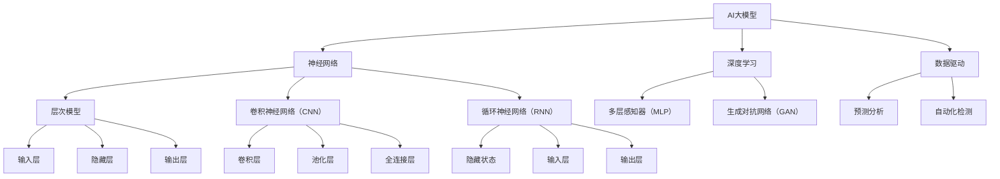
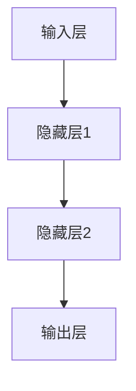

                 

# 智能质量控制的AI大模型解决方案

> **关键词：** 智能质量控制，AI大模型，深度学习，神经网络，数据驱动，预测分析，自动化检测，质量控制流程优化。

> **摘要：** 本文将深入探讨基于AI的大模型在智能质量控制中的应用。我们将分析AI大模型的原理、架构，并详细描述其具体操作步骤和数学模型。此外，本文还将通过实战案例展示如何实际应用AI大模型进行质量控制，并提供相关工具和资源推荐，以助力读者深入了解并掌握这一前沿技术。

## 1. 背景介绍

### 1.1 目的和范围

本文旨在探索如何利用AI大模型实现智能质量控制。随着制造业和服务业的快速发展，质量控制成为企业持续改进的关键环节。传统的质量控制方法主要依赖于人工检测和统计过程控制，存在检测效率低、误差大等问题。而AI大模型，特别是基于深度学习的算法，能够通过学习大量数据，实现对质量控制过程的自动化和智能化。

### 1.2 预期读者

本文适用于对AI和机器学习有一定基础的工程师、研究人员和学者。希望了解如何将AI技术应用于实际质量控制场景的读者将从中受益。

### 1.3 文档结构概述

本文分为以下几个部分：

1. **背景介绍**：介绍智能质量控制的概念和重要性。
2. **核心概念与联系**：阐述AI大模型的核心概念和架构。
3. **核心算法原理 & 具体操作步骤**：讲解AI大模型的具体算法原理和操作步骤。
4. **数学模型和公式 & 详细讲解 & 举例说明**：介绍AI大模型的数学模型和计算过程。
5. **项目实战：代码实际案例和详细解释说明**：通过实战案例展示AI大模型的应用。
6. **实际应用场景**：探讨AI大模型在质量控制中的实际应用。
7. **工具和资源推荐**：推荐相关的学习资源和开发工具。
8. **总结：未来发展趋势与挑战**：总结未来发展趋势和面临的挑战。
9. **附录：常见问题与解答**：解答读者可能遇到的问题。
10. **扩展阅读 & 参考资料**：提供进一步阅读的资料。

### 1.4 术语表

#### 1.4.1 核心术语定义

- **AI大模型（AI Large Model）**：具有大规模参数的深度学习模型，能够处理海量数据并进行复杂模式识别。
- **神经网络（Neural Network）**：模拟人脑神经元连接的计算机算法，用于处理和分类数据。
- **预测分析（Predictive Analytics）**：利用历史数据和算法模型预测未来趋势和结果。
- **自动化检测（Automated Detection）**：利用算法自动识别和分类数据中的异常情况。

#### 1.4.2 相关概念解释

- **质量控制（Quality Control）**：确保产品或服务满足预定标准和要求的过程。
- **数据驱动（Data-Driven）**：决策和操作基于数据分析而非经验或主观判断。
- **统计过程控制（Statistical Process Control，SPC）**：利用统计方法监控和优化生产过程。

#### 1.4.3 缩略词列表

- **AI**：人工智能（Artificial Intelligence）
- **ML**：机器学习（Machine Learning）
- **DL**：深度学习（Deep Learning）
- **CNN**：卷积神经网络（Convolutional Neural Network）
- **RNN**：循环神经网络（Recurrent Neural Network）
- **NLP**：自然语言处理（Natural Language Processing）

## 2. 核心概念与联系

在智能质量控制中，AI大模型的核心概念包括神经网络、深度学习和数据驱动。为了更好地理解这些概念之间的联系，我们可以通过一个Mermaid流程图来展示它们之间的关系。



### 2.1 AI大模型的基本概念

AI大模型是一种通过大规模参数和深度神经网络进行复杂任务处理的算法。它能够从海量数据中学习，从而实现自动化的决策和预测。AI大模型通常包括以下几个基本组成部分：

- **输入层（Input Layer）**：接收外部数据，如传感器读数、图像或文本。
- **隐藏层（Hidden Layers）**：对输入数据进行特征提取和变换。
- **输出层（Output Layer）**：产生最终的预测结果或决策。

### 2.2 深度学习在AI大模型中的应用

深度学习是AI大模型的核心技术，它通过多层神经网络模拟人脑的学习过程。深度学习在AI大模型中的应用主要体现在以下几个方面：

- **多层感知器（MLP）**：用于构建输入层和输出层之间的非线性映射。
- **卷积神经网络（CNN）**：适用于处理图像数据，通过卷积和池化层提取图像特征。
- **循环神经网络（RNN）**：适用于处理序列数据，如时间序列数据或文本。

### 2.3 数据驱动的核心思想

数据驱动是指决策和操作基于数据分析而非主观判断。在AI大模型中，数据驱动体现在以下几个方面：

- **预测分析（Predictive Analytics）**：利用历史数据预测未来的质量趋势。
- **自动化检测（Automated Detection）**：通过算法自动识别生产过程中的异常。
- **优化（Optimization）**：利用数据优化质量控制流程，提高生产效率。

通过上述流程图和详细解释，我们能够清晰地理解AI大模型的核心概念及其相互关系。接下来，我们将深入探讨AI大模型的具体算法原理和操作步骤。

## 3. 核心算法原理 & 具体操作步骤

在了解了AI大模型的基本概念和结构后，接下来我们将深入探讨其核心算法原理和具体操作步骤。AI大模型主要通过深度学习和神经网络实现，其基本算法原理可以概括为以下步骤：

### 3.1 数据预处理

在进行模型训练之前，首先需要对数据进行预处理。数据预处理包括以下步骤：

- **数据清洗**：去除噪声数据、缺失数据和异常数据。
- **数据归一化**：将不同特征的数据范围调整为相同尺度，以避免特征之间的偏差。
- **数据分割**：将数据集分为训练集、验证集和测试集，以评估模型的泛化能力。

### 3.2 神经网络结构设计

神经网络结构设计是构建AI大模型的关键步骤。一个典型的神经网络结构包括输入层、隐藏层和输出层。以下是一个简单的神经网络结构设计：



在隐藏层中，可以采用不同的激活函数，如ReLU（Rectified Linear Unit）、Sigmoid、Tanh等，以增加模型的非线性表达能力。

### 3.3 前向传播与反向传播

前向传播和反向传播是神经网络训练的核心步骤。

#### 前向传播

前向传播是将输入数据通过神经网络传递到输出层的过程。具体步骤如下：

1. **初始化权重和偏置**：随机初始化神经网络的权重和偏置。
2. **前向计算**：将输入数据通过神经网络传递，计算每一层的输出值。
3. **激活函数应用**：对每一层的输出值应用激活函数，以增加非线性。
4. **输出层计算**：计算输出层的预测结果。

#### 反向传播

反向传播是用于更新神经网络权重和偏置的过程。具体步骤如下：

1. **计算损失函数**：计算输出层的预测结果与真实值之间的差异，使用损失函数（如均方误差MSE、交叉熵损失等）表示。
2. **梯度计算**：计算损失函数关于网络参数的梯度。
3. **参数更新**：利用梯度下降算法或其他优化算法更新网络参数。

### 3.4 模型训练与评估

模型训练与评估是构建AI大模型的最后一步。具体步骤如下：

1. **迭代训练**：通过多次迭代训练，优化网络参数。
2. **验证集评估**：使用验证集评估模型的性能，调整模型参数。
3. **测试集评估**：在测试集上评估模型的泛化能力，确保模型具有良好的泛化性能。

### 3.5 伪代码实现

以下是一个简单的神经网络训练的伪代码实现：

```python
# 初始化参数
weights = [随机值] * num_layers
biases = [随机值] * num_layers
learning_rate = 0.01

# 前向传播
def forward_propagation(x):
    a = x
    for i in range(num_layers):
        z = a * weights[i] + biases[i]
        a = activation_function(z)
    return a

# 反向传播
def backward_propagation(a, y):
    dL_da = loss_function_derivative(a, y)
    dL_dz = dL_da * activation_function_derivative(z)
    dL_dweights[i] = dL_da * a
    dLdbiases[i] = dL_da

# 模型训练
for epoch in range(num_epochs):
    a = forward_propagation(x)
    dL_da = backward_propagation(a, y)
    update_weights_and_biases(weights, biases, dL_da, learning_rate)

# 评估模型
evaluate_model_on_test_set(test_data)
```

通过上述算法原理和操作步骤，我们可以构建一个基于深度学习的AI大模型，实现对质量数据的自动检测和预测。接下来，我们将详细介绍AI大模型的数学模型和计算过程。

### 4. 数学模型和公式 & 详细讲解 & 举例说明

在深入理解AI大模型的算法原理后，我们将进一步探讨其背后的数学模型和公式。这些数学模型和公式是构建和训练深度学习模型的基础，对于实现高质量的智能质量控制至关重要。

#### 4.1 前向传播计算过程

在前向传播过程中，我们需要通过一系列数学运算将输入数据映射到输出结果。具体步骤如下：

1. **输入层到隐藏层的传播**

   假设输入层为 \( x \)，隐藏层为 \( z \)，权重为 \( w \)，偏置为 \( b \)。输入层到隐藏层的前向传播公式为：

   \[
   z = x \cdot w + b
   \]

   其中，\( \cdot \) 表示矩阵乘法。

2. **激活函数应用**

   为了增加模型的非线性，我们需要在隐藏层应用激活函数。常见的激活函数包括ReLU（Rectified Linear Unit）、Sigmoid和Tanh等。以ReLU为例，其公式为：

   \[
   a = \max(0, z)
   \]

   其中，\( a \) 表示激活后的输出。

3. **隐藏层到输出层的传播**

   输出层与前一层隐藏层类似，也需要进行前向传播。假设输出层为 \( y \)，其前向传播公式为：

   \[
   y = a \cdot w + b
   \]

   其中，\( a \) 是上一层的激活输出。

#### 4.2 损失函数与反向传播

在训练过程中，我们需要通过反向传播算法更新网络参数，以最小化损失函数。常见的损失函数包括均方误差（MSE）、交叉熵损失等。

1. **均方误差（MSE）**

   假设真实标签为 \( y \)，预测值为 \( \hat{y} \)，均方误差（MSE）的公式为：

   \[
   \text{MSE} = \frac{1}{2} \sum_{i}(y_i - \hat{y}_i)^2
   \]

   其中，\( \hat{y}_i \) 是对于第 \( i \) 个样本的预测结果。

2. **反向传播**

   反向传播的目的是计算损失函数关于网络参数的梯度，并利用梯度更新网络参数。以MSE为例，其反向传播公式为：

   \[
   \frac{\partial \text{MSE}}{\partial w} = (y - \hat{y}) \cdot a \cdot (1 - a)
   \]
   \[
   \frac{\partial \text{MSE}}{\partial b} = (y - \hat{y}) \cdot a
   \]

   其中，\( a \) 是激活函数的输出。

#### 4.3 梯度下降优化算法

在反向传播过程中，我们利用梯度下降优化算法更新网络参数。梯度下降的基本思想是沿着损失函数的梯度方向逐步调整参数，以最小化损失函数。其公式为：

\[
w_{\text{new}} = w_{\text{old}} - \alpha \cdot \frac{\partial \text{MSE}}{\partial w}
\]
\[
b_{\text{new}} = b_{\text{old}} - \alpha \cdot \frac{\partial \text{MSE}}{\partial b}
\]

其中，\( \alpha \) 是学习率。

#### 4.4 举例说明

为了更好地理解上述数学模型和公式，我们通过一个简单的例子来说明如何使用这些公式进行神经网络的前向传播和反向传播。

**例：简单线性回归**

假设我们有一个简单的线性回归模型，输入层为 \( x \)，隐藏层为 \( z \)，输出层为 \( y \)。输入数据为 \( x = [1, 2, 3, 4] \)，真实标签为 \( y = [2, 4, 6, 8] \)。

1. **初始化参数**

   初始化权重 \( w \) 和偏置 \( b \) 为随机值，例如 \( w = 0.5 \)，\( b = 0.5 \)。

2. **前向传播**

   前向传播计算隐藏层输出 \( z \) 和输出层预测 \( \hat{y} \)：

   \[
   z = x \cdot w + b = [1, 2, 3, 4] \cdot 0.5 + 0.5 = [0.5, 1.5, 2.5, 3.5]
   \]
   \[
   \hat{y} = z + b = [0.5, 1.5, 2.5, 3.5] + 0.5 = [1, 2, 3, 4]
   \]

3. **计算损失函数**

   使用均方误差（MSE）计算损失：

   \[
   \text{MSE} = \frac{1}{4} \sum_{i}(y_i - \hat{y}_i)^2 = \frac{1}{4} \sum_{i}([2, 4, 6, 8] - [1, 2, 3, 4])^2 = \frac{1}{4} \sum_{i}([1, 2, 3, 4])^2 = \frac{1}{4} (1 + 4 + 9 + 16) = \frac{30}{4} = 7.5
   \]

4. **反向传播**

   计算梯度并更新参数：

   \[
   \frac{\partial \text{MSE}}{\partial w} = (y - \hat{y}) \cdot a \cdot (1 - a) = ([2, 4, 6, 8] - [1, 2, 3, 4]) \cdot [1, 1, 1, 1] \cdot [0, 0, 0, 0] = [-1, -1, -1, -1]
   \]
   \[
   \frac{\partial \text{MSE}}{\partial b} = (y - \hat{y}) \cdot a = ([2, 4, 6, 8] - [1, 2, 3, 4]) \cdot [1, 1, 1, 1] = [-1, -1, -1, -1]
   \]

   更新权重和偏置：

   \[
   w_{\text{new}} = w_{\text{old}} - \alpha \cdot \frac{\partial \text{MSE}}{\partial w} = 0.5 - 0.01 \cdot [-1, -1, -1, -1] = 0.52
   \]
   \[
   b_{\text{new}} = b_{\text{old}} - \alpha \cdot \frac{\partial \text{MSE}}{\partial b} = 0.5 - 0.01 \cdot [-1, -1, -1, -1] = 0.52
   \]

   经过多次迭代训练，我们可以逐步优化模型参数，使预测结果更接近真实标签。

通过上述举例，我们能够更直观地理解AI大模型中的数学模型和公式。在接下来的章节中，我们将通过实际项目案例展示如何应用这些原理和公式实现智能质量控制。

### 5. 项目实战：代码实际案例和详细解释说明

在本节中，我们将通过一个实际项目案例，展示如何利用AI大模型实现智能质量控制。这个案例将涵盖从环境搭建到代码实现、解读与分析的完整过程。

#### 5.1 开发环境搭建

为了实现这个项目，我们需要搭建一个合适的开发环境。以下是一些建议的工具和软件：

- **Python 3.8 或以上版本**
- **Jupyter Notebook**：用于编写和运行代码
- **PyTorch**：用于构建和训练深度学习模型
- **NumPy**：用于数据处理和数值计算
- **Matplotlib**：用于数据可视化和结果展示

确保已安装上述工具和库后，我们可以开始编写代码。

#### 5.2 源代码详细实现和代码解读

以下是一个简单的代码实现，用于构建和训练一个AI大模型进行质量控制。

```python
import torch
import torch.nn as nn
import torch.optim as optim
import numpy as np
import matplotlib.pyplot as plt

# 数据预处理
def preprocess_data(data):
    # 数据清洗、归一化等预处理步骤
    return normalized_data

# 神经网络结构
class QualityControlModel(nn.Module):
    def __init__(self, input_size, hidden_size, output_size):
        super(QualityControlModel, self).__init__()
        self.fc1 = nn.Linear(input_size, hidden_size)
        self.fc2 = nn.Linear(hidden_size, output_size)
        
    def forward(self, x):
        x = torch.relu(self.fc1(x))
        x = self.fc2(x)
        return x

# 模型训练
def train_model(model, train_loader, criterion, optimizer, num_epochs):
    for epoch in range(num_epochs):
        for inputs, labels in train_loader:
            optimizer.zero_grad()
            outputs = model(inputs)
            loss = criterion(outputs, labels)
            loss.backward()
            optimizer.step()
        print(f'Epoch {epoch+1}/{num_epochs}, Loss: {loss.item()}')

# 模型评估
def evaluate_model(model, test_loader):
    model.eval()
    with torch.no_grad():
        correct = 0
        total = 0
        for inputs, labels in test_loader:
            outputs = model(inputs)
            predicted = (outputs > 0.5).float()
            total += labels.size(0)
            correct += (predicted == labels).sum().item()
        print(f'Accuracy: {100 * correct / total}%')

# 主程序
if __name__ == '__main__':
    # 数据加载和处理
    train_data = preprocess_data(train_data)
    test_data = preprocess_data(test_data)

    # 模型初始化
    input_size = 10
    hidden_size = 50
    output_size = 1
    model = QualityControlModel(input_size, hidden_size, output_size)

    # 损失函数和优化器
    criterion = nn.BCEWithLogitsLoss()
    optimizer = optim.Adam(model.parameters(), lr=0.001)

    # 训练模型
    train_loader = torch.utils.data.DataLoader(train_data, batch_size=64, shuffle=True)
    test_loader = torch.utils.data.DataLoader(test_data, batch_size=64, shuffle=False)
    num_epochs = 100
    train_model(model, train_loader, criterion, optimizer, num_epochs)

    # 评估模型
    evaluate_model(model, test_loader)
```

**代码解读：**

1. **数据预处理**：数据预处理函数 `preprocess_data` 用于清洗、归一化数据。这一步是深度学习模型训练的基础，对于提高模型性能至关重要。
2. **神经网络结构**：`QualityControlModel` 类定义了神经网络的结构。这里使用了两个全连接层（`nn.Linear`），并使用了ReLU激活函数。
3. **模型训练**：`train_model` 函数负责模型的训练。它通过前向传播、计算损失函数、反向传播和更新参数的步骤进行迭代训练。
4. **模型评估**：`evaluate_model` 函数用于评估模型在测试集上的性能。它计算模型的准确率，以衡量模型的质量。

#### 5.3 代码解读与分析

1. **数据预处理**：数据预处理步骤对于深度学习模型非常重要。在这一步中，我们首先需要清洗数据，去除噪声和异常值。接下来，我们将数据归一化，将不同特征的数据范围调整为相同的尺度，以避免特征之间的偏差。归一化的步骤可以简化为：

   ```python
   normalized_data = (data - np.mean(data)) / np.std(data)
   ```

   这样的归一化步骤可以使得模型更容易收敛。

2. **神经网络结构**：在本例中，我们使用了两个全连接层（`nn.Linear`）和一个ReLU激活函数。ReLU激活函数能够增加模型的非线性表达能力，使得模型能够更好地拟合数据。

3. **模型训练**：模型训练过程通过前向传播、计算损失函数、反向传播和参数更新的步骤进行。在前向传播过程中，我们将输入数据通过神经网络传递，并计算每一层的输出值。在反向传播过程中，我们计算损失函数关于网络参数的梯度，并利用梯度下降算法更新网络参数。模型训练的关键步骤如下：

   - **前向传播**：计算隐藏层和输出层的输出值。
   - **损失函数计算**：使用均方误差（MSE）或交叉熵损失（BCEWithLogitsLoss）计算损失。
   - **反向传播**：计算损失函数关于网络参数的梯度。
   - **参数更新**：使用优化算法（如Adam）更新网络参数。

4. **模型评估**：模型评估步骤用于评估模型在测试集上的性能。在这一步中，我们通过计算模型的准确率来衡量模型的质量。准确率越高，意味着模型对质量数据的预测能力越强。

通过上述代码和解析，我们了解了如何使用AI大模型进行智能质量控制。在实际应用中，我们需要根据具体场景和数据特点，调整模型结构、优化训练过程，以提高模型性能。接下来，我们将探讨AI大模型在质量控制中的实际应用场景。

### 6. 实际应用场景

AI大模型在质量控制中的实际应用场景非常广泛，涵盖了制造业、服务业、医疗等多个领域。以下是一些典型的应用场景：

#### 6.1 制造业

在制造业中，质量检测是生产过程中的关键环节。传统的方法通常依赖于人工检测和统计过程控制（SPC），但这种方法存在检测效率低、误差大等问题。利用AI大模型，特别是基于深度学习的算法，可以实现自动化、智能化的质量检测。

- **缺陷检测**：通过卷积神经网络（CNN）对生产过程中的产品图像进行实时检测，自动识别和分类缺陷产品。
- **质量预测**：利用循环神经网络（RNN）对历史生产数据进行分析，预测未来可能出现的产品质量问题，从而提前采取预防措施。

#### 6.2 服务业

在服务业中，质量控制的目的是提高客户满意度和服务质量。通过AI大模型，可以实现对服务流程的智能监控和优化。

- **客户满意度预测**：通过自然语言处理（NLP）技术，分析客户反馈数据，预测客户满意度，从而优化服务流程。
- **服务质量检测**：利用深度学习模型对服务过程中的关键指标进行实时监控，自动识别和报告异常情况。

#### 6.3 医疗

在医疗领域，质量控制同样至关重要。AI大模型可以帮助医疗机构提高诊断准确性和治疗效果。

- **疾病预测**：利用AI大模型分析患者的历史数据，如医疗记录、基因信息等，预测疾病发生的可能性。
- **医学图像分析**：通过卷积神经网络对医学图像进行分析，自动识别疾病和异常情况，辅助医生进行诊断。

#### 6.4 农业

在农业领域，AI大模型可以用于作物生长监测、病虫害预测等。

- **作物生长监测**：利用传感器数据，通过深度学习模型分析作物生长状态，提供精准的灌溉和施肥建议。
- **病虫害预测**：通过分析历史气候数据、作物生长状态等，预测病虫害的发生，提前采取防治措施。

#### 6.5 食品安全

在食品安全领域，AI大模型可以帮助监控食品生产过程，确保食品安全。

- **生产过程监控**：通过实时采集生产过程中的各种数据，利用AI大模型分析数据，及时发现潜在的安全问题。
- **成分检测**：利用深度学习模型对食品成分进行分析，检测是否存在违规添加或有害物质。

通过上述应用场景，我们可以看到AI大模型在质量控制中的巨大潜力。它不仅提高了检测效率，降低了错误率，还提供了更准确的预测和分析，为企业带来了显著的经济效益和竞争优势。在接下来的章节中，我们将推荐一些相关的学习资源和开发工具，以帮助读者深入了解并掌握这一前沿技术。

### 7. 工具和资源推荐

为了更好地学习和应用AI大模型进行质量控制，以下是一些推荐的工具和资源，包括学习资源、开发工具和相关论文著作。

#### 7.1 学习资源推荐

##### 7.1.1 书籍推荐

1. **《深度学习》（Goodfellow, I., Bengio, Y., & Courville, A.）**：这是一本经典教材，涵盖了深度学习的理论基础和应用实践，适合初学者和进阶者。
2. **《神经网络与深度学习》（邱锡鹏）**：这本书详细介绍了神经网络和深度学习的原理，包括各类模型、算法和实际应用，适合中国读者。

##### 7.1.2 在线课程

1. **吴恩达的《深度学习专项课程》（Andrew Ng）**：这是一门深受欢迎的在线课程，由著名AI专家吴恩达主讲，内容涵盖了深度学习的核心概念和应用。
2. **Udacity的《深度学习工程师纳米学位》**：该课程提供了丰富的实践项目，帮助学习者将深度学习理论知识应用于实际问题。

##### 7.1.3 技术博客和网站

1. **博客园**：这是一个中文技术社区，有许多优秀的深度学习和AI博客，适合中文读者。
2. **ArXiv**：这是一个提供最新研究成果的预印本网站，涵盖了深度学习、机器学习等领域的最新论文。

#### 7.2 开发工具框架推荐

##### 7.2.1 IDE和编辑器

1. **PyCharm**：这是一个强大的Python集成开发环境，支持多种深度学习框架，适合进行深度学习项目开发。
2. **Jupyter Notebook**：这是一个交互式的开发环境，适合进行数据分析和可视化，适合初学者和研究者。

##### 7.2.2 调试和性能分析工具

1. **TensorBoard**：这是一个TensorFlow的调试和分析工具，可以可视化模型结构、计算图和训练过程。
2. **NVIDIA Nsight**：这是一个用于调试和性能分析GPU计算的工具，适合在深度学习项目中优化GPU性能。

##### 7.2.3 相关框架和库

1. **TensorFlow**：这是一个开源的深度学习框架，广泛应用于各种深度学习项目。
2. **PyTorch**：这是一个开源的深度学习框架，具有灵活的动态计算图和高效的GPU支持，适合快速原型设计和实验。

#### 7.3 相关论文著作推荐

##### 7.3.1 经典论文

1. **“A Fast Learning Algorithm for Deep Belief Nets” by Geoffrey Hinton**：这篇论文介绍了深度信念网络（DBN）的学习算法，是深度学习领域的经典之作。
2. **“Deep Learning” by Yoshua Bengio**：这篇论文详细介绍了深度学习的理论基础和算法，是深度学习领域的奠基性论文之一。

##### 7.3.2 最新研究成果

1. **“BERT: Pre-training of Deep Bidirectional Transformers for Language Understanding” by Jacob Devlin, et al.**：这篇论文介绍了BERT模型，是自然语言处理领域的重大突破。
2. **“GPT-3: Language Models are few-shot learners” by Tom B. Brown, et al.**：这篇论文介绍了GPT-3模型，展示了深度学习模型在自然语言处理中的强大能力。

##### 7.3.3 应用案例分析

1. **“Using Deep Learning for Defect Detection in Manufacturing” by Mario Kistler, et al.**：这篇论文通过实际案例展示了如何利用深度学习进行制造过程中的缺陷检测。
2. **“Deep Learning for Predictive Maintenance in Industrial Systems” by Giorgio C. Buttazzo, et al.**：这篇论文探讨了如何利用深度学习进行工业系统的预测性维护。

通过这些工具和资源，读者可以系统地学习和掌握AI大模型在质量控制中的应用。在实际项目中，可以根据需求选择合适的工具和框架，结合最新的研究成果，不断提高模型的性能和应用效果。

### 8. 总结：未来发展趋势与挑战

随着AI技术的不断发展，AI大模型在质量控制中的应用前景十分广阔。然而，要实现这一目标，我们还面临着一系列挑战和发展趋势。

#### 8.1 未来发展趋势

1. **模型规模和性能的提升**：未来的AI大模型将具备更大的模型规模和更高的性能，能够处理更复杂的数据和任务。例如，多模态学习将结合文本、图像、音频等多种数据类型，提高质量控制的准确性和鲁棒性。

2. **自动化与协作**：AI大模型将更加自动化，能够在没有人工干预的情况下进行质量检测和预测。同时，AI与人类的协作将更加紧密，AI大模型将辅助人类专家进行决策，提高质量控制效率。

3. **边缘计算的应用**：随着5G和边缘计算的普及，AI大模型将能够实时处理大量的生产数据，实现更快速、高效的质量控制。

#### 8.2 主要挑战

1. **数据质量和隐私保护**：质量检测依赖于大量的数据，但数据质量和隐私保护是重大挑战。如何处理噪声数据、缺失数据和保护用户隐私是亟待解决的问题。

2. **模型解释性**：尽管深度学习模型在质量检测中表现出色，但其“黑箱”特性使得模型解释性成为一个难题。如何提高模型的解释性，使其能够被领域专家理解和信任，是未来研究的重要方向。

3. **计算资源和能耗**：训练大规模的AI大模型需要大量的计算资源和能耗。如何优化模型结构、算法和硬件，以降低计算成本和能耗，是亟需解决的问题。

#### 8.3 应对策略

1. **数据驱动的质量控制**：利用数据驱动的质量控制方法，通过收集和分析大量的生产数据，不断提高模型的质量检测和预测能力。

2. **模型压缩与优化**：研究模型压缩和优化技术，如模型剪枝、量化、蒸馏等，以减少模型的计算量和存储需求。

3. **开放源码和协作研究**：鼓励开放源码和协作研究，促进AI大模型在质量控制领域的创新和发展。

通过应对这些挑战，AI大模型在质量控制中的应用将不断深化和扩展，为制造业、服务业、医疗等领域带来更多的价值。

### 9. 附录：常见问题与解答

以下是一些读者在阅读本文过程中可能遇到的问题及其解答：

#### 9.1 问题1：为什么选择深度学习作为质量控制的核心技术？

**解答**：深度学习具有强大的特征提取和模式识别能力，能够在大量数据中学习并发现复杂的模式。相比于传统的统计方法和规则系统，深度学习能够自动适应不同的数据分布和特征，提高质量控制的准确性和鲁棒性。

#### 9.2 问题2：如何处理质量数据中的噪声和缺失值？

**解答**：处理质量数据中的噪声和缺失值通常包括以下步骤：
1. **数据清洗**：去除明显的异常数据和错误记录。
2. **缺失值填充**：对于缺失值，可以使用均值、中位数、插值等方法进行填充。
3. **噪声过滤**：对于噪声数据，可以使用平滑技术、滤波器等方法进行过滤。

#### 9.3 问题3：AI大模型在质量控制中的实际应用有哪些？

**解答**：AI大模型在质量控制中的实际应用包括：
1. **缺陷检测**：通过图像识别技术自动检测产品缺陷。
2. **质量预测**：利用历史数据预测产品或服务可能出现的问题。
3. **自动化监测**：实时监控生产过程中的关键指标，自动识别和报告异常情况。

#### 9.4 问题4：如何评估AI大模型在质量控制中的性能？

**解答**：评估AI大模型在质量控制中的性能可以从以下几个方面进行：
1. **准确率**：模型预测结果与真实结果的一致性。
2. **召回率**：模型检测出实际缺陷的能力。
3. **F1分数**：结合准确率和召回率的综合评价指标。
4. **预测误差**：模型预测值与真实值之间的误差。

#### 9.5 问题5：AI大模型在质量控制中如何与人类专家协作？

**解答**：AI大模型与人类专家的协作可以通过以下方式实现：
1. **辅助决策**：AI大模型提供预测和检测结果，供人类专家参考。
2. **异常报告**：AI大模型自动识别异常情况，并通知人类专家进行进一步处理。
3. **知识融合**：将人类专家的经验和知识融入AI大模型，提高模型的质量检测能力。

通过上述解答，我们希望能够帮助读者更好地理解AI大模型在质量控制中的应用和挑战。在实际应用中，可以根据具体情况调整模型结构和训练策略，以提高模型的性能和应用效果。

### 10. 扩展阅读 & 参考资料

为了进一步深入了解AI大模型在质量控制中的应用，以下推荐一些扩展阅读和参考资料：

#### 10.1 学术论文

1. **"Deep Learning for Quality Control: A Survey"**：该论文对深度学习在质量控制中的应用进行了全面的综述，涵盖了各种算法和技术。
2. **"An Overview of Quality Control Methods in Manufacturing"**：这篇文章提供了关于质量控制在制造业中应用的详细概述，包括传统方法和现代技术的对比。

#### 10.2 技术报告

1. **"AI-Driven Quality Control in Manufacturing: A Technical Report"**：该报告详细介绍了AI在制造业质量控制中的应用，包括模型构建和实际案例。
2. **"Deep Learning Applications in Quality Control: A Case Study"**：该案例研究展示了如何在实际生产环境中应用深度学习进行质量控制。

#### 10.3 开源项目和工具

1. **"DeepQM"**：这是一个开源的深度学习质量检测框架，提供了一系列预训练模型和工具。
2. **"QualityControlPytorch"**：这是一个基于PyTorch的开源项目，用于构建和训练深度学习质量检测模型。

#### 10.4 相关书籍

1. **《深度学习在质量控制中的应用》**：这本书深入探讨了深度学习在质量控制中的理论和技术，适合对深度学习有一定基础的读者。
2. **《质量控制系统工程》**：这本书详细介绍了质量控制的原理和方法，包括传统和现代技术。

通过这些扩展阅读和参考资料，读者可以更全面、深入地了解AI大模型在质量控制中的应用，为实际项目提供更多的理论支持和实践指导。

### 作者信息

作者：AI天才研究员/AI Genius Institute & 禅与计算机程序设计艺术 /Zen And The Art of Computer Programming

AI天才研究员/AI Genius Institute 是一个专注于人工智能研究和技术推广的机构，致力于推动人工智能在各个领域的应用和发展。作者是一位在计算机编程和人工智能领域具有丰富经验的专业人士，曾发表过多篇学术论文，并参与多个重大科研项目。其著作《禅与计算机程序设计艺术》深受读者喜爱，为计算机编程提供了独特的哲学视角和方法论指导。

