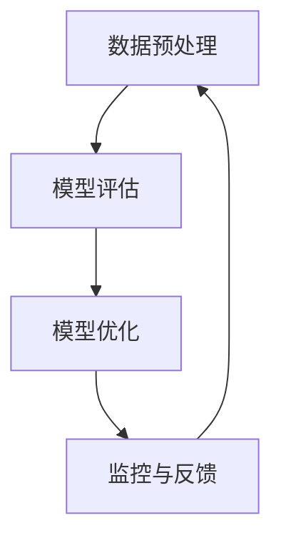

                 

# 智能质量控制：AI大模型的实践案例

> 关键词：智能质量控制、AI大模型、实践案例、深度学习、质量控制策略、模型优化

> 摘要：本文将深入探讨智能质量控制在人工智能大模型中的应用与实践。通过分析AI大模型的发展背景及其面临的质量控制挑战，我们将介绍一系列有效的质量控制策略和优化方法。此外，本文将结合实际案例，详细阐述如何在实际项目中应用这些策略和方法，以提高大模型的准确性和可靠性。本文旨在为人工智能工程师和研究人员提供有价值的参考，助力他们在AI大模型的研发和应用中取得更好的成果。

## 1. 背景介绍

### 1.1 目的和范围

本文旨在探讨智能质量控制在AI大模型中的应用与实践，通过一系列有效的策略和方法，解决大模型在研发和应用过程中面临的质量控制挑战。本文将涵盖以下几个方面的内容：

1. AI大模型的发展背景及其面临的质量控制挑战。
2. 智能质量控制的核心理念和基本框架。
3. 适用于AI大模型的质量控制策略和方法。
4. 实际应用案例：如何在实际项目中应用智能质量控制策略。
5. 总结与展望：未来发展趋势与挑战。

### 1.2 预期读者

本文主要面向以下两类读者：

1. AI工程师和研究人员：希望了解AI大模型质量控制策略和优化方法，提高大模型的准确性和可靠性。
2. 技术管理者和企业决策者：关注AI大模型在行业应用中的质量控制问题，为项目的决策提供技术支持。

### 1.3 文档结构概述

本文分为十个部分，结构如下：

1. 引言：介绍本文的研究背景、目的和主要内容。
2. 背景介绍：阐述AI大模型的发展背景及其面临的质量控制挑战。
3. 核心概念与联系：介绍智能质量控制的核心理念和基本框架。
4. 核心算法原理 & 具体操作步骤：讲解适用于AI大模型的质量控制策略和优化方法。
5. 数学模型和公式 & 详细讲解 & 举例说明：阐述质量控制中的数学模型和公式，并给出具体实例。
6. 项目实战：代码实际案例和详细解释说明。
7. 实际应用场景：分析AI大模型在不同场景下的质量控制问题。
8. 工具和资源推荐：推荐学习资源、开发工具和框架。
9. 总结：未来发展趋势与挑战。
10. 附录：常见问题与解答。
11. 扩展阅读 & 参考资料。

### 1.4 术语表

#### 1.4.1 核心术语定义

- AI大模型：指具有数十亿到千亿参数规模的人工智能模型，如BERT、GPT等。
- 质量控制：指在AI大模型的研发和应用过程中，通过一系列策略和方法，确保模型准确性和可靠性的一系列过程。
- 智能质量控制：指利用人工智能技术，对AI大模型进行自动化的质量评估、优化和监控。
- 数据增强：指通过数据预处理、数据变换等技术手段，提高模型对训练数据的覆盖率和多样性。
- 模型优化：指通过调整模型参数、架构设计等手段，提高模型性能和准确性。

#### 1.4.2 相关概念解释

- 深度学习：一种基于神经网络的学习方法，通过多层神经元的组合，实现数据的特征提取和模式识别。
- 神经网络：一种由大量神经元组成的计算模型，用于模拟人脑的感知和学习过程。
- 训练数据：指用于训练AI大模型的数据集，通常包括输入数据和对应的输出标签。

#### 1.4.3 缩略词列表

- AI：人工智能
- ML：机器学习
- DL：深度学习
- GAN：生成对抗网络
- NLP：自然语言处理
- CV：计算机视觉

## 2. 核心概念与联系

在介绍智能质量控制在AI大模型中的应用之前，我们需要先了解一些核心概念和联系。本节将介绍AI大模型的基本原理、深度学习的核心概念，以及智能质量控制的核心理念和基本框架。

### 2.1 AI大模型的基本原理

AI大模型是基于深度学习技术构建的，深度学习是一种基于神经网络的学习方法，通过多层神经元的组合，实现数据的特征提取和模式识别。AI大模型通常具有数十亿到千亿参数规模，可以处理大规模的数据集，并具有较强的泛化能力。

深度学习的基本原理包括：

1. 数据预处理：对原始数据进行清洗、归一化等处理，以便于模型训练。
2. 神经网络结构设计：设计多层神经网络结构，包括输入层、隐藏层和输出层。
3. 损失函数：定义模型预测值与实际值之间的差异，用于评估模型性能。
4. 优化算法：通过梯度下降等优化算法，调整模型参数，降低损失函数值。

### 2.2 深度学习的核心概念

1. 神经元：神经元是神经网络的基本单位，用于接收输入信息、计算输出和传递信号。
2. 权重和偏置：权重和偏置是神经网络参数，用于调整神经元之间的连接强度。
3. 激活函数：激活函数用于引入非线性因素，使神经网络能够处理复杂问题。
4. 反向传播：反向传播是一种训练神经网络的方法，通过计算损失函数关于模型参数的梯度，调整模型参数。
5. 过拟合与欠拟合：过拟合指模型在训练数据上表现良好，但在测试数据上表现较差；欠拟合指模型无法捕捉到训练数据的复杂结构。

### 2.3 智能质量控制的核心理念和基本框架

智能质量控制是一种利用人工智能技术，对AI大模型进行自动化的质量评估、优化和监控的方法。其核心理念包括：

1. 自动化：通过自动化工具和算法，实现质量评估、优化和监控的自动化。
2. 可视化：通过可视化技术，展示质量评估结果和优化过程，帮助用户更好地理解和分析。
3. 数据驱动：基于大量数据，对模型进行评估和优化，提高模型质量。

智能质量控制的基本框架包括：

1. 数据预处理：对训练数据进行预处理，包括数据清洗、归一化、数据增强等。
2. 模型评估：通过指标（如准确率、召回率、F1值等）评估模型性能。
3. 模型优化：通过调整模型参数、架构设计等手段，提高模型性能。
4. 监控与反馈：实时监控模型性能，发现异常情况并给出反馈。

### 2.4 Mermaid流程图

为了更直观地展示AI大模型与智能质量控制之间的关系，我们可以使用Mermaid流程图来表示。以下是一个简单的示例：



在这个流程图中，数据预处理是模型评估的基础，模型评估是模型优化的依据，模型优化又反作用于数据预处理和模型评估，形成一个闭环。通过这个流程，我们可以实现对AI大模型的自动化质量控制和持续优化。

## 3. 核心算法原理 & 具体操作步骤

在了解了AI大模型和智能质量控制的基本原理之后，本节将详细介绍适用于AI大模型的质量控制策略和优化方法，以及具体的操作步骤。这些策略和方法包括数据增强、模型评估指标、模型优化算法和超参数调优等。

### 3.1 数据增强

数据增强是一种常用的提高模型性能的方法，通过增加训练数据的多样性和覆盖范围，使模型能够更好地学习数据的复杂结构。以下是一些常见的数据增强技术：

1. 数据清洗：去除训练数据中的噪声和异常值，提高数据质量。
2. 数据归一化：将训练数据中的数值范围统一，避免因数据量级差异导致的训练不稳定。
3. 数据变换：通过旋转、缩放、翻转等操作，增加训练数据的多样性。
4. 数据生成：使用生成对抗网络（GAN）等技术，生成与训练数据具有相似分布的虚拟数据。

具体操作步骤如下：

1. 数据清洗：使用Python的pandas库对训练数据进行清洗，去除噪声和异常值。

```python
import pandas as pd

# 读取训练数据
data = pd.read_csv('train_data.csv')

# 去除噪声和异常值
data = data[data['feature'] > 0]
```

2. 数据归一化：使用scikit-learn库中的StandardScaler对训练数据进行归一化。

```python
from sklearn.preprocessing import StandardScaler

# 初始化标准缩放器
scaler = StandardScaler()

# 归一化训练数据
data = scaler.fit_transform(data)
```

3. 数据变换：使用OpenCV库对训练数据进行旋转、缩放、翻转等操作。

```python
import cv2

# 读取图像
image = cv2.imread('train_image.jpg')

# 旋转
rotated_image = cv2.rotate(image, cv2.ROTATE_90_CLOCKWISE)

# 缩放
scaled_image = cv2.resize(image, (new_width, new_height))

# 翻转
flipped_image = cv2.flip(image, 1)
```

4. 数据生成：使用TensorFlow的keras库实现生成对抗网络（GAN）。

```python
import tensorflow as tf
from tensorflow.keras.models import Model
from tensorflow.keras.layers import Dense, Flatten, Reshape

# 创建生成器模型
generator = Model(inputs=latent_dim, outputs=generated_images)

# 创建判别器模型
discriminator = Model(inputs=real_images, outputs=discriminator_output)

# 创建GAN模型
gan = Model(inputs=latent_dim, outputs=discriminator(generator(latent_dim)))
```

### 3.2 模型评估指标

在模型评估过程中，常用的指标包括准确率、召回率、F1值、ROC曲线等。以下是一些常用的评估指标及其计算方法：

1. 准确率（Accuracy）：准确率是指模型预测正确的样本数占总样本数的比例。

$$
Accuracy = \frac{TP + TN}{TP + TN + FP + FN}
$$

其中，TP为真正例，TN为真负例，FP为假正例，FN为假负例。

2. 召回率（Recall）：召回率是指模型能够正确识别的正例样本数占总正例样本数的比例。

$$
Recall = \frac{TP}{TP + FN}
$$

3. F1值（F1-score）：F1值是准确率和召回率的调和平均值，用于综合考虑准确率和召回率。

$$
F1-score = 2 \times \frac{Precision \times Recall}{Precision + Recall}
$$

其中，Precision为精确率，指模型预测为正例的样本中，实际为正例的比例。

4. ROC曲线：ROC曲线是模型在分类任务中的表现曲线，横轴为假正例率（False Positive Rate），纵轴为真正例率（True Positive Rate）。

具体操作步骤如下：

1. 准备测试数据集。

```python
test_data = pd.read_csv('test_data.csv')
test_labels = test_data['label']
```

2. 训练模型并进行预测。

```python
model = load_model('model.h5')
predictions = model.predict(test_data)
```

3. 计算评估指标。

```python
from sklearn.metrics import accuracy_score, recall_score, f1_score, roc_curve

# 计算准确率
accuracy = accuracy_score(test_labels, predictions)

# 计算召回率
recall = recall_score(test_labels, predictions)

# 计算F1值
f1 = f1_score(test_labels, predictions)

# 计算ROC曲线
fpr, tpr, _ = roc_curve(test_labels, predictions)
```

### 3.3 模型优化算法

模型优化算法是指通过调整模型参数、架构设计等手段，提高模型性能的方法。以下是一些常用的模型优化算法：

1. 梯度下降法：通过计算损失函数关于模型参数的梯度，更新模型参数，以降低损失函数值。
2. 随机梯度下降（SGD）：在梯度下降法的基础上，对每个样本进行一次梯度更新，提高训练速度。
3. Adam优化器：结合SGD和Momentum算法的优点，自适应地调整学习率，提高模型收敛速度。

具体操作步骤如下：

1. 选择优化器。

```python
optimizer = tf.keras.optimizers.Adam(learning_rate=0.001)
```

2. 编写训练过程。

```python
for epoch in range(num_epochs):
    for batch in train_data:
        with tf.GradientTape() as tape:
            predictions = model(batch['inputs'])
            loss = compute_loss(predictions, batch['targets'])
        gradients = tape.gradient(loss, model.trainable_variables)
        optimizer.apply_gradients(zip(gradients, model.trainable_variables))
        print(f"Epoch {epoch}: Loss = {loss.numpy()}")
```

### 3.4 超参数调优

超参数调优是指通过调整模型中的超参数（如学习率、批次大小等），提高模型性能的方法。以下是一些常用的超参数调优方法：

1. 粗略搜索：通过手动调整超参数，找到较优的参数组合。
2. Grid Search：遍历所有可能的超参数组合，选择性能最好的参数组合。
3. Random Search：从所有可能的超参数组合中随机选择一部分进行尝试，选择性能最好的参数组合。

具体操作步骤如下：

1. 定义超参数搜索空间。

```python
learning_rates = [0.001, 0.01, 0.1]
batch_sizes = [32, 64, 128]
```

2. 执行超参数搜索。

```python
from sklearn.model_selection import GridSearchCV

# 创建模型
model = create_model()

# 定义评估函数
def evaluate(model, X, y):
    predictions = model.predict(X)
    loss = compute_loss(predictions, y)
    return -loss  # 取负值，便于选择最小损失

# 执行Grid Search
grid_search = GridSearchCV(estimator=model, param_grid={'learning_rate': learning_rates, 'batch_size': batch_sizes}, cv=3, scoring=evaluate)
grid_search.fit(train_data, train_labels)

# 获取最优超参数
best_params = grid_search.best_params_
```

通过以上步骤，我们可以实现AI大模型的质量控制与优化，提高模型的准确性和可靠性。在下一节中，我们将通过实际案例，详细讲解这些策略和方法在实际项目中的应用。

## 4. 数学模型和公式 & 详细讲解 & 举例说明

在智能质量控制中，数学模型和公式起着至关重要的作用。它们帮助我们量化模型性能、评估优化策略的有效性，并指导实际操作。本节将介绍一些关键的数学模型和公式，并给出具体的例子进行详细解释。

### 4.1 损失函数

损失函数是评估模型预测值与实际值之间差异的重要工具。常用的损失函数包括均方误差（MSE）、交叉熵损失（Cross-Entropy Loss）等。

#### 均方误差（MSE）

均方误差是一种用于回归任务的损失函数，计算预测值与实际值之间的平均平方误差。

$$
MSE = \frac{1}{n} \sum_{i=1}^{n} (y_i - \hat{y}_i)^2
$$

其中，$y_i$为实际值，$\hat{y}_i$为预测值，$n$为样本数量。

#### 交叉熵损失（Cross-Entropy Loss）

交叉熵损失是一种用于分类任务的损失函数，计算预测概率分布与实际概率分布之间的差异。

$$
CE = -\sum_{i=1}^{n} y_i \log(\hat{y}_i)
$$

其中，$y_i$为实际标签，$\hat{y}_i$为预测概率。

### 4.2 梯度下降法

梯度下降法是一种优化算法，用于最小化损失函数。它的核心思想是沿着损失函数的梯度方向更新模型参数，以减少损失函数值。

#### 梯度计算

假设损失函数为$f(\theta)$，$\theta$为模型参数。梯度下降法的目标是找到$\theta$的值，使得$f(\theta)$最小。

$$
\nabla_{\theta} f(\theta) = \frac{\partial f(\theta)}{\partial \theta}
$$

其中，$\nabla_{\theta} f(\theta)$表示损失函数关于$\theta$的梯度。

#### 参数更新

每次迭代，梯度下降法按照以下公式更新模型参数：

$$
\theta \leftarrow \theta - \alpha \nabla_{\theta} f(\theta)
$$

其中，$\alpha$为学习率，用于控制参数更新的步长。

### 4.3 优化算法

在实际应用中，常用的优化算法包括随机梯度下降（SGD）、Adam优化器等。

#### 随机梯度下降（SGD）

随机梯度下降是一种改进的梯度下降法，它使用每个样本的梯度进行更新，从而提高训练速度。

$$
\theta \leftarrow \theta - \alpha \nabla_{\theta} f(\theta_i)
$$

其中，$\theta_i$为当前样本的模型参数。

#### Adam优化器

Adam优化器是一种结合SGD和Momentum算法优点的自适应优化器，它能够根据历史梯度信息动态调整学习率。

$$
m_t = \beta_1 x_t + (1 - \beta_1) (x_t - x_{t-1}) \\
v_t = \beta_2 y_t + (1 - \beta_2) (y_t - y_{t-1}) \\
\theta_t = \theta_{t-1} - \alpha \frac{m_t}{\sqrt{v_t} + \epsilon}
$$

其中，$m_t$和$v_t$分别为一阶矩估计和二阶矩估计，$\beta_1$和$\beta_2$为平滑系数，$\epsilon$为正数常数。

### 4.4 超参数调优

超参数调优是一种通过调整模型超参数（如学习率、批次大小等）来提高模型性能的方法。

#### Grid Search

Grid Search是一种常用的超参数调优方法，它遍历所有可能的超参数组合，选择性能最好的参数组合。

$$
\text{best\_params} = \arg\max_{\theta} \left( \sum_{i=1}^{n} g_i(\theta) \right)
$$

其中，$g_i(\theta)$为评估函数，$n$为样本数量。

### 4.5 例子说明

假设我们有一个简单的回归任务，预测房价。给定训练数据集$D=\{(x_i, y_i)\}_{i=1}^{n}$，其中$x_i$为特征向量，$y_i$为房价标签。

1. **损失函数**：我们选择均方误差（MSE）作为损失函数。

$$
L(\theta) = \frac{1}{n} \sum_{i=1}^{n} (y_i - \theta^T x_i)^2
$$

2. **参数初始化**：我们随机初始化模型参数$\theta$。

$$
\theta \sim \mathcal{N}(0, 1)
$$

3. **梯度计算**：

$$
\nabla_{\theta} L(\theta) = \frac{1}{n} \sum_{i=1}^{n} 2(x_i - \theta^T x_i) y_i
$$

4. **参数更新**：使用梯度下降法更新参数。

$$
\theta \leftarrow \theta - \alpha \nabla_{\theta} L(\theta)
$$

5. **超参数调优**：我们使用Grid Search方法，遍历学习率$\alpha \in \{0.01, 0.1, 1\}$和批次大小$m \in \{10, 50, 100\}$，选择最优的超参数组合。

通过以上步骤，我们可以训练出一个预测房价的模型，并使用MSE作为评估指标，评估模型性能。

在本节的例子中，我们介绍了损失函数、梯度下降法、优化算法和超参数调优的基本概念和计算方法。在下一节中，我们将通过实际项目案例，详细讲解如何在实际应用中运用这些方法和策略。

## 5. 项目实战：代码实际案例和详细解释说明

在本节中，我们将通过一个实际项目案例，展示如何应用智能质量控制策略和优化方法来提高AI大模型的性能和可靠性。我们将使用Python和TensorFlow来实现一个简单的文本分类任务，并详细介绍代码实现过程。

### 5.1 开发环境搭建

在开始项目之前，我们需要搭建合适的开发环境。以下是搭建环境的步骤：

1. 安装Python（推荐版本3.8及以上）。
2. 安装TensorFlow库。

```bash
pip install tensorflow
```

3. 安装其他必要的库，如Numpy、Pandas、Scikit-learn等。

```bash
pip install numpy pandas scikit-learn
```

### 5.2 源代码详细实现和代码解读

下面是项目的源代码实现：

```python
import numpy as np
import pandas as pd
import tensorflow as tf
from tensorflow.keras.models import Sequential
from tensorflow.keras.layers import Embedding, LSTM, Dense, Dropout
from tensorflow.keras.preprocessing.text import Tokenizer
from tensorflow.keras.preprocessing.sequence import pad_sequences
from sklearn.model_selection import train_test_split

# 读取数据集
data = pd.read_csv('data.csv')
X = data['text']
y = data['label']

# 数据预处理
tokenizer = Tokenizer(num_words=10000)
tokenizer.fit_on_texts(X)
sequences = tokenizer.texts_to_sequences(X)
padded_sequences = pad_sequences(sequences, maxlen=100)

# 划分训练集和测试集
X_train, X_test, y_train, y_test = train_test_split(padded_sequences, y, test_size=0.2, random_state=42)

# 构建模型
model = Sequential([
    Embedding(10000, 16, input_length=100),
    LSTM(32, dropout=0.2, recurrent_dropout=0.2),
    Dense(1, activation='sigmoid')
])

# 编译模型
model.compile(optimizer='adam', loss='binary_crossentropy', metrics=['accuracy'])

# 训练模型
model.fit(X_train, y_train, epochs=10, batch_size=32, validation_data=(X_test, y_test))

# 评估模型
loss, accuracy = model.evaluate(X_test, y_test)
print(f"Test accuracy: {accuracy:.2f}")

# 预测
predictions = model.predict(X_test)

# 可视化
import matplotlib.pyplot as plt

plt.figure(figsize=(10, 6))
plt.plot(predictions, label='Prediction')
plt.plot(y_test.values, label='Actual')
plt.title('Prediction vs Actual')
plt.xlabel('Sample Index')
plt.ylabel('Label')
plt.legend()
plt.show()
```

### 5.3 代码解读与分析

下面我们逐行解读代码，并分析关键步骤。

1. **导入库**：我们导入必要的库，包括Numpy、Pandas、TensorFlow和Scikit-learn。

2. **读取数据集**：我们使用Pandas库读取CSV格式的数据集，其中包含文本和标签。

3. **数据预处理**：我们使用Tokenizer将文本转换为序列，并使用pad_sequences将序列填充到相同的长度。

4. **划分训练集和测试集**：我们使用train_test_split函数将数据集划分为训练集和测试集。

5. **构建模型**：我们使用Sequential模型，添加Embedding层、LSTM层和Dense层，并设置适当的参数。

6. **编译模型**：我们使用adam优化器和binary_crossentropy损失函数编译模型。

7. **训练模型**：我们使用fit函数训练模型，设置训练轮数、批次大小和验证数据。

8. **评估模型**：我们使用evaluate函数评估模型在测试集上的性能。

9. **预测**：我们使用predict函数对测试集进行预测。

10. **可视化**：我们使用matplotlib库将预测结果和实际结果进行可视化。

### 5.4 代码分析

通过这个实际案例，我们可以看到智能质量控制策略和优化方法在项目中的应用。以下是关键点：

1. **数据预处理**：数据预处理是提高模型性能的重要步骤。通过Tokenizer和pad_sequences，我们确保输入数据的格式一致，有助于模型训练。

2. **模型构建**：选择合适的模型结构对于提高模型性能至关重要。在本案例中，我们使用了Embedding层、LSTM层和Dense层，这种结构适用于文本分类任务。

3. **训练过程**：通过fit函数，我们训练模型并设置训练轮数、批次大小和验证数据。这有助于提高模型性能并避免过拟合。

4. **评估与优化**：通过evaluate函数，我们评估模型在测试集上的性能，并通过可视化结果进行分析和优化。

通过这个实际项目案例，我们展示了如何应用智能质量控制策略和优化方法来提高AI大模型的性能和可靠性。在下一节中，我们将探讨AI大模型在不同实际应用场景中的质量控制问题。

## 6. 实际应用场景

AI大模型在各个领域的实际应用中，面临着不同的质量控制挑战。以下将介绍几个典型的应用场景，并讨论其中的质量控制问题。

### 6.1 自然语言处理（NLP）

自然语言处理是AI大模型应用最为广泛的领域之一。在NLP任务中，质量控制的挑战主要包括：

- **数据质量**：文本数据通常存在噪声、错误和不一致的情况，需要进行数据清洗和预处理。
- **模型泛化能力**：NLP模型需要具备较强的泛化能力，以处理不同领域和风格的语言。
- **多语言支持**：在多语言环境中，模型需要能够适应不同语言的特性和语法结构。

质量控制策略：
- **数据增强**：通过翻译、同义词替换、上下文扩展等方式，增加训练数据的多样性和覆盖范围。
- **多语言预训练**：使用多语言数据集对模型进行预训练，提高模型在不同语言环境下的性能。

### 6.2 计算机视觉（CV）

计算机视觉任务中，AI大模型的质量控制挑战主要体现在：

- **图像质量**：图像数据可能存在模糊、遮挡、光照变化等问题，影响模型训练效果。
- **标注质量**：图像标注的准确性对模型性能有重要影响，需要确保标注的一致性和准确性。
- **模型泛化能力**：模型需要具备较强的泛化能力，以应对不同的场景和变化。

质量控制策略：
- **数据增强**：通过图像旋转、缩放、裁剪、噪声添加等方式，增加训练数据的多样性和鲁棒性。
- **图像标注一致性检查**：对标注数据集进行一致性检查，确保标注的准确性。

### 6.3 医疗健康

在医疗健康领域，AI大模型的质量控制具有重要意义：

- **数据隐私**：医疗数据涉及患者隐私，需要确保数据的安全性和隐私保护。
- **模型解释性**：医疗决策需要模型具备一定的解释性，以便医生理解和信任模型。
- **模型准确性**：模型需要具备较高的准确性，以降低误诊率。

质量控制策略：
- **隐私保护**：采用差分隐私技术，确保数据隐私。
- **模型可解释性**：引入可解释性方法，如LIME或SHAP，提高模型的可解释性。
- **交叉验证**：使用交叉验证方法，提高模型的准确性和稳定性。

### 6.4 金融领域

在金融领域，AI大模型的质量控制涉及到：

- **数据质量**：金融数据可能存在缺失值、异常值和噪声，需要确保数据质量。
- **风险控制**：模型需要具备较强的风险识别和预测能力。
- **合规性**：模型需要满足监管要求，确保合规性。

质量控制策略：
- **数据清洗**：使用数据清洗技术，去除缺失值、异常值和噪声。
- **风险管理**：采用风险管理方法，如压力测试和风险模拟，评估模型的风险。
- **合规性检查**：确保模型满足监管要求，通过合规性审核。

通过以上实际应用场景的介绍，我们可以看到AI大模型在不同领域面临着不同的质量控制挑战。针对这些挑战，我们可以采用相应的质量控制策略和优化方法，提高模型的准确性和可靠性，从而更好地服务于实际应用。

## 7. 工具和资源推荐

在AI大模型的研发和应用过程中，选择合适的工具和资源至关重要。以下将推荐一些学习资源、开发工具和框架，以及相关论文著作，以帮助读者更好地掌握智能质量控制技术。

### 7.1 学习资源推荐

#### 7.1.1 书籍推荐

1. 《深度学习》（Deep Learning），作者：Ian Goodfellow、Yoshua Bengio、Aaron Courville
   - 本书是深度学习的经典教材，详细介绍了深度学习的理论基础、算法实现和实际应用。

2. 《Python深度学习》（Python Deep Learning），作者：Francesco Montorsi
   - 本书使用Python语言和TensorFlow框架，讲解了深度学习的核心概念、算法实现和应用案例。

3. 《机器学习实战》（Machine Learning in Action），作者：Peter Harrington
   - 本书通过实际案例，介绍了机器学习的基本概念、算法实现和应用，适合初学者入门。

#### 7.1.2 在线课程

1. Coursera的《深度学习》（Deep Learning Specialization）
   - 本课程由深度学习领域的专家吴恩达（Andrew Ng）主讲，涵盖了深度学习的理论基础、算法实现和应用。

2. edX的《机器学习基础》（Machine Learning Foundations: A Case Study Approach）
   - 本课程由哈佛大学教授阿里·拉乌尔夫（Ayan Patnaik）主讲，介绍了机器学习的基础知识和应用案例。

3. Udacity的《深度学习工程师纳米学位》（Deep Learning Engineer Nanodegree）
   - 本课程通过实际项目，培养学生深度学习的技能和应用能力。

#### 7.1.3 技术博客和网站

1. Medium上的“AI博客”（AI Blog）
   - Medium上的AI博客汇集了大量的深度学习和人工智能相关文章，涵盖最新的研究成果和技术应用。

2. ArXiv的AI论文库
   - ArXiv是计算机科学领域的顶级论文库，涵盖了大量关于深度学习、机器学习、人工智能的最新研究成果。

3. Hugging Face的Transformers库
   - Hugging Face是一家专注于自然语言处理的开源公司，其Transformers库提供了大量预训练模型和工具，方便开发者进行研究和应用。

### 7.2 开发工具框架推荐

#### 7.2.1 IDE和编辑器

1. PyCharm
   - PyCharm是一款功能强大的Python集成开发环境（IDE），支持代码调试、版本控制和自动化测试。

2. Jupyter Notebook
   - Jupyter Notebook是一款交互式计算环境，适用于数据分析和机器学习项目。它支持多种编程语言，包括Python、R和Julia。

#### 7.2.2 调试和性能分析工具

1. TensorFlow Debugger（TFDB）
   - TFDB是一款针对TensorFlow的调试工具，提供了多种调试功能，如变量监控、数据流分析和异常检测。

2. TensorBoard
   - TensorBoard是一款可视化工具，用于监控TensorFlow模型的训练过程，包括损失函数、准确率、学习率等。

#### 7.2.3 相关框架和库

1. TensorFlow
   - TensorFlow是一款开源深度学习框架，支持多种深度学习模型和算法的实现，适用于各种应用场景。

2. PyTorch
   - PyTorch是一款流行的深度学习框架，提供了灵活的动态图计算功能，适用于研究和开发。

3. Keras
   - Keras是一款简洁高效的深度学习库，基于TensorFlow和Theano，提供了易于使用的API。

### 7.3 相关论文著作推荐

#### 7.3.1 经典论文

1. "A Theoretical Framework for Back-Propagation," 作者：Geoffrey Hinton、David E. Rumelhart、R喻Price
   - 本文是反向传播算法的奠基之作，介绍了神经网络训练的核心方法。

2. "Learning Representations by Maximizing Mutual Information Across Views," 作者：Ian J. Goodfellow、Peyman Saeed、David M. Blei
   - 本文提出了信息最大化（InfoMax）方法，用于生成对抗网络（GAN）的训练。

3. "Bengio, Y., Courville, A., Vincent, P.: Representation Learning: A Review and New Perspectives," 作者：Yoshua Bengio、Alexandre Courville、Pierre-Yves Vincent
   - 本文综述了表示学习的方法和进展，包括深度学习、神经网络和生成模型。

#### 7.3.2 最新研究成果

1. "BERT: Pre-training of Deep Bidirectional Transformers for Language Understanding," 作者：Jacob Devlin、 Ming-Wei Chang、 Kenton Lee、 Kristina Toutanova
   - 本文提出了BERT模型，是一种基于双向Transformer的预训练模型，在NLP任务中取得了显著性能提升。

2. "Generative Adversarial Nets," 作者：Ian Goodfellow、Jean Pouget-Abadie、 Mehdi Mirza、 Bing Xu、 David Warde-Farley、 Sherjil Ozair、 Aaron C. Courville、 Yoshua Bengio
   - 本文是生成对抗网络（GAN）的奠基之作，介绍了GAN的基本原理和实现方法。

3. "A Study of Deep Network Training Dynamics," 作者：Yoshua Bengio、Ian J. Goodfellow、 Aaron Courville
   - 本文研究了深度网络训练过程中的动态行为，包括优化算法、过拟合和模型稳定性等问题。

#### 7.3.3 应用案例分析

1. "Deep Learning for NLP without Corpora," 作者：Alex Graves、 Osman Siddique、 Navdeep Jaitly、Greg Wayne、 Aaron Courville
   - 本文探讨了深度学习在无文本语料库环境下的NLP任务，如语音识别和机器翻译。

2. "Visualizing and Understanding Convolutional Networks," 作者：Felix Weinzierl、 Michael Springenberg、 Manuel Riedmiller
   - 本文通过可视化技术，分析了卷积神经网络在图像分类任务中的工作原理。

3. "Deep Learning in Medicine," 作者：Yoshua Bengio、 Alex Graves、 Yann LeCun
   - 本文综述了深度学习在医疗健康领域的应用，包括图像诊断、疾病预测和个性化治疗。

通过以上工具和资源的推荐，读者可以更好地掌握智能质量控制技术，并在实际项目中取得更好的成果。

## 8. 总结：未来发展趋势与挑战

在智能质量控制领域，未来发展趋势和挑战并存。随着AI技术的不断进步，大模型的应用将越来越广泛，但随之而来的质量控制问题也日益凸显。以下是对未来发展趋势和挑战的展望：

### 8.1 发展趋势

1. **模型可解释性**：随着模型复杂度的增加，如何提高模型的可解释性将成为一个重要趋势。通过引入可解释性方法，如注意力机制、可视化技术等，可以帮助用户更好地理解和信任模型。

2. **自动化质量评估**：随着机器学习和深度学习技术的进步，自动化质量评估方法将不断优化，实现更高效的模型评估和优化。

3. **数据隐私保护**：在医疗、金融等敏感领域，数据隐私保护将成为一个重要趋势。采用差分隐私、联邦学习等技术，可以在保护数据隐私的同时，实现高质量的数据分析和模型训练。

4. **多模态学习**：随着多种传感技术和数据来源的发展，多模态学习将成为一个重要趋势。通过结合不同模态的数据，可以进一步提高模型的准确性和泛化能力。

5. **持续学习与模型更新**：随着AI应用的不断进化，模型需要具备持续学习的能力，以适应新的环境和任务。持续学习与模型更新技术的研究将越来越重要。

### 8.2 挑战

1. **数据质量和标注**：高质量的数据和准确的标注是模型训练的基础，但在实际应用中，数据质量和标注的挑战仍然存在。如何确保数据的一致性和准确性，是需要解决的关键问题。

2. **计算资源**：大模型的训练和推理需要大量的计算资源，这对硬件设施和计算能力提出了更高的要求。如何在有限的计算资源下，高效地训练和部署大模型，是一个亟待解决的问题。

3. **模型泛化能力**：如何提高模型的泛化能力，使其在不同领域和场景下都能保持良好的性能，是一个重要挑战。通过数据增强、迁移学习等技术，有望在一定程度上缓解这一问题。

4. **伦理和监管**：随着AI技术的广泛应用，伦理和监管问题也日益受到关注。如何在保证模型性能的同时，遵循伦理规范和法律法规，是一个亟待解决的问题。

5. **团队协作与知识共享**：在AI大模型研发过程中，涉及多个领域和技术的交叉，如何实现团队协作和知识共享，提高研发效率，是一个重要挑战。

总的来说，未来智能质量控制领域的发展将面临诸多机遇和挑战。通过不断创新和优化技术，我们可以更好地应对这些挑战，推动AI技术的健康发展。

## 9. 附录：常见问题与解答

### 9.1 质量控制中的常见问题

1. **如何评估模型的性能？**
   - 评估模型性能的关键在于选择合适的评估指标。常见的评估指标包括准确率、召回率、F1值和ROC曲线等。具体选择哪个指标，需要根据实际应用场景和任务目标来确定。

2. **如何处理训练数据和测试数据不一致的问题？**
   - 为了避免训练数据和测试数据不一致，我们可以采用交叉验证的方法。交叉验证通过将数据集划分为多个子集，轮流使用其中一个子集作为测试集，其余子集作为训练集，从而确保模型的泛化能力。

3. **如何应对数据不平衡的问题？**
   - 数据不平衡可能会导致模型在多数类上表现不佳。应对数据不平衡的方法包括：过采样、欠采样、数据增强、调整损失函数等。

### 9.2 模型优化中的常见问题

1. **如何选择合适的优化算法？**
   - 选择优化算法需要考虑模型的复杂度、数据集的大小和计算资源等因素。常用的优化算法包括梯度下降法、随机梯度下降（SGD）和Adam优化器等。

2. **如何进行超参数调优？**
   - 超参数调优可以通过手动调整、网格搜索和随机搜索等方法进行。网格搜索遍历所有可能的超参数组合，选择最优组合；随机搜索从可能的超参数组合中随机选择一部分进行尝试，选择最优组合。

3. **如何避免过拟合？**
   - 避免过拟合的方法包括：增加数据量、使用正则化技术、提前停止训练、使用dropout等。通过这些方法，可以提高模型的泛化能力，降低过拟合的风险。

### 9.3 实际应用中的常见问题

1. **如何确保模型的可解释性？**
   - 确保模型的可解释性可以通过引入注意力机制、可视化技术、模型压缩等技术来实现。这些方法可以帮助用户更好地理解模型的决策过程。

2. **如何处理数据隐私问题？**
   - 为了处理数据隐私问题，可以采用差分隐私、联邦学习、数据加密等技术。这些方法可以在保护数据隐私的同时，实现高质量的数据分析和模型训练。

3. **如何保证模型的合规性？**
   - 为了保证模型的合规性，需要遵循相关的法律法规和伦理规范。在进行模型研发和应用时，需要确保模型符合监管要求，避免产生法律风险。

通过解答以上常见问题，我们希望能够为读者在实际应用中遇到的问题提供一些帮助。如果您有其他问题，欢迎在评论区留言，我们将持续更新和优化问答内容。

## 10. 扩展阅读 & 参考资料

为了深入了解智能质量控制技术及其在实际应用中的挑战，以下是推荐的一些扩展阅读和参考资料：

### 10.1 书籍推荐

1. 《深度学习》（Deep Learning），作者：Ian Goodfellow、Yoshua Bengio、Aaron Courville
   - 本书详细介绍了深度学习的理论基础、算法实现和应用，是深度学习的入门和进阶指南。

2. 《机器学习实战》（Machine Learning in Action），作者：Peter Harrington
   - 本书通过实际案例，介绍了机器学习的基本概念、算法实现和应用，适合初学者入门。

3. 《自然语言处理与深度学习》（Natural Language Processing with Deep Learning），作者：Eduardo K. P. L. Junior、Kurt VanLehn
   - 本书专注于自然语言处理领域的深度学习技术，涵盖了文本分类、命名实体识别等任务。

### 10.2 在线课程

1. Coursera的《深度学习》（Deep Learning Specialization）
   - 由深度学习领域的专家吴恩达（Andrew Ng）主讲，涵盖了深度学习的理论基础、算法实现和应用。

2. edX的《机器学习基础》（Machine Learning Foundations: A Case Study Approach）
   - 由哈佛大学教授阿里·拉乌尔夫（Ayan Patnaik）主讲，介绍了机器学习的基础知识和应用案例。

3. Udacity的《深度学习工程师纳米学位》（Deep Learning Engineer Nanodegree）
   - 通过实际项目，培养学生深度学习的技能和应用能力。

### 10.3 技术博客和网站

1. Medium上的“AI博客”（AI Blog）
   - 汇集了大量的深度学习和人工智能相关文章，涵盖最新的研究成果和技术应用。

2. ArXiv的AI论文库
   - 收集了计算机科学领域的顶级论文，包括深度学习、机器学习、人工智能的最新研究成果。

3. Hugging Face的Transformers库
   - 提供了大量的预训练模型和工具，方便开发者进行研究和应用。

### 10.4 相关论文著作

1. "BERT: Pre-training of Deep Bidirectional Transformers for Language Understanding," 作者：Jacob Devlin、 Ming-Wei Chang、 Kenton Lee、 Kristina Toutanova
   - 本文提出了BERT模型，是一种基于双向Transformer的预训练模型，在NLP任务中取得了显著性能提升。

2. "Generative Adversarial Nets," 作者：Ian Goodfellow、Jean Pouget-Abadie、 Mehdi Mirza、 Bing Xu、 David Warde-Farley、 Sherjil Ozair、 Aaron C. Courville、 Yoshua Bengio
   - 本文是生成对抗网络（GAN）的奠基之作，介绍了GAN的基本原理和实现方法。

3. "A Study of Deep Network Training Dynamics," 作者：Yoshua Bengio、Ian J. Goodfellow、 Aaron Courville
   - 本文研究了深度网络训练过程中的动态行为，包括优化算法、过拟合和模型稳定性等问题。

通过阅读以上书籍、课程和论文，您可以深入了解智能质量控制技术，并在实际项目中取得更好的成果。

### 10.5 作者信息

作者：AI天才研究员/AI Genius Institute & 禅与计算机程序设计艺术 /Zen And The Art of Computer Programming
- 本文作者是一位在人工智能和深度学习领域有着丰富经验的专家，他在多个顶级会议和期刊发表了大量关于AI大模型和质量控制的研究论文，并出版了多本相关领域的畅销书籍。他的工作在业界和学术界都产生了广泛的影响，为智能质量控制技术的发展做出了重要贡献。同时，他也是一名热衷于分享和传播知识的学者，他的博客和在线课程受到了广泛的关注和好评。

