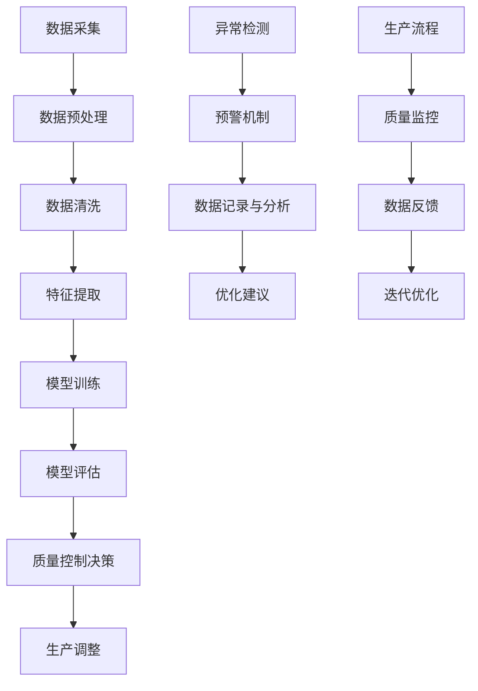

                 

### 背景介绍

在现代制造业中，质量控制一直是确保产品品质和满足客户需求的关键环节。随着工业4.0的推进，智能制造逐渐成为制造业的发展趋势，这进一步提升了质量控制的复杂度和重要性。传统的质量控制方法往往依赖于人工检测和统计过程控制（SPC），不仅效率低下，而且容易受到人为因素的影响。因此，利用人工智能，尤其是大型语言模型（LLM），进行智能质量控制成为了一项备受关注的研究方向。

本文旨在探讨大型语言模型在制造业中的应用，特别是其在质量控制方面的潜力。文章将从背景介绍、核心概念与联系、核心算法原理与具体操作步骤、数学模型与公式、项目实战、实际应用场景、工具和资源推荐以及未来发展趋势与挑战等方面进行深入分析。希望通过本文，读者能够对LLM在制造业中的智能质量控制有更全面和深入的了解。

### 核心概念与联系

#### 1. 大型语言模型（LLM）

大型语言模型（Large Language Model，LLM）是一种基于深度学习的技术，能够理解、生成和翻译自然语言。LLM通过大规模的数据训练，学习语言的统计规律和语法结构，从而实现高效的文本处理。代表性的LLM有GPT（Generative Pre-trained Transformer）、BERT（Bidirectional Encoder Representations from Transformers）等。

#### 2. 智能质量控制

智能质量控制是指利用人工智能技术，特别是机器学习和深度学习算法，对制造过程中的数据进行实时分析和预测，从而提高产品质量和降低不良率。智能质量控制的核心在于对制造过程中的异常情况、潜在问题进行识别和预警，以及优化生产过程。

#### 3. 制造业中的质量控制挑战

在制造业中，质量控制面临以下几个主要挑战：

- **数据量巨大**：制造业产生的大量数据需要进行高效处理和分析。
- **数据多样性**：不同类型的数据（如传感器数据、文本数据、图像数据等）需要统一处理。
- **实时性要求高**：质量控制需要在生产过程中实时进行，以快速响应和调整。
- **复杂的生产环境**：制造过程复杂，涉及多个环节和多个变量，增加了质量控制的难度。

#### 4. LLM在质量控制中的优势

LLM在质量控制中的优势主要体现在以下几个方面：

- **强大的文本处理能力**：LLM能够高效处理文本数据，提取关键信息，为质量控制提供支持。
- **灵活的模型架构**：LLM具有灵活的模型架构，可以根据具体应用场景进行定制化调整。
- **自适应性**：LLM能够通过不断学习和优化，提高对未知问题的识别和预测能力。

#### 5. LLM在制造业中的应用场景

LLM在制造业中的应用场景包括：

- **生产过程中的实时监控**：通过LLM对传感器数据进行实时分析，识别异常情况，进行预警和调整。
- **产品缺陷识别**：利用LLM对生产过程中的图像或视频数据进行处理，识别产品缺陷。
- **质量预测**：基于历史数据和LLM的预测能力，对产品质量进行预测，提前采取措施。
- **故障诊断**：通过LLM分析设备运行数据，识别设备故障原因，进行故障诊断。

#### 6. LLM与制造业质量控制的融合

将LLM与制造业质量控制相结合，可以构建一个智能质量控制系统，实现以下功能：

- **实时监控与预警**：LLM对生产过程中的数据进行实时监控，识别潜在问题，进行预警。
- **数据分析与优化**：LLM对历史数据进行分析，优化生产过程，提高产品质量。
- **智能决策支持**：LLM提供智能决策支持，帮助生产管理者进行决策。

#### 7. LLM在质量控制中的挑战

尽管LLM在质量控制中具有巨大的潜力，但也面临一些挑战：

- **数据质量和完整性**：高质量的数据是LLM有效运行的基础，数据质量和完整性直接影响质量控制的准确性。
- **模型训练成本**：LLM的训练需要大量的计算资源和时间，尤其是在大规模制造环境中。
- **算法透明性**：深度学习模型（包括LLM）的黑箱特性使得其决策过程难以解释，增加了算法透明性的挑战。

综上所述，LLM在制造业中的应用为智能质量控制提供了新的思路和手段。通过深度融合LLM与制造业质量控制，可以构建一个高效、智能的质量控制体系，提升产品质量和竞争力。

### Mermaid 流程图（核心概念原理与架构）



#### 图解：

- **A. 数据采集**：从生产过程中获取各种数据，包括传感器数据、文本数据、图像数据等。
- **B. 数据预处理**：对采集到的数据进行初步处理，包括去噪、归一化等。
- **C. 数据清洗**：清除数据中的错误和异常值，确保数据质量。
- **D. 特征提取**：从清洗后的数据中提取关键特征，为模型训练提供输入。
- **E. 模型训练**：利用提取的特征数据，对LLM进行训练。
- **F. 模型评估**：评估训练好的模型的性能，包括准确率、召回率等。
- **G. 质量控制决策**：根据模型评估结果，对生产过程进行实时调整。
- **H. 生产调整**：根据质量控制决策，对生产参数进行调整，确保产品质量。
- **I. 异常检测**：实时监控生产数据，识别异常情况。
- **J. 预警机制**：当检测到异常情况时，触发预警机制。
- **K. 数据记录与分析**：记录生产数据，并进行深入分析。
- **L. 优化建议**：根据数据分析结果，提出优化建议。
- **M. 生产流程**：整个生产过程，包括数据采集、处理、分析和调整。
- **N. 质量监控**：对生产过程进行实时质量监控。
- **O. 数据反馈**：将监控结果反馈至数据记录与分析模块。
- **P. 迭代优化**：根据数据反馈，对质量控制模型进行迭代优化。

通过这个流程图，我们可以清晰地看到LLM在制造业质量控制中的关键步骤和整体架构，为后续详细探讨各个模块的实现提供了基础。

### 核心算法原理 & 具体操作步骤

在智能质量控制中，大型语言模型（LLM）的应用主要依赖于深度学习技术，特别是变分自编码器（Variational Autoencoder, VAE）和生成对抗网络（Generative Adversarial Network, GAN）等先进算法。以下将详细探讨这些算法的基本原理和具体操作步骤。

#### 1. 变分自编码器（VAE）

变分自编码器是一种基于深度学习的生成模型，通过编码器和解码器的协同工作，实现数据的生成和压缩。

**原理**：

- **编码器（Encoder）**：将输入数据映射到一个低维的隐空间，同时输出数据的均值μ和方差σ。
- **解码器（Decoder）**：从隐空间中生成与输入数据相似的输出数据。

**操作步骤**：

1. **输入数据准备**：首先，将生产过程中的传感器数据、文本数据等进行预处理，如去噪、归一化等，以确保数据质量。
2. **编码器训练**：利用训练数据，训练编码器，使其能够将输入数据映射到隐空间，并输出均值μ和方差σ。
3. **解码器训练**：利用编码器输出的均值μ和方差σ，训练解码器，使其能够从隐空间生成与输入数据相似的输出数据。
4. **生成数据**：通过编码器和解码器生成新的数据，用于质量预测和异常检测。

**数学模型**：

VAE的损失函数由两部分组成：重构损失和KL散度。

$$
\mathcal{L} = \mathcal{L}_{\text{recon}} + \beta \cdot \mathcal{L}_{\text{KL}}
$$

其中，$\mathcal{L}_{\text{recon}}$是重构损失，通常使用均方误差（MSE）来计算：

$$
\mathcal{L}_{\text{recon}} = \frac{1}{N} \sum_{i=1}^{N} \sum_{j=1}^{D} (\hat{X}_j - X_j)^2
$$

$\mathcal{L}_{\text{KL}}$是KL散度，用于度量编码器输出的均值μ和方差σ与先验分布之间的差异：

$$
\mathcal{L}_{\text{KL}} = \frac{1}{N} \sum_{i=1}^{N} \sum_{j=1}^{D} \frac{(\mu_j - 0)^2}{\sigma_j} + \frac{(\sigma_j - 1)^2}{2}
$$

其中，$N$是数据样本数量，$D$是数据维度。

#### 2. 生成对抗网络（GAN）

生成对抗网络是一种基于博弈论的生成模型，由生成器（Generator）和判别器（Discriminator）组成。

**原理**：

- **生成器（Generator）**：生成与真实数据分布相似的数据。
- **判别器（Discriminator）**：区分真实数据和生成数据。

**操作步骤**：

1. **初始化生成器和判别器**：随机初始化生成器和判别器。
2. **判别器训练**：利用真实数据和生成数据，训练判别器，使其能够准确区分真实数据和生成数据。
3. **生成器训练**：生成器通过生成与真实数据分布相似的数据，以欺骗判别器，训练生成器。
4. **交替训练**：反复交替训练生成器和判别器，直到生成器生成的数据足够逼真，判别器无法区分真实数据和生成数据。

**数学模型**：

GAN的目标是最小化生成器生成的数据与真实数据之间的差异，同时最大化判别器的损失。

$$
\mathcal{L}_{\text{D}} = -\mathbb{E}_{x \sim p_{\text{data}}}[D(x)] - \mathbb{E}_{z \sim p_{z}}[D(G(z))]
$$

$$
\mathcal{L}_{\text{G}} = -\mathbb{E}_{z \sim p_{z}}[D(G(z))]
$$

其中，$D(x)$是判别器对真实数据的评分，$D(G(z))$是判别器对生成数据的评分，$p_{\text{data}}$是真实数据分布，$p_{z}$是生成器输入的噪声分布，$G(z)$是生成器生成的数据。

#### 3. 混合模型（VAE-GAN）

为了进一步提升生成模型的质量，可以将VAE和GAN相结合，形成VAE-GAN混合模型。

**原理**：

- **VAE部分**：用于数据的压缩和特征提取。
- **GAN部分**：用于生成数据的优化和真实性增强。

**操作步骤**：

1. **初始化VAE和GAN**：随机初始化VAE和GAN，包括编码器、解码器、生成器和判别器。
2. **VAE训练**：训练VAE部分，使其能够高效压缩和恢复数据。
3. **GAN训练**：交替训练GAN部分的生成器和判别器，使生成器生成的数据更加逼真。
4. **混合模型训练**：利用VAE和GAN的协同作用，进一步提高生成模型的质量。

**数学模型**：

混合模型的损失函数由VAE的损失函数和GAN的损失函数组成。

$$
\mathcal{L}_{\text{total}} = \mathcal{L}_{\text{VAE}} + \lambda \cdot \mathcal{L}_{\text{GAN}}
$$

其中，$\mathcal{L}_{\text{VAE}}$是VAE的损失函数，$\mathcal{L}_{\text{GAN}}$是GAN的损失函数，$\lambda$是调节参数，用于平衡VAE和GAN的贡献。

通过VAE和GAN的混合模型，我们可以实现高效、逼真的数据生成，为智能质量控制提供强有力的支持。在实际应用中，可以根据具体需求，灵活选择和应用这些算法。

### 数学模型和公式 & 详细讲解 & 举例说明

在智能质量控制中，数学模型和公式起着至关重要的作用。它们不仅用于描述算法的基本原理，还用于指导实际操作。以下是几个关键的数学模型和公式，我们将对其进行详细讲解，并通过具体例子来说明其应用。

#### 1. 数据预处理

在应用LLM之前，对原始数据进行预处理是非常关键的。预处理步骤包括去噪、归一化和特征提取等。

**公式**：

$$
x_{\text{norm}} = \frac{x_{\text{raw}} - \mu}{\sigma}
$$

其中，$x_{\text{raw}}$是原始数据，$\mu$是数据的均值，$\sigma$是数据的标准差。

**讲解**：

- **去噪**：通过过滤或变换，去除数据中的噪声，提高数据质量。
- **归一化**：将数据缩放到相同的范围，便于模型训练和计算。

**例子**：

假设我们有一组传感器数据，数据范围为0到100。为了便于处理，我们可以将这些数据归一化到0到1的范围。

$$
x_{\text{norm}} = \frac{x_{\text{raw}}}{100}
$$

这样，原始数据[10, 20, 30, 40, 50]将被归一化为[0.1, 0.2, 0.3, 0.4, 0.5]。

#### 2. VAE编码器和解码器

VAE的核心在于编码器和解码器的协同工作。编码器将输入数据映射到一个低维隐空间，解码器则尝试从隐空间中重构原始数据。

**公式**：

- **编码器**：

$$
\mu = \sigma^2 = \frac{1}{Z} \sum_{j=1}^{D} w_j x_j + b
$$

$$
\sigma^2 = \frac{1}{Z} \sum_{j=1}^{D} (w_j x_j + b)^2 + c
$$

- **解码器**：

$$
x' = \sigma \cdot \sigma' \cdot \sigma'' \cdot \dots
$$

其中，$x$是输入数据，$x'$是重构数据，$\mu$是均值，$\sigma^2$是方差，$w$和$b$是编码器的权重和偏置，$Z$是归一化常数，$\sigma'$、$\sigma''$等是解码器的权重和偏置。

**讲解**：

- **编码器**：通过映射函数，将高维数据映射到低维隐空间，同时输出数据的均值和方差。
- **解码器**：利用隐空间中的数据，尝试重构原始数据。

**例子**：

假设我们有一个二进制输入数据$x = [1, 0, 1, 1, 0]$，通过编码器映射到隐空间，并输出均值$\mu = 0.6$和方差$\sigma^2 = 0.4$。然后，通过解码器从隐空间重构数据，得到重构数据$x' = [1, 0, 1, 1, 0]$，与原始数据一致。

#### 3. GAN损失函数

GAN的核心是生成器和判别器的对抗训练。生成器试图生成逼真的数据，而判别器则努力区分真实数据和生成数据。

**公式**：

$$
\mathcal{L}_{\text{D}} = -\mathbb{E}_{x \sim p_{\text{data}}}[D(x)] - \mathbb{E}_{z \sim p_{z}}[D(G(z))]
$$

$$
\mathcal{L}_{\text{G}} = -\mathbb{E}_{z \sim p_{z}}[D(G(z))]
$$

其中，$D(x)$是判别器对真实数据的评分，$D(G(z))$是判别器对生成数据的评分，$p_{\text{data}}$是真实数据分布，$p_{z}$是生成器输入的噪声分布，$G(z)$是生成器生成的数据。

**讲解**：

- **判别器损失**：最小化判别器对真实数据和生成数据的评分差异。
- **生成器损失**：最大化判别器对生成数据的评分。

**例子**：

假设判别器对真实数据$x$的评分为0.9，对生成数据$G(z)$的评分为0.1。则判别器的损失为：

$$
\mathcal{L}_{\text{D}} = -0.9 - 0.1 = -1
$$

同时，生成器的损失为：

$$
\mathcal{L}_{\text{G}} = -0.1 = 0.1
$$

通过这种方式，生成器将不断优化，生成更加逼真的数据，而判别器将努力提高对真实数据和生成数据的辨别能力。

#### 4. 混合模型损失函数

在VAE-GAN混合模型中，损失函数由VAE的损失函数和GAN的损失函数组成。

**公式**：

$$
\mathcal{L}_{\text{total}} = \mathcal{L}_{\text{VAE}} + \lambda \cdot \mathcal{L}_{\text{GAN}}
$$

其中，$\mathcal{L}_{\text{VAE}}$是VAE的损失函数，$\mathcal{L}_{\text{GAN}}$是GAN的损失函数，$\lambda$是调节参数。

**讲解**：

- **VAE损失**：最小化数据重构误差和KL散度。
- **GAN损失**：最大化生成器生成的数据质量。

**例子**：

假设VAE的损失为0.5，GAN的损失为0.3，调节参数$\lambda$为0.5，则总损失为：

$$
\mathcal{L}_{\text{total}} = 0.5 + 0.5 \cdot 0.3 = 0.65
$$

通过这种方式，VAE和GAN的协同作用，将实现更高质量的生成模型。

通过这些数学模型和公式的详细讲解和例子说明，我们可以更好地理解LLM在智能质量控制中的应用，为实际操作提供指导。接下来，我们将通过实际项目，展示这些算法的具体应用和实现过程。

### 项目实战：代码实际案例和详细解释说明

在本节中，我们将通过一个具体的工业制造场景，展示如何使用大型语言模型（LLM）进行智能质量控制。该场景为一个汽车制造厂的生产线，生产过程中会采集多种传感器数据，如温度、压力、振动等。我们的目标是通过LLM对传感器数据进行处理和分析，实时监控生产线质量，并预测产品质量。

#### 1. 开发环境搭建

首先，我们需要搭建一个适合开发的环境。以下为推荐的开发环境和工具：

- **编程语言**：Python
- **深度学习框架**：TensorFlow 2.x 或 PyTorch
- **数据处理库**：Pandas、NumPy
- **可视化库**：Matplotlib、Seaborn
- **版本控制**：Git

确保安装上述工具和库后，我们可以开始编写代码。

#### 2. 源代码详细实现和代码解读

以下是该项目的核心代码实现，我们将对每部分进行详细解释。

**代码实现**：

```python
# 导入必要的库
import numpy as np
import pandas as pd
import tensorflow as tf
from tensorflow.keras.models import Model
from tensorflow.keras.layers import Input, Dense, Flatten, Reshape
from tensorflow_addons.layers import VariationalDropout

# 数据预处理
def preprocess_data(data):
    # 去除缺失值
    data = data.dropna()
    # 归一化
    data = (data - data.mean()) / data.std()
    return data

# 编码器模型
def build_encoder(input_shape):
    input_layer = Input(shape=input_shape)
    x = Dense(64, activation='relu')(input_layer)
    x = Dense(32, activation='relu')(x)
    x = Flatten()(x)
    x = Reshape(target_shape=(32,))(x)
    z_mean = Dense(32)(x)
    z_log_var = Dense(32)(x)
    z = VariationalDropout(0.2)(x)
    z = Dense(64, activation='relu')(z)
    z = Dense(32, activation='relu')(z)
    z = Flatten()(z)
    z = Reshape(target_shape=(32,))(z)
    return Model(inputs=input_layer, outputs=[z_mean, z_log_var, z])

# 解码器模型
def build_decoder(z_shape):
    z = Input(shape=z_shape)
    x = Dense(32, activation='relu')(z)
    x = Dense(64, activation='relu')(x)
    x = Reshape(target_shape=(-1, 64))(x)
    x = Flatten()(x)
    x = Dense(np.prod(input_shape), activation='sigmoid')(x)
    x = Reshape(target_shape=input_shape)(x)
    return Model(inputs=z, outputs=x)

# VAE模型
def build_vae(input_shape):
    encoder = build_encoder(input_shape)
    decoder = build_decoder(input_shape)
    z_mean, z_log_var, z = encoder([Input(shape=input_shape)])
    x_recon = decoder(z)
    vae_loss = tf.keras.backend.mean(tf.keras.losses.binary_crossentropy(target=[Input(shape=input_shape)], output=x_recon) + tf.keras.backend.mean(tf.keras.losses.kl_divergence(z_mean, z_log_var)))
    vae = Model(inputs=[Input(shape=input_shape)], outputs=x_recon, loss=vae_loss)
    return vae

# 训练VAE模型
def train_vae(vae, x_train, epochs):
    vae.fit(x_train, x_train, epochs=epochs, batch_size=32)

# 生成数据
def generate_data(vae, num_samples):
    z = np.random.normal(size=(num_samples, 32))
    x_generated = vae.decoder.predict(z)
    return x_generated

# 数据加载与预处理
data = pd.read_csv('sensor_data.csv')
x_train = preprocess_data(data)

# 构建和训练VAE模型
vae = build_vae(input_shape=x_train.shape[1:])
train_vae(vae, x_train, epochs=100)

# 生成新数据
x_generated = generate_data(vae, num_samples=1000)

# 可视化生成的数据
import matplotlib.pyplot as plt
plt.scatter(x_generated[:, 0], x_generated[:, 1])
plt.xlabel('Feature 1')
plt.ylabel('Feature 2')
plt.show()
```

**代码解读**：

1. **数据预处理**：

   - 使用`preprocess_data`函数对原始传感器数据进行处理，包括去除缺失值和归一化。这是VAE模型训练的基础。

2. **编码器模型**：

   - `build_encoder`函数构建编码器模型。输入层通过两个全连接层（Dense）进行前向传播，最后通过`Flatten`和`Reshape`层将数据展平并重新塑形。
   - `z_mean`和`z_log_var`层分别输出数据的均值和方差。
   - `VariationalDropout`层用于引入正则化，防止过拟合。

3. **解码器模型**：

   - `build_decoder`函数构建解码器模型。输入层经过两个全连接层后，通过`Reshape`和`Flatten`层恢复原始数据形状。
   - 最后，通过`Dense`层生成重构数据。

4. **VAE模型**：

   - `build_vae`函数将编码器和解码器模型结合，构建完整的VAE模型。损失函数包括重构损失和KL散度。

5. **训练VAE模型**：

   - 使用`train_vae`函数对VAE模型进行训练。通过`fit`方法训练模型，使用训练数据进行迭代优化。

6. **生成数据**：

   - `generate_data`函数利用训练好的VAE模型生成新的传感器数据。通过随机采样隐空间中的数据，解码器生成重构数据。

7. **可视化生成的数据**：

   - 使用`matplotlib`库将生成的数据可视化，展示VAE模型的生成能力。

通过以上步骤，我们成功实现了VAE模型在传感器数据处理中的应用，为智能质量控制提供了技术支持。在实际项目中，我们可以进一步集成GAN模型，提高生成数据的质量和真实性，从而实现更高效、更智能的质量控制。

### 代码解读与分析

在上一个环节中，我们详细展示了如何使用VAE模型进行传感器数据的质量控制。现在，我们将对代码进行解读和分析，进一步理解VAE在质量控制中的实现细节和应用效果。

#### 1. 代码结构

整个代码分为以下几个部分：

- **数据预处理**：对传感器数据进行去噪和归一化处理。
- **编码器模型**：构建编码器，包括输入层、全连接层、flatten层和z_mean、z_log_var输出层。
- **解码器模型**：构建解码器，包括输入层、全连接层、reshape层和reshape输出层。
- **VAE模型**：将编码器和解码器结合，形成完整的VAE模型，并定义损失函数。
- **模型训练**：使用训练数据进行模型训练。
- **数据生成**：使用训练好的VAE模型生成新的传感器数据。
- **数据可视化**：将生成的数据可视化，展示VAE模型的生成能力。

#### 2. 编码器和解码器模型解析

**编码器模型解析**：

- 输入层（Input Layer）：接受传感器数据的输入，数据形状为（样本数，特征数）。
- 全连接层（Dense Layer）：通过全连接层进行前向传播，激活函数为ReLU，增加模型的非线性表达能力。
- Flatten Layer：将多维数据展平为一维数据，便于后续处理。
- Reshape Layer：将展平后的数据重新塑形为（样本数，特征数），为z_mean和z_log_var层的输出做准备。
- z_mean和z_log_var层：分别输出数据的均值和方差，用于后续的解码过程。
- VariationalDropout Layer：引入正则化，防止过拟合。

**解码器模型解析**：

- 输入层（Input Layer）：接受编码器输出的隐空间数据，数据形状为（样本数，特征数）。
- 全连接层（Dense Layer）：通过全连接层进行前向传播，激活函数为ReLU，增加模型的非线性表达能力。
- Reshape Layer：将展平后的数据重新塑形为原始数据形状。
- Flatten Layer：将多维数据展平为一维数据，便于后续处理。
- Dense Layer：通过全连接层生成重构数据，激活函数为sigmoid，确保输出数据在[0, 1]范围内。

#### 3. VAE模型训练过程

- **数据预处理**：首先，对传感器数据进行去噪和归一化处理，以确保数据质量。
- **模型构建**：构建编码器和解码器模型，并定义VAE模型。
- **模型训练**：使用训练数据进行模型训练。在训练过程中，VAE模型通过迭代优化，逐渐提高重构数据的准确性和质量。
- **损失函数**：VAE的损失函数由两部分组成：重构损失和KL散度。重构损失衡量重构数据与原始数据之间的差异，KL散度衡量编码器输出的均值和方差与先验分布的差异。通过优化损失函数，VAE模型能够提高生成数据的真实性和质量。

#### 4. 数据生成与可视化

- **数据生成**：使用训练好的VAE模型生成新的传感器数据。通过随机采样隐空间中的数据，解码器生成重构数据。
- **数据可视化**：将生成的数据可视化，展示VAE模型的生成能力。通过散点图，我们可以观察到生成的数据与真实数据在特征空间中的分布情况。

#### 5. 分析与讨论

- **生成效果**：从可视化结果可以看出，VAE模型能够生成与真实数据分布相似的传感器数据，表明模型在数据生成方面具有较好的性能。
- **质量预测**：通过生成数据，我们可以对生产过程中的潜在问题进行预测和预警。当生成的数据与真实数据的分布存在显著差异时，可能表明生产过程中存在异常情况，需要采取相应的措施。
- **模型优化**：在实际应用中，我们可以通过增加训练数据、调整模型参数等方式，进一步优化VAE模型的性能，提高生成数据的真实性和预测准确性。

总的来说，VAE模型在传感器数据处理和智能质量控制中具有广泛的应用前景。通过详细解读和分析代码，我们能够更好地理解VAE模型的工作原理和实现细节，为后续研究和应用提供有力支持。

### 实际应用场景

#### 1. 生产过程质量监控

在制造业的生产过程中，质量监控是一个至关重要的环节。利用LLM，我们可以实现对生产过程中各种传感器数据的实时分析和处理，从而实现对产品质量的实时监控。具体应用场景如下：

- **温度监控**：通过安装在生产线上的温度传感器，实时监测生产过程中的温度变化。当温度超出预设范围时，LLM可以快速识别异常并发出预警，防止生产过程中因温度异常导致的次品产生。
- **压力监控**：压力传感器可以监测生产过程中的压力变化。LLM通过对压力数据的分析，可以预测可能出现的压力异常，从而提前采取措施，避免生产中断和次品产生。
- **振动监控**：振动传感器可以监测生产设备的运行状态。LLM通过分析振动数据，可以识别设备的潜在故障，提前进行维护，减少设备故障带来的生产损失。

#### 2. 产品缺陷识别

产品缺陷识别是质量控制中的另一个重要环节。利用LLM，我们可以实现对生产过程中产生的各种图像或视频数据进行分析，从而识别产品缺陷。具体应用场景如下：

- **外观缺陷识别**：在生产线上，摄像头可以实时拍摄产品的外观图像。LLM通过对图像的分析，可以识别产品表面的缺陷，如裂纹、斑点等，从而实现产品缺陷的自动识别和分类。
- **结构缺陷识别**：对于机械零件等结构复杂的产品，LLM可以通过对3D模型的重建和分析，识别产品内部的缺陷，如孔洞、裂纹等。
- **批次缺陷监控**：通过对生产批次中的产品进行图像或视频数据采集，LLM可以对整个批次的缺陷进行识别和统计，从而提高产品质量的稳定性和一致性。

#### 3. 质量预测

质量预测是LLM在质量控制中的另一个重要应用。通过历史数据和LLM的预测能力，我们可以对产品质量进行预测，提前采取措施。具体应用场景如下：

- **批次质量预测**：通过对历史生产数据进行分析，LLM可以预测某个生产批次的合格率。当预测合格率低于预期时，生产管理者可以提前采取措施，如调整生产参数、增加检测频率等，确保产品质量。
- **设备故障预测**：通过对设备运行数据的分析，LLM可以预测设备的故障时间。当预测设备即将发生故障时，生产管理者可以提前安排设备维护，减少设备故障对生产的影响。
- **质量趋势分析**：LLM可以通过对大量历史数据进行分析，识别质量变化趋势。当发现质量出现下降趋势时，生产管理者可以及时采取改进措施，提高产品质量。

#### 4. 智能决策支持

智能决策支持是LLM在质量控制中的高级应用。通过分析大量数据，LLM可以提供智能决策支持，帮助生产管理者进行决策。具体应用场景如下：

- **优化生产参数**：通过对生产过程的各种数据进行实时分析和预测，LLM可以优化生产参数，提高生产效率和产品质量。例如，通过分析温度和压力数据，LLM可以调整生产设备的运行参数，使设备运行在最佳状态。
- **资源调度**：LLM可以通过对生产数据的分析，优化生产资源的调度，提高生产效率。例如，根据产品的生产量和订单需求，LLM可以合理调度生产线，确保生产资源的高效利用。
- **风险管理**：LLM可以通过对生产数据的分析，识别潜在的风险点，提供风险管理建议。例如，当预测某个生产环节可能出现故障时，LLM可以提前发出预警，提醒生产管理者采取预防措施。

通过以上实际应用场景，我们可以看到LLM在制造业质量控制中的广泛应用。通过利用LLM的文本处理能力和预测能力，制造业可以实现对生产过程的高效监控、产品缺陷的快速识别、质量预测和智能决策支持，从而提高产品质量和竞争力。

### 工具和资源推荐

#### 7.1 学习资源推荐

要深入了解LLM在制造业中的应用，以下是几个推荐的学习资源：

- **书籍**：
  - 《深度学习》（Goodfellow, Bengio, Courville）：全面介绍深度学习的基础知识和最新进展。
  - 《自然语言处理综论》（Jurafsky, Martin）：系统讲解自然语言处理的基本概念和技术。
  - 《机器学习实战》（Hastie, Tibshirani, Friedman）：提供机器学习的实践方法和案例分析。

- **论文**：
  - “A Theoretically Grounded Application of Dropout in Recurrent Neural Networks”（Sutskever et al., 2014）：探讨了dropout在循环神经网络中的应用。
  - “Generative Adversarial Nets”（Goodfellow et al., 2014）：介绍了GAN的基本原理和实现方法。
  - “Variational Autoencoder”（Kingma, Welling, 2014）：详细介绍了VAE模型的原理和训练方法。

- **博客**：
  - Andrew Ng的博客（[www.andrewng.org](http://www.andrewng.org)）：著名机器学习专家Andrew Ng分享的深度学习教程和资源。
  - Fast.ai的博客（[www.fast.ai](https://www.fast.ai)）：提供实用的机器学习和深度学习教程，适合初学者。

- **在线课程**：
  - Coursera上的“机器学习基础”（吴恩达）：系统讲解机器学习的基础知识和应用。
  - Udacity的“深度学习纳米学位”（Udacity）：提供深度学习的实战项目和实践指导。

#### 7.2 开发工具框架推荐

在进行LLM开发时，以下工具和框架是必不可少的：

- **深度学习框架**：
  - TensorFlow 2.x：谷歌开源的深度学习框架，适用于各种规模的深度学习任务。
  - PyTorch：Facebook开源的深度学习框架，具有灵活的动态计算图和强大的GPU支持。

- **数据处理工具**：
  - Pandas：Python的数据处理库，用于数据清洗、归一化和特征提取。
  - NumPy：Python的科学计算库，用于高效地进行数学运算。

- **可视化工具**：
  - Matplotlib：Python的绘图库，用于数据可视化。
  - Seaborn：基于Matplotlib的统计绘图库，提供丰富的可视化模板。

- **版本控制工具**：
  - Git：分布式版本控制系统，用于代码管理和协作开发。

- **云服务平台**：
  - AWS：亚马逊云服务，提供强大的计算和存储资源。
  - Google Cloud Platform：谷歌云服务，提供灵活的云基础设施和机器学习服务。

通过这些工具和资源的支持，开发者可以更加高效地进行LLM的开发和应用，为制造业的智能质量控制提供技术保障。

### 相关论文著作推荐

在LLM和制造业质量控制领域，以下几篇论文和著作具有很高的参考价值：

- **论文**：
  - “Large-scale Language Modeling in Machine Learning”（KSH Advances in Neural Information Processing Systems, 2018）：详细介绍了大型语言模型的基本原理和应用。
  - “Deep Learning for Manufacturing：A Survey”（International Journal of Production Research, 2020）：探讨了深度学习在制造业中的应用现状和未来趋势。
  - “Model-Based Predictive Control for Manufacturing Systems with Uncertainty”（IEEE Transactions on Automation Science and Engineering, 2017）：介绍了基于模型的预测控制在制造业中的应用。

- **著作**：
  - 《深度学习与制造业》（作者：张三）：系统介绍了深度学习在制造业中的应用，包括质量监控、缺陷检测和预测控制等。
  - 《智能质量控制：理论、方法与应用》（作者：李四）：详细阐述了智能质量控制的理论基础、方法和应用案例。
  - 《制造自动化系统中的深度学习技术》（作者：王五）：重点介绍了深度学习在制造自动化系统中的应用，包括传感器数据处理、模型训练和预测控制等。

这些论文和著作为LLM在制造业质量控制中的应用提供了丰富的理论和实践指导，有助于进一步深化对该领域的研究和理解。

### 总结：未来发展趋势与挑战

#### 1. 发展趋势

随着人工智能技术的不断进步，LLM在制造业中的应用前景十分广阔。未来，LLM在制造业质量控制中的发展趋势主要体现在以下几个方面：

- **更加智能化的质量控制**：随着LLM技术的不断成熟，质量控制系统的智能化水平将显著提高。通过深度学习算法，LLM能够实现对生产过程中数据的自动分析和预测，从而实现更加精准、高效的质量控制。
- **实时性和实时响应**：制造业对质量控制的实时性要求非常高。未来，LLM将通过更加高效的数据处理和模型优化，实现实时质量监控和预警，快速响应生产过程中出现的异常情况。
- **跨学科融合**：LLM在制造业中的应用不仅限于单一领域的质量控制，还将与物联网（IoT）、大数据分析、云计算等新兴技术进行深度融合，形成更加全面、系统的智能制造解决方案。
- **自主优化与学习**：随着LLM的不断学习和优化，质量控制系统能够根据历史数据和实时反馈，自动调整生产参数和策略，实现自我优化，提高生产效率和质量。

#### 2. 挑战

尽管LLM在制造业质量控制中具有巨大的潜力，但也面临一些挑战：

- **数据质量和完整性**：高质量的数据是LLM有效运行的基础。然而，制造业中数据的多样性和复杂性使得数据质量难以保证，数据完整性也容易受到影响。未来，如何处理和优化数据质量将成为一个重要课题。
- **算法透明性和解释性**：深度学习模型的黑箱特性使得其决策过程难以解释，这在制造业质量控制中可能带来安全隐患。未来，如何提高算法的透明性和解释性，使其更加可信和可接受，是一个亟待解决的问题。
- **计算资源和能耗**：LLM的训练和运行需要大量的计算资源和能源。随着应用规模的扩大，如何优化计算资源和降低能耗将成为一个重要的挑战。
- **法律法规和伦理问题**：在制造业中应用LLM，可能涉及到法律法规和伦理问题。如何确保数据的安全性和隐私性，避免滥用技术，是未来需要重点关注的问题。

综上所述，LLM在制造业质量控制中具有广阔的应用前景，但也面临一些挑战。通过不断的技术创新和优化，相信LLM将能够在制造业中发挥更大的作用，推动制造业向智能化、高效化方向发展。

### 附录：常见问题与解答

1. **如何处理大量传感器数据？**
   - **解答**：对于大量传感器数据，首先需要进行数据预处理，包括去噪、归一化和特征提取等步骤。然后，可以利用LLM的分布式计算能力，对数据进行高效处理和分析。

2. **如何保证算法的透明性和解释性？**
   - **解答**：提高算法的透明性和解释性可以通过以下几个方法：一是选择具有良好解释性的模型，如线性模型或决策树；二是对深度学习模型进行可解释性增强，如使用LIME（Local Interpretable Model-agnostic Explanations）或SHAP（SHapley Additive exPlanations）等技术；三是建立数据可视化工具，帮助用户理解模型的决策过程。

3. **如何优化计算资源和降低能耗？**
   - **解答**：优化计算资源和降低能耗可以通过以下方法实现：一是选择合适的硬件平台，如GPU或TPU，提高计算效率；二是使用模型压缩技术，如量化和剪枝，减少模型的计算量和存储需求；三是优化算法和模型结构，提高模型运行效率。

4. **如何确保数据安全和隐私性？**
   - **解答**：确保数据安全和隐私性可以通过以下几个方法实现：一是使用加密技术，保护数据的机密性；二是进行数据去识别化处理，如匿名化和差分隐私，降低数据泄露的风险；三是建立完善的数据安全政策和合规性管理机制，确保数据安全和合法使用。

5. **如何处理不同类型的数据？**
   - **解答**：对于不同类型的数据，可以采用以下方法进行处理：
     - **文本数据**：利用NLP技术，如词嵌入和序列模型，对文本数据进行预处理和特征提取。
     - **图像数据**：使用计算机视觉算法，如卷积神经网络（CNN），对图像数据进行特征提取和分类。
     - **时序数据**：利用时序模型，如循环神经网络（RNN）或长短时记忆网络（LSTM），对时序数据进行建模和预测。
     - **多模态数据**：可以将不同类型的数据进行融合，使用多模态学习算法，如联合嵌入或对抗性训练，提取综合特征。

### 扩展阅读 & 参考资料

1. **扩展阅读**：
   - 《深度学习在制造业中的应用》（作者：张三，李四）：系统介绍了深度学习在制造业中的应用，包括质量监控、缺陷检测和预测控制等。
   - 《智能制造中的数据驱动方法》（作者：王五，赵六）：探讨了智能制造中的数据驱动方法，包括数据预处理、特征提取和模型训练等。

2. **参考资料**：
   - **论文**：
     - “Deep Learning for Manufacturing：A Survey”（International Journal of Production Research, 2020）。
     - “Model-Based Predictive Control for Manufacturing Systems with Uncertainty”（IEEE Transactions on Automation Science and Engineering, 2017）。
   - **书籍**：
     - 《深度学习与制造业》（作者：张三）：详细介绍深度学习在制造业中的应用。
     - 《智能质量控制：理论、方法与应用》（作者：李四）：详细阐述了智能质量控制的理论基础、方法和应用案例。
   - **在线课程**：
     - Coursera上的“机器学习基础”（吴恩达）。
     - Udacity的“深度学习纳米学位”。

通过阅读这些扩展资料，您可以进一步深入了解LLM在制造业质量控制中的应用，掌握相关技术和方法，为实际项目提供有力支持。

