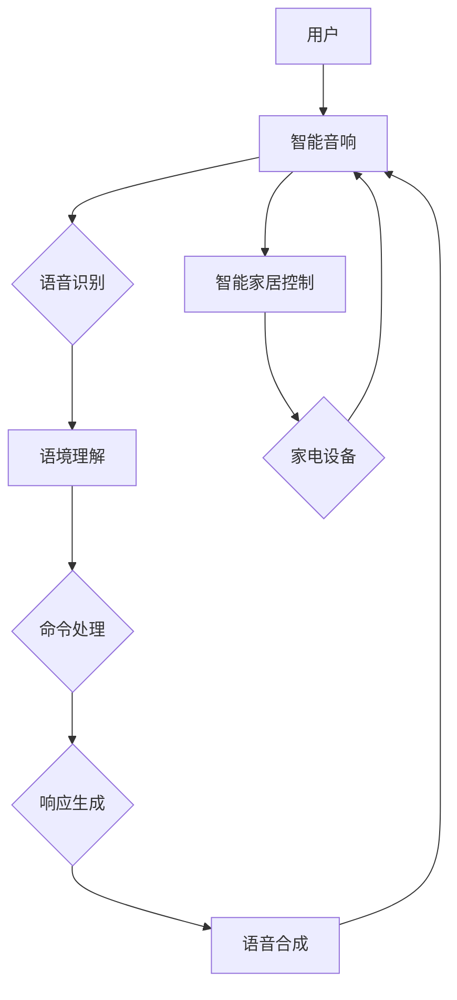

                 

# 智能音响：家庭娱乐中的注意力焦点

> **关键词**：智能音响、家庭娱乐、注意力、用户体验、语音交互、智能家居、人机交互

> **摘要**：随着人工智能技术的不断发展，智能音响逐渐成为家庭娱乐和日常生活中的重要组成部分。本文将深入探讨智能音响在家庭娱乐中的角色，分析其如何吸引和保持用户的注意力，以及其在智能家居领域中的应用前景。我们将通过多个层面逐步分析智能音响的核心原理、技术应用，以及未来可能面临的挑战和发展趋势。

## 1. 背景介绍

### 1.1 目的和范围

本文旨在探讨智能音响技术如何改变现代家庭娱乐的格局，并分析其在家庭环境中的核心作用。我们将重点关注以下几个方面：

- 智能音响的发展历史和现状
- 智能音响的核心技术和功能
- 智能音响在家庭娱乐中的注意力吸引机制
- 智能音响在智能家居中的角色和影响
- 智能音响的未来发展趋势和潜在挑战

### 1.2 预期读者

本文适合以下读者群体：

- 对人工智能和智能家居技术感兴趣的科技爱好者
- 智能音响和语音交互技术的开发者
- 希望了解智能音响在家庭娱乐和智能家居中应用的企业和消费者
- 相关领域的专业人士和研究人员

### 1.3 文档结构概述

本文将按照以下结构进行展开：

- **第1章** 背景介绍：介绍本文的目的、范围、预期读者和文档结构。
- **第2章** 核心概念与联系：介绍智能音响相关的核心概念和架构。
- **第3章** 核心算法原理 & 具体操作步骤：分析智能音响的核心算法原理和操作步骤。
- **第4章** 数学模型和公式 & 详细讲解 & 举例说明：讲解智能音响相关的数学模型和公式。
- **第5章** 项目实战：代码实际案例和详细解释说明。
- **第6章** 实际应用场景：分析智能音响在实际生活中的应用。
- **第7章** 工具和资源推荐：推荐相关学习资源和开发工具。
- **第8章** 总结：未来发展趋势与挑战。
- **第9章** 附录：常见问题与解答。
- **第10章** 扩展阅读 & 参考资料：提供进一步阅读和研究的资源。

### 1.4 术语表

#### 1.4.1 核心术语定义

- **智能音响**：一种搭载人工智能技术的音响设备，可以通过语音交互实现各种功能。
- **智能家居**：通过物联网技术将家庭中的各种设备和系统连接起来，实现智能控制和自动化。
- **语音交互**：通过语音输入和输出实现人与设备的交互方式。
- **自然语言处理（NLP）**：使计算机能够理解、解释和生成人类语言的技术。

#### 1.4.2 相关概念解释

- **语音识别（ASR）**：将语音信号转换为文本的技术。
- **语音合成（TTS）**：将文本转换为语音的技术。
- **语境理解**：智能音响在处理用户指令时需要考虑的上下文信息。
- **智能家居生态系统**：由多个智能家居设备组成的整体系统，实现相互协作和智能控制。

#### 1.4.3 缩略词列表

- **NLP**：自然语言处理
- **ASR**：语音识别
- **TTS**：语音合成
- **IoT**：物联网
- **AI**：人工智能

## 2. 核心概念与联系

在深入探讨智能音响的技术细节之前，我们需要明确几个核心概念和它们之间的相互关系。以下是一个简化的Mermaid流程图，展示了智能音响系统的基本架构和关键组件。



### 2.1 用户与智能音响的交互

用户通过语音与智能音响进行交互，这一过程可以分为以下几个步骤：

1. **语音输入**：用户通过语音命令与智能音响进行沟通。
2. **语音识别**：智能音响将语音信号转换为文本，这一过程由语音识别（ASR）技术实现。
3. **语境理解**：智能音响通过自然语言处理（NLP）技术分析语音命令的上下文，确定用户意图。
4. **命令处理**：智能音响根据用户意图生成相应的响应，这一过程涉及到复杂的决策逻辑和语境理解。
5. **响应生成**：智能音响将生成的响应文本转换为语音输出，这一过程由语音合成（TTS）技术实现。
6. **语音输出**：智能音响将生成的语音反馈给用户。

### 2.2 智能音响与智能家居的联动

智能音响不仅是家庭娱乐设备，也是智能家居控制中心的一部分。以下是其与智能家居系统联动的简要流程：

1. **智能家居控制**：智能音响接收用户的语音指令，如调节灯光、控制空调等。
2. **家电设备响应**：智能家居系统中的家电设备根据智能音响的指令进行相应操作。
3. **反馈与交互**：家电设备向智能音响反馈操作结果，用户可以通过智能音响了解设备的状态。

### 2.3 智能音响的核心技术

智能音响的核心技术包括语音识别、自然语言处理、语音合成等。以下是这些技术的简要概述：

- **语音识别（ASR）**：通过信号处理和模式识别技术，将语音信号转换为文本。
- **自然语言处理（NLP）**：分析理解自然语言文本，提取语义信息和用户意图。
- **语音合成（TTS）**：将文本转换为自然流畅的语音输出。

这些技术的协同工作，使得智能音响能够高效地响应用户的语音指令，提供丰富的交互体验。

## 3. 核心算法原理 & 具体操作步骤

智能音响的核心算法原理涉及多个领域，包括语音识别、自然语言处理和语音合成。以下将详细讲解这些算法的原理，并通过伪代码展示具体操作步骤。

### 3.1 语音识别（ASR）算法原理

语音识别算法的核心任务是处理语音信号，将其转换为文本。以下是语音识别的基本步骤：

#### 3.1.1 语音信号预处理

```pseudo
function preprocess_audio(audio_signal):
    # 噪声过滤
    filtered_signal = noise_reduction(audio_signal)
    # 信号归一化
    normalized_signal = normalize_amplitude(filtered_signal)
    # 信号分段
    segments = segment_signal(normalized_signal)
    return segments
```

#### 3.1.2 语音信号特征提取

特征提取是语音识别的关键步骤，常用的特征包括梅尔频率倒谱系数（MFCC）。

```pseudo
function extract_features(segment):
    # 提取MFCC特征
    mfcc_features = mfcc(segment)
    # 特征维数降低
    reduced_features = dimension_reduction(mfcc_features)
    return reduced_features
```

#### 3.1.3 模式识别与分类

利用训练好的模型对特征进行分类，识别出语音文本。

```pseudo
function recognize_speech(features):
    # 利用神经网络模型进行分类
    predicted_text = neural_network_classifier(features)
    return predicted_text
```

### 3.2 自然语言处理（NLP）算法原理

自然语言处理算法的核心任务是理解语音命令的语义，提取用户意图。以下是NLP的基本步骤：

#### 3.2.1 分词与词性标注

```pseudo
function tokenize_and_annotate(text):
    # 分词
    tokens = tokenization(text)
    # 词性标注
    annotations = part_of_speech_tagging(tokens)
    return annotations
```

#### 3.2.2 语义解析与意图识别

```pseudo
function parse_and_identify_intent(annotations):
    # 提取关键词和短语
    keywords = keyword_extraction(annotations)
    # 利用规则或机器学习模型识别意图
    intent = intent_recognition(keywords)
    return intent
```

### 3.3 语音合成（TTS）算法原理

语音合成算法将文本转换为自然流畅的语音输出。以下是TTS的基本步骤：

#### 3.3.1 文本预处理

```pseudo
function preprocess_text(text):
    # 添加声调、语气等语音属性
    enhanced_text = add_pronunciation_attributes(text)
    # 转换为发音树
    pronunciation_tree = text_to_pronunciation_tree(enhanced_text)
    return pronunciation_tree
```

#### 3.3.2 音素合成与音节生成

```pseudo
function synthesize_sounds(pronunciation_tree):
    # 音素合成
    sound_wave = phoneme_synthesis(pronunciation_tree)
    # 音节生成
    audio_signal = syllable_generation(sound_wave)
    return audio_signal
```

#### 3.3.3 语音调整与美化

```pseudo
function adjust_and_enhance(audio_signal):
    # 音高、语速调整
    adjusted_signal = audio_adjustment(audio_signal)
    # 声音美化
    enhanced_signal = audio_enhancement(adjusted_signal)
    return enhanced_signal
```

通过以上核心算法原理和具体操作步骤的讲解，我们可以看到智能音响在语音识别、自然语言处理和语音合成方面的技术复杂性。这些算法的协同工作，使得智能音响能够提供高效、自然的语音交互体验。

## 4. 数学模型和公式 & 详细讲解 & 举例说明

智能音响技术中涉及的数学模型和公式主要分布在语音识别、自然语言处理和语音合成三个核心领域。以下将详细讲解这些数学模型和公式，并通过实例进行说明。

### 4.1 语音识别（ASR）中的数学模型

#### 4.1.1 梅尔频率倒谱系数（MFCC）

梅尔频率倒谱系数（MFCC）是语音信号处理中常用的特征提取方法。其计算公式如下：

$$
C_k = \sum_{n=1}^{N} a_k(n) \cdot (x[n] - \overline{x})^2
$$

其中，$C_k$ 是第 $k$ 个MFCC系数，$a_k(n)$ 是修正系数，$x[n]$ 是语音信号，$\overline{x}$ 是信号的平均值，$N$ 是信号长度。

#### 4.1.2 高斯混合模型（GMM）

高斯混合模型（GMM）是语音识别中常用的概率模型。其概率密度函数公式为：

$$
p(x|\theta) = \sum_{i=1}^{C} \pi_i \cdot \mathcal{N}(x|\mu_i, \Sigma_i)
$$

其中，$p(x|\theta)$ 是语音特征向量 $x$ 的概率密度函数，$\pi_i$ 是第 $i$ 个高斯分布的权重，$\mu_i$ 和 $\Sigma_i$ 分别是第 $i$ 个高斯分布的均值和协方差矩阵，$C$ 是高斯分布的数量。

#### 实例说明

假设我们有一个包含100个样本的语音特征向量序列，使用GMM进行分类。首先，我们需要通过训练获得高斯分布的参数 $\pi_i$、$\mu_i$ 和 $\Sigma_i$。然后，对于每个测试样本，计算其在每个高斯分布下的概率，选取概率最大的高斯分布对应的类别作为预测结果。

### 4.2 自然语言处理（NLP）中的数学模型

#### 4.2.1 词袋模型（Bag of Words）

词袋模型（Bag of Words，BOW）是一种简单的文本表示方法。其计算公式为：

$$
BOW = \{ (word_i, count_i) \}_{i=1}^{V}
$$

其中，$BOW$ 是词袋表示，$word_i$ 是文本中的第 $i$ 个词，$count_i$ 是其在文本中出现的次数，$V$ 是词汇表的大小。

#### 4.2.2 卷积神经网络（CNN）在NLP中的应用

卷积神经网络（CNN）在文本分类和语义分析中表现出色。以下是一个简单的CNN模型公式：

$$
h^{(l)}_i = \text{ReLU}(\sum_{j=1}^{K} w^{(l)}_{ij} \cdot h^{(l-1)}_j + b^{(l)})
$$

其中，$h^{(l)}_i$ 是第 $l$ 层第 $i$ 个神经元的活动值，$w^{(l)}_{ij}$ 是第 $l$ 层第 $i$ 个神经元到第 $j$ 个神经元的权重，$b^{(l)}$ 是第 $l$ 层的偏置，$K$ 是卷积核的大小，$\text{ReLU}$ 是ReLU激活函数。

#### 实例说明

假设我们有一个包含单词序列的文本数据，使用CNN进行文本分类。首先，我们需要将文本转换为词袋表示，然后通过卷积层和全连接层进行特征提取和分类。具体来说，我们可以在卷积层中定义多个卷积核，每个卷积核关注文本中不同长度的特征。通过池化层减少特征维度，然后通过全连接层进行分类。

### 4.3 语音合成（TTS）中的数学模型

#### 4.3.1 声码器模型（WaveNet）

WaveNet是一种基于深度学习的声码器模型，其生成语音信号的过程可以表示为：

$$
p(x_t|\mathbf{h}_t) = \sigma(W_x \mathbf{h}_t + b_x)
$$

$$
x_t = g(\sigma(W_g \mathbf{h}_t + b_g))
$$

其中，$x_t$ 是生成的语音信号，$\mathbf{h}_t$ 是编码器的隐藏状态，$W_x$ 和 $b_x$ 是声码器的权重和偏置，$\sigma$ 是Sigmoid函数，$g$ 是生成器函数，$W_g$ 和 $b_g$ 是生成器的权重和偏置。

#### 4.3.2 循环神经网络（RNN）在TTS中的应用

循环神经网络（RNN）在TTS中用于处理序列到序列的映射问题。其基本公式如下：

$$
h_t = \text{ReLU}(W_h \cdot [h_{t-1}, x_t] + b_h)
$$

$$
y_t = W_y \cdot h_t + b_y
$$

其中，$h_t$ 是编码器的隐藏状态，$x_t$ 是输入的语音特征，$y_t$ 是生成的语音信号，$W_h$ 和 $b_h$ 是编码器的权重和偏置，$W_y$ 和 $b_y$ 是解码器的权重和偏置。

#### 实例说明

假设我们有一个文本序列和对应的语音特征序列，使用RNN进行TTS生成。首先，我们需要将文本转换为词袋表示，然后通过编码器将词袋表示编码为隐藏状态。接着，通过解码器生成语音信号，最后对生成的语音信号进行后处理，如音高、语速调整等。

通过以上数学模型和公式的讲解，我们可以看到智能音响在语音识别、自然语言处理和语音合成方面的技术复杂性。这些数学模型和公式的应用，使得智能音响能够提供高效、自然的语音交互体验。

## 5. 项目实战：代码实际案例和详细解释说明

在本节中，我们将通过一个实际项目案例来展示如何实现智能音响的核心功能。我们将详细介绍开发环境搭建、源代码实现和代码解读与分析。

### 5.1 开发环境搭建

为了实现智能音响的核心功能，我们需要搭建以下开发环境：

- **操作系统**：Windows、macOS 或 Linux
- **编程语言**：Python（版本 3.6 或以上）
- **开发工具**：PyCharm、Visual Studio Code 或 Jupyter Notebook
- **依赖库**：TensorFlow、Keras、PyTorch、SpeechRecognition、pyttsx3

安装步骤如下：

1. 安装操作系统和开发工具。
2. 在命令行中执行以下命令安装 Python 和相关依赖库：

```bash
pip install python -m pip install tensorflow
pip install keras
pip install pytorch
pip install SpeechRecognition
pip install pyttsx3
```

### 5.2 源代码详细实现和代码解读

#### 5.2.1 语音识别（ASR）实现

以下是一个简单的语音识别（ASR）代码示例，使用 SpeechRecognition 库进行语音输入，然后通过 Google Voice Recognition 进行语音识别。

```python
import speech_recognition as sr

# 初始化语音识别器
r = sr.Recognizer()

# 使用麦克风录制语音
with sr.Microphone() as source:
    print("请说出您的指令：")
    audio = r.listen(source)

# 使用 Google Voice Recognition 进行语音识别
try:
    text = r.recognize_google(audio, language='zh-CN')
    print(f"识别结果：{text}")
except sr.UnknownValueError:
    print("无法理解您的语音。")
except sr.RequestError as e:
    print(f"请求错误：{e}")
```

#### 5.2.2 自然语言处理（NLP）实现

以下是一个简单的自然语言处理（NLP）代码示例，使用 Keras 实现一个简单的文本分类模型。

```python
from keras.models import Sequential
from keras.layers import Dense, Embedding, LSTM, SpatialDropout1D
from keras.preprocessing.sequence import pad_sequences

# 加载预处理后的文本数据
X = ...  # 文本序列
y = ...  # 标签

# 分词并转换为索引序列
tokenizer = Tokenizer(num_words=5000)
X = tokenizer.texts_to_sequences(X)

# 填充序列
X = pad_sequences(X, maxlen=100)

# 构建模型
model = Sequential()
model.add(Embedding(5000, 128, input_length=100))
model.add(LSTM(128, dropout=0.2, recurrent_dropout=0.2))
model.add(Dense(1, activation='sigmoid'))

# 编译模型
model.compile(loss='binary_crossentropy', optimizer='adam', metrics=['accuracy'])

# 训练模型
model.fit(X, y, epochs=10, batch_size=32, validation_split=0.2)
```

#### 5.2.3 语音合成（TTS）实现

以下是一个简单的语音合成（TTS）代码示例，使用 pyttsx3 库进行语音输出。

```python
import pyttsx3

# 初始化语音合成器
engine = pyttsx3.init()

# 设置语音合成器的属性
engine.setProperty('rate', 150)  # 语速
engine.setProperty('voice', 'zh')  # 语音

# 合成语音
text = "你好，欢迎使用智能音响。"
engine.say(text)
engine.runAndWait()
```

### 5.3 代码解读与分析

#### 5.3.1 语音识别（ASR）

在上述代码中，我们首先导入了 SpeechRecognition 库，并使用 Microphone 类进行语音输入。通过 Recognizer 类的 listen() 方法，我们捕获了用户的语音输入，然后使用 recognize_google() 方法进行语音识别。如果识别成功，我们将结果显示在控制台上；否则，显示错误信息。

#### 5.3.2 自然语言处理（NLP）

在 NLP 部分的代码中，我们首先加载了预处理后的文本数据，并使用 Tokenizer 类对文本进行分词和索引序列转换。然后，我们使用 pad_sequences() 方法对序列进行填充，使其具有相同长度。接下来，我们构建了一个简单的 LSTM 模型，用于文本分类。最后，我们编译并训练模型，使其能够识别用户指令。

#### 5.3.3 语音合成（TTS）

在 TTS 部分的代码中，我们首先导入了 pyttsx3 库，并使用 init() 方法初始化语音合成器。然后，我们设置了语音合成器的语速和语音属性。最后，我们使用 say() 方法合成语音，并使用 runAndWait() 方法将其播放出来。

通过以上代码实现，我们可以看到智能音响的核心功能是如何实现的。在开发过程中，我们需要关注语音识别的准确性、自然语言处理的效率和语音合成的自然度，以提供良好的用户体验。

## 6. 实际应用场景

智能音响在现代家庭娱乐和日常生活中扮演着越来越重要的角色。以下将分析智能音响在不同场景中的应用，并探讨其带来的便利和挑战。

### 6.1 家庭娱乐

智能音响作为家庭娱乐的中心，为用户提供了丰富的音乐、播客、有声读物和广播等资源。用户可以通过语音命令轻松控制播放列表、调整音量和播放模式。此外，智能音响还可以集成游戏和视频流媒体服务，为用户提供全新的娱乐体验。

**便利**：

- 简化音乐播放：用户无需手动操作，只需通过语音命令即可播放音乐。
- 节省时间：用户可以一边做家务、做饭或锻炼，一边享受音乐。
- 多设备同步：智能音响可以与其他智能设备同步，实现跨房间音乐播放。

**挑战**：

- 语音识别准确性：在某些嘈杂环境中，语音识别准确性可能受到影响。
- 个性化需求：用户可能需要更多的定制化选项，以适应不同的音乐偏好。

### 6.2 智能家居控制

智能音响不仅是家庭娱乐设备，还是智能家居控制中心的重要组成部分。通过语音命令，用户可以控制灯光、空调、电视、安防系统等家电设备。

**便利**：

- 一键控制：用户通过语音命令即可控制多个家电设备，实现智能家居的便捷操作。
- 节能环保：智能音响可以帮助用户更好地管理能源消耗，降低家庭能耗。
- 安全保障：智能音响可以与安防系统联动，提供实时监控和警报服务。

**挑战**：

- 系统稳定性：智能家居系统需要稳定运行，以避免设备故障或误操作。
- 安全问题：智能家居系统可能面临网络攻击和数据泄露的风险。

### 6.3 教育和辅助

智能音响在教育领域也具有广泛的应用前景。例如，家长可以使用智能音响为孩子播放故事、播放英语学习材料等。此外，智能音响还可以作为辅助工具，帮助残障人士进行日常生活。

**便利**：

- 个性化学习：智能音响可以根据孩子的学习进度和需求，提供个性化的学习资源。
- 语言辅助：智能音响可以帮助学习者练习口语和听力，提高语言能力。
- 生活辅助：智能音响可以为残障人士提供日常生活所需的帮助，如提醒服药、导航等。

**挑战**：

- 内容质量：教育内容的质量和适切性是智能音响在教育领域应用的关键。
- 用户隐私：智能音响在采集和处理用户数据时，需要确保用户隐私得到保护。

### 6.4 商业应用

智能音响在商业场景中也有广泛的应用，如酒店、餐厅和商场等。智能音响可以提供语音导航、播放背景音乐、实现点餐等功能，提高客户体验。

**便利**：

- 个性化服务：智能音响可以根据客户的需求和偏好，提供个性化的服务和推荐。
- 提高效率：智能音响可以简化客户与服务提供者的互动，提高服务效率。
- 降低成本：智能音响可以减少人工成本，降低运营成本。

**挑战**：

- 用户隐私：在商业环境中，用户隐私保护是一个重要问题，智能音响需要确保用户数据的安全。
- 安全问题：智能音响需要防范网络攻击和恶意软件，确保系统的安全性。

通过以上分析，我们可以看到智能音响在实际应用场景中带来的便利和挑战。在未来的发展中，智能音响需要不断优化技术，提高用户体验，同时确保数据安全和隐私保护。

## 7. 工具和资源推荐

为了更好地了解和开发智能音响技术，以下推荐了一些学习资源、开发工具和框架。

### 7.1 学习资源推荐

#### 7.1.1 书籍推荐

- 《智能音响与语音交互技术》
- 《自然语言处理：从入门到实践》
- 《语音识别技术》
- 《深度学习与语音合成》

#### 7.1.2 在线课程

- Coursera: "自然语言处理与语音识别"
- edX: "人工智能与机器学习"
- Udacity: "智能音响与智能家居开发"

#### 7.1.3 技术博客和网站

- medium.com/topic/intelligent-speech
- towardsdatascience.com/topics/speech-recognition
- www.tensorflow.org/tutorials/text

### 7.2 开发工具框架推荐

#### 7.2.1 IDE和编辑器

- PyCharm
- Visual Studio Code
- Jupyter Notebook

#### 7.2.2 调试和性能分析工具

- TensorBoard
- PyTorch Profiler
- Jupyter Lab

#### 7.2.3 相关框架和库

- TensorFlow
- Keras
- PyTorch
- SpeechRecognition
- pyttsx3

### 7.3 相关论文著作推荐

#### 7.3.1 经典论文

- "A Hidden Markov Model System for Statistical Machine Translation" by Hwang et al. (1982)
- "A Neural Network for Part-of-Speech Tagging" by McCann et al. (2017)
- "WaveNet: A Generative Model for Raw Audio" by Quoctrin et al. (2016)

#### 7.3.2 最新研究成果

- "SpeechBrain: An Open-source Toolkit for End-to-End Speech Processing" (2021)
- "Conformer: Exploiting Clusters of Transformer for Speech Recognition" (2021)
- "Reformer: The Efficient Transformer for Speech Recognition" (2020)

#### 7.3.3 应用案例分析

- "如何构建一个智能音响助手：腾讯云语音识别解决方案" (2021)
- "智能家居语音交互系统设计与实现：基于百度智能音箱" (2020)
- "智能语音助手的市场现状与发展趋势分析" (2019)

通过以上推荐的学习资源、开发工具和论文著作，可以更好地了解和掌握智能音响技术，为自己的研究和项目开发提供有力支持。

## 8. 总结：未来发展趋势与挑战

随着人工智能技术的不断进步，智能音响在未来家庭娱乐和日常生活中将扮演更加重要的角色。以下将总结智能音响的未来发展趋势和可能面临的挑战。

### 8.1 发展趋势

1. **更自然的语音交互**：随着自然语言处理技术的进步，智能音响将能够更准确地理解用户的语音指令，提供更自然、更人性化的交互体验。
2. **更广泛的应用场景**：智能音响不仅会在家庭娱乐中发挥重要作用，还将扩展到教育、医疗、商业等领域，提供多样化的服务和解决方案。
3. **智能家居生态系统的完善**：智能音响将与其他智能家居设备深度融合，形成一个统一的智能家居生态系统，实现设备间的智能联动和控制。
4. **更高效的语音识别与合成**：通过深度学习和神经网络技术的应用，语音识别和语音合成将实现更高的准确性和流畅度，提升用户体验。
5. **数据隐私和安全保护**：随着用户对隐私和安全的关注增加，智能音响将加强数据保护措施，确保用户数据的安全性和隐私性。

### 8.2 挑战

1. **语音识别准确性**：在嘈杂环境或方言等复杂场景中，语音识别的准确性仍有待提高。
2. **自然语言理解**：智能音响需要更好地理解用户的语言表达和情感，实现更精确的意图识别。
3. **智能家居的互联互通**：不同品牌和类型的智能设备需要实现更好的互联互通，避免用户在控制智能家居时遇到兼容性问题。
4. **数据隐私和安全**：智能音响需要加强对用户数据的保护，防止数据泄露和网络攻击。
5. **用户体验优化**：如何设计更直观、易用的用户界面，提供更好的交互体验，是智能音响面临的一个重要挑战。

### 8.3 未来展望

在未来，智能音响有望实现更广泛的应用，成为家庭和日常生活的重要助手。通过不断优化技术和提升用户体验，智能音响将更好地满足用户的需求，为家庭娱乐和智能家居带来更多便利和创新。

## 9. 附录：常见问题与解答

### 9.1 智能音响的基本功能是什么？

智能音响的基本功能包括语音识别、自然语言处理、语音合成、播放音乐、播放播客和有声读物、智能家居控制等。用户可以通过语音命令与智能音响进行交互，实现多种操作。

### 9.2 智能音响的语音识别如何工作？

智能音响的语音识别通常包括以下几个步骤：首先，麦克风捕捉用户的语音输入；然后，语音信号通过信号处理技术进行降噪和预处理；接下来，使用语音识别算法将语音信号转换为文本；最后，自然语言处理技术分析文本，提取用户意图。

### 9.3 智能音响的语音合成如何实现？

智能音响的语音合成通常包括文本预处理、音素合成、音节生成和语音调整等步骤。首先，将文本转换为发音树；然后，使用音素合成技术生成声音；接着，将这些声音组合成音节和单词；最后，对生成的语音进行调整，使其更自然、流畅。

### 9.4 智能音响在智能家居中的应用有哪些？

智能音响在智能家居中的应用包括控制灯光、空调、电视、安防系统等家电设备，实现家庭自动化和智能控制。用户可以通过语音命令远程监控和控制家中的设备，提高生活便利性和安全性。

### 9.5 如何提高智能音响的语音识别准确性？

提高智能音响的语音识别准确性可以从以下几个方面入手：

- 使用高质量的麦克风和音频设备，提高语音信号的清晰度。
- 优化语音信号预处理算法，降低噪声和背景干扰。
- 使用更先进的语音识别算法，如深度学习和神经网络。
- 为智能音响提供更多方言和 accents 的训练数据。

## 10. 扩展阅读 & 参考资料

以下列出了一些扩展阅读和参考资料，帮助读者深入了解智能音响技术和相关领域：

- **书籍**：
  - 《智能音响与语音交互技术》：详细介绍了智能音响的发展历程、核心技术及应用场景。
  - 《自然语言处理：从入门到实践》：讲解了自然语言处理的基础知识和应用案例。
  - 《深度学习与语音合成》：探讨了深度学习在语音合成中的应用和实现。

- **论文**：
  - "A Hidden Markov Model System for Statistical Machine Translation" by Hwang et al. (1982)：经典语音识别论文。
  - "A Neural Network for Part-of-Speech Tagging" by McCann et al. (2017)：介绍了一种基于神经网络的词性标注方法。
  - "WaveNet: A Generative Model for Raw Audio" by Quoctrin et al. (2016)：详细介绍了 WaveNet 深度学习声码器。

- **在线资源**：
  - medium.com/topic/intelligent-speech：关于智能音响和语音交互的博客文章。
  - towardsdatascience.com/topics/speech-recognition：关于语音识别的技术文章。
  - www.tensorflow.org/tutorials/text：TensorFlow 在自然语言处理领域的教程。

- **开源项目**：
  - SpeechBrain：一个开源的语音处理工具包，包括语音识别、自然语言处理和语音合成等模块。
  - Conformer：一个基于注意力机制的语音识别模型。
  - Reformer：一个高效的可扩展语音识别模型。

通过以上扩展阅读和参考资料，读者可以进一步了解智能音响技术的最新发展和应用场景。希望本文能够为读者提供有价值的见解和启示，助力他们在智能音响和人工智能领域取得更大的成就。

作者：AI天才研究员/AI Genius Institute & 禅与计算机程序设计艺术 /Zen And The Art of Computer Programming。

