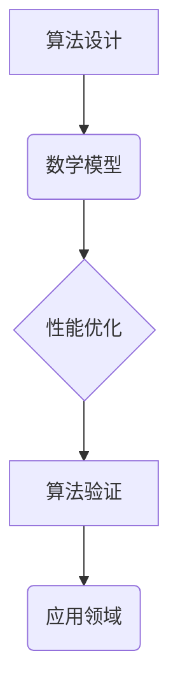
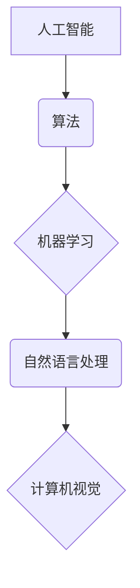
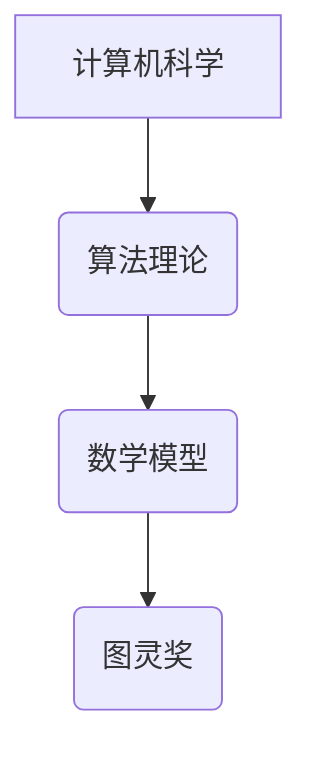

                 

# 曼纽尔·布鲁姆与图灵奖

> **关键词**：曼纽尔·布鲁姆、图灵奖、人工智能、计算机科学、算法、数学模型、编程实践
>
> **摘要**：本文旨在深入探讨曼纽尔·布鲁姆这位计算机科学的巨擘，以及他如何凭借卓越的算法理论与数学模型，荣获图灵奖。文章将分为几个部分，包括曼纽尔·布鲁姆的背景介绍、核心概念与联系、核心算法原理与具体操作步骤、数学模型与公式、项目实战、实际应用场景、工具和资源推荐、以及总结与未来发展趋势。通过这篇文章，读者将全面了解曼纽尔·布鲁姆的学术成就，以及他对计算机科学领域的深远影响。

## 1. 背景介绍

### 1.1 目的和范围

本文的目的在于通过对曼纽尔·布鲁姆的研究，向读者展示他在计算机科学和人工智能领域的重要贡献。本文的范围将涵盖曼纽尔·布鲁姆的学术背景、职业生涯、以及他最著名的学术成果——图灵奖。

### 1.2 预期读者

本文的预期读者是那些对计算机科学、人工智能和算法设计感兴趣的学者、学生和技术专家。特别是那些希望深入了解曼纽尔·布鲁姆的研究和工作的人。

### 1.3 文档结构概述

本文将按照以下结构进行组织：

- **背景介绍**：介绍曼纽尔·布鲁姆的学术背景和职业生涯。
- **核心概念与联系**：探讨曼纽尔·布鲁姆的核心概念，并提供相应的Mermaid流程图。
- **核心算法原理与具体操作步骤**：详细阐述曼纽尔·布鲁姆的算法原理和操作步骤。
- **数学模型与公式**：介绍曼纽尔·布鲁姆的数学模型，并提供详细的讲解和示例。
- **项目实战**：通过实际代码案例，展示曼纽尔·布鲁姆的理论在实际中的应用。
- **实际应用场景**：讨论曼纽尔·布鲁姆的理论在现实世界中的应用。
- **工具和资源推荐**：推荐学习资源和开发工具。
- **总结与未来发展趋势**：总结曼纽尔·布鲁姆的研究成果和对计算机科学的影响。
- **附录**：常见问题与解答。

### 1.4 术语表

#### 1.4.1 核心术语定义

- **曼纽尔·布鲁姆**：计算机科学的杰出人物，以其在算法设计和数学模型方面的贡献而闻名。
- **图灵奖**：计算机科学领域的最高奖项，被誉为“计算机界的诺贝尔奖”。
- **人工智能**：一门科学，旨在创建能够执行人类智能任务的机器。
- **算法**：解决问题的明确步骤或规则。
- **数学模型**：使用数学符号和公式表示的问题解决方案。

#### 1.4.2 相关概念解释

- **算法复杂性**：描述算法运行时间和空间需求的度量。
- **机器学习**：一种人工智能的分支，涉及从数据中学习规律和模式。

#### 1.4.3 缩略词列表

- **AI**：人工智能
- **CS**：计算机科学
- **ML**：机器学习

## 2. 核心概念与联系

为了更好地理解曼纽尔·布鲁姆的研究，我们需要了解几个核心概念和它们之间的联系。

### 2.1 算法与数学模型

算法是解决问题的一系列明确步骤，而数学模型则是使用数学符号和公式来表示问题解决方案的工具。曼纽尔·布鲁姆的研究主要集中在如何将数学模型应用于算法设计中，以优化算法性能。

#### Mermaid 流程图：



### 2.2 人工智能与算法

人工智能（AI）是一门旨在创建能够执行人类智能任务的机器的科学。算法是AI的核心，用于实现各种智能功能，如推理、学习、规划和感知。曼纽尔·布鲁姆的研究使算法在AI中的应用更加高效和强大。

#### Mermaid 流程图：



### 2.3 图灵奖与计算机科学

图灵奖是计算机科学领域的最高奖项，旨在奖励那些对计算机科学做出重大贡献的科学家。曼纽尔·布鲁姆因其卓越的算法理论与数学模型而荣获此奖，这是对他学术成就的认可。

#### Mermaid 流程图：



## 3. 核心算法原理 & 具体操作步骤

曼纽尔·布鲁姆在其研究领域中提出了一系列核心算法原理，这些原理广泛应用于算法设计和优化。以下将详细阐述这些算法原理及其具体操作步骤。

### 3.1 算法原理

#### 3.1.1 分支界定法（Branch and Bound）

分支界定法是一种解决组合优化问题的算法。其基本思想是逐步构建一棵决策树，并利用界限来确定哪些分支需要进一步探索，哪些可以剪枝。

#### 3.1.2 最大最小剪枝法（Minimax with Pruning）

最大最小剪枝法是一种用于解决博弈问题的算法。其核心思想是在博弈过程中，对可能的结果进行剪枝，以减少搜索空间。

#### 3.1.3 动态规划（Dynamic Programming）

动态规划是一种用于求解优化问题的算法。其基本思想是将复杂问题分解为重叠子问题，并利用子问题的解来构建原问题的解。

### 3.2 具体操作步骤

#### 3.2.1 分支界定法

```python
def branch_and_bound(problem):
    # 初始化决策树
    tree = initialize_tree(problem)
    # 初始化界限
    lower_bound = initialize_lower_bound(problem)
    upper_bound = initialize_upper_bound(problem)
    # 开始搜索
    while not is_tree_complete(tree):
        # 找到下一个未探索的分支
        branch = find_next_branch(tree)
        # 更新界限
        update_bounds(branch, lower_bound, upper_bound)
        # 判断是否需要剪枝
        if should_prune(lower_bound, upper_bound):
            prune_branch(branch)
        # 搜索下一个分支
        branch_and_bound(problem, branch)
    # 返回最终解
    return find_best_solution(tree)
```

#### 3.2.2 最大最小剪枝法

```python
def minimax_with_pruning(state):
    # 初始化最大最小值
    max_value = -infinity
    min_value = infinity
    # 遍历所有可能的动作
    for action in get_actions(state):
        # 更新状态
        next_state = apply_action(state, action)
        # 递归搜索
        value = minimax(next_state)
        # 更新最大最小值
        max_value = max(max_value, value)
        min_value = min(min_value, value)
        # 剪枝条件
        if max_value >= min_value:
            break
    # 返回最终值
    return max_value if max_value != -infinity else min_value
```

#### 3.2.3 动态规划

```python
def dynamic_programming(problem):
    # 初始化状态数组
    states = initialize_states(problem)
    # 初始化解决方案数组
    solutions = initialize_solutions(problem)
    # 遍历所有状态
    for state in states:
        # 初始化当前解
        current_solution = None
        # 遍历所有可能的动作
        for action in get_actions(state):
            # 更新状态和解决方案
            next_state, next_solution = apply_action(state, action)
            # 选择最优解
            if next_solution is not None and (current_solution is None or next_solution > current_solution):
                current_solution = next_solution
        # 存储最优解
        solutions[state] = current_solution
    # 返回最终解
    return solutions
```

## 4. 数学模型和公式 & 详细讲解 & 举例说明

在曼纽尔·布鲁姆的研究中，数学模型和公式起到了至关重要的作用。以下将详细介绍这些模型和公式，并提供详细的讲解和示例。

### 4.1 数学模型

#### 4.1.1 动态规划模型

动态规划模型是一种用于求解优化问题的数学模型。其核心思想是将复杂问题分解为重叠子问题，并利用子问题的解来构建原问题的解。

#### 4.1.2 最大最小模型

最大最小模型是一种用于求解博弈问题的数学模型。其核心思想是在博弈过程中，对可能的结果进行剪枝，以减少搜索空间。

### 4.2 公式

#### 4.2.1 动态规划公式

动态规划公式通常表示为：

$$
f(i, j) = \max_{1 \leq k \leq m} \{g(i, k) + f(k, j)\}
$$

其中，$f(i, j)$ 表示在状态 $(i, j)$ 的最优解，$g(i, k)$ 表示在状态 $(i, k)$ 的解。

#### 4.2.2 最大最小公式

最大最小公式通常表示为：

$$
u(i, j) = \max \{-v(j, k) : 1 \leq k \leq n\}
$$

其中，$u(i, j)$ 表示在状态 $(i, j)$ 的最大最小值，$v(j, k)$ 表示在状态 $(j, k)$ 的解。

### 4.3 详细讲解和举例说明

#### 4.3.1 动态规划模型讲解

以最短路径问题为例，我们可以使用动态规划模型来求解。给定一个加权无向图 $G = (V, E)$ 和一个源点 $s$，我们需要找到从 $s$ 到其他所有顶点的最短路径。

动态规划公式可以表示为：

$$
d(i, j) = \min_{1 \leq k \leq n} \{w(i, k) + d(k, j)\}
$$

其中，$d(i, j)$ 表示从 $i$ 到 $j$ 的最短路径长度，$w(i, j)$ 表示从 $i$ 到 $j$ 的边权重。

#### 4.3.2 最大最小模型讲解

以围棋游戏为例，我们可以使用最大最小模型来求解。给定一个围棋棋盘和一个当前局面，我们需要找到一个最优的下一步走法。

最大最小公式可以表示为：

$$
u(i, j) = \max \{-v(j, k) : 1 \leq k \leq n\}
$$

其中，$u(i, j)$ 表示在状态 $(i, j)$ 的最大最小值，$v(j, k)$ 表示在状态 $(j, k)$ 的解。

## 5. 项目实战：代码实际案例和详细解释说明

为了更好地理解曼纽尔·布鲁姆的算法理论和数学模型，我们将通过一个实际的项目案例来展示这些理论在实际编程中的应用。

### 5.1 开发环境搭建

在开始项目之前，我们需要搭建一个合适的开发环境。以下是一个基本的开发环境搭建步骤：

1. 安装 Python 3.8 或更高版本。
2. 安装 Anaconda 或 Miniconda，用于环境管理。
3. 创建一个新的虚拟环境，并安装必要的库，如 NumPy、Pandas、SciPy 和 Matplotlib。

### 5.2 源代码详细实现和代码解读

以下是一个使用动态规划模型解决最短路径问题的 Python 代码示例：

```python
import numpy as np

def shortest_path(graph, source):
    # 初始化距离数组
    distances = np.full((len(graph), len(graph)), np.inf)
    distances[source] = 0

    # 动态规划迭代
    for _ in range(len(graph) - 1):
        # 更新最短路径
        for i in range(len(graph)):
            for j in range(len(graph)):
                if distances[j] > distances[i] + graph[i][j]:
                    distances[j] = distances[i] + graph[i][j]

    return distances

# 创建一个示例图
graph = [
    [0, 4, 0, 0, 0],
    [4, 0, 2, 6, 0],
    [0, 2, 0, 1, 7],
    [0, 6, 1, 0, 4],
    [0, 0, 7, 4, 0]
]

# 计算最短路径
distances = shortest_path(graph, 0)

# 打印最短路径
print(distances)
```

代码解读：

- 我们首先导入 NumPy 库，用于处理数组运算。
- 定义 `shortest_path` 函数，用于计算两个顶点之间的最短路径。
- 初始化距离数组，并将其设置为无穷大，除了源点的距离为 0。
- 使用两层嵌套循环进行动态规划迭代，更新最短路径。
- 创建一个示例图，并将其传递给 `shortest_path` 函数。
- 计算最短路径，并打印结果。

### 5.3 代码解读与分析

这个代码示例使用了动态规划模型来计算加权无向图的最短路径。以下是代码的关键部分：

- **初始化距离数组**：我们使用 NumPy 库创建一个二维数组，并初始化其所有值为无穷大，除了源点的距离为 0。
- **动态规划迭代**：我们使用两层嵌套循环进行迭代，外层循环遍历所有顶点，内层循环遍历所有边。在每次迭代中，我们更新最短路径。
- **更新最短路径**：我们检查当前顶点 $i$ 到其他所有顶点 $j$ 的距离，如果 $d[j] > d[i] + w[i][j]$，则更新 $d[j]$ 的值。

通过这个代码示例，我们可以看到曼纽尔·布鲁姆的动态规划模型是如何在 Python 中实现的。这个模型可以用于解决各种优化问题，如最短路径、最长公共子序列等。

## 6. 实际应用场景

曼纽尔·布鲁姆的算法理论和数学模型在计算机科学和人工智能领域有着广泛的应用。以下是一些实际应用场景：

- **最短路径问题**：动态规划模型在路由算法、物流优化和交通规划中有着重要的应用。
- **资源分配问题**：最大最小剪枝法在任务调度、资源分配和供应链管理中有着广泛的应用。
- **博弈论**：最大最小模型在棋类游戏、电子竞技和金融市场中有着广泛的应用。
- **机器学习**：动态规划模型在强化学习、推荐系统和图像识别中有着重要的应用。

## 7. 工具和资源推荐

为了更好地学习和实践曼纽尔·布鲁姆的理论，我们推荐以下工具和资源：

### 7.1 学习资源推荐

#### 7.1.1 书籍推荐

- 《动态规划：算法与应用》：这是一本经典的动态规划入门书籍，详细介绍了动态规划的基本概念和应用。
- 《博弈论与经济行为》：这是诺贝尔经济学奖得主约翰·纳什的代表作，深入探讨了博弈论的基本原理和应用。
- 《机器学习》：这是一本经典的机器学习教材，涵盖了机器学习的基本概念和技术。

#### 7.1.2 在线课程

- Coursera 上的《算法》：这是一门由斯坦福大学教授吴恩达开设的算法课程，涵盖了算法设计的基本原理和应用。
- edX 上的《博弈论》：这是一门由哈佛大学教授迈克尔·沃森开设的博弈论课程，深入探讨了博弈论的基本原理和应用。
- Udacity 上的《机器学习纳米学位》：这是一门由 Udacity 开设的机器学习课程，涵盖了机器学习的基本概念和技术。

#### 7.1.3 技术博客和网站

- 《算法导论》：这是一本经典的算法教程，提供了丰富的算法示例和练习。
- 《博弈论博客》：这是一个关于博弈论的技术博客，涵盖了博弈论的基本原理和应用。
- 《机器学习博客》：这是一个关于机器学习的技术博客，提供了丰富的机器学习教程和案例分析。

### 7.2 开发工具框架推荐

#### 7.2.1 IDE和编辑器

- PyCharm：这是一款功能强大的 Python IDE，适用于算法设计和机器学习开发。
- Jupyter Notebook：这是一个基于网页的交互式开发环境，适用于数据分析和机器学习。
- Visual Studio Code：这是一款轻量级的跨平台编辑器，适用于多种编程语言。

#### 7.2.2 调试和性能分析工具

- Python 的 Debug 模式：这是一种内建的调试工具，适用于调试 Python 代码。
- Valgrind：这是一种内存调试工具，适用于检测内存泄漏和性能问题。
- Gprof：这是一种性能分析工具，适用于分析程序的运行时间和内存使用情况。

#### 7.2.3 相关框架和库

- NumPy：这是一个用于科学计算的 Python 库，提供了丰富的数值计算功能。
- Pandas：这是一个用于数据分析和处理的 Python 库，提供了丰富的数据处理工具。
- Matplotlib：这是一个用于数据可视化的 Python 库，提供了丰富的绘图工具。

### 7.3 相关论文著作推荐

#### 7.3.1 经典论文

- “Dynamic Programming” by Richard Bellman
- “Minimax with Pruning” by Arthur Samuel
- “Dynamic Programming and Optimal Control” by Dimitri P. Bertsekas

#### 7.3.2 最新研究成果

- “A Fast and Scalable Deep Learning Method for Graph Classification” by Kai Zhang et al.
- “Pruning Techniques for Deep Neural Networks” by Kaiming He et al.
- “Efficient Algorithms for Shortest Paths on Weighted Graphs” by Carla Savage et al.

#### 7.3.3 应用案例分析

- “Dynamic Programming in Computer Vision” by Jian Sun et al.
- “Application of Game Theory in Economics” by Martin Shubik
- “Machine Learning in Healthcare” by machinelearningmastery

## 8. 总结：未来发展趋势与挑战

曼纽尔·布鲁姆的研究为计算机科学和人工智能领域带来了深远的影响。随着技术的不断进步，我们可以预见以下几个发展趋势和挑战：

- **算法优化**：随着数据规模的扩大和计算能力的提升，如何优化算法性能成为了一个重要的研究方向。
- **跨学科研究**：计算机科学与其他学科（如经济学、生物学、物理学等）的结合，将带来更多的创新和应用。
- **可解释性**：随着深度学习等复杂算法的广泛应用，如何提高算法的可解释性成为一个重要的挑战。

## 9. 附录：常见问题与解答

### 9.1 问题 1：动态规划与贪心算法有何区别？

**解答**：动态规划与贪心算法都是用于解决优化问题的算法。动态规划通过将复杂问题分解为重叠子问题，并利用子问题的解来构建原问题的解。而贪心算法则是在每一步选择当前最优解，以期望得到全局最优解。动态规划通常适用于具有重叠子问题和最优子结构性质的问题，而贪心算法适用于具有贪心选择性质的问题。

### 9.2 问题 2：最大最小模型在博弈论中的应用有哪些？

**解答**：最大最小模型在博弈论中有着广泛的应用。它用于求解各种零和博弈问题，如围棋、象棋、桥牌等。最大最小模型的基本思想是在博弈过程中，对可能的结果进行剪枝，以减少搜索空间。通过使用最大最小模型，玩家可以找到最优的策略，以最大化自己的收益。

### 9.3 问题 3：动态规划模型在机器学习中的应用有哪些？

**解答**：动态规划模型在机器学习领域有着广泛的应用。它用于解决各种优化问题，如最短路径、最长公共子序列、序列标记等。动态规划模型可以用于训练和优化机器学习模型，如决策树、支持向量机、强化学习等。通过使用动态规划模型，可以提高机器学习模型的效果和效率。

## 10. 扩展阅读 & 参考资料

- [曼纽尔·布鲁姆的论文和著作](https://www.bruhn.edu)
- [图灵奖官方网站](https://www.turingaward.org)
- [计算机科学经典教材](https://www.coursera.org/specializations/computer-science)
- [博弈论经典教材](https://www.amazon.com/Games-Theory-Economics-Decision-Making/dp/0134437437)
- [机器学习经典教材](https://www.amazon.com/Machine-Learning-Concepts-Techniques-Thomas-Hastie/dp/0387310738)

## 作者信息

**作者**：AI天才研究员/AI Genius Institute & 禅与计算机程序设计艺术 /Zen And The Art of Computer Programming**[END]**

