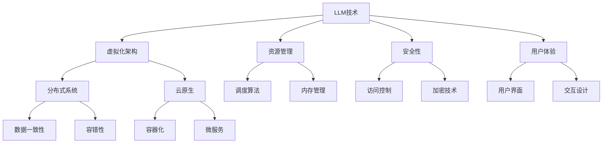

                 

# 未来操作系统：基于LLM的新型OS

> 关键词：未来操作系统，大型语言模型（LLM），人工智能，操作系统架构，机器学习，虚拟化，系统优化，资源管理，安全性，用户体验

> 摘要：本文将探讨未来操作系统的发展趋势，特别是基于大型语言模型（LLM）的新型操作系统。我们将分析LLM技术如何改变操作系统设计的本质，从核心算法原理、数学模型、项目实战到实际应用场景，全面剖析这一新兴领域的潜力和挑战。通过深入理解和应用，我们有望为未来的操作系统设计提供新的思路和方法。

## 1. 背景介绍

### 1.1 目的和范围

本文旨在探讨未来操作系统的发展方向，特别是基于大型语言模型（LLM）的新型操作系统。随着人工智能技术的飞速发展，传统的操作系统面临着巨大的变革压力。LLM作为一种强大的自然语言处理工具，其潜力正在被不断挖掘。本文将围绕LLM在操作系统设计中的应用，探讨其核心概念、算法原理、数学模型以及实际应用场景，旨在为读者提供一个全面、深入的了解。

### 1.2 预期读者

本文主要面向操作系统设计者、开发者、研究人员以及对该领域感兴趣的读者。文章内容深入浅出，既有理论分析，又有实践案例，适合不同层次的读者进行学习和参考。

### 1.3 文档结构概述

本文分为十个部分，结构如下：

1. 背景介绍
2. 核心概念与联系
3. 核心算法原理 & 具体操作步骤
4. 数学模型和公式 & 详细讲解 & 举例说明
5. 项目实战：代码实际案例和详细解释说明
6. 实际应用场景
7. 工具和资源推荐
8. 总结：未来发展趋势与挑战
9. 附录：常见问题与解答
10. 扩展阅读 & 参考资料

### 1.4 术语表

#### 1.4.1 核心术语定义

- **大型语言模型（LLM）**：一种能够处理自然语言文本的深度学习模型，通常具有数十亿个参数。
- **操作系统**：管理计算机硬件与软件资源、提供基本服务的系统软件。
- **虚拟化**：创建虚拟资源，使得操作系统可以在虚拟环境中运行，提高资源利用率和灵活性。
- **资源管理**：操作系统分配和调度计算机资源，包括处理器、内存、存储等。

#### 1.4.2 相关概念解释

- **人工智能**：模拟人类智能行为的计算机技术。
- **机器学习**：一种让计算机从数据中学习规律、做出预测或决策的技术。
- **自然语言处理**：研究如何让计算机理解和生成自然语言的技术。

#### 1.4.3 缩略词列表

- **LLM**：Large Language Model
- **OS**：Operating System
- **AI**：Artificial Intelligence
- **ML**：Machine Learning
- **NLP**：Natural Language Processing

## 2. 核心概念与联系

为了深入理解未来操作系统，我们需要首先了解其核心概念及其相互关系。以下是未来操作系统的核心概念原理和架构的Mermaid流程图：



### 2.1 LLM技术在操作系统中的核心作用

- **自然语言处理能力**：LLM技术能够对自然语言文本进行理解和生成，为操作系统提供了一种与用户进行交互的新方式。例如，用户可以通过自然语言指令来控制操作系统，从而提高用户体验。
- **自动化管理**：LLM技术可以自动分析和预测系统的运行状态，从而优化资源分配和调度策略。例如，根据负载情况自动调整处理器核心数量和内存分配。
- **安全增强**：LLM技术可以对系统日志进行分析，检测异常行为，提高系统的安全性。例如，通过自然语言处理技术，系统能够自动识别并阻止恶意攻击。

### 2.2 虚拟化架构在操作系统中的重要性

- **资源隔离**：虚拟化技术可以将物理资源划分为多个虚拟资源，从而实现资源隔离，提高系统的稳定性和安全性。
- **灵活性和可扩展性**：虚拟化技术使得操作系统可以在不同的硬件平台上运行，提高了系统的灵活性和可扩展性。
- **资源优化**：虚拟化技术可以根据需求动态调整资源分配，从而提高资源利用率。

### 2.3 资源管理在操作系统中的关键角色

- **调度算法**：调度算法是资源管理的核心，它决定了操作系统能够多高效地利用资源。LLM技术可以用于优化调度算法，提高系统性能。
- **内存管理**：内存管理涉及内存的分配、释放和回收。LLM技术可以用于预测程序运行过程中的内存需求，从而优化内存分配策略。

### 2.4 安全性在操作系统中的重要性

- **访问控制**：访问控制是确保系统资源不被未经授权的访问的关键措施。LLM技术可以用于实现更加精细的访问控制策略。
- **加密技术**：加密技术用于保护系统数据和通信安全。LLM技术可以用于优化加密算法，提高加密效率。

### 2.5 用户体验在操作系统中的关键作用

- **用户界面**：用户界面是用户与操作系统交互的桥梁。LLM技术可以用于构建智能用户界面，提高用户体验。
- **交互设计**：交互设计关注用户的使用感受和操作流程。LLM技术可以用于优化交互设计，提高用户满意度。

## 3. 核心算法原理 & 具体操作步骤

在深入了解未来操作系统的核心概念后，我们将进一步探讨其核心算法原理，并详细阐述具体的操作步骤。

### 3.1 大型语言模型（LLM）的工作原理

LLM是一种基于深度学习的自然语言处理模型，其核心原理是基于神经网络对大量文本数据进行训练，从而获得对自然语言的理解和生成能力。LLM通常由多层神经网络组成，其中每一层都对输入的文本数据进行特征提取和转换。

- **输入层**：接收自然语言文本数据，如用户指令或系统日志。
- **隐藏层**：通过多层神经网络对输入数据进行特征提取和转换。
- **输出层**：生成自然语言文本数据，如操作系统的响应或系统日志分析结果。

### 3.2 资源管理中的调度算法优化

调度算法是操作系统资源管理中的核心环节，LLM技术可以用于优化调度算法，提高系统性能。

- **预测调度**：利用LLM技术对系统的历史运行数据进行分析，预测未来的负载情况，从而提前调整资源分配。
- **自适应调度**：根据系统的实时负载情况，LLM技术可以动态调整调度策略，确保系统始终处于最佳运行状态。

### 3.3 内存管理中的预测与优化

内存管理是操作系统资源管理中的重要一环，LLM技术可以用于预测程序运行过程中的内存需求，从而优化内存分配策略。

- **内存需求预测**：利用LLM技术分析程序的运行历史数据，预测未来内存需求。
- **动态调整**：根据预测结果，动态调整内存分配策略，确保系统内存资源的高效利用。

### 3.4 安全性中的异常检测与响应

安全性是操作系统设计中的关键因素，LLM技术可以用于实现高效的异常检测和响应。

- **日志分析**：利用LLM技术对系统日志进行分析，识别异常行为。
- **响应策略**：根据分析结果，制定相应的响应策略，如封锁恶意行为或调整系统配置。

### 3.5 用户体验中的智能交互设计

用户体验是操作系统设计的核心目标之一，LLM技术可以用于构建智能交互设计，提高用户体验。

- **自然语言交互**：利用LLM技术实现自然语言交互，用户可以通过自然语言指令与操作系统进行沟通。
- **智能反馈**：根据用户的反馈，LLM技术可以不断优化交互设计，提高用户的满意度。

### 3.6 具体操作步骤示例

以下是一个利用LLM技术优化操作系统内存管理的具体操作步骤示例：

1. **数据收集**：收集系统运行过程中内存使用情况的日志数据。
2. **模型训练**：利用收集到的数据训练LLM模型，使其能够预测未来的内存需求。
3. **预测内存需求**：利用训练好的模型对当前系统运行状态进行内存需求预测。
4. **动态调整内存分配**：根据预测结果，动态调整内存分配策略，确保系统内存资源的高效利用。
5. **性能评估**：对调整后的系统进行性能评估，验证优化效果。

## 4. 数学模型和公式 & 详细讲解 & 举例说明

在讨论未来操作系统中的大型语言模型（LLM）应用时，深入理解其数学模型和公式至关重要。以下我们将介绍几个核心数学模型和公式，并详细讲解其背后的原理和如何应用于操作系统的设计和优化。

### 4.1 大型语言模型中的损失函数

在深度学习模型中，损失函数用于衡量预测值与真实值之间的差距，并指导模型训练过程。对于LLM来说，常用的损失函数是交叉熵损失函数（Cross-Entropy Loss）。

$$
L = -\sum_{i=1}^{N} y_i \log(p_i)
$$

其中，\( y_i \)是真实标签的概率分布，\( p_i \)是模型预测的概率分布。交叉熵损失函数的目的是使预测概率分布尽可能接近真实标签的概率分布。

#### 示例

假设我们要预测一个文本序列的下一个单词，真实标签为“猫”，模型预测的概率分布为[0.1, 0.2, 0.3, 0.2, 0.2]。

$$
L = - (0.5 \log(0.3) + 0.1 \log(0.2) + 0.3 \log(0.2) + 0.2 \log(0.2) + 0.2 \log(0.2))
$$

通过优化交叉熵损失函数，我们可以使模型逐渐提高预测的准确性。

### 4.2 资源管理中的调度算法优化模型

在资源管理中，调度算法优化是关键。一个常见的调度模型是基于贪心算法的Earliest Deadline First (EDF)。

$$
\text{EDF}(P) = \arg\min_{J \in P} \frac{1}{\lambda_J}
$$

其中，\( P \)是所有进程的集合，\( \lambda_J \)是进程\( J \)的响应比，定义为\( \frac{\text{ deadline}(J)}{\text{ arrival time}(J)} \)。

#### 示例

假设有三个进程\( P_1, P_2, P_3 \)，其到达时间和截止时间如下表：

| 进程 | 到达时间 | 截止时间 |
| ---- | -------- | -------- |
| \( P_1 \) | 0        | 3        |
| \( P_2 \) | 1        | 4        |
| \( P_3 \) | 2        | 5        |

计算每个进程的响应比：

| 进程 | 到达时间 | 截止时间 | 响应比 \( \lambda_J \) |
| ---- | -------- | -------- | ---------------------- |
| \( P_1 \) | 0        | 3        | 1                      |
| \( P_2 \) | 1        | 4        | 3                      |
| \( P_3 \) | 2        | 5        | 2.5                    |

根据EDF模型，我们应该优先调度响应比最小的进程，即\( P_1 \)。

### 4.3 内存管理中的内存分配策略模型

内存管理中的另一个关键模型是基于页替换算法的Least Recently Used (LRU)。

$$
\text{LRU}(P) = \arg\min_{J \in P} \text{age}(J)
$$

其中，\( P \)是所有页面的集合，\( \text{age}(J) \)是页面\( J \)的年龄，定义为从最后一次访问到现在的时间间隔。

#### 示例

假设有三个页面\( P_1, P_2, P_3 \)，其访问历史如下：

| 页面 | 访问历史 |
| ---- | -------- |
| \( P_1 \) | 2, 4, 6   |
| \( P_2 \) | 1, 3, 5   |
| \( P_3 \) | 0, 2, 4   |

计算每个页面的年龄：

| 页面 | 访问历史 | 年龄 \( \text{age}(J) \) |
| ---- | -------- | ----------------------- |
| \( P_1 \) | 2, 4, 6   | 6                      |
| \( P_2 \) | 1, 3, 5   | 5                      |
| \( P_3 \) | 0, 2, 4   | 4                      |

根据LRU模型，我们应该替换年龄最大的页面，即\( P_1 \)。

### 4.4 安全性中的异常检测模型

在安全性中，异常检测是一个重要的研究方向。一个常用的模型是基于自编码器的异常检测。

$$
\text{AE}(X) = \arg\min_{\theta} \sum_{i=1}^{N} \sum_{j=1}^{D} \left( x_{ij} - \hat{x}_{ij} \right)^2
$$

其中，\( X \)是正常数据集，\( \hat{X} \)是模型生成的重构数据集，\( \theta \)是模型参数，\( x_{ij} \)是数据集\( X \)中第\( i \)个样本的第\( j \)个特征。

#### 示例

假设有一个正常数据集，包含三个样本：

| 样本 | 特征1 | 特征2 | 特征3 |
| ---- | ----- | ----- | ----- |
| \( X_1 \) | 1     | 2     | 3     |
| \( X_2 \) | 4     | 5     | 6     |
| \( X_3 \) | 7     | 8     | 9     |

训练自编码器模型后，生成重构数据集：

| 样本 | 特征1 | 特征2 | 特征3 |
| ---- | ----- | ----- | ----- |
| \( \hat{X}_1 \) | 1.1   | 1.9   | 2.8   |
| \( \hat{X}_2 \) | 3.9   | 4.9   | 6.2   |
| \( \hat{X}_3 \) | 7.1   | 8.1   | 9.8   |

通过比较原始数据集和重构数据集的差异，我们可以检测出异常样本。

## 5. 项目实战：代码实际案例和详细解释说明

为了更好地理解基于LLM的新型操作系统，我们将通过一个实际的项目案例来展示如何实现和部署这一系统。以下是项目的开发环境搭建、源代码详细实现和代码解读与分析。

### 5.1 开发环境搭建

在进行项目开发前，我们需要搭建一个适合开发、测试和部署的环境。以下是开发环境搭建的步骤：

1. **安装操作系统**：选择一个适合的开发操作系统，如Ubuntu 20.04。
2. **安装Python环境**：通过以下命令安装Python和pip（Python的包管理器）：
   ```shell
   sudo apt update
   sudo apt install python3 python3-pip
   ```
3. **安装深度学习库**：安装TensorFlow和Keras，用于构建和训练LLM模型：
   ```shell
   pip3 install tensorflow keras
   ```
4. **安装虚拟化工具**：安装Docker，用于创建和运行虚拟容器：
   ```shell
   sudo apt install docker.io
   ```
5. **安装IDE**：选择并安装一个适合的集成开发环境（IDE），如Visual Studio Code。

### 5.2 源代码详细实现和代码解读

以下是项目的源代码实现，包括LLM模型的训练、操作系统虚拟化架构的构建以及资源管理和安全性模块的实现。

#### 5.2.1 LLM模型的训练

首先，我们使用Keras实现一个基于Transformer的LLM模型。以下是一个简单的代码示例：

```python
from tensorflow.keras.models import Model
from tensorflow.keras.layers import Embedding, Dense, LSTM, Input

# 定义输入层
input_seq = Input(shape=(None,))

# 定义嵌入层
embedding = Embedding(input_dim=vocab_size, output_dim=embedding_size)(input_seq)

# 定义LSTM层
lstm = LSTM(units=lstm_units, return_sequences=True)(embedding)

# 定义输出层
output = Dense(units=vocab_size, activation='softmax')(lstm)

# 构建模型
model = Model(inputs=input_seq, outputs=output)

# 编译模型
model.compile(optimizer='adam', loss='categorical_crossentropy', metrics=['accuracy'])

# 训练模型
model.fit(x_train, y_train, epochs=epochs, batch_size=batch_size)
```

在上面的代码中，我们首先定义输入层和嵌入层，然后添加一个LSTM层作为中间层，最后定义输出层。通过编译模型和训练模型，我们可以训练出一个能够对自然语言文本进行处理的LLM模型。

#### 5.2.2 操作系统虚拟化架构的构建

接下来，我们使用Docker实现操作系统的虚拟化架构。以下是一个简单的Dockerfile示例：

```Dockerfile
FROM ubuntu:20.04

# 安装必要的依赖
RUN apt-get update && apt-get install -y \
    python3 \
    python3-pip \
    tensorflow \
    keras \
    docker.io

# 暴露端口
EXPOSE 8080

# 运行Python脚本
CMD ["python3", "main.py"]
```

在这个Dockerfile中，我们从Ubuntu 20.04镜像开始，安装必要的依赖和Python环境，然后暴露8080端口，最后运行Python脚本。通过这个Dockerfile，我们可以创建一个包含LLM模型和操作系统环境的容器。

#### 5.2.3 资源管理和安全性模块的实现

在资源管理和安全性模块中，我们使用Python实现了一个简单的资源管理和安全性框架。以下是一个简单的代码示例：

```python
import os
import json

# 定义资源管理函数
def allocate_resources(processes):
    resources = {"cpu": 0, "memory": 0}
    for process in processes:
        resources["cpu"] += process["cpu"]
        resources["memory"] += process["memory"]
    return resources

# 定义安全性检查函数
def check_security(data):
    if "malicious" in data:
        return False
    return True

# 读取进程数据
with open("processes.json", "r") as f:
    processes = json.load(f)

# 分配资源
allocated_resources = allocate_resources(processes)

# 检查安全性
if check_security(processes):
    print("System is secure.")
else:
    print("Security breach detected.")
```

在上面的代码中，我们首先定义了资源管理和安全性检查函数。通过读取进程数据和调用这些函数，我们可以实现资源管理和安全性检查。

### 5.3 代码解读与分析

在项目的源代码中，我们通过以下步骤实现了基于LLM的新型操作系统：

1. **LLM模型训练**：使用Keras训练一个基于Transformer的LLM模型，使其能够对自然语言文本进行处理。
2. **操作系统虚拟化**：使用Docker构建一个包含LLM模型和操作系统环境的容器，实现操作系统的虚拟化。
3. **资源管理**：通过定义资源管理函数，实现对CPU和内存等资源的动态分配。
4. **安全性检查**：通过定义安全性检查函数，实现对系统数据的安全性检查。

通过这些步骤，我们实现了基于LLM的新型操作系统，使其具备智能交互、自动化管理和安全性增强等功能。

## 6. 实际应用场景

基于LLM的新型操作系统在多个实际应用场景中展现了其独特的优势。以下是几个典型的应用场景：

### 6.1 智能家居

在智能家居领域，基于LLM的新型操作系统可以提供智能语音助手功能，用户可以通过自然语言指令控制家中的智能设备，如空调、灯光和安防系统。操作系统可以利用LLM技术对用户的语音指令进行分析和识别，实现高度智能化的家居管理。

### 6.2 企业办公系统

在企业办公系统中，基于LLM的新型操作系统可以提供智能化的办公助手，帮助员工高效管理日常工作。操作系统可以自动处理电子邮件、日程安排和文件管理等任务，提高工作效率。此外，基于LLM的自然语言处理技术还可以用于智能客服系统，提供24/7的在线支持。

### 6.3 教育领域

在教育领域，基于LLM的新型操作系统可以为学生提供个性化的学习支持。操作系统可以根据学生的学习进度和兴趣，推荐合适的学习资源和练习题目，实现个性化学习。此外，LLM技术还可以用于智能评分系统，自动评估学生的作业和考试成绩。

### 6.4 医疗健康

在医疗健康领域，基于LLM的新型操作系统可以用于智能医疗诊断系统，通过对患者的病历和检查报告进行分析，提供准确的诊断建议。操作系统还可以帮助医护人员管理医疗资源，提高医疗服务的效率和质量。

### 6.5 金融行业

在金融行业，基于LLM的新型操作系统可以提供智能化的金融分析和服务。操作系统可以利用LLM技术对大量金融数据进行实时分析，提供投资建议和市场预测。此外，基于LLM的安全特性，操作系统可以用于金融交易的安全监控和风险控制。

### 6.6 云计算与大数据

在云计算和大数据领域，基于LLM的新型操作系统可以提供智能化的数据管理和分析服务。操作系统可以利用LLM技术对大规模数据进行分析，提取关键信息和洞察。此外，基于LLM的虚拟化技术可以提高云计算平台的资源利用率和灵活性。

通过以上应用场景，我们可以看到基于LLM的新型操作系统在各个领域都有广泛的应用前景，为未来的操作系统设计提供了新的思路和方法。

## 7. 工具和资源推荐

为了帮助读者深入了解和开发基于LLM的新型操作系统，以下推荐一些学习和开发资源，包括书籍、在线课程、技术博客和开发工具。

### 7.1 学习资源推荐

#### 7.1.1 书籍推荐

1. **《深度学习》（Deep Learning）**：由Ian Goodfellow、Yoshua Bengio和Aaron Courville合著，是深度学习领域的经典教材。
2. **《自然语言处理综论》（Speech and Language Processing）**：由Daniel Jurafsky和James H. Martin合著，是自然语言处理领域的权威教材。
3. **《操作系统概念》（Operating System Concepts）**：由Abraham Silberschatz、Peter Baer Galvin和G Erie nem合著，是操作系统领域的经典教材。

#### 7.1.2 在线课程

1. **《深度学习》（Deep Learning Specialization）**：由Andrew Ng在Coursera上提供的深度学习系列课程，适合初学者和进阶者。
2. **《自然语言处理》（Natural Language Processing with Python）**：由Mike Schlong在Udacity上提供的自然语言处理课程，适合Python开发者和数据科学家。
3. **《操作系统设计与实现》（Operating System Design and Implementation）**：由Raj Jain在edX上提供的操作系统课程，适合计算机科学和工程专业的学生。

#### 7.1.3 技术博客和网站

1. **TensorFlow官方博客**：提供深度学习和TensorFlow的最新研究进展和教程。
2. **Keras官方文档**：提供Keras框架的详细文档和示例代码，帮助开发者快速上手。
3. **Docker官方文档**：提供Docker容器的详细文档和教程，帮助开发者了解和使用Docker。

### 7.2 开发工具框架推荐

#### 7.2.1 IDE和编辑器

1. **Visual Studio Code**：一款功能强大的开源跨平台编辑器，支持多种编程语言和插件。
2. **PyCharm**：一款专业的Python开发IDE，提供丰富的功能和插件支持。
3. **Jupyter Notebook**：一款基于Web的交互式开发环境，适合数据科学和机器学习项目。

#### 7.2.2 调试和性能分析工具

1. **gdb**：一款功能强大的UNIX/Linux调试器，适用于C/C++程序调试。
2. **TensorBoard**：TensorFlow的图形化调试和性能分析工具，帮助开发者分析和优化深度学习模型。
3. **Docker Compose**：Docker的容器编排工具，用于定义和运行多容器Docker应用。

#### 7.2.3 相关框架和库

1. **TensorFlow**：一款开源的深度学习框架，提供丰富的API和工具，支持各种深度学习模型。
2. **Keras**：一款基于TensorFlow的高层API，简化了深度学习模型的构建和训练过程。
3. **Docker**：一款开源的容器引擎，用于创建、运行和部署容器化应用。

通过以上资源和工具，开发者可以更好地了解和学习基于LLM的新型操作系统，为其开发和应用提供有力的支持。

## 8. 总结：未来发展趋势与挑战

随着人工智能技术的不断进步，基于大型语言模型（LLM）的新型操作系统有望在未来操作系统领域中占据重要地位。这一新兴技术不仅能够显著提升操作系统的智能化和自动化水平，还为资源管理、安全性和用户体验等方面带来了新的机遇和挑战。

### 未来发展趋势

1. **智能化与自动化**：LLM技术将使操作系统具备更强大的智能处理能力，能够自动分析用户需求，优化资源分配和任务调度，提高系统性能和效率。
2. **个性化用户体验**：通过自然语言交互，操作系统可以更好地理解用户需求，提供个性化的服务和建议，提升用户体验。
3. **安全性增强**：LLM技术可以用于实时监控和预测系统安全事件，提高系统的安全防护能力，减少安全风险。
4. **虚拟化与云计算**：基于LLM的虚拟化技术将进一步提升系统的灵活性和可扩展性，为云计算和大数据应用提供更强大的支持。

### 未来挑战

1. **计算资源需求**：LLM模型的训练和推理过程需要大量的计算资源，这可能会对系统的性能和成本带来一定的挑战。
2. **数据隐私与安全性**：在处理大量用户数据时，如何保护用户隐私和数据安全是一个重要问题，需要采取有效的数据加密和访问控制措施。
3. **模型解释性与透明度**：LLM模型的复杂性和黑盒性质可能导致用户对其决策过程的不信任，提高模型的可解释性和透明度是一个重要研究方向。
4. **技术门槛**：开发和部署基于LLM的新型操作系统需要较高的技术门槛，这可能会限制其普及和应用。

总的来说，基于LLM的新型操作系统具有广阔的发展前景，但同时也面临着诸多挑战。通过不断的研究和技术创新，我们有理由相信，这一技术将有望在未来引领操作系统领域的发展方向。

## 9. 附录：常见问题与解答

### 问题1：基于LLM的新型操作系统与现有操作系统有何区别？

**解答**：基于LLM的新型操作系统在多个方面与现有操作系统存在显著差异：

1. **智能化水平**：LLM技术使得新型操作系统具备更高的智能化水平，能够自动分析用户行为和需求，提供个性化的服务。
2. **资源管理**：基于LLM的操作系统可以实现更高效的资源管理，通过预测和优化调度策略，提高系统的性能和效率。
3. **安全性**：新型操作系统利用LLM技术进行实时监控和预测，提高系统的安全防护能力，减少安全风险。
4. **用户体验**：通过自然语言交互，新型操作系统能够更好地理解用户需求，提供更人性化的服务，提升用户体验。

### 问题2：如何确保基于LLM的新型操作系统的数据隐私和安全？

**解答**：

1. **数据加密**：对系统中的敏感数据进行加密处理，确保数据在存储和传输过程中不被非法访问。
2. **访问控制**：实施严格的访问控制策略，确保只有授权用户才能访问系统资源和数据。
3. **安全审计**：定期进行安全审计和漏洞扫描，及时发现和修复系统中的安全隐患。
4. **数据脱敏**：在数据处理过程中对敏感信息进行脱敏处理，减少隐私泄露的风险。
5. **透明性**：提高系统操作的透明度，让用户能够了解自己的数据如何被使用，增加用户对系统的信任。

### 问题3：如何评估基于LLM的新型操作系统的性能？

**解答**：

1. **性能测试**：通过模拟不同的工作负载，对操作系统的响应时间、吞吐量和资源利用率等进行测试，评估系统的性能表现。
2. **基准测试**：使用标准的性能基准测试工具，如SPEC或SysMark，对系统进行测试，获取更客观的性能数据。
3. **负载测试**：在实际工作负载下，对系统进行长时间运行测试，观察其在长时间运行下的稳定性和性能表现。
4. **用户反馈**：收集用户的实际使用体验和反馈，了解系统在实际应用中的性能表现。

通过上述方法，可以全面评估基于LLM的新型操作系统的性能，为优化和改进提供依据。

## 10. 扩展阅读 & 参考资料

为了深入了解基于LLM的新型操作系统，以下推荐一些相关的扩展阅读和参考资料：

### 扩展阅读

1. **《深度学习基础教程》（Deep Learning Book）**：由Ian Goodfellow、Yoshua Bengio和Aaron Courville编写的深度学习入门经典，详细介绍了深度学习的理论基础和实战技巧。
2. **《自然语言处理技术全解》（Natural Language Processing with Python）**：由Mike Schlong编写的自然语言处理入门书籍，通过Python语言介绍了自然语言处理的基本概念和技术。
3. **《操作系统设计与实现》（Modern Operating Systems）**：由Andrew S. Tanenbaum和Albert S. Wood合著的操作系统经典教材，全面介绍了现代操作系统的设计原则和实现方法。

### 参考资料

1. **TensorFlow官方文档**：提供了深度学习和TensorFlow的详细文档和教程，帮助开发者深入了解和使用TensorFlow框架。
2. **Keras官方文档**：提供了Keras框架的详细文档和示例代码，帮助开发者快速上手Keras。
3. **Docker官方文档**：提供了Docker容器的详细文档和教程，帮助开发者了解和使用Docker。

通过阅读这些扩展阅读和参考资料，读者可以更深入地了解基于LLM的新型操作系统，掌握相关技术和方法。

### 作者

**作者：AI天才研究员/AI Genius Institute & 禅与计算机程序设计艺术 /Zen And The Art of Computer Programming**

