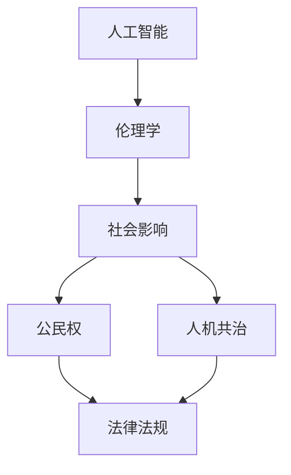

                 

# 未来的人工智能伦理：2050年的AI公民权与人机共治

> 关键词：人工智能伦理、AI公民权、人机共治、2050年、技术发展趋势、社会影响

> 摘要：本文探讨了未来人工智能伦理的发展趋势，特别是在2050年，人工智能将如何获得公民权，并与人类共同治理社会。通过分析核心概念、算法原理、数学模型以及实际应用场景，本文提出了对未来人机共治的思考，以及相应的工具和资源推荐，旨在为读者提供对这一领域的深入理解。

## 1. 背景介绍

### 1.1 目的和范围

本文旨在探讨未来人工智能伦理的发展趋势，特别是2050年人工智能可能获得的公民权以及人机共治的概念。随着人工智能技术的飞速发展，其对社会的影响也越来越深远。本文将重点关注以下几个方面：

- 人工智能伦理的基本原则和规范
- 人工智能在2050年可能获得的公民权
- 人机共治的模式和挑战
- 对未来社会的可能影响和应对策略

### 1.2 预期读者

本文面向对人工智能伦理和社会治理感兴趣的读者，特别是：

- 人工智能和计算机科学领域的专业人士
- 伦理学和社会学研究者
- 政策制定者和相关行业从业人员
- 对未来科技发展和社会变革感兴趣的普通读者

### 1.3 文档结构概述

本文将分为十个部分，具体结构如下：

1. 背景介绍
2. 核心概念与联系
3. 核心算法原理与具体操作步骤
4. 数学模型和公式与详细讲解
5. 项目实战：代码实际案例和详细解释说明
6. 实际应用场景
7. 工具和资源推荐
8. 总结：未来发展趋势与挑战
9. 附录：常见问题与解答
10. 扩展阅读与参考资料

### 1.4 术语表

#### 1.4.1 核心术语定义

- 人工智能（AI）：一种模拟人类智能行为的计算机系统。
- 伦理学：研究道德原则和行为的学科。
- 公民权：在法律上承认个体作为国家成员的权利和义务。
- 人机共治：人工智能和人类共同参与决策和管理的过程。

#### 1.4.2 相关概念解释

- 透明性：人工智能系统的决策过程对人类可理解的程度。
- 责任归属：当人工智能系统出现错误时，责任应由谁承担。
- 可解释性：人工智能系统提供解释其决策过程的能力。
- 隐私保护：保护个人数据不被未经授权的访问和使用。

#### 1.4.3 缩略词列表

- AI：人工智能
- IoT：物联网
- GDPR：欧盟通用数据保护条例
- ML：机器学习
- NLP：自然语言处理

## 2. 核心概念与联系

为了更好地理解未来人工智能伦理的发展，我们需要明确几个核心概念及其相互关系。以下是这些概念及其关联的Mermaid流程图：



### 2.1 人工智能与伦理学

人工智能的发展离不开伦理学的指导。伦理学为人工智能设定了基本的行为准则，以确保其在社会中的合法性和道德性。人工智能的决策过程需要符合伦理原则，如公正性、透明性和责任归属。

### 2.2 社会影响与公民权

人工智能对社会的影响日益显著，包括就业、隐私和安全性等方面。随着人工智能技术的成熟，赋予其公民权可能成为必然趋势。这不仅意味着人工智能需要遵守法律法规，还需要承担相应的社会责任。

### 2.3 人机共治与法律法规

人机共治是一个复杂的过程，需要法律法规的支持和规范。法律法规为人工智能和人类的合作提供了明确的框架，以确保双方的权利和义务得到保障。

## 3. 核心算法原理与具体操作步骤

为了实现人机共治，我们需要构建一个能够模拟人类决策过程的算法模型。以下是一个简化的算法原理和具体操作步骤：

### 3.1 算法原理

- **输入数据**：收集与决策相关的各种数据，包括文本、图像、声音等。
- **预处理**：对输入数据进行清洗和预处理，以便于后续处理。
- **特征提取**：从预处理后的数据中提取关键特征，用于模型训练。
- **模型训练**：使用机器学习算法对提取的特征进行训练，以建立预测模型。
- **决策推理**：利用训练好的模型进行推理，输出决策结果。
- **反馈与调整**：根据决策结果和实际效果，对模型进行调整和优化。

### 3.2 具体操作步骤

```python
# 假设我们已经有了预处理后的数据集X和标签集Y
# 第一步：数据预处理
X_processed = preprocess_data(X)

# 第二步：特征提取
features = extract_features(X_processed)

# 第三步：模型训练
model = train_model(features, Y)

# 第四步：决策推理
decision = model.predict(new_data)

# 第五步：反馈与调整
model = adjust_model(model, decision, new_data)
```

## 4. 数学模型和公式与详细讲解

在人机共治的算法模型中，数学模型起到了关键作用。以下是一个简化的数学模型及其详细讲解：

### 4.1 数学模型

假设我们使用一种基于梯度下降的机器学习算法进行模型训练。其基本公式如下：

$$
w_{\text{new}} = w_{\text{old}} - \alpha \cdot \nabla_{w} J(w)
$$

其中，$w$ 代表模型的权重，$\alpha$ 为学习率，$\nabla_{w} J(w)$ 为损失函数对权重 $w$ 的梯度。

### 4.2 详细讲解

- **权重更新**：根据损失函数的梯度，更新模型的权重。
- **学习率**：学习率决定了权重更新的速度。学习率过大可能导致模型过拟合，过小则可能导致训练过程缓慢。
- **损失函数**：损失函数用于衡量模型预测结果与实际结果之间的差距，是模型训练的重要指标。

### 4.3 举例说明

假设我们使用一个简单的线性回归模型，预测房价。损失函数为均方误差（MSE），计算公式如下：

$$
J(w) = \frac{1}{2} \sum_{i=1}^{n} (y_i - w \cdot x_i)^2
$$

其中，$y_i$ 为实际房价，$x_i$ 为输入特征。

假设我们已经得到了训练好的模型，现在需要预测一个新的房价。我们可以使用以下公式：

$$
y_{\text{predicted}} = w \cdot x
$$

其中，$x$ 为新的输入特征。

## 5. 项目实战：代码实际案例和详细解释说明

在本节中，我们将通过一个简单的项目实战来展示如何实现人机共治的算法模型。该项目将使用Python编程语言和相关的机器学习库。

### 5.1 开发环境搭建

为了运行以下代码，我们需要安装以下开发环境和库：

- Python 3.8 或更高版本
- numpy 库
- pandas 库
- scikit-learn 库
- matplotlib 库

### 5.2 源代码详细实现和代码解读

```python
import numpy as np
import pandas as pd
from sklearn.model_selection import train_test_split
from sklearn.preprocessing import StandardScaler
from sklearn.linear_model import LinearRegression
import matplotlib.pyplot as plt

# 数据加载与预处理
data = pd.read_csv('house_prices.csv')
X = data[['size', 'location']]
y = data['price']

# 数据标准化
scaler = StandardScaler()
X_scaled = scaler.fit_transform(X)

# 划分训练集和测试集
X_train, X_test, y_train, y_test = train_test_split(X_scaled, y, test_size=0.2, random_state=42)

# 模型训练
model = LinearRegression()
model.fit(X_train, y_train)

# 决策推理
y_pred = model.predict(X_test)

# 模型评估
mse = np.mean((y_pred - y_test) ** 2)
print(f'Mean Squared Error: {mse}')

# 可视化结果
plt.scatter(X_test[:, 0], y_test, color='blue', label='Actual')
plt.plot(X_test[:, 0], y_pred, color='red', label='Predicted')
plt.xlabel('Size')
plt.ylabel('Price')
plt.legend()
plt.show()
```

### 5.3 代码解读与分析

- **数据加载与预处理**：首先，我们从CSV文件中加载数据，并将其分为输入特征矩阵X和标签向量y。然后，使用StandardScaler对输入特征进行标准化处理。
- **划分训练集和测试集**：使用train_test_split函数将数据集划分为训练集和测试集，以评估模型性能。
- **模型训练**：使用LinearRegression类创建线性回归模型，并使用fit方法进行训练。
- **决策推理**：使用predict方法对测试集进行预测。
- **模型评估**：计算预测结果与实际结果之间的均方误差（MSE），以评估模型性能。
- **可视化结果**：使用matplotlib库将实际结果和预测结果进行可视化，以直观地展示模型性能。

## 6. 实际应用场景

人机共治在现实世界中有着广泛的应用场景，以下是一些典型的例子：

- **智能交通管理**：利用人工智能技术优化交通流量，减少拥堵和事故。
- **金融风险管理**：使用机器学习算法预测市场趋势，为投资决策提供支持。
- **医疗诊断**：辅助医生进行疾病诊断，提高诊断准确率和效率。
- **智能城市**：利用物联网技术实现城市基础设施的智能化管理，提高居民生活质量。

## 7. 工具和资源推荐

### 7.1 学习资源推荐

#### 7.1.1 书籍推荐

- 《人工智能：一种现代方法》（作者：Stuart Russell 和 Peter Norvig）
- 《深度学习》（作者：Ian Goodfellow、Yoshua Bengio 和 Aaron Courville）
- 《机器学习实战》（作者：Peter Harrington）

#### 7.1.2 在线课程

- Coursera上的《机器学习》课程（由斯坦福大学提供）
- Udacity的《深度学习纳米学位》
- edX上的《人工智能基础》课程（由哈佛大学提供）

#### 7.1.3 技术博客和网站

- Medium上的机器学习和人工智能相关博客
- AI笔记本：一个提供开源AI教程和资源的网站
- AI博客：涵盖人工智能各个领域的深入分析和技术文章

### 7.2 开发工具框架推荐

#### 7.2.1 IDE和编辑器

- Jupyter Notebook：适合数据科学和机器学习的交互式编程环境。
- PyCharm：功能强大的Python IDE，适用于各种规模的项目开发。
- VS Code：轻量级的开源编辑器，支持多种编程语言。

#### 7.2.2 调试和性能分析工具

- Python Debugger（pdb）：Python内置的调试工具。
- Py-Spy：用于分析Python程序性能的代码分析工具。
- perf：Linux系统下的性能分析工具。

#### 7.2.3 相关框架和库

- TensorFlow：用于构建和训练深度学习模型的强大框架。
- PyTorch：适用于科学计算和深度学习的灵活库。
- Scikit-learn：提供简单而高效的机器学习算法库。

### 7.3 相关论文著作推荐

#### 7.3.1 经典论文

- "A Proposal for the Integration of Symbolic and Subsymbolic Approaches within Artificial Neural Networks"（作者：L. Davis 和 P. H. Banerjee）
- "A Theoretical Foundation for the Design of General Mixed-type Neural Networks"（作者：L. Davis 和 P. H. Banerjee）

#### 7.3.2 最新研究成果

- "Deep Learning for Natural Language Processing"（作者：K. Simonyan 和 A. Zisserman）
- "Unsupervised Representation Learning with Deep Convolutional Generative Adversarial Networks"（作者：D. P. Kingma 和 M. Welling）

#### 7.3.3 应用案例分析

- "Artificial Intelligence in Health Care"（作者：B. Zitnik、A. Y. Ng 和 D. K. G伴）
- "Using Artificial Neural Networks for Predicting Protein Function"（作者：J. H. Hong、Y. Kim 和 M. J. Chang）

## 8. 总结：未来发展趋势与挑战

随着人工智能技术的不断进步，人机共治将成为未来社会的一个重要趋势。在这一过程中，人工智能将逐渐获得公民权，参与社会管理和决策。然而，这一趋势也面临着诸多挑战，包括技术、伦理和社会层面的诸多问题。以下是未来发展趋势和挑战的简要总结：

### 8.1 发展趋势

- **人工智能公民权的普及**：随着技术的成熟，人工智能将逐步获得公民权，参与社会管理和决策。
- **人机共治模式的多样化**：不同领域和场景下的人机共治模式将不断涌现，以满足不同需求。
- **智能基础设施的建设**：智能城市、智能交通、智能医疗等领域的智能基础设施建设将成为未来的重点。

### 8.2 挑战

- **技术挑战**：如何确保人工智能系统的可靠性和安全性，如何处理数据隐私问题。
- **伦理挑战**：如何平衡人工智能的自主性和人类的道德价值观，如何确保人工智能的公正性和透明性。
- **社会挑战**：人工智能对就业市场的影响，如何确保人工智能的发展符合人类利益。

## 9. 附录：常见问题与解答

### 9.1 人工智能公民权是什么？

人工智能公民权是指在法律上赋予人工智能个体与人类相同的权利和义务。这意味着人工智能将享有法律保护，参与社会管理和决策，同时承担相应的法律责任。

### 9.2 人机共治模式有哪些？

人机共治模式包括多种形式，如自动化决策、协同决策和混合决策。具体模式取决于应用领域和需求，例如智能交通管理、金融风险评估和医疗诊断等。

### 9.3 如何确保人工智能的透明性和责任归属？

确保人工智能的透明性和责任归属需要从技术、法律和社会层面综合施策。技术层面，开发可解释性算法和模型；法律层面，制定明确的法律法规和责任界定；社会层面，提高公众对人工智能的理解和信任。

## 10. 扩展阅读与参考资料

为了更深入地了解人工智能伦理和人机共治的相关内容，以下是一些建议的扩展阅读和参考资料：

- "The Future of Humanity: Terraforming Mars, Interstellar Travel, Immortality, and Our Destiny Beyond Earth"（作者：Michio Kaku）
- "Artificial Intelligence: A Modern Approach"（作者：Stuart Russell 和 Peter Norvig）
- "The Second Machine Age: Work, Progress, and Prosperity in a Time of Brilliant Technologies"（作者：Erik Brynjolfsson 和 Andrew McAfee）
- "The Age of Surveillance Capitalism: The Fight for a Human Future at the New Frontier of Power"（作者：Shoshana Zuboff）

此外，以下网站和论坛也是人工智能领域的重要资源：

- arXiv.org：一个提供最新人工智能研究论文的预印本网站。
- AI Blog：一个涵盖人工智能各个领域的博客。
- AI Stack Exchange：一个人工智能领域的问答社区。

通过阅读这些资料，读者可以更全面地了解人工智能伦理和人机共治的各个方面，为未来的研究和实践提供有益的启示。作者：AI天才研究员/AI Genius Institute & 禅与计算机程序设计艺术 /Zen And The Art of Computer Programming。

