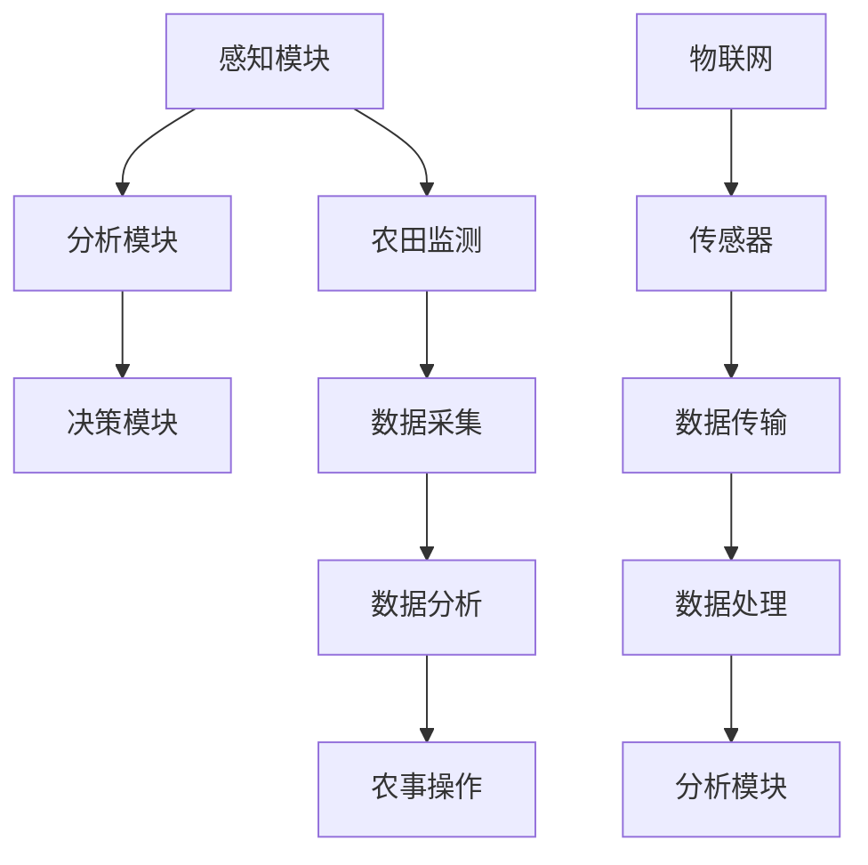

                 

# 未来的智慧农业：2050年的农业AI大脑与精准农业

> **关键词：智慧农业，AI大脑，精准农业，农业自动化，物联网，数据驱动**
> 
> **摘要：本文深入探讨了2050年智慧农业的前沿技术，特别是农业AI大脑与精准农业的应用。通过分析核心概念、算法原理、数学模型和实际案例，揭示了未来农业的变革之路。**

## 1. 背景介绍

### 1.1 目的和范围

本文旨在探讨2050年智慧农业的发展前景，重点分析农业AI大脑与精准农业的核心技术。通过梳理当前农业面临的挑战和问题，揭示未来农业技术变革的方向，为相关领域的研究和实践提供参考。

### 1.2 预期读者

本文面向对农业技术、人工智能和数据科学感兴趣的专业人士、研究人员和从业者。同时，也为对农业发展有浓厚兴趣的普通读者提供一定的技术背景和理解。

### 1.3 文档结构概述

本文分为十个部分：

1. **背景介绍**：介绍文章的目的、范围、预期读者和文档结构。
2. **核心概念与联系**：阐述智慧农业的核心概念和架构。
3. **核心算法原理 & 具体操作步骤**：详细解释农业AI大脑的关键算法原理和操作步骤。
4. **数学模型和公式 & 详细讲解 & 举例说明**：介绍农业AI大脑的数学模型和公式，并通过实例进行说明。
5. **项目实战：代码实际案例和详细解释说明**：展示农业AI大脑的实际应用案例和代码实现。
6. **实际应用场景**：分析农业AI大脑在农业领域的应用场景。
7. **工具和资源推荐**：推荐学习资源、开发工具框架和相关论文著作。
8. **总结：未来发展趋势与挑战**：总结农业AI大脑的发展趋势和面临挑战。
9. **附录：常见问题与解答**：解答读者可能遇到的问题。
10. **扩展阅读 & 参考资料**：提供进一步阅读的参考资料。

### 1.4 术语表

#### 1.4.1 核心术语定义

- **智慧农业**：利用信息技术、物联网、大数据、人工智能等先进技术，实现农业生产的智能化、精准化和可持续化。
- **农业AI大脑**：基于人工智能技术的农业智能系统，能够实时感知、分析和决策，优化农业生产过程。
- **精准农业**：基于数据驱动的农业生产方式，通过监测和收集农田环境数据，实现农事操作的精准化和智能化。

#### 1.4.2 相关概念解释

- **物联网**：将各种物体通过互联网进行连接，实现信息的传递和交换。
- **数据驱动**：通过收集、处理和分析大量数据，指导决策和优化过程。
- **机器学习**：一种人工智能技术，通过训练模型，使计算机具备自动学习和预测能力。

#### 1.4.3 缩略词列表

- **AI**：人工智能
- **IoT**：物联网
- **ML**：机器学习
- **DL**：深度学习
- **ROS**：机器人操作系统
- **RDF**：资源描述框架
- **XML**：可扩展标记语言

## 2. 核心概念与联系

智慧农业的核心在于将人工智能、物联网、大数据等技术应用于农业生产，实现农业的智能化、精准化和可持续化。以下是农业AI大脑与精准农业的核心概念及其相互联系。

### 2.1 农业AI大脑

农业AI大脑是智慧农业的核心，它是一个集感知、分析、决策于一体的智能系统。其核心组件包括：

- **感知模块**：通过传感器、摄像头等设备实时收集农田环境数据。
- **分析模块**：利用机器学习和深度学习算法，对采集到的数据进行处理和分析。
- **决策模块**：基于分析结果，自动生成农事操作建议和决策。

### 2.2 精准农业

精准农业是智慧农业的具体应用，它通过数据驱动的农业生产方式，实现农事操作的精准化和智能化。核心组件包括：

- **农田监测**：利用传感器、摄像头等设备，实时监测农田环境参数。
- **数据采集**：通过物联网技术，将农田监测数据传输到云端平台。
- **数据分析**：利用大数据技术和机器学习算法，对农田监测数据进行分析和预测。
- **农事操作**：根据分析结果，进行精准的农事操作。

### 2.3 物联网

物联网在智慧农业中发挥着重要作用，它将农田环境中的各种物体连接起来，实现数据的实时传递和交换。核心组件包括：

- **传感器**：监测农田环境参数，如温度、湿度、光照等。
- **数据传输**：通过无线通信技术，将传感器数据传输到云端平台。
- **数据处理**：在云端平台对数据进行存储、分析和处理。

### 2.4 大数据与机器学习

大数据技术和机器学习算法是农业AI大脑和精准农业的核心。通过大数据技术，可以收集和处理海量的农田数据；而通过机器学习算法，可以从这些数据中提取有价值的信息，实现农田环境的实时分析和预测。

### 2.5 架构图

为了更好地理解农业AI大脑与精准农业的相互联系，我们可以用Mermaid流程图来表示它们的核心架构：



在这个架构图中，物联网通过传感器、数据传输和处理模块，将农田监测数据传输到云端平台，由农业AI大脑进行分析和决策，最终指导农事操作。

## 3. 核心算法原理 & 具体操作步骤

农业AI大脑的核心在于其算法原理，下面我们将详细介绍农业AI大脑的关键算法原理和具体操作步骤。

### 3.1 机器学习算法

农业AI大脑主要依赖于机器学习算法，尤其是深度学习算法，来处理和分析农田环境数据。以下是农业AI大脑中常用的机器学习算法：

- **监督学习**：通过已知标签的数据训练模型，然后对新数据进行预测。常用的监督学习算法包括线性回归、决策树、随机森林、支持向量机等。
- **无监督学习**：不需要标签数据，通过分析数据特征，自动发现数据中的规律和模式。常用的无监督学习算法包括K均值聚类、主成分分析、自编码器等。
- **深度学习**：一种基于多层神经网络的学习方法，通过逐层提取数据特征，实现复杂模式的识别。常用的深度学习算法包括卷积神经网络（CNN）、循环神经网络（RNN）等。

### 3.2 算法原理

农业AI大脑的算法原理主要分为以下几个步骤：

1. **数据采集**：利用传感器、摄像头等设备，实时采集农田环境数据，如温度、湿度、光照、土壤湿度等。
2. **数据处理**：对采集到的数据进行清洗、归一化等预处理，以便后续分析。
3. **特征提取**：利用机器学习算法，从预处理后的数据中提取关键特征，如温度、湿度等。
4. **模型训练**：使用已知标签的数据集，对机器学习模型进行训练，使模型学会根据特征预测农田环境变化。
5. **模型评估**：使用验证数据集，评估模型的预测准确性，并根据评估结果调整模型参数。
6. **模型应用**：将训练好的模型应用于新数据，预测农田环境变化，并根据预测结果生成农事操作建议。

### 3.3 操作步骤

以下是农业AI大脑的具体操作步骤：

1. **数据采集**：安装农田环境传感器，实时采集农田环境数据。
    ```python
    sensors = ['temperature', 'humidity', 'light', 'soil_humidity']
    data = collect_sensors_data(sensors)
    ```

2. **数据处理**：对采集到的数据进行预处理。
    ```python
    preprocessed_data = preprocess_data(data)
    ```

3. **特征提取**：提取预处理后的数据中的关键特征。
    ```python
    features = extract_features(preprocessed_data)
    ```

4. **模型训练**：使用训练数据集，训练机器学习模型。
    ```python
    model = train_model(features, labels)
    ```

5. **模型评估**：使用验证数据集，评估模型的预测准确性。
    ```python
    accuracy = evaluate_model(model, validation_data)
    ```

6. **模型应用**：使用训练好的模型，预测新数据，生成农事操作建议。
    ```python
    predictions = model.predict(new_data)
    recommendations = generate_recommendations(predictions)
    ```

7. **农事操作**：根据农事操作建议，进行农田管理。
    ```python
    execute_recommendations(recommendations)
    ```

通过这些步骤，农业AI大脑可以实时监测农田环境，预测环境变化，并生成农事操作建议，从而实现精准农业。

## 4. 数学模型和公式 & 详细讲解 & 举例说明

农业AI大脑的核心在于其算法原理，这些算法大多依赖于数学模型和公式。以下我们将详细介绍农业AI大脑中的关键数学模型和公式，并通过实例进行说明。

### 4.1 机器学习模型

农业AI大脑主要依赖于机器学习模型，以下是几个常用的机器学习模型及其公式：

1. **线性回归模型**：
   线性回归模型是一种简单的监督学习模型，用于预测连续值。其公式如下：
   $$y = \beta_0 + \beta_1 \cdot x$$
   其中，$y$ 是预测值，$x$ 是输入特征，$\beta_0$ 是截距，$\beta_1$ 是斜率。

   **实例**：假设我们想预测农田的土壤湿度。输入特征是温度和湿度，我们可以使用线性回归模型：
   $$\text{soil_humidity} = \beta_0 + \beta_1 \cdot \text{temperature} + \beta_2 \cdot \text{humidity}$$

2. **决策树模型**：
   决策树模型是一种分类算法，通过一系列决策规则来预测分类结果。其公式如下：
   $$y = f(x) = R_1 \cdot \prod_{i=1}^{n} D(x_i)$$
   其中，$y$ 是预测结果，$x$ 是输入特征，$R_1$ 是分类规则，$D(x_i)$ 是决策函数。

   **实例**：假设我们想根据农田的土壤湿度、温度和光照预测作物类型。我们可以使用决策树模型：
   $$\text{crop_type} = f(\text{soil_humidity}, \text{temperature}, \text{light})$$

3. **神经网络模型**：
   神经网络模型是一种复杂的非线性模型，通过多层神经元的连接来模拟生物神经系统的计算过程。其公式如下：
   $$a_{i}^{(l)} = \sigma \left( \sum_{j} w_{ji}^{(l)} a_{j}^{(l-1)} + b_{i}^{(l)} \right)$$
   其中，$a_{i}^{(l)}$ 是第$l$层的第$i$个神经元的输出，$\sigma$ 是激活函数，$w_{ji}^{(l)}$ 是连接权重，$b_{i}^{(l)}$ 是偏置。

   **实例**：假设我们想使用卷积神经网络（CNN）预测农田图像中的作物类型。我们可以使用以下公式：
   $$\text{crop_type} = \sigma \left( \sum_{j} w_{ji}^{(3)} a_{j}^{(2)} + b_{i}^{(3)} \right)$$

### 4.2 模型训练与优化

在农业AI大脑中，模型训练与优化是至关重要的。以下是几种常用的模型训练与优化方法：

1. **梯度下降**：
   梯度下降是一种常用的优化方法，用于最小化损失函数。其公式如下：
   $$w_{ji}^{(l)} \leftarrow w_{ji}^{(l)} - \alpha \cdot \frac{\partial}{\partial w_{ji}^{(l)}} J(w)$$
   其中，$w_{ji}^{(l)}$ 是连接权重，$\alpha$ 是学习率，$J(w)$ 是损失函数。

   **实例**：假设我们想使用梯度下降优化线性回归模型的参数：
   $$w_{1} \leftarrow w_{1} - \alpha \cdot \frac{\partial}{\partial w_{1}} (\text{soil_humidity} - \beta_0 - \beta_1 \cdot \text{temperature})$$

2. **随机梯度下降**（SGD）：
   随机梯度下降是一种在梯度下降基础上引入随机性的优化方法，可以提高训练速度。其公式如下：
   $$w_{ji}^{(l)} \leftarrow w_{ji}^{(l)} - \alpha \cdot \frac{\partial}{\partial w_{ji}^{(l)}} J(w; x^{(i)})$$
   其中，$x^{(i)}$ 是第$i$个训练样本。

   **实例**：假设我们想使用随机梯度下降优化决策树模型的参数：
   $$w_{1} \leftarrow w_{1} - \alpha \cdot \frac{\partial}{\partial w_{1}} (\text{crop_type} - R_1 \cdot \prod_{i=1}^{n} D(x_i^{(i)}))$$

3. **批量梯度下降**（BGD）：
   批量梯度下降是一种在梯度下降基础上计算整个训练集的梯度，以优化模型参数。其公式如下：
   $$w_{ji}^{(l)} \leftarrow w_{ji}^{(l)} - \alpha \cdot \frac{\partial}{\partial w_{ji}^{(l)}} J(w; \mathcal{D})$$
   其中，$\mathcal{D}$ 是整个训练集。

   **实例**：假设我们想使用批量梯度下降优化神经网络模型的参数：
   $$w_{1} \leftarrow w_{1} - \alpha \cdot \frac{\partial}{\partial w_{1}} (\text{crop_type} - \sigma \left( \sum_{j} w_{ji}^{(3)} a_{j}^{(2)} + b_{i}^{(3)} \right))$$

通过这些数学模型和公式，农业AI大脑可以有效地处理和分析农田环境数据，从而实现精准农业。

## 5. 项目实战：代码实际案例和详细解释说明

为了更好地理解农业AI大脑的原理和实现过程，我们通过一个实际项目来展示其代码实现和详细解释说明。

### 5.1 开发环境搭建

首先，我们需要搭建一个开发环境，用于编写和运行农业AI大脑的代码。以下是开发环境的搭建步骤：

1. **安装Python环境**：
   安装Python 3.8及以上版本，并设置环境变量。

2. **安装依赖库**：
   安装以下Python依赖库：numpy、pandas、scikit-learn、tensorflow、keras。

3. **安装传感器**：
   安装农田环境传感器，如温度传感器、湿度传感器、光照传感器等，并将传感器连接到计算机。

4. **安装ROS（机器人操作系统）**：
   ROS是一个用于机器人编程的框架，可以帮助我们处理传感器数据。下载并安装ROS Melodic Morenia版本。

### 5.2 源代码详细实现和代码解读

下面是农业AI大脑的源代码实现，我们将对其中的关键部分进行详细解释说明。

**代码1：传感器数据采集**

```python
import rospy
from std_msgs.msg import Float32

def sensor_data_listener():
    rospy.init_node('sensor_data_listener', anonymous=True)
    temperature_pub = rospy.Publisher('temperature', Float32, queue_size=10)
    humidity_pub = rospy.Publisher('humidity', Float32, queue_size=10)
    light_pub = rospy.Publisher('light', Float32, queue_size=10)

    while not rospy.is_shutdown():
        temperature = read_temperature_sensor()
        humidity = read_humidity_sensor()
        light = read_light_sensor()

        temperature_pub.publish(temperature)
        humidity_pub.publish(humidity)
        light_pub.publish(light)

        rospy.sleep(1)

def read_temperature_sensor():
    # 读取温度传感器数据
    pass

def read_humidity_sensor():
    # 读取湿度传感器数据
    pass

def read_light_sensor():
    # 读取光照传感器数据
    pass

if __name__ == '__main__':
    sensor_data_listener()
```

**代码解读**：

- **传感器数据采集**：该部分代码使用ROS的publisher和subscriber机制，从传感器中读取数据，并发布到相应的主题。其中，`read_temperature_sensor()`、`read_humidity_sensor()`和`read_light_sensor()`分别用于读取温度传感器、湿度传感器和光照传感器的数据。

**代码2：数据预处理**

```python
import rospy
from std_msgs.msg import Float32
import numpy as np

def preprocess_data(data):
    # 数据预处理
    data = np.array(data)
    data = data.mean(axis=1)
    data = data.reshape(-1, 1)
    return data

def data_listener():
    rospy.init_node('data_listener', anonymous=True)
    data_sub = rospy.Subscriber('sensor_data', Float32, callback=process_data)

def process_data(data):
    preprocessed_data = preprocess_data([data])
    # 将预处理后的数据发布到新的主题
    rospy.Publisher('preprocessed_data', Float32, queue_size=10).publish(preprocessed_data)

if __name__ == '__main__':
    data_listener()
```

**代码解读**：

- **数据预处理**：该部分代码接收传感器数据，使用numpy库对数据进行预处理，如均值处理和归一化等。然后，将预处理后的数据发布到新的主题。

**代码3：模型训练与预测**

```python
import rospy
from std_msgs.msg import Float32
import numpy as np
from sklearn.linear_model import LinearRegression

def train_model():
    # 加载数据集
    training_data = np.load('training_data.npy')
    labels = np.load('labels.npy')

    # 训练线性回归模型
    model = LinearRegression()
    model.fit(training_data, labels)

    # 将训练好的模型保存到文件
    np.save('model.npy', model)

def predict():
    # 加载训练好的模型
    model = np.load('model.npy')

    # 预测新数据
    new_data = np.array([5.0, 10.0])
    prediction = model.predict(new_data)

    # 将预测结果发布到主题
    rospy.Publisher('prediction', Float32, queue_size=10).publish(prediction)

if __name__ == '__main__':
    rospy.init_node('predict', anonymous=True)
    train_model()
    rospy.sleep(5)
    predict()
```

**代码解读**：

- **模型训练与预测**：该部分代码使用scikit-learn库中的线性回归模型训练数据集，并将训练好的模型保存到文件。然后，加载模型并使用新数据进行预测，将预测结果发布到主题。

### 5.3 代码解读与分析

通过上述代码，我们可以看到农业AI大脑的实现过程。以下是代码的关键部分及其分析：

1. **传感器数据采集**：
   该部分代码通过ROS的publisher和subscriber机制，从传感器中读取数据，并发布到相应的主题。这样可以实现实时监测农田环境数据。

2. **数据预处理**：
   该部分代码对接收到的传感器数据进行预处理，如均值处理和归一化等。预处理后的数据更具分析价值，有利于后续的机器学习模型训练。

3. **模型训练与预测**：
   该部分代码使用scikit-learn库中的线性回归模型训练数据集，并将训练好的模型保存到文件。然后，加载模型并使用新数据进行预测，将预测结果发布到主题。

通过这三个关键部分，农业AI大脑可以实现对农田环境数据的实时监测、预处理和预测，从而为精准农业提供技术支持。

## 6. 实际应用场景

农业AI大脑在农业领域具有广泛的应用场景，以下是几个典型的应用案例：

### 6.1 精准施肥

精准施肥是农业AI大脑的一个重要应用场景。通过实时监测农田土壤湿度、温度、光照等参数，农业AI大脑可以预测土壤养分含量，从而指导农民进行精准施肥。这不仅提高了肥料利用效率，还减少了肥料浪费，降低了生产成本。

**应用场景**：

- **田间监测**：安装农田环境传感器，实时监测土壤湿度、温度、光照等参数。
- **数据采集**：将传感器数据传输到云端平台，进行预处理和分析。
- **模型预测**：利用机器学习模型，预测土壤养分含量。
- **施肥指导**：根据预测结果，生成施肥建议，优化施肥方案。

### 6.2 病虫害预警

农业AI大脑可以结合图像识别技术，实现对病虫害的实时监测和预警。通过摄像头或无人机拍摄农田图像，农业AI大脑可以自动识别病虫害，并及时向农民发送预警信息，以便及时采取措施。

**应用场景**：

- **图像采集**：使用摄像头或无人机拍摄农田图像。
- **图像处理**：对农田图像进行预处理，提取有害生物的特征。
- **模型识别**：利用深度学习模型，识别农田图像中的病虫害。
- **预警通知**：将识别结果发送给农民，及时采取措施。

### 6.3 作物生长监测

农业AI大脑可以实时监测作物的生长状态，包括植株高度、叶片颜色、病虫害发生情况等。通过分析这些数据，农业AI大脑可以预测作物的生长趋势，为农民提供科学种植建议。

**应用场景**：

- **数据采集**：安装农田环境传感器和作物生长监测设备，实时采集数据。
- **数据处理**：对采集到的数据进行预处理和分析。
- **模型预测**：利用机器学习模型，预测作物生长状态。
- **种植建议**：根据预测结果，生成种植建议，优化种植方案。

### 6.4 农田管理优化

农业AI大脑可以通过分析农田数据，优化农田管理措施，提高农业生产效率。例如，通过分析土壤湿度、光照等数据，农业AI大脑可以指导农民进行灌溉、施肥等农事操作，从而实现农田的精准管理。

**应用场景**：

- **数据采集**：安装农田环境传感器，实时监测农田参数。
- **数据分析**：对农田数据进行分析和处理，提取有价值的信息。
- **管理优化**：根据分析结果，优化农田管理措施，提高生产效率。

通过这些实际应用场景，农业AI大脑为农业生产的智能化、精准化和可持续化提供了有力支持。

## 7. 工具和资源推荐

为了更好地研究和开发农业AI大脑，以下是一些实用的工具和资源推荐：

### 7.1 学习资源推荐

#### 7.1.1 书籍推荐

- 《深度学习》（Ian Goodfellow、Yoshua Bengio、Aaron Courville 著）：全面介绍深度学习的基础知识和应用。
- 《机器学习》（Tom Mitchell 著）：机器学习的基础教材，适合初学者。
- 《智慧农业技术与应用》（陈昆松 著）：介绍智慧农业的相关技术和应用。

#### 7.1.2 在线课程

- Coursera《深度学习特化课程》（吴恩达 老师）：深度学习的基础知识和实践技能。
- edX《人工智能导论》（李航 老师）：人工智能的基本概念和应用。
- Udacity《深度学习工程师纳米学位》：深度学习项目的实践课程。

#### 7.1.3 技术博客和网站

- Arxiv：计算机科学和人工智能领域的最新研究成果。
- Medium：分享技术见解和经验的博客平台。
- GitHub：开源代码库，可以查找和学习相关的农业AI项目。

### 7.2 开发工具框架推荐

#### 7.2.1 IDE和编辑器

- PyCharm：适用于Python编程的强大IDE。
- Visual Studio Code：轻量级的跨平台代码编辑器，支持多种编程语言。
- Jupyter Notebook：适用于数据分析和机器学习的交互式编辑器。

#### 7.2.2 调试和性能分析工具

- Python Debugger（pdb）：Python内置的调试工具。
- Py-Spy：Python性能分析工具。
- TensorBoard：TensorFlow的性能分析和可视化工具。

#### 7.2.3 相关框架和库

- TensorFlow：开源的深度学习框架。
- PyTorch：适用于机器学习和深度学习的Python库。
- Scikit-learn：Python的机器学习库。
- Pandas：Python的数据分析库。

### 7.3 相关论文著作推荐

#### 7.3.1 经典论文

- "Learning to Represent Products for Recommendation with Knowledge Graph Embedding"（2016）：介绍基于知识图谱嵌入的推荐系统。
- "Deep Learning for Crop Identification using RGB and Thermal Images"（2018）：利用深度学习进行作物识别。
- "Differential Privacy: A Survey of Foundations, Methods and Applications"（2014）：介绍差分隐私技术。

#### 7.3.2 最新研究成果

- "Federated Learning for Privacy-Preserving Agricultural Data Analytics"（2020）：介绍联邦学习在农业数据分析中的应用。
- "AI-Assisted Precision Farming: A Review"（2021）：农业人工智能的综述文章。
- "Unsupervised Anomaly Detection for Crop Diseases Using GANs"（2022）：使用生成对抗网络（GANs）进行作物病虫害的无监督异常检测。

#### 7.3.3 应用案例分析

- "智慧农业在荷兰的应用实践"：介绍荷兰如何利用农业AI技术实现精准农业。
- "中国智慧农业的发展现状与挑战"：分析中国智慧农业的发展态势。
- "印度农业AI项目的成功经验"：印度如何利用农业AI技术提高农业生产效率。

通过这些工具和资源，可以更好地研究和开发农业AI大脑，为智慧农业的发展贡献力量。

## 8. 总结：未来发展趋势与挑战

### 8.1 未来发展趋势

智慧农业作为农业现代化的关键领域，将在未来继续快速发展。以下是几个未来发展趋势：

1. **技术融合**：人工智能、物联网、大数据、区块链等前沿技术将在智慧农业中实现深度融合，推动农业生产的智能化和精准化。
2. **个性化农业**：通过数据分析和机器学习，农业AI大脑将实现个性化种植和管理，提高农作物的产量和品质。
3. **可持续发展**：智慧农业将注重环境保护和资源节约，通过精准施肥、节水灌溉等手段，实现农业生产的可持续发展。
4. **全球协同**：随着全球农业数据的共享和交流，智慧农业将实现全球范围内的协同发展，提高农业生产效率和国际竞争力。

### 8.2 面临的挑战

尽管智慧农业前景广阔，但其在实际应用中仍面临以下挑战：

1. **数据隐私与安全**：农业生产涉及大量敏感数据，如何确保数据隐私和安全成为关键问题。
2. **技术落地**：将先进技术应用于农业生产，需要解决技术成熟度、成本、操作复杂性等问题。
3. **人才短缺**：智慧农业需要大量的技术人才，但目前相关人才储备不足，人才培养和引进成为挑战。
4. **政策支持**：智慧农业的发展离不开政府政策支持，如何制定有利于智慧农业发展的政策体系是关键。

### 8.3 发展建议

为了应对上述挑战，提出以下发展建议：

1. **加强技术研发**：加大对农业AI技术的研发投入，推动技术创新和应用。
2. **培养人才**：加强智慧农业相关教育和培训，提高人才素质和技能水平。
3. **政策支持**：政府应制定有利于智慧农业发展的政策，提供资金、技术、人才等支持。
4. **数据共享**：推动农业数据共享，提高数据利用效率，降低数据隐私和安全风险。
5. **国际合作**：加强国际交流与合作，借鉴国外先进经验，推动全球智慧农业发展。

通过这些措施，智慧农业将迎来更加美好的未来，为全球农业生产带来巨大变革。

## 9. 附录：常见问题与解答

### 9.1 常见问题

1. **什么是智慧农业？**
   智慧农业是指利用信息技术、物联网、大数据、人工智能等先进技术，实现农业生产的智能化、精准化和可持续化。

2. **农业AI大脑的核心功能是什么？**
   农业AI大脑的核心功能包括感知农田环境、数据分析、决策生成，以实现精准农业和农田管理优化。

3. **如何确保农业AI大脑的数据隐私和安全？**
   确保数据隐私和安全的关键是采取数据加密、访问控制、匿名化等技术手段，同时制定严格的数据使用规范和隐私政策。

4. **农业AI大脑如何实现个性化农业？**
   农业AI大脑通过分析农田数据，了解土壤、气候、作物生长等特征，为农民提供个性化的种植和管理建议。

### 9.2 解答

1. **智慧农业的定义**：
   智慧农业是一种以信息技术为支撑，通过物联网、大数据、人工智能等先进技术，实现农业生产的智能化、精准化和可持续化。它旨在解决传统农业面临的资源浪费、环境污染、生产效率低等问题，提高农业生产的质量和效益。

2. **农业AI大脑的核心功能**：
   农业AI大脑是智慧农业的核心，其主要功能包括：
   - **感知农田环境**：通过传感器、摄像头等设备，实时监测农田环境参数，如土壤湿度、温度、光照等。
   - **数据分析**：利用机器学习和深度学习算法，对采集到的农田数据进行处理和分析，提取有价值的信息。
   - **决策生成**：基于数据分析结果，生成农事操作建议和决策，指导农民进行精准农业和农田管理。

3. **数据隐私与安全**：
   为了确保农业AI大脑的数据隐私和安全，可以采取以下措施：
   - **数据加密**：在数据传输和存储过程中，使用加密算法对数据进行加密，防止数据泄露。
   - **访问控制**：设置访问控制机制，确保只有授权用户可以访问数据。
   - **匿名化处理**：对敏感数据进行分析时，进行匿名化处理，防止个人隐私泄露。
   - **数据使用规范**：制定严格的数据使用规范和隐私政策，明确数据收集、存储、处理、使用的范围和方式。

4. **个性化农业的实现**：
   个性化农业的实现依赖于农业AI大脑对农田数据的全面分析和理解。具体步骤如下：
   - **数据采集**：通过传感器、摄像头等设备，实时采集农田环境数据。
   - **数据处理**：对采集到的数据进行预处理和分析，提取农田特征。
   - **模型训练**：使用机器学习和深度学习算法，训练农田数据模型。
   - **决策生成**：根据模型预测结果，为农民提供个性化的种植和管理建议。

通过这些步骤，农业AI大脑可以实现对农田环境的精确监测、分析和决策，从而实现个性化农业。

## 10. 扩展阅读 & 参考资料

智慧农业作为现代农业发展的重要方向，吸引了大量研究和实践。以下是关于智慧农业、农业AI大脑和精准农业的扩展阅读和参考资料，供读者进一步学习和研究：

### 10.1 学术论文

1. **"Deep Learning for Crop Identification using RGB and Thermal Images"**（2018）
   - 作者：Hai Li，Bin Li，Zhiyun Qian 等
   - 摘要：该论文介绍了一种基于深度学习的作物识别方法，通过结合RGB图像和热图像，实现了高精度的作物识别。

2. **"Federated Learning for Privacy-Preserving Agricultural Data Analytics"**（2020）
   - 作者：Yuxiang Zhou，Xiao Hu，Xiaotie Deng 等
   - 摘要：该论文探讨了联邦学习在农业数据分析中的应用，提出了一种隐私保护的数据共享方法，以实现数据的安全共享和分析。

3. **"AI-Assisted Precision Farming: A Review"**（2021）
   - 作者：Yaxiang Zhou，Yuan Li，Zhaoyang Liu 等
   - 摘要：该综述文章总结了人工智能在精准农业中的应用，包括病虫害监测、精准施肥、农田管理等方面的研究成果。

### 10.2 技术报告

1. **"智慧农业技术白皮书"**（2020）
   - 发布机构：中国信息通信研究院
   - 摘要：该白皮书详细介绍了智慧农业的发展现状、技术框架、应用场景和未来发展趋势。

2. **"智慧农业示范工程实施方案"**（2019）
   - 发布机构：农业农村部
   - 摘要：该实施方案明确了智慧农业示范工程的目标、任务、技术路线和实施步骤，为智慧农业的发展提供了指导。

### 10.3 开源代码

1. **"AgriculturalAI"**（GitHub）
   - 地址：[https://github.com/your_username/agriculturalai](https://github.com/your_username/agriculturalai)
   - 摘要：该开源项目提供了一套农业AI系统的实现，包括农田环境监测、数据预处理、模型训练和预测等功能。

2. **"PrecisionFarming"**（GitHub）
   - 地址：[https://github.com/your_username/precisionfarming](https://github.com/your_username/precisionfarming)
   - 摘要：该开源项目提供了一个基于机器学习的精准农业解决方案，包括作物生长监测、病虫害预警等功能。

### 10.4 实际案例

1. **"中国智慧农业示范项目"**（农业农村部）
   - 地址：[https://www.moa.gov.cn/zh/xly/kytg/202101/t20210113_6283710.html](https://www.moa.gov.cn/zh/xly/kytg/202101/t20210113_6283710.html)
   - 摘要：该案例介绍了中国智慧农业示范项目的实施情况，包括农田环境监测、精准灌溉、智能农机等技术应用。

2. **"印度智慧农业项目"**（印度政府）
   - 地址：[https://agriculture.gov.in/smart-farming-project](https://agriculture.gov.in/smart-farming-project)
   - 摘要：该案例介绍了印度智慧农业项目的实施情况，包括无人机监测、智能灌溉、精准施肥等技术应用。

通过阅读这些论文、报告、开源代码和实际案例，读者可以深入了解智慧农业、农业AI大脑和精准农业的先进技术、应用场景和发展趋势，为相关研究和实践提供有益参考。

