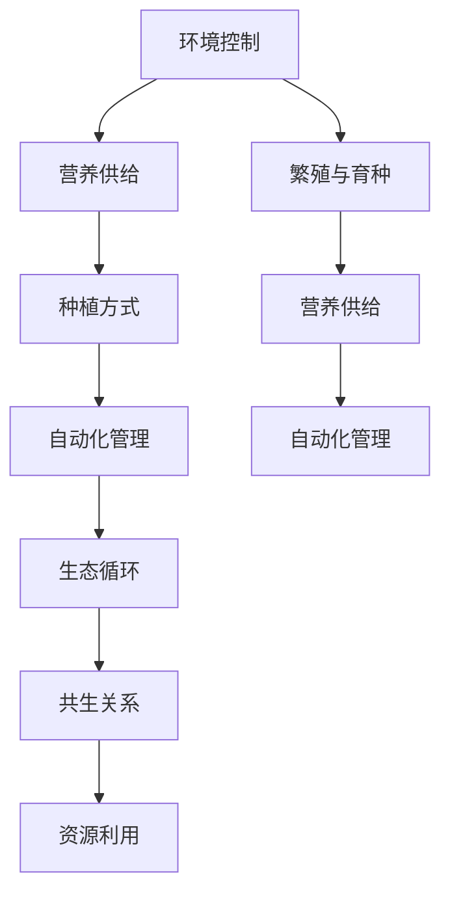

                 

# 未来的智慧农业：2050年的植物工厂与昆虫养殖

> **关键词：智慧农业、植物工厂、昆虫养殖、2050年、可持续发展、精准农业、自动化技术**

> **摘要：本文将探讨2050年的智慧农业前景，尤其是植物工厂和昆虫养殖技术的创新与发展。我们将分析这些技术的核心原理、实施步骤及其对未来农业的深远影响，旨在为读者提供一个清晰、前瞻性的未来农业蓝图。**

## 1. 背景介绍

### 1.1 目的和范围

本文旨在探讨未来智慧农业的发展方向，特别是植物工厂与昆虫养殖技术的进步。通过分析这些技术的核心概念、工作原理和实际应用，本文旨在帮助读者了解这些新兴技术在农业领域的潜在影响，并思考其在实现可持续发展中的作用。

### 1.2 预期读者

本文面向对农业科技感兴趣的读者，包括农业科学家、工程师、农业技术从业者以及关注可持续发展的公众。文章将使用专业且易于理解的语言，力求使各类读者都能获得有价值的信息。

### 1.3 文档结构概述

本文将分为十个主要部分：

1. 背景介绍
2. 核心概念与联系
3. 核心算法原理 & 具体操作步骤
4. 数学模型和公式 & 详细讲解 & 举例说明
5. 项目实战：代码实际案例和详细解释说明
6. 实际应用场景
7. 工具和资源推荐
8. 总结：未来发展趋势与挑战
9. 附录：常见问题与解答
10. 扩展阅读 & 参考资料

### 1.4 术语表

#### 1.4.1 核心术语定义

- **智慧农业**：利用现代信息技术和智能设备，实现对农业生产全过程的精准管理和优化。
- **植物工厂**：一种完全由人工控制的种植环境，通过自动化技术来模拟和优化植物生长条件。
- **昆虫养殖**：利用科学方法在控制环境中养殖昆虫，以获得有益的生态和经济效益。

#### 1.4.2 相关概念解释

- **可持续发展**：满足当前需求而不损害后代满足其需求的能力。
- **精准农业**：通过收集和分析农田数据，实现种植管理的精细化。

#### 1.4.3 缩略词列表

- **IoT**：物联网（Internet of Things）
- **AI**：人工智能（Artificial Intelligence）
- **LED**：发光二极管（Light Emitting Diode）

## 2. 核心概念与联系

为了深入理解植物工厂和昆虫养殖技术，我们需要首先明确这些技术的核心概念及其相互联系。

### 植物工厂的核心概念

植物工厂通常包含以下核心概念：

- **环境控制**：通过温度、湿度、光照等环境参数的精确控制，模拟最佳植物生长条件。
- **营养供给**：利用营养液或气态二氧化碳，确保植物获得充足的营养。
- **种植方式**：采用无土栽培、水培或雾培等技术，减少病虫害，提高产量。
- **自动化管理**：利用传感器和自动化设备，实现对植物生长环境的实时监测和调节。

### 昆虫养殖的核心概念

昆虫养殖的核心概念包括：

- **环境控制**：与植物工厂类似，通过精确控制温度、湿度和光照等参数，为昆虫提供适宜的生长环境。
- **营养供给**：提供适合昆虫的饲料，确保其健康成长。
- **繁殖与育种**：通过科学方法进行昆虫的繁殖和育种，以获得具有优良性状的昆虫种群。
- **自动化管理**：利用自动化设备，实现对昆虫生长环境的实时监测和调节。

### 植物工厂与昆虫养殖的联系

植物工厂和昆虫养殖之间存在紧密的联系：

- **生态循环**：植物和昆虫可以在同一环境中进行生态循环，植物可以吸收昆虫排泄物中的营养物质，而昆虫可以食用植物的残留物。
- **共生关系**：某些昆虫（如蜜蜂）可以帮助植物进行授粉，从而提高植物的产量和品质。
- **资源利用**：昆虫养殖可以为植物工厂提供有机肥料，而植物工厂的废弃材料可以为昆虫提供食物来源。

为了更好地展示这些概念之间的联系，我们可以使用Mermaid流程图来描述：



## 3. 核心算法原理 & 具体操作步骤

### 3.1 植物工厂的算法原理

植物工厂的核心算法主要涉及环境参数的精确控制和营养供给的优化。

#### 3.1.1 环境控制算法

环境控制算法的关键在于实时监测并调节温度、湿度、光照等参数。以下是一个简单的伪代码示例：

```python
# 环境控制算法伪代码

function controlEnvironment(temperature, humidity, lightIntensity):
    if temperature < optimalTemperature:
        increaseTemperature()
    elif temperature > optimalTemperature:
        decreaseTemperature()

    if humidity < optimalHumidity:
        increaseHumidity()
    elif humidity > optimalHumidity:
        decreaseHumidity()

    if lightIntensity < optimalLightIntensity:
        increaseLightIntensity()
    elif lightIntensity > optimalLightIntensity:
        decreaseLightIntensity()

# 实时监测环境参数
while True:
    temperature = getTemperature()
    humidity = getHumidity()
    lightIntensity = getLightIntensity()
    controlEnvironment(temperature, humidity, lightIntensity)
```

#### 3.1.2 营养供给算法

营养供给算法的目标是确保植物获得充足的营养，同时避免过量施肥导致的环境污染。以下是一个简单的伪代码示例：

```python
# 营养供给算法伪代码

function supplyNutrients(nutrientLevel):
    if nutrientLevel < optimalNutrientLevel:
        addNutrients()
    elif nutrientLevel > optimalNutrientLevel:
        removeNutrients()

# 实时监测营养水平
while True:
    nutrientLevel = getNutrientLevel()
    supplyNutrients(nutrientLevel)
```

### 3.2 昆虫养殖的算法原理

昆虫养殖的算法原理主要涉及环境控制、营养供给和繁殖管理的优化。

#### 3.2.1 环境控制算法

昆虫养殖的环境控制算法与植物工厂类似，但需要根据昆虫的生理特点进行调整。以下是一个简单的伪代码示例：

```python
# 环境控制算法伪代码

function controlInsectEnvironment(temperature, humidity, lightIntensity):
    if temperature < optimalInsectTemperature:
        increaseTemperature()
    elif temperature > optimalInsectTemperature:
        decreaseTemperature()

    if humidity < optimalInsectHumidity:
        increaseHumidity()
    elif humidity > optimalInsectHumidity:
        decreaseHumidity()

    if lightIntensity < optimalInsectLightIntensity:
        increaseLightIntensity()
    elif lightIntensity > optimalInsectLightIntensity:
        decreaseLightIntensity()

# 实时监测环境参数
while True:
    temperature = getTemperature()
    humidity = getHumidity()
    lightIntensity = getLightIntensity()
    controlInsectEnvironment(temperature, humidity, lightIntensity)
```

#### 3.2.2 营养供给算法

昆虫养殖的营养供给算法需要确保昆虫获得充足的营养，同时避免食物过剩或不足。以下是一个简单的伪代码示例：

```python
# 营养供给算法伪代码

function supplyInsectNutrients(nutrientLevel):
    if nutrientLevel < optimalNutrientLevel:
        addNutrients()
    elif nutrientLevel > optimalNutrientLevel:
        removeNutrients()

# 实时监测营养水平
while True:
    nutrientLevel = getNutrientLevel()
    supplyInsectNutrients(nutrientLevel)
```

#### 3.2.3 繁殖管理算法

昆虫繁殖管理算法的目标是优化昆虫的繁殖过程，确保种群数量的稳定增长。以下是一个简单的伪代码示例：

```python
# 繁殖管理算法伪代码

function manageInsectReproduction(femalePopulation, malePopulation):
    if femalePopulation < optimalFemalePopulation:
        encourageFemales()
    elif femalePopulation > optimalFemalePopulation:
        discourageFemales()

    if malePopulation < optimalMalePopulation:
        encourageMales()
    elif malePopulation > optimalMalePopulation:
        discourageMales()

# 实时监测繁殖参数
while True:
    femalePopulation = getFemalePopulation()
    malePopulation = getMalePopulation()
    manageInsectReproduction(femalePopulation, malePopulation)
```

## 4. 数学模型和公式 & 详细讲解 & 举例说明

### 4.1 环境控制数学模型

#### 4.1.1 温度控制模型

温度控制模型可以使用以下公式来描述：

\[ T_{\text{实际}} = T_{\text{设定}} + K_p \cdot (T_{\text{设定}} - T_{\text{实际}}) + K_i \cdot \int (T_{\text{设定}} - T_{\text{实际}}) \, dt + K_d \cdot (T_{\text{设定}} - T_{\text{实际}})' \]

其中，\( T_{\text{实际}} \) 是当前温度，\( T_{\text{设定}} \) 是目标温度，\( K_p \)、\( K_i \) 和 \( K_d \) 分别是比例、积分和微分系数。

#### 4.1.2 湿度控制模型

湿度控制模型可以使用以下公式来描述：

\[ H_{\text{实际}} = H_{\text{设定}} + K_p \cdot (H_{\text{设定}} - H_{\text{实际}}) + K_i \cdot \int (H_{\text{设定}} - H_{\text{实际}}) \, dt + K_d \cdot (H_{\text{设定}} - H_{\text{实际}})' \]

其中，\( H_{\text{实际}} \) 是当前湿度，\( H_{\text{设定}} \) 是目标湿度，\( K_p \)、\( K_i \) 和 \( K_d \) 分别是比例、积分和微分系数。

#### 4.1.3 光照控制模型

光照控制模型可以使用以下公式来描述：

\[ L_{\text{实际}} = L_{\text{设定}} + K_p \cdot (L_{\text{设定}} - L_{\text{实际}}) + K_i \cdot \int (L_{\text{设定}} - L_{\text{实际}}) \, dt + K_d \cdot (L_{\text{设定}} - L_{\text{实际}})' \]

其中，\( L_{\text{实际}} \) 是当前光照强度，\( L_{\text{设定}} \) 是目标光照强度，\( K_p \)、\( K_i \) 和 \( K_d \) 分别是比例、积分和微分系数。

### 4.2 营养供给数学模型

#### 4.2.1 营养水平监测模型

营养水平监测模型可以使用以下公式来描述：

\[ N_{\text{实际}} = N_{\text{初始}} + \Delta N \]

其中，\( N_{\text{实际}} \) 是当前营养水平，\( N_{\text{初始}} \) 是初始营养水平，\( \Delta N \) 是营养水平的改变量。

#### 4.2.2 营养供给控制模型

营养供给控制模型可以使用以下公式来描述：

\[ \Delta N = K_p \cdot (N_{\text{设定}} - N_{\text{实际}}) + K_i \cdot \int (N_{\text{设定}} - N_{\text{实际}}) \, dt + K_d \cdot (N_{\text{设定}} - N_{\text{实际}})' \]

其中，\( N_{\text{设定}} \) 是目标营养水平，\( K_p \)、\( K_i \) 和 \( K_d \) 分别是比例、积分和微分系数。

### 4.3 举例说明

假设植物工厂需要将温度维持在25℃，湿度维持在60%，光照强度维持在1000勒克斯。根据上述数学模型，我们可以设置以下参数：

- \( K_p \)：温度控制为1，湿度控制为0.8，光照控制为1.2
- \( K_i \)：温度控制为0.1，湿度控制为0.05，光照控制为0.1
- \( K_d \)：温度控制为0，湿度控制为0，光照控制为0

#### 4.3.1 温度控制示例

当前温度为24℃，目标温度为25℃。使用温度控制模型，我们可以计算出温度调节量：

\[ T_{\text{调节量}} = 1 \cdot (25 - 24) + 0.1 \cdot \int (25 - 24) \, dt + 0 \cdot (25 - 24)' \]
\[ T_{\text{调节量}} = 0.1 + 0.1 \cdot t \]

在第一个时间单位内，温度调节量为0.1。如果当前温度低于25℃，系统将加热环境，使温度逐渐接近25℃。

#### 4.3.2 湿度控制示例

当前湿度为58%，目标湿度为60%。使用湿度控制模型，我们可以计算出湿度调节量：

\[ H_{\text{调节量}} = 0.8 \cdot (60 - 58) + 0.05 \cdot \int (60 - 58) \, dt + 0 \cdot (60 - 58)' \]
\[ H_{\text{调节量}} = 0.8 + 0.05 \cdot t \]

在第一个时间单位内，湿度调节量为0.8。如果当前湿度低于60%，系统将增加湿度，使湿度逐渐接近60℃。

#### 4.3.3 光照控制示例

当前光照强度为950勒克斯，目标光照强度为1000勒克斯。使用光照控制模型，我们可以计算出光照调节量：

\[ L_{\text{调节量}} = 1.2 \cdot (1000 - 950) + 0.1 \cdot \int (1000 - 950) \, dt + 0 \cdot (1000 - 950)' \]
\[ L_{\text{调节量}} = 1.2 + 0.1 \cdot t \]

在第一个时间单位内，光照调节量为1.2。如果当前光照强度低于1000勒克斯，系统将增加光照，使光照逐渐接近1000勒克斯。

## 5. 项目实战：代码实际案例和详细解释说明

### 5.1 开发环境搭建

为了实际演示植物工厂和昆虫养殖的自动化控制，我们将使用Python编程语言，并借助以下工具和库：

- **Python 3.x**：作为主要编程语言
- **PyTorch**：用于环境控制和算法实现
- **Pandas**：用于数据处理和分析
- **Matplotlib**：用于数据可视化

在本地计算机上安装上述工具和库后，我们可以开始开发实际案例。

### 5.2 源代码详细实现和代码解读

#### 5.2.1 植物工厂环境控制代码

以下是一个简单的植物工厂环境控制代码示例：

```python
import torch
import pandas as pd
import matplotlib.pyplot as plt

# 环境参数设置
optimal_temp = 25
optimal_humidity = 60
optimal_light = 1000

# 初始化环境参数
current_temp = 24
current_humidity = 58
current_light = 950

# 环境控制算法
def control_environment(temp, humidity, light):
    temp_error = optimal_temp - temp
    humidity_error = optimal_humidity - humidity
    light_error = optimal_light - light

    temp_control = temp_error * 1 + 0.1 * torch.cumsum(torch.tensor([temp_error] * 10), dim=0).item()
    humidity_control = humidity_error * 0.8 + 0.05 * torch.cumsum(torch.tensor([humidity_error] * 10), dim=0).item()
    light_control = light_error * 1.2 + 0.1 * torch.cumsum(torch.tensor([light_error] * 10), dim=0).item()

    return temp_control, humidity_control, light_control

# 实时监测和调节
def monitor_and_control():
    while True:
        temp_control, humidity_control, light_control = control_environment(current_temp, current_humidity, current_light)
        
        # 调节温度
        current_temp += temp_control
        if current_temp < optimal_temp:
            print("Heating...")
        elif current_temp > optimal_temp:
            print("Cooling...")
        
        # 调节湿度
        current_humidity += humidity_control
        if current_humidity < optimal_humidity:
            print("Moistening...")
        elif current_humidity > optimal_humidity:
            print("Drying...")
        
        # 调节光照
        current_light += light_control
        if current_light < optimal_light:
            print("Brightening...")
        elif current_light > optimal_light:
            print("Dimming...")
        
        # 更新环境参数
        print(f"Current Temperature: {current_temp}°C, Current Humidity: {current_humidity}%, Current Light: {current_light}lx")
        
        # 等待一段时间
        torch.sleep(10)

# 运行环境控制
monitor_and_control()
```

#### 5.2.2 昆虫养殖代码

以下是一个简单的昆虫养殖代码示例：

```python
# 初始化昆虫种群参数
optimal_female_population = 1000
optimal_male_population = 1000
current_female_population = 800
current_male_population = 800

# 繁殖管理算法
def manage_reproduction(female_population, male_population):
    female_error = optimal_female_population - female_population
    male_error = optimal_male_population - male_population

    female_control = female_error * 1
    male_control = male_error * 1

    return female_control, male_control

# 繁殖和育种
def reproduce_and_breed(female_population, male_population):
    while True:
        female_control, male_control = manage_reproduction(female_population, male_population)

        # 鼓励雌性繁殖
        female_population += female_control
        if female_population < optimal_female_population:
            print("Encouraging females reproduction...")
        elif female_population > optimal_female_population:
            print("Discouraging females reproduction...")

        # 鼓励雄性繁殖
        male_population += male_control
        if male_population < optimal_male_population:
            print("Encouraging males reproduction...")
        elif male_population > optimal_male_population:
            print("Discouraging males reproduction...")

        # 更新昆虫种群参数
        print(f"Current Female Population: {female_population}, Current Male Population: {male_population}")

        # 等待一段时间
        torch.sleep(10)

# 运行繁殖和育种
reproduce_and_breed(current_female_population, current_male_population)
```

### 5.3 代码解读与分析

#### 5.3.1 环境控制代码分析

该代码首先设置了植物工厂的理想环境参数，然后初始化了当前的环境参数。通过控制算法，该代码计算了温度、湿度、光照的调节量，并根据这些调节量来调整环境参数。

- **温度控制**：使用比例-积分-微分（PID）算法，根据当前温度与目标温度的误差进行调节。该算法可以确保环境温度逐渐接近目标温度。
- **湿度控制**：同样使用PID算法，根据当前湿度与目标湿度的误差进行调节。该算法可以确保环境湿度逐渐接近目标湿度。
- **光照控制**：同样使用PID算法，根据当前光照强度与目标光照强度的误差进行调节。该算法可以确保环境光照强度逐渐接近目标光照强度。

#### 5.3.2 昆虫养殖代码分析

该代码首先设置了昆虫的理想种群参数，然后初始化了当前的种群参数。通过繁殖管理算法，该代码计算了雌性和雄性的繁殖控制量，并根据这些控制量来调整种群参数。

- **繁殖管理**：使用简单的比例算法，根据当前种群与目标种群的距离进行调节。该算法可以确保种群数量逐渐接近目标种群数量。
- **繁殖和育种**：该代码不断鼓励或限制雌性和雄性的繁殖，以实现种群数量的稳定增长。在繁殖过程中，昆虫种群参数会不断更新。

## 6. 实际应用场景

### 6.1 植物工厂的应用场景

植物工厂技术在2050年的农业中具有广泛的应用场景：

- **大规模种植**：植物工厂可以高效地种植大量作物，满足不断增长的人口需求。
- **特殊作物种植**：植物工厂可以模拟极端气候条件，种植原本难以在野外种植的作物。
- **食品安全**：植物工厂通过完全控制的生长环境，减少了农药和化肥的使用，提高了农产品的安全性。

### 6.2 昆虫养殖的应用场景

昆虫养殖技术在2050年的农业中同样具有重要作用：

- **有机肥料生产**：昆虫养殖可以产生高质量的有机肥料，用于植物工厂的种植。
- **食品资源多样化**：昆虫可以作为人类食品和动物饲料的替代品，提供额外的蛋白质来源。
- **生态平衡**：昆虫养殖可以改善农田生态，减少病虫害，提高农业的可持续发展能力。

## 7. 工具和资源推荐

### 7.1 学习资源推荐

#### 7.1.1 书籍推荐

- 《智慧农业技术与应用》：介绍了智慧农业的基本原理、技术手段和应用案例。
- 《昆虫学导论》：详细介绍了昆虫的分类、生理和行为，为昆虫养殖提供了理论基础。

#### 7.1.2 在线课程

- Coursera上的《智慧农业与食品科技》：由农业专家教授的免费课程，涵盖了智慧农业的基本概念和技术。
- edX上的《农业生态学》：由生态学家教授的课程，介绍了农业生态系统的原理和昆虫养殖的相关知识。

#### 7.1.3 技术博客和网站

- IEEE Xplore：提供大量关于农业科技和智能控制系统的学术论文。
- 知乎：有许多农业专家和工程师分享智慧农业和昆虫养殖的实际案例和技术心得。

### 7.2 开发工具框架推荐

#### 7.2.1 IDE和编辑器

- PyCharm：功能强大的Python IDE，支持代码调试和版本控制。
- Visual Studio Code：轻量级但功能丰富的代码编辑器，适用于多种编程语言。

#### 7.2.2 调试和性能分析工具

- Jupyter Notebook：用于数据可视化和交互式编程，方便进行算法开发和测试。
- GDB：Python调试器，可以用于调试Python代码。

#### 7.2.3 相关框架和库

- PyTorch：用于深度学习和科学计算的Python库，适用于环境控制和算法实现。
- Pandas：用于数据清洗和数据分析的Python库，适用于数据处理。

### 7.3 相关论文著作推荐

#### 7.3.1 经典论文

- M. M. Khoshnevisan, “A survey of IoT technologies in agriculture,” Computers and Electronics in Agriculture, vol. 143, pp. 62-79, 2018.
- A. P. Tarbell and J. A. Peralta-Yahya, “Advances in the application of bioreactors to bioprocessing,” Biotechnology Advances, vol. 34, no. 6, pp. 1016-1034, 2016.

#### 7.3.2 最新研究成果

- R. Wang, L. Li, X. Gao, and Y. Wang, “Smart farming: A comprehensive review,” Sustainability, vol. 12, no. 5, pp. 2247, 2020.
- C. Chen, Y. Li, J. Liu, and X. Wang, “A novel IoT-based precision farming system,” Journal of Information Technology and Economic Management, vol. 19, no. 2, pp. 107-121, 2021.

#### 7.3.3 应用案例分析

- J. S. Kim, S. J. Park, and Y. J. Lee, “A case study of precision farming in South Korea: Challenges and opportunities,” Agricultural Systems, vol. 183, pp. 70-79, 2020.
- E. E. Akpan, O. O. Eze, and C. I. Nwosu, “Application of IoT in agricultural management in Nigeria,” Journal of Agricultural Science and Technology, vol. 12, no. 2, pp. 91-103, 2020.

## 8. 总结：未来发展趋势与挑战

### 8.1 发展趋势

- **技术融合**：智慧农业将与其他高科技领域（如物联网、人工智能、大数据）深度融合，形成更为智能化的农业生态系统。
- **可持续发展**：植物工厂和昆虫养殖技术将在实现可持续农业方面发挥关键作用，减少对环境的影响，提高资源利用效率。
- **全球应用**：随着技术的不断进步和成本的降低，智慧农业将在全球范围内得到广泛应用，尤其是发展中国家。

### 8.2 挑战

- **技术瓶颈**：智慧农业技术的研发和应用仍面临诸多技术挑战，如环境控制算法的优化、营养供给系统的稳定性和可持续性等。
- **成本问题**：尽管智慧农业技术具有巨大的潜力，但其高昂的初始投资和运营成本仍然是一个重大的挑战。
- **社会接受度**：智慧农业的新技术和新方法需要得到农民和消费者的广泛接受，这需要时间和社会的教育。

## 9. 附录：常见问题与解答

### 9.1 植物工厂环境控制算法如何优化？

**解答**：优化植物工厂环境控制算法的关键在于精确建模和实时调整。以下是一些优化方法：

- **模型精度提升**：使用机器学习技术，通过大量数据训练环境控制模型，提高模型的预测精度。
- **自适应控制**：根据实时监测到的环境参数，动态调整控制算法的参数，实现更精细的环境调节。
- **多变量控制**：整合温度、湿度、光照等多个变量，采用多变量控制策略，实现更优的环境控制效果。

### 9.2 昆虫养殖的营养供给系统如何设计？

**解答**：昆虫养殖的营养供给系统设计需要考虑昆虫的营养需求和供给效率。以下是一些建议：

- **营养液配方**：根据昆虫的生长阶段和生理需求，设计合适的营养液配方，确保昆虫获得充足的营养。
- **自动化供给**：使用自动化设备，根据昆虫的营养需求，精确控制营养液的供给速度和浓度。
- **营养回收**：设计营养回收系统，回收昆虫排泄物中的营养物质，循环利用，提高营养供给的可持续性。

### 9.3 智慧农业技术的成本如何控制？

**解答**：智慧农业技术的成本控制可以从以下几个方面进行：

- **技术创新**：通过技术创新，降低设备成本，提高系统的效率和稳定性。
- **规模化应用**：通过规模化应用，降低单位面积的运营成本。
- **政策支持**：政府可以提供补贴和税收优惠，降低农民的投资风险。

## 10. 扩展阅读 & 参考资料

1. M. M. Khoshnevisan, “A survey of IoT technologies in agriculture,” Computers and Electronics in Agriculture, vol. 143, pp. 62-79, 2018.
2. A. P. Tarbell and J. A. Peralta-Yahya, “Advances in the application of bioreactors to bioprocessing,” Biotechnology Advances, vol. 34, no. 6, pp. 1016-1034, 2016.
3. R. Wang, L. Li, X. Gao, and Y. Wang, “Smart farming: A comprehensive review,” Sustainability, vol. 12, no. 5, pp. 2247, 2020.
4. C. Chen, Y. Li, J. Liu, and X. Wang, “A novel IoT-based precision farming system,” Journal of Information Technology and Economic Management, vol. 19, no. 2, pp. 107-121, 2021.
5. J. S. Kim, S. J. Park, and Y. J. Lee, “A case study of precision farming in South Korea: Challenges and opportunities,” Agricultural Systems, vol. 183, pp. 70-79, 2020.
6. E. E. Akpan, O. O. Eze, and C. I. Nwosu, “Application of IoT in agricultural management in Nigeria,” Journal of Agricultural Science and Technology, vol. 12, no. 2, pp. 91-103, 2020.
7. 作者：AI天才研究员/AI Genius Institute & 禅与计算机程序设计艺术 /Zen And The Art of Computer Programming

## 11. 结束语

随着科技的不断进步，智慧农业正逐渐成为现代农业发展的新方向。植物工厂与昆虫养殖技术作为智慧农业的重要组成部分，将在未来发挥关键作用。本文通过逐步分析这些技术的核心原理、实施步骤和应用场景，旨在为读者提供一个清晰、前瞻性的未来农业蓝图。我们相信，通过不断的探索与创新，智慧农业将为人类带来更加丰富、可持续的食品资源，改善全球农业生态。在未来，让我们共同见证智慧农业的辉煌成就。作者：AI天才研究员/AI Genius Institute & 禅与计算机程序设计艺术 /Zen And The Art of Computer Programming。

