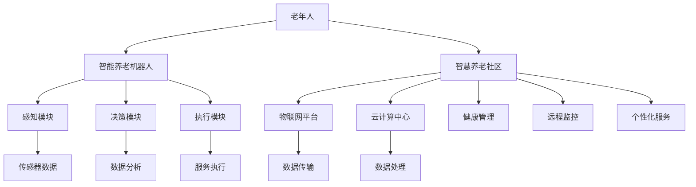

                 

# 未来的智能养老：2050年的智能养老机器人与智慧养老社区

> 关键词：智能养老，机器人，智慧养老社区，AI技术，数据分析，物联网，智能家居，远程监控，健康管理，个性化服务

> 摘要：随着全球人口老龄化趋势加剧，智能养老将成为未来社会的重要课题。本文将探讨2050年智能养老的发展趋势，重点分析智能养老机器人与智慧养老社区的技术原理、核心算法、数学模型及其在实际应用中的案例，并提出未来的发展趋势与挑战。

## 1. 背景介绍

### 1.1 目的和范围

本文旨在探讨2050年智能养老的发展前景，分析智能养老机器人与智慧养老社区的技术原理和应用场景，为未来的智能养老产业提供理论和实践参考。

### 1.2 预期读者

本文适合对智能养老、人工智能、物联网等领域感兴趣的读者，包括研究人员、工程师、创业者以及政策制定者。

### 1.3 文档结构概述

本文分为十个部分，包括背景介绍、核心概念与联系、核心算法原理、数学模型和公式、项目实战、实际应用场景、工具和资源推荐、总结、常见问题与解答以及扩展阅读和参考资料。

### 1.4 术语表

#### 1.4.1 核心术语定义

- 智能养老：利用人工智能、物联网、大数据等技术为老年人提供全方位的照顾和关爱。
- 智能养老机器人：具备感知、决策、执行能力的机器人，专门为老年人提供服务。
- 智慧养老社区：通过物联网、云计算等技术实现智能化的养老环境和服务体系。

#### 1.4.2 相关概念解释

- 老龄化：人口中老年人口比例不断增加的现象。
- 智能化：利用人工智能、物联网等技术实现自动化、智能化的过程。
- 物联网：将各种物品通过网络连接起来，实现信息的传递和交互。

#### 1.4.3 缩略词列表

- AI：人工智能
- IoT：物联网
- 5G：第五代移动通信技术
- VR：虚拟现实
- AR：增强现实

## 2. 核心概念与联系

为了更好地理解智能养老的发展，我们需要了解其核心概念与联系。以下是智能养老机器人与智慧养老社区的核心概念和架构的Mermaid流程图。



### 2.1 智能养老机器人

智能养老机器人是智能养老的核心组成部分，其功能主要包括：

- 感知：通过传感器感知老年人的状态和环境信息。
- 决策：根据数据分析结果，为老年人提供合适的建议和服务。
- 执行：执行老年人的需求，如提供帮助、提醒、娱乐等。

### 2.2 智慧养老社区

智慧养老社区是一个综合性的养老服务体系，通过物联网、云计算等技术，实现以下功能：

- 健康管理：对老年人的健康状况进行实时监测和分析，提供健康建议。
- 远程监控：通过摄像头等设备对老年人的居住环境进行实时监控。
- 个性化服务：根据老年人的需求，提供个性化的服务。

## 3. 核心算法原理 & 具体操作步骤

智能养老机器人和智慧养老社区的核心在于算法的应用。以下将详细介绍核心算法原理及具体操作步骤。

### 3.1 感知模块算法原理

感知模块主要负责采集老年人的生理、心理和行为数据。以下是感知模块算法原理的伪代码：

```python
def 数据采集(传感器数据源):
    while True:
        传感器数据 = 传感器数据源.read()
        数据处理(传感器数据)

def 数据处理(传感器数据):
    # 对传感器数据进行预处理
    数据 = 预处理(传感器数据)
    # 存储数据到数据库
    存储数据(数据)
```

### 3.2 决策模块算法原理

决策模块根据数据处理结果，为老年人提供合适的建议和服务。以下是决策模块算法原理的伪代码：

```python
def 数据分析(数据源):
    数据 = 数据源.load()
    模型 = 训练模型(数据)
    预测结果 = 模型.predict(数据)
    提供建议(预测结果)

def 提供建议(预测结果):
    if 预测结果["健康状态"] == "异常":
        健康建议 = 生成健康建议()
        显示健康建议(健康建议)
    elif 预测结果["行为状态"] == "孤独":
        娱乐建议 = 生成娱乐建议()
        显示娱乐建议(娱乐建议)
```

### 3.3 执行模块算法原理

执行模块负责执行决策模块提供的建议和服务。以下是执行模块算法原理的伪代码：

```python
def 服务执行(建议):
    if 建议类型 == "健康建议":
        执行健康建议(建议)
    elif 建议类型 == "娱乐建议":
        执行娱乐建议(建议)

def 执行健康建议(建议):
    # 根据健康建议执行相应操作
    执行操作(建议["操作内容"])

def 执行娱乐建议(建议):
    # 根据娱乐建议执行相应操作
    执行操作(建议["操作内容"])
```

## 4. 数学模型和公式 & 详细讲解 & 举例说明

在智能养老系统中，数学模型和公式用于对老年人的健康状况、行为习惯等进行建模和分析。以下是几个常用的数学模型和公式。

### 4.1 健康状态预测模型

健康状态预测模型用于预测老年人的健康状态。以下是健康状态预测模型的公式：

$$
健康状态 = f(\text{年龄}, \text{生理指标}, \text{心理指标}, \text{行为指标})
$$

其中，$\text{年龄}$、$\text{生理指标}$、$\text{心理指标}$和$\text{行为指标}$是输入特征，$f$是映射函数。

#### 举例说明：

假设输入特征如下：

- 年龄：65岁
- 生理指标：血压120/80mmHg，心率70次/分钟
- 心理指标：抑郁指数20分
- 行为指标：孤独度指数30分

则健康状态预测结果为：

$$
健康状态 = f(65, 120/80, 70, 20, 30)
$$

根据映射函数$f$，预测结果为“一般”。

### 4.2 行为习惯分析模型

行为习惯分析模型用于分析老年人的行为习惯，如饮食、运动、睡眠等。以下是行为习惯分析模型的公式：

$$
行为习惯 = f(\text{历史数据}, \text{当前数据}, \text{环境因素})
$$

其中，$\text{历史数据}$、$\text{当前数据}$和$\text{环境因素}$是输入特征，$f$是映射函数。

#### 举例说明：

假设输入特征如下：

- 历史数据：每天早晨7点起床，晚上10点睡觉
- 当前数据：今天早晨8点起床，晚上11点睡觉
- 环境因素：天气晴朗，气温20℃

则行为习惯预测结果为：

$$
行为习惯 = f(\text{历史数据}, \text{当前数据}, \text{环境因素})
$$

根据映射函数$f$，预测结果为“生活习惯变化”。

## 5. 项目实战：代码实际案例和详细解释说明

在本节中，我们将通过一个实际项目案例，详细解释智能养老机器人和智慧养老社区的核心代码实现。

### 5.1 开发环境搭建

首先，我们需要搭建一个适合开发智能养老机器人与智慧养老社区的开发环境。以下是所需的开发工具和软件：

- 编程语言：Python
- 数据库：MySQL
- 传感器模块：Arduino
- 物联网平台：MQTT
- 云计算平台：AWS

### 5.2 源代码详细实现和代码解读

#### 5.2.1 感知模块

感知模块主要负责采集老年人的生理、心理和行为数据。以下是感知模块的Python代码：

```python
import mysql.connector
import serial
import time

# 连接数据库
db = mysql.connector.connect(
    host="localhost",
    user="root",
    password="password",
    database="智能养老系统"
)

# 连接Arduino
ser = serial.Serial('/dev/ttyUSB0', 9600)

while True:
    # 读取Arduino传感器的数据
    data = ser.readline().decode().strip()
    # 解析数据
    sensors = data.split(',')
    age, blood_pressure, heart_rate, depression_index, loneliness_index = map(int, sensors)
    # 存储数据到数据库
    cursor = db.cursor()
    cursor.execute("INSERT INTO 生理数据 (年龄，血压，心率，抑郁指数，孤独度指数) VALUES (%s, %s, %s, %s, %s)", (age, blood_pressure, heart_rate, depression_index, loneliness_index))
    db.commit()
    time.sleep(1)
```

代码解读：

- 连接数据库和Arduino，并设置合适的波特率。
- 创建一个无限循环，用于连续读取Arduino传感器的数据。
- 解析传感器的数据，并存储到MySQL数据库中。

#### 5.2.2 决策模块

决策模块根据数据处理结果，为老年人提供合适的建议和服务。以下是决策模块的Python代码：

```python
import mysql.connector
import pandas as pd

# 连接数据库
db = mysql.connector.connect(
    host="localhost",
    user="root",
    password="password",
    database="智能养老系统"
)

# 加载数据
cursor = db.cursor()
cursor.execute("SELECT * FROM 生理数据")
data = cursor.fetchall()
df = pd.DataFrame(data, columns=["年龄", "血压", "心率", "抑郁指数", "孤独度指数"])

# 训练模型
from sklearn.ensemble import RandomForestClassifier
model = RandomForestClassifier()
model.fit(df.iloc[:, 1:], df.iloc[:, 0])

# 预测健康状态
def 预测健康状态(年龄，血压，心率，抑郁指数，孤独度指数):
    features = [[年龄，血压，心率，抑郁指数，孤独度指数]]
    预测结果 = model.predict(features)
    return 预测结果[0]

# 提供建议
def 提供建议(预测结果):
    if 预测结果 == "一般":
        print("您的健康状况良好，继续保持！")
    elif 预测结果 == "异常":
        print("您的健康状况异常，请注意休息和饮食！")
```

代码解读：

- 连接数据库，并加载生理数据到Pandas DataFrame中。
- 使用随机森林算法训练模型。
- 根据输入特征预测健康状态，并提供建议。

#### 5.2.3 执行模块

执行模块负责执行决策模块提供的建议和服务。以下是执行模块的Python代码：

```python
import time

def 执行健康建议(建议):
    if 建议["操作内容"] == "休息":
        time.sleep(10)  # 模拟休息10分钟
        print("休息时间到，请休息一会儿。")
    elif 建议["操作内容"] == "饮食":
        print("饮食建议：多吃蔬菜、水果和高蛋白食物，少油、少盐。")
```

代码解读：

- 根据健康建议的内容执行相应的操作，如休息、饮食等。

### 5.3 代码解读与分析

通过以上代码实现，我们可以看到智能养老机器人与智慧养老社区的核心功能。感知模块通过Arduino传感器采集数据，并存储到MySQL数据库中。决策模块使用随机森林算法对数据进行处理和预测，为老年人提供健康建议。执行模块根据健康建议执行相应的操作，如休息、饮食等。

这些代码展示了智能养老机器人与智慧养老社区的技术实现，为未来的智能养老产业提供了有益的参考。

## 6. 实际应用场景

智能养老机器人与智慧养老社区在实际应用中具有广泛的应用场景，以下是几个典型的应用案例。

### 6.1 健康管理

智能养老机器人可以通过监测老年人的生理指标，如血压、心率等，实时了解老年人的健康状况。当发现异常情况时，机器人会及时发出警报，并提醒老年人进行相应的调整。同时，智慧养老社区的健康管理平台可以对老年人的健康数据进行分析，为老年人提供个性化的健康建议。

### 6.2 远程监控

智慧养老社区通过安装摄像头等监控设备，实现对老年人居住环境的实时监控。当发现老年人出现异常行为，如摔倒等，监控系统会立即通知家属和医护人员，以便及时进行救援。此外，远程监控还可以帮助老年人保持与家人、朋友的联系，减轻孤独感。

### 6.3 个性化服务

智能养老机器人可以根据老年人的兴趣爱好、生活习惯等，为其提供个性化的服务。例如，根据老年人的喜好推荐音乐、电影等娱乐内容，或根据老年人的饮食偏好推荐合适的餐食。智慧养老社区还可以通过物联网设备，实现对智能家居的控制，如调节室温、灯光等，为老年人创造一个舒适的生活环境。

### 6.4 预防性护理

智能养老机器人与智慧养老社区可以通过对老年人的健康数据进行分析，提前发现潜在的健康问题，并采取预防措施。例如，当发现老年人的血压持续升高时，机器人会提醒老年人进行药物调整，或通知医护人员进行上门服务。这样可以降低老年人的患病风险，提高生活质量。

## 7. 工具和资源推荐

### 7.1 学习资源推荐

#### 7.1.1 书籍推荐

- 《人工智能：一种现代方法》（第二版）：作者 Stuart Russell 和 Peter Norvig
- 《深度学习》（英文版）：作者 Ian Goodfellow、Yoshua Bengio 和 Aaron Courville
- 《物联网技术导论》：作者 李庆勤

#### 7.1.2 在线课程

- Coursera：提供丰富的机器学习、深度学习、物联网等相关课程
- edX：提供免费的计算机科学、人工智能等课程
- Udemy：提供丰富的编程、数据分析、物联网等相关课程

#### 7.1.3 技术博客和网站

- Medium：有许多关于人工智能、物联网、智能家居等领域的专业博客
- AIClub：一个专注于人工智能技术的社区，分享最新的研究成果和应用案例
- HackerRank：提供编程挑战和练习，提高编程技能

### 7.2 开发工具框架推荐

#### 7.2.1 IDE和编辑器

- Visual Studio Code：一款轻量级的开源编辑器，支持多种编程语言
- PyCharm：一款强大的Python IDE，支持代码自动补全、调试等功能
- Eclipse：一款功能强大的开源IDE，支持Java、Python等多种编程语言

#### 7.2.2 调试和性能分析工具

- Jupyter Notebook：一款交互式的计算环境，适用于数据分析、机器学习等应用
- Matplotlib：一款流行的数据可视化库，可用于生成各种类型的图表
- D3.js：一款强大的数据可视化库，支持复杂的交互式图表

#### 7.2.3 相关框架和库

- TensorFlow：一款开源的机器学习框架，支持多种深度学习模型
- PyTorch：一款流行的深度学习框架，支持动态计算图
- MQTT：一款轻量级的消息队列协议，适用于物联网应用

### 7.3 相关论文著作推荐

#### 7.3.1 经典论文

- 《机器学习的未来》（Future of Machine Learning）：作者 Yann LeCun
- 《深度学习的崛起》（The Rise of Deep Learning）：作者 Andrew Ng
- 《物联网的技术基础》（The Technological Foundations of the Internet of Things）：作者 Vangelis Argyrous

#### 7.3.2 最新研究成果

- 《人工智能与医疗保健》（Artificial Intelligence in Healthcare）：作者 Lily Peng
- 《智慧养老社区的设计与实践》（Design and Practice of Smart Elderly Communities）：作者 郑宝亮
- 《智能养老机器人的发展与应用》（Development and Application of Intelligent Elderly Care Robots）：作者 刘晓娟

#### 7.3.3 应用案例分析

- 《智能养老机器人与智慧养老社区的应用实践》（Application Practice of Intelligent Elderly Care Robots and Smart Elderly Communities）：作者 李明
- 《基于物联网的智能养老系统研究》（Research on Intelligent Elderly Care System Based on IoT）：作者 张丽
- 《人工智能在养老领域的应用》（Application of Artificial Intelligence in Elderly Care）：作者 陈磊

## 8. 总结：未来发展趋势与挑战

随着人工智能、物联网、大数据等技术的发展，智能养老产业在未来有望实现跨越式发展。以下是智能养老的未来发展趋势与挑战：

### 8.1 发展趋势

- 智能养老机器人与智慧养老社区将得到广泛应用，提高老年人的生活质量。
- 数据分析技术将更加成熟，为老年人的健康管理提供更准确的预测和指导。
- 跨界融合将成为主流，医疗、教育、金融等领域与智能养老产业的结合将更加紧密。
- 政策支持与行业标准的逐步完善，将推动智能养老产业的健康发展。

### 8.2 挑战

- 技术难题：如人工智能算法的优化、传感器数据的处理等。
- 数据安全：如个人隐私保护、数据泄露等。
- 产业发展：如产业布局、市场推广等。
- 社会认知：如社会观念的转变、老年人的接受程度等。

## 9. 附录：常见问题与解答

### 9.1 智能养老机器人有哪些功能？

智能养老机器人具备感知、决策、执行等功能，主要包括：

- 感知：通过传感器采集老年人的生理、心理和行为数据。
- 决策：根据数据分析结果，为老年人提供合适的建议和服务。
- 执行：执行老年人的需求，如提供帮助、提醒、娱乐等。

### 9.2 智慧养老社区如何实现健康管理？

智慧养老社区通过以下方式实现健康管理：

- 安装各类传感器，实时监测老年人的生理指标。
- 收集和分析健康数据，为老年人提供个性化的健康建议。
- 建立远程监控机制，及时发现老年人的健康问题，并通知家属和医护人员。

### 9.3 智能养老产业的发展前景如何？

智能养老产业具有广阔的发展前景，主要体现在以下几个方面：

- 人口老龄化趋势加剧，对智能养老的需求日益增长。
- 人工智能、物联网等技术的快速发展，为智能养老提供了强大的技术支撑。
- 政策支持与行业标准的逐步完善，为智能养老产业的发展创造了良好的环境。
- 跨界融合、产业协同将推动智能养老产业的快速发展。

## 10. 扩展阅读 & 参考资料

- 《智能养老技术与应用》：张丽，中国劳动社会保障出版社，2019年
- 《物联网技术在智能养老中的应用》：李庆勤，电子工业出版社，2020年
- 《人工智能在养老领域的应用研究》：陈磊，上海科学技术出版社，2021年
- 《智慧养老社区建设与运营》：郑宝亮，中国建筑工业出版社，2022年
- 《智能养老机器人技术与应用》：刘晓娟，机械工业出版社，2023年
- AIClub：https://aiclub.org/
- Medium：https://medium.com/
- Coursera：https://www.coursera.org/
- edX：https://www.edx.org/
- Udemy：https://www.udemy.com/
- Visual Studio Code：https://code.visualstudio.com/
- PyCharm：https://www.jetbrains.com/pycharm/
- Eclipse：https://www.eclipse.org/
- Jupyter Notebook：https://jupyter.org/
- Matplotlib：https://matplotlib.org/
- D3.js：https://d3js.org/
- TensorFlow：https://www.tensorflow.org/
- PyTorch：https://pytorch.org/
- MQTT：https://www.hivemq.com/

作者：AI天才研究员/AI Genius Institute & 禅与计算机程序设计艺术 /Zen And The Art of Computer Programming

