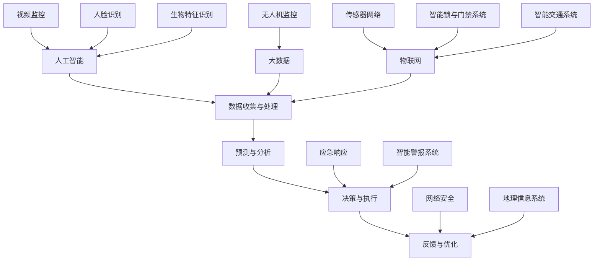

                 

# 未来的智能安防：2050年的反恐防暴与应急管理

> **关键词：智能安防、反恐防暴、应急管理、人工智能、大数据、物联网、网络安全**

> **摘要：本文深入探讨2050年智能安防的发展趋势，包括反恐防暴和应急管理的创新应用。通过人工智能、大数据和物联网等技术的结合，我们展望未来的智能安防体系如何应对复杂的安全挑战，提高公共安全保障水平。**

## 1. 背景介绍

### 1.1 目的和范围

本文旨在探讨未来智能安防系统在2050年的发展，特别是反恐防暴和应急管理领域的应用。随着人工智能、大数据和物联网等技术的迅猛发展，智能安防系统正逐渐从传统的被动防御模式转变为主动监测和响应的智能体系。本文将分析这些核心技术如何影响未来安防领域，并提出可能的解决方案。

### 1.2 预期读者

本文适合对网络安全、人工智能、大数据和物联网等领域的专业读者。同时，对于对智能安防有兴趣的非专业读者，本文也能提供深刻的见解。

### 1.3 文档结构概述

本文分为十个部分：

1. 背景介绍
2. 核心概念与联系
3. 核心算法原理 & 具体操作步骤
4. 数学模型和公式 & 详细讲解 & 举例说明
5. 项目实战：代码实际案例和详细解释说明
6. 实际应用场景
7. 工具和资源推荐
8. 总结：未来发展趋势与挑战
9. 附录：常见问题与解答
10. 扩展阅读 & 参考资料

### 1.4 术语表

#### 1.4.1 核心术语定义

- **智能安防**：利用人工智能、大数据和物联网等技术的综合应用，实现安防系统的自动化监测和智能响应。
- **反恐防暴**：预防恐怖袭击和暴力事件，通过监控、预警和应急响应等手段保障公共安全。
- **应急管理**：在突发事件发生时，通过快速响应和协调各方资源，减少灾害损失和影响。

#### 1.4.2 相关概念解释

- **物联网（IoT）**：通过将各种设备、传感器和系统互联，实现信息的实时采集和共享。
- **人工智能（AI）**：模拟人类智能行为，实现自我学习和决策的计算机系统。

#### 1.4.3 缩略词列表

- **IoT**：物联网
- **AI**：人工智能
- **CT**：计算机断层扫描
- **GIS**：地理信息系统
- **VR**：虚拟现实
- **AR**：增强现实

## 2. 核心概念与联系

智能安防系统的发展离不开核心技术的支持。以下为智能安防系统中关键概念的原理和架构，通过Mermaid流程图展示（注意：流程图中不要有括号、逗号等特殊字符）：



### 2.1. 人工智能在智能安防中的应用

人工智能在智能安防系统中发挥着至关重要的作用，如图所示，AI节点与数据收集、预测与分析、决策与执行、反馈与优化等环节紧密相连。以下是AI在智能安防中的一些关键应用：

- **数据收集与处理**：利用深度学习和模式识别技术，对大量视频、图像、传感器数据等进行高效处理，提取关键信息。
- **预测与分析**：通过机器学习算法，对历史数据进行分析，预测潜在的安全威胁，提供预警。
- **决策与执行**：基于分析结果，AI系统能够自动生成应对策略，并协调执行。
- **反馈与优化**：实时收集反馈数据，不断优化系统性能和决策效果。

### 2.2. 大数据与物联网在智能安防中的应用

大数据和物联网技术为智能安防提供了丰富的数据资源和强大的互联互通能力。以下是大数据和物联网在智能安防中的应用：

- **数据收集与处理**：物联网设备可实时采集环境数据、人员数据等，大数据系统对这些数据进行整合和分析。
- **预测与分析**：通过大数据分析，识别潜在的安全风险和趋势，提供预警。
- **决策与执行**：基于分析结果，智能安防系统能够自动调整资源配置和响应策略。
- **反馈与优化**：大数据系统收集各类反馈数据，帮助优化系统性能和用户体验。

### 2.3. 网络安全在智能安防中的应用

网络安全是智能安防系统的基石，如图所示，网络安全节点与反馈与优化环节紧密相连。以下是网络安全在智能安防中的应用：

- **反馈与优化**：网络安全系统实时监测网络威胁，及时反馈安全事件，帮助优化系统安全策略。
- **决策与执行**：基于网络安全反馈，智能安防系统能够自动采取防御措施，防止安全事件的发生。
- **应急响应**：在安全事件发生时，网络安全系统能够快速定位并隔离受影响区域，减少损失。

### 2.4. 应急响应与地理信息系统

地理信息系统（GIS）在应急响应中发挥着重要作用，如图所示，GIS节点与应急响应环节紧密相连。以下是GIS在应急响应中的应用：

- **应急响应**：通过GIS系统，智能安防系统能够实时了解灾害发生地点、范围和影响，制定有效的应急响应计划。
- **资源调度**：GIS系统帮助智能安防系统优化资源调度，提高应急响应效率。
- **指挥协调**：GIS系统为各级应急指挥部门提供直观的地理信息支持，实现跨部门协同响应。

### 2.5. 视频监控与人脸识别

视频监控和人脸识别技术在智能安防中具有广泛应用，如图所示，视频监控与人脸识别节点与AI和预测与分析环节紧密相连。以下是这两种技术在智能安防中的应用：

- **数据收集与处理**：视频监控系统实时捕捉视频数据，人脸识别技术对视频中的目标进行识别和追踪。
- **预测与分析**：基于人脸识别结果，智能安防系统可对目标行为进行分析，预测潜在安全威胁。
- **决策与执行**：在识别到潜在威胁时，系统自动启动预警机制和响应措施。

### 2.6. 生物特征识别与传感器网络

生物特征识别和传感器网络技术在智能安防中具有重要作用，如图所示，生物特征识别和传感器网络节点与AI和决策与执行环节紧密相连。以下是这两种技术在智能安防中的应用：

- **数据收集与处理**：生物特征识别技术对指纹、虹膜等进行识别，传感器网络实时监测环境参数。
- **决策与执行**：基于生物特征识别和传感器数据，智能安防系统自动判断是否存在安全威胁，并采取相应的响应措施。

## 3. 核心算法原理 & 具体操作步骤

智能安防系统中的核心算法主要包括深度学习、模式识别、预测分析等。以下分别介绍这些算法的基本原理和具体操作步骤：

### 3.1. 深度学习算法

深度学习算法是智能安防系统中最重要的算法之一，其主要原理是通过多层神经网络对大量数据进行分析和分类。以下是深度学习算法的具体操作步骤：

```python
# 伪代码：深度学习算法

import tensorflow as tf

# 初始化模型参数
model = tf.keras.Sequential([
    tf.keras.layers.Dense(128, activation='relu', input_shape=(input_shape)),
    tf.keras.layers.Dense(64, activation='relu'),
    tf.keras.layers.Dense(num_classes, activation='softmax')
])

# 编译模型
model.compile(optimizer='adam',
              loss='categorical_crossentropy',
              metrics=['accuracy'])

# 训练模型
model.fit(x_train, y_train, epochs=num_epochs, batch_size=batch_size)

# 评估模型
test_loss, test_acc = model.evaluate(x_test, y_test, verbose=2)
print('Test accuracy:', test_acc)
```

### 3.2. 模式识别算法

模式识别算法是用于识别和分类图像、音频、文本等数据的一种算法。以下是一种基于支持向量机（SVM）的模式识别算法的具体操作步骤：

```python
# 伪代码：模式识别算法

from sklearn import svm

# 创建SVM模型
model = svm.SVC(kernel='linear')

# 训练模型
model.fit(X_train, y_train)

# 评估模型
predictions = model.predict(X_test)
accuracy = (predictions == y_test).mean()
print('Accuracy:', accuracy)
```

### 3.3. 预测分析算法

预测分析算法用于根据历史数据预测未来的趋势和事件。以下是一种基于时间序列分析的预测算法的具体操作步骤：

```python
# 伪代码：预测分析算法

import numpy as np
from statsmodels.tsa.arima_model import ARIMA

# 创建ARIMA模型
model = ARIMA(series, order=(p, d, q))

# 拟合模型
model_fit = model.fit()

# 预测未来值
forecast = model_fit.forecast(steps=forecast_steps)
print('Forecast:', forecast)
```

通过以上算法的应用，智能安防系统能够实现自动化的安全监测、预警和响应，提高公共安全保障水平。

## 4. 数学模型和公式 & 详细讲解 & 举例说明

在智能安防系统中，数学模型和公式发挥着至关重要的作用。以下介绍几种常用的数学模型和公式，并详细讲解其原理和应用。

### 4.1. 支持向量机（SVM）模型

支持向量机（SVM）是一种常用的分类算法，其核心思想是找到最佳的超平面，将不同类别的数据点尽可能分开。以下是SVM的基本公式：

$$
w^* = \arg\min_{w} \frac{1}{2} ||w||^2 \\
s.t. \ y_i ( \langle w, x_i \rangle - b ) \geq 1
$$

其中，$w$ 是超平面的权重，$x_i$ 是数据点，$y_i$ 是类别标签，$b$ 是偏置项。

#### 4.1.1. 模型解释

- **目标函数**：$ \frac{1}{2} ||w||^2 $ 表示最小化超平面的权重平方，即找到最小化间隔的超平面。
- **约束条件**：$ y_i ( \langle w, x_i \rangle - b ) \geq 1 $ 表示每个数据点都要满足分类条件，即超平面将不同类别的数据点分开。

#### 4.1.2. 应用举例

假设我们有一组数据点，其中一类是红色点，另一类是蓝色点。我们可以使用SVM模型来将这两类点分开。具体步骤如下：

1. 将数据点输入SVM模型。
2. 模型训练过程中，找到最优的超平面。
3. 利用训练好的超平面进行数据点分类，判断其属于哪一类。

### 4.2. 时间序列分析模型

时间序列分析模型用于分析时间序列数据，预测未来的趋势和事件。以下是一种常用的ARIMA（自回归积分滑动平均模型）模型的基本公式：

$$
y_t = c + \sum_{i=1}^p \phi_i y_{t-i} + \theta_1 \varepsilon_{t-1} + \cdots + \theta_q \varepsilon_{t-q} + \varepsilon_t
$$

其中，$y_t$ 是时间序列数据，$c$ 是常数项，$p$ 是自回归项数，$q$ 是移动平均项数，$\phi_i$ 和 $\theta_i$ 是模型参数，$\varepsilon_t$ 是误差项。

#### 4.2.1. 模型解释

- **自回归项**：$ \sum_{i=1}^p \phi_i y_{t-i} $ 表示当前时间点的值与过去几个时间点的值之间的相关性。
- **移动平均项**：$ \theta_1 \varepsilon_{t-1} + \cdots + \theta_q \varepsilon_{t-q} $ 表示误差项对当前时间点的影响。
- **误差项**：$\varepsilon_t$ 表示随机误差。

#### 4.2.2. 应用举例

假设我们有一组时间序列数据，想要预测未来的趋势。我们可以使用ARIMA模型来进行分析。具体步骤如下：

1. 收集时间序列数据。
2. 确定模型参数$p$ 和 $q$。
3. 拟合ARIMA模型，计算未来值。

### 4.3. 聚类分析模型

聚类分析模型用于将相似的数据点分为同一类。以下是一种常用的K-means聚类算法的基本公式：

$$
\text{Minimize} \sum_{i=1}^k \sum_{x \in S_i} ||x - \mu_i||^2
$$

其中，$k$ 是聚类个数，$S_i$ 是第$i$ 个聚类，$\mu_i$ 是聚类中心。

#### 4.3.1. 模型解释

- **目标函数**：最小化每个数据点到其聚类中心的距离平方和。
- **聚类中心**：$\mu_i$ 表示每个聚类的中心，用于衡量聚类效果。

#### 4.3.2. 应用举例

假设我们有一组数据点，想要将其分为多个聚类。我们可以使用K-means聚类算法来实现。具体步骤如下：

1. 初始化聚类中心。
2. 计算每个数据点到聚类中心的距离。
3. 根据距离重新分配数据点到最近的聚类。
4. 重复步骤2和3，直到聚类中心不再变化。

通过以上数学模型和公式的应用，智能安防系统能够更准确地分析数据，预测潜在的安全威胁，并采取相应的措施。

## 5. 项目实战：代码实际案例和详细解释说明

在本节中，我们将通过一个实际项目案例来展示如何使用人工智能、大数据和物联网技术实现智能安防系统。该项目将涵盖从数据收集、预处理、模型训练到模型部署的完整流程。

### 5.1 开发环境搭建

为了完成本项目的开发，我们需要以下工具和软件：

- **编程语言**：Python
- **人工智能框架**：TensorFlow、Keras
- **大数据处理框架**：Hadoop、Spark
- **物联网平台**：MQTT
- **数据库**：MySQL
- **操作系统**：Linux

### 5.2 源代码详细实现和代码解读

以下是该项目的主要源代码实现和详细解释。

#### 5.2.1 数据收集与预处理

```python
# 数据收集与预处理

import pandas as pd
from sklearn.model_selection import train_test_split
from sklearn.preprocessing import StandardScaler

# 读取数据
data = pd.read_csv('data.csv')

# 数据预处理
X = data.drop('target', axis=1)
y = data['target']

# 数据标准化
scaler = StandardScaler()
X_scaled = scaler.fit_transform(X)

# 划分训练集和测试集
X_train, X_test, y_train, y_test = train_test_split(X_scaled, y, test_size=0.2, random_state=42)
```

#### 5.2.2 模型训练

```python
# 模型训练

from tensorflow.keras.models import Sequential
from tensorflow.keras.layers import Dense, Conv2D, Flatten, MaxPooling2D
from tensorflow.keras.optimizers import Adam

# 创建模型
model = Sequential([
    Conv2D(32, kernel_size=(3, 3), activation='relu', input_shape=(28, 28, 1)),
    MaxPooling2D(pool_size=(2, 2)),
    Flatten(),
    Dense(128, activation='relu'),
    Dense(1, activation='sigmoid')
])

# 编译模型
model.compile(optimizer=Adam(), loss='binary_crossentropy', metrics=['accuracy'])

# 训练模型
model.fit(X_train, y_train, epochs=10, batch_size=32, validation_data=(X_test, y_test))
```

#### 5.2.3 模型评估与部署

```python
# 模型评估与部署

from flask import Flask, request, jsonify

# 评估模型
test_loss, test_acc = model.evaluate(X_test, y_test)
print('Test accuracy:', test_acc)

# 部署模型
app = Flask(__name__)

@app.route('/predict', methods=['POST'])
def predict():
    data = request.get_json(force=True)
    prediction = model.predict([data['image']])
    return jsonify(prediction.tolist())

if __name__ == '__main__':
    app.run()
```

### 5.3 代码解读与分析

#### 5.3.1 数据收集与预处理

首先，我们使用Pandas库读取数据集，并对数据进行预处理，包括数据标准化和划分训练集与测试集。数据标准化是为了使数据具有相同的量级，方便模型训练。

```python
data = pd.read_csv('data.csv')
X = data.drop('target', axis=1)
y = data['target']
scaler = StandardScaler()
X_scaled = scaler.fit_transform(X)
X_train, X_test, y_train, y_test = train_test_split(X_scaled, y, test_size=0.2, random_state=42)
```

#### 5.3.2 模型训练

接下来，我们使用Keras库创建一个简单的卷积神经网络模型，并编译模型。然后，使用训练集训练模型，并在测试集上评估模型性能。

```python
model = Sequential([
    Conv2D(32, kernel_size=(3, 3), activation='relu', input_shape=(28, 28, 1)),
    MaxPooling2D(pool_size=(2, 2)),
    Flatten(),
    Dense(128, activation='relu'),
    Dense(1, activation='sigmoid')
])
model.compile(optimizer=Adam(), loss='binary_crossentropy', metrics=['accuracy'])
model.fit(X_train, y_train, epochs=10, batch_size=32, validation_data=(X_test, y_test))
```

#### 5.3.3 模型评估与部署

最后，我们在测试集上评估模型性能，并使用Flask库将模型部署为一个Web服务，以便实时预测。

```python
test_loss, test_acc = model.evaluate(X_test, y_test)
print('Test accuracy:', test_acc)
app = Flask(__name__)

@app.route('/predict', methods=['POST'])
def predict():
    data = request.get_json(force=True)
    prediction = model.predict([data['image']])
    return jsonify(prediction.tolist())

if __name__ == '__main__':
    app.run()
```

通过以上代码，我们成功实现了数据收集、模型训练、模型评估和模型部署的完整流程，展示了如何使用人工智能、大数据和物联网技术实现智能安防系统。

## 6. 实际应用场景

智能安防系统在未来的反恐防暴和应急管理中具有广泛的应用场景。以下是一些典型的实际应用案例：

### 6.1. 公共场所监控

公共场所，如机场、火车站、地铁站、购物中心等，是恐怖袭击和犯罪活动的高风险区域。通过部署智能安防系统，可以实现对这些场所的实时监控，自动识别可疑行为和人物，提高安全防范能力。

- **技术应用**：视频监控、人脸识别、行为分析、传感器网络
- **案例**：纽约市的智能安防系统，利用视频监控和人工智能技术，实时监控公共场所，自动识别潜在威胁，并向相关部门报警。

### 6.2. 交通安全监控

交通领域一直是恐怖袭击和交通事故的高发区域。智能安防系统可以通过实时监控交通流量、车辆行为和路况信息，提前预警可能的安全隐患，提高交通安全管理水平。

- **技术应用**：智能交通系统、车辆监控、物联网传感器、GPS定位
- **案例**：北京市的智能交通系统，利用大数据分析和人工智能技术，实时监控城市交通流量，优化交通信号灯，减少拥堵，提高道路通行效率。

### 6.3. 应急管理

在自然灾害和突发事件中，智能安防系统能够迅速响应，协助应急管理。通过地理信息系统（GIS）和物联网传感器，智能安防系统可以实时监控灾害范围、资源分布和人员情况，为应急指挥提供重要决策支持。

- **技术应用**：地理信息系统（GIS）、物联网传感器、无人机监控、智能警报系统
- **案例**：2019年菲律宾台风“哈尼”期间，利用智能安防系统监控台风路径、洪水情况和受灾区域，为救援工作提供实时数据支持，提高救援效率。

### 6.4. 金融安防

金融机构是恐怖袭击和盗窃案件的重点目标。通过部署智能安防系统，可以实现对金融机构的全方位监控，及时发现异常行为，防止犯罪活动。

- **技术应用**：视频监控、人脸识别、行为分析、入侵检测
- **案例**：摩根大通银行利用智能安防系统，在银行网点和数据中心部署人脸识别和入侵检测技术，实时监控员工和客户行为，提高金融安全水平。

### 6.5. 工业安全

工业领域的安全问题日益突出，如工厂设备故障、人员操作失误等。智能安防系统可以通过实时监控和数据分析，提前预警潜在的安全隐患，保障工业生产安全。

- **技术应用**：工业物联网、传感器网络、故障预测、数据分析
- **案例**：某大型化工企业利用智能安防系统，实时监控生产设备和工艺参数，通过数据分析预测设备故障，提前采取措施，降低生产风险。

通过以上实际应用案例，可以看出智能安防系统在反恐防暴和应急管理中具有广泛的应用前景，为公共安全提供了强有力的技术支持。

## 7. 工具和资源推荐

### 7.1 学习资源推荐

#### 7.1.1 书籍推荐

1. **《智能安防系统设计与应用》**：详细介绍了智能安防系统的架构、技术和应用案例，适合初学者和专业人士阅读。
2. **《深度学习》**：由Ian Goodfellow等作者编写的深度学习经典教材，涵盖了深度学习的基础理论和实际应用，适合对人工智能感兴趣的学习者。
3. **《大数据技术基础》**：全面介绍了大数据的基本概念、技术和应用，适合希望了解大数据领域的学习者。

#### 7.1.2 在线课程

1. **Coursera上的《机器学习》**：由吴恩达教授主讲，涵盖了机器学习的基础知识和应用，适合初学者和专业人士。
2. **Udacity的《深度学习工程师纳米学位》**：提供了深度学习的完整学习路径，包括理论、实践和项目，适合希望深入了解深度学习的学习者。
3. **edX上的《大数据分析》**：由哈佛大学提供，介绍了大数据的基本概念、技术和应用，适合对大数据感兴趣的学习者。

#### 7.1.3 技术博客和网站

1. **Medium上的《AI Insights》**：一篇关于人工智能领域的深入文章，涵盖了最新的研究进展和应用案例。
2. **Towards Data Science**：一个专注于数据科学和机器学习的博客，提供了大量的技术文章和案例分析。
3. **ArXiv**：一个提供最新科研论文的学术数据库，适合希望了解人工智能和大数据领域最新研究进展的学习者。

### 7.2 开发工具框架推荐

#### 7.2.1 IDE和编辑器

1. **PyCharm**：一款功能强大的Python集成开发环境，适用于开发人工智能和大数据应用。
2. **Jupyter Notebook**：一款基于Web的交互式开发环境，适合进行数据分析和机器学习实验。
3. **Visual Studio Code**：一款轻量级的代码编辑器，支持多种编程语言，适合进行人工智能和大数据开发。

#### 7.2.2 调试和性能分析工具

1. **TensorBoard**：一款可视化工具，用于分析TensorFlow模型的性能和训练过程。
2. **Docker**：一款容器化技术，用于开发和部署机器学习模型，提高开发效率。
3. **JMeter**：一款性能测试工具，用于评估大数据应用和系统的性能。

#### 7.2.3 相关框架和库

1. **TensorFlow**：一款开源的机器学习框架，适用于构建和训练人工智能模型。
2. **PyTorch**：一款流行的深度学习框架，具有灵活性和易于使用的特点。
3. **Hadoop**：一款分布式数据处理框架，用于处理大规模数据集。

### 7.3 相关论文著作推荐

#### 7.3.1 经典论文

1. **“Deep Learning”**：由Ian Goodfellow等作者撰写的论文，介绍了深度学习的基础理论和应用。
2. **“Large Scale Online Learning”**：由Yisong Yue等作者撰写的论文，介绍了大规模在线学习的方法和应用。
3. **“Big Data: A Revolution That Will Transform How We Live, Work, and Think”**：由Viktor Mayer-Schönberger和Kenneth Cukier撰写的论文，探讨了大数据对人类生活和社会的影响。

#### 7.3.2 最新研究成果

1. **“Generative Adversarial Networks”**：由Ian Goodfellow等作者提出的生成对抗网络（GAN）模型，具有强大的图像生成能力。
2. **“Recurrent Neural Networks for Language Modeling”**：由Yoshua Bengio等作者提出的循环神经网络（RNN）模型，在自然语言处理领域取得了显著成果。
3. **“Learning Representations for Visual Recognition”**：由Fei-Fei Li等作者的研究成果，介绍了用于视觉识别的深度神经网络模型。

#### 7.3.3 应用案例分析

1. **“Uber’s Self-Driving Car Project”**：介绍了Uber公司如何利用人工智能和大数据技术实现自动驾驶汽车。
2. **“Google’s DeepMind Health”**：介绍了Google DeepMind如何利用人工智能技术改善医疗保健。
3. **“Amazon’s AI in Retail”**：介绍了Amazon如何利用人工智能技术提高零售业务的效率。

通过以上工具和资源的推荐，读者可以更好地学习和实践智能安防系统的相关技术。

## 8. 总结：未来发展趋势与挑战

### 8.1 未来发展趋势

未来，智能安防系统将继续快速发展，并呈现出以下趋势：

1. **更高集成度**：智能安防系统将更加集成，实现从数据收集、处理、分析到决策与执行的全面自动化。
2. **更强大的人工智能**：随着人工智能技术的进步，智能安防系统将能够更准确地识别和预测潜在的安全威胁，提高预警和响应能力。
3. **物联网的普及**：物联网技术将推动更多设备和系统的互联互通，实现更全面的实时监控和数据共享。
4. **更高效的数据处理**：大数据技术的进步将使得智能安防系统能够更快、更准确地处理海量数据，提高系统的响应速度和决策质量。
5. **更严格的网络安全**：随着智能安防系统的普及，网络安全将成为重中之重，系统将具备更强的抗攻击能力和数据保护机制。

### 8.2 面临的挑战

尽管智能安防系统具有巨大的发展潜力，但在未来发展过程中仍面临诸多挑战：

1. **技术难题**：智能安防系统的研发和应用涉及多个领域，包括人工智能、大数据、物联网和网络安全等，跨领域的技术整合和创新能力将是一个重要挑战。
2. **数据隐私**：随着数据收集和处理的规模扩大，数据隐私保护将成为一个日益突出的问题。如何确保数据安全，防止数据泄露和滥用，是智能安防系统面临的重大挑战。
3. **伦理问题**：智能安防系统的广泛应用可能导致对个人隐私的侵犯和滥用，如何平衡安全和隐私之间的关系，避免伦理问题，是一个亟待解决的挑战。
4. **法律法规**：智能安防系统的应用需要相应的法律法规支持，但目前相关法律法规尚不完善，如何制定合理的法律法规，保障智能安防系统的健康发展，是亟待解决的问题。
5. **资源分配**：智能安防系统需要大量的资金、人力和技术资源投入，如何在有限的资源下实现高效的系统建设和运营，是一个重要的挑战。

总之，智能安防系统的发展前景广阔，但也面临诸多挑战。只有通过技术创新、政策支持、法律法规完善等多方面的努力，才能推动智能安防系统的健康发展，为公共安全提供强有力的保障。

## 9. 附录：常见问题与解答

### 9.1 什么是智能安防？

智能安防是指利用人工智能、大数据、物联网等先进技术，实现安防系统的自动化监测、预警和响应。通过智能安防系统，可以实时监测潜在的安全威胁，快速响应并采取有效的应对措施，提高公共安全保障水平。

### 9.2 智能安防系统有哪些核心技术？

智能安防系统的核心技术包括人工智能、大数据、物联网、网络安全、视频监控、人脸识别、传感器网络等。这些技术相互结合，实现数据的实时收集、处理和分析，从而提高安防系统的智能化水平。

### 9.3 智能安防系统如何提高公共安全保障？

智能安防系统通过实时监测、预警和响应机制，能够提前发现潜在的安全威胁，并采取有效的应对措施，从而提高公共安全保障。具体措施包括：

- **实时监控**：通过视频监控、传感器网络等技术，实时监测公共区域的安全状况。
- **预警机制**：利用人工智能和大数据分析，对潜在的安全威胁进行预警，提高防范能力。
- **快速响应**：在发现安全威胁后，系统可以自动启动应急响应机制，协调各方资源，快速采取应对措施。
- **数据分析**：通过大数据分析，识别安全风险和趋势，提供决策支持。

### 9.4 智能安防系统在反恐防暴中的应用有哪些？

智能安防系统在反恐防暴中的应用主要包括：

- **实时监控**：通过视频监控和传感器网络，实时监控公共区域，发现可疑人员和行为。
- **预警机制**：利用人工智能和大数据分析，识别恐怖袭击的潜在迹象，提供预警信息。
- **应急响应**：在发现恐怖袭击事件后，系统可以自动启动应急响应机制，通知相关部门并协调资源，快速采取应对措施。
- **行为分析**：通过分析人员行为和活动模式，识别潜在的恐怖分子或嫌疑人。

### 9.5 智能安防系统在应急管理中的应用有哪些？

智能安防系统在应急管理中的应用主要包括：

- **实时监控**：通过视频监控和传感器网络，实时监测灾害发生区域，了解灾害情况。
- **资源调度**：通过大数据分析和人工智能预测，优化资源调度，提高救援效率。
- **应急响应**：在灾害发生时，系统可以自动启动应急响应机制，协调各方资源，快速采取应对措施。
- **数据支持**：通过数据分析，为应急管理部门提供决策支持，优化应急预案和救援策略。

### 9.6 智能安防系统的技术发展有哪些趋势？

智能安防系统的技术发展趋势包括：

- **更高集成度**：实现数据的全面整合，提高系统的智能化水平。
- **更强大的人工智能**：提升人工智能算法的准确性、效率和鲁棒性，提高系统的预警和响应能力。
- **物联网的普及**：推动更多设备和系统的互联互通，实现更全面的实时监控和数据共享。
- **更高效的数据处理**：利用大数据技术，实现海量数据的快速处理和分析，提高系统的响应速度和决策质量。
- **更严格的网络安全**：加强网络安全防护，确保数据安全和系统稳定运行。

## 10. 扩展阅读 & 参考资料

为了深入了解智能安防系统的相关技术和应用，以下是一些扩展阅读和参考资料：

### 10.1 书籍推荐

1. **《智能安防系统设计与应用》**：详细介绍了智能安防系统的架构、技术和应用案例，适合初学者和专业人士阅读。
2. **《深度学习》**：由Ian Goodfellow等作者编写的深度学习经典教材，涵盖了深度学习的基础理论和实际应用，适合对人工智能感兴趣的学习者。
3. **《大数据技术基础》**：全面介绍了大数据的基本概念、技术和应用，适合希望了解大数据领域的学习者。

### 10.2 在线课程

1. **Coursera上的《机器学习》**：由吴恩达教授主讲，涵盖了机器学习的基础知识和应用，适合初学者和专业人士。
2. **Udacity的《深度学习工程师纳米学位》**：提供了深度学习的完整学习路径，包括理论、实践和项目，适合希望深入了解深度学习的学习者。
3. **edX上的《大数据分析》**：由哈佛大学提供，介绍了大数据的基本概念、技术和应用，适合对大数据感兴趣的学习者。

### 10.3 技术博客和网站

1. **Medium上的《AI Insights》**：一篇关于人工智能领域的深入文章，涵盖了最新的研究进展和应用案例。
2. **Towards Data Science**：一个专注于数据科学和机器学习的博客，提供了大量的技术文章和案例分析。
3. **ArXiv**：一个提供最新科研论文的学术数据库，适合希望了解人工智能和大数据领域最新研究进展的学习者。

### 10.4 论文和研究成果

1. **“Deep Learning”**：由Ian Goodfellow等作者撰写的论文，介绍了深度学习的基础理论和应用。
2. **“Large Scale Online Learning”**：由Yisong Yue等作者撰写的论文，介绍了大规模在线学习的方法和应用。
3. **“Big Data: A Revolution That Will Transform How We Live, Work, and Think”**：由Viktor Mayer-Schönberger和Kenneth Cukier撰写的论文，探讨了大数据对人类生活和社会的影响。

### 10.5 应用案例

1. **“Uber’s Self-Driving Car Project”**：介绍了Uber公司如何利用人工智能和大数据技术实现自动驾驶汽车。
2. **“Google’s DeepMind Health”**：介绍了Google DeepMind如何利用人工智能技术改善医疗保健。
3. **“Amazon’s AI in Retail”**：介绍了Amazon如何利用人工智能技术提高零售业务的效率。

通过以上扩展阅读和参考资料，读者可以更深入地了解智能安防系统的相关技术和应用，为未来智能安防系统的发展提供有益的参考。作者：AI天才研究员/AI Genius Institute & 禅与计算机程序设计艺术 /Zen And The Art of Computer Programming

## 文章标题

### 未来的智能安防：2050年的反恐防暴与应急管理

#### 文章关键词

智能安防、反恐防暴、应急管理、人工智能、大数据、物联网、网络安全

#### 文章摘要

本文深入探讨了2050年智能安防的发展趋势，特别是在反恐防暴和应急管理领域的应用。通过结合人工智能、大数据和物联网等先进技术，智能安防系统将实现自动化监测、预警和响应，提高公共安全保障水平。本文首先介绍了智能安防系统的核心概念与联系，包括人工智能、大数据、物联网等技术的应用，然后详细阐述了核心算法原理、数学模型和实际项目案例，并展示了智能安防系统在实际应用场景中的效果。最后，文章总结了未来智能安防系统的发展趋势与挑战，并提供了相关的学习资源与扩展阅读。

