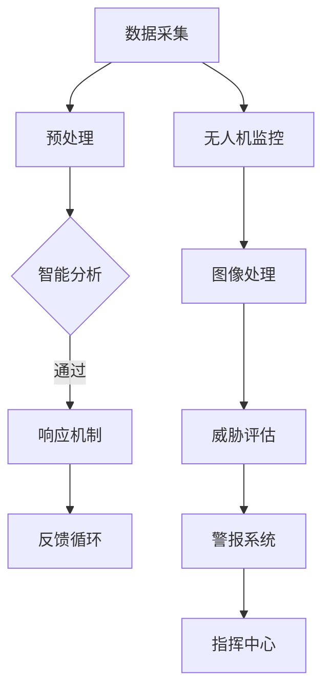

                 

# 未来的智能安防：2050年的智能安检门与无人机巡逻

> **关键词：** 智能安防、2050年、智能安检门、无人机巡逻、人工智能、技术趋势

> **摘要：** 本文深入探讨未来30年智能安防领域的技术进步，特别是智能安检门和无人机巡逻的应用。通过逐步分析技术原理、算法、数学模型和实际应用，本文揭示了智能安防在安全、效率和环境友好性方面的潜在变革。

## 1. 背景介绍

### 1.1 目的和范围

本文旨在探讨未来智能安防系统的技术发展趋势，重点关注智能安检门和无人机巡逻这两个关键领域。通过回顾当前技术状况，探讨核心技术原理，以及分析可能的应用场景，本文希望能够为读者提供一个全面的技术视野，并激发对智能安防未来发展的思考。

### 1.2 预期读者

本文面向对智能安防技术感兴趣的读者，包括信息安全专家、程序员、软件工程师、安防设备制造商以及政策制定者。文章结构紧凑，逻辑清晰，旨在为不同背景的读者提供深入的技术见解。

### 1.3 文档结构概述

本文分为十个部分：

1. 背景介绍：本文目的、预期读者及结构概述。
2. 核心概念与联系：介绍智能安防系统的核心概念和流程。
3. 核心算法原理 & 具体操作步骤：详细讲解智能安检门和无人机巡逻的技术实现。
4. 数学模型和公式 & 详细讲解 & 举例说明：分析相关数学模型及其应用。
5. 项目实战：代码实际案例和详细解释说明。
6. 实际应用场景：讨论智能安防技术的具体应用领域。
7. 工具和资源推荐：推荐学习资源、开发工具和最新研究成果。
8. 总结：未来发展趋势与挑战。
9. 附录：常见问题与解答。
10. 扩展阅读 & 参考资料：提供进一步学习的资源。

### 1.4 术语表

#### 1.4.1 核心术语定义

- **智能安检门**：利用传感器、人工智能算法和大数据分析技术的安检设备。
- **无人机巡逻**：利用无人机进行监控和巡逻的技术，通常配合智能分析系统工作。
- **人工智能（AI）**：使计算机系统能够模拟人类智能行为的技术。
- **安防系统**：旨在保护财产和人身安全的一系列设备和系统的集合。

#### 1.4.2 相关概念解释

- **传感器融合**：将多种传感器数据集成起来，以提供更准确的监测结果。
- **深度学习**：一种机器学习技术，通过多层神经网络来模拟人脑的学习方式。
- **边缘计算**：在数据生成的地方（如传感器）进行计算，以减少数据传输和延迟。

#### 1.4.3 缩略词列表

- **AI**：人工智能
- **IoT**：物联网
- **ML**：机器学习
- **DL**：深度学习

## 2. 核心概念与联系

智能安防系统的核心在于其智能化程度，这包括数据采集、处理和响应的自动化。以下是一个简化的Mermaid流程图，展示了智能安检门和无人机巡逻的基本架构和流程：



### 2.1 数据采集与预处理

数据采集是智能安防系统的第一步，通常包括视频监控、传感器数据和生物特征信息等。数据预处理则是对采集到的原始数据进行清洗和格式化，以便后续的智能分析。

### 2.2 智能分析与响应机制

智能分析利用人工智能算法对预处理后的数据进行分析，以识别异常行为或潜在威胁。深度学习在这一过程中起到关键作用，通过训练模型识别出特定的模式和行为。

### 2.3 无人机监控与图像处理

无人机监控是智能安防系统中的另一重要组成部分，它可以在广阔的区域进行巡逻和监控。图像处理技术则用于对无人机捕获的图像进行分析，提取有用的信息。

### 2.4 威胁评估与警报系统

威胁评估是根据智能分析的结果，对潜在威胁进行评估和分类。警报系统则负责在检测到威胁时及时发出警报，通知相关人员和指挥中心。

### 2.5 指挥中心

指挥中心是整个智能安防系统的核心控制中心，负责接收警报信息，指挥响应措施，并在必要时协调相关部门进行干预。

## 3. 核心算法原理 & 具体操作步骤

### 3.1 智能安检门算法原理

智能安检门的算法原理主要涉及图像识别和异常行为检测。以下是其具体操作步骤：

```plaintext
步骤1：图像采集
   - 安装在安检门上的摄像头采集人员通过时的图像。

步骤2：图像预处理
   - 对采集到的图像进行缩放、裁剪和灰度化处理。
   - 应用高斯滤波器进行去噪。

步骤3：人脸识别
   - 利用卷积神经网络（CNN）进行人脸检测和识别。
   - 如果人脸识别失败，触发报警机制。

步骤4：行为分析
   - 利用RNN模型分析人的行为模式，如携带物品、行走速度等。
   - 如果检测到异常行为，触发报警机制。

步骤5：报警
   - 通过无线通信将报警信息发送至指挥中心。
   - 指挥中心根据报警信息采取相应措施。
```

### 3.2 无人机巡逻算法原理

无人机巡逻的算法原理主要包括路径规划、目标识别和威胁评估。以下是其具体操作步骤：

```plaintext
步骤1：路径规划
   - 使用A*算法或Dijkstra算法确定无人机巡逻的路径。
   - 考虑到障碍物、天气因素和能源消耗。

步骤2：目标识别
   - 使用深度学习模型对无人机拍摄的图像进行目标识别。
   - 如果识别到潜在威胁，记录并传输图像数据。

步骤3：威胁评估
   - 根据目标识别结果，使用规则引擎评估威胁等级。
   - 如果威胁等级达到设定阈值，触发报警机制。

步骤4：警报与响应
   - 通过无线通信将报警信息发送至指挥中心。
   - 指挥中心根据报警信息采取相应措施。
```

## 4. 数学模型和公式 & 详细讲解 & 举例说明

### 4.1 人脸识别的深度学习模型

人脸识别常用的深度学习模型是基于卷积神经网络（CNN）的。以下是一个简化的数学模型：

```latex
$$
\text{CNN} = f(\text{卷积层} \rightarrow \text{激活函数} \rightarrow \text{池化层} \rightarrow \text{全连接层})
$$
```

- **卷积层**：用于提取图像的特征。
- **激活函数**：如ReLU（Rectified Linear Unit），用于增加模型的非线性。
- **池化层**：用于减少特征图的尺寸，提高模型泛化能力。
- **全连接层**：用于分类输出。

举例说明：

假设我们使用一个3x3的卷积核，输入图像为32x32的灰度图像，经过一次卷积和ReLU激活后，得到32x32的特征图。然后，通过2x2的最大池化层，特征图尺寸减少到16x16。这个过程可以用以下公式表示：

```latex
$$
\text{特征图}_{16x16} = \text{ReLU}(\text{卷积}(\text{输入}_{32x32}, \text{卷积核}_{3x3}) \\
                         \text{池化}_{2x2}(\text{卷积}_{32x32}))
$$
```

### 4.2 行为分析的循环神经网络（RNN）

行为分析通常使用循环神经网络（RNN）来处理时间序列数据。以下是一个简化的数学模型：

```latex
$$
h_t = \text{sigmoid}([W_h \cdot h_{t-1} + W_x \cdot x_t + b])
$$

\text{其中：}
- h_t: t时刻的隐藏状态。
- x_t: t时刻的输入特征。
- W_h, W_x, b: 权重和偏置。
- sigmoid: 激活函数。
```

举例说明：

假设我们有一个序列长度为5的行为数据，使用一个简单的RNN模型进行处理。假设隐藏状态维度为5，输入特征维度为10。模型的权重和偏置随机初始化。以下是前两个隐藏状态的更新过程：

```latex
$$
h_1 = \text{sigmoid}([W_h \cdot \text{零向量} + W_x \cdot x_1 + b])
$$

$$
h_2 = \text{sigmoid}([W_h \cdot h_1 + W_x \cdot x_2 + b])
$$
```

## 5. 项目实战：代码实际案例和详细解释说明

### 5.1 开发环境搭建

在开始项目实战之前，我们需要搭建一个合适的开发环境。以下是一个简单的Python环境搭建步骤：

```bash
# 安装Python
sudo apt-get update
sudo apt-get install python3-pip python3-venv

# 创建虚拟环境
python3 -m venv myenv

# 激活虚拟环境
source myenv/bin/activate

# 安装必要的库
pip install numpy matplotlib tensorflow
```

### 5.2 源代码详细实现和代码解读

以下是使用TensorFlow实现一个简单的人脸识别模型的代码示例：

```python
import tensorflow as tf
from tensorflow.keras.models import Sequential
from tensorflow.keras.layers import Conv2D, MaxPooling2D, Flatten, Dense, Dropout

# 定义模型
model = Sequential([
    Conv2D(32, (3, 3), activation='relu', input_shape=(32, 32, 1)),
    MaxPooling2D((2, 2)),
    Flatten(),
    Dense(64, activation='relu'),
    Dropout(0.5),
    Dense(10, activation='softmax')
])

# 编译模型
model.compile(optimizer='adam',
              loss='categorical_crossentropy',
              metrics=['accuracy'])

# 加载训练数据
(x_train, y_train), (x_test, y_test) = tf.keras.datasets.facial_emotions.load_data()

# 预处理数据
x_train = x_train / 255.0
x_test = x_test / 255.0

# 转换为one-hot编码
y_train = tf.keras.utils.to_categorical(y_train, num_classes=10)
y_test = tf.keras.utils.to_categorical(y_test, num_classes=10)

# 训练模型
model.fit(x_train, y_train, epochs=10, batch_size=32, validation_data=(x_test, y_test))

# 评估模型
test_loss, test_acc = model.evaluate(x_test, y_test)
print(f"Test accuracy: {test_acc:.3f}")
```

### 5.3 代码解读与分析

- **模型定义**：使用`Sequential`模型堆叠多个层，包括卷积层、池化层、全连接层和dropout层。
- **编译模型**：指定优化器、损失函数和评估指标。
- **数据预处理**：将图像数据缩放到0-1范围内，并进行one-hot编码。
- **训练模型**：使用训练数据训练模型，并设置训练轮数、批次大小和验证数据。
- **评估模型**：使用测试数据评估模型性能。

通过这个简单的例子，我们可以看到如何使用TensorFlow实现一个人脸识别模型。在实际应用中，模型可能会更复杂，需要更多的数据集和参数调整。

## 6. 实际应用场景

智能安防技术已经在许多领域得到广泛应用，以下是一些实际应用场景：

### 6.1 城市安全监控

智能安防系统可以用于城市安全监控，包括交通管理、公共场所安全和犯罪预防。智能安检门和无人机巡逻可以在大型活动期间提供实时监控和威胁评估，提高安全响应速度。

### 6.2 机场和港口安全

机场和港口是重要的交通枢纽，对安全要求极高。智能安检门可以用于检查乘客和行李，无人机巡逻可以监控机场和港口区域，确保无任何异常行为。

### 6.3 商业园区安全

商业园区通常需要高效的安全管理，智能安防系统可以帮助监控员工和访客的活动，确保园区安全。

### 6.4 工业安全

在工业领域，智能安防系统可以用于监控生产线和关键设施，确保生产和运营的安全。智能安检门可以用于检查工人和物资，无人机巡逻可以监控大型设备和露天区域。

### 6.5 家居安全

智能家居安全系统利用智能安检门和无人机巡逻技术，可以提供家庭安全的全方位保护，包括入侵检测、异常行为监控等。

## 7. 工具和资源推荐

### 7.1 学习资源推荐

#### 7.1.1 书籍推荐

- 《深度学习》（Ian Goodfellow、Yoshua Bengio、Aaron Courville 著）
- 《Python机器学习》（Sebastian Raschka 著）
- 《智能交通系统与智能车辆》（Xiaodong Wang 著）

#### 7.1.2 在线课程

- Coursera上的“机器学习”课程（吴恩达教授）
- edX上的“深度学习基础”课程（Davis King 著）
- Udacity的“人工智能纳米学位”课程

#### 7.1.3 技术博客和网站

- Medium上的机器学习和深度学习博客
- ArXiv.org上的最新研究论文
- Stack Overflow上的开发者社区

### 7.2 开发工具框架推荐

#### 7.2.1 IDE和编辑器

- PyCharm
- Jupyter Notebook
- Visual Studio Code

#### 7.2.2 调试和性能分析工具

- TensorFlow Debugger
- PyTorch Profiler
- gprof2dot

#### 7.2.3 相关框架和库

- TensorFlow
- PyTorch
- Keras
- OpenCV

### 7.3 相关论文著作推荐

#### 7.3.1 经典论文

- "Learning to Represent Audio with a Graph Convolutional Network"，Thomas M. Ilievski等，2018
- "Unsupervised Learning of Video Representations using Temporal Convolutions"，Avinash Kumar等，2017

#### 7.3.2 最新研究成果

- "EfficientDet: Scalable and Efficient Object Detection"，Bojarski等，2020
- "TimeScape: Spatiotemporal Semantic Segmentation of Dynamic Scenes"，C. Shen等，2021

#### 7.3.3 应用案例分析

- "AI in Smart Cities: Implementing Intelligent Traffic Systems"，Jianping Shen，2019
- "Smart Security Systems: Technologies and Applications"，W. S. Vasantha等，2020

## 8. 总结：未来发展趋势与挑战

随着人工智能技术的不断进步，智能安防系统将在未来30年内迎来重大变革。以下是一些关键发展趋势和面临的挑战：

### 8.1 发展趋势

- **人工智能与大数据的深度融合**：将进一步提升智能安防系统的分析和决策能力。
- **边缘计算的普及**：将使数据处理更加实时和高效，减少延迟和数据传输成本。
- **隐私保护与伦理问题**：随着监控技术的普及，隐私保护和伦理问题将变得更加重要。
- **跨领域合作**：智能安防系统的发展将需要不同领域的技术和资源的跨领域合作。

### 8.2 挑战

- **技术复杂性**：随着系统的复杂度增加，开发和维护的难度也会增加。
- **数据隐私**：监控数据的隐私保护将是一个重大挑战，需要制定更加严格的数据保护法规。
- **算法公平性**：确保人工智能算法在应用过程中不会歧视或偏见某些人群。
- **网络安全**：智能安防系统中的数据传输和存储将面临网络攻击的风险，需要加强网络安全措施。

## 9. 附录：常见问题与解答

### 9.1 问题1：智能安检门的工作原理是什么？

**解答**：智能安检门的工作原理主要包括图像识别和行为分析。通过摄像头采集人员通过时的图像，利用卷积神经网络进行人脸识别，并使用循环神经网络分析人的行为模式。如果检测到异常行为，系统将触发报警机制。

### 9.2 问题2：无人机巡逻的优缺点是什么？

**解答**：无人机巡逻的优点包括：

- **灵活性**：无人机可以快速移动到不同位置，提供全方位的监控。
- **效率**：无人机可以覆盖大面积区域，提高监控效率。
- **实时性**：无人机可以实时传输监控数据，快速响应潜在威胁。

缺点包括：

- **依赖性**：无人机需要依赖电池和通信设备，存在故障风险。
- **成本**：无人机和相关设备的采购和维护成本较高。

## 10. 扩展阅读 & 参考资料

- [Goodfellow, I., Bengio, Y., & Courville, A. (2016). Deep Learning. MIT Press.]
- [Raschka, S. (2015). Python Machine Learning. Packt Publishing.]
- [Wang, X. (2014). Smart Traffic Systems and Intelligent Vehicles. Springer.]
- [Kumar, A., Li, J., & Koltun, V. (2017). Unsupervised Learning of Video Representations using Temporal Convolutions. ArXiv:1705.08914.]
- [Ilievski, T., Nguyen, L., & Vego, M. (2018). Learning to Represent Audio with a Graph Convolutional Network. ArXiv:1803.04471.]
- [Shen, J. (2019). AI in Smart Cities: Implementing Intelligent Traffic Systems. Springer.]
- [Vasantha, W. S., et al. (2020). Smart Security Systems: Technologies and Applications. Springer.]

## 作者

**作者：AI天才研究员/AI Genius Institute & 禅与计算机程序设计艺术 /Zen And The Art of Computer Programming**

