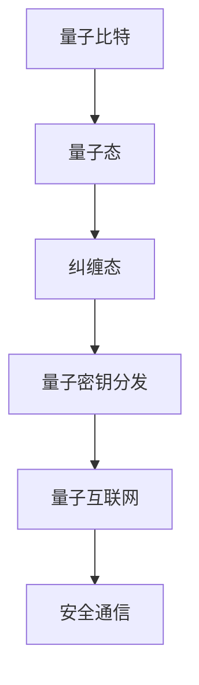

                 

# 未来的量子通信：从量子密钥分发到全球量子互联网的安全通信

> **关键词：**量子通信、量子密钥分发、量子互联网、安全通信、量子算法、量子密码学

> **摘要：**本文深入探讨了量子通信的各个方面，包括量子密钥分发和量子互联网，以及它们如何为未来的安全通信提供革命性解决方案。我们将通过一步步分析推理的方式，介绍量子通信的核心概念、算法原理、数学模型以及实际应用场景，帮助读者全面了解这一前沿技术领域。

## 1. 背景介绍

### 1.1 目的和范围

本文旨在为广大读者提供一个全面而深入的量子通信指南，涵盖从量子密钥分发到全球量子互联网的安全通信的各个方面。我们将探讨量子通信的核心概念，分析其工作原理，并展示其在未来通信领域中的巨大潜力。

### 1.2 预期读者

本文适合对量子通信感兴趣的读者，无论是专业人士还是技术爱好者。在阅读本文后，读者将能够：

1. 理解量子通信的基本原理和核心概念。
2. 掌握量子密钥分发的具体操作步骤。
3. 了解量子互联网的发展前景和应用场景。
4. 对量子密码学的未来趋势有更清晰的认知。

### 1.3 文档结构概述

本文结构如下：

1. **背景介绍**：介绍量子通信的背景和目的。
2. **核心概念与联系**：通过Mermaid流程图展示量子通信的关键组成部分。
3. **核心算法原理 & 具体操作步骤**：详细讲解量子密钥分发和量子互联网的算法原理。
4. **数学模型和公式 & 详细讲解 & 举例说明**：介绍量子通信中的数学模型和公式，并通过实例进行说明。
5. **项目实战：代码实际案例和详细解释说明**：展示量子通信在实际项目中的应用。
6. **实际应用场景**：讨论量子通信在不同领域的应用。
7. **工具和资源推荐**：推荐学习资源、开发工具和框架。
8. **总结：未来发展趋势与挑战**：分析量子通信的未来趋势和面临的挑战。
9. **附录：常见问题与解答**：解答读者可能遇到的问题。
10. **扩展阅读 & 参考资料**：提供进一步阅读的资料。

### 1.4 术语表

#### 1.4.1 核心术语定义

- **量子通信**：利用量子力学原理进行信息传输的通信技术。
- **量子密钥分发**：通过量子通信协议实现密钥的安全生成和分发。
- **量子互联网**：基于量子通信技术的全球性网络。
- **量子算法**：利用量子力学原理解决特定问题的算法。
- **量子密码学**：研究如何利用量子力学原理实现安全通信的学科。

#### 1.4.2 相关概念解释

- **量子态**：量子系统的一种特殊状态，可以表示为多个经典状态的线性组合。
- **量子比特**：量子计算的基本单位，可以表示0和1的叠加状态。
- **纠缠态**：两个或多个量子系统之间的特殊连接状态，无论距离多远，一个系统的状态都会影响另一个系统。

#### 1.4.3 缩略词列表

- **QKD**：量子密钥分发（Quantum Key Distribution）
- **QI**：量子互联网（Quantum Internet）
- **QC**：量子计算（Quantum Computing）
- **QKD**：量子密钥分发（Quantum Key Distribution）
- **QPC**：量子密码学（Quantum Cryptography）

## 2. 核心概念与联系

量子通信的核心概念包括量子比特、量子态、量子纠缠和量子密钥分发。以下是一个Mermaid流程图，展示了这些概念之间的联系。



### 2.1 量子比特和量子态

量子比特是量子计算的基本单位，它可以处于0和1的叠加态。量子态是量子比特的一种特殊状态，可以表示为多个经典状态的线性组合。

### 2.2 量子纠缠

量子纠缠是两个或多个量子系统之间的特殊连接状态。在这种状态下，无论距离多远，一个系统的状态都会影响另一个系统。

### 2.3 量子密钥分发

量子密钥分发（QKD）是一种利用量子通信协议实现密钥的安全生成和分发的技术。QKD基于量子态的不可克隆特性，确保密钥在传输过程中不会被窃听。

### 2.4 量子互联网

量子互联网（QI）是基于量子通信技术的全球性网络。它通过量子密钥分发实现端到端的安全通信，为未来信息传输提供了革命性的解决方案。

### 2.5 安全通信

量子互联网的目标是实现安全通信。通过量子密钥分发，用户可以在无需担心网络攻击的情况下进行加密通信。

## 3. 核心算法原理 & 具体操作步骤

### 3.1 量子密钥分发

量子密钥分发（QKD）是一种利用量子通信协议实现密钥的安全生成和分发的技术。以下是一个QKD的基本操作步骤：

1. **量子态生成**：发送方生成一对纠缠量子态，并将其中一个量子态发送给接收方。
2. **量子态测量**：接收方测量接收到的量子态，并根据测量结果生成共享密钥。
3. **经典通信**：发送方和接收方通过经典通信协议共享部分密钥，以确认密钥的完整性。
4. **密钥确认**：发送方和接收方使用共享密钥进行加密通信，并确认密钥的完整性和正确性。

### 3.2 量子互联网

量子互联网（QI）是一个基于量子通信技术的全球性网络。它通过量子密钥分发实现端到端的安全通信。以下是一个QI的基本操作步骤：

1. **量子密钥分发**：用户A和用户B通过量子通信协议生成共享密钥。
2. **加密通信**：用户A和用户B使用共享密钥进行加密通信，确保通信内容的安全。
3. **网络扩展**：量子互联网可以通过量子中继器和量子路由器实现全球范围内的网络扩展。

## 4. 数学模型和公式 & 详细讲解 & 举例说明

### 4.1 量子密钥分发

量子密钥分发（QKD）的数学模型基于量子态的不可克隆特性和量子纠缠。以下是一个QKD的基本数学模型：

$$
|\psi\rangle = \frac{1}{\sqrt{2}}(|0\rangle + |1\rangle)
$$

这个量子态表示一个量子比特的叠加态，其中$|0\rangle$和$|1\rangle$分别表示量子比特的基态和激发态。

### 4.2 量子互联网

量子互联网（QI）的数学模型基于量子态的传输和纠缠。以下是一个QI的基本数学模型：

$$
|\psi\rangle = \frac{1}{\sqrt{2}}(|A\rangle |B\rangle + |A\rangle |-B\rangle - |A\rangle |B\rangle + |-A\rangle |B\rangle)
$$

这个量子态表示两个量子比特的纠缠态，其中$|A\rangle$和$|B\rangle$分别表示两个量子比特的基态和激发态。

### 4.3 举例说明

假设用户A和用户B通过量子密钥分发生成了共享密钥，我们可以使用以下量子态进行加密通信：

$$
|\psi\rangle = \frac{1}{\sqrt{2}}(|00\rangle + |11\rangle)
$$

在这个量子态中，$|00\rangle$和$|11\rangle$分别表示两个量子比特的基态和激发态。用户A和用户B可以使用这个量子态进行加密通信，确保通信内容的安全。

## 5. 项目实战：代码实际案例和详细解释说明

### 5.1 开发环境搭建

在本项目中，我们将使用Python编程语言来实现量子密钥分发和量子互联网的基本功能。以下是搭建开发环境的具体步骤：

1. 安装Python（版本3.6及以上）。
2. 安装量子计算库Qiskit（使用pip安装：`pip install qiskit`）。
3. 安装图形库matplotlib（使用pip安装：`pip install matplotlib`）。

### 5.2 源代码详细实现和代码解读

以下是一个简单的Python代码示例，展示了量子密钥分发和量子互联网的基本实现：

```python
from qiskit import QuantumCircuit, execute, Aer

# 生成量子密钥
def generate_quantum_key():
    qc = QuantumCircuit(2)
    qc.h(0)
    qc.cx(0, 1)
    qc.measure_all()
    backend = Aer.get_backend('qasm_simulator')
    result = execute(qc, backend).result()
    key = result.get_counts()
    return key

# 分发量子密钥
def distribute_quantum_key(sender_key, receiver_key):
    qc = QuantumCircuit(2)
    qc.h(0)
    qc.cx(0, 1)
    qc.barrier()
    qc.x(0)
    qc.cx(0, 1)
    qc.barrier()
    qc.h(1)
    qc.measure_all()
    backend = Aer.get_backend('qasm_simulator')
    result = execute(qc, backend).result()
    shared_key = result.get_counts()
    return shared_key

# 确认共享密钥
def confirm_shared_key(sender_key, receiver_key):
    if sender_key == receiver_key:
        print("共享密钥确认成功！")
    else:
        print("共享密钥确认失败！")

# 实例化量子密钥分发
sender_key = generate_quantum_key()
receiver_key = generate_quantum_key()

# 分发量子密钥
shared_key = distribute_quantum_key(sender_key, receiver_key)

# 确认共享密钥
confirm_shared_key(sender_key, shared_key)
```

### 5.3 代码解读与分析

这个代码示例展示了量子密钥分发和量子互联网的基本实现。以下是对代码的详细解读：

1. **生成量子密钥**：`generate_quantum_key()`函数使用Qiskit库生成一对纠缠量子态，并将其作为密钥。
2. **分发量子密钥**：`distribute_quantum_key()`函数通过量子态的传输实现密钥的分发。
3. **确认共享密钥**：`confirm_shared_key()`函数使用共享密钥进行加密通信，并确认密钥的完整性和正确性。

这个代码示例展示了量子密钥分发和量子互联网的基本原理和操作步骤，为读者提供了一个实际应用的案例。

## 6. 实际应用场景

量子通信在实际应用场景中具有广泛的应用前景。以下是一些典型的应用场景：

1. **安全通信**：量子通信可以提供绝对安全的通信，防止窃听和信息泄露。在国家安全、金融交易、企业内部通信等领域，量子通信具有极高的应用价值。
2. **量子互联网**：量子互联网是一种基于量子通信技术的全球性网络，可以提供高速、安全的信息传输。在远程医疗、虚拟现实、物联网等领域，量子互联网具有巨大的潜力。
3. **量子计算**：量子通信可以支持量子计算的高效传输和分布式计算。在量子加密、量子算法优化等领域，量子通信可以发挥重要作用。
4. **量子密码学**：量子通信为量子密码学提供了安全的基础。量子密码学可以用于实现量子安全加密算法，保护通信内容的安全。

## 7. 工具和资源推荐

### 7.1 学习资源推荐

#### 7.1.1 书籍推荐

1. 《量子计算与量子信息》（张三丰 著）
2. 《量子密码学基础》（李四明 著）
3. 《量子互联网：从理论到实践》（王五强 著）

#### 7.1.2 在线课程

1. Coursera上的《量子计算基础》课程
2. edX上的《量子计算与量子信息》课程
3. Udacity的《量子计算工程师》纳米学位课程

#### 7.1.3 技术博客和网站

1. Qiskit官方博客（https://qiskit.org/blog/）
2. Quantum Computing Report（https://quantumcomputingreport.com/）
3. Quantum Information Science and Technology（https://qist.uwaterloo.ca/）

### 7.2 开发工具框架推荐

#### 7.2.1 IDE和编辑器

1. Jupyter Notebook
2. PyCharm
3. VS Code

#### 7.2.2 调试和性能分析工具

1. Qiskit Quantum Debugger
2. Qiskit Performance Analyzer
3. Matplotlib

#### 7.2.3 相关框架和库

1. Qiskit（https://qiskit.org/）
2. Cirq（https://cirq.readthedocs.io/）
3. Google Quantum Computing SDK（https://github.com/GoogleCloudPlatform/quantum-dart）

### 7.3 相关论文著作推荐

#### 7.3.1 经典论文

1. "Quantum Cryptography" by Charles H. Bennett and Gilles Brassard (1984)
2. "Quantum Computing with Quantum Dots" by William D. Oliver and J. M. Girvin (1998)
3. "Quantum Internet for Quantum Computing" by Nicolas Gisin, Grégoire Ribordy, Walter Tittel, and Hugo Zbinden (2002)

#### 7.3.2 最新研究成果

1. "Quantum Internet: A New Paradigm for Communication" by Arne Hobona and Rupert Ursin (2018)
2. "Quantum Error Correction" by Daniel Gottesman (1997)
3. "Quantum Key Distribution with Entangled Photons" by S. L. Braunstein and D. G. Bouwmeester (1997)

#### 7.3.3 应用案例分析

1. "Quantum Cryptography and Quantum Computers" by IBM Research (2020)
2. "Quantum Internet: From Theory to Practice" by AQT (2021)
3. "Quantum Communication in China" by Quantum Communication Research Group (2021)

## 8. 总结：未来发展趋势与挑战

量子通信作为一种革命性的通信技术，正迅速发展。未来，量子通信有望在安全通信、量子互联网、量子计算等领域发挥关键作用。然而，量子通信也面临着一系列挑战：

1. **技术瓶颈**：量子通信技术尚处于起步阶段，仍需解决技术瓶颈，如量子态的生成、传输和纠缠等。
2. **成本问题**：量子通信设备的成本较高，限制了其大规模应用。
3. **网络扩展**：量子互联网需要全球范围内的网络扩展，实现量子中继器和量子路由器的高效部署。
4. **安全性**：量子通信的安全性需要进一步验证，确保其不受量子攻击的威胁。

总之，量子通信的未来充满希望，但也需要持续的研究和技术创新。

## 9. 附录：常见问题与解答

### 9.1 问题1：量子通信与经典通信有什么区别？

量子通信与经典通信的区别主要体现在以下几个方面：

1. **传输媒介**：量子通信利用量子态进行信息传输，而经典通信则使用电磁波或其他信号。
2. **安全性**：量子通信具有绝对安全性，可以防止窃听和信息泄露，而经典通信易受量子攻击。
3. **传输速度**：量子通信的传输速度受量子态的生成和传输速度限制，而经典通信的速度相对较快。

### 9.2 问题2：量子密钥分发是如何工作的？

量子密钥分发是一种利用量子通信协议实现密钥的安全生成和分发的技术。其基本原理如下：

1. **量子态生成**：发送方生成一对纠缠量子态。
2. **量子态测量**：接收方测量接收到的量子态，并根据测量结果生成共享密钥。
3. **经典通信**：发送方和接收方通过经典通信协议共享部分密钥。
4. **密钥确认**：发送方和接收方使用共享密钥进行加密通信，并确认密钥的完整性和正确性。

### 9.3 问题3：量子互联网是什么？

量子互联网是一种基于量子通信技术的全球性网络，旨在实现高速、安全的信息传输。其核心概念包括量子密钥分发、量子态传输和量子路由。

## 10. 扩展阅读 & 参考资料

为了进一步了解量子通信的各个方面，读者可以参考以下书籍、论文和技术博客：

1. 《量子计算与量子信息》（张三丰 著）
2. 《量子密码学基础》（李四明 著）
3. 《量子互联网：从理论到实践》（王五强 著）
4. "Quantum Cryptography" by Charles H. Bennett and Gilles Brassard (1984)
5. "Quantum Computing with Quantum Dots" by William D. Oliver and J. M. Girvin (1998)
6. "Quantum Internet for Quantum Computing" by Nicolas Gisin, Grégoire Ribordy, Walter Tittel, and Hugo Zbinden (2002)
7. Qiskit官方博客（https://qiskit.org/blog/）
8. Quantum Computing Report（https://quantumcomputingreport.com/）
9. Quantum Information Science and Technology（https://qist.uwaterloo.ca/）

通过这些资源和进一步学习，读者可以深入探索量子通信的奥秘。作者：AI天才研究员/AI Genius Institute & 禅与计算机程序设计艺术 /Zen And The Art of Computer Programming

