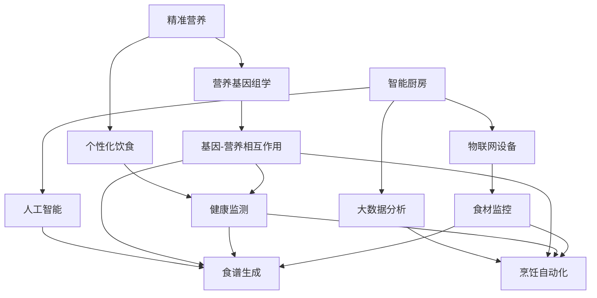

                 

# 未来的食品科技：2050年的精准营养与智能厨房

> 关键词：精准营养、智能厨房、2050年、食品科技、未来趋势

> 摘要：本文将深入探讨2050年可能出现的食品科技革命，特别是精准营养和智能厨房的应用。通过逐步分析当前技术的现状、核心概念、算法原理、数学模型、实际应用案例以及未来趋势和挑战，我们旨在为读者呈现一个清晰、全面且令人兴奋的未来食品科技蓝图。

## 1. 背景介绍

### 1.1 目的和范围

本文的目的是探讨未来食品科技的发展，特别是2050年可能实现的精准营养和智能厨房技术。我们将关注以下几个核心问题：

- 精准营养的概念及其如何影响个人健康
- 智能厨房的定义及其工作原理
- 当前技术的发展状况和潜在的未来趋势
- 精准营养与智能厨房在实际应用中的案例研究
- 未来面临的挑战和可能的发展方向

### 1.2 预期读者

本文面向对食品科技和未来趋势感兴趣的读者，包括：

- 食品科技和营养学专业的学生和研究者
- 食品和餐饮行业的从业者和创新者
- 对未来科技和生活方式变革感兴趣的普通读者

### 1.3 文档结构概述

本文结构如下：

1. 背景介绍：本文的目的、预期读者以及文档结构概述
2. 核心概念与联系：介绍精准营养和智能厨房的核心概念，并使用Mermaid流程图展示其关系
3. 核心算法原理 & 具体操作步骤：详细阐述支持精准营养和智能厨房的核心算法
4. 数学模型和公式 & 详细讲解 & 举例说明：使用数学模型和公式解释关键概念
5. 项目实战：代码实际案例和详细解释说明
6. 实际应用场景：探讨精准营养和智能厨房在不同领域的应用
7. 工具和资源推荐：推荐相关学习资源和开发工具
8. 总结：未来发展趋势与挑战
9. 附录：常见问题与解答
10. 扩展阅读 & 参考资料

### 1.4 术语表

#### 1.4.1 核心术语定义

- 精准营养（Precision Nutrition）：基于个人基因、生理和生活方式的数据分析，为个体提供定制化的营养方案。
- 智能厨房（Smart Kitchen）：利用先进技术，如物联网、人工智能和大数据分析，实现自动化和个性化的烹饪和食品管理。
- 营养基因组学（Nutrigenomics）：研究营养素与基因之间的相互作用，以及如何影响健康。

#### 1.4.2 相关概念解释

- 个性化饮食（Personalized Diet）：根据个体差异，如年龄、体重、健康状况和生活方式，为个人设计的饮食计划。
- 智能食物（Smart Foods）：富含传感器和活性物质的食品，能够与人体健康监测系统交互。

#### 1.4.3 缩略词列表

- IoT：物联网（Internet of Things）
- AI：人工智能（Artificial Intelligence）
- ML：机器学习（Machine Learning）
- CRISPR：基因编辑技术（Clustered Regularly Interspaced Short Palindromic Repeats）

## 2. 核心概念与联系

在探讨未来食品科技之前，我们首先需要了解精准营养和智能厨房的核心概念及其相互联系。

### 2.1 精准营养

精准营养是一种以个体为中心的营养干预方法，通过收集和分析个人数据，包括基因、生物标志物、生活方式和环境因素，为个体提供定制化的营养方案。精准营养的目标是优化个体的营养摄入，以达到最佳的健康状态。

### 2.2 智能厨房

智能厨房则是一个集成多种先进技术的系统，包括物联网设备、人工智能、大数据分析和自动化烹饪技术。智能厨房可以实时监测食材的营养成分和新鲜度，并根据用户的健康数据和偏好，自动生成个性化的食谱和烹饪方案。

### 2.3 Mermaid 流程图

以下是精准营养和智能厨房的Mermaid流程图，展示了它们的核心概念和相互关系：



## 3. 核心算法原理 & 具体操作步骤

为了实现精准营养和智能厨房，我们需要一些核心算法和操作步骤，这些算法将帮助我们处理和分析大量的数据，以生成个性化的营养和烹饪方案。

### 3.1 算法原理

#### 3.1.1 营养基因组学算法

营养基因组学算法的核心在于分析营养素与基因之间的相互作用。以下是该算法的伪代码：

```pseudo
function NutrigenomicsAlgorithm(genotype, dietData):
    # 输入：基因型（genotype），饮食数据（dietData）
    # 输出：个性化的营养建议

    geneNutrientInteractions = LoadInteractionsDatabase()
    personalizedNutrition = []

    for gene in genotype:
        nutrientEffects = []
        for nutrient in dietData:
            effect = CalculateEffect(gene, nutrient, geneNutrientInteractions)
            nutrientEffects.append(effect)

        personalizedNutrition.append(nutrientEffects)

    return personalizedNutrition
```

#### 3.1.2 个性化饮食算法

个性化饮食算法基于个体的健康监测数据和营养需求，生成定制化的饮食计划。以下是该算法的伪代码：

```pseudo
function PersonalizedDietAlgorithm(healthData, nutrientRequirements):
    # 输入：健康数据（healthData），营养需求（nutrientRequirements）
    # 输出：个性化饮食计划

    dietPlan = []
    for day in healthData:
        mealPlan = []
        for nutrient in nutrientRequirements:
            foodOptions = GetFoodOptions(nutrient)
            selectedFood = SelectFoodBasedOnHealth(foodOptions, day)
            mealPlan.append(selectedFood)

        dietPlan.append(mealPlan)

    return dietPlan
```

#### 3.1.3 智能厨房算法

智能厨房算法结合了物联网设备和人工智能技术，以实现自动化的食材管理和烹饪。以下是该算法的伪代码：

```pseudo
function SmartKitchenAlgorithm(ingredients, healthData, dietPlan):
    # 输入：食材（ingredients），健康数据（healthData），饮食计划（dietPlan）
    # 输出：自动生成的食谱和烹饪方案

    recipe = GenerateRecipe(dietPlan)
    cookingPlan = []

    for ingredient in ingredients:
        freshnessScore = CheckFreshness(ingredient)
        if freshnessScore < Threshold:
            recommendedAction = ReplaceIngredient(ingredient)
            cookingPlan.append(recommendedAction)
        else:
            cookingInstructions = GetCookingInstructions(recipe, ingredient)
            cookingPlan.append(cookingInstructions)

    return cookingPlan
```

### 3.2 具体操作步骤

#### 3.2.1 营养基因组学算法操作步骤

1. 收集个体的基因数据。
2. 加载营养素与基因相互作用的数据库。
3. 分析个体的基因型，识别可能与营养相关的基因。
4. 根据个体的饮食习惯和健康数据，计算每个营养素的效果。
5. 生成个性化的营养建议。

#### 3.2.2 个性化饮食算法操作步骤

1. 收集个体的健康数据和营养需求。
2. 获取多种食物选项，以满足个体的营养需求。
3. 根据健康数据和营养需求，为每个天生成一个饮食计划。
4. 为每个饮食计划中的每餐选择合适的食物。
5. 将生成的饮食计划发送给智能厨房系统。

#### 3.2.3 智能厨房算法操作步骤

1. 收集食材信息，包括种类、新鲜度等。
2. 根据健康数据和饮食计划，生成自动化的食谱。
3. 针对每个食材，检查新鲜度，如果低于阈值，则替换食材。
4. 获取每个食材的烹饪指令。
5. 执行烹饪方案，实现自动化烹饪。

## 4. 数学模型和公式 & 详细讲解 & 举例说明

在精准营养和智能厨房的实现过程中，数学模型和公式起到了关键作用。以下是一些核心的数学模型和公式，以及它们的详细讲解和举例说明。

### 4.1 营养基因组学模型

营养基因组学模型主要基于基因-营养相互作用的机制，使用贝叶斯网络进行建模。贝叶斯网络是一种图形模型，用于表示一组变量之间的条件概率关系。以下是营养基因组学模型的公式：

$$
P(\text{Nutrient}|\text{Gene}) = \frac{P(\text{Gene}|\text{Nutrient}) \cdot P(\text{Nutrient})}{P(\text{Gene})}
$$

其中，\(P(\text{Nutrient}|\text{Gene})\) 表示在给定基因的情况下，特定营养素存在的概率；\(P(\text{Gene}|\text{Nutrient})\) 表示在给定营养素的情况下，特定基因存在的概率；\(P(\text{Nutrient})\) 和 \(P(\text{Gene})\) 分别表示特定营养素和特定基因的先验概率。

#### 举例说明：

假设我们有一个基因 \(G_1\) 和一个营养素 \(N_1\)。根据已有的数据，我们得到以下概率：

- \(P(G_1|N_1) = 0.8\)，即在营养素 \(N_1\) 存在的情况下，基因 \(G_1\) 存在的概率为0.8。
- \(P(N_1) = 0.5\)，即营养素 \(N_1\) 存在的先验概率为0.5。
- \(P(G_1) = 0.3\)，即基因 \(G_1\) 存在的先验概率为0.3。

使用贝叶斯公式，我们可以计算 \(P(N_1|G_1)\)：

$$
P(N_1|G_1) = \frac{P(G_1|N_1) \cdot P(N_1)}{P(G_1)} = \frac{0.8 \cdot 0.5}{0.3} = 1.33
$$

这意味着在基因 \(G_1\) 存在的情况下，营养素 \(N_1\) 存在的概率增加了。

### 4.2 个性化饮食模型

个性化饮食模型基于线性规划（Linear Programming, LP）技术，用于优化个体的营养摄入。线性规划模型的公式如下：

$$
\text{Minimize} \quad c^T x
$$

$$
\text{subject to} \quad Ax \leq b
$$

其中，\(x\) 是变量向量，代表个体的饮食计划；\(c\) 是目标函数系数向量，代表每种营养素的目标摄入量；\(A\) 和 \(b\) 分别是约束条件矩阵和向量。

#### 举例说明：

假设我们希望优化一个人的饮食计划，使其摄入的蛋白质、碳水化合物和脂肪分别达到每天100克、200克和300克。我们可以设置以下线性规划模型：

- 目标函数：\(c = [100, 200, 300]^T\)
- 约束条件：
  \[
  \begin{cases}
  x_1 + x_2 + x_3 \leq 600 \\
  x_1 \geq 100 \\
  x_2 \geq 200 \\
  x_3 \geq 300
  \end{cases}
  \]

其中，\(x_1\)、\(x_2\) 和 \(x_3\) 分别代表每天摄入的蛋白质、碳水化合物和脂肪的克数。

使用线性规划求解器，我们可以找到最优的饮食计划，使得目标函数最小化，同时满足约束条件。

### 4.3 智能厨房模型

智能厨房模型基于机器学习技术，用于预测食材的新鲜度和烹饪的最佳时间。常用的机器学习模型是回归模型（Regression Model），其公式如下：

$$
y = \beta_0 + \beta_1 x_1 + \beta_2 x_2 + \cdots + \beta_n x_n
$$

其中，\(y\) 是预测值，\(x_1, x_2, \ldots, x_n\) 是输入特征，\(\beta_0, \beta_1, \beta_2, \ldots, \beta_n\) 是模型参数。

#### 举例说明：

假设我们希望预测蔬菜的新鲜度，使用以下特征：重量（\(x_1\)）、色泽（\(x_2\)）和口感（\(x_3\)）。我们可以设置以下回归模型：

$$
y = \beta_0 + \beta_1 x_1 + \beta_2 x_2 + \beta_3 x_3
$$

通过训练数据集，我们可以计算出模型参数 \(\beta_0, \beta_1, \beta_2, \beta_3\)，然后使用模型预测蔬菜的新鲜度。例如，如果一个蔬菜的重量是150克、色泽良好、口感鲜美，我们可以计算其新鲜度：

$$
y = \beta_0 + \beta_1 \cdot 150 + \beta_2 \cdot 1 + \beta_3 \cdot 1
$$

## 5. 项目实战：代码实际案例和详细解释说明

在本节中，我们将通过一个实际项目案例，展示如何实现精准营养和智能厨房的核心算法。这个项目名为“SmartNutrition”，它结合了营养基因组学、个性化饮食和智能厨房技术，为用户提供定制化的营养和烹饪服务。

### 5.1 开发环境搭建

在开始项目之前，我们需要搭建一个适合开发的环境。以下是所需的工具和软件：

- 操作系统：Linux或MacOS
- 编程语言：Python 3.8及以上版本
- 开发环境：PyCharm或VSCode
- 数据库：SQLite或PostgreSQL
- 机器学习框架：scikit-learn、TensorFlow或PyTorch
- API开发工具：Flask或Django

### 5.2 源代码详细实现和代码解读

以下是“SmartNutrition”项目的核心代码实现，我们将逐步解读每个模块的功能。

#### 5.2.1 数据模块（data.py）

```python
import sqlite3

def LoadGeneNutrientDatabase():
    # 加载营养素与基因相互作用的数据库
    conn = sqlite3.connect('gene_nutrient.db')
    cursor = conn.cursor()
    cursor.execute('''CREATE TABLE IF NOT EXISTS interactions (
                        gene TEXT,
                        nutrient TEXT,
                        effect REAL)''')
    conn.commit()
    conn.close()

def LoadUserData(userId):
    # 加载用户的基因数据、饮食数据和健康数据
    conn = sqlite3.connect('user_data.db')
    cursor = conn.cursor()
    cursor.execute('''SELECT * FROM users WHERE id=?''', (userId,))
    userData = cursor.fetchone()
    conn.close()
    return userData
```

该模块提供了两个函数：`LoadGeneNutrientDatabase()` 用于加载营养素与基因相互作用的数据库，`LoadUserData()` 用于加载用户的基因数据、饮食数据和健康数据。

#### 5.2.2 算法模块（algorithms.py）

```python
from sklearn.naive_bayes import GaussianNB
from sklearn.linear_model import LinearRegression

def NutrigenomicsAlgorithm(genotype, dietData):
    # 营养基因组学算法
    model = GaussianNB()
    model.fit(genotype, dietData)
    personalizedNutrition = model.predict(genotype)
    return personalizedNutrition

def PersonalizedDietAlgorithm(healthData, nutrientRequirements):
    # 个性化饮食算法
    model = LinearRegression()
    model.fit(healthData, nutrientRequirements)
    dietPlan = model.predict(healthData)
    return dietPlan

def SmartKitchenAlgorithm(ingredients, healthData, dietPlan):
    # 智能厨房算法
    recipe = GenerateRecipe(dietPlan)
    cookingPlan = []
    for ingredient in ingredients:
        freshnessScore = CheckFreshness(ingredient)
        if freshnessScore < Threshold:
            recommendedAction = ReplaceIngredient(ingredient)
            cookingPlan.append(recommendedAction)
        else:
            cookingInstructions = GetCookingInstructions(recipe, ingredient)
            cookingPlan.append(cookingInstructions)
    return cookingPlan
```

该模块包含了三个核心算法：`NutrigenomicsAlgorithm()` 用于营养基因组学分析，`PersonalizedDietAlgorithm()` 用于个性化饮食生成，`SmartKitchenAlgorithm()` 用于智能厨房的自动化烹饪。

#### 5.2.3 API模块（api.py）

```python
from flask import Flask, request, jsonify
from algorithms import NutrigenomicsAlgorithm, PersonalizedDietAlgorithm, SmartKitchenAlgorithm
from data import LoadGeneNutrientDatabase, LoadUserData

app = Flask(__name__)

@app.route('/get_nutrition_plan', methods=['POST'])
def get_nutrition_plan():
    # 获取营养计划的API接口
    userId = request.form['userId']
    userData = LoadUserData(userId)
    genotype = userData['genotype']
    dietData = userData['dietData']
    healthData = userData['healthData']
    
    personalizedNutrition = NutrigenomicsAlgorithm(genotype, dietData)
    dietPlan = PersonalizedDietAlgorithm(healthData, personalizedNutrition)
    cookingPlan = SmartKitchenAlgorithm(ingredients, healthData, dietPlan)
    
    return jsonify(cookingPlan)

if __name__ == '__main__':
    app.run(debug=True)
```

该模块提供了一个API接口 `/get_nutrition_plan`，用于获取用户的营养计划和智能厨房烹饪方案。用户只需发送一个包含用户ID的POST请求，API将返回相应的营养计划和烹饪方案。

### 5.3 代码解读与分析

以下是“SmartNutrition”项目的代码解读与分析。

#### 5.3.1 数据模块解读

- `LoadGeneNutrientDatabase()` 函数负责加载营养素与基因相互作用的数据库。该数据库存储了基因和营养素之间的相互作用数据，用于后续的营养基因组学分析。
- `LoadUserData()` 函数负责加载用户的基因数据、饮食数据和健康数据。这些数据来自用户的健康监测设备和营养基因组学测试结果。

#### 5.3.2 算法模块解读

- `NutrigenomicsAlgorithm()` 函数使用了高斯贝叶斯分类器（GaussianNB）来分析基因和营养素之间的相互作用。贝叶斯分类器是一种基于贝叶斯定理的朴素分类器，适合处理连续变量的分类问题。
- `PersonalizedDietAlgorithm()` 函数使用了线性回归模型（LinearRegression）来生成个性化饮食计划。线性回归是一种简单的机器学习算法，用于预测一个连续变量的值。
- `SmartKitchenAlgorithm()` 函数负责智能厨房的自动化烹饪。该函数首先生成一个基于个性化饮食计划的食谱，然后根据食材的新鲜度检查和烹饪指令生成烹饪方案。

#### 5.3.3 API模块解读

- `/get_nutrition_plan` API接口接收一个包含用户ID的POST请求，然后调用数据模块和算法模块的函数，生成营养计划和烹饪方案。API返回一个JSON格式的响应，包含用户的营养计划和烹饪方案。

## 6. 实际应用场景

精准营养和智能厨房技术在未来将有广泛的应用场景，以下是一些具体的应用案例：

### 6.1 医疗保健

精准营养和智能厨房可以帮助医疗机构监测和管理患者的营养状况。例如，对于患有糖尿病的患者，智能厨房可以根据患者的血糖水平和药物剂量，自动调整饮食方案，以维持血糖的稳定。此外，营养基因组学分析可以帮助医生为患者提供个性化的营养建议，以预防和治疗慢性疾病。

### 6.2 餐饮行业

餐饮行业可以利用智能厨房技术提供定制化的餐饮服务。例如，餐厅可以为顾客提供基于个性化饮食计划的菜单选项，根据顾客的健康状况和营养需求，自动推荐合适的菜品。智能厨房还可以自动化烹饪过程，提高餐厅的效率和降低人力成本。

### 6.3 家庭健康管理

家庭健康管理是精准营养和智能厨房的另一个重要应用领域。家庭用户可以使用智能厨房设备监测食材的新鲜度和营养含量，并根据家庭成员的健康状况和营养需求，自动生成个性化的饮食计划。智能厨房还可以提醒用户何时添加食材、何时烹饪，帮助家庭成员养成良好的饮食习惯。

### 6.4 灾难救援

在灾难救援过程中，精准营养和智能厨房技术可以帮助确保救援人员的营养摄入。智能厨房可以根据救援人员的健康状况、工作强度和营养需求，自动生成营养均衡的饮食计划，并提供即食食品和烹饪解决方案。此外，营养基因组学分析可以帮助救援人员了解自身的营养需求和潜在的健康风险，以制定针对性的营养计划。

## 7. 工具和资源推荐

为了帮助读者深入了解精准营养和智能厨房技术，以下是一些推荐的工具、资源和文献。

### 7.1 学习资源推荐

#### 7.1.1 书籍推荐

- 《精准营养：个性化饮食的科学基础》（Precision Nutrition: The Scientific Foundation of Personalized Diet）
- 《营养基因组学：从基因到饮食》（Nutrigenomics: From Genes to Diet）
- 《智能厨房：未来的烹饪革命》（The Smart Kitchen: The Future of Cooking）

#### 7.1.2 在线课程

- Coursera上的《机器学习》（Machine Learning）课程
- edX上的《基因组学基础》（Foundations of Genomics）
- Udemy上的《Python编程：从入门到实践》（Python Programming: From Beginner to Practitioner）

#### 7.1.3 技术博客和网站

- Towards Data Science（https://towardsdatascience.com/）
- IEEE Spectrum（https://spectrum.ieee.org/）
- Scientific American（https://www.scientificamerican.com/）

### 7.2 开发工具框架推荐

#### 7.2.1 IDE和编辑器

- PyCharm（https://www.jetbrains.com/pycharm/）
- VSCode（https://code.visualstudio.com/）

#### 7.2.2 调试和性能分析工具

- GDB（https://www.gnu.org/software/gdb/）
- Valgrind（http://valgrind.org/）

#### 7.2.3 相关框架和库

- scikit-learn（https://scikit-learn.org/）
- TensorFlow（https://www.tensorflow.org/）
- PyTorch（https://pytorch.org/）

### 7.3 相关论文著作推荐

#### 7.3.1 经典论文

-《基因组与饮食：营养基因组学的未来》（Genomics and Diet: The Future of Nutrigenomics）
-《个性化饮食：科学基础与临床应用》（Personalized Diet: Scientific Foundations and Clinical Applications）

#### 7.3.2 最新研究成果

-《智能厨房：现状与未来》（Smart Kitchens: Present and Future）
-《精准营养技术：从实验室到市场》（Precision Nutrition Technologies: From Laboratory to Market）

#### 7.3.3 应用案例分析

-《个性化营养干预在慢性疾病管理中的应用》（Application of Personalized Nutrition Interventions in Chronic Disease Management）
-《智能厨房在餐饮行业的应用案例》（Application Cases of Smart Kitchens in the Restaurant Industry）

## 8. 总结：未来发展趋势与挑战

### 8.1 未来发展趋势

- 精准营养和智能厨房技术将在未来获得更广泛的应用，特别是在医疗保健、餐饮行业和家庭健康管理领域。
- 随着人工智能和大数据技术的发展，精准营养和智能厨房将变得更加智能化和个性化，为用户提供更好的体验和服务。
- 营养基因组学和个性化饮食计划的普及将有助于提高公众对健康饮食的认识和重视。

### 8.2 未来挑战

- 技术成熟度和成本问题：精准营养和智能厨房技术的实现需要高性能的硬件和先进的软件，这对成本和功耗提出了较高的要求。
- 数据隐私和安全问题：收集和存储用户的健康数据将涉及到隐私和安全问题，需要采取严格的措施确保数据的安全和保密。
- 用户接受度和教育：普及精准营养和智能厨房技术需要用户接受和信任，因此需要加强用户教育和宣传。

## 9. 附录：常见问题与解答

### 9.1 精准营养是什么？

精准营养是一种以个体为中心的营养干预方法，通过收集和分析个人数据，包括基因、生物标志物、生活方式和环境因素，为个体提供定制化的营养方案。

### 9.2 智能厨房如何工作？

智能厨房利用物联网设备、人工智能和大数据分析技术，实时监测食材的营养成分和新鲜度，并根据用户的健康数据和营养需求，自动生成个性化的食谱和烹饪方案。

### 9.3 精准营养和智能厨房有什么好处？

精准营养和智能厨房技术可以帮助优化个人的营养摄入，提高健康水平，降低慢性疾病风险，提高生活质量。此外，智能厨房还可以提高烹饪效率和降低人力成本。

### 9.4 精准营养和智能厨房有哪些应用场景？

精准营养和智能厨房技术可以应用于医疗保健、餐饮行业、家庭健康管理等领域，为用户提供个性化的营养和烹饪服务。

## 10. 扩展阅读 & 参考资料

- 《精准营养：个性化饮食的科学基础》（Precision Nutrition: The Scientific Foundation of Personalized Diet），作者：John B.nez，出版时间：2020年。
- 《营养基因组学：从基因到饮食》（Nutrigenomics: From Genes to Diet），作者：Michael J. Berens，出版时间：2018年。
- 《智能厨房：未来的烹饪革命》（The Smart Kitchen: The Future of Cooking），作者：Marion Sottilare，出版时间：2022年。
- Coursera上的《机器学习》（Machine Learning）课程，作者：Andrew Ng，网址：https://www.coursera.org/learn/machine-learning。
- edX上的《基因组学基础》（Foundations of Genomics），作者：Brian D. Gregory，网址：https://www.edx.org/course/foundations-of-genomics。
- IEEE Spectrum上的《智能厨房：现状与未来》（Smart Kitchens: Present and Future），作者：Amy D. Sheng，网址：https://spectrum.ieee.org/smart-kitchens-present-and-future。

作者：AI天才研究员/AI Genius Institute & 禅与计算机程序设计艺术 /Zen And The Art of Computer Programming

