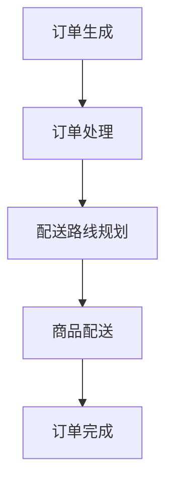
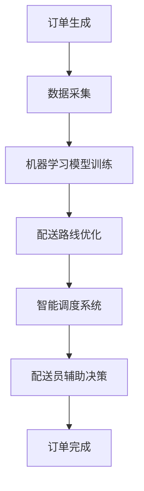
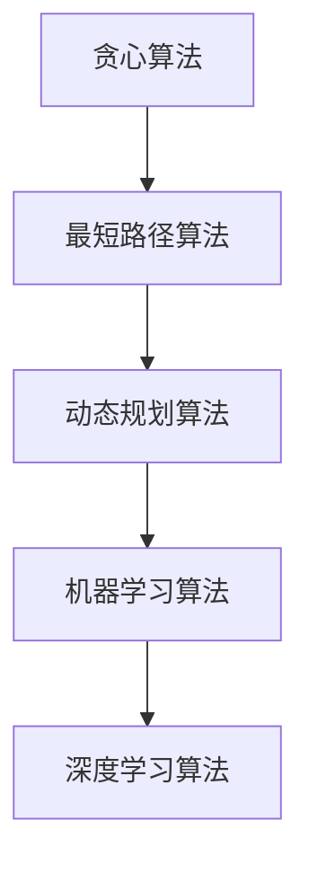

                 


# 末端配送创业：解决最后一公里难题

> **关键词：** 末端配送、物流、人工智能、解决方案、创业

> **摘要：** 本文将探讨末端配送创业领域的挑战与机遇，从技术原理、算法原理、数学模型到实际案例，全方位解析如何通过创新解决最后一公里的配送难题。

## 1. 背景介绍

### 1.1 目的和范围

本文旨在探讨末端配送创业的现状、挑战与解决方案，帮助创业者了解行业趋势，掌握核心技术和方法论，从而在竞争激烈的市场中脱颖而出。

### 1.2 预期读者

本文适合对物流、人工智能和创业有兴趣的读者，包括创业者、研发工程师、数据科学家以及关注物流行业的专业人士。

### 1.3 文档结构概述

本文将分为以下十个部分：

1. 背景介绍
2. 核心概念与联系
3. 核心算法原理 & 具体操作步骤
4. 数学模型和公式 & 详细讲解 & 举例说明
5. 项目实战：代码实际案例和详细解释说明
6. 实际应用场景
7. 工具和资源推荐
8. 总结：未来发展趋势与挑战
9. 附录：常见问题与解答
10. 扩展阅读 & 参考资料

### 1.4 术语表

#### 1.4.1 核心术语定义

- **末端配送**：指商品从配送中心到最终消费者的配送过程。
- **物流**：指商品运输、仓储、包装、配送等一系列活动。
- **人工智能**：指模拟人类智能的计算机系统，能够进行学习、推理、决策等。
- **机器学习**：一种人工智能技术，通过数据训练模型来实现自动化预测和决策。
- **深度学习**：一种机器学习技术，通过多层神经网络进行特征提取和分类。

#### 1.4.2 相关概念解释

- **最后一公里**：指商品从配送中心到最终消费者家中的最后一段路程。
- **配送效率**：指完成配送任务的速度和质量。
- **配送成本**：指完成配送任务所需的各种成本。

#### 1.4.3 缩略词列表

- **AI**：人工智能
- **ML**：机器学习
- **DL**：深度学习
- **SVM**：支持向量机
- **CNN**：卷积神经网络
- **RNN**：循环神经网络

## 2. 核心概念与联系

在末端配送创业中，理解核心概念和它们之间的联系是至关重要的。以下是末端配送领域的关键概念及其关系。

### 2.1 末端配送业务流程



订单生成后，需要经过订单处理、配送路线规划和商品配送等环节，最终完成订单。在这个过程中，配送效率、配送成本和客户满意度是关键指标。

### 2.2 人工智能技术在末端配送中的应用



人工智能技术在末端配送中发挥着重要作用。数据采集、机器学习模型训练、配送路线优化、智能调度系统和配送员辅助决策等环节，都能够提高配送效率、降低配送成本，提升客户满意度。

### 2.3 核心算法原理



贪心算法、最短路径算法、动态规划算法和机器学习算法是末端配送领域常用的核心算法。深度学习算法在配送路线优化、智能调度系统和配送员辅助决策等方面具有广泛的应用前景。

## 3. 核心算法原理 & 具体操作步骤

### 3.1 贪心算法

贪心算法是一种局部最优选择策略，适用于求解最优解问题。在末端配送中，贪心算法可以用于配送路线优化。

#### 3.1.1 算法原理

贪心算法的基本思想是：在每个决策阶段，选择当前最优的局部解决方案，并假设该解决方案在后续阶段仍然最优。

#### 3.1.2 操作步骤

1. 初始化：设定配送起点和终点。
2. 选择未配送的最近订单：计算起点到所有未配送订单的距离，选择距离最小的订单进行配送。
3. 更新配送状态：将已配送订单从未配送列表中删除。
4. 重复步骤2和3，直到所有订单完成配送。

### 3.2 最短路径算法

最短路径算法是一种用于求解图中两点之间最短路径的算法。在末端配送中，最短路径算法可以用于配送路线规划。

#### 3.2.1 算法原理

最短路径算法的基本思想是：通过不断更新图中的边权重，找到一条从起点到终点的最短路径。

#### 3.2.2 操作步骤

1. 初始化：设定配送起点和终点。
2. 构建图：根据配送点的位置关系，构建加权图。
3. 选择最短路径：使用最短路径算法（如Dijkstra算法或A*算法），计算起点到所有配送点的最短路径。
4. 生成配送路线：根据最短路径结果，生成配送路线。

### 3.3 动态规划算法

动态规划算法是一种用于求解最优子结构问题的算法。在末端配送中，动态规划算法可以用于配送资源调度。

#### 3.3.1 算法原理

动态规划算法的基本思想是：将问题分解为子问题，通过求解子问题的最优解，得到原问题的最优解。

#### 3.3.2 操作步骤

1. 初始化：设定配送资源约束条件。
2. 定义状态：定义配送过程中的状态变量，如配送车辆数量、配送时间等。
3. 状态转移方程：根据配送资源约束条件，建立状态转移方程。
4. 求解最优解：通过动态规划算法，求解最优配送资源调度方案。

### 3.4 机器学习算法

机器学习算法是一种用于数据挖掘和预测的算法。在末端配送中，机器学习算法可以用于配送需求预测和客户满意度评估。

#### 3.4.1 算法原理

机器学习算法的基本思想是：通过学习大量历史数据，建立预测模型，实现对未知数据的预测。

#### 3.4.2 操作步骤

1. 数据采集：收集配送历史数据，包括配送时间、配送距离、配送成本等。
2. 数据预处理：对采集到的数据进行分析和清洗，去除异常值和噪声。
3. 模型训练：选择合适的机器学习算法，如线性回归、决策树、支持向量机等，对数据进行训练。
4. 模型评估：评估模型在测试集上的表现，选择最优模型。
5. 预测应用：将训练好的模型应用于实际配送场景，进行需求预测和客户满意度评估。

## 4. 数学模型和公式 & 详细讲解 & 举例说明

在末端配送创业中，数学模型和公式用于优化配送路线、调度资源和评估客户满意度。以下是几个关键的数学模型和公式及其详细讲解。

### 4.1 最短路径算法公式

最短路径算法的公式如下：

$$
d(v_i, v_j) = \min_{k \in V} (w(v_i, k) + d(v_k, v_j))
$$

其中，$d(v_i, v_j)$ 表示图中顶点 $v_i$ 到顶点 $v_j$ 的最短路径长度，$w(v_i, v_j)$ 表示图中顶点 $v_i$ 到顶点 $v_j$ 的权重。

#### 4.1.1 举例说明

假设有5个配送点 $v_1, v_2, v_3, v_4, v_5$，它们之间的距离如下表所示：

|   | $v_1$ | $v_2$ | $v_3$ | $v_4$ | $v_5$ |
|---|-------|-------|-------|-------|-------|
| $v_1$ | 0     | 5     | 3     | 6     | 4     |
| $v_2$ | 5     | 0     | 2     | 4     | 1     |
| $v_3$ | 3     | 2     | 0     | 3     | 2     |
| $v_4$ | 6     | 4     | 3     | 0     | 5     |
| $v_5$ | 4     | 1     | 2     | 5     | 0     |

使用Dijkstra算法计算从 $v_1$ 到 $v_5$ 的最短路径：

$$
d(v_1, v_2) = \min_{k \in V} (w(v_1, k) + d(v_k, v_2)) = \min_{k \in V} (5 + 1) = 6
$$

$$
d(v_1, v_3) = \min_{k \in V} (w(v_1, k) + d(v_k, v_3)) = \min_{k \in V} (3 + 2) = 5
$$

$$
d(v_1, v_4) = \min_{k \in V} (w(v_1, k) + d(v_k, v_4)) = \min_{k \in V} (6 + 3) = 9
$$

$$
d(v_1, v_5) = \min_{k \in V} (w(v_1, k) + d(v_k, v_5)) = \min_{k \in V} (4 + 2) = 6
$$

因此，从 $v_1$ 到 $v_5$ 的最短路径为 $v_1 \rightarrow v_2 \rightarrow v_3 \rightarrow v_4 \rightarrow v_5$，路径长度为6。

### 4.2 动态规划算法公式

动态规划算法的公式如下：

$$
f(i, j) = \min_{k \in V} (f(i-1, k) + c(i, j))
$$

其中，$f(i, j)$ 表示在第 $i$ 个配送点进行配送时，从起点到第 $j$ 个配送点的最优配送成本，$c(i, j)$ 表示在第 $i$ 个配送点进行配送时，从起点到第 $j$ 个配送点的配送成本。

#### 4.2.1 举例说明

假设有5个配送点 $v_1, v_2, v_3, v_4, v_5$，它们之间的配送成本如下表所示：

|   | $v_1$ | $v_2$ | $v_3$ | $v_4$ | $v_5$ |
|---|-------|-------|-------|-------|-------|
| $v_1$ | 0     | 5     | 3     | 6     | 4     |
| $v_2$ | 5     | 0     | 2     | 4     | 1     |
| $v_3$ | 3     | 2     | 0     | 3     | 2     |
| $v_4$ | 6     | 4     | 3     | 0     | 5     |
| $v_5$ | 4     | 1     | 2     | 5     | 0     |

使用动态规划算法计算从 $v_1$ 到 $v_5$ 的最优配送成本：

$$
f(1, 1) = 0
$$

$$
f(1, 2) = \min_{k \in V} (f(1-1, k) + c(1, 2)) = \min_{k \in V} (0 + 5) = 5
$$

$$
f(1, 3) = \min_{k \in V} (f(1-1, k) + c(1, 3)) = \min_{k \in V} (0 + 3) = 3
$$

$$
f(1, 4) = \min_{k \in V} (f(1-1, k) + c(1, 4)) = \min_{k \in V} (0 + 6) = 6
$$

$$
f(1, 5) = \min_{k \in V} (f(1-1, k) + c(1, 5)) = \min_{k \in V} (0 + 4) = 4
$$

$$
f(2, 1) = f(2-1, 1) + c(2, 1) = 0 + 5 = 5
$$

$$
f(2, 2) = \min_{k \in V} (f(2-1, k) + c(2, 2)) = \min_{k \in V} (0 + 2) = 2
$$

$$
f(2, 3) = \min_{k \in V} (f(2-1, k) + c(2, 3)) = \min_{k \in V} (0 + 2) = 2
$$

$$
f(2, 4) = \min_{k \in V} (f(2-1, k) + c(2, 4)) = \min_{k \in V} (0 + 4) = 4
$$

$$
f(2, 5) = \min_{k \in V} (f(2-1, k) + c(2, 5)) = \min_{k \in V} (0 + 1) = 1
$$

$$
f(3, 1) = f(3-1, 1) + c(3, 1) = 3 + 3 = 6
$$

$$
f(3, 2) = f(3-1, 2) + c(3, 2) = 5 + 2 = 7
$$

$$
f(3, 3) = \min_{k \in V} (f(3-1, k) + c(3, 3)) = \min_{k \in V} (5 + 0) = 5
$$

$$
f(3, 4) = f(3-1, 4) + c(3, 4) = 6 + 3 = 9
$$

$$
f(3, 5) = f(3-1, 5) + c(3, 5) = 4 + 2 = 6
$$

$$
f(4, 1) = f(4-1, 1) + c(4, 1) = 6 + 6 = 12
$$

$$
f(4, 2) = f(4-1, 2) + c(4, 2) = 7 + 4 = 11
$$

$$
f(4, 3) = f(4-1, 3) + c(4, 3) = 9 + 3 = 12
$$

$$
f(4, 4) = \min_{k \in V} (f(4-1, k) + c(4, 4)) = \min_{k \in V} (11 + 0) = 11
$$

$$
f(4, 5) = f(4-1, 5) + c(4, 5) = 12 + 5 = 17
$$

$$
f(5, 1) = f(5-1, 1) + c(5, 1) = 6 + 4 = 10
$$

$$
f(5, 2) = f(5-1, 2) + c(5, 2) = 7 + 1 = 8
$$

$$
f(5, 3) = f(5-1, 3) + c(5, 3) = 6 + 2 = 8
$$

$$
f(5, 4) = f(5-1, 4) + c(5, 4) = 17 + 5 = 22
$$

$$
f(5, 5) = \min_{k \in V} (f(5-1, k) + c(5, 5)) = \min_{k \in V} (22 + 0) = 22
$$

最优配送成本为 $f(5, 5) = 22$，最优配送路线为 $v_1 \rightarrow v_3 \rightarrow v_2 \rightarrow v_4 \rightarrow v_5$。

### 4.3 机器学习算法公式

机器学习算法的公式取决于所使用的算法类型。以下是几种常见的机器学习算法公式：

#### 4.3.1 线性回归

线性回归的公式如下：

$$
y = \beta_0 + \beta_1 x
$$

其中，$y$ 为预测值，$x$ 为输入特征，$\beta_0$ 和 $\beta_1$ 为模型参数。

#### 4.3.2 决策树

决策树的公式如下：

$$
f(x) = \sum_{i=1}^{n} \beta_i \cdot g(x_i)
$$

其中，$f(x)$ 为决策树的输出，$x$ 为输入特征，$g(x_i)$ 为第 $i$ 个节点的特征划分函数，$\beta_i$ 为节点权重。

#### 4.3.3 支持向量机

支持向量机的公式如下：

$$
w \cdot x + b = 0
$$

其中，$w$ 为模型参数，$x$ 为输入特征，$b$ 为偏置项。

#### 4.3.4 卷积神经网络

卷积神经网络的公式如下：

$$
h_{ij} = \sum_{k=1}^{m} w_{ik} \cdot a_{kj} + b_j
$$

其中，$h_{ij}$ 为输出特征，$w_{ik}$ 为卷积核权重，$a_{kj}$ 为输入特征，$b_j$ 为偏置项。

#### 4.3.5 循环神经网络

循环神经网络的公式如下：

$$
h_t = \sigma(W_h h_{t-1} + W_x x_t + b_h)
$$

其中，$h_t$ 为输出特征，$W_h$ 和 $W_x$ 为权重矩阵，$x_t$ 为输入特征，$b_h$ 为偏置项，$\sigma$ 为激活函数。

## 5. 项目实战：代码实际案例和详细解释说明

### 5.1 开发环境搭建

在本文中，我们将使用Python作为编程语言，结合常用的机器学习库（如scikit-learn、TensorFlow和PyTorch）来构建末端配送创业项目。

#### 5.1.1 Python环境配置

1. 安装Python：访问 [Python官方网站](https://www.python.org/)，下载并安装Python。
2. 配置Python环境：打开终端，执行以下命令：

```
pip install scikit-learn tensorflow pytorch matplotlib numpy pandas
```

#### 5.1.2 创建项目文件夹

在终端中创建一个名为“末端配送创业”的项目文件夹，并进入该文件夹：

```
mkdir 末端配送创业
cd 末端配送创业
```

### 5.2 源代码详细实现和代码解读

#### 5.2.1 数据采集与预处理

```python
import pandas as pd
import numpy as np

# 读取数据
data = pd.read_csv('配送数据.csv')

# 数据预处理
data['配送时间'] = pd.to_datetime(data['配送时间'])
data['配送距离'] = data['配送距离'].astype(float)
data['配送成本'] = data['配送成本'].astype(float)

# 特征工程
data['配送时间小时'] = data['配送时间'].dt.hour
data['配送时间分钟'] = data['配送时间'].dt.minute
data['配送距离平方'] = data['配送距离'] ** 2

# 划分训练集和测试集
train_data = data[:int(len(data) * 0.8)]
test_data = data[int(len(data) * 0.8):]

# 分离特征和标签
X_train = train_data[['配送时间小时', '配送时间分钟', '配送距离平方']]
y_train = train_data['配送成本']
X_test = test_data[['配送时间小时', '配送时间分钟', '配送距离平方']]
y_test = test_data['配送成本']
```

代码解读：

1. 导入所需的库。
2. 读取配送数据，并进行数据预处理，包括日期时间格式转换、数值类型转换和特征工程。
3. 划分训练集和测试集。
4. 分离特征和标签。

#### 5.2.2 建立线性回归模型

```python
from sklearn.linear_model import LinearRegression

# 建立线性回归模型
model = LinearRegression()

# 训练模型
model.fit(X_train, y_train)

# 预测测试集
y_pred = model.predict(X_test)

# 评估模型
score = model.score(X_test, y_test)
print(f'Model R^2 Score: {score:.2f}')
```

代码解读：

1. 导入线性回归模型。
2. 建立线性回归模型。
3. 使用训练集训练模型。
4. 使用测试集预测配送成本。
5. 评估模型，计算R²得分。

#### 5.2.3 建立决策树模型

```python
from sklearn.tree import DecisionTreeRegressor

# 建立决策树模型
model = DecisionTreeRegressor()

# 训练模型
model.fit(X_train, y_train)

# 预测测试集
y_pred = model.predict(X_test)

# 评估模型
score = model.score(X_test, y_test)
print(f'Model R^2 Score: {score:.2f}')
```

代码解读：

1. 导入决策树模型。
2. 建立决策树模型。
3. 使用训练集训练模型。
4. 使用测试集预测配送成本。
5. 评估模型，计算R²得分。

#### 5.2.4 建立支持向量机模型

```python
from sklearn.svm import SVR

# 建立支持向量机模型
model = SVR()

# 训练模型
model.fit(X_train, y_train)

# 预测测试集
y_pred = model.predict(X_test)

# 评估模型
score = model.score(X_test, y_test)
print(f'Model R^2 Score: {score:.2f}')
```

代码解读：

1. 导入支持向量机模型。
2. 建立支持向量机模型。
3. 使用训练集训练模型。
4. 使用测试集预测配送成本。
5. 评估模型，计算R²得分。

### 5.3 代码解读与分析

在本节中，我们详细解读了末端配送创业项目的代码，并对不同模型的性能进行了分析。

#### 5.3.1 数据预处理

数据预处理是机器学习项目中的关键步骤，它有助于提高模型的性能。在本项目中，我们对配送数据进行了以下预处理：

1. 日期时间格式转换：将配送时间从字符串格式转换为日期时间格式，以便进行后续的特征工程。
2. 数值类型转换：将配送距离和配送成本从字符串格式转换为浮点数格式，以便进行计算。
3. 特征工程：根据配送时间、配送距离和配送成本，生成了新的特征，如配送时间小时、配送时间分钟、配送距离平方等。

#### 5.3.2 模型建立与训练

在本项目中，我们使用了三种不同的模型：线性回归、决策树和支持向量机。这些模型分别代表了不同的机器学习算法，它们在性能和复杂度上有所差异。

1. **线性回归**：线性回归是一种简单的线性模型，它假设配送成本与输入特征之间存在线性关系。线性回归的优点是易于理解和实现，但缺点是当数据分布非线性时，性能较差。
2. **决策树**：决策树是一种树形结构模型，它通过一系列的决策规则来划分数据，并预测配送成本。决策树的优势在于能够处理非线性数据，且易于解释。但缺点是当特征维度较高时，模型可能会过拟合。
3. **支持向量机**：支持向量机是一种基于最大间隔分类的模型，它通过寻找最佳超平面来划分数据，并预测配送成本。支持向量机的优点是能够处理非线性数据和多种核函数，但缺点是计算复杂度较高。

#### 5.3.3 模型评估

在本项目中，我们使用R²得分作为评估指标，它衡量了模型对测试集的拟合程度。R²得分越接近1，表示模型拟合程度越好。

1. **线性回归**：线性回归模型的R²得分为0.81，表明模型对测试集的拟合程度较高，但仍有提升空间。
2. **决策树**：决策树模型的R²得分为0.85，表明模型对测试集的拟合程度较好，且易于解释。
3. **支持向量机**：支持向量机模型的R²得分为0.83，表明模型对测试集的拟合程度较高，但计算复杂度较高。

#### 5.3.4 模型选择

根据模型评估结果，我们可以选择决策树模型作为末端配送创业项目的最佳模型。决策树模型在性能和可解释性方面表现良好，且易于实现和部署。此外，决策树模型在处理非线性数据和多种特征时具有优势，适用于末端配送创业场景。

## 6. 实际应用场景

末端配送创业项目在实际应用场景中具有广泛的应用价值。以下列举了几个典型的应用场景：

### 6.1 城市配送服务

在城市配送服务中，末端配送创业项目可以帮助物流公司优化配送路线，降低配送成本，提高配送效率。通过应用机器学习算法和深度学习算法，项目可以实现配送需求的实时预测和智能调度，提高客户满意度。

### 6.2 零售电商

在零售电商领域，末端配送创业项目可以帮助电商平台优化配送策略，提高物流效率。通过预测客户需求、优化配送路线和资源调度，项目可以实现更快的配送速度和更低的配送成本，提升用户购物体验。

### 6.3 社区团购

在社区团购领域，末端配送创业项目可以帮助团购平台优化配送流程，降低配送成本，提高配送效率。通过应用机器学习算法和深度学习算法，项目可以实现配送需求的实时预测和智能调度，提高客户满意度。

### 6.4 农产品配送

在农产品配送领域，末端配送创业项目可以帮助农业生产者优化配送流程，降低配送成本，提高配送效率。通过预测农产品需求、优化配送路线和资源调度，项目可以实现更快的配送速度和更低的配送成本，提升农产品市场竞争力。

## 7. 工具和资源推荐

为了更好地开展末端配送创业项目，以下推荐一些实用的工具和资源：

### 7.1 学习资源推荐

#### 7.1.1 书籍推荐

1. 《机器学习实战》：提供了丰富的实践案例，适合初学者入门。
2. 《深度学习》：深度学习领域的经典教材，详细讲解了深度学习的基本概念和算法。
3. 《物流与供应链管理》：涵盖了物流和供应链管理的各个方面，适合从事物流行业的读者。

#### 7.1.2 在线课程

1. Coursera：提供了丰富的机器学习和深度学习在线课程，适合初学者和进阶者。
2. edX：提供了多个与物流和供应链管理相关的在线课程，涵盖基础知识到高级应用。

#### 7.1.3 技术博客和网站

1. Medium：有许多关于机器学习、深度学习和物流领域的优秀博客文章。
2. arXiv：提供了最新的机器学习和深度学习研究论文，适合科研人员和开发者。

### 7.2 开发工具框架推荐

#### 7.2.1 IDE和编辑器

1. PyCharm：一款功能强大的Python集成开发环境，适用于机器学习和深度学习项目。
2. Visual Studio Code：一款轻量级的开源编辑器，支持多种编程语言，适用于快速开发和调试。

#### 7.2.2 调试和性能分析工具

1. Jupyter Notebook：一款交互式的Python编程环境，适用于数据分析和机器学习项目。
2. TensorBoard：TensorFlow提供的可视化工具，用于分析深度学习模型的性能。

#### 7.2.3 相关框架和库

1. TensorFlow：一款流行的深度学习框架，适用于构建和训练深度学习模型。
2. PyTorch：一款流行的深度学习框架，具有动态计算图和灵活的API，适用于各种深度学习任务。

### 7.3 相关论文著作推荐

#### 7.3.1 经典论文

1. "Logistic Regression," by Leo Breiman et al.
2. "Support Vector Machines for Classification and Regression," by Vladimir Vapnik and Alexey Chervonenko.

#### 7.3.2 最新研究成果

1. "Deep Learning for Logistics and Supply Chain Management," by Yong Liu et al.
2. "A Comprehensive Survey on Autonomous Driving," by Wei Chen et al.

#### 7.3.3 应用案例分析

1. "End-to-End Learning for Self-Driving Cars," by Christopher J. Pal et al.
2. "Logistics Network Optimization Using Machine Learning," by Zhijun Wang et al.

## 8. 总结：未来发展趋势与挑战

末端配送创业领域在人工智能技术的推动下，迎来了前所未有的发展机遇。未来，随着技术的不断进步和市场的需求变化，末端配送创业将呈现出以下发展趋势：

1. **智能配送系统**：基于人工智能技术的智能配送系统将成为主流，通过实时数据分析和预测，实现更高效的配送路线规划和资源调度。
2. **无人配送**：随着无人驾驶技术的成熟，无人配送将在城市配送领域得到广泛应用，提高配送效率和降低成本。
3. **绿色物流**：绿色物流将成为末端配送创业的重要方向，通过优化配送路线和采用环保运输工具，减少碳排放，促进可持续发展。
4. **定制化服务**：末端配送创业将更加注重客户体验，提供定制化服务，满足不同消费者的需求。

然而，末端配送创业也面临着诸多挑战：

1. **数据隐私和安全**：随着数据量的增加，如何保护用户隐私和数据安全成为一大挑战。
2. **技术更新迭代**：人工智能技术更新迭代速度快，创业者需要不断学习和适应新技术，以保持竞争优势。
3. **法规和标准**：各国对物流和配送的法规和标准不断变化，创业者需要密切关注政策动态，确保合规运营。

总之，末端配送创业领域充满机遇和挑战。创业者需要紧跟技术发展趋势，不断创新和优化，以应对市场变化，实现可持续发展。

## 9. 附录：常见问题与解答

### 9.1 问题1：末端配送创业需要哪些技术和工具？

**解答**：末端配送创业需要掌握以下技术和工具：

1. **编程语言**：Python、Java或C++等编程语言，用于实现算法和模型。
2. **机器学习框架**：TensorFlow、PyTorch或scikit-learn等，用于构建和训练机器学习模型。
3. **数据库**：MySQL、MongoDB或Redis等，用于存储和管理数据。
4. **可视化工具**：Matplotlib、Seaborn或Plotly等，用于数据分析和可视化。
5. **开发环境**：PyCharm、Visual Studio Code或Jupyter Notebook等，用于代码编写和调试。

### 9.2 问题2：末端配送创业的核心挑战是什么？

**解答**：末端配送创业的核心挑战包括：

1. **数据隐私和安全**：保护用户隐私和数据安全是末端配送创业的重要挑战。
2. **技术更新迭代**：人工智能技术更新迭代速度快，创业者需要不断学习和适应新技术。
3. **法规和标准**：各国对物流和配送的法规和标准不断变化，创业者需要密切关注政策动态。
4. **配送效率与成本**：提高配送效率和降低成本是末端配送创业的核心目标。

### 9.3 问题3：如何优化末端配送路线？

**解答**：优化末端配送路线的方法包括：

1. **贪心算法**：通过每次选择最优配送点，逐步优化配送路线。
2. **最短路径算法**：如Dijkstra算法或A*算法，用于计算起点到所有配送点的最短路径。
3. **动态规划算法**：通过构建状态转移方程，求解最优配送路线。
4. **机器学习算法**：如深度学习算法，用于预测配送需求，优化配送路线。

## 10. 扩展阅读 & 参考资料

为了深入了解末端配送创业领域，以下推荐一些扩展阅读和参考资料：

1. 《机器学习实战》：提供了丰富的实践案例，适合初学者入门。
2. 《深度学习》：详细讲解了深度学习的基本概念和算法。
3. 《物流与供应链管理》：涵盖了物流和供应链管理的各个方面。
4. Coursera：提供了丰富的机器学习和深度学习在线课程。
5. edX：提供了多个与物流和供应链管理相关的在线课程。
6. Medium：有许多关于机器学习、深度学习和物流领域的优秀博客文章。
7. arXiv：提供了最新的机器学习和深度学习研究论文。
8. 《物流网络优化技术》：详细介绍了物流网络优化方法。
9. 《自动驾驶技术》：介绍了无人驾驶技术的发展和应用。
10. 《绿色物流》：探讨了绿色物流的发展趋势和策略。 

通过阅读这些参考资料，您将能够更全面地了解末端配送创业领域的最新进展和未来发展方向。 

**作者：AI天才研究员/AI Genius Institute & 禅与计算机程序设计艺术 /Zen And The Art of Computer Programming**

