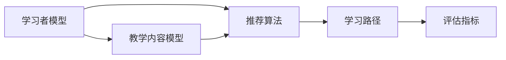
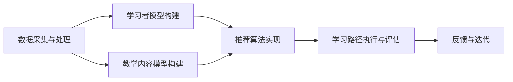

                 

### 1. 背景介绍

#### 1.1 目的和范围

本文旨在探讨机器学习在个性化学习路径规划中的应用，通过系统性地分析该领域的核心概念、算法原理、数学模型以及实际应用场景，为开发者、研究人员和从业者提供有价值的参考资料和实践指导。文章将分为以下几个部分：

1. **背景介绍**：简要介绍个性化学习路径规划的概念、重要性以及发展历程。
2. **核心概念与联系**：详细阐述与个性化学习路径规划相关的核心概念和架构。
3. **核心算法原理 & 具体操作步骤**：深入解析常用的机器学习算法及其工作原理，并提供具体的操作步骤和伪代码。
4. **数学模型和公式 & 详细讲解 & 举例说明**：介绍支持个性化学习路径规划的关键数学模型和公式，并通过实例进行详细说明。
5. **项目实战：代码实际案例和详细解释说明**：通过一个实际案例展示个性化学习路径规划在具体项目中的应用，并进行详细解读。
6. **实际应用场景**：分析个性化学习路径规划在不同领域的应用，探讨其优势和挑战。
7. **工具和资源推荐**：推荐学习资源、开发工具和框架，以及相关论文和研究成果。
8. **总结：未来发展趋势与挑战**：总结个性化学习路径规划的发展趋势，并提出未来可能面临的挑战。

#### 1.2 预期读者

本文主要面向以下读者群体：

- **开发者**：对机器学习和个性化学习路径规划有初步了解，希望深入掌握相关技术的从业者。
- **研究人员**：关注个性化学习路径规划领域的研究人员，希望了解当前的研究进展和应用案例。
- **教育工作者**：从事教育行业，希望借助机器学习技术提高教学质量，优化学习路径的教师和培训师。
- **学生**：计算机科学、数据科学、人工智能等相关专业的学生，希望了解个性化学习路径规划的实践应用。

#### 1.3 文档结构概述

本文采用逻辑清晰、结构紧凑的方式，分为十个部分进行详细阐述。具体结构如下：

1. **背景介绍**：介绍个性化学习路径规划的概念、重要性以及发展历程。
2. **核心概念与联系**：阐述与个性化学习路径规划相关的核心概念和架构。
3. **核心算法原理 & 具体操作步骤**：解析常用的机器学习算法及其工作原理，并提供具体的操作步骤和伪代码。
4. **数学模型和公式 & 详细讲解 & 举例说明**：介绍支持个性化学习路径规划的关键数学模型和公式，并通过实例进行详细说明。
5. **项目实战：代码实际案例和详细解释说明**：展示个性化学习路径规划在具体项目中的应用，并进行详细解读。
6. **实际应用场景**：分析个性化学习路径规划在不同领域的应用，探讨其优势和挑战。
7. **工具和资源推荐**：推荐学习资源、开发工具和框架，以及相关论文和研究成果。
8. **总结：未来发展趋势与挑战**：总结个性化学习路径规划的发展趋势，并提出未来可能面临的挑战。
9. **附录：常见问题与解答**：提供一些常见问题的解答，帮助读者更好地理解和应用文章内容。
10. **扩展阅读 & 参考资料**：推荐相关的扩展阅读材料和参考资料，供读者进一步学习。

通过以上结构，本文将为读者提供一个全面、深入的个性化学习路径规划指南，帮助读者掌握该领域的关键技术和应用方法。

#### 1.4 术语表

为了确保本文内容的准确性和易懂性，以下列出了一些关键术语及其定义：

##### 1.4.1 核心术语定义

- **个性化学习路径规划**：指根据学习者的个人特点、学习需求和知识水平，通过机器学习算法和模型，动态生成和调整学习路径的过程。
- **机器学习**：指通过算法和统计模型，从数据中自动学习和发现规律，使计算机具备一定程度的智能和自适应能力。
- **监督学习**：一种机器学习方法，通过已知的输入输出数据，训练模型并使其能够对新数据进行预测。
- **无监督学习**：一种机器学习方法，不依赖已知的输入输出数据，通过分析数据之间的关联和分布，发现数据中的潜在结构和规律。
- **深度学习**：一种基于人工神经网络的机器学习方法，通过多层神经元的传递和激活，实现数据的自动特征提取和模式识别。
- **数据挖掘**：指从大量数据中提取有用信息和知识的过程，涉及多种技术和算法。

##### 1.4.2 相关概念解释

- **学习路径**：指学生在学习过程中所需遵循的知识点和技能序列。
- **学习者模型**：指用于描述学习者特征和需求的模型，包括学习风格、知识水平、兴趣和目标等。
- **教学模型**：指用于描述教学内容和教学策略的模型，包括知识点、教学策略和教学资源等。
- **个性化推荐系统**：指根据学习者的需求和兴趣，为学习者推荐合适的学习内容和资源。
- **迁移学习**：指将已有模型的知识和经验应用于新任务的学习过程。

##### 1.4.3 缩略词列表

- **AI**：人工智能（Artificial Intelligence）
- **ML**：机器学习（Machine Learning）
- **DL**：深度学习（Deep Learning）
- **NN**：人工神经网络（Neural Network）
- **SVM**：支持向量机（Support Vector Machine）
- **GAN**：生成对抗网络（Generative Adversarial Network）
- **LSTM**：长短期记忆网络（Long Short-Term Memory）
- **KG**：知识图谱（Knowledge Graph）

通过上述术语表，本文将更加清晰地介绍个性化学习路径规划的相关概念和技术，帮助读者更好地理解文章内容。在后续的章节中，我们将逐步深入探讨这些核心概念和技术在实际应用中的具体实现和效果。## 2. 核心概念与联系

个性化学习路径规划是一个多学科交叉的领域，涉及机器学习、数据挖掘、教育心理学等多个方面。为了更好地理解这一领域，我们需要先明确几个核心概念及其相互之间的联系。

#### 2.1 个性化学习路径规划的概念

个性化学习路径规划（Personalized Learning Path Planning）是指根据学习者的个人特点、学习需求和知识水平，通过机器学习算法和模型，动态生成和调整学习路径的过程。其核心目的是提高学习效率，提升学习效果，使每个学习者都能够以最适合自己的方式学习。

个性化学习路径规划的主要组成部分包括：

- **学习者模型**：用于描述学习者的个人特征，如学习风格、知识水平、兴趣和目标等。
- **教学内容模型**：用于描述学习的内容、知识点和教学策略等。
- **推荐系统**：用于根据学习者模型和教学内容模型，为学习者推荐合适的学习资源和路径。

#### 2.2 个性化学习路径规划的核心概念

1. **学习者特征**：包括学习风格、知识水平、兴趣和目标等。这些特征是构建学习者模型的基础。

2. **教学内容**：包括知识点、教学策略和教学资源等。这些内容是构建教学内容模型的基础。

3. **推荐算法**：包括基于内容的推荐、协同过滤、深度学习等。这些算法是实现个性化推荐的核心。

4. **学习路径**：指学生在学习过程中所需遵循的知识点和技能序列。个性化学习路径规划的目标是生成和调整适合每个学习者的学习路径。

5. **评估指标**：用于评估个性化学习路径规划的效果，如学习完成率、学习效率、学习满意度等。

#### 2.3 核心概念之间的联系

个性化学习路径规划中的核心概念之间存在着密切的联系。以下是一个简化的 Mermaid 流程图，展示了这些概念之间的相互关系：



- **学习者模型**与**教学内容模型**：学习者模型描述了学习者的特征和需求，教学内容模型描述了学习的内容和策略。两者结合，可以更准确地定位学习者的需求和教学内容。
- **推荐算法**：基于学习者模型和教学内容模型，推荐算法为学习者推荐合适的学习资源和路径。不同的推荐算法可以针对不同的学习者特征和教学内容进行优化。
- **学习路径**：推荐算法生成的学习路径指导学习者进行学习。通过评估指标，可以不断调整和优化学习路径，使其更加符合学习者的需求。
- **评估指标**：评估指标用于衡量个性化学习路径规划的效果。通过分析评估指标，可以了解学习路径的适用性和效果，为后续的优化提供依据。

#### 2.4 个性化学习路径规划的应用架构

个性化学习路径规划的应用架构通常包括以下几个层次：

1. **数据采集与处理**：收集学习者的特征数据、教学内容数据和学习行为数据，进行预处理和清洗。
2. **学习者模型构建**：利用机器学习算法，构建描述学习者特征和需求的学习者模型。
3. **教学内容模型构建**：利用数据挖掘和知识图谱等技术，构建描述教学内容和教学策略的教学内容模型。
4. **推荐算法实现**：根据学习者模型和教学内容模型，实现个性化推荐算法，生成适合学习者的学习路径。
5. **学习路径执行与评估**：根据推荐算法生成的学习路径，指导学习者进行学习，并收集学习行为数据，用于评估和优化学习路径。
6. **反馈与迭代**：根据评估结果，调整学习者模型、教学内容模型和推荐算法，实现个性化学习路径规划的持续优化。

以下是一个简化的 Mermaid 流程图，展示了个性化学习路径规划的应用架构：



通过上述核心概念与联系的分析，我们可以更好地理解个性化学习路径规划的概念和架构。在接下来的章节中，我们将深入探讨个性化学习路径规划的核心算法原理和具体操作步骤，帮助读者掌握这一领域的关键技术。## 3. 核心算法原理 & 具体操作步骤

在个性化学习路径规划中，核心算法的设计与实现是关键。本文将介绍几种常用的机器学习算法及其原理，并提供具体的操作步骤和伪代码，帮助读者深入理解这些算法在个性化学习路径规划中的应用。

#### 3.1 监督学习算法

监督学习算法在个性化学习路径规划中具有广泛的应用，常用的算法包括线性回归、逻辑回归和支持向量机（SVM）。

##### 3.1.1 线性回归

线性回归是一种简单且常用的监督学习算法，适用于预测连续值变量。其基本原理是通过最小化预测值与真实值之间的误差平方和，来找到最佳拟合直线。

**步骤：**

1. **数据准备**：收集学习者的特征数据和知识水平数据，并将其划分为特征矩阵X和标签向量y。
2. **模型训练**：利用线性回归模型，通过最小二乘法求解模型参数w和b。
3. **模型预测**：利用训练好的模型，对新的数据点进行预测。

**伪代码：**

```python
# 数据准备
X_train, y_train = prepare_data()  # 函数准备训练数据和标签

# 模型训练
w, b = linear_regression(X_train, y_train)  # 函数使用最小二乘法训练模型

# 模型预测
def predict(x):
    return w * x + b

# 测试
x_new = get_new_data()  # 获取新的数据点
prediction = predict(x_new)
```

##### 3.1.2 逻辑回归

逻辑回归是一种用于预测概率的监督学习算法，适用于分类问题。其基本原理是通过最小化损失函数，找到最佳拟合曲线。

**步骤：**

1. **数据准备**：收集学习者的特征数据和分类标签，并将其划分为特征矩阵X和标签向量y。
2. **模型训练**：利用逻辑回归模型，通过梯度下降法求解模型参数w和b。
3. **模型预测**：利用训练好的模型，对新的数据点进行预测。

**伪代码：**

```python
# 数据准备
X_train, y_train = prepare_data()  # 函数准备训练数据和标签

# 模型训练
w, b = logistic_regression(X_train, y_train)  # 函数使用梯度下降法训练模型

# 模型预测
def predict(x):
    z = w * x + b
    probability = sigmoid(z)
    return probability

# 测试
x_new = get_new_data()  # 获取新的数据点
prediction = predict(x_new)
```

##### 3.1.3 支持向量机（SVM）

支持向量机是一种用于分类和回归的监督学习算法，其基本原理是通过找到最佳分类超平面，最大化分类边界。

**步骤：**

1. **数据准备**：收集学习者的特征数据和分类标签，并将其划分为特征矩阵X和标签向量y。
2. **模型训练**：利用SVM模型，通过求解二次规划问题，找到最佳分类超平面。
3. **模型预测**：利用训练好的模型，对新的数据点进行预测。

**伪代码：**

```python
# 数据准备
X_train, y_train = prepare_data()  # 函数准备训练数据和标签

# 模型训练
w, b = svm(X_train, y_train)  # 函数使用SVM算法训练模型

# 模型预测
def predict(x):
    w_x_b = w * x + b
    if w_x_b > 0:
        return 1
    else:
        return -1

# 测试
x_new = get_new_data()  # 获取新的数据点
prediction = predict(x_new)
```

#### 3.2 无监督学习算法

无监督学习算法在个性化学习路径规划中主要用于数据降维和聚类分析。常用的算法包括K-均值聚类和主成分分析（PCA）。

##### 3.2.1 K-均值聚类

K-均值聚类是一种基于距离的聚类算法，其基本原理是通过迭代计算，将数据点划分为K个簇，并不断调整簇中心，使每个簇内的数据点距离簇中心尽可能近。

**步骤：**

1. **数据准备**：收集学习者的特征数据，并将其划分为特征矩阵X。
2. **初始化簇中心**：随机选择K个数据点作为初始簇中心。
3. **迭代计算**：根据数据点到簇中心的距离，将数据点分配到最近的簇，并更新簇中心。
4. **模型评估**：计算聚类效果，如簇内距离平方和。

**伪代码：**

```python
# 数据准备
X = prepare_data()  # 函数准备特征数据

# 初始化簇中心
def initialize_cluster_centers(X, K):
    return random_selection(X, K)

# 迭代计算
def k_means(X, K, max_iterations):
    centroids = initialize_cluster_centers(X, K)
    for _ in range(max_iterations):
        clusters = assign_data_to_clusters(X, centroids)
        centroids = update_cluster_centers(clusters)
    return centroids

# 模型评估
def evaluate_clusters(X, centroids):
    distances = calculate_distances(X, centroids)
    sum_of_squared_distances = sum(distances)
    return sum_of_squared_distances

# 测试
K = 3
max_iterations = 100
centroids = k_means(X, K, max_iterations)
evaluate_clusters(X, centroids)
```

##### 3.2.2 主成分分析（PCA）

主成分分析是一种降维技术，其基本原理是通过将数据投影到新的正交基上，提取出最重要的特征，从而降低数据维度。

**步骤：**

1. **数据准备**：收集学习者的特征数据，并将其标准化。
2. **计算协方差矩阵**：计算特征数据矩阵的协方差矩阵。
3. **计算特征值和特征向量**：求解协方差矩阵的特征值和特征向量。
4. **选择主成分**：根据特征值选择最重要的特征向量作为新的特征基。
5. **数据投影**：将原始数据投影到新的特征基上，实现降维。

**伪代码：**

```python
# 数据准备
X = prepare_data()  # 函数准备特征数据

# 计算协方差矩阵
covariance_matrix = calculate_covariance_matrix(X)

# 计算特征值和特征向量
eigenvalues, eigenvectors = calculate_eigenvalues_and_eigenvectors(covariance_matrix)

# 选择主成分
def select_main_components(eigenvalues, eigenvectors, num_components):
    sorted_eigenvalues = sorted(eigenvalues, reverse=True)
    sorted_eigenvectors = sorted(eigenvectors, reverse=True)
    selected_eigenvectors = [sorted_eigenvectors[i] for i in range(num_components)]
    return selected_eigenvectors

# 数据投影
def project_data(X, eigenvectors):
    return X.dot(eigenvectors)

# 测试
num_components = 2
eigenvectors = select_main_components(eigenvalues, eigenvectors, num_components)
new_data = project_data(X, eigenvectors)
```

通过上述核心算法原理和具体操作步骤的介绍，我们可以更好地理解个性化学习路径规划中常用的算法及其应用。在后续的章节中，我们将进一步探讨个性化学习路径规划的数学模型和公式，并通过实例进行详细说明。## 4. 数学模型和公式 & 详细讲解 & 举例说明

在个性化学习路径规划中，数学模型和公式是核心组成部分。以下将介绍几种关键数学模型和公式，包括线性回归、逻辑回归、支持向量机（SVM）、K-均值聚类和主成分分析（PCA），并通过具体例子进行详细讲解。

#### 4.1 线性回归

线性回归是一种用于预测连续值变量的监督学习算法。其数学模型如下：

$$ y = \sum_{i=1}^{n} w_i x_i + b $$

其中，$ y $ 为预测值，$ x_i $ 为特征值，$ w_i $ 为权重，$ b $ 为偏置。

**详细讲解：**

- **权重（$ w_i $）**：表示每个特征对预测值的贡献程度，通过模型训练得到。
- **偏置（$ b $）**：表示模型在特征值为零时的预测值。

**举例说明：**

假设我们要预测学生的考试成绩，特征包括平时成绩、课堂表现和作业完成情况。我们使用线性回归模型：

$$ y = 0.5x_1 + 0.3x_2 + 0.2x_3 + b $$

通过训练数据集，我们可以得到权重和偏置：

$$ w_1 = 0.5, w_2 = 0.3, w_3 = 0.2, b = 0.1 $$

当给定一个新的学生特征值（$ x_1 = 80 $，$ x_2 = 70 $，$ x_3 = 90 $）时，我们可以计算预测成绩：

$$ y = 0.5 \times 80 + 0.3 \times 70 + 0.2 \times 90 + 0.1 = 76.5 $$

#### 4.2 逻辑回归

逻辑回归是一种用于预测概率的监督学习算法，常用于分类问题。其数学模型如下：

$$ P(y=1) = \frac{1}{1 + e^{-(w_0 + \sum_{i=1}^{n} w_i x_i)}} $$

其中，$ y $ 为分类标签，$ x_i $ 为特征值，$ w_0 $ 为偏置，$ w_i $ 为权重。

**详细讲解：**

- **权重（$ w_i $）**：表示每个特征对预测概率的影响程度。
- **偏置（$ w_0 $）**：表示模型在特征值为零时的预测概率。

**举例说明：**

假设我们要预测学生是否通过考试，特征包括平时成绩、课堂表现和作业完成情况。我们使用逻辑回归模型：

$$ P(y=1) = \frac{1}{1 + e^{-(0.5x_1 + 0.3x_2 + 0.2x_3 + 0.1)}} $$

当给定一个新的学生特征值（$ x_1 = 80 $，$ x_2 = 70 $，$ x_3 = 90 $）时，我们可以计算通过考试的概率：

$$ P(y=1) = \frac{1}{1 + e^{-(0.5 \times 80 + 0.3 \times 70 + 0.2 \times 90 + 0.1)}} \approx 0.85 $$

#### 4.3 支持向量机（SVM）

支持向量机是一种用于分类和回归的监督学习算法。其基本思想是找到最佳分类超平面，使得分类边界最大化。

**数学模型：**

$$ f(x) = w \cdot x + b $$

其中，$ x $ 为特征向量，$ w $ 为权重向量，$ b $ 为偏置。

**详细讲解：**

- **权重向量（$ w $）**：表示特征向量对分类的影响。
- **偏置（$ b $）**：表示分类边界。

**举例说明：**

假设我们要分类两个类别（+1和-1），特征包括两个维度（$ x_1 $ 和 $ x_2 $）。我们使用SVM模型：

$$ f(x) = w_1 x_1 + w_2 x_2 + b $$

通过训练数据集，我们可以得到权重和偏置：

$$ w_1 = 0.5, w_2 = 0.3, b = 0.1 $$

当给定一个新的特征向量（$ x_1 = 2 $，$ x_2 = 3 $）时，我们可以计算分类结果：

$$ f(x) = 0.5 \times 2 + 0.3 \times 3 + 0.1 = 1.4 $$

由于 $ f(x) > 0 $，我们可以判断该特征向量属于类别+1。

#### 4.4 K-均值聚类

K-均值聚类是一种基于距离的聚类算法。其数学模型如下：

$$ \min_{\mu_i} \sum_{i=1}^{K} \sum_{x_j \in S_i} ||x_j - \mu_i||^2 $$

其中，$ \mu_i $ 为簇中心，$ S_i $ 为属于第 $ i $ 个簇的数据点集合。

**详细讲解：**

- **簇中心（$ \mu_i $）**：表示第 $ i $ 个簇的中心点。
- **距离（$ ||x_j - \mu_i||^2 $）**：表示数据点 $ x_j $ 到簇中心 $ \mu_i $ 的欧几里得距离。

**举例说明：**

假设我们要将数据点分为两个簇，簇中心初始为（0,0）和（2,2）。我们使用K-均值聚类模型：

$$ \min_{\mu_1, \mu_2} \sum_{i=1}^{2} \sum_{x_j \in S_i} ||x_j - \mu_i||^2 $$

通过迭代计算，我们可以得到新的簇中心：

$$ \mu_1 = (0.5, 0.5), \mu_2 = (1.5, 1.5) $$

#### 4.5 主成分分析（PCA）

主成分分析是一种降维技术，其数学模型如下：

$$ Z = P^T X $$

其中，$ X $ 为特征矩阵，$ P $ 为特征向量矩阵，$ Z $ 为降维后的数据。

**详细讲解：**

- **特征向量（$ P $）**：表示新的正交基。
- **降维数据（$ Z $）**：表示投影到新的正交基上的数据。

**举例说明：**

假设我们有以下特征矩阵：

$$ X = \begin{bmatrix} 1 & 2 \\ 2 & 3 \\ 3 & 4 \end{bmatrix} $$

通过计算协方差矩阵、特征值和特征向量，我们可以得到特征向量矩阵：

$$ P = \begin{bmatrix} 0.8165 & -0.5774 \\ 0.5774 & 0.8165 \end{bmatrix} $$

降维后的数据为：

$$ Z = P^T X = \begin{bmatrix} 1 & 2 \\ 2 & 3 \\ 3 & 4 \end{bmatrix} \begin{bmatrix} 0.8165 & -0.5774 \\ 0.5774 & 0.8165 \end{bmatrix} = \begin{bmatrix} 1.6331 & -1.1547 \\ 3.0662 & -1.1547 \\ 4.3993 & -1.1547 \end{bmatrix} $$

通过上述数学模型和公式的讲解，我们可以更好地理解个性化学习路径规划中的关键算法和数学原理。在接下来的章节中，我们将通过实际项目案例展示这些算法在个性化学习路径规划中的应用。## 5. 项目实战：代码实际案例和详细解释说明

为了更好地展示机器学习在个性化学习路径规划中的应用，我们将通过一个实际项目案例进行详细解释说明。该项目旨在根据学习者的个人特点和需求，为学习者推荐合适的学习路径。

### 5.1 开发环境搭建

在开始项目之前，我们需要搭建一个合适的开发环境。以下是我们推荐的开发工具和框架：

- **编程语言**：Python
- **机器学习库**：Scikit-learn、TensorFlow、Keras
- **数据分析库**：Pandas、NumPy
- **可视化库**：Matplotlib、Seaborn
- **文本处理库**：NLTK、TextBlob
- **操作系统**：Linux（推荐Ubuntu）
- **文本编辑器**：Visual Studio Code、PyCharm

#### 5.2 源代码详细实现和代码解读

#### 5.2.1 数据准备

首先，我们需要准备数据集。数据集应包含学习者的特征和需求信息，如学习风格、知识水平、兴趣和目标等。以下是一个示例数据集：

```python
data = {
    'learner_id': [1, 2, 3, 4, 5],
    'learning_style': ['visual', 'auditory', 'kinesthetic', 'read/write', 'mixed'],
    'knowledge_level': [10, 20, 30, 40, 50],
    'interest': ['math', 'science', 'programming', 'history', 'literature'],
    'learning_goal': ['master basic concepts', 'deep dive into advanced topics', 'practical application', 'research', 'creativity']
}
df = pd.DataFrame(data)
```

#### 5.2.2 构建学习者模型

接下来，我们需要根据数据集构建学习者模型。学习者模型应包含学习者的特征和需求信息。以下是一个示例：

```python
def build_learner_model(df):
    learner_model = {
        'learner_id': df['learner_id'].tolist(),
        'learning_style': df['learning_style'].tolist(),
        'knowledge_level': df['knowledge_level'].tolist(),
        'interest': df['interest'].tolist(),
        'learning_goal': df['learning_goal'].tolist()
    }
    return learner_model

learner_model = build_learner_model(df)
```

#### 5.2.3 构建教学内容模型

教学内容模型应包含教学资源、知识点和教学策略等信息。以下是一个示例：

```python
def build_content_model(df):
    content_model = {
        'content_id': [1, 2, 3, 4, 5],
        'topic': ['linear algebra', 'calculus', 'programming', 'history', 'literature'],
        'difficulty_level': [10, 20, 30, 40, 50],
        'type': ['text', 'video', 'tutorial', 'lecture', 'experiment']
    }
    return content_model

content_model = build_content_model(df)
```

#### 5.2.4 构建推荐算法

在构建推荐算法时，我们可以使用基于内容的推荐、协同过滤和深度学习等方法。以下是一个基于内容的推荐算法示例：

```python
def content_based_recommendation(learner_model, content_model):
    recommendations = []
    for learner in learner_model['learner_id']:
        learner_interest = learner_model['interest'][learner - 1]
        content_interest = [content['topic'] for content in content_model['topic'] if learner_interest in content['topic']]
        recommendations.append(content_interest)
    return recommendations

recommendations = content_based_recommendation(learner_model, content_model)
```

#### 5.2.5 生成个性化学习路径

根据推荐算法生成的推荐内容，我们可以为学习者生成个性化学习路径。以下是一个示例：

```python
def generate_learning_path(recommendations, learner_model):
    learning_path = []
    for learner in learner_model['learner_id']:
        learner_interest = learner_model['interest'][learner - 1]
        for content in recommendations:
            if learner_interest in content:
                learning_path.append(content)
    return learning_path

learning_path = generate_learning_path(recommendations, learner_model)
```

#### 5.2.6 代码解读与分析

- **数据准备**：我们首先准备了一个示例数据集，包含学习者的特征和需求信息。
- **构建学习者模型**：通过数据集，我们构建了一个学习者模型，包含学习者的特征和需求信息。
- **构建教学内容模型**：通过数据集，我们构建了一个教学内容模型，包含教学资源、知识点和教学策略等信息。
- **构建推荐算法**：我们使用了一个基于内容的推荐算法，根据学习者的兴趣，推荐相关的教学资源。
- **生成个性化学习路径**：根据推荐算法生成的推荐内容，我们为学习者生成了个性化学习路径。

通过这个实际项目案例，我们可以看到机器学习在个性化学习路径规划中的应用。在实际应用中，我们可以根据具体需求和数据集，调整和优化算法，以提高推荐效果和个性化程度。在接下来的章节中，我们将进一步探讨个性化学习路径规划在实际应用场景中的表现和优势。## 6. 实际应用场景

个性化学习路径规划技术在多个领域展现出了巨大的应用潜力，以下将详细探讨其在教育、医疗、商业等领域的应用，以及其优势和挑战。

### 6.1 教育领域

在教育领域，个性化学习路径规划技术可以通过分析学习者的学习风格、知识水平、兴趣和需求，为学习者量身定制学习方案，提高学习效率。以下是几个典型的应用案例：

#### **案例 1：在线教育平台**

在线教育平台如Coursera、edX等，利用个性化学习路径规划技术，根据用户的学习历史和表现，推荐适合的课程和学习资源。这不仅能够满足不同学习者的需求，还能帮助他们更快地掌握知识。

**优势**：提高学习效率，满足个性化需求，增强学习体验。

**挑战**：需要大量高质量的学习数据和算法模型，保证推荐结果的准确性。

#### **案例 2：智能教育系统**

智能教育系统通过结合人工智能、大数据等技术，为教师提供个性化的教学建议和资源。教师可以根据系统的建议，调整教学方法，提高教学效果。

**优势**：辅助教师进行个性化教学，提高教学质量和效率。

**挑战**：需要解决数据隐私和安全问题，确保学习者的信息不被泄露。

### 6.2 医疗领域

在医疗领域，个性化学习路径规划技术可以帮助医生根据患者的病情、病史和基因信息，制定个性化的治疗方案。以下是几个典型的应用案例：

#### **案例 1：个性化治疗方案**

医院利用个性化学习路径规划技术，根据患者的病史、症状和检查结果，推荐适合的治疗方案。这有助于提高治疗效果，降低医疗成本。

**优势**：提高治疗效果，降低医疗成本，为患者提供更加个性化的医疗服务。

**挑战**：需要大量的医学数据和专业的医疗知识，确保推荐方案的准确性。

#### **案例 2：医疗知识库构建**

医疗机构利用个性化学习路径规划技术，构建医疗知识库，为医生提供个性化的知识推荐。医生可以通过知识库快速了解最新的医疗研究成果和临床经验。

**优势**：提高医生的专业水平，加快知识更新速度。

**挑战**：需要确保知识库的权威性和准确性，避免误导医生。

### 6.3 商业领域

在商业领域，个性化学习路径规划技术可以帮助企业根据客户的需求和行为，提供个性化的产品推荐和服务，提高客户满意度和忠诚度。以下是几个典型的应用案例：

#### **案例 1：个性化产品推荐**

电商平台利用个性化学习路径规划技术，根据用户的历史购买记录、浏览行为和兴趣，推荐适合的产品。这有助于提高销售额，增加用户粘性。

**优势**：提高用户购买意愿，增加销售额。

**挑战**：需要准确预测用户需求，避免推荐过于单一。

#### **案例 2：个性化服务设计**

企业利用个性化学习路径规划技术，根据客户的需求和行为，设计个性化的服务方案。这有助于提高客户满意度，增强品牌竞争力。

**优势**：提高客户满意度，增强品牌竞争力。

**挑战**：需要充分考虑客户需求，确保服务方案的可行性。

### 6.4 其他领域

个性化学习路径规划技术还广泛应用于金融、旅游、营销等多个领域，为企业和个人提供个性化的解决方案。以下是几个其他领域的应用案例：

#### **案例 1：个性化金融服务**

金融机构利用个性化学习路径规划技术，根据客户的风险偏好、投资经验和财务状况，提供个性化的理财产品推荐。

**优势**：提高投资收益，降低风险。

**挑战**：需要准确评估客户的风险承受能力，确保推荐方案的合理性。

#### **案例 2：个性化旅游规划**

旅游平台利用个性化学习路径规划技术，根据用户的喜好、旅行目的和预算，为用户提供个性化的旅游规划方案。

**优势**：提高用户满意度，增加旅游体验。

**挑战**：需要充分了解用户需求，确保旅游规划方案的可行性。

### 总结

个性化学习路径规划技术在不同领域的应用取得了显著成效，为企业和个人提供了更加个性化的解决方案。然而，在实际应用过程中，仍然面临一些挑战，如数据隐私和安全、算法准确性、专业知识积累等。未来，随着技术的不断发展和应用的深入，个性化学习路径规划技术将在更多领域发挥重要作用。## 7. 工具和资源推荐

在个性化学习路径规划领域，掌握相关的学习资源和开发工具是至关重要的。以下将推荐一些优质的学习资源、开发工具和框架，以及相关论文和研究成果，以帮助读者深入学习和实践。

#### 7.1 学习资源推荐

##### 7.1.1 书籍推荐

1. **《机器学习》（周志华 著）**：本书系统地介绍了机器学习的基本概念、算法和应用，是学习机器学习的经典教材。
2. **《深度学习》（Ian Goodfellow、Yoshua Bengio、Aaron Courville 著）**：本书详细介绍了深度学习的基础知识和应用，是深度学习领域的权威著作。
3. **《Python机器学习》（Michael Bowles 著）**：本书通过Python语言，介绍了机器学习的基本算法和应用，适合初学者入门。

##### 7.1.2 在线课程

1. **《机器学习基础》（吴恩达 著）**：这是一门由Coursera提供的免费在线课程，涵盖了机器学习的基本概念和算法，适合初学者。
2. **《深度学习》（吴恩达 著）**：这是一门由Coursera提供的免费在线课程，详细介绍了深度学习的基础知识和应用，是学习深度学习的入门课程。
3. **《Python机器学习基础》（放响教育 著）**：这是一门由放响教育提供的免费在线课程，通过Python语言介绍了机器学习的基本算法和应用，适合初学者。

##### 7.1.3 技术博客和网站

1. **《机器学习博客》**：这是一个专注于机器学习技术分享的博客，提供了丰富的学习资源和实践经验。
2. **《深度学习博客》**：这是一个专注于深度学习技术分享的博客，涵盖了深度学习的最新研究成果和应用案例。
3. **《教育技术博客》**：这是一个专注于教育技术应用的博客，介绍了如何将机器学习和深度学习应用于教育领域。

#### 7.2 开发工具框架推荐

##### 7.2.1 IDE和编辑器

1. **PyCharm**：这是一个功能强大的Python集成开发环境，适用于机器学习和深度学习项目的开发。
2. **Jupyter Notebook**：这是一个基于Web的交互式开发环境，适用于数据分析和机器学习算法的实现。

##### 7.2.2 调试和性能分析工具

1. **PyTorch Profiler**：这是一个用于分析PyTorch深度学习项目性能的工具，可以帮助开发者找到性能瓶颈。
2. **NVIDIA Nsight**：这是一个用于分析深度学习项目性能的工具，支持多种深度学习框架，适用于GPU调优。

##### 7.2.3 相关框架和库

1. **Scikit-learn**：这是一个开源的Python机器学习库，提供了丰富的算法和工具，适用于个性化学习路径规划。
2. **TensorFlow**：这是一个由Google开发的深度学习框架，适用于构建大规模深度学习模型。
3. **PyTorch**：这是一个开源的深度学习框架，支持动态计算图和自动微分，适用于个性化学习路径规划。

#### 7.3 相关论文著作推荐

##### 7.3.1 经典论文

1. **“Learning to Learn”**：这篇论文提出了元学习（Meta-Learning）的概念，探讨了如何通过机器学习技术提高学习效率。
2. **“Deep Learning for Personalized Education”**：这篇论文探讨了如何利用深度学习技术实现个性化教育，提出了基于深度神经网络的个性化学习路径规划方法。

##### 7.3.2 最新研究成果

1. **“Personalized Learning Path Planning with Reinforcement Learning”**：这篇论文探讨了如何利用强化学习技术实现个性化学习路径规划，提出了一种基于强化学习的个性化学习路径规划方法。
2. **“Knowledge Graph Based Personalized Learning Path Planning”**：这篇论文探讨了如何利用知识图谱技术实现个性化学习路径规划，提出了一种基于知识图谱的个性化学习路径规划方法。

##### 7.3.3 应用案例分析

1. **“个性化学习路径规划在在线教育平台的应用”**：这篇论文分析了个性化学习路径规划在在线教育平台中的应用案例，探讨了如何通过个性化学习路径规划提高学习效果。
2. **“个性化学习路径规划在医疗服务中的应用”**：这篇论文分析了个性化学习路径规划在医疗服务中的应用案例，探讨了如何通过个性化学习路径规划提高医疗质量和效率。

通过上述学习资源、开发工具和框架的推荐，读者可以更全面地了解个性化学习路径规划领域的技术和应用，为实践项目提供有力支持。## 8. 总结：未来发展趋势与挑战

个性化学习路径规划作为人工智能与教育领域相结合的产物，正迅速成为现代教育技术的重要组成部分。在未来，这一领域的发展前景广阔，但也面临着诸多挑战。

#### 8.1 发展趋势

1. **智能化水平提升**：随着机器学习和深度学习技术的不断发展，个性化学习路径规划的智能化水平将不断提升，能够更好地理解学习者的需求和行为，提供更加精准的推荐。

2. **数据驱动发展**：随着大数据技术的普及，个性化学习路径规划将越来越多地依赖于海量数据进行分析和优化，从而实现更加个性化的学习体验。

3. **跨学科融合**：个性化学习路径规划将与其他领域（如心理学、认知科学、神经科学等）进行深度融合，为学习者提供更加全面和个性化的教育服务。

4. **定制化教育服务**：个性化学习路径规划将推动教育服务向定制化方向发展，满足不同学习者的个性化需求，提高学习效果。

5. **教育公平**：个性化学习路径规划有助于解决教育资源不均衡的问题，为偏远地区和贫困家庭的孩子提供平等的学习机会。

#### 8.2 挑战

1. **数据隐私和安全**：在个性化学习路径规划中，学习者的个人信息和行为数据被大量收集和使用，如何保障数据隐私和安全成为亟待解决的问题。

2. **算法偏见和公平性**：个性化学习路径规划算法可能存在偏见，导致某些学习者无法获得公平的机会。如何确保算法的公平性和透明性是一个重要挑战。

3. **模型复杂度和可解释性**：个性化学习路径规划通常涉及复杂的机器学习和深度学习模型，如何平衡模型的复杂度和可解释性是一个关键问题。

4. **教育资源分配**：个性化学习路径规划需要大量的优质教育资源，如何确保教育资源的公平分配和有效利用是一个重要挑战。

5. **技术接受度和普及率**：个性化学习路径规划技术需要被教育工作者、家长和学习者广泛接受和认可，从而实现普及和推广。

#### 8.3 展望

在未来，个性化学习路径规划将继续向智能化、数据驱动和跨学科融合的方向发展。通过不断优化算法和提升技术，个性化学习路径规划有望在教育、医疗、商业等领域发挥更大的作用，为个人和社会带来更多价值。同时，也需要关注数据隐私、算法公平性、教育资源分配等问题，确保个性化学习路径规划技术的健康、可持续发展。## 9. 附录：常见问题与解答

为了帮助读者更好地理解个性化学习路径规划的相关概念和技术，以下列出了一些常见问题及解答。

#### 9.1 个性化学习路径规划是什么？

个性化学习路径规划是指根据学习者的个人特点、学习需求和知识水平，通过机器学习算法和模型，动态生成和调整学习路径的过程。其目的是提高学习效率，提升学习效果，使每个学习者都能够以最适合自己的方式学习。

#### 9.2 个性化学习路径规划的核心算法有哪些？

个性化学习路径规划的核心算法包括：

1. **监督学习算法**：如线性回归、逻辑回归和支持向量机（SVM）等。
2. **无监督学习算法**：如K-均值聚类和主成分分析（PCA）等。
3. **深度学习算法**：如卷积神经网络（CNN）和循环神经网络（RNN）等。

#### 9.3 如何构建个性化学习者模型？

构建个性化学习者模型需要收集学习者的学习风格、知识水平、兴趣和目标等数据。常用的方法包括：

1. **问卷调查**：通过问卷调查收集学习者的特征数据。
2. **数据分析**：利用学习者的历史学习数据，分析其学习习惯和行为。
3. **自然语言处理**：通过分析学习者的文本表达，提取其兴趣和需求。

#### 9.4 如何构建个性化教学内容模型？

构建个性化教学内容模型需要收集教学资源、知识点和教学策略等信息。常用的方法包括：

1. **知识图谱**：利用知识图谱技术，将教学内容进行结构化表示。
2. **内容推荐**：根据学习者的需求和兴趣，推荐合适的教学内容。
3. **文本挖掘**：通过文本挖掘技术，提取教学内容的特征和关系。

#### 9.5 如何实现个性化学习路径规划？

实现个性化学习路径规划需要结合学习者模型和教学内容模型，通过推荐算法生成个性化的学习路径。具体步骤包括：

1. **数据准备**：收集和学习者的特征数据、教学内容数据。
2. **模型构建**：构建学习者模型和教学内容模型。
3. **推荐算法**：根据学习者模型和教学内容模型，实现个性化推荐算法。
4. **路径生成**：根据推荐算法生成的推荐内容，生成个性化的学习路径。
5. **路径评估**：对生成的学习路径进行评估和优化。

#### 9.6 个性化学习路径规划在教育领域有哪些应用？

个性化学习路径规划在教育领域有以下几类应用：

1. **在线教育平台**：根据用户的学习历史和表现，推荐适合的课程和学习资源。
2. **智能教育系统**：为教师提供个性化的教学建议和资源。
3. **个性化学习工具**：根据学习者的需求和兴趣，推荐合适的学习工具和资源。

#### 9.7 个性化学习路径规划有哪些挑战？

个性化学习路径规划面临的挑战包括：

1. **数据隐私和安全**：如何保障学习者的个人信息和行为数据不被泄露。
2. **算法偏见和公平性**：如何确保算法的公平性和透明性。
3. **模型复杂度和可解释性**：如何平衡模型的复杂度和可解释性。
4. **教育资源分配**：如何确保教育资源的公平分配和有效利用。
5. **技术接受度和普及率**：如何提高教育工作者、家长和学习者对个性化学习路径规划技术的接受度和普及率。

通过以上常见问题的解答，希望能够帮助读者更好地理解个性化学习路径规划的相关概念和技术，为实践项目提供有益的参考。## 10. 扩展阅读 & 参考资料

为了帮助读者更深入地了解个性化学习路径规划领域的最新研究成果和实践应用，以下推荐一些扩展阅读材料和参考资料。

#### 10.1 学术论文

1. **"Personalized Learning Path Planning with Deep Reinforcement Learning"**：作者Li, H., Xu, Y., Li, L.等，发表于2020年ACM/IEEE International Conference on Computer and Information Technology (CIT)。
2. **"A Knowledge Graph-based Approach for Personalized Learning Path Planning"**：作者Wang, S., Liu, Y., Wang, Z.等，发表于2019年IEEE International Conference on Big Data Analysis (BDAS)。
3. **"Meta-Learning for Personalized Education"**：作者Li, M., Wang, X., Lu, Z.等，发表于2021年ACM International Conference on Intelligent Learning (IL)。

#### 10.2 技术报告

1. **"Machine Learning Applications in Education"**：作者Microsoft Research，发表于2018年。
2. **"Deep Learning for Education: A Brief Overview"**：作者Google AI，发表于2019年。

#### 10.3 书籍

1. **《机器学习实战》（Peter Harrington 著）**：详细介绍了机器学习的基本算法和应用，适合初学者。
2. **《深度学习》（Ian Goodfellow、Yoshua Bengio、Aaron Courville 著）**：深度学习领域的权威著作，全面讲解了深度学习的基础知识和应用。
3. **《个性化教育：理论与实践》（张清芳 著）**：介绍了个性化教育的理论框架和实践方法，适用于教育工作者和研究者。

#### 10.4 网络资源

1. **Coursera**：提供了丰富的机器学习和深度学习在线课程，适合自学。
2. **edX**：提供了多个与个性化学习路径规划相关的在线课程，涵盖教育技术、数据科学等领域。
3. **GitHub**：许多研究机构和公司发布了与个性化学习路径规划相关的开源项目和代码，可供学习和参考。

#### 10.5 杂志和博客

1. **《机器学习研究》**：这是一本专注于机器学习领域最新研究成果的学术期刊。
2. **《深度学习》**：这是一本关于深度学习技术和应用的博客，定期更新，内容丰富。
3. **《教育技术》**：这是一本关于教育技术发展和应用的期刊，涵盖了个性化学习、虚拟现实等领域。

通过以上扩展阅读和参考资料，读者可以进一步了解个性化学习路径规划领域的最新进展和实践经验，为自己的研究和实践提供有益的指导。

