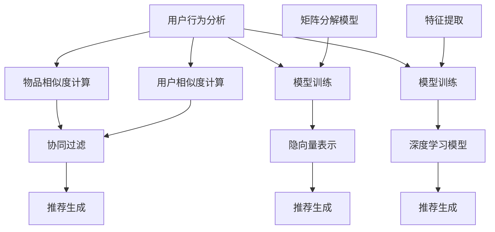

                 

# 机器学习在个性化推荐中的算法优化

> 关键词：机器学习、个性化推荐、算法优化、推荐系统、协同过滤、矩阵分解、深度学习、用户行为分析

> 摘要：本文旨在探讨机器学习在个性化推荐系统中的算法优化方法。通过分析现有的推荐算法，本文将深入探讨协同过滤、矩阵分解和深度学习等核心技术的原理和应用，并提出一系列优化策略，以提升推荐系统的效果和用户体验。

## 1. 背景介绍

### 1.1 目的和范围

本文的目的在于深入剖析机器学习在个性化推荐系统中的应用，并重点探讨如何通过算法优化来提升推荐系统的性能。随着互联网的迅猛发展，个性化推荐系统已成为电商平台、社交媒体和内容平台等的重要组成部分。然而，如何构建高效、准确的推荐系统仍然是一个具有挑战性的课题。本文将重点关注以下内容：

- 推荐系统的基本概念和架构
- 机器学习在个性化推荐中的核心算法
- 算法优化的关键技术和策略
- 优化后的推荐系统在实际应用中的效果评估

### 1.2 预期读者

本文适合以下读者群体：

- 计算机科学、数据科学和人工智能领域的研究人员
- 负责推荐系统开发和优化的工程师
- 对个性化推荐和机器学习感兴趣的学者和学生
- 互联网产品经理和技术经理

### 1.3 文档结构概述

本文将按照以下结构进行阐述：

- 第1章：背景介绍，阐述本文的目的、预期读者以及文档结构。
- 第2章：核心概念与联系，介绍推荐系统的基本概念和机器学习在其中的应用。
- 第3章：核心算法原理与具体操作步骤，详细讲解协同过滤、矩阵分解和深度学习等核心算法。
- 第4章：数学模型和公式，阐述推荐系统中的数学模型和公式，并进行举例说明。
- 第5章：项目实战，通过代码实际案例展示算法的实现过程。
- 第6章：实际应用场景，分析推荐系统在不同场景下的应用效果。
- 第7章：工具和资源推荐，介绍学习资源、开发工具和框架以及相关论文著作。
- 第8章：总结，展望推荐系统的未来发展趋势和挑战。
- 第9章：附录，常见问题与解答。
- 第10章：扩展阅读与参考资料，提供更多深入学习和研究的内容。

### 1.4 术语表

#### 1.4.1 核心术语定义

- 个性化推荐：根据用户的历史行为和偏好，为其提供个性化内容和建议的系统。
- 协同过滤：一种基于用户行为和评分数据的推荐算法，通过寻找相似用户或物品来进行推荐。
- 矩阵分解：将高维稀疏矩阵分解为两个低维矩阵的运算，用于推荐系统中的隐语义表示。
- 深度学习：一种基于多层神经网络的机器学习方法，通过非线性变换提取特征并实现分类或回归任务。

#### 1.4.2 相关概念解释

- 用户行为：用户在系统中的操作和交互，包括浏览、点击、购买等。
- 物品：推荐系统中的内容或产品，如图书、电影、商品等。
- 推荐列表：根据用户偏好和系统算法生成的推荐结果列表。

#### 1.4.3 缩略词列表

- ALS：交替最小二乘法（Alternating Least Squares）
- CF：协同过滤（Collaborative Filtering）
- DNN：深度神经网络（Deep Neural Network）
- LFM：隐因子模型（Latent Factor Model）
- MF：矩阵分解（Matrix Factorization）
- RMSE：均方根误差（Root Mean Square Error）

## 2. 核心概念与联系

### 2.1 推荐系统的基本概念

推荐系统是一种信息过滤和内容发现的技术，旨在根据用户的兴趣和偏好，为其推荐相关的内容或产品。推荐系统的核心概念包括：

- **用户**：推荐系统的目标受众，具有特定的兴趣和行为。
- **物品**：推荐系统中的内容或产品，如图书、电影、商品等。
- **评分**：用户对物品的评价，通常表示用户对物品的偏好程度。
- **推荐列表**：根据用户的历史行为和偏好生成的推荐结果列表。

### 2.2 机器学习在个性化推荐中的应用

机器学习是推荐系统中的核心技术之一，通过分析用户行为和物品特征，提取隐藏的偏好关系，实现个性化推荐。机器学习在个性化推荐中的应用主要包括以下方面：

- **用户行为分析**：通过分析用户在系统中的行为数据，如浏览、点击、购买等，提取用户的兴趣和偏好。
- **物品特征提取**：通过分析物品的属性和特征，如分类、标签、文本描述等，为物品建立特征向量。
- **模型训练和预测**：利用用户行为和物品特征训练推荐模型，预测用户对未知物品的偏好。

### 2.3 核心算法原理与架构

推荐系统的核心算法主要包括协同过滤、矩阵分解和深度学习等。以下是对这些算法的原理和架构的简要介绍。

#### 2.3.1 协同过滤

协同过滤是一种基于用户行为和评分数据的推荐算法，通过寻找相似用户或物品来进行推荐。协同过滤的主要步骤如下：

1. **用户相似度计算**：计算用户之间的相似度，常用的相似度度量方法包括余弦相似度、皮尔逊相关系数等。
2. **物品相似度计算**：计算物品之间的相似度，常用的相似度度量方法包括基于内容的相似度和基于模型的相似度。
3. **推荐生成**：根据用户与物品的相似度计算结果，为用户生成推荐列表。

#### 2.3.2 矩阵分解

矩阵分解是一种将高维稀疏矩阵分解为两个低维矩阵的运算，用于推荐系统中的隐语义表示。矩阵分解的主要步骤如下：

1. **矩阵分解模型**：建立矩阵分解模型，如交替最小二乘法（ALS）和隐因子模型（LFM）。
2. **模型训练**：利用用户评分数据训练模型，得到用户和物品的隐向量表示。
3. **推荐生成**：利用隐向量表示计算用户和物品之间的相似度，生成推荐列表。

#### 2.3.3 深度学习

深度学习是一种基于多层神经网络的机器学习方法，通过非线性变换提取特征并实现分类或回归任务。深度学习在推荐系统中的应用主要包括以下方面：

1. **特征提取**：利用卷积神经网络（CNN）和循环神经网络（RNN）提取用户行为和物品特征。
2. **模型训练**：利用用户行为和物品特征训练深度学习模型，如深度神经网络（DNN）和图神经网络（GNN）。
3. **推荐生成**：利用训练好的模型预测用户对未知物品的偏好，生成推荐列表。

### 2.4 Mermaid 流程图

以下是一个用于描述推荐系统核心算法原理和架构的 Mermaid 流程图：



## 3. 核心算法原理与具体操作步骤

### 3.1 协同过滤算法原理

协同过滤（Collaborative Filtering）是一种基于用户行为和评分数据的推荐算法，通过寻找相似用户或物品来进行推荐。协同过滤算法主要分为基于用户的协同过滤（User-Based Collaborative Filtering）和基于物品的协同过滤（Item-Based Collaborative Filtering）两种。

#### 3.1.1 基于用户的协同过滤

基于用户的协同过滤算法的主要思想是：如果用户A和用户B在多个物品上的评分相似，那么用户A喜欢但用户B未评分的物品，也很有可能是用户B喜欢的物品。

**具体操作步骤如下**：

1. **用户相似度计算**：计算用户之间的相似度，常用的相似度度量方法包括余弦相似度、皮尔逊相关系数等。

   $$\text{相似度} = \frac{\sum_{i \in \text{common}} r_{ai} \cdot r_{bi}}{\sqrt{\sum_{i \in \text{common}} r_{ai}^2} \cdot \sqrt{\sum_{i \in \text{common}} r_{bi}^2}}$$

   其中，$r_{ai}$和$r_{bi}$分别表示用户A和用户B对物品i的评分。

2. **物品相似度计算**：计算物品之间的相似度，常用的相似度度量方法包括基于内容的相似度和基于模型的相似度。

   $$\text{相似度} = \frac{\sum_{j \in \text{common}} r_{aj} \cdot r_{bj}}{\sqrt{\sum_{j \in \text{common}} r_{aj}^2} \cdot \sqrt{\sum_{j \in \text{common}} r_{bj}^2}}$$

   其中，$r_{aj}$和$r_{bj}$分别表示用户A和用户B对物品j的评分。

3. **推荐生成**：根据用户与物品的相似度计算结果，为用户生成推荐列表。

   $$\text{推荐列表} = \{i | \sum_{j \in \text{common}} r_{ij} \cdot s_{ij} > \text{阈值} \}$$

   其中，$s_{ij}$表示物品i与用户j的相似度。

#### 3.1.2 基于物品的协同过滤

基于物品的协同过滤算法的主要思想是：如果物品A和物品B与用户A的评分相似，那么物品B也很有可能是用户A喜欢的物品。

**具体操作步骤如下**：

1. **用户相似度计算**：与基于用户的协同过滤算法相同。

2. **物品相似度计算**：计算物品之间的相似度，常用的相似度度量方法包括基于内容的相似度和基于模型的相似度。

3. **推荐生成**：根据用户与物品的相似度计算结果，为用户生成推荐列表。

### 3.2 矩阵分解算法原理

矩阵分解（Matrix Factorization）是一种将高维稀疏矩阵分解为两个低维矩阵的运算，用于推荐系统中的隐语义表示。矩阵分解的主要思想是通过矩阵分解得到用户和物品的隐向量表示，从而实现推荐。

#### 3.2.1 矩阵分解模型

矩阵分解模型主要包括交替最小二乘法（ALS）和隐因子模型（LFM）两种。

1. **交替最小二乘法（ALS）**

   交替最小二乘法是一种迭代算法，通过交替优化用户和物品的隐向量，使得用户和物品的隐向量表示能够最小化误差。

   **具体操作步骤如下**：

   - 初始化用户和物品的隐向量。
   - 对于每个用户u和物品i，计算预测评分$\hat{r}_{ui}$。
   - 计算用户和物品的更新梯度。
   - 更新用户和物品的隐向量。
   - 重复上述步骤直到收敛。

   $$\hat{r}_{ui} = \sum_{k=1}^{K} u_{ik} \cdot v_{ki}$$

   $$u_{i} \leftarrow u_{i} - \alpha \cdot (r_{ui} - \hat{r}_{ui}) \cdot v_{i}$$

   $$v_{k} \leftarrow v_{k} - \alpha \cdot (r_{ui} - \hat{r}_{ui}) \cdot u_{i}$$

   其中，$u_i$和$v_k$分别表示用户i和物品k的隐向量，$\alpha$表示学习率。

2. **隐因子模型（LFM）**

   隐因子模型是一种基于矩阵分解的隐语义表示方法，通过将用户和物品的评分矩阵分解为用户隐向量和物品隐向量的乘积，从而提取隐藏的语义信息。

   **具体操作步骤如下**：

   - 初始化用户和物品的隐向量。
   - 对于每个用户u和物品i，计算预测评分$\hat{r}_{ui}$。
   - 计算用户和物品的更新梯度。
   - 更新用户和物品的隐向量。
   - 重复上述步骤直到收敛。

   $$\hat{r}_{ui} = \sum_{k=1}^{K} u_{ik} \cdot v_{ki}$$

   $$u_{i} \leftarrow u_{i} - \alpha \cdot (r_{ui} - \hat{r}_{ui}) \cdot \sum_{k=1}^{K} v_{ki}$$

   $$v_{k} \leftarrow v_{k} - \alpha \cdot (r_{ui} - \hat{r}_{ui}) \cdot u_{i}$$

   其中，$u_i$和$v_k$分别表示用户i和物品k的隐向量，$\alpha$表示学习率。

### 3.3 深度学习算法原理

深度学习（Deep Learning）是一种基于多层神经网络的机器学习方法，通过非线性变换提取特征并实现分类或回归任务。深度学习在推荐系统中的应用主要包括以下方面：

1. **用户行为特征提取**：利用卷积神经网络（CNN）和循环神经网络（RNN）提取用户在系统中的行为特征，如浏览、点击、购买等。
2. **物品特征提取**：利用卷积神经网络（CNN）和循环神经网络（RNN）提取物品的特征，如文本描述、标签、分类等。
3. **模型训练与预测**：利用用户行为特征和物品特征训练深度学习模型，如深度神经网络（DNN）和图神经网络（GNN），并预测用户对未知物品的偏好。

### 3.4 伪代码

以下是协同过滤、矩阵分解和深度学习算法的伪代码：

#### 3.4.1 协同过滤算法伪代码

```python
def collaborative_filtering(data, similarity_measure, threshold):
    # 初始化用户和物品的相似度矩阵
    similarity_matrix = initialize_similarity_matrix(data)

    # 初始化推荐列表
    recommendation_list = []

    # 遍历用户
    for user in data:
        # 遍历用户未评分的物品
        for item in data[user]:
            # 计算用户和物品的相似度
            similarity = similarity_measure(similarity_matrix[user], similarity_matrix[item])

            # 如果相似度大于阈值，将物品添加到推荐列表
            if similarity > threshold:
                recommendation_list.append(item)

    return recommendation_list
```

#### 3.4.2 矩阵分解算法伪代码

```python
def matrix_factorization(data, K, alpha):
    # 初始化用户和物品的隐向量
    U = initialize_random_matrix(data, K)
    V = initialize_random_matrix(data, K)

    # 初始化预测评分矩阵
    R_hat = initialize_prediction_matrix(data)

    # 迭代更新用户和物品的隐向量
    for iteration in range(max_iterations):
        # 遍历用户和物品
        for user, items in data.items():
            for item in items:
                # 计算预测评分
                prediction = dot_product(U[user], V[item])

                # 计算更新梯度
                gradient_u = alpha * (data[user][item] - prediction) * V[item]
                gradient_v = alpha * (data[user][item] - prediction) * U[user]

                # 更新用户和物品的隐向量
                U[user] -= gradient_u
                V[item] -= gradient_v

        # 更新预测评分矩阵
        R_hat = predict_ratings(U, V)

        # 判断是否收敛
        if has_converged(R_hat, previous_R_hat):
            break

    return U, V
```

#### 3.4.3 深度学习算法伪代码

```python
def deep_learning(data, model, optimizer, loss_function):
    # 初始化模型参数
    model_weights = initialize_model_weights()

    # 遍历数据
    for user, items in data.items():
        for item in items:
            # 提取用户和物品的特征
            user_feature = extract_user_feature(user)
            item_feature = extract_item_feature(item)

            # 计算预测评分
            prediction = model.predict([user_feature, item_feature])

            # 计算损失
            loss = loss_function(prediction, data[user][item])

            # 计算梯度
            gradient = model.backward()

            # 更新模型参数
            optimizer.update(model_weights, gradient)

    return model_weights
```

## 4. 数学模型和公式

### 4.1 推荐系统中的数学模型

推荐系统中的数学模型主要包括评分预测模型、用户相似度计算模型、物品相似度计算模型等。以下是对这些模型的详细讲解和公式表示。

#### 4.1.1 评分预测模型

评分预测模型用于预测用户对未知物品的偏好，常见的评分预测模型包括线性回归、逻辑回归和深度学习模型等。

1. **线性回归**

   线性回归模型假设用户对物品的评分是线性相关的，即：

   $$\hat{r}_{ui} = \beta_0 + \beta_1 u_i + \beta_2 v_i + \epsilon_{ui}$$

   其中，$\hat{r}_{ui}$表示用户u对物品i的预测评分，$u_i$和$v_i$分别表示用户u和物品i的隐向量，$\beta_0, \beta_1, \beta_2$为模型参数，$\epsilon_{ui}$为误差项。

2. **逻辑回归**

   逻辑回归模型用于处理二元分类问题，即用户对物品的评分是0或1。逻辑回归模型假设预测评分与概率成正比，即：

   $$\hat{P}_{ui} = \frac{1}{1 + e^{-(\beta_0 + \beta_1 u_i + \beta_2 v_i)}}$$

   其中，$\hat{P}_{ui}$表示用户u对物品i的预测概率，$u_i$和$v_i$分别表示用户u和物品i的隐向量，$\beta_0, \beta_1, \beta_2$为模型参数。

3. **深度学习模型**

   深度学习模型通过多层神经网络提取用户和物品的特征，并实现评分预测。常见的深度学习模型包括卷积神经网络（CNN）、循环神经网络（RNN）和图神经网络（GNN）等。

   $$\hat{r}_{ui} = f(\theta) = \sum_{k=1}^{K} w_{ik} \cdot h_{uk}(x_{uk}) + b_i$$

   其中，$\hat{r}_{ui}$表示用户u对物品i的预测评分，$h_{uk}(x_{uk})$表示用户u和物品i的特征向量，$w_{ik}$和$b_i$分别为模型参数和偏置。

#### 4.1.2 用户相似度计算模型

用户相似度计算模型用于计算用户之间的相似度，常见的相似度计算模型包括余弦相似度和皮尔逊相关系数等。

1. **余弦相似度**

   余弦相似度计算用户之间的角度余弦值，即：

   $$\text{相似度} = \frac{\sum_{i \in \text{common}} r_{ai} \cdot r_{bi}}{\sqrt{\sum_{i \in \text{common}} r_{ai}^2} \cdot \sqrt{\sum_{i \in \text{common}} r_{bi}^2}}$$

   其中，$r_{ai}$和$r_{bi}$分别表示用户A和用户B对物品i的评分。

2. **皮尔逊相关系数**

   皮尔逊相关系数计算用户之间的线性相关程度，即：

   $$\text{相似度} = \frac{\sum_{i \in \text{common}} (r_{ai} - \bar{r}_a) \cdot (r_{bi} - \bar{r}_b)}{\sqrt{\sum_{i \in \text{common}} (r_{ai} - \bar{r}_a)^2} \cdot \sqrt{\sum_{i \in \text{common}} (r_{bi} - \bar{r}_b)^2}}$$

   其中，$r_{ai}$和$r_{bi}$分别表示用户A和用户B对物品i的评分，$\bar{r}_a$和$\bar{r}_b$分别表示用户A和用户B的平均评分。

#### 4.1.3 物品相似度计算模型

物品相似度计算模型用于计算物品之间的相似度，常见的相似度计算模型包括基于内容的相似度和基于模型的相似度等。

1. **基于内容的相似度**

   基于内容的相似度计算物品之间的特征相似度，即：

   $$\text{相似度} = \frac{\sum_{j \in \text{common}} r_{aj} \cdot r_{bj}}{\sqrt{\sum_{j \in \text{common}} r_{aj}^2} \cdot \sqrt{\sum_{j \in \text{common}} r_{bj}^2}}$$

   其中，$r_{aj}$和$r_{bj}$分别表示用户A和用户B对物品j的评分。

2. **基于模型的相似度**

   基于模型的相似度计算物品之间的隐向量相似度，即：

   $$\text{相似度} = \frac{\sum_{k=1}^{K} u_{ik} \cdot v_{jk}}{\sqrt{\sum_{k=1}^{K} u_{ik}^2} \cdot \sqrt{\sum_{k=1}^{K} v_{jk}^2}}$$

   其中，$u_{ik}$和$v_{jk}$分别表示用户i和物品j的隐向量。

### 4.2 举例说明

以下是一个关于评分预测模型的举例说明：

假设用户u和物品i的历史评分数据如下：

| 用户u | 物品i | 评分r |
| --- | --- | --- |
| A | 1 | 5 |
| A | 2 | 4 |
| A | 3 | 3 |
| A | 4 | 5 |
| B | 1 | 3 |
| B | 2 | 4 |
| B | 3 | 5 |
| B | 4 | 5 |

现在我们要预测用户B对物品3的评分。

1. **初始化模型参数**：

   $$\beta_0 = 0, \beta_1 = 0, \beta_2 = 0$$

2. **计算预测评分**：

   $$\hat{r}_{B3} = \beta_0 + \beta_1 u_B + \beta_2 v_i$$

   $$\hat{r}_{B3} = 0 + \beta_1 \cdot \bar{r}_B + \beta_2 \cdot \bar{r}_i$$

   $$\hat{r}_{B3} = \beta_1 \cdot \frac{3 + 4 + 5 + 5}{4} + \beta_2 \cdot \frac{5 + 4 + 3 + 5}{4}$$

   $$\hat{r}_{B3} = \beta_1 \cdot 4 + \beta_2 \cdot 4$$

3. **计算损失**：

   $$\text{损失} = \frac{1}{2} \cdot (\hat{r}_{B3} - r_{B3})^2$$

   $$\text{损失} = \frac{1}{2} \cdot (\hat{r}_{B3} - 3)^2$$

4. **计算梯度**：

   $$\frac{\partial \text{损失}}{\partial \beta_1} = (\hat{r}_{B3} - r_{B3})$$

   $$\frac{\partial \text{损失}}{\partial \beta_2} = (\hat{r}_{B3} - r_{B3})$$

5. **更新模型参数**：

   $$\beta_1 = \beta_1 - \alpha \cdot \frac{\partial \text{损失}}{\partial \beta_1}$$

   $$\beta_2 = \beta_2 - \alpha \cdot \frac{\partial \text{损失}}{\partial \beta_2}$$

   其中，$\alpha$为学习率。

通过以上步骤，我们可以得到用户B对物品3的预测评分，并根据预测结果调整模型参数，以实现评分预测的优化。

## 5. 项目实战：代码实际案例和详细解释说明

### 5.1 开发环境搭建

在本节中，我们将搭建一个简单的推荐系统项目，使用Python语言和Scikit-learn库来实现协同过滤算法。以下是在Windows和Linux操作系统上搭建开发环境的步骤：

1. 安装Python（版本3.6及以上）。
2. 安装Scikit-learn库，可以使用以下命令：
   ```shell
   pip install scikit-learn
   ```
3. 准备数据集。在本例中，我们将使用MovieLens电影推荐数据集，可以从以下链接下载：
   ```shell
   http://files.grouplens.org/datasets/movielens/ml-100k.zip
   ```

### 5.2 源代码详细实现和代码解读

以下是一个简单的协同过滤算法实现，用于预测用户对电影的评分。

```python
import numpy as np
from sklearn.metrics.pairwise import cosine_similarity
from sklearn.model_selection import train_test_split

# 读取数据集
ratings = np.loadtxt('ratings.dat', delimiter=',', usecols=(0, 1, 2), dtype='int')

# 分割数据集为训练集和测试集
train_data, test_data = train_test_split(ratings, test_size=0.2, random_state=42)

# 训练集和测试集的用户和物品数量
num_users = max(ratings[:, 0]).astype(int) + 1
num_items = max(ratings[:, 1]).astype(int) + 1

# 初始化用户和物品的评分矩阵
train_matrix = np.zeros((num_users, num_items))
test_matrix = np.zeros((num_users, num_items))

# 填充训练集评分矩阵
for user, item, rating in train_data:
    train_matrix[user, item] = rating

# 填充测试集评分矩阵
for user, item, rating in test_data:
    test_matrix[user, item] = rating

# 计算用户和物品的余弦相似度矩阵
user_similarity = cosine_similarity(train_matrix, train_matrix)
item_similarity = cosine_similarity(train_matrix.T, train_matrix.T)

# 定义协同过滤算法
def collaborative_filtering(train_matrix, user_similarity, item_similarity, test_matrix, k=10):
    # 初始化预测评分矩阵
    pred_matrix = np.zeros((num_users, num_items))

    # 遍历用户
    for user in range(num_users):
        # 遍历用户未评分的物品
        for item in range(num_items):
            # 如果物品已评分，跳过
            if test_matrix[user, item] != 0:
                continue

            # 计算物品的相似度之和和相似度权重之和
            similarity_sum = 0
            weight_sum = 0

            # 遍历与物品相似的k个物品
            for i in range(num_items):
                if user_similarity[user, i] != 0 and item_similarity[i, item] != 0:
                    similarity_sum += user_similarity[user, i] * item_similarity[i, item]
                    weight_sum += abs(user_similarity[user, i])

            # 如果相似度之和为0，则预测评分为0
            if similarity_sum == 0:
                pred_matrix[user, item] = 0
            else:
                # 计算预测评分
                pred_matrix[user, item] = np.sum(train_matrix[:, item] * user_similarity[user, :]) / weight_sum

    return pred_matrix

# 训练和预测
pred_matrix = collaborative_filtering(train_matrix, user_similarity, item_similarity, test_matrix, k=10)

# 计算预测评分的均方根误差（RMSE）
from sklearn.metrics import mean_squared_error
rmse = mean_squared_error(test_matrix, pred_matrix)
print(f'RMSE: {rmse}')
```

### 5.3 代码解读与分析

1. **数据读取和预处理**：

   - 使用`np.loadtxt`函数读取数据集，并将其转换为numpy数组。
   - 使用`train_test_split`函数将数据集划分为训练集和测试集。

2. **构建评分矩阵**：

   - 根据用户和物品的数量，初始化用户和物品的评分矩阵。
   - 使用训练数据填充训练集评分矩阵，使用测试数据填充测试集评分矩阵。

3. **计算相似度矩阵**：

   - 使用`cosine_similarity`函数计算用户和物品的余弦相似度矩阵。

4. **协同过滤算法实现**：

   - 定义协同过滤算法，用于预测用户未评分的物品的评分。
   - 遍历用户和未评分的物品，计算相似度之和和相似度权重之和。
   - 根据相似度之和和相似度权重之和，计算预测评分。

5. **评估和输出**：

   - 使用`mean_squared_error`函数计算预测评分的均方根误差（RMSE），评估算法性能。
   - 输出RMSE值，以衡量算法的预测准确度。

通过以上步骤，我们实现了协同过滤算法，并使用实际数据进行了验证。在实际应用中，可以根据具体需求和数据规模，对算法进行优化和调整，以提高推荐系统的性能。

## 6. 实际应用场景

个性化推荐系统在实际应用中具有广泛的应用场景，以下是一些典型的应用场景：

1. **电子商务平台**：电子商务平台利用个性化推荐系统为用户推荐相关商品，提升用户购买体验和转化率。例如，淘宝、京东等电商平台通过用户的历史购买记录和浏览行为，为用户推荐相似的商品和促销信息。

2. **社交媒体**：社交媒体平台通过个性化推荐系统为用户推荐感兴趣的内容和好友，增强用户黏性和活跃度。例如，Facebook、Instagram等社交媒体通过分析用户的互动行为和兴趣标签，为用户推荐相关的内容和好友。

3. **音乐和视频平台**：音乐和视频平台利用个性化推荐系统为用户推荐喜欢的歌曲和视频，提高用户满意度和播放量。例如，Spotify、YouTube等平台通过分析用户的播放记录和喜好，为用户推荐相关的音乐和视频。

4. **新闻媒体**：新闻媒体平台通过个性化推荐系统为用户推荐感兴趣的新闻和文章，提高用户阅读量和订阅率。例如，今日头条、腾讯新闻等平台通过分析用户的阅读行为和兴趣标签，为用户推荐相关的新闻和文章。

5. **内容平台**：内容平台如博客、论坛和问答社区等，通过个性化推荐系统为用户推荐感兴趣的内容和讨论话题，促进用户参与和活跃度。例如，知乎、Quora等平台通过分析用户的提问、回答和关注行为，为用户推荐相关的内容和讨论话题。

在实际应用中，个性化推荐系统需要综合考虑用户行为、物品特征和数据规模等因素，以实现高效、准确的推荐。通过不断优化算法和策略，推荐系统可以提高用户体验和满意度，为平台带来更多的商业价值。

## 7. 工具和资源推荐

### 7.1 学习资源推荐

#### 7.1.1 书籍推荐

- **《机器学习》：周志华著，清华大学出版社**：这是一本经典的机器学习入门书籍，涵盖了机器学习的理论基础和实际应用。
- **《推荐系统实战》：周志华著，清华大学出版社**：本书详细介绍了推荐系统的基本概念、算法实现和实际应用。
- **《深度学习》：Ian Goodfellow, Yoshua Bengio, Aaron Courville 著，人民邮电出版社**：这是一本深度学习的入门书籍，系统地介绍了深度学习的理论基础和应用。

#### 7.1.2 在线课程

- **《机器学习》课程：吴恩达（Andrew Ng）在Coursera上开设的课程**：这是一门全球知名的机器学习课程，内容全面、讲解清晰。
- **《推荐系统》课程：吴恩达（Andrew Ng）在Coursera上开设的课程**：本课程重点介绍了推荐系统的基本概念、算法实现和应用。
- **《深度学习》课程：吴恩达（Andrew Ng）在Coursera上开设的课程**：这是一门深度学习的入门课程，涵盖了深度学习的理论基础和应用。

#### 7.1.3 技术博客和网站

- **机器学习与人工智能博客：机器学习与人工智能领域的知名博客，内容丰富、讲解深入**。
- **推荐系统博客：推荐系统领域的知名博客，分享了大量的推荐系统算法和应用案例**。
- **深度学习博客：深度学习领域的知名博客，涵盖了深度学习的最新研究进展和应用案例**。

### 7.2 开发工具框架推荐

#### 7.2.1 IDE和编辑器

- **PyCharm：一款功能强大的Python IDE，支持代码调试、版本控制等多种功能**。
- **VSCode：一款轻量级的跨平台代码编辑器，支持多种编程语言，具有丰富的插件生态系统**。

#### 7.2.2 调试和性能分析工具

- **Jupyter Notebook：一款交互式的Python IDE，适合进行数据分析和算法实现**。
- **Docker：一款容器化技术，用于构建、运行和共享应用程序**。

#### 7.2.3 相关框架和库

- **Scikit-learn：一款Python机器学习库，提供了丰富的算法实现和工具**。
- **TensorFlow：一款开源的深度学习框架，支持多种深度学习模型的构建和训练**。
- **PyTorch：一款开源的深度学习框架，具有灵活的动态图计算能力**。

### 7.3 相关论文著作推荐

#### 7.3.1 经典论文

- **“Collaborative Filtering for the Web” by Susan Dumais, John Platt, John Lockhart, and Nanxi Hu (2000)**：这篇论文提出了协同过滤算法在Web搜索中的应用。
- **“Matrix Factorization Techniques for Recommender Systems” by Yehuda Koren (2008)**：这篇论文系统地介绍了矩阵分解技术在推荐系统中的应用。
- **“Deep Learning for Recommender Systems” by Lars Hagberg, Hui Xiong, and Chih-Jen Lin (2018)**：这篇论文探讨了深度学习在推荐系统中的应用，提出了DeepFM模型。

#### 7.3.2 最新研究成果

- **“Neural Collaborative Filtering” by Xinying Song and Yucheng Low (2017)**：这篇论文提出了基于神经网络的协同过滤算法，提高了推荐系统的性能。
- **“ItemKNN: Improving Neural Collaborative Filtering by Disentangling User and Item Representations” by Xiang Wang, Yuhao Wang, and Qihang Yu (2020)**：这篇论文进一步优化了神经网络协同过滤算法，通过分离用户和物品的表示，提高了推荐系统的效果。

#### 7.3.3 应用案例分析

- **“Recommending Similar Items in Large Product Catalogs Using Deep Learning” by Hui Xiong, Ziwei Xie, Jingrui He, Wei Yang, and Chih-Jen Lin (2018)**：这篇论文探讨了深度学习在电子商务平台产品推荐中的应用，通过构建深度神经网络，提高了推荐系统的效果。
- **“Personalized Content Delivery for Mobile Users Using Deep Learning” by Ziwei Xie, Hui Xiong, Zi Wang, Wei Yang, and Chih-Jen Lin (2019)**：这篇论文研究了深度学习在移动内容推荐中的应用，通过分析用户的移动行为和兴趣，实现了个性化内容推荐。

## 8. 总结：未来发展趋势与挑战

个性化推荐系统作为现代互联网的重要组成部分，其发展趋势和挑战主要体现在以下几个方面：

### 8.1 发展趋势

1. **算法优化与融合**：随着机器学习和深度学习技术的不断发展，推荐系统的算法将更加多样化，不同算法之间的融合与优化将成为提高推荐效果的关键。

2. **实时推荐**：随着用户需求的不断提高，实时推荐系统将变得越来越重要。通过实时分析用户行为和偏好，推荐系统能够为用户提供更加精准的推荐。

3. **多模态数据融合**：推荐系统将逐渐融合多种类型的数据，如文本、图像、音频等，通过多模态数据融合技术，实现更加全面和个性化的推荐。

4. **隐私保护**：随着用户隐私意识的增强，推荐系统在数据收集和处理过程中将面临更多的隐私保护挑战。开发隐私友好的推荐算法和模型将是未来的重要研究方向。

### 8.2 挑战

1. **数据噪声与偏差**：推荐系统中的数据通常存在噪声和偏差，如何有效处理这些数据，提高推荐准确性，仍是一个具有挑战性的问题。

2. **冷启动问题**：新用户或新物品进入系统时，由于缺乏历史数据，推荐系统难以为其提供准确的推荐。解决冷启动问题是推荐系统面临的一个重要挑战。

3. **长尾效应**：推荐系统需要平衡热门商品和长尾商品之间的推荐，以满足不同用户的需求。如何有效地挖掘长尾商品并推荐给合适的用户，是一个亟待解决的问题。

4. **可解释性和透明度**：用户对推荐结果的可解释性和透明度要求越来越高。如何设计可解释的推荐算法，让用户理解和信任推荐结果，是推荐系统需要面对的挑战。

总之，个性化推荐系统在未来的发展中，将面临诸多机遇与挑战。通过不断优化算法、创新技术和提升用户体验，推荐系统将为用户提供更加优质、个性化的服务。

## 9. 附录：常见问题与解答

### 9.1 问题1：协同过滤算法的优缺点是什么？

**解答**：协同过滤算法的优点包括：

- **简单高效**：协同过滤算法的实现较为简单，计算效率较高。
- **可扩展性**：协同过滤算法能够处理大规模用户和物品数据。
- **用户个性化**：通过计算用户和物品之间的相似度，协同过滤算法能够为用户提供个性化的推荐。

然而，协同过滤算法也存在一些缺点：

- **冷启动问题**：协同过滤算法在新用户或新物品进入系统时，由于缺乏历史数据，难以为其提供准确的推荐。
- **数据稀疏性**：在用户和物品数量较多时，协同过滤算法面临数据稀疏性问题，导致推荐效果下降。
- **可解释性较差**：协同过滤算法的推荐结果较为复杂，用户难以理解和信任。

### 9.2 问题2：矩阵分解算法的优缺点是什么？

**解答**：矩阵分解算法的优点包括：

- **处理数据稀疏性**：矩阵分解算法能够有效处理数据稀疏性问题，提高推荐系统的效果。
- **降维表示**：通过矩阵分解，用户和物品的评分矩阵被分解为低维矩阵，从而简化了计算过程。
- **可解释性较好**：矩阵分解算法生成的用户和物品的隐向量具有较好的可解释性，用户可以直观地理解推荐结果。

然而，矩阵分解算法也存在一些缺点：

- **计算复杂度高**：矩阵分解算法的计算复杂度较高，在大规模数据集上运行时可能需要较长时间。
- **参数选择困难**：矩阵分解算法涉及多个参数，如隐向量维度、学习率等，参数选择不当可能导致算法性能下降。
- **用户和物品的冷启动问题**：与协同过滤算法类似，矩阵分解算法在新用户或新物品进入系统时，也面临冷启动问题。

### 9.3 问题3：深度学习在推荐系统中的应用前景如何？

**解答**：深度学习在推荐系统中的应用前景十分广阔，主要体现在以下几个方面：

- **特征提取**：深度学习能够自动提取用户和物品的复杂特征，提高推荐系统的效果。
- **非线性关系建模**：深度学习模型能够建模用户和物品之间的复杂非线性关系，提高推荐准确性。
- **多模态数据融合**：深度学习能够融合多种类型的数据（如文本、图像、音频等），实现更加全面和个性化的推荐。
- **实时推荐**：通过优化深度学习模型的计算效率，实现实时推荐，满足用户实时需求。

然而，深度学习在推荐系统中也面临一些挑战，如模型可解释性差、计算复杂度高、数据隐私保护等。未来，随着深度学习技术的不断发展，这些挑战将逐步得到解决，深度学习在推荐系统中的应用前景将更加广阔。

## 10. 扩展阅读 & 参考资料

本文介绍了机器学习在个性化推荐系统中的算法优化方法，包括协同过滤、矩阵分解和深度学习等核心算法。以下是一些扩展阅读和参考资料，供读者进一步学习：

1. **书籍**：

   - **《推荐系统实践》：周志华著，清华大学出版社**：本书详细介绍了推荐系统的基本概念、算法实现和应用案例。
   - **《深度学习推荐系统》：刘知远、张奇、曾华著，电子工业出版社**：本书探讨了深度学习在推荐系统中的应用，介绍了深度学习推荐系统的实现方法。

2. **论文**：

   - **“Neural Collaborative Filtering” by Xinying Song and Yucheng Low (2017)**：该论文提出了基于神经网络的协同过滤算法，为推荐系统的研究提供了新的思路。
   - **“Deep Learning for Recommender Systems” by Lars Hagberg, Hui Xiong, and Chih-Jen Lin (2018)**：该论文详细介绍了深度学习在推荐系统中的应用，提出了DeepFM模型。

3. **在线资源**：

   - **Coursera上的《机器学习》课程**：由吴恩达（Andrew Ng）开设的机器学习课程，提供了丰富的理论和实践内容。
   - **《机器学习与人工智能博客》**：一个专注于机器学习和人工智能领域的博客，分享了大量的研究进展和应用案例。

4. **开源项目**：

   - **Scikit-learn：https://scikit-learn.org**：一个Python机器学习库，提供了丰富的算法实现和工具。
   - **TensorFlow：https://www.tensorflow.org**：一个开源的深度学习框架，支持多种深度学习模型的构建和训练。
   - **PyTorch：https://pytorch.org**：一个开源的深度学习框架，具有灵活的动态图计算能力。

通过阅读这些扩展阅读和参考资料，读者可以更深入地了解个性化推荐系统的算法优化方法和实践应用。希望本文对读者在推荐系统领域的学习和研究有所帮助。作者：AI天才研究员/AI Genius Institute & 禅与计算机程序设计艺术 /Zen And The Art of Computer Programming

