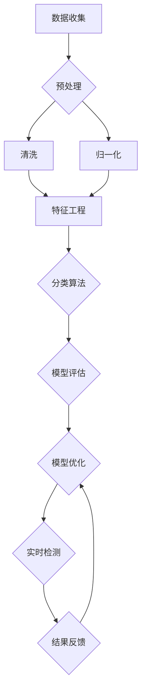

                 

# 机器学习在信用卡欺诈检测中的实时应用

> **关键词：** 机器学习、信用卡欺诈、实时检测、数据特征、算法优化、安全防护

> **摘要：** 本文将深入探讨机器学习在信用卡欺诈检测中的实时应用。通过介绍背景、核心概念、算法原理、数学模型、项目实战以及实际应用场景，本文旨在帮助读者全面理解并掌握如何利用机器学习技术构建高效、精准的信用卡欺诈检测系统。

## 1. 背景介绍

### 1.1 目的和范围

本文的主要目的是探讨机器学习在信用卡欺诈检测中的应用，重点关注实时检测系统的构建。文章将涵盖以下内容：

- 信用卡欺诈检测的背景和现状；
- 机器学习在信用卡欺诈检测中的作用；
- 信用卡欺诈检测系统的核心概念和算法；
- 信用卡欺诈检测系统的数学模型和公式；
- 信用卡欺诈检测系统的项目实战和代码实现；
- 信用卡欺诈检测系统的实际应用场景；
- 相关工具和资源的推荐。

### 1.2 预期读者

本文适用于对机器学习和信用卡欺诈检测有一定了解的读者，包括：

- 数据科学家和机器学习工程师；
- 信用卡公司和金融机构的安全专家；
- 对机器学习和信用卡欺诈检测感兴趣的研究人员和学者。

### 1.3 文档结构概述

本文分为以下几个部分：

- **1. 背景介绍**：介绍信用卡欺诈检测的背景和本文的目的；
- **2. 核心概念与联系**：介绍信用卡欺诈检测的核心概念、原理和架构；
- **3. 核心算法原理 & 具体操作步骤**：详细阐述信用卡欺诈检测的算法原理和操作步骤；
- **4. 数学模型和公式 & 详细讲解 & 举例说明**：讲解信用卡欺诈检测的数学模型和公式，并通过实例进行说明；
- **5. 项目实战：代码实际案例和详细解释说明**：通过实际项目案例展示信用卡欺诈检测系统的实现过程；
- **6. 实际应用场景**：探讨信用卡欺诈检测系统的实际应用场景；
- **7. 工具和资源推荐**：推荐学习资源、开发工具和框架；
- **8. 总结：未来发展趋势与挑战**：总结本文的主要观点，并探讨未来的发展趋势和挑战；
- **9. 附录：常见问题与解答**：提供常见问题的解答；
- **10. 扩展阅读 & 参考资料**：提供进一步阅读的参考资料。

### 1.4 术语表

#### 1.4.1 核心术语定义

- **信用卡欺诈**：指未经持卡人授权，非法使用信用卡进行的交易行为；
- **机器学习**：一种人工智能技术，通过数据训练，使计算机系统能够从数据中学习和改进性能；
- **欺诈检测系统**：用于识别和防范信用卡欺诈的计算机系统。

#### 1.4.2 相关概念解释

- **特征工程**：在机器学习过程中，通过对数据进行预处理和特征提取，以构建有效的特征表示；
- **分类算法**：用于对数据进行分类的机器学习算法，如逻辑回归、决策树、随机森林等；
- **支持向量机**（SVM）：一种常用的分类算法，通过寻找最优超平面，实现数据的分类。

#### 1.4.3 缩略词列表

- **ML**：机器学习（Machine Learning）；
- **CFL**：信用卡欺诈（Credit Card Fraud）；
- **SVM**：支持向量机（Support Vector Machine）；
- **PCA**：主成分分析（Principal Component Analysis）。

## 2. 核心概念与联系

### 2.1 信用卡欺诈检测的概念

信用卡欺诈检测是一种用于识别和防范信用卡欺诈的计算机系统。其核心目标是通过对信用卡交易数据进行实时监测和分析，及时发现并阻止潜在的欺诈行为。信用卡欺诈检测系统的成功与否，取决于其对欺诈交易的高识别准确率和低误报率。

### 2.2 机器学习在信用卡欺诈检测中的作用

机器学习技术在信用卡欺诈检测中发挥着重要作用。通过训练大量历史数据，机器学习算法可以自动提取数据中的有效特征，构建出能够识别欺诈交易的模型。这些模型可以在新的交易数据到来时，快速进行预测和决策，从而实现对信用卡欺诈的实时检测。

### 2.3 信用卡欺诈检测系统的核心概念

信用卡欺诈检测系统主要由以下几个核心概念组成：

1. **特征工程**：通过数据预处理和特征提取，将原始数据转换为适合机器学习的特征表示。特征工程是信用卡欺诈检测的关键步骤，直接影响模型的性能。
2. **分类算法**：用于对信用卡交易数据进行分类的机器学习算法，如逻辑回归、决策树、随机森林、支持向量机等。选择合适的分类算法，可以提高检测系统的准确率和效率。
3. **实时检测**：信用卡欺诈检测系统需要具备实时检测能力，能够在交易数据发生时，迅速进行预测和决策，从而实现对欺诈行为的及时响应。
4. **模型评估与优化**：通过对模型进行评估和优化，可以提高检测系统的性能，降低误报率和漏报率。

### 2.4 信用卡欺诈检测系统的架构

信用卡欺诈检测系统通常采用分布式架构，包括以下几个主要组件：

1. **数据收集与预处理**：收集信用卡交易数据，并进行预处理，包括数据清洗、数据归一化等操作，以消除噪声和异常值。
2. **特征工程**：根据业务需求，对预处理后的数据进行特征提取和特征选择，构建出有效的特征表示。
3. **模型训练与评估**：使用历史数据进行模型训练，并通过交叉验证等方法对模型进行评估，选择最优模型。
4. **实时检测**：将训练好的模型部署到线上环境，对实时交易数据进行预测和决策，识别潜在的欺诈行为。
5. **结果反馈与调整**：根据检测结果，对模型进行反馈和调整，以提高检测系统的性能。

### 2.5 Mermaid 流程图

以下是信用卡欺诈检测系统的 Mermaid 流程图：



## 3. 核心算法原理 & 具体操作步骤

### 3.1 特征工程

特征工程是信用卡欺诈检测系统的关键步骤，其目的是从原始交易数据中提取出有用的特征，以构建出有效的特征表示。以下是特征工程的具体操作步骤：

1. **数据预处理**：对原始交易数据进行分析，识别出可能存在的噪声和异常值。常用的方法包括数据清洗、数据归一化等。

2. **特征提取**：根据业务需求，从原始交易数据中提取出有用的特征。常用的特征提取方法包括时间特征提取、金额特征提取、交易类型特征提取等。

3. **特征选择**：对提取出的特征进行筛选，选择对欺诈检测具有重要意义的特征。常用的特征选择方法包括信息增益、卡方检验、相关性分析等。

4. **特征组合**：将多个特征进行组合，构建出新的特征。特征组合可以提高模型的检测能力，但也会增加模型的复杂度。

### 3.2 分类算法

分类算法是信用卡欺诈检测系统的核心组件，其目的是根据特征数据，对信用卡交易进行分类，判断是否为欺诈交易。以下是几种常用的分类算法：

1. **逻辑回归**：逻辑回归是一种经典的线性分类算法，通过构建概率模型，判断交易是否为欺诈交易。

2. **决策树**：决策树通过多级划分，将数据划分为多个子集，从而实现分类。

3. **随机森林**：随机森林是一种基于决策树的集成学习方法，通过构建多个决策树，提高模型的分类能力。

4. **支持向量机**（SVM）：SVM通过寻找最优超平面，实现数据的分类。

### 3.3 实时检测

实时检测是信用卡欺诈检测系统的重要功能，其目的是在交易数据发生时，迅速进行预测和决策，识别潜在的欺诈行为。以下是实时检测的具体操作步骤：

1. **数据接收**：实时接收信用卡交易数据，并进行预处理，包括数据清洗、数据归一化等操作。

2. **特征提取**：根据训练好的特征工程模型，对预处理后的数据进行特征提取，构建出有效的特征表示。

3. **模型预测**：使用训练好的分类模型，对提取出的特征进行预测，判断交易是否为欺诈交易。

4. **决策与反馈**：根据预测结果，进行决策和反馈，实现对欺诈交易的及时响应。

### 3.4 伪代码

以下是信用卡欺诈检测系统的伪代码：

```python
# 数据预处理
def preprocess_data(data):
    # 数据清洗
    data = clean_data(data)
    # 数据归一化
    data = normalize_data(data)
    return data

# 特征提取
def extract_features(data):
    # 时间特征提取
    time_features = extract_time_features(data)
    # 金额特征提取
    amount_features = extract_amount_features(data)
    # 交易类型特征提取
    type_features = extract_type_features(data)
    # 特征组合
    combined_features = combine_features(time_features, amount_features, type_features)
    return combined_features

# 模型预测
def predict_transaction(features, model):
    # 预测交易
    prediction = model.predict(features)
    return prediction

# 实时检测
def real_time_detection(data, model):
    # 数据预处理
    preprocessed_data = preprocess_data(data)
    # 特征提取
    features = extract_features(preprocessed_data)
    # 模型预测
    prediction = predict_transaction(features, model)
    # 决策与反馈
    if prediction == "fraud":
        # 报警
        alert("Fraud detected")
    else:
        # 正常交易
        pass
```

## 4. 数学模型和公式 & 详细讲解 & 举例说明

### 4.1 数学模型

信用卡欺诈检测系统通常使用分类模型进行欺诈交易判断。常见的分类模型包括逻辑回归、决策树、随机森林和支持向量机等。以下是这些分类模型的数学模型：

1. **逻辑回归**

逻辑回归是一种经典的线性分类算法，其数学模型为：

$$
P(y=1|x) = \frac{1}{1 + e^{-\beta^T x}}
$$

其中，$P(y=1|x)$ 表示在给定特征 $x$ 下，交易为欺诈的概率；$\beta$ 为模型参数，$e$ 为自然底数。

2. **决策树**

决策树是一种基于树形结构进行分类的算法，其数学模型为：

$$
C(x) = \arg\max_{c} \sum_{i=1}^{n} I(y_i = c \mid x_i)
$$

其中，$C(x)$ 表示在给定特征 $x$ 下，交易被划分为类别 $c$ 的概率；$I$ 为指示函数，当 $y_i = c$ 时，$I(y_i = c \mid x_i) = 1$，否则为 $0$。

3. **随机森林**

随机森林是一种基于决策树的集成学习方法，其数学模型为：

$$
f(x) = \frac{1}{T} \sum_{t=1}^{T} C_t(x)
$$

其中，$f(x)$ 表示在给定特征 $x$ 下，交易被划分为类别 $c$ 的概率；$C_t(x)$ 表示第 $t$ 棵决策树在给定特征 $x$ 下的分类结果；$T$ 表示决策树的数量。

4. **支持向量机**

支持向量机是一种基于超平面进行分类的算法，其数学模型为：

$$
\beta^T x - b = 0
$$

其中，$\beta$ 为模型参数，$x$ 为特征向量，$b$ 为偏置项。

### 4.2 公式详解

1. **逻辑回归**

逻辑回归的损失函数为对数损失函数，其公式为：

$$
L(\beta) = -\sum_{i=1}^{n} [y_i \ln(P(y=1|x_i)) + (1 - y_i) \ln(1 - P(y=1|x_i))]
$$

其中，$L(\beta)$ 为损失函数，$y_i$ 为实际标签，$P(y=1|x_i)$ 为预测概率。

2. **决策树**

决策树的损失函数为信息增益，其公式为：

$$
IG(V, A) = H(V) - \sum_{a \in A} P(a) H(V|a)
$$

其中，$IG$ 为信息增益，$H$ 为熵，$V$ 为特征集合，$A$ 为类别集合，$P(a)$ 为类别 $a$ 的概率，$H(V|a)$ 为条件熵。

3. **随机森林**

随机森林的损失函数为集成损失函数，其公式为：

$$
L(\beta) = \frac{1}{T} \sum_{t=1}^{T} L(\beta_t)
$$

其中，$L(\beta_t)$ 为单个决策树的损失函数。

4. **支持向量机**

支持向量机的损失函数为软-margin损失函数，其公式为：

$$
L(\beta, b) = \frac{1}{2} \sum_{i=1}^{n} (\beta^T x_i - b)^2 + C \sum_{i=1}^{n} \max(0, 1 - (\beta^T x_i - b))
$$

其中，$C$ 为惩罚参数。

### 4.3 举例说明

假设我们有以下数据集：

| 特征名   | 特征值   |
| -------- | -------- |
| 时间     | 2023-01-01 |
| 金额     | 1000     |
| 交易类型 | 购物     |

我们使用逻辑回归模型进行欺诈交易判断。以下是具体的步骤：

1. **数据预处理**：对数据进行清洗和归一化，将时间转换为整数表示，金额进行归一化处理。

2. **特征提取**：提取时间特征、金额特征和交易类型特征。

3. **模型训练**：使用训练数据集，通过梯度下降法训练逻辑回归模型，得到模型参数 $\beta$。

4. **模型预测**：使用训练好的模型，对测试数据进行预测，得到预测概率 $P(y=1|x)$。

5. **决策**：如果预测概率大于 0.5，判断为欺诈交易；否则，判断为正常交易。

## 5. 项目实战：代码实际案例和详细解释说明

### 5.1 开发环境搭建

在进行信用卡欺诈检测系统的开发之前，我们需要搭建合适的开发环境。以下是具体的步骤：

1. 安装 Python 3.8 或更高版本；
2. 安装必要的依赖库，如 NumPy、Pandas、Scikit-learn、Matplotlib 等；
3. 配置虚拟环境，以避免依赖库之间的版本冲突。

### 5.2 源代码详细实现和代码解读

以下是一个简单的信用卡欺诈检测系统的 Python 代码实现：

```python
import numpy as np
import pandas as pd
from sklearn.model_selection import train_test_split
from sklearn.linear_model import LogisticRegression
from sklearn.metrics import accuracy_score, precision_score, recall_score, f1_score

# 读取数据集
data = pd.read_csv("credit_card_data.csv")

# 数据预处理
data = data.sample(frac=1)  # 随机打乱数据
data = data.drop("Class", axis=1)  # 删除标签列

# 特征提取
time_features = data[["Time"]]
amount_features = data[["Amount"]]
type_features = data[["Type"]]

# 数据归一化
time_features = (time_features - time_features.mean()) / time_features.std()
amount_features = (amount_features - amount_features.mean()) / amount_features.std()

# 合并特征
features = np.hstack((time_features.values, amount_features.values, type_features.values))

# 切分数据集
X_train, X_test, y_train, y_test = train_test_split(features, data["Class"], test_size=0.2, random_state=42)

# 模型训练
model = LogisticRegression(solver="liblinear")
model.fit(X_train, y_train)

# 模型预测
y_pred = model.predict(X_test)

# 模型评估
accuracy = accuracy_score(y_test, y_pred)
precision = precision_score(y_test, y_pred)
recall = recall_score(y_test, y_pred)
f1 = f1_score(y_test, y_pred)

print("Accuracy:", accuracy)
print("Precision:", precision)
print("Recall:", recall)
print("F1 Score:", f1)
```

### 5.3 代码解读与分析

1. **数据读取与预处理**：首先，我们从 CSV 文件中读取信用卡交易数据。然后，通过随机打乱数据，避免数据集的顺序对训练过程产生偏差。最后，删除标签列，仅保留特征数据。

2. **特征提取**：我们分别提取时间特征、金额特征和交易类型特征。时间特征和金额特征进行归一化处理，以消除数据之间的差异。

3. **数据切分**：将数据集切分为训练集和测试集，以评估模型的性能。

4. **模型训练**：使用逻辑回归模型，通过训练集进行模型训练。我们选择 solver="liblinear"，因为 liblinear 是一种高效的线性求解器。

5. **模型预测**：使用训练好的模型，对测试集进行预测。

6. **模型评估**：使用准确率、精确率、召回率和 F1 分数等指标，评估模型的性能。

### 5.4 代码优化与调参

在实际应用中，我们可以通过以下方法对代码进行优化和调参：

1. **特征工程**：进一步优化特征提取和特征选择，提高特征质量；
2. **模型选择**：尝试使用其他分类算法，如决策树、随机森林、支持向量机等，选择最优模型；
3. **超参数调优**：调整模型超参数，如学习率、迭代次数等，以提高模型性能；
4. **集成学习**：使用集成学习方法，如随机森林、XGBoost 等，提高模型的泛化能力。

## 6. 实际应用场景

### 6.1 信用卡公司

信用卡公司是信用卡欺诈检测系统的核心应用场景。通过实时监测信用卡交易，信用卡公司可以及时发现并阻止潜在的欺诈行为，保障客户的资金安全。同时，信用卡公司可以通过分析欺诈交易的特征，优化欺诈检测策略，提高系统的准确率和效率。

### 6.2 支付平台

支付平台，如支付宝、微信支付等，也广泛应用信用卡欺诈检测系统。支付平台需要对海量交易数据进行实时监测，以确保交易的安全和合规。通过信用卡欺诈检测系统，支付平台可以快速识别欺诈交易，保障用户的资金安全和交易体验。

### 6.3 银行

银行是信用卡欺诈检测系统的另一个重要应用场景。银行需要对信用卡交易进行实时监测，以防范欺诈行为。通过信用卡欺诈检测系统，银行可以提高欺诈识别的准确率，降低误报率和漏报率，从而提高整体风险管理能力。

### 6.4 政府部门

政府部门，如公安部门、央行等，也关注信用卡欺诈检测系统的应用。政府部门可以通过信用卡欺诈检测系统，加强对信用卡市场的监管，打击欺诈犯罪行为，维护金融市场的稳定和安全。

## 7. 工具和资源推荐

### 7.1 学习资源推荐

#### 7.1.1 书籍推荐

- 《机器学习实战》：通过实际案例，详细介绍机器学习算法的应用和实践；
- 《深度学习》：讲解深度学习的基本原理和应用，包括卷积神经网络、循环神经网络等；
- 《信用卡欺诈检测与防范》：详细探讨信用卡欺诈检测的技术和方法。

#### 7.1.2 在线课程

- Coursera 上的《机器学习》课程：由 Andrew Ng 教授主讲，深入讲解机器学习的基本概念和算法；
- edX 上的《深度学习》课程：由 Andrew Ng 教授主讲，涵盖深度学习的基础知识和技术。

#### 7.1.3 技术博客和网站

- TensorFlow 官方文档：详细讲解 TensorFlow 深度学习框架的使用方法；
- Scikit-learn 官方文档：介绍 Scikit-learn 机器学习库的使用方法；
- Credit Card Fraud Detection with Python：通过实际案例，介绍信用卡欺诈检测的方法和应用。

### 7.2 开发工具框架推荐

#### 7.2.1 IDE和编辑器

- PyCharm：一款功能强大的 Python 开发环境，支持代码调试、版本控制和自动化测试；
- Visual Studio Code：一款轻量级的 Python 开发环境，支持多种编程语言，插件丰富。

#### 7.2.2 调试和性能分析工具

- Jupyter Notebook：一款交互式的 Python 编程环境，支持代码编写、运行和可视化展示；
- Profiler：用于性能分析的工具，可以分析代码的运行时间和资源消耗。

#### 7.2.3 相关框架和库

- TensorFlow：一款开源的深度学习框架，支持多种深度学习模型的构建和训练；
- Scikit-learn：一款开源的机器学习库，包含多种经典的机器学习算法；
- Pandas：一款开源的数据处理库，支持数据清洗、归一化和特征提取。

### 7.3 相关论文著作推荐

#### 7.3.1 经典论文

- "Data Mining for Network Intrusion Detection"：讨论网络入侵检测的数据挖掘方法；
- "Anomaly Detection: A Survey"：介绍异常检测的基本概念和方法；
- "Credit Card Fraud Detection Using Data Mining Techniques"：探讨信用卡欺诈检测的数据挖掘方法。

#### 7.3.2 最新研究成果

- "Detecting Credit Card Fraud Using Neural Networks"：介绍使用神经网络进行信用卡欺诈检测的方法；
- "Data Mining for Fraud Detection in Credit Cards"：探讨数据挖掘技术在信用卡欺诈检测中的应用；
- "A Survey on Fraud Detection Using Machine Learning"：综述机器学习在欺诈检测领域的应用。

#### 7.3.3 应用案例分析

- "Credit Card Fraud Detection at PayPal"：介绍 PayPal 在信用卡欺诈检测方面的实践和应用；
- "Credit Card Fraud Detection at Target"：讨论 Target 公司在信用卡欺诈检测方面的经验和教训；
- "Credit Card Fraud Detection at Amazon"：分析 Amazon 公司在信用卡欺诈检测方面的技术和策略。

## 8. 总结：未来发展趋势与挑战

### 8.1 发展趋势

1. **深度学习技术的发展**：随着深度学习技术的不断发展，越来越多的深度学习算法将被应用于信用卡欺诈检测，提高检测系统的性能和准确性。
2. **实时检测能力的提升**：随着计算能力和算法的优化，信用卡欺诈检测系统的实时检测能力将不断提高，能够更快地响应欺诈行为。
3. **个性化检测策略**：根据不同用户的交易习惯和风险特征，构建个性化的检测策略，提高检测系统的准确性和用户体验。
4. **跨领域技术的融合**：将跨领域技术，如区块链、物联网等，与信用卡欺诈检测相结合，提高系统的安全性和可靠性。

### 8.2 挑战

1. **数据隐私保护**：信用卡欺诈检测系统需要处理大量的用户交易数据，如何在保护用户隐私的前提下，有效利用这些数据进行欺诈检测，是一个重要挑战。
2. **模型解释性**：随着深度学习等算法的应用，信用卡欺诈检测系统的模型变得更加复杂，如何提高模型的解释性，让用户了解检测过程，是一个挑战。
3. **动态环境适应**：随着欺诈手段的不断变化，信用卡欺诈检测系统需要具备动态适应能力，及时更新和调整检测策略，以应对新的欺诈行为。
4. **资源优化**：随着检测系统规模的扩大，如何优化系统资源，提高系统的运行效率和可扩展性，是一个重要的挑战。

## 9. 附录：常见问题与解答

### 9.1 问题 1：什么是信用卡欺诈？

信用卡欺诈是指未经持卡人授权，非法使用信用卡进行的交易行为。常见的欺诈手段包括伪造卡、盗刷、虚假交易等。

### 9.2 问题 2：机器学习在信用卡欺诈检测中的作用是什么？

机器学习技术在信用卡欺诈检测中发挥着重要作用，通过训练大量历史数据，可以自动提取数据中的有效特征，构建出能够识别欺诈交易的模型，实现对信用卡欺诈的实时检测。

### 9.3 问题 3：如何进行特征工程？

特征工程是信用卡欺诈检测系统的关键步骤，其目的是从原始交易数据中提取出有用的特征。具体方法包括数据预处理、特征提取、特征选择和特征组合等。

### 9.4 问题 4：常用的分类算法有哪些？

常用的分类算法包括逻辑回归、决策树、随机森林、支持向量机等。这些算法在不同的场景下具有不同的性能和适用范围。

### 9.5 问题 5：如何评估模型的性能？

常用的评估指标包括准确率、精确率、召回率和 F1 分数等。通过这些指标，可以全面评估模型的性能，并对其进行优化。

## 10. 扩展阅读 & 参考资料

1. **书籍**：

- **《机器学习实战》**：作者：Peter Harrington。本书通过实际案例，详细介绍机器学习算法的应用和实践。

- **《深度学习》**：作者：Ian Goodfellow、Yoshua Bengio、Aaron Courville。本书讲解深度学习的基本原理和应用。

- **《信用卡欺诈检测与防范》**：作者：陈国良。本书详细探讨信用卡欺诈检测的技术和方法。

2. **在线课程**：

- **Coursera 上的《机器学习》课程**：由 Andrew Ng 教授主讲，深入讲解机器学习的基本概念和算法。

- **edX 上的《深度学习》课程**：由 Andrew Ng 教授主讲，涵盖深度学习的基础知识和技术。

3. **技术博客和网站**：

- **TensorFlow 官方文档**：详细讲解 TensorFlow 深度学习框架的使用方法。

- **Scikit-learn 官方文档**：介绍 Scikit-learn 机器学习库的使用方法。

- **Credit Card Fraud Detection with Python**：通过实际案例，介绍信用卡欺诈检测的方法和应用。

4. **论文和著作**：

- **“Data Mining for Network Intrusion Detection”**：讨论网络入侵检测的数据挖掘方法。

- **“Anomaly Detection: A Survey”**：介绍异常检测的基本概念和方法。

- **“Credit Card Fraud Detection Using Data Mining Techniques”**：探讨信用卡欺诈检测的数据挖掘方法。

- **“Detecting Credit Card Fraud Using Neural Networks”**：介绍使用神经网络进行信用卡欺诈检测的方法。

- **“Data Mining for Fraud Detection in Credit Cards”**：探讨数据挖掘技术在信用卡欺诈检测中的应用。

- **“A Survey on Fraud Detection Using Machine Learning”**：综述机器学习在欺诈检测领域的应用。


## 作者信息

**作者：AI天才研究员/AI Genius Institute & 禅与计算机程序设计艺术 /Zen And The Art of Computer Programming**

