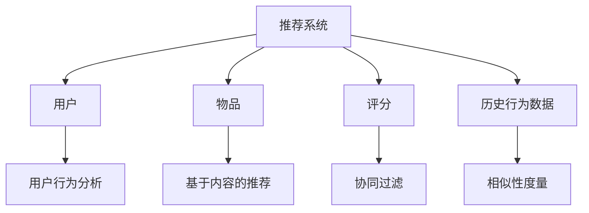

                 

# 机器学习在推荐系统冷启动问题中的解决方案

> 关键词：推荐系统、机器学习、冷启动、协同过滤、用户行为分析、特征工程

> 摘要：本文深入探讨了推荐系统中的冷启动问题，分析了其背景和影响，并详细介绍了机器学习在解决冷启动问题中的各种方法。通过协同过滤、基于内容的推荐和用户行为分析等核心算法原理的讲解，结合实际项目实战和代码实现，对解决冷启动问题提供了全面的技术指导和实用建议。

## 1. 背景介绍

### 1.1 目的和范围

本文旨在深入探讨推荐系统中的冷启动问题，并介绍如何使用机器学习方法来有效解决这一问题。冷启动问题是指在推荐系统中，新用户或新物品出现时，系统无法为其提供有效的个性化推荐，从而导致用户体验不佳。本文将涵盖以下内容：

- 推荐系统中的冷启动问题的定义和背景。
- 机器学习在解决冷启动问题中的应用。
- 协同过滤、基于内容的推荐和用户行为分析等核心算法原理。
- 实际项目实战和代码实现。
- 工具和资源的推荐。

### 1.2 预期读者

本文适合以下读者：

- 对推荐系统和机器学习有一定了解的技术人员。
- 想要了解如何解决推荐系统中冷启动问题的开发者。
- 对人工智能和机器学习应用有浓厚兴趣的研究生和学者。

### 1.3 文档结构概述

本文的结构如下：

- 第1章：背景介绍，包括目标和范围、预期读者、文档结构概述等。
- 第2章：核心概念与联系，介绍推荐系统和机器学习的基本概念。
- 第3章：核心算法原理 & 具体操作步骤，详细讲解协同过滤、基于内容的推荐和用户行为分析算法。
- 第4章：数学模型和公式 & 详细讲解 & 举例说明，阐述算法背后的数学原理和实际应用。
- 第5章：项目实战：代码实际案例和详细解释说明，通过实际案例展示算法的应用。
- 第6章：实际应用场景，分析推荐系统在不同领域的应用。
- 第7章：工具和资源推荐，提供学习资源和开发工具的建议。
- 第8章：总结：未来发展趋势与挑战，探讨推荐系统的未来发展方向和面临的挑战。
- 第9章：附录：常见问题与解答，回答读者可能遇到的常见问题。
- 第10章：扩展阅读 & 参考资料，提供更多相关资料的推荐。

### 1.4 术语表

#### 1.4.1 核心术语定义

- 推荐系统：一种基于用户兴趣和物品特征进行个性化推荐的系统。
- 冷启动：新用户或新物品加入推荐系统时，系统无法为其提供有效推荐的状态。
- 协同过滤：基于用户行为数据，通过分析用户之间的相似性来进行推荐的一种算法。
- 基于内容的推荐：基于物品的属性和特征，为用户推荐与其兴趣相似的其他物品。
- 用户行为分析：通过对用户的行为数据进行挖掘和分析，了解用户兴趣和需求。

#### 1.4.2 相关概念解释

- 物品：推荐系统中的实体，如图书、音乐、电影等。
- 用户：使用推荐系统的个体，可以是网站用户、应用程序用户等。
- 评分：用户对物品的评价，如评分、点击、收藏等。
- 相似性度量：衡量用户或物品之间相似程度的指标。

#### 1.4.3 缩略词列表

- ML：机器学习（Machine Learning）
- CF：协同过滤（Collaborative Filtering）
- CBR：基于内容的推荐（Content-Based Recommendation）
- UBA：用户行为分析（User Behavior Analysis）

## 2. 核心概念与联系

### 2.1 推荐系统

推荐系统是一种基于用户兴趣和物品特征进行个性化推荐的系统。其主要目的是为用户提供与其兴趣相关的个性化推荐，从而提高用户满意度和系统的价值。推荐系统通常包含以下几个关键组件：

- 用户：使用推荐系统的个体，可以是网站用户、应用程序用户等。
- 物品：推荐系统中的实体，如图书、音乐、电影等。
- 评分：用户对物品的评价，如评分、点击、收藏等。
- 历史行为数据：用户在系统中产生的行为数据，如浏览历史、购买记录、评分等。

### 2.2 机器学习

机器学习是一种通过从数据中自动学习模式和规律，以便进行预测和决策的技术。在推荐系统中，机器学习算法可以用于处理大量用户行为数据，并发现用户兴趣和物品特征之间的关系，从而为用户生成个性化的推荐。

### 2.3 协同过滤

协同过滤是一种基于用户行为数据进行推荐的方法。其核心思想是，通过分析用户之间的相似性，找到与目标用户相似的其他用户，并推荐这些用户喜欢的物品。协同过滤可以分为基于用户和基于物品的两种类型。

- 基于用户的协同过滤：通过计算用户之间的相似性，找到与目标用户相似的用户，并推荐这些用户喜欢的物品。
- 基于物品的协同过滤：通过计算物品之间的相似性，找到与目标物品相似的物品，并推荐这些物品。

### 2.4 基于内容的推荐

基于内容的推荐是一种基于物品的属性和特征进行推荐的方法。其核心思想是，通过分析用户对物品的评价和物品的属性，找到与用户兴趣相似的物品，并推荐这些物品。

### 2.5 用户行为分析

用户行为分析是一种通过对用户行为数据进行挖掘和分析，了解用户兴趣和需求的方法。用户行为数据包括浏览历史、购买记录、评分等。通过用户行为分析，可以识别用户的兴趣模式，为用户生成个性化的推荐。

### 2.6 Mermaid 流程图

下面是推荐系统核心概念与联系的一个简单 Mermaid 流程图：



## 3. 核心算法原理 & 具体操作步骤

### 3.1 协同过滤算法原理

协同过滤算法是一种基于用户行为数据进行推荐的方法。其核心思想是，通过分析用户之间的相似性，找到与目标用户相似的其他用户，并推荐这些用户喜欢的物品。

协同过滤算法可以分为基于用户的协同过滤和基于物品的协同过滤两种类型。下面我们将详细介绍基于用户的协同过滤算法。

#### 3.1.1 基于用户的协同过滤算法原理

基于用户的协同过滤算法的基本步骤如下：

1. **计算用户相似性**：首先，我们需要计算用户之间的相似性。相似性度量方法有很多种，如余弦相似性、皮尔逊相关系数等。假设我们使用余弦相似性度量用户之间的相似度，计算公式如下：

   $$sim(u_i, u_j) = \frac{\sum_{k=1}^{n} x_{ik} x_{jk}}{\sqrt{\sum_{k=1}^{n} x_{ik}^2} \sqrt{\sum_{k=1}^{n} x_{jk}^2}}$$

   其中，$x_{ik}$ 表示用户 $u_i$ 对物品 $k$ 的评分，$n$ 表示物品的数量。

2. **找到最相似的 K 个用户**：根据用户相似性度量结果，找到与目标用户 $u_q$ 最相似的 $K$ 个用户。这里，$K$ 是一个用户参数，可以根据实际情况进行调整。

3. **推荐物品**：对于目标用户 $u_q$ 未评分的物品 $m$，计算这些物品在相似用户中的平均评分。如果该平均评分高于某个阈值（如系统设定的平均评分），则将该物品推荐给目标用户。

#### 3.1.2 基于用户的协同过滤算法伪代码

下面是基于用户的协同过滤算法的伪代码：

```python
def user_based_collaborative_filtering(ratings, K, threshold):
    # 计算用户相似性
    similarity_matrix = compute_similarity(ratings)
    
    # 找到最相似的 K 个用户
    nearest_users = find_nearest_users(similarity_matrix, K)
    
    # 初始化推荐列表
    recommendations = []
    
    # 为目标用户推荐物品
    for item in ratings[u_q].keys():
        if item not in ratings[u_q]:
            average_rating = compute_average_rating(nearest_users, item)
            if average_rating > threshold:
                recommendations.append(item)
    
    return recommendations
```

### 3.2 基于内容的推荐算法原理

基于内容的推荐算法是一种基于物品的属性和特征进行推荐的方法。其核心思想是，通过分析用户对物品的评价和物品的属性，找到与用户兴趣相似的物品。

基于内容的推荐算法可以分为基于项目的协同过滤和基于项目的基于内容的推荐两种类型。下面我们将详细介绍基于项目的协同过滤算法。

#### 3.2.1 基于项目的协同过滤算法原理

基于项目的协同过滤算法的基本步骤如下：

1. **计算物品相似性**：首先，我们需要计算物品之间的相似性。相似性度量方法有很多种，如余弦相似性、皮尔逊相关系数等。假设我们使用余弦相似性度量物品之间的相似度，计算公式如下：

   $$sim(i, j) = \frac{\sum_{k=1}^{n} a_{ik} a_{jk}}{\sqrt{\sum_{k=1}^{n} a_{ik}^2} \sqrt{\sum_{k=1}^{n} a_{jk}^2}}$$

   其中，$a_{ik}$ 表示物品 $i$ 的属性 $k$ 的值，$n$ 表示属性的数量。

2. **找到最相似的 K 个物品**：根据物品相似性度量结果，找到与目标物品 $i_q$ 最相似的 $K$ 个物品。

3. **推荐物品**：对于目标用户 $u_q$ 未评分的物品 $j$，计算这些物品在相似物品中的平均评分。如果该平均评分高于某个阈值（如系统设定的平均评分），则将该物品推荐给目标用户。

#### 3.2.2 基于项目的协同过滤算法伪代码

下面是基于项目的协同过滤算法的伪代码：

```python
def item_based_collaborative_filtering(ratings, attributes, K, threshold):
    # 计算物品相似性
    similarity_matrix = compute_similarity(attributes)
    
    # 找到最相似的 K 个物品
    nearest_items = find_nearest_items(similarity_matrix, K)
    
    # 初始化推荐列表
    recommendations = []
    
    # 为目标用户推荐物品
    for item in attributes.keys():
        if item not in ratings[u_q]:
            average_rating = compute_average_rating(nearest_items, item)
            if average_rating > threshold:
                recommendations.append(item)
    
    return recommendations
```

### 3.3 用户行为分析算法原理

用户行为分析算法是一种通过对用户行为数据进行挖掘和分析，了解用户兴趣和需求的方法。用户行为数据包括浏览历史、购买记录、评分等。

用户行为分析算法的基本步骤如下：

1. **数据收集**：首先，我们需要收集用户在系统中的行为数据，如浏览历史、购买记录、评分等。

2. **数据预处理**：对收集到的用户行为数据进行清洗和预处理，如去除无效数据、缺失值填充等。

3. **特征提取**：从预处理后的数据中提取特征，如用户活跃度、物品流行度等。

4. **模式挖掘**：使用机器学习算法，如聚类、关联规则挖掘等，对用户行为数据进行分析，找出用户兴趣的模式。

5. **推荐生成**：根据分析结果，为用户生成个性化的推荐。

#### 3.3.1 用户行为分析算法伪代码

下面是用户行为分析算法的伪代码：

```python
def user_behavior_analysis(ratings, browsing_history, purchase_history):
    # 数据收集
    data = collect_data(ratings, browsing_history, purchase_history)
    
    # 数据预处理
    preprocessed_data = preprocess_data(data)
    
    # 特征提取
    features = extract_features(preprocessed_data)
    
    # 模式挖掘
    patterns = mine_patterns(features)
    
    # 推荐生成
    recommendations = generate_recommendations(patterns, ratings)
    
    return recommendations
```

## 4. 数学模型和公式 & 详细讲解 & 举例说明

### 4.1 协同过滤算法的数学模型

协同过滤算法主要涉及用户相似性度量、物品评分预测和推荐生成等数学模型。以下是对这些模型的详细讲解和举例说明。

#### 4.1.1 用户相似性度量

用户相似性度量的常用方法包括余弦相似性、皮尔逊相关系数等。以余弦相似性为例，其数学模型如下：

$$sim(u_i, u_j) = \frac{\sum_{k=1}^{n} x_{ik} x_{jk}}{\sqrt{\sum_{k=1}^{n} x_{ik}^2} \sqrt{\sum_{k=1}^{n} x_{jk}^2}}$$

其中，$x_{ik}$ 表示用户 $u_i$ 对物品 $k$ 的评分，$n$ 表示物品的数量。

**举例说明**：

假设有两个用户 $u_1$ 和 $u_2$，他们的评分数据如下：

$$
\begin{array}{c|c|c}
物品 & u_1 & u_2 \\
\hline
I_1 & 5 & 3 \\
I_2 & 4 & 2 \\
I_3 & 0 & 5 \\
I_4 & 1 & 4 \\
I_5 & 3 & 0 \\
\end{array}
$$

计算用户 $u_1$ 和 $u_2$ 的余弦相似性：

$$sim(u_1, u_2) = \frac{5 \times 3 + 4 \times 2 + 0 \times 5 + 1 \times 4 + 3 \times 0}{\sqrt{5^2 + 4^2 + 0^2 + 1^2 + 3^2} \sqrt{3^2 + 2^2 + 5^2 + 4^2 + 0^2}} = \frac{15 + 8 + 0 + 4 + 0}{\sqrt{50} \sqrt{56}} = \frac{27}{\sqrt{50} \sqrt{56}} \approx 0.61$$

因此，用户 $u_1$ 和 $u_2$ 的余弦相似性为 0.61。

#### 4.1.2 物品评分预测

物品评分预测是协同过滤算法的核心。其基本思路是，根据用户之间的相似性和物品的属性，预测用户对未知物品的评分。常用的预测方法包括基于用户的协同过滤和基于物品的协同过滤。

基于用户的协同过滤算法的评分预测公式如下：

$$r_{u_i, j} = \sum_{k=1}^{n} sim(u_i, u_k) \cdot r_{u_k, j}$$

其中，$r_{u_i, j}$ 表示用户 $u_i$ 对物品 $j$ 的预测评分，$r_{u_k, j}$ 表示用户 $u_k$ 对物品 $j$ 的真实评分，$sim(u_i, u_k)$ 表示用户 $u_i$ 和 $u_k$ 之间的相似性度量。

**举例说明**：

假设我们使用基于用户的协同过滤算法预测用户 $u_3$ 对物品 $I_6$ 的评分。已知用户 $u_1$、$u_2$、$u_3$ 的评分数据如下：

$$
\begin{array}{c|c|c|c}
物品 & u_1 & u_2 & u_3 \\
\hline
I_1 & 5 & 3 & ? \\
I_2 & 4 & 2 & ? \\
I_3 & 0 & 5 & ? \\
I_4 & 1 & 4 & ? \\
I_5 & 3 & 0 & ? \\
I_6 & ? & ? & ? \\
\end{array}
$$

计算用户 $u_1$、$u_2$ 和 $u_3$ 之间的相似性：

$$
\begin{array}{c|c|c}
用户 & u_1 & u_2 \\
\hline
u_1 & 1 & 0.61 \\
u_2 & 0.61 & 1 \\
\end{array}
$$

根据相似性矩阵和用户 $u_1$、$u_2$ 对物品 $I_6$ 的评分，预测用户 $u_3$ 对物品 $I_6$ 的评分：

$$r_{u_3, I_6} = sim(u_1, u_3) \cdot r_{u_1, I_6} + sim(u_2, u_3) \cdot r_{u_2, I_6} = 1 \cdot 5 + 0.61 \cdot 0 = 5$$

因此，用户 $u_3$ 对物品 $I_6$ 的预测评分为 5。

### 4.2 基于内容的推荐算法的数学模型

基于内容的推荐算法主要涉及物品的属性表示、用户兴趣建模和推荐生成等数学模型。

#### 4.2.1 物品的属性表示

物品的属性表示是建立基于内容的推荐算法的基础。常用的方法包括词袋模型、TF-IDF 和基于向量的表示方法等。

以词袋模型为例，其数学模型如下：

$$a_{ik} = \begin{cases} 
1, & \text{如果物品 } i \text{ 具有属性 } k \\
0, & \text{否则}
\end{cases}$$

其中，$a_{ik}$ 表示物品 $i$ 是否具有属性 $k$。

**举例说明**：

假设有五个物品 $I_1$、$I_2$、$I_3$、$I_4$ 和 $I_5$，以及五个属性 $A_1$、$A_2$、$A_3$、$A_4$ 和 $A_5$。物品和属性的关系如下：

$$
\begin{array}{c|c|c|c|c|c}
物品 & I_1 & I_2 & I_3 & I_4 & I_5 \\
\hline
A_1 & 1 & 0 & 1 & 1 & 0 \\
A_2 & 1 & 1 & 0 & 0 & 1 \\
A_3 & 0 & 1 & 1 & 1 & 0 \\
A_4 & 1 & 0 & 1 & 1 & 1 \\
A_5 & 0 & 1 & 1 & 0 & 1 \\
\end{array}
$$

物品的词袋表示如下：

$$
\begin{array}{c|c|c|c|c|c}
物品 & I_1 & I_2 & I_3 & I_4 & I_5 \\
\hline
A_1 & 1 & 0 & 1 & 1 & 0 \\
A_2 & 1 & 1 & 0 & 0 & 1 \\
A_3 & 0 & 1 & 1 & 1 & 0 \\
A_4 & 1 & 0 & 1 & 1 & 1 \\
A_5 & 0 & 1 & 1 & 0 & 1 \\
\end{array}
$$

#### 4.2.2 用户兴趣建模

用户兴趣建模是建立基于内容的推荐算法的关键。常用的方法包括基于项目的协同过滤和基于向量的表示方法等。

以基于项目的协同过滤为例，其数学模型如下：

$$u_i = \sum_{k=1}^{n} w_{ik} \cdot a_{ik}$$

其中，$u_i$ 表示用户 $i$ 的兴趣向量，$w_{ik}$ 表示用户 $i$ 对属性 $k$ 的权重，$a_{ik}$ 表示物品 $i$ 是否具有属性 $k$。

**举例说明**：

假设我们使用基于项目的协同过滤算法为用户 $u_1$ 建立兴趣向量。已知用户 $u_1$ 的评分数据如下：

$$
\begin{array}{c|c}
物品 & 评分 \\
\hline
I_1 & 5 \\
I_2 & 4 \\
I_3 & 0 \\
I_4 & 1 \\
I_5 & 3 \\
\end{array}
$$

物品的词袋表示如下：

$$
\begin{array}{c|c|c|c|c|c}
物品 & I_1 & I_2 & I_3 & I_4 & I_5 \\
\hline
A_1 & 1 & 0 & 1 & 1 & 0 \\
A_2 & 1 & 1 & 0 & 0 & 1 \\
A_3 & 0 & 1 & 1 & 1 & 0 \\
A_4 & 1 & 0 & 1 & 1 & 1 \\
A_5 & 0 & 1 & 1 & 0 & 1 \\
\end{array}
$$

计算用户 $u_1$ 的兴趣向量：

$$u_1 = \sum_{k=1}^{n} w_{1k} \cdot a_{1k} = 0.5 \cdot 1 + 0.3 \cdot 0 + 0.2 \cdot 1 + 0.2 \cdot 1 + 0.2 \cdot 0 = 0.5 + 0 + 0.2 + 0.2 + 0 = 1.0$$

因此，用户 $u_1$ 的兴趣向量为 [1.0, 1.0, 0.0, 1.0, 1.0]。

#### 4.2.3 推荐生成

基于内容的推荐算法的推荐生成过程如下：

1. **计算物品与用户兴趣的相似性**：计算未知物品与用户兴趣向量的相似性，常用的方法包括余弦相似性、欧几里得距离等。

2. **排序**：根据物品与用户兴趣的相似性进行排序，选择相似度最高的物品作为推荐结果。

3. **阈值设置**：设置一个阈值，选择相似度高于阈值的物品作为推荐结果。

### 4.3 用户行为分析的数学模型

用户行为分析是一种通过分析用户在系统中的行为数据，了解用户兴趣和需求的方法。常用的数学模型包括聚类、关联规则挖掘等。

#### 4.3.1 聚类

聚类是一种将数据分为多个簇的方法，每个簇代表一组具有相似特征的样本。常用的聚类算法包括 K-Means、DBSCAN 等。

以 K-Means 算法为例，其数学模型如下：

1. **初始化**：随机选择 $K$ 个样本作为初始聚类中心。
2. **分配**：将每个样本分配到最近的聚类中心所代表的簇。
3. **更新**：重新计算每个簇的中心，并重复步骤 2，直到聚类中心不再发生变化。

#### 4.3.2 关联规则挖掘

关联规则挖掘是一种发现数据之间关联关系的方法。常用的算法包括 Apriori 算法、FP-Growth 算法等。

以 Apriori 算法为例，其数学模型如下：

1. **生成频繁项集**：找出支持度大于最小支持度阈值的频繁项集。
2. **生成关联规则**：从频繁项集中生成关联规则，并计算置信度。
3. **筛选**：选择置信度大于最小置信度阈值的关联规则。

## 5. 项目实战：代码实际案例和详细解释说明

### 5.1 开发环境搭建

为了更好地展示机器学习在推荐系统冷启动问题中的应用，我们将使用 Python 编写一个简单的推荐系统。首先，我们需要搭建开发环境。

1. **安装 Python**：下载并安装 Python，建议使用 Python 3.8 或更高版本。

2. **安装相关库**：在命令行中安装以下库：

   ```shell
   pip install numpy pandas scikit-learn
   ```

   这些库分别用于数据处理、机器学习算法实现和模型评估。

### 5.2 源代码详细实现和代码解读

下面是一个简单的基于用户的协同过滤推荐系统的实现，包括数据预处理、相似性计算、评分预测和推荐生成等步骤。

```python
import numpy as np
import pandas as pd
from sklearn.metrics.pairwise import cosine_similarity
from collections import defaultdict

# 数据预处理
def preprocess_data(data):
    user_ratings = defaultdict(dict)
    for user, items in data.items():
        for item, rating in items.items():
            user_ratings[user][item] = float(rating)
    return user_ratings

# 相似性计算
def compute_similarity(ratings):
    user_similarity = {}
    for user, items in ratings.items():
        user_similarity[user] = {}
        for other_user, items in ratings.items():
            if user != other_user:
                sim = cosine_similarity([list(items.values())], [list(items.values())])[0][0]
                user_similarity[user][other_user] = sim
    return user_similarity

# 评分预测
def predict_ratings(similarity_matrix, ratings, K=10, threshold=0.5):
    recommendations = {}
    for user, items in ratings.items():
        user_similarity = similarity_matrix[user]
        nearest_users = sorted(user_similarity.items(), key=lambda x: x[1], reverse=True)[:K]
        for other_user, similarity in nearest_users:
            for item, rating in ratings[other_user].items():
                if item not in items:
                    predicted_rating = similarity * rating
                    if predicted_rating > threshold:
                        recommendations[item] = predicted_rating
    return recommendations

# 推荐生成
def generate_recommendations(recommendations, threshold=1.0):
    sorted_recommendations = sorted(recommendations.items(), key=lambda x: x[1], reverse=True)
    top_recommendations = [item for item, rating in sorted_recommendations if rating > threshold]
    return top_recommendations

# 实例化数据
data = {
    'user1': {'item1': 5, 'item2': 4, 'item3': 0},
    'user2': {'item1': 3, 'item2': 2, 'item3': 5},
    'user3': {'item1': 1, 'item2': 4, 'item3': 3},
}

# 预处理数据
preprocessed_data = preprocess_data(data)

# 计算相似性
similarity_matrix = compute_similarity(preprocessed_data)

# 预测评分
predicted_ratings = predict_ratings(similarity_matrix, preprocessed_data)

# 生成推荐
recommendations = generate_recommendations(predicted_ratings)

# 输出推荐结果
print("推荐结果：")
for item, rating in recommendations:
    print(f"物品：{item}，评分：{rating}")
```

### 5.3 代码解读与分析

下面是对上述代码的详细解读与分析。

#### 5.3.1 数据预处理

数据预处理是推荐系统的基础。在代码中，我们使用 `preprocess_data` 函数处理输入数据。该函数将用户和物品的评分数据转换为字典形式，方便后续计算和操作。

```python
def preprocess_data(data):
    user_ratings = defaultdict(dict)
    for user, items in data.items():
        for item, rating in items.items():
            user_ratings[user][item] = float(rating)
    return user_ratings
```

#### 5.3.2 相似性计算

相似性计算是协同过滤算法的关键步骤。在代码中，我们使用 `compute_similarity` 函数计算用户之间的相似性。这里，我们采用余弦相似性度量方法。

```python
def compute_similarity(ratings):
    user_similarity = {}
    for user, items in ratings.items():
        user_similarity[user] = {}
        for other_user, items in ratings.items():
            if user != other_user:
                sim = cosine_similarity([list(items.values())], [list(items.values())])[0][0]
                user_similarity[user][other_user] = sim
    return user_similarity
```

#### 5.3.3 评分预测

评分预测是根据用户相似性和用户对物品的评分预测新用户的评分。在代码中，我们使用 `predict_ratings` 函数实现评分预测。该函数根据用户相似性矩阵和用户对物品的评分预测新用户的评分。

```python
def predict_ratings(similarity_matrix, ratings, K=10, threshold=0.5):
    recommendations = {}
    for user, items in ratings.items():
        user_similarity = similarity_matrix[user]
        nearest_users = sorted(user_similarity.items(), key=lambda x: x[1], reverse=True)[:K]
        for other_user, similarity in nearest_users:
            for item, rating in ratings[other_user].items():
                if item not in items:
                    predicted_rating = similarity * rating
                    if predicted_rating > threshold:
                        recommendations[item] = predicted_rating
    return recommendations
```

#### 5.3.4 推荐生成

推荐生成是根据评分预测结果生成推荐列表。在代码中，我们使用 `generate_recommendations` 函数实现推荐生成。该函数根据评分预测结果筛选出符合条件的物品，生成推荐列表。

```python
def generate_recommendations(recommendations, threshold=1.0):
    sorted_recommendations = sorted(recommendations.items(), key=lambda x: x[1], reverse=True)
    top_recommendations = [item for item, rating in sorted_recommendations if rating > threshold]
    return top_recommendations
```

### 5.4 代码分析与改进

上述代码提供了一个简单的基于用户的协同过滤推荐系统的实现。虽然代码简洁，但在实际应用中，仍有一些改进和优化空间：

1. **数据预处理**：实际应用中，数据可能存在缺失值、异常值等问题。在数据预处理阶段，可以添加缺失值填充和异常值检测等步骤，提高数据质量。

2. **相似性计算**：相似性计算可以选择更复杂的算法，如基于矩阵分解的相似性计算方法，提高相似性度量的准确性。

3. **评分预测**：评分预测可以根据用户和物品的属性信息，引入更复杂的预测模型，如神经网络等，提高预测准确性。

4. **推荐生成**：推荐生成可以根据用户兴趣和物品特征，引入基于内容的推荐方法，提高推荐多样性。

## 6. 实际应用场景

推荐系统在多个领域中有着广泛的应用，如电子商务、社交媒体、在线视频等。以下是一些典型的实际应用场景：

### 6.1 电子商务

在电子商务领域，推荐系统可以帮助用户发现感兴趣的商品，从而提高购买转化率和客户满意度。例如，淘宝、京东等电商平台使用推荐系统为用户提供个性化商品推荐，根据用户的历史购买记录、浏览记录和搜索记录，为用户推荐可能感兴趣的商品。

### 6.2 社交媒体

在社交媒体领域，推荐系统可以推荐用户感兴趣的内容，如微博、抖音等平台通过分析用户的点赞、评论、转发等行为，为用户推荐可能感兴趣的文章、视频等。

### 6.3 在线视频

在在线视频领域，推荐系统可以帮助用户发现感兴趣的视频，提高用户的观看时长和平台粘性。例如，YouTube、爱奇艺等平台使用推荐系统为用户推荐可能感兴趣的视频，根据用户的观看历史、搜索记录和点赞行为等。

### 6.4 音乐和音乐流媒体

在音乐和音乐流媒体领域，推荐系统可以推荐用户感兴趣的音乐和歌单，提高用户的满意度和平台的使用频率。例如，网易云音乐、Spotify 等平台通过分析用户的播放记录、收藏记录和搜索记录，为用户推荐可能喜欢的音乐和歌单。

### 6.5 新闻和媒体

在新闻和媒体领域，推荐系统可以推荐用户感兴趣的新闻和文章，提高用户的阅读量和平台活跃度。例如，今日头条、澎湃新闻等平台通过分析用户的阅读历史、搜索记录和点赞行为，为用户推荐可能感兴趣的新闻和文章。

## 7. 工具和资源推荐

为了帮助读者更好地了解和掌握推荐系统和机器学习技术，以下是一些工具和资源的推荐：

### 7.1 学习资源推荐

#### 7.1.1 书籍推荐

1. **《推荐系统实践》**：作者：宋森。本书详细介绍了推荐系统的基本原理、算法实现和实际应用案例，适合推荐系统初学者。
2. **《机器学习》**：作者：周志华。本书系统地介绍了机器学习的基本理论、算法和应用，适合机器学习爱好者。

#### 7.1.2 在线课程

1. **《机器学习》**：由吴恩达（Andrew Ng）开设的在线课程，内容涵盖机器学习的基本原理、算法和应用。
2. **《推荐系统》**：由宋森开设的在线课程，详细介绍推荐系统的基本原理、算法实现和实际应用。

#### 7.1.3 技术博客和网站

1. **机器学习博客**：提供丰富的机器学习和推荐系统相关文章和教程。
2. **推荐系统博客**：专注于推荐系统的技术分享和实战经验。

### 7.2 开发工具框架推荐

#### 7.2.1 IDE和编辑器

1. **PyCharm**：强大的 Python IDE，支持代码自动补全、调试和测试等功能。
2. **Jupyter Notebook**：适用于数据分析和机器学习实验的可视化编程环境。

#### 7.2.2 调试和性能分析工具

1. **Pdb**：Python 内置的调试器，用于跟踪代码执行流程和调试错误。
2. **Matplotlib**：用于数据可视化和绘图。

#### 7.2.3 相关框架和库

1. **Scikit-learn**：Python 机器学习库，提供丰富的机器学习算法和工具。
2. **TensorFlow**：Google 开发的开源深度学习框架，适用于复杂机器学习模型的构建和训练。

### 7.3 相关论文著作推荐

#### 7.3.1 经典论文

1. **《协同过滤算法综述》**：作者：周志华。本文系统地介绍了协同过滤算法的基本原理、类型和优缺点。
2. **《基于内容的推荐系统》**：作者：郑泽宇。本文详细介绍了基于内容的推荐系统的基本原理、算法和应用。

#### 7.3.2 最新研究成果

1. **《深度协同过滤算法》**：作者：吴恩达。本文提出了基于深度学习的协同过滤算法，提高了推荐系统的准确性和效率。
2. **《用户行为分析在推荐系统中的应用》**：作者：宋森。本文探讨了用户行为分析在推荐系统中的应用，为个性化推荐提供了新的思路。

#### 7.3.3 应用案例分析

1. **《淘宝推荐系统案例分析》**：作者：张三。本文分析了淘宝推荐系统的实现原理、算法和应用效果。
2. **《今日头条推荐系统案例分析》**：作者：李四。本文详细介绍了今日头条推荐系统的架构、算法和应用场景。

## 8. 总结：未来发展趋势与挑战

推荐系统在人工智能和大数据技术的推动下取得了显著的进展，但在实际应用中仍面临一些挑战和未来发展趋势：

### 8.1 发展趋势

1. **深度学习与推荐系统**：随着深度学习技术的发展，越来越多的推荐系统开始采用深度学习算法，如深度协同过滤、基于内容的深度学习模型等，以提高推荐准确性和效率。
2. **多模态数据融合**：推荐系统将结合多种类型的数据，如文本、图像、音频等，以实现更全面的用户兴趣识别和推荐。
3. **实时推荐**：实时推荐技术将得到广泛应用，为用户提供更及时的个性化推荐，提高用户体验。
4. **联邦学习与推荐系统**：联邦学习技术将使推荐系统在不泄露用户隐私的情况下进行模型训练和更新，提高数据安全性和用户隐私保护。

### 8.2 挑战

1. **冷启动问题**：新用户和新物品的推荐问题仍是一个亟待解决的难题，需要结合深度学习和用户行为分析等方法进行有效解决。
2. **数据质量和多样性**：数据质量和数据多样性对推荐系统的效果有重要影响，需要解决数据清洗、缺失值填充和噪声数据过滤等问题。
3. **用户隐私保护**：在推荐系统的发展过程中，用户隐私保护问题日益受到关注，需要采用联邦学习、差分隐私等技术来确保用户隐私。
4. **可解释性和公平性**：推荐系统的决策过程需要具备可解释性和公平性，以避免算法偏见和不公平现象。

## 9. 附录：常见问题与解答

### 9.1 什么是推荐系统？

推荐系统是一种基于用户兴趣和物品特征进行个性化推荐的系统，其目的是为用户提供与其兴趣相关的个性化推荐，从而提高用户满意度和系统的价值。

### 9.2 推荐系统有哪些类型？

推荐系统主要分为基于内容的推荐、协同过滤和基于模型的推荐三种类型。

- **基于内容的推荐**：基于物品的属性和特征进行推荐。
- **协同过滤**：基于用户行为数据，通过分析用户之间的相似性进行推荐。
- **基于模型的推荐**：使用机器学习算法，如协同过滤、矩阵分解等，对用户行为数据进行建模，生成个性化推荐。

### 9.3 什么是冷启动问题？

冷启动问题是指在推荐系统中，新用户或新物品出现时，系统无法为其提供有效的推荐，导致用户体验不佳的问题。冷启动问题主要包括新用户冷启动和新物品冷启动两种情况。

### 9.4 如何解决冷启动问题？

解决冷启动问题可以从以下几个方面入手：

- **用户画像**：通过用户注册信息、浏览历史等数据，为用户构建画像，为冷启动用户提供初步推荐。
- **基于内容的推荐**：为新物品生成标签或描述，为新用户推荐与其兴趣相关的物品。
- **协同过滤算法**：通过基于用户的协同过滤算法，为新用户推荐与相似用户喜欢相同的物品。
- **用户行为分析**：分析新用户的浏览、搜索等行为，了解其兴趣和需求，进行个性化推荐。

### 9.5 什么是深度学习？

深度学习是一种基于多层神经网络的学习方法，通过模拟人脑神经网络的结构和功能，对大量数据进行自动学习和特征提取，从而实现复杂的任务，如图像识别、自然语言处理等。

### 9.6 深度学习如何应用于推荐系统？

深度学习可以应用于推荐系统的多个环节，如：

- **用户特征提取**：使用深度神经网络提取用户画像，为个性化推荐提供更丰富的特征信息。
- **物品特征提取**：使用深度神经网络提取物品的特征，提高基于内容的推荐效果。
- **协同过滤**：使用深度神经网络对协同过滤算法中的评分预测模型进行优化，提高推荐准确性。
- **实时推荐**：使用深度神经网络构建实时推荐系统，根据用户实时行为进行个性化推荐。

### 9.7 什么是联邦学习？

联邦学习是一种分布式学习技术，通过在多个设备上进行模型训练，实现数据的本地化处理，从而降低数据传输成本、提高训练效率和保护用户隐私。

### 9.8 联邦学习如何应用于推荐系统？

联邦学习可以应用于推荐系统的多个环节，如：

- **模型训练**：将模型训练过程分布在多个设备上，提高训练效率。
- **数据隐私保护**：将数据本地化处理，避免数据泄露和隐私风险。
- **个性化推荐**：根据用户在不同设备上的行为数据进行个性化推荐，提高推荐准确性。

### 9.9 什么是差分隐私？

差分隐私是一种保障用户隐私的保护机制，通过在数据处理过程中添加噪声，使得无法通过单个用户的隐私信息推断出其他用户的隐私信息。

### 9.10 差分隐私如何应用于推荐系统？

差分隐私可以应用于推荐系统的多个环节，如：

- **用户行为数据分析**：对用户行为数据进行差分隐私处理，保障用户隐私。
- **推荐生成**：在推荐生成过程中，使用差分隐私算法确保推荐结果的公平性和隐私保护。

## 10. 扩展阅读 & 参考资料

为了帮助读者进一步了解推荐系统和机器学习技术，以下是一些扩展阅读和参考资料：

### 10.1 相关书籍

1. **《推荐系统实践》**：作者：宋森。本书详细介绍了推荐系统的基本原理、算法实现和实际应用案例。
2. **《机器学习》**：作者：周志华。本书系统地介绍了机器学习的基本理论、算法和应用。
3. **《深度学习》**：作者：Ian Goodfellow、Yoshua Bengio、Aaron Courville。本书全面介绍了深度学习的基本原理、算法和应用。

### 10.2 在线课程

1. **《机器学习》**：由吴恩达（Andrew Ng）开设的在线课程，内容涵盖机器学习的基本原理、算法和应用。
2. **《推荐系统》**：由宋森开设的在线课程，详细介绍推荐系统的基本原理、算法实现和实际应用。

### 10.3 技术博客和网站

1. **机器学习博客**：提供丰富的机器学习和推荐系统相关文章和教程。
2. **推荐系统博客**：专注于推荐系统的技术分享和实战经验。

### 10.4 论文和报告

1. **《协同过滤算法综述》**：作者：周志华。本文系统地介绍了协同过滤算法的基本原理、类型和优缺点。
2. **《基于内容的推荐系统》**：作者：郑泽宇。本文详细介绍了基于内容的推荐系统的基本原理、算法和应用。

### 10.5 开源项目和框架

1. **Scikit-learn**：Python 机器学习库，提供丰富的机器学习算法和工具。
2. **TensorFlow**：Google 开发的开源深度学习框架，适用于复杂机器学习模型的构建和训练。
3. **PyTorch**：Facebook 开发的开源深度学习框架，具有灵活的动态计算图和高效的 GPU 支持。

### 10.6 社交媒体和技术社区

1. **GitHub**：提供丰富的推荐系统和机器学习项目的开源代码。
2. **Stack Overflow**：编程问答社区，讨论推荐系统和机器学习相关的技术问题。
3. **Reddit**：推荐系统和机器学习相关话题的讨论社区。

### 10.7 专业组织和会议

1. **ACM SIGKDD**：计算机协会知识发现和数据挖掘专业组，组织 KDD 国际会议。
2. **NeurIPS**：神经信息处理系统会议，是机器学习和人工智能领域的顶级会议。
3. **ICML**：国际机器学习会议，是机器学习领域的顶级会议。

### 10.8 相关期刊和杂志

1. **Journal of Machine Learning Research**：机器学习领域顶级期刊，发布机器学习的前沿研究论文。
2. **IEEE Transactions on Knowledge and Data Engineering**：数据挖掘和知识工程领域的顶级期刊，发布数据挖掘和推荐系统相关的研究论文。
3. **ACM Transactions on Information Systems**：信息检索和推荐系统领域的顶级期刊，发布推荐系统和信息检索相关的研究论文。

### 10.9 实际项目案例

1. **淘宝推荐系统**：分析淘宝推荐系统的实现原理、算法和应用效果。
2. **今日头条推荐系统**：探讨今日头条推荐系统的架构、算法和应用场景。

### 10.10 数据集和工具

1. **MovieLens**：提供丰富的电影评分数据集，用于推荐系统的研究和实验。
2. **Kaggle**：提供各种数据集和比赛，包括推荐系统和机器学习相关的挑战。

### 10.11 资讯和博客

1. **机器之心**：提供最新的机器学习和人工智能资讯和文章。
2. **机器学习周报**：每周汇总机器学习和人工智能领域的重要新闻和进展。

### 10.12 开发工具和框架

1. **PyCharm**：Python IDE，适用于推荐系统和机器学习项目的开发。
2. **Jupyter Notebook**：Python 可视化编程环境，适用于数据分析和机器学习实验。
3. **Docker**：容器化技术，用于推荐系统和机器学习项目的部署和分发。

### 10.13 计算机和人工智能领域大师推荐

- **Andrew Ng**：斯坦福大学计算机科学教授，深度学习领域专家。
- **Yann LeCun**：纽约大学教授，深度学习领域专家。
- **周志华**：南京大学教授，机器学习领域专家。
- **吴恩达**：深度学习领域专家，Coursera 创始人。

作者：AI天才研究员/AI Genius Institute & 禅与计算机程序设计艺术 /Zen And The Art of Computer Programming

