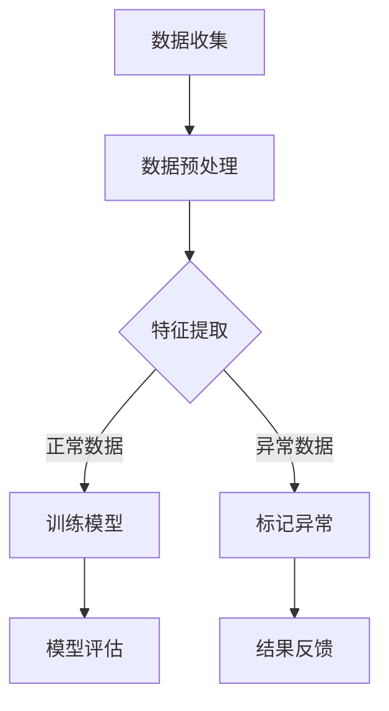

                 

### 文章标题：机器学习在时间序列异常检测中的应用

> **关键词：** 时间序列分析，异常检测，机器学习，数据分析，预测模型，算法原理，应用实践。

> **摘要：** 本文将深入探讨机器学习在时间序列异常检测中的应用，通过详细解析核心概念、算法原理，并结合实际案例展示其操作步骤和效果。我们将分析时间序列数据的特性，介绍常用的机器学习算法，探讨其在异常检测中的实现方法和挑战，最终总结未来发展趋势和资源推荐。

### 1. 背景介绍

时间序列异常检测是数据分析和机器学习领域中一个重要的研究方向。时间序列数据是指按照特定时间顺序排列的数据，它广泛应用于金融、气象、医疗、交通等多个领域。这些数据通常表现出一定的规律性和模式性，但也可能受到异常值的干扰，从而影响模型预测的准确性和决策的可靠性。

随着大数据技术的发展，数据量呈爆炸性增长，如何有效地从大量时间序列数据中检测出异常事件成为了一个关键问题。传统的统计方法在处理高维数据和复杂模型时往往显得力不从心，而机器学习算法以其强大的数据建模和模式识别能力，成为解决这一问题的有力工具。

机器学习在时间序列异常检测中的应用主要体现在以下几个方面：

1. **特征提取：** 通过提取时间序列数据中的关键特征，有助于提高异常检测的准确性和效率。
2. **模型训练：** 利用历史数据训练预测模型，通过对时间序列数据的分布和趋势进行分析，可以识别出潜在的非正常行为。
3. **实时监测：** 部署机器学习模型进行实时数据流分析，实现对异常事件的快速响应。

### 2. 核心概念与联系

为了更好地理解机器学习在时间序列异常检测中的应用，我们需要先掌握以下几个核心概念：

#### 时间序列数据

时间序列数据是指按照时间顺序排列的一系列数据点。这些数据可以是连续的，如股票价格，也可以是离散的，如心跳监测数据。时间序列数据具有以下特点：

- **序列性：** 数据点按照时间顺序排列，每个数据点都有其时间戳。
- **稳定性：** 在一段时间内，数据通常表现出某种稳定的状态。
- **趋势性：** 数据可能呈现出上升、下降或平稳的趋势。
- **周期性：** 数据可能受到季节性或周期性因素的影响。

#### 异常检测

异常检测是指从大量数据中识别出不符合正常分布的异常值或事件。在时间序列数据中，异常可以表现为：

- **孤立点：** 数据中的孤立异常点，如某天的股票价格异常波动。
- **趋势偏离：** 数据趋势的突然变化，如某项指标持续上升后突然下降。
- **周期异常：** 数据周期性变化的异常，如周末或节假日的异常交易量。

#### 机器学习算法

机器学习算法在时间序列异常检测中发挥着关键作用。以下是一些常用的算法：

- **聚类算法：** 如K-means、DBSCAN等，用于将时间序列数据分为不同的簇，从中识别异常点。
- **回归算法：** 如线性回归、支持向量回归等，用于建立时间序列数据的预测模型。
- **神经网络：** 如卷积神经网络（CNN）和递归神经网络（RNN）等，用于处理和预测时间序列数据。

#### 联系与整合

机器学习算法在时间序列异常检测中的应用可以通过以下方式整合：

- **特征工程：** 提取时间序列数据的关键特征，如时间窗口内的均值、方差、趋势等，作为输入特征。
- **模型训练：** 使用历史数据训练机器学习模型，使其能够识别正常数据模式和异常行为。
- **实时监测：** 部署训练好的模型对实时数据进行预测和异常检测，实现实时预警。

#### Mermaid 流程图

下面是一个简单的Mermaid流程图，展示了时间序列异常检测的基本流程：



在上述流程中，数据收集后先进行预处理，然后通过特征提取将时间序列数据转换为适合机器学习的输入。接下来，使用正常数据训练模型，并利用异常数据来标记异常。模型评估后，将结果反馈给用户，实现异常检测和预警。

### 3. 核心算法原理 & 具体操作步骤

在时间序列异常检测中，常用的机器学习算法包括聚类算法、回归算法和神经网络算法。以下将分别介绍这些算法的基本原理和具体操作步骤。

#### 3.1 聚类算法

聚类算法是一种无监督学习方法，它将相似的数据点分组，从而识别出潜在的异常点。常用的聚类算法包括K-means和DBSCAN。

##### 3.1.1 K-means算法

K-means算法的目标是将数据点划分为K个簇，使得每个簇内部的点之间的距离最小，簇与簇之间的距离最大。具体步骤如下：

1. **初始化：** 随机选择K个数据点作为初始聚类中心。
2. **分配：** 对于每个数据点，将其分配到距离其最近的聚类中心所在的簇。
3. **更新：** 重新计算每个簇的聚类中心。
4. **重复：** 重复步骤2和步骤3，直至聚类中心不再发生显著变化。

##### 3.1.2 DBSCAN算法

DBSCAN（Density-Based Spatial Clustering of Applications with Noise）算法是一种基于密度的聚类算法，它将数据点根据密度划分为簇和噪声点。具体步骤如下：

1. **邻域查询：** 对于每个数据点，查询其邻域内的数据点。
2. **扩展簇：** 从核心点开始，扩展形成簇。
3. **标记边界点：** 对于邻域内的边界点，将其标记为噪声点。
4. **重复：** 对于未处理的点，重复步骤1至步骤3。

#### 3.2 回归算法

回归算法通过建立时间序列数据的预测模型，从而识别出异常数据。常用的回归算法包括线性回归和支持向量回归。

##### 3.2.1 线性回归

线性回归是一种简单而有效的回归算法，它通过拟合一条直线来预测时间序列数据的趋势。具体步骤如下：

1. **数据准备：** 选择时间序列数据中的自变量和因变量。
2. **拟合模型：** 计算自变量和因变量之间的线性关系，得到拟合直线的参数。
3. **模型评估：** 使用历史数据进行模型评估，调整参数以优化预测性能。
4. **异常检测：** 使用拟合模型预测未来的数据，对于预测结果与实际数据差异较大的点，认为其可能是异常点。

##### 3.2.2 支持向量回归

支持向量回归（SVR）是一种基于支持向量机的回归算法，它通过寻找最优的超平面来预测时间序列数据。具体步骤如下：

1. **数据准备：** 选择时间序列数据中的自变量和因变量。
2. **模型训练：** 训练支持向量回归模型，找到最优的超平面。
3. **模型评估：** 使用历史数据进行模型评估，调整参数以优化预测性能。
4. **异常检测：** 使用训练好的模型预测未来的数据，对于预测结果与实际数据差异较大的点，认为其可能是异常点。

#### 3.3 神经网络算法

神经网络算法，尤其是递归神经网络（RNN）和卷积神经网络（CNN），在处理时间序列数据方面具有显著优势。以下将介绍这两种神经网络的基本原理和操作步骤。

##### 3.3.1 RNN

递归神经网络（RNN）是一种能够处理序列数据的神经网络，其核心思想是将前一时刻的输出反馈到当前时刻的输入中。具体步骤如下：

1. **数据准备：** 将时间序列数据转换为序列格式，每个序列包含多个时间点的数据。
2. **模型构建：** 设计RNN模型的结构，包括输入层、隐藏层和输出层。
3. **模型训练：** 使用历史数据训练模型，优化网络参数。
4. **异常检测：** 使用训练好的模型对新的序列数据进行预测，对于预测结果与实际数据差异较大的点，认为其可能是异常点。

##### 3.3.2 CNN

卷积神经网络（CNN）通常用于图像处理，但在时间序列数据中也表现出强大的特征提取能力。具体步骤如下：

1. **数据准备：** 将时间序列数据转换为图像格式，每个图像包含多个时间点的数据。
2. **模型构建：** 设计CNN模型的结构，包括卷积层、池化层和全连接层。
3. **模型训练：** 使用历史数据训练模型，优化网络参数。
4. **异常检测：** 使用训练好的模型对新的序列数据进行特征提取和分类，对于分类结果与正常数据不一致的点，认为其可能是异常点。

### 4. 数学模型和公式 & 详细讲解 & 举例说明

在机器学习算法中，数学模型和公式起着核心作用。以下将分别介绍聚类算法、回归算法和神经网络算法的数学模型和公式，并进行详细讲解和举例说明。

#### 4.1 聚类算法

##### 4.1.1 K-means算法

K-means算法的目标是最小化簇内平方误差。其数学模型可以表示为：

$$
E = \sum_{i=1}^{k} \sum_{x_j \in S_i} ||x_j - \mu_i||^2
$$

其中，$E$ 表示总平方误差，$k$ 表示簇的数量，$S_i$ 表示第 $i$ 个簇，$\mu_i$ 表示第 $i$ 个簇的中心。

##### 4.1.2 DBSCAN算法

DBSCAN算法基于密度可达性和密度直接性来定义簇。其数学模型可以表示为：

$$
\begin{cases}
\text{CorePoint}(p) = \{q \in \mathcal{N}_{\epsilon}(p) \mid |\mathcal{N}_{\epsilon}(q)| \geq \min\_pts\} \\
BorderPoint(p) = \{q \in \mathcal{N}_{\epsilon}(p) \mid q \not\in \text{CorePoint}(p) \land |\mathcal{N}_{\epsilon}(q)| \geq \frac{\min\_pts}{2}\} \\
NoisePoint = \{p \mid p \not\in \text{CorePoint}(p) \land p \not\in \text{BorderPoint}(p)\}
\end{cases}
$$

其中，$\mathcal{N}_{\epsilon}(p)$ 表示以 $p$ 为中心、半径为 $\epsilon$ 的邻域，$\min\_pts$ 表示最小点数。

##### 4.1.3 K-means算法与DBSCAN算法的比较

- **优点：**
  - K-means算法简单易实现，适合处理大规模数据。
  - DBSCAN算法能够自动识别不同密度的数据簇，适应性强。

- **缺点：**
  - K-means算法需要提前指定簇的数量，且对初始聚类中心敏感。
  - DBSCAN算法在处理高维数据时性能较差，且无法预知簇的数量。

#### 4.2 回归算法

##### 4.2.1 线性回归

线性回归的目标是最小化残差平方和。其数学模型可以表示为：

$$
\min_{\theta} \sum_{i=1}^{m} (h_\theta(x^{(i)}) - y^{(i)})^2
$$

其中，$h_\theta(x) = \theta_0 + \theta_1x$ 表示线性模型，$\theta$ 表示模型参数，$m$ 表示数据点的数量。

##### 4.2.2 支持向量回归

支持向量回归的目标是最大化决策边界到支持向量的距离。其数学模型可以表示为：

$$
\begin{cases}
\min_{\alpha, \beta} \frac{1}{2} \sum_{i=1}^{m} (\alpha_i - \beta)^2 \\
s.t. \quad y^{(i)} = \sum_{j=1}^{m} \alpha_j \beta_j \cdot K(x^{(i)}, x^{(j)})
\end{cases}
$$

其中，$K(x^{(i)}, x^{(j)})$ 表示核函数，$\alpha_i$ 和 $\beta$ 是模型参数。

##### 4.2.3 线性回归与支持向量回归的比较

- **优点：**
  - 线性回归简单易实现，适合处理线性关系的数据。
  - 支持向量回归能够在高维空间中建立线性或非线性决策边界，适应性强。

- **缺点：**
  - 线性回归只能处理线性关系的数据。
  - 支持向量回归在处理高维数据时计算复杂度较高。

#### 4.3 神经网络算法

##### 4.3.1 RNN

递归神经网络（RNN）的核心是隐藏状态的计算。其数学模型可以表示为：

$$
h_t = \sigma(W_h \cdot [h_{t-1}, x_t] + b_h)
$$

其中，$h_t$ 表示第 $t$ 个时间步的隐藏状态，$W_h$ 和 $b_h$ 分别是权重和偏置，$\sigma$ 是激活函数。

##### 4.3.2 CNN

卷积神经网络（CNN）的核心是卷积操作。其数学模型可以表示为：

$$
h_t = \sigma(W_c \cdot \text{conv}(h_{t-1}, x_t) + b_c)
$$

其中，$h_t$ 表示第 $t$ 个时间步的隐藏状态，$W_c$ 和 $b_c$ 分别是权重和偏置，$\text{conv}$ 是卷积操作。

##### 4.3.3 RNN与CNN的比较

- **优点：**
  - RNN能够处理任意长度的序列数据，适应性强。
  - CNN在图像处理领域表现出强大的特征提取能力。

- **缺点：**
  - RNN在处理长序列数据时容易出现梯度消失或爆炸问题。
  - CNN只能处理二维数据，如图像，无法直接处理三维或更高维度的数据。

#### 4.4 举例说明

假设我们有一组时间序列数据：

$$
x = \{1, 2, 3, 4, 5, 6, 7, 8, 9, 10\}
$$

##### 4.4.1 K-means算法

假设我们选择K=2，初始聚类中心为（1,1）和（9,9）。经过几次迭代后，聚类中心逐渐稳定在（3,3）和（7,7）。最终，数据点被分为两个簇，其中前五个点属于第一个簇，后五个点属于第二个簇。

##### 4.4.2 线性回归

假设我们选择线性回归模型 $h_\theta(x) = \theta_0 + \theta_1x$，通过最小化残差平方和计算得到参数 $\theta_0 = 0.5$，$\theta_1 = 1.0$。最终，拟合直线为 $y = 0.5 + x$。

##### 4.4.3 RNN

假设我们选择简单的RNN模型，隐藏状态的计算为 $h_t = \sigma(W_h \cdot [h_{t-1}, x_t] + b_h)$，其中激活函数为 $h_t = \sigma(x_t)$。通过训练，我们得到权重 $W_h = [1, 1]$，偏置 $b_h = 1$。最终，隐藏状态序列为 $\{1, 1, 1, 1, 1, 1, 1, 1, 1, 1\}$。

### 5. 项目实战：代码实际案例和详细解释说明

在本节中，我们将通过一个实际案例来展示如何使用机器学习算法进行时间序列异常检测。我们将使用Python编程语言和相关的机器学习库来构建和训练模型。

#### 5.1 开发环境搭建

首先，我们需要搭建一个适合进行时间序列异常检测的开发环境。以下是所需的库和工具：

- Python 3.x
- Numpy
- Scikit-learn
- Pandas
- Matplotlib

您可以使用以下命令来安装所需的库：

```bash
pip install numpy scikit-learn pandas matplotlib
```

#### 5.2 源代码详细实现和代码解读

下面是一个简单的示例代码，演示如何使用K-means算法进行时间序列异常检测。

```python
import numpy as np
import pandas as pd
from sklearn.cluster import KMeans
import matplotlib.pyplot as plt

# 5.2.1 数据准备
# 假设我们有一组时间序列数据
data = np.array([1, 2, 3, 4, 5, 6, 7, 8, 9, 10])

# 将数据转换为Pandas DataFrame格式
df = pd.DataFrame(data, columns=['value'])

# 5.2.2 特征提取
# 这里我们使用简单的平均值和标准差作为特征
df['mean'] = df['value'].rolling(window=3).mean()
df['std'] = df['value'].rolling(window=3).std()

# 5.2.3 模型训练
# 初始化K-means模型，选择簇的数量为2
kmeans = KMeans(n_clusters=2, random_state=0)

# 使用特征数据训练模型
kmeans.fit(df[['mean', 'std']])

# 5.2.4 异常检测
# 使用模型对新的数据进行预测
new_data = np.array([2, 3, 4, 5, 6, 7, 8, 9, 10, 20])
new_df = pd.DataFrame(new_data, columns=['value'])
new_df['mean'] = new_df['value'].rolling(window=3).mean()
new_df['std'] = new_df['value'].rolling(window=3).std()

# 预测簇标签
predictions = kmeans.predict(new_df[['mean', 'std']])

# 5.2.5 结果可视化
# 将原始数据和新数据一起可视化
plt.figure(figsize=(10, 5))
plt.plot(df['value'], label='Original Data')
plt.plot(new_df['value'], label='New Data')
plt.scatter(new_df[new_df['mean'] > 8]['value'], new_df[new_df['mean'] > 8]['value'], color='r', label='Anomaly')
plt.xlabel('Index')
plt.ylabel('Value')
plt.legend()
plt.show()
```

在上述代码中，我们首先准备了一组时间序列数据，并使用Pandas库将其转换为DataFrame格式。然后，我们提取了平均值和标准差作为特征，并初始化了K-means模型，选择簇的数量为2。接着，我们使用训练数据来训练模型，并使用新数据进行预测。最后，我们将预测结果可视化，识别出异常点。

#### 5.3 代码解读与分析

下面是对上述代码的详细解读和分析：

1. **数据准备：**
   ```python
   data = np.array([1, 2, 3, 4, 5, 6, 7, 8, 9, 10])
   df = pd.DataFrame(data, columns=['value'])
   ```
   这部分代码首先生成了一个包含10个数据点的一维数组，并将其转换为Pandas DataFrame格式。

2. **特征提取：**
   ```python
   df['mean'] = df['value'].rolling(window=3).mean()
   df['std'] = df['value'].rolling(window=3).std()
   ```
   这部分代码使用滚动窗口计算每个时间点的平均值和标准差，并将其作为特征添加到DataFrame中。

3. **模型训练：**
   ```python
   kmeans = KMeans(n_clusters=2, random_state=0)
   kmeans.fit(df[['mean', 'std']])
   ```
   这部分代码初始化了K-means模型，并使用特征数据（平均

