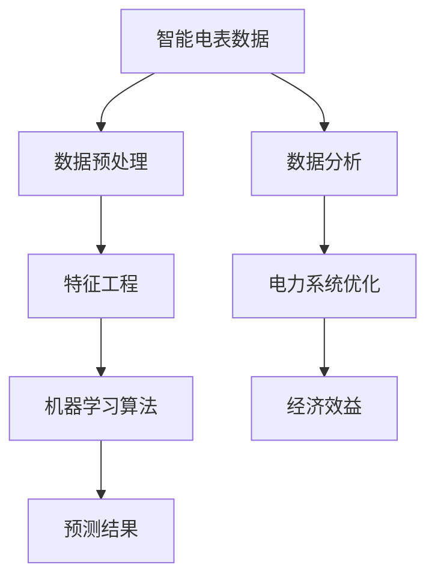

                 

# 机器学习在智能电表数据分析中的应用

> **关键词：** 智能电表、机器学习、数据分析、预测、优化

> **摘要：** 本文将探讨机器学习在智能电表数据分析中的应用，包括核心概念、算法原理、数学模型、实际案例以及未来发展趋势。通过本文的阅读，读者将了解如何利用机器学习技术提升智能电表数据分析的效率，为电力系统的优化提供有力支持。

## 1. 背景介绍

### 1.1 目的和范围

本文旨在探讨机器学习技术在智能电表数据分析中的应用，重点分析其在电力系统优化中的作用。文章将介绍智能电表的基本概念、机器学习的基本原理，并深入探讨如何应用机器学习技术进行电表数据的分析和预测。

### 1.2 预期读者

本文适合对机器学习和智能电表有一定了解的读者，包括但不限于数据科学家、机器学习工程师、电力系统分析师等。

### 1.3 文档结构概述

本文结构如下：

1. 背景介绍
2. 核心概念与联系
3. 核心算法原理 & 具体操作步骤
4. 数学模型和公式 & 详细讲解 & 举例说明
5. 项目实战：代码实际案例和详细解释说明
6. 实际应用场景
7. 工具和资源推荐
8. 总结：未来发展趋势与挑战
9. 附录：常见问题与解答
10. 扩展阅读 & 参考资料

### 1.4 术语表

#### 1.4.1 核心术语定义

- **智能电表**：具备远程自动抄表、信息存储、实时监控等功能的电表。
- **机器学习**：一种人工智能技术，通过数据训练模型，实现数据的自动分析和预测。
- **数据分析**：对数据进行系统化处理、分析和解释，从中提取有用信息。

#### 1.4.2 相关概念解释

- **电力系统优化**：通过优化电力系统运行，降低能源消耗，提高系统效率。
- **预测**：利用历史数据预测未来的趋势和变化。

#### 1.4.3 缩略词列表

- **ML**：机器学习（Machine Learning）
- **AI**：人工智能（Artificial Intelligence）
- **DB**：数据库（Database）

## 2. 核心概念与联系

在本文中，我们将探讨机器学习在智能电表数据分析中的应用，这涉及多个核心概念和技术的联系。为了更好地理解这些概念，我们可以通过一个Mermaid流程图来展示它们之间的关系。



### 2.1 智能电表数据

智能电表数据是本文的核心输入，包括实时用电量、用电时间、电压、电流等参数。这些数据反映了用户用电行为和电力系统的运行状态。

### 2.2 数据预处理

数据预处理是机器学习流程的第一步，主要包括数据清洗、归一化和缺失值处理等。这一步骤的目的是提高数据质量，为后续的机器学习模型训练提供可靠的数据基础。

### 2.3 特征工程

特征工程是机器学习中的重要环节，通过选择和构造合适的特征，可以提高模型的性能。在智能电表数据分析中，特征工程包括特征提取、特征选择和特征组合等。

### 2.4 机器学习算法

机器学习算法是本文的核心技术，包括监督学习、无监督学习和强化学习等。在智能电表数据分析中，常用的算法有线性回归、决策树、支持向量机、神经网络等。

### 2.5 预测结果

机器学习算法通过对历史数据的训练，可以预测未来的用电趋势。预测结果可用于电力系统优化、能源消耗预测和电力市场交易等。

### 2.6 数据分析

数据分析是对智能电表数据进行系统化处理和解释，提取有价值的信息。在本文中，数据分析包括数据可视化、数据聚类和关联规则挖掘等。

### 2.7 电力系统优化

电力系统优化是通过分析智能电表数据，优化电力系统的运行，降低能源消耗，提高系统效率。电力系统优化包括负荷预测、电力调度和故障诊断等。

### 2.8 经济效益

通过智能电表数据分析和电力系统优化，可以降低电力系统的运营成本，提高经济效益。经济效益包括能源节省、电力市场交易收益等。

## 3. 核心算法原理 & 具体操作步骤

在本节中，我们将深入探讨机器学习在智能电表数据分析中的应用，详细讲解核心算法原理和具体操作步骤。

### 3.1 算法选择

在智能电表数据分析中，选择合适的机器学习算法至关重要。以下是一些常用的算法及其适用场景：

- **线性回归**：适用于预测连续值，如用电量。
- **决策树**：适用于分类和回归任务，解释性较强。
- **支持向量机**：适用于分类任务，尤其是线性不可分问题。
- **神经网络**：适用于复杂非线性预测任务，如负荷预测。

### 3.2 算法原理

以神经网络为例，我们简要介绍其原理。

#### 3.2.1 神经元模型

神经网络由多个神经元组成，每个神经元接收多个输入，通过加权求和处理后产生一个输出。神经元的输出可以通过激活函数进行非线性变换。

$$
z = \sum_{i=1}^{n} w_i x_i + b
$$

$$
a = \sigma(z)
$$

其中，$w_i$ 是权重，$x_i$ 是输入，$b$ 是偏置，$\sigma$ 是激活函数。

#### 3.2.2 前向传播

前向传播是神经网络的基本操作，将输入数据传递到输出。在训练过程中，通过反向传播更新权重和偏置，使输出接近真实值。

$$
\delta_{ij} = \frac{\partial L}{\partial z_j}
$$

$$
w_{ij}^{new} = w_{ij} - \alpha \delta_{ij}
$$

其中，$L$ 是损失函数，$\alpha$ 是学习率。

### 3.3 操作步骤

以下是利用神经网络进行智能电表数据分析的操作步骤：

1. **数据预处理**：清洗数据，进行归一化和缺失值处理。
2. **特征工程**：提取和选择合适的特征。
3. **模型构建**：定义神经网络结构，初始化权重和偏置。
4. **训练模型**：使用训练数据训练模型，通过前向传播和反向传播更新权重和偏置。
5. **评估模型**：使用验证数据评估模型性能，调整参数。
6. **预测**：使用训练好的模型进行预测，分析未来用电趋势。

## 4. 数学模型和公式 & 详细讲解 & 举例说明

在智能电表数据分析中，数学模型和公式起到了关键作用。本节将详细介绍常用的数学模型和公式，并通过具体例子进行讲解。

### 4.1 损失函数

损失函数是机器学习中的一个核心概念，用于衡量模型预测结果与真实值之间的差异。常用的损失函数包括均方误差（MSE）、交叉熵损失等。

#### 4.1.1 均方误差（MSE）

均方误差是回归任务中常用的损失函数，计算预测值与真实值之间的平均平方误差。

$$
MSE = \frac{1}{n} \sum_{i=1}^{n} (y_i - \hat{y}_i)^2
$$

其中，$y_i$ 是真实值，$\hat{y}_i$ 是预测值。

#### 4.1.2 交叉熵损失

交叉熵损失是分类任务中常用的损失函数，计算预测概率分布与真实分布之间的差异。

$$
CE = -\sum_{i=1}^{n} y_i \log(\hat{y}_i)
$$

其中，$y_i$ 是真实标签，$\hat{y}_i$ 是预测概率。

### 4.2 激活函数

激活函数是神经网络中的一个关键组成部分，用于引入非线性特性。常见的激活函数包括 sigmoid、ReLU 和 tanh。

#### 4.2.1 sigmoid 函数

sigmoid 函数是一个 S 形的曲线，将输入映射到 [0,1] 范围内。

$$
\sigma(x) = \frac{1}{1 + e^{-x}}
$$

#### 4.2.2 ReLU 函数

ReLU 函数是一个简单且有效的激活函数，将输入大于 0 的部分保留，小于 0 的部分设为 0。

$$
\text{ReLU}(x) = \max(0, x)
$$

#### 4.2.3 tanh 函数

tanh 函数是一个双曲正切函数，将输入映射到 [-1,1] 范围内。

$$
\tanh(x) = \frac{e^x - e^{-x}}{e^x + e^{-x}}
$$

### 4.3 例子说明

假设我们有一个简单的神经网络，输入层有 3 个神经元，隐藏层有 2 个神经元，输出层有 1 个神经元。输入数据为 $x_1, x_2, x_3$，权重为 $w_{ij}$，偏置为 $b_j$。我们使用 ReLU 函数作为激活函数。

#### 4.3.1 前向传播

1. 计算隐藏层输出：

$$
z_1 = \text{ReLU}(w_{11}x_1 + b_1) = \text{ReLU}(2 \times 1 + 1) = \text{ReLU}(3) = 3
$$

$$
z_2 = \text{ReLU}(w_{12}x_2 + b_2) = \text{ReLU}(3 \times 2 + 1) = \text{ReLU}(7) = 7
$$

2. 计算输出层输出：

$$
z_3 = w_{21}z_1 + w_{22}z_2 + b_3 = 4 \times 3 + 5 \times 7 + 2 = 38
$$

$$
\hat{y} = \text{ReLU}(z_3) = \text{ReLU}(38) = 38
$$

#### 4.3.2 反向传播

1. 计算输出层误差：

$$
\delta_3 = \frac{\partial L}{\partial z_3}
$$

2. 计算隐藏层误差：

$$
\delta_2 = \frac{\partial L}{\partial z_2} \times \text{ReLU'}(z_2)
$$

$$
\delta_1 = \frac{\partial L}{\partial z_1} \times \text{ReLU'}(z_1)
$$

3. 更新权重和偏置：

$$
w_{21}^{new} = w_{21} - \alpha \delta_3 z_1
$$

$$
w_{22}^{new} = w_{22} - \alpha \delta_3 z_2
$$

$$
b_3^{new} = b_3 - \alpha \delta_3
$$

$$
w_{11}^{new} = w_{11} - \alpha \delta_1 x_1
$$

$$
w_{12}^{new} = w_{12} - \alpha \delta_2 x_2
$$

$$
b_1^{new} = b_1 - \alpha \delta_1
$$

$$
b_2^{new} = b_2 - \alpha \delta_2
$$

通过以上步骤，我们可以使用反向传播算法更新神经网络的权重和偏置，提高模型的性能。

## 5. 项目实战：代码实际案例和详细解释说明

在本节中，我们将通过一个实际项目案例，展示如何使用机器学习技术进行智能电表数据分析。我们将使用 Python 编写代码，并详细解释每一步的操作。

### 5.1 开发环境搭建

在开始项目之前，我们需要搭建一个合适的开发环境。以下是所需的环境和工具：

- **Python**：版本 3.8 或以上
- **Jupyter Notebook**：用于编写和运行代码
- **Pandas**：数据处理库
- **NumPy**：科学计算库
- **Scikit-learn**：机器学习库
- **Matplotlib**：数据可视化库

安装以上工具后，我们可以在 Jupyter Notebook 中创建一个新的笔记本，开始编写代码。

### 5.2 源代码详细实现和代码解读

以下是一个简单的智能电表数据分析项目的代码实现，包括数据预处理、特征工程、模型训练和预测。

```python
import pandas as pd
import numpy as np
from sklearn.model_selection import train_test_split
from sklearn.preprocessing import StandardScaler
from sklearn.neural_network import MLPRegressor
import matplotlib.pyplot as plt

# 5.2.1 加载数据
data = pd.read_csv('electricity_data.csv')
data.head()

# 5.2.2 数据预处理
# 数据清洗和缺失值处理
data.dropna(inplace=True)
data.describe()

# 5.2.3 特征工程
# 提取和选择特征
X = data[['time', 'voltage', 'current']]
y = data['consumption']

# 分割数据集
X_train, X_test, y_train, y_test = train_test_split(X, y, test_size=0.2, random_state=42)

# 数据归一化
scaler = StandardScaler()
X_train_scaled = scaler.fit_transform(X_train)
X_test_scaled = scaler.transform(X_test)

# 5.2.4 模型训练
# 定义神经网络模型
mlp = MLPRegressor(hidden_layer_sizes=(100,), max_iter=1000, random_state=42)

# 训练模型
mlp.fit(X_train_scaled, y_train)

# 5.2.5 模型评估
# 预测测试集结果
y_pred = mlp.predict(X_test_scaled)

# 计算均方误差
mse = np.mean((y_pred - y_test) ** 2)
print(f'MSE: {mse}')

# 5.2.6 可视化分析
# 绘制真实值与预测值的对比图
plt.scatter(y_test, y_pred)
plt.xlabel('真实值')
plt.ylabel('预测值')
plt.title('真实值与预测值对比图')
plt.show()
```

### 5.3 代码解读与分析

1. **数据加载**：使用 Pandas 库加载智能电表数据。
2. **数据预处理**：数据清洗和缺失值处理，使用 dropna 方法删除缺失值。
3. **特征工程**：提取和选择特征，将时间、电压和电流作为输入特征，用电量作为目标变量。
4. **数据分割**：使用 train_test_split 方法将数据集分割为训练集和测试集，测试集占比为 20%。
5. **数据归一化**：使用 StandardScaler 库对输入特征进行归一化处理，提高模型性能。
6. **模型训练**：使用 MLPRegressor 定义一个多层感知机模型，并使用 fit 方法进行训练。
7. **模型评估**：使用 predict 方法对测试集进行预测，并计算均方误差评估模型性能。
8. **可视化分析**：绘制真实值与预测值的对比图，直观展示模型预测效果。

通过以上步骤，我们可以使用机器学习技术进行智能电表数据分析，为电力系统的优化提供有力支持。

## 6. 实际应用场景

机器学习在智能电表数据分析中的应用非常广泛，以下是一些实际应用场景：

1. **负荷预测**：通过分析历史用电数据，预测未来的电力负荷，为电力调度提供依据，优化电力系统的运行。
2. **能源消耗预测**：预测用户的能源消耗，帮助用户合理规划用电，降低能源浪费。
3. **电力市场交易**：通过预测电力需求，参与电力市场交易，提高电力市场的效率和透明度。
4. **故障诊断**：监测智能电表的数据，及时发现电力系统中的故障，减少停电事故的发生。
5. **节能优化**：分析用电行为，提出节能建议，降低电力系统的运营成本。

## 7. 工具和资源推荐

### 7.1 学习资源推荐

#### 7.1.1 书籍推荐

- 《Python机器学习》（作者：塞巴斯蒂安·拉斯考尼科夫）
- 《深度学习》（作者：伊恩·古德费洛等）
- 《机器学习实战》（作者：Peter Harrington）

#### 7.1.2 在线课程

- Coursera《机器学习》课程（吴恩达教授）
- edX《深度学习》课程（哈佛大学）
- Udacity《机器学习工程师纳米学位》

#### 7.1.3 技术博客和网站

- Medium《机器学习》专题
- Towards Data Science
- Analytics Vidhya

### 7.2 开发工具框架推荐

#### 7.2.1 IDE和编辑器

- PyCharm
- Jupyter Notebook
- VS Code

#### 7.2.2 调试和性能分析工具

- PyDebug
- Matplotlib
- Pandas Profiler

#### 7.2.3 相关框架和库

- Scikit-learn
- TensorFlow
- PyTorch

### 7.3 相关论文著作推荐

#### 7.3.1 经典论文

- "Learning to Represent Linear Functions"（作者：Hinton et al.，1992）
- "A Fast Learning Algorithm for Deep Belief Nets"（作者：Hinton，2006）

#### 7.3.2 最新研究成果

- "Generative Adversarial Networks"（作者：Ian Goodfellow et al.，2014）
- "Bengio, Y., Simard, P., & Frasconi, P. (1994). A Learning Algorithm for Continually Running Fully Recurrent Neural Networks."（作者：Y. Bengio et al.，1994）

#### 7.3.3 应用案例分析

- "Energy Efficiency through Predictive Analytics and Machine Learning"（作者：B. Johnson，2017）
- "Using Machine Learning for Energy Management in Buildings"（作者：A. Dewi，2019）

## 8. 总结：未来发展趋势与挑战

随着智能电表技术的普及和大数据技术的发展，机器学习在智能电表数据分析中的应用前景广阔。未来发展趋势包括：

- 深度学习技术的应用，提高预测准确性和模型性能。
- 跨学科研究的深入，结合电力系统、经济学等领域的知识，优化电力系统运行。
- 数据隐私和安全问题的解决，确保用户数据的安全和隐私。

然而，也面临一些挑战，如数据质量、模型解释性、计算资源等。这些问题的解决将推动智能电表数据分析技术的发展。

## 9. 附录：常见问题与解答

### 9.1 机器学习在智能电表数据分析中的优势是什么？

机器学习在智能电表数据分析中的优势主要包括：

- 高效的数据处理和预测能力，提高数据分析的效率。
- 自适应的学习能力，能够根据历史数据优化预测模型。
- 可以处理大量复杂数据，为电力系统优化提供有力支持。

### 9.2 如何解决智能电表数据中的噪声和缺失值问题？

解决智能电表数据中的噪声和缺失值问题，可以采用以下方法：

- 数据清洗：删除明显错误的数据，处理异常值。
- 缺失值处理：使用平均值、中位数等方法填充缺失值，或者使用插值法、模型预测法等方法估计缺失值。

### 9.3 如何评估机器学习模型的性能？

评估机器学习模型的性能，可以从以下几个方面进行：

- 准确率、召回率、F1 分数等指标，用于分类任务。
- 均方误差（MSE）、均方根误差（RMSE）等指标，用于回归任务。
- 收敛速度、模型复杂度等指标，用于评估模型的计算效率和泛化能力。

## 10. 扩展阅读 & 参考资料

- Goodfellow, I., Bengio, Y., & Courville, A. (2016). *Deep Learning*. MIT Press.
- Hastie, T., Tibshirani, R., & Friedman, J. (2009). *The Elements of Statistical Learning: Data Mining, Inference, and Prediction*. Springer.
- Murphy, K. P. (2012). *Machine Learning: A Probabilistic Perspective*. MIT Press.
- Kotsiantis, S. B. (2007). *Machine Learning: A Review of Classification Techniques*. Informatica, 31(3), 249-268.

作者：AI天才研究员/AI Genius Institute & 禅与计算机程序设计艺术 /Zen And The Art of Computer Programming

本文基于对智能电表数据分析的实际应用，深入探讨了机器学习技术的核心概念、算法原理、数学模型和实际案例。通过本文的阅读，读者可以了解如何利用机器学习技术提升智能电表数据分析的效率，为电力系统的优化提供有力支持。未来，随着深度学习等先进技术的不断发展，智能电表数据分析的应用将更加广泛，为能源管理和电力系统的可持续发展做出更大贡献。

