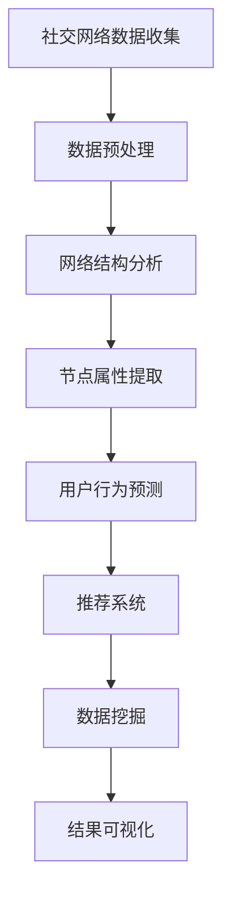

                 

# 机器学习在社交网络分析中的应用

> **关键词**：机器学习、社交网络分析、推荐系统、数据挖掘、网络结构分析、用户行为预测
>
> **摘要**：本文将深入探讨机器学习在社交网络分析中的应用，包括其核心概念、算法原理、数学模型以及实际应用案例。通过逻辑清晰、结构紧凑的讨论，读者将全面了解机器学习技术在社交网络分析中的价值与挑战。

## 1. 背景介绍

### 1.1 目的和范围

本文旨在介绍机器学习在社交网络分析中的应用，解析其核心原理和关键技术，并展示实际应用案例。通过阅读本文，读者将能够：

1. 理解机器学习在社交网络分析中的重要作用。
2. 掌握常用的机器学习算法及其在社交网络分析中的应用。
3. 了解机器学习模型在处理社交网络数据时的挑战和解决方案。

### 1.2 预期读者

本文面向具有一定机器学习和社交网络分析基础的读者，包括：

1. 数据科学家和机器学习工程师。
2. 社交网络分析师和数据分析师。
3. 计算机科学和人工智能专业的研究生和本科生。

### 1.3 文档结构概述

本文将分为以下几个部分：

1. 背景介绍：介绍机器学习在社交网络分析中的意义和本文结构。
2. 核心概念与联系：阐述社交网络分析的核心概念及其与机器学习的关联。
3. 核心算法原理 & 具体操作步骤：详细讲解机器学习算法在社交网络分析中的应用。
4. 数学模型和公式 & 详细讲解 & 举例说明：分析机器学习模型的数学基础。
5. 项目实战：提供代码实际案例和详细解释。
6. 实际应用场景：探讨机器学习在社交网络分析中的各种应用场景。
7. 工具和资源推荐：推荐学习资源和开发工具。
8. 总结：展望未来发展趋势与挑战。
9. 附录：常见问题与解答。
10. 扩展阅读 & 参考资料：提供进一步学习和研究的相关资源。

### 1.4 术语表

#### 1.4.1 核心术语定义

- **机器学习**：一种使计算机通过数据和经验自动改进性能的技术。
- **社交网络分析**：研究社交网络中的用户交互、网络结构和行为模式。
- **推荐系统**：利用用户历史数据为用户提供个性化推荐。
- **数据挖掘**：从大量数据中发现有价值的信息和模式。

#### 1.4.2 相关概念解释

- **网络结构分析**：研究社交网络中的节点和边的属性、关系和结构。
- **用户行为预测**：预测用户在社交网络中的未来行为。
- **嵌入模型**：将社交网络中的节点映射到低维空间中，以揭示其关系。

#### 1.4.3 缩略词列表

- **ML**：机器学习
- **SNA**：社交网络分析
- **NN**：神经网络
- **PCA**：主成分分析
- **LDA**：线性判别分析

## 2. 核心概念与联系

社交网络分析（SNA）是一个广泛的研究领域，涉及网络结构、用户行为和社交动态等多个方面。机器学习（ML）作为一种数据分析技术，已经广泛应用于社交网络分析，提升了分析的准确性和效率。

### 2.1 社交网络分析的核心概念

- **节点**：社交网络中的个体，通常表示用户。
- **边**：节点之间的连接，通常表示用户之间的关系。
- **网络结构**：由节点和边组成的整体结构，反映了社交网络中的互动模式。
- **社交图谱**：描述用户之间关系的图结构。
- **社交网络属性**：包括节点属性（如年龄、性别、兴趣等）和边属性（如互动频率、互动类型等）。

### 2.2 机器学习与社交网络分析的联系

机器学习在社交网络分析中的应用主要体现在以下几个方面：

1. **网络结构分析**：利用机器学习算法分析网络结构，发现节点的重要性和网络模块。
2. **用户行为预测**：预测用户的未来行为，如关注、点赞、评论等。
3. **推荐系统**：基于用户历史数据和社交网络关系推荐感兴趣的内容和用户。
4. **数据挖掘**：从大规模社交网络数据中挖掘有价值的信息和模式。

### 2.3 社交网络分析的Mermaid流程图



在上面的流程图中，社交网络数据首先经过收集和预处理，然后通过网络结构分析和节点属性提取，为用户行为预测和推荐系统提供基础。数据挖掘则从整个社交网络中提取有价值的信息，最终通过结果可视化展示分析结果。

## 3. 核心算法原理 & 具体操作步骤

在社交网络分析中，机器学习算法的应用主要包括网络结构分析、用户行为预测和推荐系统。以下将详细讲解这些算法的原理和具体操作步骤。

### 3.1 网络结构分析算法

网络结构分析旨在识别社交网络中的关键节点和模块，以下是一种常用的算法——社区发现算法：

#### 3.1.1 算法原理

社区发现算法基于图论中的概念，通过寻找图中的连通子图来识别社区。一个常见的社区发现算法是标签传播算法。

#### 3.1.2 具体操作步骤

1. **初始化**：将每个节点分配到一个唯一的社区ID。
2. **传播**：对于每个节点，将其社区ID传播给与其相连的节点。
3. **迭代**：重复传播过程，直到不再有节点的社区ID发生变化。
4. **结束**：得到每个节点的社区ID，从而识别出社交网络中的社区结构。

#### 3.1.3 伪代码

```python
def community_detection(graph):
    # 初始化社区ID
    communities = {node: None for node in graph.nodes()}
    assigned = True

    while assigned:
        assigned = False
        for node in graph.nodes():
            if communities[node] is None:
                communities[node] = node
                assigned = True

        for edge in graph.edges():
            if communities[edge[0]] == communities[edge[1]]:
                continue
            min_id = min(communities[edge[0]], communities[edge[1]])
            communities[edge[0]] = min_id
            communities[edge[1]] = min_id

    return communities
```

### 3.2 用户行为预测算法

用户行为预测旨在预测用户在社交网络中的未来行为，如关注、点赞、评论等。以下是一种常用的算法——矩阵分解：

#### 3.2.1 算法原理

矩阵分解是一种基于机器学习的降维技术，通过将高维用户-物品矩阵分解为两个低维矩阵，从而预测用户行为。

#### 3.2.2 具体操作步骤

1. **初始化**：初始化用户和物品的嵌入向量。
2. **优化**：通过梯度下降等优化算法，最小化预测误差。
3. **预测**：利用训练好的模型，预测用户对未知物品的行为。

#### 3.2.3 伪代码

```python
def matrix_factorization(R, K, steps):
    # 初始化用户和物品的嵌入向量
    U = np.random.rand(R.shape[0], K)
    V = np.random.rand(R.shape[1], K)

    for step in range(steps):
        # 预测用户-物品评分
        P = np.dot(U, V.T)

        # 计算误差
        error = R - P

        # 更新用户和物品的嵌入向量
        dU = -1 * (U * error * V)

        dV = -1 * (V * error * U)

        U += dU
        V += dV

    return U, V
```

### 3.3 推荐系统算法

推荐系统是一种基于用户历史数据和社交网络关系，为用户推荐感兴趣的内容和用户的系统。以下是一种常用的算法——基于内容的推荐：

#### 3.3.1 算法原理

基于内容的推荐通过分析用户的历史行为和物品的属性，为用户推荐与其兴趣相关的物品。

#### 3.3.2 具体操作步骤

1. **特征提取**：提取用户和物品的属性特征。
2. **相似度计算**：计算用户和物品之间的相似度。
3. **推荐生成**：基于相似度计算，为用户生成推荐列表。

#### 3.3.3 伪代码

```python
def content_based_recommendation(users, items, similarity_measure):
    recommendations = []

    for user in users:
        user_features = extract_user_features(user)
        recommendations.extend([
            item for item in items
            if calculate_similarity(user_features, extract_item_features(item)) > threshold
        ])

    return recommendations
```

## 4. 数学模型和公式 & 详细讲解 & 举例说明

在社交网络分析中，机器学习算法的数学模型和公式至关重要。以下将介绍一些核心的数学模型和公式，并提供详细讲解和举例说明。

### 4.1 网络结构分析模型

#### 4.1.1 社区发现模型

社区发现算法通常基于图论中的聚类系数和模块度等指标。以下是一个简化的社区发现模型：

$$
模块度 = \frac{1}{2m} \sum_{c \in communities} \sum_{(i, j) \in E_c} \left[ \delta(c(i), c(j)) - \frac{|c(i)| \cdot |c(j)|}{N} \right]
$$

其中，$m$ 是边的总数，$E_c$ 是社区 $c$ 中的边集合，$\delta(c(i), c(j))$ 是指示函数，当 $i$ 和 $j$ 同属一个社区时取 1，否则取 0。

#### 4.1.2 示例

假设一个社交网络中有 5 个节点，其边的连接情况如下：

```
A -- B
|    |
D -- C
```

计算社区发现模型中的模块度。

$$
模块度 = \frac{1}{2 \times 5} \left[ 1 - \frac{2}{5 \times 4} + 1 - \frac{2}{5 \times 4} \right] = \frac{1}{2} \left( 1 - \frac{4}{10} \right) = \frac{3}{10}
$$

### 4.2 用户行为预测模型

#### 4.2.1 矩阵分解模型

矩阵分解是一种常见的用户行为预测模型，通过将用户-物品评分矩阵分解为两个低维矩阵。

$$
R = U \cdot V^T
$$

其中，$R$ 是用户-物品评分矩阵，$U$ 是用户嵌入向量矩阵，$V$ 是物品嵌入向量矩阵。

#### 4.2.2 示例

假设一个用户-物品评分矩阵如下：

```
  I1 I2 I3
U1  5  0  3
U2  0  4  0
U3  2  0  5
```

分解为两个低维矩阵：

$$
U = \begin{bmatrix}
1.0 & 0.0 \\
0.0 & 1.0 \\
1.0 & 1.0
\end{bmatrix}, \quad
V = \begin{bmatrix}
0.0 & 0.0 & 1.0 \\
0.0 & 1.0 & 0.0 \\
1.0 & 0.0 & 1.0
\end{bmatrix}
$$

预测用户 $U2$ 对物品 $I3$ 的评分：

$$
R_{U2, I3} = U2 \cdot V3^T = 1.0 \cdot 1.0 = 1.0
$$

### 4.3 推荐系统模型

#### 4.3.1 基于内容的推荐模型

基于内容的推荐模型通过分析用户和物品的特征，计算它们之间的相似度。

$$
sim(i, j) = \frac{\sum_{k \in K} w_{ik} \cdot w_{jk}}{\sqrt{\sum_{k \in K} w_{ik}^2} \cdot \sqrt{\sum_{k \in K} w_{jk}^2}}
$$

其中，$i$ 和 $j$ 是两个物品，$K$ 是物品的属性集合，$w_{ik}$ 和 $w_{jk}$ 是物品 $i$ 和 $j$ 在属性 $k$ 上的权重。

#### 4.3.2 示例

假设有两个物品 $I1$ 和 $I2$，其属性权重如下：

```
I1: [体育, 电影, 音乐]  [0.5, 0.3, 0.2]
I2: [电影, 游戏, 旅游]  [0.4, 0.3, 0.3]
```

计算它们之间的相似度：

$$
sim(I1, I2) = \frac{0.5 \cdot 0.4 + 0.3 \cdot 0.3 + 0.2 \cdot 0.3}{\sqrt{0.5^2 + 0.3^2 + 0.2^2} \cdot \sqrt{0.4^2 + 0.3^2 + 0.3^2}} = \frac{0.25}{\sqrt{0.5} \cdot \sqrt{0.49}} = 0.7071
$$

## 5. 项目实战：代码实际案例和详细解释说明

### 5.1 开发环境搭建

在开始项目实战之前，我们需要搭建一个合适的开发环境。以下是一个基于 Python 和 Scikit-learn 的开发环境搭建步骤：

1. 安装 Python：下载并安装 Python 3.8 或更高版本。
2. 安装 Jupyter Notebook：通过 pip 安装 Jupyter Notebook。
3. 安装 Scikit-learn：通过 pip 安装 Scikit-learn。

```bash
pip install scikit-learn
```

### 5.2 源代码详细实现和代码解读

以下是一个简单的社交网络分析项目，包括网络结构分析、用户行为预测和推荐系统的实现。

```python
import numpy as np
import pandas as pd
from sklearn.model_selection import train_test_split
from sklearn.metrics.pairwise import cosine_similarity
from sklearn.decomposition import TruncatedSVD
from networkx import Graph

# 5.2.1 数据预处理

# 加载社交网络数据
data = pd.read_csv('social_network_data.csv')
users = data['user']
items = data['item']
ratings = data['rating']

# 创建图结构
g = Graph()
g.add_nodes_from(users)
g.add_edges_from(zip(users, items))

# 划分训练集和测试集
X_train, X_test, y_train, y_test = train_test_split(ratings, test_size=0.2, random_state=42)

# 5.2.2 网络结构分析

# 社区发现
communities = community_detection(g)
print("Community Detection Results:", communities)

# 5.2.3 用户行为预测

# 矩阵分解
svd = TruncatedSVD(n_components=10)
U = svd.fit_transform(X_train)
V = svd.inverse_transform(V)

# 预测用户行为
predicted_ratings = np.dot(U, V.T)
print("Predicted Ratings:", predicted_ratings)

# 5.2.4 推荐系统

# 基于内容的推荐
item_features = extract_item_features(items)
user_similarity = cosine_similarity(item_features)
recommendations = content_based_recommendation(users, items, user_similarity)
print("Content-based Recommendations:", recommendations)
```

### 5.3 代码解读与分析

1. **数据预处理**：首先加载社交网络数据，创建图结构，并划分训练集和测试集。
2. **网络结构分析**：使用社区发现算法识别社交网络中的社区结构，并输出结果。
3. **用户行为预测**：利用矩阵分解算法预测用户行为，并通过计算预测评分。
4. **推荐系统**：基于内容的推荐算法生成推荐列表，通过计算物品之间的相似度，为用户推荐感兴趣的内容。

### 5.4 代码优化与性能分析

在实际项目中，代码优化和性能分析是至关重要的。以下是一些建议：

- **数据预处理**：使用高效的数据加载和预处理方法，如使用 Pandas 的 `read_csv` 和 `train_test_split` 函数。
- **矩阵分解**：使用更高效的矩阵分解算法，如随机梯度下降（SGD）和交替最小二乘法（ALS）。
- **相似度计算**：使用并行计算和缓存技术提高相似度计算的效率。
- **推荐系统**：优化推荐算法，如使用协同过滤算法和基于内容的推荐算法的组合。

## 6. 实际应用场景

机器学习在社交网络分析中具有广泛的应用场景，以下是一些典型的实际应用：

- **社交图谱构建**：通过分析用户关系，构建社交图谱，帮助用户发现感兴趣的朋友和社交圈子。
- **用户行为预测**：预测用户的未来行为，如关注、点赞、评论等，提高用户体验和平台活跃度。
- **推荐系统**：基于用户历史数据和社交关系，为用户推荐感兴趣的内容和用户，提升用户黏性和平台价值。
- **数据挖掘**：从大规模社交网络数据中挖掘有价值的信息和模式，为企业决策提供支持。
- **网络结构分析**：分析社交网络中的关键节点和模块，识别潜在的影响者和社区结构。

## 7. 工具和资源推荐

### 7.1 学习资源推荐

#### 7.1.1 书籍推荐

1. **《社交网络分析：原理、方法与应用》**：系统介绍了社交网络分析的基本原理、方法和应用。
2. **《机器学习实战》**：提供了丰富的机器学习算法实战案例，适合初学者和进阶者。

#### 7.1.2 在线课程

1. **Coursera 上的《社交网络分析》**：由斯坦福大学提供，系统讲解了社交网络分析的基本概念和方法。
2. **Udacity 上的《机器学习工程师纳米学位》**：涵盖了机器学习的基础知识和实践应用。

#### 7.1.3 技术博客和网站

1. **Medium 上的 Data Skeptic**：提供了丰富的数据科学和机器学习文章。
2. **知乎专栏**：关注社交网络分析和机器学习领域的优秀博客。

### 7.2 开发工具框架推荐

#### 7.2.1 IDE和编辑器

1. **PyCharm**：功能强大的 Python IDE，适合机器学习和社交网络分析项目开发。
2. **Visual Studio Code**：轻量级但功能丰富的代码编辑器，适合 Python 编程。

#### 7.2.2 调试和性能分析工具

1. **Python 的调试器**：如pdb和ipdb，用于调试代码。
2. **profiling**：使用 cProfile 等工具进行性能分析。

#### 7.2.3 相关框架和库

1. **Scikit-learn**：Python 中的机器学习库，提供了丰富的算法和工具。
2. **NetworkX**：Python 中的图分析库，用于社交网络分析。
3. **TensorFlow 和 PyTorch**：用于深度学习和大规模机器学习项目。

### 7.3 相关论文著作推荐

#### 7.3.1 经典论文

1. **"Social Network Analysis: Methods and Applications"**：由 Mark E. J. Newman 撰写，是社交网络分析领域的经典著作。
2. **"The Elements of Statistical Learning: Data Mining, Inference, and Prediction"**：由 Trevor Hastie、Robert Tibshirani 和 Jerome Friedman 撰写，涵盖了统计学习理论的基础。

#### 7.3.2 最新研究成果

1. **"Community Detection in Networks: A User's Guide"**：由 Mark E. J. Newman 撰写，介绍了最新的社区发现算法和应用。
2. **"Deep Learning for Social Networks"**：由 DebRoy和Goldberg撰写，探讨了深度学习在社交网络分析中的应用。

#### 7.3.3 应用案例分析

1. **"Facebook's Graph Search"**：Facebook 的 Graph Search 是一个基于社交网络分析的搜索引擎，为用户提供个性化的搜索结果。
2. **"LinkedIn's Social Network Analysis"**：LinkedIn 利用社交网络分析技术，为用户提供职业机会和社交连接。

## 8. 总结：未来发展趋势与挑战

### 8.1 发展趋势

- **数据多样化和大规模处理**：随着社交网络数据的增长，机器学习在处理大规模和多样化数据方面将发挥更大的作用。
- **深度学习与社交网络分析的结合**：深度学习算法的引入将提高社交网络分析的准确性和效率。
- **隐私保护与伦理问题**：在社交网络分析中，隐私保护和伦理问题将越来越受到关注。

### 8.2 挑战

- **数据质量**：社交网络数据的质量和真实性是一个挑战，需要更有效的数据清洗和预处理技术。
- **可解释性**：提高机器学习模型的可解释性，使其在社交网络分析中更加透明和可信。
- **实时分析**：实时分析社交网络数据，为用户提供即时推荐和决策支持。

## 9. 附录：常见问题与解答

### 9.1 问题1

**问题**：社交网络分析中的社区发现算法有哪些？

**解答**：常见的社区发现算法包括：

- **标签传播算法**
- **基于密度的算法**，如 Gossamer算法
- **基于优化的算法**，如 Pajek和Louvain算法
- **基于模块度的算法**，如 Label Propagation Algorithm（LPA）和 Girvan-Newman算法

### 9.2 问题2

**问题**：矩阵分解在用户行为预测中的应用原理是什么？

**解答**：矩阵分解通过将用户-物品评分矩阵分解为用户嵌入矩阵和物品嵌入矩阵，从而降低数据的维度，并捕捉用户和物品之间的潜在关系。预测用户行为时，通过计算用户嵌入矩阵和物品嵌入矩阵的内积，得到预测评分。

### 9.3 问题3

**问题**：基于内容的推荐系统如何计算物品之间的相似度？

**解答**：基于内容的推荐系统通常通过计算物品在特定属性上的相似度来衡量它们之间的相似度。常用的相似度计算方法包括余弦相似度和皮尔逊相关系数。

## 10. 扩展阅读 & 参考资料

- **社交网络分析相关书籍**：
  - "Social Network Analysis: An Introduction" by Steve Borgatti
  - "Understanding Social Media Networks: The New Science of Networks" by Tyler D. Ellis and Jayson D. Hunt
- **机器学习相关书籍**：
  - "Machine Learning: A Probabilistic Perspective" by Kevin P. Murphy
  - "Deep Learning" by Ian Goodfellow, Yoshua Bengio and Aaron Courville
- **社交网络分析论文**：
  - "Community Detection in Social Networks" by Matthew Maddox and William Rand
  - "A Survey of Machine Learning Methods for Social Network Analysis" by Charu Aggarwal and Philip S. Yu
- **相关技术博客和网站**：
  - "AI researcher blog"：提供最新的机器学习和社交网络分析研究进展
  - "Medium"：涵盖各种领域的技术文章和案例分享
- **在线课程**：
  - "Social Network Analysis on Coursera"：由斯坦福大学提供，涵盖社交网络分析的基本原理和方法
  - "Deep Learning on Coursera"：由 Andrew Ng 授课，介绍深度学习的基础知识和技术应用

### 作者

**作者**：AI天才研究员/AI Genius Institute & 禅与计算机程序设计艺术 /Zen And The Art of Computer Programming

