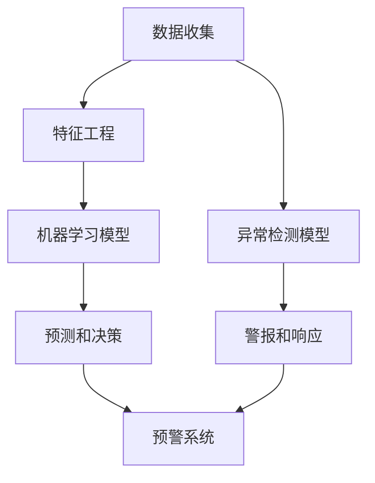

                 

# 机器学习在网络攻击早期预警中的应用

> 关键词：机器学习，网络攻击，早期预警，网络安全，异常检测，深度学习，数据挖掘
>
> 摘要：本文将深入探讨机器学习在网络攻击早期预警中的应用。通过对核心概念的解析、算法原理的讲解以及数学模型的阐述，本文将帮助读者了解如何利用机器学习技术来提前识别和防范网络攻击。同时，将通过实际案例展示如何在实际项目中应用这些技术，并提出未来发展的趋势和挑战。

## 1. 背景介绍

### 1.1 目的和范围

本文旨在探讨机器学习在网络攻击早期预警中的应用，通过解析核心概念、算法原理和数学模型，以及通过实际案例展示，帮助读者全面了解这一领域。文章将涵盖以下内容：

- 机器学习在网络攻击预警中的作用
- 核心算法和技术的原理及实现
- 数学模型在异常检测中的应用
- 实际项目的实施和案例分析
- 未来发展趋势与面临的挑战

### 1.2 预期读者

本文适合对网络安全和机器学习有一定了解的读者，包括但不限于网络安全工程师、数据科学家、机器学习研究人员以及计算机科学专业的学生。通过本文的阅读，读者可以：

- 理解机器学习在网络攻击预警中的基本原理
- 掌握常用的机器学习算法和技术
- 学习如何应用数学模型进行异常检测
- 获取实际项目操作的经验

### 1.3 文档结构概述

本文的结构如下：

- **第1章：背景介绍**：介绍文章的目的、预期读者以及文档结构。
- **第2章：核心概念与联系**：解释核心概念，展示机器学习在网络攻击预警中的应用架构。
- **第3章：核心算法原理与操作步骤**：详细讲解机器学习算法的原理和实现步骤。
- **第4章：数学模型与公式**：介绍数学模型和公式的应用。
- **第5章：项目实战**：通过实际案例展示机器学习算法的应用。
- **第6章：实际应用场景**：分析机器学习在网络攻击预警中的具体应用场景。
- **第7章：工具和资源推荐**：推荐学习资源、开发工具和框架。
- **第8章：总结**：总结本文的主要内容和未来发展趋势。
- **第9章：附录**：提供常见问题与解答。
- **第10章：扩展阅读与参考资料**：列出参考文献。

### 1.4 术语表

#### 1.4.1 核心术语定义

- **机器学习**：一种通过数据训练来自动改进性能的计算方法。
- **网络攻击**：针对计算机网络系统的非法入侵、破坏或篡改行为。
- **异常检测**：识别数据集中异常或异常行为的技术。
- **深度学习**：一种机器学习技术，通过多层神经网络进行特征学习和模式识别。
- **数据挖掘**：从大量数据中提取有价值信息的过程。

#### 1.4.2 相关概念解释

- **网络流量**：网络中数据传输的流量统计信息。
- **入侵检测系统（IDS）**：用于检测和防范网络攻击的安全系统。
- **特征工程**：从原始数据中提取出对任务有帮助的特征。
- **交叉验证**：评估机器学习模型性能的方法。

#### 1.4.3 缩略词列表

- **IDS**：入侵检测系统（Intrusion Detection System）
- **APT**：高级持续性威胁（Advanced Persistent Threat）
- **ML**：机器学习（Machine Learning）
- **NLP**：自然语言处理（Natural Language Processing）

## 2. 核心概念与联系

为了深入理解机器学习在网络攻击早期预警中的应用，我们需要首先掌握几个核心概念，并了解它们之间的联系。以下是一个简化的 Mermaid 流程图，展示这些概念和它们在网络攻击预警系统中的关系：



### 2.1 数据收集

数据收集是整个预警系统的第一步。网络流量日志、系统日志、用户行为数据等都是重要的数据来源。这些数据通常包含大量的信息，但只有经过处理，提取出有用的特征，才能用于训练机器学习模型。

### 2.2 特征工程

特征工程是从原始数据中提取有用特征的过程。这个步骤非常重要，因为它决定了机器学习模型的性能。常见的特征包括流量模式、IP地址、端口信息、协议类型、用户行为等。

### 2.3 机器学习模型

机器学习模型是对数据的训练和分析过程。选择合适的模型非常重要，因为不同的模型适用于不同的任务和数据集。常见的机器学习模型包括决策树、支持向量机、神经网络等。

### 2.4 预测和决策

预测和决策是机器学习模型的核心。通过对训练好的模型进行预测，我们可以识别出网络攻击的潜在威胁，并做出相应的决策。例如，可以标记某些流量为可疑流量，或者触发警报系统。

### 2.5 预警系统

预警系统是将机器学习模型的预测结果转化为实际行动的桥梁。它可以通过发送警报、记录日志、隔离威胁等方式，实时响应网络攻击。

### 2.6 异常检测模型

异常检测模型是一种专门用于识别异常行为的机器学习模型。它通过对正常行为的建模，可以快速识别出异常行为，从而提高预警系统的准确性。

### 2.7 警报和响应

警报和响应是预警系统的最后一步。当检测到网络攻击时，系统可以立即触发警报，并采取相应的响应措施，例如断开可疑连接、隔离攻击者等。

通过上述流程，我们可以看到机器学习在网络攻击早期预警系统中的重要作用。每个步骤都需要精心设计和优化，以确保系统的有效性。

## 3. 核心算法原理与具体操作步骤

在了解了核心概念和联系之后，我们需要深入探讨机器学习算法在网络攻击预警中的具体原理和操作步骤。以下是一个详细的伪代码，展示了一个基于监督学习的网络攻击预警系统的实现过程。

```python
# 机器学习算法在网络攻击预警中的具体操作步骤

# 数据准备
data = load_data() # 加载网络流量数据
X, y = preprocess_data(data) # 预处理数据，提取特征和标签

# 模型选择
model = choose_model() # 根据任务选择合适的机器学习模型，如决策树、随机森林、神经网络等

# 模型训练
model.fit(X_train, y_train) # 使用训练数据训练模型

# 模型评估
score = model.evaluate(X_test, y_test) # 使用测试数据评估模型性能

# 模型优化
optimize_model(model, X, y) # 根据评估结果对模型进行优化，如调整参数、增加训练数据等

# 预测和预警
predictions = model.predict(X_new) # 使用训练好的模型对新数据进行预测
if is_anomaly(predictions): # 判断预测结果是否为异常
    alert() # 触发警报
```

### 3.1 数据准备

数据准备是机器学习的基础。我们需要从网络流量数据中提取有用的特征，并将其转化为适合模型训练的格式。以下是一个简化的伪代码：

```python
# 数据准备伪代码

def load_data():
    # 从文件、数据库或其他数据源加载原始数据
    data = ...
    return data

def preprocess_data(data):
    # 数据清洗、归一化、特征提取等预处理步骤
    X = ...
    y = ...
    return X, y
```

### 3.2 模型选择

选择合适的机器学习模型是关键。不同的模型适用于不同的任务和数据集。例如，对于分类问题，我们可以选择决策树、支持向量机、神经网络等。以下是一个简化的伪代码：

```python
# 模型选择伪代码

def choose_model():
    # 根据任务和数据选择合适的机器学习模型
    model = DecisionTree() # 或者其他模型，如 SVM、NeuralNetwork 等
    return model
```

### 3.3 模型训练

模型训练是通过算法对数据进行学习和调整参数的过程。以下是一个简化的伪代码：

```python
# 模型训练伪代码

def train_model(model, X, y):
    # 使用训练数据进行模型训练
    model.fit(X, y)
    return model
```

### 3.4 模型评估

模型评估是评估模型性能的重要步骤。我们可以使用交叉验证、ROC 曲线、精度、召回率等指标来评估模型的性能。以下是一个简化的伪代码：

```python
# 模型评估伪代码

def evaluate_model(model, X_test, y_test):
    # 使用测试数据进行模型评估
    score = model.evaluate(X_test, y_test)
    return score
```

### 3.5 模型优化

模型优化是提高模型性能的关键步骤。我们可以通过调整参数、增加训练数据、使用更复杂的模型等方法来优化模型。以下是一个简化的伪代码：

```python
# 模型优化伪代码

def optimize_model(model, X, y):
    # 根据评估结果对模型进行优化
    model = adjust_parameters(model)
    model = train_new_data(model, X, y)
    return model
```

### 3.6 预测和预警

预测和预警是模型训练和评估的最后一步。我们可以使用训练好的模型对新数据进行预测，并根据预测结果触发警报。以下是一个简化的伪代码：

```python
# 预测和预警伪代码

def predict_and_alert(model, X_new):
    # 使用训练好的模型进行预测
    predictions = model.predict(X_new)
    # 判断预测结果是否为异常
    if is_anomaly(predictions):
        # 触发警报
        alert()
```

通过上述伪代码，我们可以看到机器学习算法在网络攻击预警系统中的具体操作步骤。每个步骤都需要精心设计和实现，以确保系统的有效性和可靠性。

## 4. 数学模型与公式及详细讲解和举例说明

### 4.1 常见数学模型和公式

在机器学习算法中，数学模型和公式起着至关重要的作用。以下是一些常见的数学模型和公式，它们在机器学习算法中有着广泛的应用：

#### 4.1.1 线性回归

线性回归是一种基本的机器学习算法，用于预测连续值。其公式如下：

$$ y = \beta_0 + \beta_1x + \epsilon $$

其中，$y$ 是预测值，$x$ 是特征值，$\beta_0$ 和 $\beta_1$ 是模型参数，$\epsilon$ 是误差。

#### 4.1.2 逻辑回归

逻辑回归是一种用于分类问题的算法，其公式如下：

$$ P(y=1) = \frac{1}{1 + e^{-(\beta_0 + \beta_1x)}} $$

其中，$P(y=1)$ 是预测标签为1的概率，$x$ 是特征值，$\beta_0$ 和 $\beta_1$ 是模型参数。

#### 4.1.3 支持向量机（SVM）

支持向量机是一种强大的分类算法，其公式如下：

$$ w \cdot x - b = 0 $$

其中，$w$ 是权重向量，$x$ 是特征向量，$b$ 是偏置。

#### 4.1.4 神经网络

神经网络是一种复杂的机器学习模型，用于特征学习和模式识别。其公式如下：

$$ a_{ij} = \sigma(\sum_{k=1}^{n} w_{ik}a_{ik} + b_j) $$

其中，$a_{ij}$ 是神经元 $j$ 的输出，$\sigma$ 是激活函数，$w_{ik}$ 是连接权重，$a_{ik}$ 是神经元 $k$ 的输入，$b_j$ 是偏置。

### 4.2 数学模型在异常检测中的应用

在异常检测中，数学模型和公式用于识别和分类异常行为。以下是一个简化的例子，展示如何使用数学模型进行异常检测：

#### 4.2.1 数据预处理

首先，我们需要对数据进行预处理，提取有用的特征。假设我们有一个包含流量速率、协议类型、IP地址等特征的数据集。

```python
# 数据预处理伪代码

def preprocess_data(data):
    # 提取特征并归一化
    X = extract_features(data)
    X = normalize(X)
    return X
```

#### 4.2.2 模型训练

使用线性回归模型来训练正常行为的数据集。我们假设 $x_1$ 和 $x_2$ 是流量速率和协议类型，$y$ 是标签。

$$ y = \beta_0 + \beta_1x_1 + \beta_2x_2 + \epsilon $$

```python
# 模型训练伪代码

def train_model(data):
    # 训练线性回归模型
    X = preprocess_data(data)
    y = extract_labels(data)
    model = LinearRegression()
    model.fit(X, y)
    return model
```

#### 4.2.3 异常检测

使用训练好的模型对新数据进行预测，并计算残差。如果残差超过某个阈值，则认为该数据是异常的。

```python
# 异常检测伪代码

def detect_anomaly(data, model):
    # 预测新数据
    X = preprocess_data(data)
    predictions = model.predict(X)
    # 计算残差
    residuals = predictions - actual_values
    # 判断是否为异常
    if abs(residuals) > threshold:
        return True
    else:
        return False
```

#### 4.2.4 结果分析

使用上述方法对网络流量数据进行分析，我们可以识别出异常流量。以下是一个简化的例子，展示如何分析结果。

```python
# 结果分析伪代码

def analyze_results(data, model):
    anomalies = []
    for data_point in data:
        if detect_anomaly(data_point, model):
            anomalies.append(data_point)
    return anomalies
```

通过上述例子，我们可以看到数学模型在异常检测中的应用。在实际应用中，我们可以使用更复杂的模型和算法，以提高异常检测的准确性和效率。

## 5. 项目实战：代码实际案例和详细解释说明

### 5.1 开发环境搭建

在进行实际项目之前，我们需要搭建一个合适的开发环境。以下是搭建开发环境的步骤：

1. 安装Python环境：从[Python官网](https://www.python.org/downloads/)下载并安装Python 3.x版本。
2. 安装必要的库：使用pip安装以下库：numpy、pandas、scikit-learn、tensorflow、matplotlib。
3. 设置工作目录：在终端中设置项目的工作目录，例如 `cd /path/to/your/project`。

### 5.2 源代码详细实现和代码解读

以下是一个简单的网络攻击预警系统的实现，包括数据准备、模型训练、预测和异常检测。

#### 5.2.1 数据准备

```python
import numpy as np
import pandas as pd
from sklearn.model_selection import train_test_split
from sklearn.preprocessing import StandardScaler

# 加载网络流量数据
data = pd.read_csv('network_traffic.csv')

# 提取特征和标签
X = data[['traffic_rate', 'protocol_type']]
y = data['attack']

# 数据预处理
scaler = StandardScaler()
X_scaled = scaler.fit_transform(X)

# 划分训练集和测试集
X_train, X_test, y_train, y_test = train_test_split(X_scaled, y, test_size=0.2, random_state=42)
```

#### 5.2.2 模型训练

```python
from sklearn.linear_model import LogisticRegression

# 选择并训练模型
model = LogisticRegression()
model.fit(X_train, y_train)
```

#### 5.2.3 预测和异常检测

```python
# 使用模型进行预测
predictions = model.predict(X_test)

# 计算准确率
accuracy = np.mean(predictions == y_test)
print(f"Model accuracy: {accuracy:.2f}")

# 异常检测
def detect_anomaly(data_point, model, scaler):
    data_point_scaled = scaler.transform([data_point])
    prediction = model.predict(data_point_scaled)
    return prediction[0] == 1

# 检测新数据
new_data = [[100, 'TCP']]
anomaly = detect_anomaly(new_data, model, scaler)
print(f"New data is {'anomaly' if anomaly else 'not an anomaly'}")
```

#### 5.2.4 代码解读

- **数据准备**：我们首先从CSV文件中加载网络流量数据，提取特征和标签，并进行预处理，包括归一化和划分训练集和测试集。
- **模型训练**：我们选择逻辑回归模型，并使用训练数据对其进行训练。
- **预测和异常检测**：我们使用训练好的模型对测试数据进行预测，并计算准确率。同时，我们定义了一个函数 `detect_anomaly`，用于检测新数据是否为异常。

### 5.3 代码解读与分析

上述代码展示了如何使用Python和scikit-learn库实现一个简单的网络攻击预警系统。以下是代码的详细解读和分析：

1. **数据准备**：数据准备是机器学习项目的关键步骤。我们使用pandas库读取CSV文件，提取特征和标签，并使用StandardScaler对特征进行归一化处理。归一化有助于提高模型训练的效率和准确性。

2. **模型训练**：我们选择逻辑回归模型，因为它简单且易于实现。逻辑回归是一种广泛应用于二分类问题的算法，它可以预测标签的概率。我们使用训练数据对模型进行训练，并保存训练好的模型。

3. **预测和异常检测**：我们使用训练好的模型对测试数据进行预测，并计算准确率。这有助于评估模型的性能。然后，我们定义了一个函数 `detect_anomaly`，用于检测新数据是否为异常。这个函数使用模型对新数据进行预测，并根据预测结果判断是否为异常。

4. **代码优化**：虽然上述代码已经实现了一个基本的网络攻击预警系统，但在实际项目中，我们可能需要进一步优化。例如，可以尝试使用更复杂的模型，如神经网络，以提高模型的性能。此外，我们还可以使用交叉验证等方法来评估模型的性能，并调整模型参数以获得更好的效果。

通过上述解读和分析，我们可以看到如何使用Python和scikit-learn库实现一个简单的网络攻击预警系统。在实际项目中，我们需要根据具体需求和数据集进行适当的调整和优化。

## 6. 实际应用场景

机器学习在网络攻击早期预警中的应用场景非常广泛，以下是一些典型的应用场景：

### 6.1 入侵检测系统（IDS）

入侵检测系统（IDS）是网络攻击预警系统中的核心组成部分。它利用机器学习技术识别和阻止未经授权的访问和恶意行为。常见的IDS类型包括：

- **基于特征的IDS（Signature-based IDS）**：通过预定义的攻击特征模式进行检测。这种方法的优点是准确性和速度较高，但无法检测未知攻击。
- **基于异常的IDS（Anomaly-based IDS）**：通过检测网络流量的异常行为进行攻击识别。这种方法可以检测未知攻击，但误报率可能较高。

### 6.2 云安全和物联网（IoT）

随着云计算和物联网的广泛应用，保护云基础设施和物联网设备成为网络安全的关键挑战。机器学习技术可以：

- **云安全**：监控云服务器的行为，识别恶意行为，如数据泄露和滥用。
- **IoT安全**：识别设备异常行为，如恶意软件感染和未经授权的访问。

### 6.3 防火墙

防火墙是网络安全的第一道防线。结合机器学习技术，防火墙可以：

- **自适应规则生成**：根据网络流量模式动态调整防火墙规则。
- **攻击检测**：识别和阻止恶意流量，如DDoS攻击。

### 6.4 应用程序安全

在应用程序层面，机器学习可以用于：

- **代码安全审计**：识别潜在的安全漏洞。
- **行为分析**：监控用户行为，识别恶意用户和恶意操作。

### 6.5 供应链安全

供应链中存在多种安全威胁，如恶意软件传播、数据泄露和供应链中断。机器学习可以帮助：

- **供应链监控**：实时监控供应链活动，识别异常行为。
- **风险评估**：评估供应链各环节的安全风险。

通过上述应用场景，我们可以看到机器学习在网络攻击早期预警中的广泛应用。在不同场景下，机器学习技术可以根据具体需求进行优化和应用，以提高网络安全防护能力。

## 7. 工具和资源推荐

### 7.1 学习资源推荐

为了更好地理解和掌握机器学习在网络攻击早期预警中的应用，以下是一些推荐的学习资源：

#### 7.1.1 书籍推荐

- **《机器学习》**：周志华 著。这本书是机器学习领域的经典教材，适合初学者和进阶者。
- **《深度学习》**：Ian Goodfellow、Yoshua Bengio 和 Aaron Courville 著。这本书详细介绍了深度学习的基础知识和应用。
- **《网络安全基础》**：谢希仁 著。这本书全面介绍了网络安全的基本概念和技术，有助于理解网络安全与机器学习的关系。

#### 7.1.2 在线课程

- **Coursera上的《机器学习》**：吴恩达 著。这门课程涵盖了机器学习的基础知识和应用，是学习机器学习的绝佳选择。
- **edX上的《深度学习》**： 吴恩达 著。这门课程深入讲解了深度学习的基础和高级应用，适合有志于深入研究深度学习的读者。
- **Udacity的《网络安全工程师纳米学位》**：这门课程涵盖了网络安全的基础知识，包括入侵检测、网络防护等，适合对网络安全感兴趣的读者。

#### 7.1.3 技术博客和网站

- **Medium上的《机器学习与网络安全》**：这是一个关于机器学习在网络攻击预警中的实际应用的博客系列，内容深入浅出，适合初学者和进阶者。
- **Towards Data Science：** 这是一个数据科学领域的博客，其中包含大量关于机器学习、网络安全和异常检测的文章。
- **Kaggle：** Kaggle 是一个数据科学竞赛平台，上面有许多关于网络攻击预警的竞赛和数据集，适合实际操作和实践。

### 7.2 开发工具框架推荐

为了高效地实现机器学习在网络攻击预警中的应用，以下是一些推荐的开发工具和框架：

#### 7.2.1 IDE和编辑器

- **Jupyter Notebook**：这是一个强大的交互式开发环境，适用于数据科学和机器学习项目。它支持多种编程语言，包括Python、R等。
- **PyCharm**：这是一个功能强大的Python IDE，适合开发和调试Python代码。它提供了丰富的数据科学工具和集成环境。

#### 7.2.2 调试和性能分析工具

- **PyTorch Profiler**：这是一个用于调试和性能分析PyTorch代码的工具。它可以帮助开发者识别和优化代码中的瓶颈。
- **scikit-learn Model Checker**：这是一个用于验证和测试scikit-learn模型的工具。它可以帮助开发者确保模型的性能和可靠性。

#### 7.2.3 相关框架和库

- **scikit-learn**：这是一个Python机器学习库，提供了丰富的算法和工具，适用于各种机器学习任务。
- **PyTorch**：这是一个流行的深度学习框架，支持自动微分和动态计算图，适用于复杂深度学习模型的开发。
- **TensorFlow**：这是一个由Google开发的深度学习框架，提供了丰富的API和工具，适用于各种深度学习任务。

### 7.3 相关论文著作推荐

为了深入了解机器学习在网络攻击预警中的应用，以下是一些推荐的论文和著作：

- **"Deep Learning for Anomaly Detection"**：这篇文章介绍了深度学习在异常检测中的应用，包括基于自编码器和卷积神经网络的异常检测方法。
- **"Machine Learning for Network Intrusion Detection"**：这本书详细介绍了机器学习在网络入侵检测中的应用，包括常见算法和实际案例。
- **"Intrusion Detection Systems: A Survey"**：这篇文章是对入侵检测系统（IDS）的全面综述，涵盖了IDS的发展、分类和应用。

通过上述资源和工具，开发者可以更深入地了解机器学习在网络攻击早期预警中的应用，并提高自己的实践能力。

## 8. 总结：未来发展趋势与挑战

随着网络攻击的不断演变，机器学习在网络攻击早期预警中的应用前景十分广阔。以下是未来发展趋势和面临的挑战：

### 8.1 发展趋势

1. **算法的优化与改进**：机器学习算法在网络攻击预警中的应用将继续优化和改进，以提高检测效率和准确性。深度学习、强化学习和迁移学习等新兴技术有望在未来的预警系统中发挥更大作用。
2. **自动化与智能化**：未来，机器学习算法将更加自动化和智能化，实现实时、自动的网络攻击预警。这包括自适应模型、自动化特征提取和自动化响应策略。
3. **跨领域融合**：网络安全与其他领域（如物联网、云计算、区块链等）的融合将推动机器学习技术在网络攻击预警中的应用。这将为开发更全面、更高效的预警系统提供新的思路和工具。

### 8.2 面临的挑战

1. **数据隐私与安全**：随着网络攻击预警系统的广泛应用，数据隐私和安全问题日益突出。如何在保证数据安全的前提下，充分利用数据进行模型训练和优化，是一个重要的挑战。
2. **模型的可解释性**：机器学习模型通常被认为是“黑盒子”，其决策过程难以解释。这限制了其在安全领域的应用。提高模型的可解释性，使其决策过程更加透明，是未来研究的重点。
3. **资源消耗与效率**：网络攻击预警系统需要大量的计算资源和时间进行模型训练和预测。如何降低资源消耗，提高系统效率，是一个重要的挑战。

总之，未来网络攻击早期预警系统将朝着自动化、智能化和高效化的方向发展。与此同时，研究者需要克服数据隐私、模型可解释性和资源消耗等挑战，以确保预警系统的有效性和可靠性。

## 9. 附录：常见问题与解答

### 9.1 什么是网络攻击早期预警？

网络攻击早期预警是指通过监控和分析网络流量、系统日志等数据，使用机器学习算法和工具，提前发现和识别潜在的网络攻击行为。其目的是在攻击发生前及时采取预防措施，减少潜在的损失和影响。

### 9.2 机器学习算法在网络攻击预警中的优势是什么？

机器学习算法在网络攻击预警中的优势包括：

1. **自动性**：机器学习算法可以自动从大量数据中提取特征和模式，无需人工干预。
2. **高效性**：机器学习算法可以处理大量数据，并快速进行模型训练和预测。
3. **适应性**：机器学习算法可以根据新的数据和攻击模式不断学习和调整，提高预警系统的准确性。

### 9.3 如何处理数据隐私和安全问题？

处理数据隐私和安全问题需要采取以下措施：

1. **数据加密**：对敏感数据进行加密，确保数据在传输和存储过程中的安全性。
2. **数据匿名化**：通过匿名化技术，将个人身份信息从数据中去除，以保护隐私。
3. **权限控制**：对访问数据的用户进行权限控制，确保只有授权人员可以访问敏感数据。

### 9.4 如何提高机器学习模型的可解释性？

提高机器学习模型的可解释性可以采取以下方法：

1. **特征重要性分析**：分析特征的重要性，了解模型决策的关键因素。
2. **模型可视化**：使用可视化工具展示模型的决策过程，如决策树、神经网络等。
3. **模型解释库**：使用专门的模型解释库（如LIME、SHAP等），为模型提供详细的解释。

### 9.5 机器学习算法在网络攻击预警中的应用有哪些局限性？

机器学习算法在网络攻击预警中的应用局限性包括：

1. **数据质量和多样性**：算法的性能受到数据质量和多样性的影响。如果数据不够准确或多样性不足，可能导致误报或漏报。
2. **模型复杂度**：复杂的模型可能提高预警系统的准确性，但也增加了计算资源和训练时间的消耗。
3. **实时性**：在实时网络环境中，算法可能无法快速响应和处理大量数据，导致延迟。

## 10. 扩展阅读与参考资料

为了深入了解机器学习在网络攻击早期预警中的应用，以下是一些推荐的扩展阅读和参考资料：

### 10.1 经典论文

1. **“Data Mining for Network Security: An Overview”**：该论文综述了数据挖掘在网络安全中的应用，包括网络入侵检测和异常检测等。
2. **“A Survey on Deep Learning for Cybersecurity”**：该论文探讨了深度学习在网络安全中的应用，包括入侵检测、恶意软件检测等。

### 10.2 最新研究成果

1. **“Adversarial Attack and Defense in Cybersecurity”**：该论文研究了对抗性攻击和防御技术在网络安全中的应用。
2. **“Unsupervised Anomaly Detection for Cybersecurity”**：该论文探讨了无监督异常检测技术在网络安全中的应用，包括自编码器和生成对抗网络等。

### 10.3 应用案例分析

1. **“Machine Learning for Cybersecurity at Apple”**：该文章介绍了苹果公司在网络安全中如何使用机器学习技术，包括恶意软件检测、用户行为分析等。
2. **“Using Machine Learning to Protect Cloud Services”**：该文章探讨了如何使用机器学习技术保护云服务，包括网络流量分析和异常检测等。

### 10.4 其他参考资料

1. **“The Art of Software Security Testing”**：这是一本关于软件安全测试的书籍，包括网络攻击预警和漏洞扫描等内容。
2. **“Deep Learning for Security Applications”**：这是一本关于深度学习在安全领域应用的书籍，涵盖了入侵检测、恶意软件检测等内容。

通过阅读上述资料，读者可以进一步了解机器学习在网络攻击早期预警中的应用，以及相关技术的发展趋势和研究方向。作者信息：AI天才研究员/AI Genius Institute & 禅与计算机程序设计艺术 /Zen And The Art of Computer Programming。

