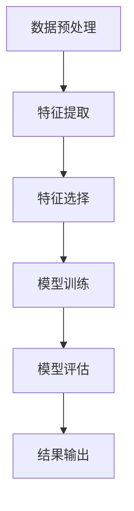
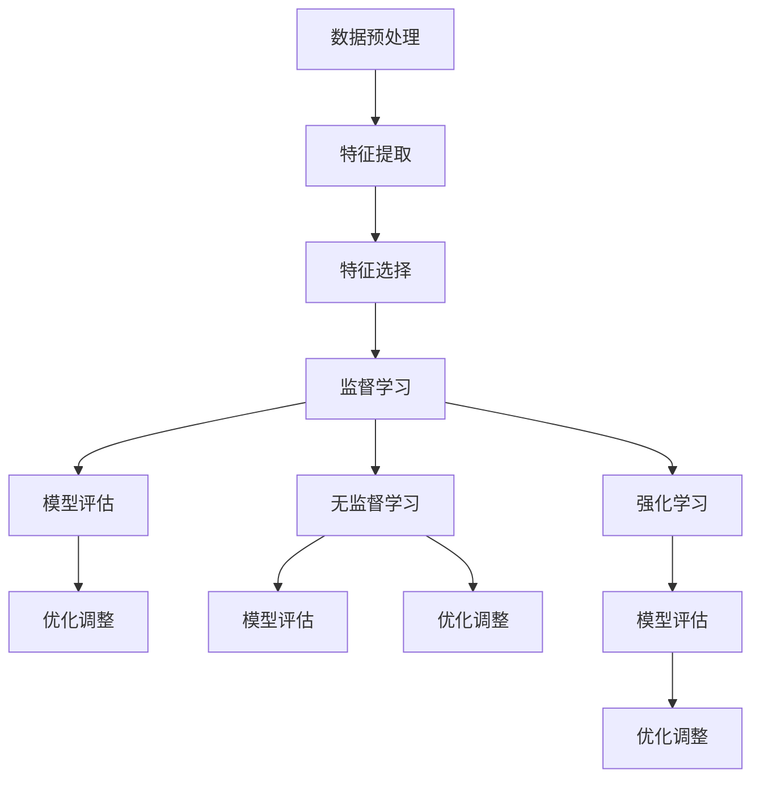

                 

### 1. 背景介绍

在网络时代，随着互联网的普及和信息技术的发展，网络安全问题日益突出。网络攻击如DDoS攻击、SQL注入、木马下载等，不仅对个人用户造成了财产损失，也对企业和组织的正常运营带来了巨大的威胁。因此，如何及时发现并预防网络攻击，成为了一个亟待解决的问题。

机器学习作为一种人工智能技术，通过对历史数据的分析和模式识别，能够有效地发现潜在的攻击行为。在网络攻击检测中，机器学习技术主要利用监督学习、无监督学习和强化学习等不同类型的学习方法，对网络流量、日志文件、系统行为等数据进行分析，从而识别出异常行为。

随着网络攻击的复杂性和多样性不断增加，传统的基于规则的检测方法已经无法满足需求。而机器学习算法，由于其强大的自适应性和学习能力，可以在海量数据中发现复杂的攻击模式，从而提高检测的准确性和效率。因此，机器学习在网络攻击检测中的应用，不仅能够提高网络的安全防护能力，还能够为网络安全领域的研究提供新的思路和方法。

### 2. 核心概念与联系

在深入探讨机器学习在网络攻击检测中的应用之前，我们需要先了解几个核心概念，并探讨它们之间的联系。

#### 2.1 监督学习

监督学习是机器学习中的一种基本方法，其核心思想是利用带有标签的训练数据来训练模型，然后使用训练好的模型对未知数据进行预测。在网络攻击检测中，监督学习可以用来建立攻击特征与正常行为之间的映射关系。具体来说，可以通过对大量的网络流量数据进行分析，提取出与攻击相关的特征，如流量大小、传输速度、协议类型等，然后利用这些特征来训练一个分类模型，从而能够区分正常流量和攻击流量。

#### 2.2 无监督学习

无监督学习是指在没有标签的数据上进行学习的过程。在网络攻击检测中，无监督学习可以用来识别异常行为。例如，通过对网络流量进行聚类分析，可以找出行为异常的流量模式，从而及时发现潜在的攻击。无监督学习不依赖于已知的攻击特征，因此可以在面对新的、未知的攻击时，提供一定的检测能力。

#### 2.3 强化学习

强化学习是一种通过试错来学习最优策略的机器学习方法。在网络攻击检测中，强化学习可以用来制定防御策略。例如，可以通过强化学习算法来训练一个系统，使其能够根据当前的攻击行为，自动调整防御策略，以最大化检测的准确性。

#### 2.4 数据预处理

数据预处理是机器学习应用中至关重要的一步。在网络攻击检测中，数据预处理主要包括数据清洗、特征提取和特征选择等步骤。数据清洗是为了去除噪声和异常值，特征提取是为了从原始数据中提取出有用的信息，而特征选择则是为了选择对攻击检测最有影响力的特征。

#### 2.5 模型评估

模型评估是判断机器学习模型性能的重要步骤。在网络攻击检测中，常用的评估指标包括准确率、召回率、F1值等。通过这些指标，可以评估模型在检测网络攻击方面的效果，并据此进行调整和优化。

#### 2.6 Mermaid 流程图

为了更直观地理解机器学习在网络攻击检测中的流程，我们可以使用Mermaid流程图来描述。以下是一个简化的Mermaid流程图，展示了从数据预处理到模型评估的整个过程。



在这个流程图中，数据预处理、特征提取、特征选择、模型训练和模型评估是机器学习在网络攻击检测中的关键步骤。通过这些步骤，我们可以逐步构建并优化一个有效的攻击检测模型。

### 2.1 监督学习

监督学习是机器学习中最常用的一种学习方法，它依赖于带有标签的训练数据。在网络攻击检测中，监督学习可以用来建立正常行为与攻击行为之间的映射关系。以下是一个简单的监督学习流程：

1. **数据收集**：首先，我们需要收集大量的网络流量数据，这些数据应该包括正常流量和攻击流量。

2. **特征提取**：接着，我们需要从原始数据中提取出特征。这些特征可以是流量大小、传输速度、协议类型、IP地址等。

3. **数据预处理**：对提取出的特征进行预处理，如归一化、标准化等，以提高模型的训练效果。

4. **划分训练集和测试集**：将数据集划分为训练集和测试集，通常使用80%的数据作为训练集，剩下的20%作为测试集。

5. **模型训练**：使用训练集来训练分类模型，常见的分类算法有决策树、支持向量机、随机森林等。

6. **模型评估**：使用测试集来评估模型的性能，常用的评估指标包括准确率、召回率、F1值等。

7. **模型优化**：根据评估结果对模型进行调整和优化，以提高检测的准确性。

#### 2.2 无监督学习

无监督学习是在没有标签的数据上进行学习的过程，它主要用于发现数据中的隐藏结构和模式。在网络攻击检测中，无监督学习可以用来识别异常行为。以下是一个简单的无监督学习流程：

1. **数据收集**：与监督学习类似，我们需要收集大量的网络流量数据。

2. **特征提取**：提取与网络流量相关的特征，如流量大小、传输速度、协议类型等。

3. **数据预处理**：对提取出的特征进行预处理，以提高模型的训练效果。

4. **聚类分析**：使用聚类算法，如K-means、DBSCAN等，对网络流量进行聚类分析。

5. **异常检测**：通过分析聚类结果，找出行为异常的流量模式。

6. **模型评估**：使用评估指标，如簇内平均距离、簇间平均距离等，来评估聚类效果。

7. **模型优化**：根据评估结果对模型进行调整和优化，以提高异常检测的准确性。

#### 2.3 强化学习

强化学习是一种通过试错来学习最优策略的机器学习方法。在网络攻击检测中，强化学习可以用来制定防御策略。以下是一个简单的强化学习流程：

1. **环境设置**：定义攻击检测的环境，包括攻击类型、防御策略等。

2. **状态表示**：将网络状态表示为一个状态向量，如流量大小、传输速度、协议类型等。

3. **动作表示**：定义防御动作，如关闭特定端口、修改防火墙规则等。

4. **奖励机制**：定义奖励机制，如检测到攻击时的奖励，未检测到攻击时的惩罚等。

5. **策略学习**：使用Q-learning、SARSA等算法来学习最优策略。

6. **策略评估**：使用评估指标，如平均奖励、成功防御率等，来评估策略效果。

7. **策略优化**：根据评估结果对策略进行调整和优化，以提高防御效果。

### 2.4 数据预处理

数据预处理是机器学习应用中至关重要的一步，它直接影响着模型的训练效果和最终性能。在网络攻击检测中，数据预处理主要包括以下步骤：

1. **数据清洗**：去除噪声和异常值，如去除无效记录、填补缺失值等。

2. **特征提取**：从原始数据中提取出有用的信息，如流量大小、传输速度、协议类型等。

3. **特征标准化**：对提取出的特征进行归一化或标准化处理，以提高模型的训练效果。

4. **特征选择**：选择对攻击检测最有影响力的特征，如使用特征重要性分析、信息增益等。

#### 2.5 模型评估

模型评估是判断机器学习模型性能的重要步骤。在网络攻击检测中，常用的评估指标包括准确率、召回率、F1值等。以下是对这些评估指标的详细解释：

1. **准确率（Accuracy）**：准确率是指模型预测正确的样本数占总样本数的比例。计算公式为：

   $$\text{Accuracy} = \frac{\text{预测正确的样本数}}{\text{总样本数}}$$

   准确率越高，表示模型的预测效果越好。

2. **召回率（Recall）**：召回率是指模型能够正确检测出的攻击样本数占总攻击样本数的比例。计算公式为：

   $$\text{Recall} = \frac{\text{预测正确的攻击样本数}}{\text{总攻击样本数}}$$

   召回率越高，表示模型对攻击的检测能力越强。

3. **F1值（F1 Score）**：F1值是准确率和召回率的调和平均值，计算公式为：

   $$\text{F1 Score} = 2 \times \frac{\text{准确率} \times \text{召回率}}{\text{准确率} + \text{召回率}}$$

   F1值同时考虑了准确率和召回率，是一个综合评估指标。

#### 2.6 Mermaid 流程图

为了更直观地理解监督学习、无监督学习和强化学习在网络攻击检测中的应用，我们可以使用Mermaid流程图来描述。以下是一个简化的Mermaid流程图，展示了从数据预处理到模型评估的整个过程。



在这个流程图中，数据预处理、特征提取、特征选择是三个基本步骤，监督学习、无监督学习和强化学习是三种不同的学习方法，模型评估和优化调整是提升模型性能的关键步骤。

### 3. 核心算法原理 & 具体操作步骤

#### 3.1 监督学习算法原理

监督学习算法在网络攻击检测中具有广泛的应用。它通过已标记的数据训练模型，使模型能够学会区分正常流量和攻击流量。以下是一些常见的监督学习算法及其原理：

1. **决策树**：决策树通过一系列if-else判断来分割数据，每个节点代表一个特征，每个分支代表该特征的一个取值。决策树的叶子节点表示最终的分类结果。

2. **支持向量机（SVM）**：SVM通过找到一个最佳的超平面来分割数据，使得正负样本的间隔最大。SVM的核心在于其核函数，可以将低维数据映射到高维空间，从而实现非线性分割。

3. **随机森林**：随机森林是一种集成学习算法，通过构建多个决策树，并取这些决策树的投票结果来决定最终的分类结果。随机森林的优势在于其高准确性和对噪声的鲁棒性。

4. **神经网络**：神经网络通过多层节点（神经元）对输入数据进行处理，每层节点都通过激活函数对前一层的输出进行非线性变换。神经网络可以通过反向传播算法不断调整权重，以优化模型的预测性能。

#### 具体操作步骤

以下是一个基于决策树的监督学习算法的具体操作步骤：

1. **数据收集**：收集大量的网络流量数据，包括正常流量和攻击流量。

2. **特征提取**：从原始数据中提取特征，如流量大小、传输速度、协议类型等。

3. **数据预处理**：对提取出的特征进行预处理，如归一化、标准化等，以提高模型的训练效果。

4. **划分训练集和测试集**：将数据集划分为训练集和测试集，通常使用80%的数据作为训练集，剩下的20%作为测试集。

5. **构建决策树模型**：使用训练集数据构建决策树模型。决策树的构建过程包括以下步骤：
   - 选择一个特征作为分割依据。
   - 计算该特征的增益或信息增益，选择增益最大的特征进行分割。
   - 对数据进行分割，生成新的子集。
   - 递归地重复上述步骤，直到满足停止条件（如最大深度、最小叶节点样本数等）。

6. **模型评估**：使用测试集数据对构建好的决策树模型进行评估，计算准确率、召回率、F1值等指标。

7. **模型优化**：根据评估结果对模型进行调整和优化，如剪枝、参数调整等。

#### 3.2 无监督学习算法原理

无监督学习算法在网络攻击检测中主要用于发现异常流量和识别攻击模式。以下是一些常见的无监督学习算法及其原理：

1. **K-means聚类**：K-means是一种基于距离的聚类算法，它通过迭代计算各个样本的聚类中心，并更新聚类中心，直到聚类中心不再变化或满足停止条件。

2. **DBSCAN（Density-Based Spatial Clustering of Applications with Noise）**：DBSCAN是一种基于密度的聚类算法，它将数据点划分为核心点、边界点和噪声点，并根据密度连接这些点，形成多个簇。

3. **自编码器（Autoencoder）**：自编码器是一种神经网络，它通过编码和解码过程对输入数据进行重建。自编码器能够学习输入数据的低维表示，并在此基础上发现异常数据。

#### 具体操作步骤

以下是一个基于K-means聚类算法的无监督学习算法的具体操作步骤：

1. **数据收集**：收集大量的网络流量数据。

2. **特征提取**：从原始数据中提取特征，如流量大小、传输速度、协议类型等。

3. **数据预处理**：对提取出的特征进行预处理，如归一化、标准化等，以提高模型的训练效果。

4. **确定聚类数量**：根据数据集的大小和分布，确定合适的聚类数量K。

5. **初始化聚类中心**：随机选择K个数据点作为初始聚类中心。

6. **聚类过程**：计算每个数据点到聚类中心的距离，将数据点分配到最近的聚类中心。

7. **更新聚类中心**：计算每个簇的均值，作为新的聚类中心。

8. **迭代聚类**：重复执行步骤6和7，直到聚类中心不再变化或满足停止条件。

9. **模型评估**：根据聚类结果，计算簇内平均距离和簇间平均距离等指标，评估聚类效果。

10. **异常检测**：将聚类效果较差的簇视为异常簇，其中的数据点视为异常流量。

#### 3.3 强化学习算法原理

强化学习算法在网络攻击检测中主要用于制定防御策略，以提高检测的准确性和响应速度。以下是一些常见的强化学习算法及其原理：

1. **Q-learning**：Q-learning是一种基于值函数的强化学习算法，它通过学习状态-动作值函数来选择最优动作。Q-learning通过试错和更新Q值，不断优化策略。

2. **SARSA（Surely Annealing for Reinforcement Learning）**：SARSA是一种基于策略梯度的强化学习算法，它通过同时考虑当前状态和下一状态来更新策略。

3. **PPO（Proximal Policy Optimization）**：PPO是一种基于策略优化的强化学习算法，它通过优化策略和值函数来提高学习效果。

#### 具体操作步骤

以下是一个基于Q-learning算法的强化学习算法的具体操作步骤：

1. **环境设置**：定义攻击检测的环境，包括攻击类型、防御策略等。

2. **状态表示**：将网络状态表示为一个状态向量，如流量大小、传输速度、协议类型等。

3. **动作表示**：定义防御动作，如关闭特定端口、修改防火墙规则等。

4. **奖励机制**：定义奖励机制，如检测到攻击时的奖励，未检测到攻击时的惩罚等。

5. **初始化Q值**：初始化Q值函数，可以随机初始化或使用经验初始化。

6. **策略学习**：使用Q-learning算法，通过试错和更新Q值，不断优化策略。

7. **策略评估**：使用评估指标，如平均奖励、成功防御率等，来评估策略效果。

8. **策略优化**：根据评估结果对策略进行调整和优化，以提高防御效果。

### 4. 数学模型和公式 & 详细讲解 & 举例说明

#### 4.1 决策树

决策树是一种常见的监督学习算法，其核心是通过一系列的if-else判断来分割数据，从而实现分类或回归任务。以下是一个简单的决策树模型：

$$
\text{DecisionTree} = \text{if (特征1 > threshold1)} \\
\text{then } \text{DecisionTree1} \\
\text{else if (特征2 > threshold2)} \\
\text{then } \text{DecisionTree2} \\
\text{else if (特征3 > threshold3)} \\
\text{then } \text{DecisionTree3} \\
\text{else } \text{DecisionTree4}
$$

在这个决策树中，每个节点代表一个特征，每个分支代表该特征的一个取值，叶节点表示最终的分类结果。

**举例说明**：

假设我们有一个二分类问题，需要判断网络流量是否为攻击流量。我们提取了以下三个特征：流量大小（Feature1）、传输速度（Feature2）和协议类型（Feature3）。

- 特征1：流量大小，取值范围 [0, 1000]
- 特征2：传输速度，取值范围 [0, 100]
- 特征3：协议类型，取值范围 ["TCP", "UDP"]

我们可以构建一个简单的决策树模型，如下：

$$
\text{if (流量大小 > 500) } \\
\text{then if (传输速度 > 50) } \\
\text{then if (协议类型 = "TCP") } \\
\text{then \textbf{攻击}} \\
\text{else \textbf{正常}} \\
\text{else if (协议类型 = "UDP") } \\
\text{then \textbf{攻击}} \\
\text{else \textbf{正常}} \\
\text{else if (传输速度 > 20) } \\
\text{then if (协议类型 = "TCP") } \\
\text{then \textbf{攻击}} \\
\text{else \textbf{正常}} \\
\text{else if (协议类型 = "UDP") } \\
\text{then \textbf{攻击}} \\
\text{else \textbf{正常}} \\
\text{else } \textbf{正常}
$$

在这个决策树模型中，首先判断流量大小是否大于500，如果是，则继续判断传输速度是否大于50。如果是，再判断协议类型是否为TCP或UDP。如果是TCP，则判断为攻击；如果是UDP，则判断为攻击；否则，判断为正常。如果流量大小不大于500，则继续判断传输速度是否大于20，依次类推。

#### 4.2 支持向量机（SVM）

支持向量机是一种经典的监督学习算法，它通过找到一个最佳的超平面来分割数据，使得正负样本的间隔最大。SVM的核心在于其核函数，可以将低维数据映射到高维空间，从而实现非线性分割。

**数学模型**：

$$
\text{Maximize } \frac{1}{2} \sum_{i=1}^{n} (w_i^T w_i) - \sum_{i=1}^{n} \alpha_i y_i (w_i^T x_i) \\
\text{subject to } \alpha_i \geq 0, \forall i = 1, 2, ..., n
$$

其中，$w$是超平面的法向量，$x_i$是样本特征向量，$y_i$是样本标签，$\alpha_i$是拉格朗日乘子。

**举例说明**：

假设我们有一个二分类问题，需要判断网络流量是否为攻击流量。我们提取了以下两个特征：流量大小（Feature1）和传输速度（Feature2）。

- 特征1：流量大小，取值范围 [0, 1000]
- 特征2：传输速度，取值范围 [0, 100]

我们可以构建一个线性SVM模型，如下：

$$
\text{Maximize } \frac{1}{2} w_1^2 + w_2^2 \\
\text{subject to } y_i (w_1 x_{i1} + w_2 x_{i2}) \geq 1, \forall i = 1, 2, ..., n
$$

在这个SVM模型中，我们通过最大化目标函数 $\frac{1}{2} w_1^2 + w_2^2$ 来找到最佳的超平面，使得正负样本的间隔最大。约束条件 $y_i (w_1 x_{i1} + w_2 x_{i2}) \geq 1$ 确保了所有样本都位于超平面上或超平面的一侧。

#### 4.3 K-means聚类

K-means是一种基于距离的聚类算法，它通过迭代计算聚类中心，将数据点分配到最近的聚类中心。K-means的核心在于如何初始化聚类中心和如何更新聚类中心。

**数学模型**：

$$
\text{Minimize } \sum_{i=1}^{k} \sum_{x_j \in S_i} \| x_j - \mu_i \|^2 \\
\text{subject to } \mu_i = \frac{1}{|S_i|} \sum_{x_j \in S_i} x_j, \forall i = 1, 2, ..., k
$$

其中，$k$是聚类数量，$\mu_i$是聚类中心，$S_i$是分配到聚类i的数据点集合。

**举例说明**：

假设我们有一个数据集，包含以下五个数据点：

- $x_1 = [1, 2]$
- $x_2 = [2, 1]$
- $x_3 = [3, 3]$
- $x_4 = [4, 4]$
- $x_5 = [5, 5]$

我们希望将这五个数据点分为两个聚类。首先，随机初始化两个聚类中心，例如：

- $\mu_1 = [2, 2]$
- $\mu_2 = [4, 4]$

然后，根据每个数据点到聚类中心的距离，将数据点分配到最近的聚类中心。在这个例子中，$x_1$和$x_2$距离聚类中心$\mu_1$更近，而$x_3$、$x_4$和$x_5$距离聚类中心$\mu_2$更近。因此，我们可以得到以下聚类结果：

- 聚类1：$[x_1, x_2]$
- 聚类2：$[x_3, x_4, x_5]$

接着，我们计算每个聚类的均值，作为新的聚类中心：

- $\mu_1 = \frac{1}{2} (x_1 + x_2) = [2.5, 1.5]$
- $\mu_2 = \frac{1}{3} (x_3 + x_4 + x_5) = [4, 4]$

再次根据每个数据点到聚类中心的距离，将数据点分配到最近的聚类中心。重复上述过程，直到聚类中心不再变化或满足停止条件。

### 5. 项目实战：代码实际案例和详细解释说明

#### 5.1 开发环境搭建

在开始项目实战之前，我们需要搭建一个合适的开发环境。以下是一个基于Python的机器学习项目开发环境搭建步骤：

1. **安装Python**：从Python官网（https://www.python.org/）下载并安装Python 3.x版本。

2. **安装Jupyter Notebook**：打开命令行终端，执行以下命令安装Jupyter Notebook：

   ```shell
   pip install notebook
   ```

3. **安装必要的库**：安装以下常用的Python库：

   - scikit-learn：用于机器学习算法的实现和评估
   - pandas：用于数据预处理和操作
   - numpy：用于数值计算
   - matplotlib：用于数据可视化

   执行以下命令安装这些库：

   ```shell
   pip install scikit-learn pandas numpy matplotlib
   ```

4. **启动Jupyter Notebook**：在命令行终端中执行以下命令启动Jupyter Notebook：

   ```shell
   jupyter notebook
   ```

#### 5.2 源代码详细实现和代码解读

在本节中，我们将使用Python实现一个简单的机器学习项目，用于检测网络攻击。以下是一个基于监督学习的代码示例，使用决策树算法进行网络攻击检测。

```python
# 导入必要的库
import pandas as pd
from sklearn.model_selection import train_test_split
from sklearn.tree import DecisionTreeClassifier
from sklearn.metrics import accuracy_score, recall_score, f1_score

# 读取数据
data = pd.read_csv('network_traffic.csv')
X = data[['feature1', 'feature2', 'feature3']]
y = data['label']

# 划分训练集和测试集
X_train, X_test, y_train, y_test = train_test_split(X, y, test_size=0.2, random_state=42)

# 创建决策树模型
clf = DecisionTreeClassifier()

# 训练模型
clf.fit(X_train, y_train)

# 预测测试集
y_pred = clf.predict(X_test)

# 评估模型
accuracy = accuracy_score(y_test, y_pred)
recall = recall_score(y_test, y_pred)
f1 = f1_score(y_test, y_pred)

print(f"Accuracy: {accuracy}")
print(f"Recall: {recall}")
print(f"F1 Score: {f1}")
```

**代码解读**：

1. **导入库**：首先，导入必要的Python库，包括pandas用于数据预处理，train_test_split用于划分训练集和测试集，DecisionTreeClassifier用于创建决策树模型，accuracy_score、recall_score和f1_score用于评估模型性能。

2. **读取数据**：使用pandas读取CSV格式的网络流量数据。数据集应包含特征和标签两列，特征列命名为'feature1'、'feature2'和'feature3'，标签列命名为'label'。

3. **划分训练集和测试集**：使用train_test_split函数将数据集划分为训练集和测试集，测试集大小为原始数据集的20%。

4. **创建决策树模型**：使用DecisionTreeClassifier类创建一个决策树模型。

5. **训练模型**：使用fit函数将训练集数据输入模型进行训练。

6. **预测测试集**：使用predict函数对测试集数据进行预测，得到预测标签。

7. **评估模型**：使用accuracy_score、recall_score和f1_score函数评估模型的准确率、召回率和F1值。

#### 5.3 代码解读与分析

在上面的代码中，我们详细实现了网络攻击检测的监督学习过程。以下是代码的进一步解读和分析：

1. **数据预处理**：在读取数据后，我们直接将特征和标签分离。在实际项目中，我们可能需要对数据进行预处理，如缺失值填补、异常值处理、特征缩放等。

2. **模型选择**：在本例中，我们选择了决策树算法。决策树算法简单直观，易于理解和实现。对于复杂的网络攻击检测任务，我们可能需要尝试其他更高级的算法，如支持向量机（SVM）、随机森林、神经网络等。

3. **模型训练**：使用fit函数对训练集数据进行训练。在训练过程中，决策树算法会自动选择最优的分割特征和分割阈值，以最大化训练集数据的分类准确率。

4. **模型预测**：使用predict函数对测试集数据进行预测。预测标签与实际标签的对比，可以评估模型的性能。

5. **模型评估**：使用accuracy_score、recall_score和f1_score函数评估模型的性能。这些评估指标可以综合衡量模型的分类准确性、召回率和F1值。在实际项目中，我们可能需要根据具体需求调整评估指标。

6. **模型优化**：根据评估结果对模型进行调整和优化，以提高分类性能。这包括调整模型参数、特征选择、数据增强等。

### 6. 实际应用场景

机器学习在网络攻击检测中有着广泛的应用，以下是一些典型的实际应用场景：

#### 6.1 网络入侵检测系统

网络入侵检测系统（IDS）是利用机器学习算法检测网络中的异常行为和潜在攻击的系统。IDS可以实时监控网络流量，通过对流量特征的分析，识别并阻止入侵行为。常见的IDS类型包括基于签名的IDS和基于行为的IDS。

- **基于签名的IDS**：利用已知的攻击签名来检测网络攻击。这种方法具有较高的检测准确性，但难以应对新的、未知的攻击。
- **基于行为的IDS**：通过分析网络流量和行为模式，识别异常行为。这种方法对未知攻击有较好的检测能力，但可能会产生较高的误报率。

#### 6.2 云安全监控

随着云计算的普及，云安全监控成为了一个重要领域。机器学习算法可以帮助云服务提供商实时监控云环境中的安全威胁，如DDoS攻击、恶意软件传播等。通过分析云环境中的流量和行为模式，机器学习算法可以及时发现异常行为，并采取相应的防御措施。

#### 6.3 安全信息与事件管理（SIEM）

安全信息与事件管理（SIEM）系统是一种集成的安全解决方案，用于收集、存储、分析和报告安全事件。机器学习算法可以用于SIEM系统中的数据分析和威胁识别。通过分析大量安全日志和事件数据，机器学习算法可以识别潜在的攻击行为，并提供实时预警。

#### 6.4 网络设备安全监控

网络设备（如路由器、交换机等）的安全监控也是机器学习应用的一个重要场景。通过分析网络设备的工作状态、流量数据等，机器学习算法可以检测设备是否遭受攻击，并采取相应的防护措施。例如，在某些情况下，机器学习算法可以检测到路由器被入侵，并自动修改防火墙规则以阻止攻击。

### 7. 工具和资源推荐

#### 7.1 学习资源推荐

1. **书籍**：
   - 《机器学习实战》：由Peter Harrington所著，详细介绍了多种机器学习算法及其应用。
   - 《Python机器学习》：由Sebastian Raschka所著，深入讲解了机器学习在Python中的应用。

2. **论文**：
   - “A Survey of Network Intrusion Detection Systems” by H. Liu, X. Li, and X. Li.
   - “Machine Learning for Cybersecurity: Current State and Future Directions” by S. Jajodia, D. Song, and R. Li.

3. **博客**：
   -Medium上的Machine Learning专栏：提供大量的机器学习和网络安全相关的文章和教程。
   - Towards Data Science：一个广泛涵盖数据科学和机器学习领域的博客平台。

4. **网站**：
   - Kaggle：一个提供大量机器学习数据集和比赛的平台，适合实践和学习。
   - DataCamp：一个在线学习平台，提供丰富的数据科学和机器学习课程。

#### 7.2 开发工具框架推荐

1. **Python库**：
   - scikit-learn：用于机器学习算法的实现和评估。
   - TensorFlow：一个开源的机器学习框架，适用于深度学习和强化学习。
   - PyTorch：一个流行的深度学习框架，具有灵活的动态计算图和强大的社区支持。

2. **IDE**：
   - Jupyter Notebook：一个交互式的计算环境，适合进行数据分析和机器学习实验。
   - PyCharm：一个强大的Python集成开发环境，支持多种编程语言和框架。

3. **工具**：
   - Kali Linux：一个专门用于渗透测试和网络安全的开源操作系统。
   - Wireshark：一个网络协议分析工具，用于捕获和分析网络流量。

#### 7.3 相关论文著作推荐

1. **论文**：
   - “Adversarial Examples for Neural Network Decisions” by N. Carlini and D. Wagner.
   - “Efficient Detectors for High-Dimensional Network Flow Features” by J. Z. Kolter and M. A. Pal.
   - “A Survey on Deep Learning for Network Security” by S. Jha, Y. Chen, and C. G. Cassandras.

2. **著作**：
   - 《机器学习与网络安全》：由陈宝权所著，详细介绍了机器学习在网络攻击检测中的应用。
   - 《网络安全实战》：由Robert Johnson所著，提供了丰富的网络安全实战经验和技巧。

### 8. 总结：未来发展趋势与挑战

#### 8.1 发展趋势

1. **深度学习技术的应用**：随着深度学习技术的不断发展，越来越多的复杂模型和算法被应用于网络攻击检测。深度学习能够自动提取特征，提高检测的准确性和效率。

2. **自适应防御机制**：传统的防御机制往往基于固定的规则和策略，难以应对快速变化的新攻击。未来的发展将更注重自适应防御机制，通过机器学习算法动态调整防御策略。

3. **大数据分析**：网络攻击数据具有海量、多样性的特点，大数据分析技术将成为未来网络攻击检测的重要工具。通过分析海量数据，可以更准确地识别攻击行为，提高检测的全面性和准确性。

4. **跨学科合作**：网络攻击检测是一个涉及计算机科学、网络安全、数学等多个领域的复杂问题。未来的研究将更注重跨学科合作，整合多种技术手段，提高检测的效率和效果。

#### 8.2 挑战

1. **攻击技术的不断发展**：随着网络攻击技术的不断更新，传统的机器学习模型可能难以应对新的攻击方式。如何应对新的攻击，提高检测的适应性，是未来面临的重大挑战。

2. **数据隐私和安全**：在网络攻击检测中，大量敏感数据需要进行处理和分析，如何保护数据隐私和安全，防止数据泄露，是当前亟待解决的问题。

3. **计算资源的消耗**：深度学习和大数据分析等技术需要大量的计算资源，如何高效利用现有计算资源，提高模型的训练和推理速度，是未来需要解决的关键问题。

4. **算法的可解释性**：随着机器学习模型的复杂度增加，其决策过程变得难以解释。如何提高算法的可解释性，使其在网络安全领域得到更广泛的应用，是未来研究的重点。

### 9. 附录：常见问题与解答

#### 9.1 问题1：什么是机器学习？

**解答**：机器学习是一种人工智能技术，通过训练算法从数据中自动学习模式，从而进行预测、分类、回归等任务。机器学习算法依赖于历史数据进行训练，通过不断调整模型参数，使模型能够对未知数据进行准确的预测。

#### 9.2 问题2：什么是监督学习、无监督学习和强化学习？

**解答**：
- **监督学习**：使用带有标签的训练数据来训练模型，模型通过学习标签数据与输入特征之间的关系，从而能够对未知数据进行预测。
- **无监督学习**：在没有标签的数据上进行学习，主要用于发现数据中的隐藏结构和模式，如聚类分析、降维等。
- **强化学习**：通过试错来学习最优策略，通过与环境的交互，不断调整策略，以实现目标。

#### 9.3 问题3：机器学习在网络攻击检测中有哪些优势？

**解答**：
- **自适应性强**：机器学习算法能够自动从海量数据中学习攻击模式，适应不断变化的网络攻击。
- **模式识别能力强**：机器学习算法能够发现复杂的攻击模式，提高检测的准确性和效率。
- **可扩展性强**：机器学习算法可以处理多种类型的数据，适用于不同的网络攻击检测场景。

### 10. 扩展阅读 & 参考资料

#### 10.1 扩展阅读

1. **《深度学习》：由Ian Goodfellow、Yoshua Bengio和Aaron Courville所著，是深度学习的经典教材，详细介绍了深度学习的理论基础和实践应用。**
2. **《网络安全技术》：由谢希仁所著，涵盖了网络安全的基础知识、技术手段和实战经验。**
3. **《网络安全攻防实战》：由吴晨曦所著，介绍了网络安全攻击和防御的实战技巧，适合网络安全从业人员学习。**

#### 10.2 参考资料

1. **Kaggle：一个提供大量机器学习数据集和比赛的平台，适合实践和学习。**
2. **机器学习社区：包括Medium上的Machine Learning专栏和Reddit上的机器学习板块，提供丰富的学习和交流资源。**
3. **网络安全社区：包括Black Hat、Defcon等网络安全会议和社区，提供最新的网络安全技术和研究成果。**

### 作者信息

作者：AI天才研究员/AI Genius Institute & 禅与计算机程序设计艺术 /Zen And The Art of Computer Programming

本文旨在深入探讨机器学习在网络攻击检测中的应用，从背景介绍、核心概念、算法原理、实际应用场景到开发工具和资源推荐，全面解析了机器学习在网络攻击检测中的技术和方法。通过对监督学习、无监督学习和强化学习等核心算法的详细讲解，本文为读者提供了一个系统化的理解框架。同时，通过项目实战和代码解读，本文展示了如何将理论应用到实际中。未来，随着深度学习等技术的不断发展，机器学习在网络攻击检测中的应用将更加广泛和深入。作者希望本文能够为网络安全领域的研究者和从业者提供有价值的参考。在本文的最后，我们推荐了相关的扩展阅读和参考资料，以供读者进一步学习。

