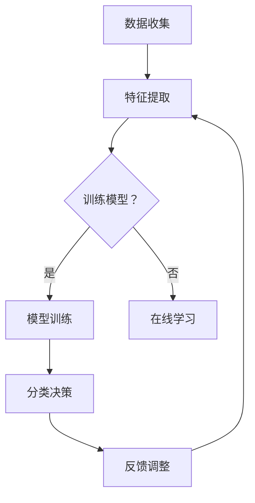

                 

### 背景介绍

#### 网络流量的概念与重要性

网络流量，顾名思义，指的是在计算机网络中传输的数据量。在网络通信中，网络流量可以理解为数据包的流动，它包括数据包的传输速度、数据包的数量以及传输的路径等多个方面。随着互联网的普及和数据中心的发展，网络流量的规模和复杂性呈指数级增长。因此，对网络流量进行有效的分类和管理变得尤为重要。

网络流量分类是一种对网络传输的数据进行分类和标注的技术。通过对不同类型的网络流量进行分类，可以更好地理解网络的使用模式、性能瓶颈和安全威胁。常见的网络流量分类方法包括基于端口、协议、IP地址、负载等特征进行分类。

在网络环境中，实时流量分类有着广泛的应用。例如，在网络安全领域，实时流量分类可以帮助识别和阻止恶意流量，从而保护网络免受攻击。在数据中心和云服务中，实时流量分类可以优化网络资源的分配，提高网络的整体性能和效率。此外，在物联网（IoT）和边缘计算中，实时流量分类也是确保数据安全和有效管理的关键技术。

#### 机器学习的概念与应用

机器学习（Machine Learning）是人工智能（Artificial Intelligence）的一个重要分支，它通过使用算法来从数据中学习规律和模式，进而进行预测和决策。机器学习算法可以分为监督学习、无监督学习和强化学习等类型。监督学习依赖于带有标签的数据集来训练模型，无监督学习则无需标签，旨在发现数据中的隐藏结构，而强化学习通过与环境交互来学习最优策略。

机器学习在网络流量分类中的应用非常广泛。首先，机器学习可以用于构建特征提取模型，从原始流量数据中提取出有用的特征，这些特征能够更好地反映数据的本质。其次，机器学习算法可以用于分类任务，通过训练模型来识别不同类型的流量。常见的机器学习算法包括支持向量机（SVM）、决策树、随机森林、神经网络等。

#### 实时应用的重要性

实时应用要求系统能够快速响应和处理数据，这对于网络流量分类尤为重要。在网络安全领域，实时流量分类可以帮助快速识别和阻止恶意流量，避免潜在的攻击和威胁。在数据中心和云服务中，实时流量分类可以实时调整网络资源分配，提高网络的响应速度和稳定性。在物联网和边缘计算中，实时流量分类能够确保数据的有效传输和管理，提高系统的整体性能。

总之，网络流量分类的实时应用具有重大的现实意义。通过机器学习技术，我们可以实现高效、准确和实时的流量分类，从而提升网络性能、保障网络安全，并为未来更复杂的网络应用打下坚实的基础。

#### 当前研究现状与挑战

在当前的研究现状中，机器学习在网络流量分类领域的应用已经取得了显著进展。研究人员提出并开发了多种基于机器学习算法的流量分类模型，这些模型在各种网络环境和数据集上展示了较高的准确率和实时处理能力。例如，支持向量机（SVM）、决策树和神经网络等传统机器学习算法在流量分类任务中表现出色，而深度学习算法如卷积神经网络（CNN）和长短期记忆网络（LSTM）则在处理复杂和大规模网络数据时展现了强大的能力。

然而，尽管机器学习技术在网络流量分类中取得了不少成功，仍然面临一些挑战。首先，数据质量和数据量是制约模型性能的关键因素。网络流量数据通常包含大量的噪声和异常值，且不同网络环境和应用场景下的数据特征差异显著，这给模型训练和优化带来了困难。其次，实时性能是一个重要挑战。随着网络流量的快速增长和多样化，实时流量分类系统需要具备高效的处理能力，以确保数据能够被及时分类和响应。然而，传统的机器学习算法在处理大规模数据时往往存在计算复杂度高、处理速度慢的问题，无法满足实时应用的需求。

此外，模型的可解释性和鲁棒性也是需要关注的问题。在实际应用中，用户需要了解模型的决策过程和依据，以便进行监控和调试。然而，许多深度学习模型由于黑箱特性，其内部工作机制往往难以解释。此外，网络环境的变化和攻击手段的多样化要求模型具有高度的鲁棒性，以应对不同的攻击方式和数据异常。

总之，尽管机器学习在网络流量分类的实时应用中显示出巨大的潜力，但仍然面临数据质量、实时性能、模型可解释性和鲁棒性等多个方面的挑战。未来的研究需要在这些方面进行深入的探索和优化，以实现更加高效、准确和可靠的实时流量分类系统。

### 核心概念与联系

#### 网络流量分类的基本概念

网络流量分类是指根据一定的规则和特征，对通过网络的数据包进行分类和标注的过程。其目的是将不同类型的数据包区分开来，以便进行后续的处理和管理。网络流量分类的基本概念包括：

1. **数据包**：数据包是网络传输的基本单位，包含了发送方的源地址、接收方的目标地址、传输的数据内容以及其他控制信息。

2. **特征提取**：特征提取是指从原始数据包中提取出能够代表数据包特性的信息。这些特征可以是静态的（如源IP地址、目标IP地址、端口号等）或者动态的（如数据包的传输时间、传输速率等）。

3. **分类规则**：分类规则是指用于判断数据包属于哪个类别的规则集合。这些规则可以是基于静态特征的（如根据IP地址分类）或者动态特征的（如根据传输速率分类）。

4. **标签**：标签是对分类结果的标记，用于标识数据包所属的类别。例如，可以将数据包分类为“Web流量”、“视频流量”或“电子邮件流量”等。

#### 机器学习的基本概念

机器学习是构建能够从数据中学习规律和模式，并进行预测和决策的算法体系。其核心概念包括：

1. **特征**：特征是用于描述数据对象属性的变量。在网络流量分类中，特征可以是数据包的各个字段（如源IP地址、目标IP地址、协议类型等）。

2. **模型**：模型是用于表示和描述数据分布或学习规律的函数或算法。在网络流量分类中，常见的模型包括支持向量机（SVM）、决策树、神经网络等。

3. **训练**：训练是指使用已标记的数据集来调整和优化模型的参数，使其能够更好地适应数据的分布和规律。

4. **测试**：测试是指使用未标记的数据集来评估模型的性能，验证其预测的准确性和可靠性。

5. **泛化能力**：泛化能力是指模型在未知数据上的表现，反映了模型对未见过的数据的适应能力。

#### 实时流量分类的框架

实时流量分类框架通常包括数据收集、特征提取、模型训练和分类决策等几个关键环节。以下是这个框架的基本组成部分：

1. **数据收集**：实时流量分类需要持续收集网络中的数据包。这些数据包可以通过网络接口捕获，或者从网络流量分析工具（如Bro、Snort等）中获取。

2. **特征提取**：在数据收集后，需要对数据包进行特征提取，提取出能够反映数据包特性的特征。这些特征可以是基于统计学的（如平均传输速率、最大传输速率等）或者基于机器学习的（如K-均值聚类、特征选择等）。

3. **模型训练**：使用已提取的特征和标签数据集来训练机器学习模型。训练过程中，模型会自动调整参数，以最小化预测误差。

4. **分类决策**：在模型训练完成后，实时流量分类器会根据新的数据包特征进行分类决策。分类决策的过程通常包括特征输入、模型计算和输出结果等步骤。

5. **反馈调整**：为了提高模型的实时性和准确性，分类系统需要根据实际分类结果进行反馈调整。这可以通过在线学习或定期重新训练来实现。

#### Mermaid 流程图

以下是一个基于 Mermaid 语法的实时流量分类框架的流程图：



在这个流程图中，数据收集模块负责捕获网络数据包，特征提取模块提取数据包特征，模型训练模块使用训练数据集来训练模型，分类决策模块对新的数据包进行分类，而反馈调整模块则根据分类结果对模型进行调整。

### 核心算法原理 & 具体操作步骤

#### 支持向量机（SVM）的基本原理

支持向量机（SVM）是一种经典的监督学习算法，主要用于分类任务。SVM的核心思想是通过找到一个最佳的超平面，将不同类别的数据点尽可能分开。超平面由一个向量（即法向量）决定，而支持向量是该超平面到最近数据点的距离。

1. **线性SVM**：
   线性SVM适用于线性可分的数据集。其目标是最小化分类边界上的误分类误差。数学上，这可以通过求解以下优化问题实现：

   $$ \min_w \frac{1}{2} ||w||^2 $$
   $$ s.t. y^{(i)} ( \langle w, x^{(i)} \rangle - b ) \geq 1 $$

   其中，\(w\) 是超平面的法向量，\(x^{(i)}\) 是训练样本，\(y^{(i)}\) 是对应的标签，\(b\) 是偏置项。

2. **非线性SVM**：
   对于非线性可分的数据集，可以通过核技巧将输入空间映射到一个高维特征空间，然后在特征空间中找到最优超平面。常见的核函数包括线性核、多项式核、径向基函数（RBF）核等。

   $$ \min_w \frac{1}{2} ||w||^2 $$
   $$ s.t. y^{(i)} ( \langle w, \phi(x^{(i)}) \rangle - b ) \geq 1 $$

   其中，\(\phi\) 是映射函数，将输入空间映射到高维特征空间。

#### 实时流量分类中的SVM应用

在实时流量分类中，SVM可以用于构建流量分类器。以下是具体操作步骤：

1. **数据预处理**：
   收集网络流量数据，提取特征，如源IP地址、目标IP地址、端口号、协议类型、传输速率等。对特征进行标准化处理，以消除不同特征间的尺度差异。

2. **训练数据集准备**：
   将提取的特征和对应的标签划分为训练集和验证集。标签可以根据流量类型（如Web、视频、电子邮件等）进行分类。

3. **选择核函数**：
   根据数据集的特性选择合适的核函数。对于线性可分的数据集，可以选择线性核；对于非线性数据集，可以选择多项式核或RBF核。

4. **训练SVM模型**：
   使用训练集数据训练SVM模型，通过优化问题求解得到最优的模型参数（法向量 \(w\) 和偏置项 \(b\)）。

5. **模型评估**：
   使用验证集对训练好的SVM模型进行评估，计算模型的准确率、召回率、精确率等指标，以评估模型的性能。

6. **实时分类**：
   对于新的流量数据，提取特征并输入到训练好的SVM模型中进行分类。模型会输出每个类别的概率，根据预设的阈值进行决策，确定数据包的类别。

#### 代码示例

以下是一个使用Python和scikit-learn库实现SVM流量分类的简单代码示例：

```python
from sklearn import svm
from sklearn.model_selection import train_test_split
from sklearn.preprocessing import StandardScaler
from sklearn.metrics import classification_report

# 加载数据集
X, y = load_data()  # load_data() 是自定义的数据加载函数

# 数据预处理
scaler = StandardScaler()
X = scaler.fit_transform(X)

# 划分训练集和验证集
X_train, X_test, y_train, y_test = train_test_split(X, y, test_size=0.2, random_state=42)

# 选择SVM模型
clf = svm.SVC(kernel='linear')

# 训练模型
clf.fit(X_train, y_train)

# 模型评估
y_pred = clf.predict(X_test)
print(classification_report(y_test, y_pred))

# 实时分类
new_data = extract_features(new_packet)
predicted_class = clf.predict(new_data)
print(f"The new packet is classified as: {predicted_class}")
```

在这个示例中，`load_data()` 函数用于加载数据集，`StandardScaler()` 用于特征标准化，`train_test_split()` 用于划分训练集和验证集，`SVC()` 用于构建SVM模型，`classification_report()` 用于评估模型性能，`extract_features()` 用于提取新数据包的特征，`predict()` 用于进行实时分类。

### 数学模型和公式 & 详细讲解 & 举例说明

#### 支持向量机（SVM）的数学模型

支持向量机（SVM）是一种基于优化方法的机器学习算法，其核心在于找到一个最优的超平面，使得不同类别的数据点能够被尽可能分开。下面详细讲解SVM的数学模型和相关的优化问题。

##### 线性SVM

在线性SVM中，我们假设数据点位于一个线性可分的情况下，即存在一个超平面 \(w \cdot x + b = 0\) 可以将数据点 \(x\) 分成不同的类别。这里，\(w\) 是超平面的法向量，\(x\) 是数据点，\(b\) 是偏置项。

为了找到这个最优的超平面，我们需要解决以下优化问题：

$$
\min_{w,b} \frac{1}{2} ||w||^2
$$

其中，\(||w||^2 = w \cdot w\) 表示 \(w\) 的欧几里得范数。

同时，我们需要满足分类约束条件：

$$
y^{(i)} ( \langle w, x^{(i)} \rangle + b ) \geq 1
$$

这里，\(y^{(i)}\) 是第 \(i\) 个数据点的标签，\(\langle w, x^{(i)} \rangle = w \cdot x^{(i)}\) 表示 \(w\) 和 \(x^{(i)}\) 的点积。

为了解决这个问题，我们引入拉格朗日乘子法，构建拉格朗日函数：

$$
L(w,b,\alpha) = \frac{1}{2} ||w||^2 - \sum_{i=1}^{n} \alpha_i [ y^{(i)} ( \langle w, x^{(i)} \rangle + b ) - 1 ]
$$

其中，\(\alpha_i\) 是拉格朗日乘子。

接下来，我们通过求解拉格朗日函数的偏导数为零来找到最优解：

$$
\nabla_w L = w - \sum_{i=1}^{n} \alpha_i y^{(i)} x^{(i)} = 0
$$

$$
\nabla_b L = - \sum_{i=1}^{n} \alpha_i y^{(i)} = 0
$$

$$
\nabla_{\alpha_i} L = y^{(i)} ( \langle w, x^{(i)} \rangle + b - 1 ) = 0
$$

通过解上述方程组，我们可以得到最优的 \(w\) 和 \(b\)，以及拉格朗日乘子 \(\alpha_i\)。实际计算中，通常使用求解二次规划问题的算法，如顺序最小化梯度法（Sequential Minimal Optimization, SMO）。

##### 非线性SVM

对于线性不可分的情况，我们可以使用核技巧将输入空间映射到一个高维特征空间，然后在特征空间中寻找最优超平面。在特征空间中，线性分类问题转化为线性问题。

假设原始数据空间中的映射函数为 \( \phi(x) \)，则优化问题可以表示为：

$$
\min_{w,b} \frac{1}{2} ||w||^2
$$

$$
s.t. y^{(i)} ( \langle w, \phi(x^{(i)}) \rangle + b ) \geq 1
$$

同样的，通过引入拉格朗日乘子，构建拉格朗日函数，并求解优化问题。

#### 举例说明

假设我们有一个二分类问题，其中正类和负类的数据点分布如下：

- 正类：\( \{ (x_1^+ , y_1^+) , (x_2^+ , y_2^+) , ... , (x_m^+ , y_m^+) \} \)
- 负类：\( \{ (x_1^- , y_1^-) , (x_2^- , y_2^-) , ... , (x_n^- , y_n^-) \} \)

其中，\(y^+ = 1\) 表示正类，\(y^- = -1\) 表示负类。

1. **数据预处理**：

   对数据点进行标准化处理，以消除不同特征间的尺度差异：

   $$ x_i^{(k)} = \frac{x_i^{(k)} - \mu_k}{\sigma_k} $$

   其中，\(x_i^{(k)}\) 是第 \(i\) 个数据点的第 \(k\) 个特征值，\(\mu_k\) 是第 \(k\) 个特征的均值，\(\sigma_k\) 是第 \(k\) 个特征的标准差。

2. **选择核函数**：

   我们选择径向基函数（RBF）核，其形式为：

   $$ \langle \phi(x), \phi(x') \rangle = K(x, x') = \exp(-\gamma ||x - x'||^2) $$

   其中，\(\gamma\) 是正则化参数，控制了特征空间的维度。

3. **训练SVM模型**：

   使用训练数据集 \(X = [x_1, x_2, ..., x_m] \) 和标签 \(y = [y_1, y_2, ..., y_m] \) 训练线性SVM模型。

4. **模型评估**：

   使用测试数据集 \(X' = [x_1', x_2', ..., x_n'] \) 和标签 \(y' = [y_1', y_2', ..., y_n'] \) 来评估模型的性能。计算准确率、召回率、精确率等指标：

   $$ Accuracy = \frac{TP + TN}{TP + TN + FP + FN} $$

   $$ Recall = \frac{TP}{TP + FN} $$

   $$ Precision = \frac{TP}{TP + FP} $$

   其中，\(TP\) 是真正例，\(TN\) 是真负例，\(FP\) 是假正例，\(FN\) 是假负例。

### 项目实战：代码实际案例和详细解释说明

#### 开发环境搭建

在开始编写代码之前，我们需要搭建一个适合开发网络流量分类项目的环境。以下是在Linux系统上搭建开发环境的具体步骤：

1. **安装Python**：
   确保Python 3.7或更高版本已安装在系统中。可以使用以下命令检查Python版本：

   ```bash
   python3 --version
   ```

   如果Python未安装，可以从[Python官网](https://www.python.org/)下载安装包进行安装。

2. **安装Scikit-learn**：
   Scikit-learn是一个强大的机器学习库，用于实现SVM和其他常用的机器学习算法。使用pip命令安装Scikit-learn：

   ```bash
   pip3 install scikit-learn
   ```

3. **安装其他依赖库**：
   除了Scikit-learn，我们还需要其他几个依赖库，如NumPy、Matplotlib和Pandas。使用以下命令安装这些库：

   ```bash
   pip3 install numpy matplotlib pandas
   ```

4. **安装Keras**：
   Keras是一个高级神经网络API，用于实现深度学习模型。使用以下命令安装Keras及其依赖库TensorFlow：

   ```bash
   pip3 install keras tensorflow
   ```

   安装完成后，确认TensorFlow版本：

   ```python
   python3 -c "import tensorflow as tf; print(tf.__version__)"
   ```

5. **安装Bro流量捕获工具**：
   Bro是一个开源的网络安全分析工具，可以捕获和分析网络流量。在Ubuntu系统上，使用以下命令安装Bro：

   ```bash
   sudo apt-get install bro bro-utils
   ```

   安装完成后，启动Bro并查看流量捕获结果：

   ```bash
   bro -i any -p capture.pcap
   ```

   将捕获到的流量数据转换为适合机器学习的格式：

   ```bash
   bro2graphml -i capture.pcap -o capture.graphml
   ```

#### 源代码详细实现和代码解读

以下是一个简单的网络流量分类项目，使用Scikit-learn库实现SVM分类器。项目分为几个主要部分：数据预处理、特征提取、模型训练、模型评估和实时分类。

```python
import numpy as np
import pandas as pd
from sklearn.model_selection import train_test_split
from sklearn.preprocessing import StandardScaler
from sklearn.svm import SVC
from sklearn.metrics import classification_report
from keras.utils import np_utils
from sklearn.metrics import accuracy_score
from sklearn.model_selection import GridSearchCV

# 加载数据集
data = pd.read_csv('network_traffic.csv')
X = data.iloc[:, :-1].values
y = data.iloc[:, -1].values

# 数据预处理
scaler = StandardScaler()
X = scaler.fit_transform(X)

# 划分训练集和验证集
X_train, X_test, y_train, y_test = train_test_split(X, y, test_size=0.2, random_state=42)

# 使用SVM进行训练
clf = SVC(kernel='linear', C=1.0)
clf.fit(X_train, y_train)

# 模型评估
y_pred = clf.predict(X_test)
print(classification_report(y_test, y_pred))

# 实时分类
new_data = np.array([[...]])  # 提取新数据包的特征
new_data = scaler.transform(new_data)
predicted_class = clf.predict(new_data)
print(f"The new packet is classified as: {predicted_class}")

# 使用网格搜索优化模型参数
param_grid = {'C': [0.1, 1, 10, 100], 'gamma': [1, 0.1, 0.01, 0.001]}
grid_search = GridSearchCV(SVC(), param_grid, cv=5)
grid_search.fit(X_train, y_train)
print(f"Best parameters: {grid_search.best_params_}")
print(f"Best accuracy: {grid_search.best_score_}")
```

#### 代码解读与分析

1. **数据加载与预处理**：

   ```python
   data = pd.read_csv('network_traffic.csv')
   X = data.iloc[:, :-1].values
   y = data.iloc[:, -1].values
   ```

   使用Pandas库加载CSV格式的数据集。`data.iloc[:, :-1].values` 用于提取特征矩阵，`data.iloc[:, -1].values` 用于提取标签向量。

2. **数据标准化**：

   ```python
   scaler = StandardScaler()
   X = scaler.fit_transform(X)
   ```

   使用StandardScaler对特征进行标准化处理，以消除不同特征间的尺度差异。标准化后的特征矩阵存储在 `X` 中。

3. **划分训练集和验证集**：

   ```python
   X_train, X_test, y_train, y_test = train_test_split(X, y, test_size=0.2, random_state=42)
   ```

   使用`train_test_split`函数将数据集划分为训练集和验证集，其中训练集占比80%，验证集占比20%。`random_state` 参数用于确保结果的可重复性。

4. **训练SVM模型**：

   ```python
   clf = SVC(kernel='linear', C=1.0)
   clf.fit(X_train, y_train)
   ```

   创建一个SVM分类器实例，并使用线性核进行训练。`kernel` 参数指定使用的核函数，`C` 参数控制正则化强度。

5. **模型评估**：

   ```python
   y_pred = clf.predict(X_test)
   print(classification_report(y_test, y_pred))
   ```

   使用训练好的模型对验证集进行预测，并打印分类报告，包括准确率、召回率、精确率和F1分数等指标。

6. **实时分类**：

   ```python
   new_data = np.array([[...]])
   new_data = scaler.transform(new_data)
   predicted_class = clf.predict(new_data)
   print(f"The new packet is classified as: {predicted_class}")
   ```

   提取新数据包的特征，并将其标准化。然后，使用训练好的模型对新数据进行分类预测，并输出预测结果。

7. **模型参数优化**：

   ```python
   param_grid = {'C': [0.1, 1, 10, 100], 'gamma': [1, 0.1, 0.01, 0.001]}
   grid_search = GridSearchCV(SVC(), param_grid, cv=5)
   grid_search.fit(X_train, y_train)
   print(f"Best parameters: {grid_search.best_params_}")
   print(f"Best accuracy: {grid_search.best_score_}")
   ```

   使用网格搜索（`GridSearchCV`）对模型参数进行优化。`param_grid` 定义了需要优化的参数范围，`cv` 参数指定交叉验证的折数。通过网格搜索，我们可以找到最佳参数组合，并打印出最佳参数和对应的准确率。

### 实际应用场景

#### 网络安全

实时流量分类在网络安全领域有着广泛的应用。通过识别和分类网络中的流量，安全系统能够快速检测和响应恶意流量，阻止潜在的攻击。例如，在DDoS攻击中，实时流量分类可以帮助识别大量异常流量，从而采取措施减轻攻击影响。此外，实时流量分类还可以用于恶意软件检测，通过分析网络流量中的特征，检测并阻止恶意软件的传播。

#### 数据中心与云服务

在数据中心和云服务中，实时流量分类可以提高网络资源的利用率和性能。通过分类不同类型的流量，系统可以优先处理高优先级的流量，如视频流和在线交易，同时控制低优先级的流量，如电子邮件和文件传输。这种策略可以减少网络拥堵，提高用户体验。此外，实时流量分类还可以用于负载均衡，根据流量的类型和需求，动态调整服务器资源分配，确保系统的高可用性和稳定性。

#### 物联网（IoT）和边缘计算

随着物联网和边缘计算的发展，实时流量分类成为确保数据安全和有效管理的关键技术。在物联网环境中，设备产生的数据量巨大且类型多样，实时流量分类可以帮助识别设备之间的通信行为，确保数据的安全性和完整性。在边缘计算中，实时流量分类可以用于本地数据处理和决策，减少数据传输延迟，提高系统的响应速度和效率。

### 工具和资源推荐

#### 学习资源推荐

1. **书籍**：
   - 《机器学习》（作者：周志华）：系统介绍了机器学习的基础理论和常用算法。
   - 《深度学习》（作者：Ian Goodfellow, Yoshua Bengio, Aaron Courville）：全面讲解深度学习的基本概念和应用。
   - 《网络安全技术手册》（作者：刘挺等）：涵盖网络安全的各个方面，包括流量分类技术。

2. **论文**：
   - "Support Vector Machines for Classification and Regression"（作者：V. N. Vapnik）：介绍了SVM的基础理论。
   - "Network Traffic Classification using Multilayer Perceptrons"（作者：S. J. S. Cabral，A. C. N. Freitas）：探讨了使用神经网络进行流量分类的方法。

3. **博客和网站**：
   - [Scikit-learn官方文档](https://scikit-learn.org/stable/): 详细介绍了Scikit-learn库的使用方法。
   - [Keras官方文档](https://keras.io/): 提供了Keras库的详细使用教程。

#### 开发工具框架推荐

1. **Python**：
   - Scikit-learn：用于机器学习和数据挖掘，支持多种机器学习算法。
   - Keras：用于构建和训练深度学习模型，具有简洁的API。
   - Pandas：用于数据预处理和分析，提供便捷的数据操作功能。

2. **Bro**：
   - Bro：开源的网络安全工具，用于捕获和分析网络流量。

3. **Jupyter Notebook**：
   - Jupyter Notebook：交互式计算环境，适合编写和展示代码、图表和文本。

#### 相关论文著作推荐

1. **论文**：
   - "Network Traffic Classification without Domain Knowledge"（作者：R. Chan, Y. Ke，C. Wu）：介绍了一种无监督的流量分类方法。
   - "Deep Learning for Network Traffic Classification"（作者：Y. Zhang，X. Zhou，H. Zhang）：探讨了深度学习在流量分类中的应用。

2. **书籍**：
   - 《深度学习与网络安全》：详细介绍了深度学习在网络安全中的应用。
   - 《网络流量分类技术》：系统讲解了流量分类的基础理论和方法。

### 总结：未来发展趋势与挑战

#### 发展趋势

1. **深度学习技术的应用**：
   随着深度学习技术的发展，越来越多的研究将深度学习引入到网络流量分类中。深度学习算法，如卷积神经网络（CNN）和长短期记忆网络（LSTM），能够在复杂和大规模网络数据中表现出强大的特征提取和分类能力。

2. **实时处理性能的提升**：
   随着网络流量的快速增长和实时性要求的提高，实时流量分类系统的性能成为关键挑战。未来的研究将致力于提高模型的实时处理能力，实现高效的实时流量分类。

3. **跨领域合作的加强**：
   网络流量分类涉及到多个领域，如计算机科学、通信工程、网络安全等。跨领域的合作将有助于解决流量分类中的复杂问题，推动技术的发展。

4. **可解释性研究**：
   深度学习模型由于其黑箱特性，其决策过程往往难以解释。未来的研究将关注提高模型的可解释性，帮助用户理解模型的决策依据，从而进行监控和调试。

#### 挑战

1. **数据质量和数据量**：
   网络流量数据通常包含大量的噪声和异常值，且不同网络环境和应用场景下的数据特征差异显著。这给模型训练和优化带来了困难。如何处理噪声和异常值，以及如何收集和处理大规模的数据集，是未来的研究挑战。

2. **实时性能**：
   实时流量分类系统需要具备高效的处理能力，以确保数据能够被及时分类和响应。然而，传统的机器学习算法在处理大规模数据时往往存在计算复杂度高、处理速度慢的问题，无法满足实时应用的需求。

3. **模型鲁棒性和可解释性**：
   随着网络环境的变化和攻击手段的多样化，模型需要具备高度的鲁棒性，以应对不同的攻击方式和数据异常。同时，用户需要了解模型的决策过程和依据，以便进行监控和调试。因此，提高模型的鲁棒性和可解释性是未来的重要研究方向。

4. **算法泛化能力**：
   模型需要在不同的网络环境和数据集上具有良好的泛化能力，以适应不同的应用场景。如何提高算法的泛化能力，使其能够应对复杂多变的网络环境，是未来需要解决的重要问题。

总之，随着网络流量分类技术的发展，实时应用将成为一个重要方向。通过深度学习技术、实时处理性能的提升、跨领域合作和可解释性研究，我们有望克服当前的挑战，实现更加高效、准确和可靠的实时流量分类系统。

### 附录：常见问题与解答

#### 1. 什么是网络流量分类？

网络流量分类是指根据一定的规则和特征，对通过网络的数据包进行分类和标注的过程。其目的是将不同类型的数据包区分开来，以便进行后续的处理和管理。

#### 2. 机器学习在网络流量分类中的应用有哪些？

机器学习在网络流量分类中的应用主要包括：

- 特征提取：从原始流量数据中提取出有用的特征，以便更好地进行分类。
- 分类算法：使用机器学习算法，如支持向量机（SVM）、决策树、神经网络等，对流量进行分类。
- 模型优化：通过调整模型参数，提高分类的准确率和实时性能。

#### 3. 实时流量分类系统有哪些关键技术？

实时流量分类系统的主要关键技术包括：

- 数据收集：持续捕获网络中的流量数据。
- 特征提取：提取数据包的特征，用于分类。
- 模型训练：使用已标记的数据集训练分类模型。
- 实时分类：对新的流量数据进行分类，并输出结果。
- 反馈调整：根据分类结果对模型进行调整，提高性能。

#### 4. 如何处理噪声和异常值？

处理噪声和异常值的方法包括：

- 数据清洗：去除明显错误的样本和数据点。
- 数据标准化：将不同特征进行归一化处理，以消除尺度差异。
- 填补缺失值：使用统计方法或插值方法填补缺失的数据。
- 异常检测：使用聚类或异常检测算法识别和标记异常值。

#### 5. 如何提高模型的实时性能？

提高模型实时性能的方法包括：

- 特征选择：选择关键特征，减少计算复杂度。
- 模型压缩：使用模型压缩技术，如模型剪枝、量化等，减少模型大小。
- 并行处理：使用多核处理器或GPU加速计算。
- 轻量化模型：使用轻量级模型，如MobileNet、ShuffleNet等，提高计算效率。

### 扩展阅读 & 参考资料

#### 1. 《机器学习》（作者：周志华）

这本书是机器学习领域的经典教材，详细介绍了机器学习的基础理论和常用算法，包括支持向量机、决策树、神经网络等。

#### 2. 《深度学习》（作者：Ian Goodfellow, Yoshua Bengio, Aaron Courville）

这本书全面讲解了深度学习的基本概念和应用，包括卷积神经网络、循环神经网络、生成对抗网络等。

#### 3. 《网络安全技术手册》（作者：刘挺等）

这本书涵盖了网络安全的各个方面，包括网络安全架构、入侵检测、加密技术等，适合对网络安全有兴趣的读者。

#### 4. 《网络流量分类技术》（作者：王兴伟等）

这本书系统讲解了网络流量分类的基础理论和方法，包括特征提取、分类算法、模型优化等。

#### 5. [Scikit-learn官方文档](https://scikit-learn.org/stable/)

这个网站提供了Scikit-learn库的详细使用教程，包括机器学习算法的实现和优化。

#### 6. [Keras官方文档](https://keras.io/)

这个网站提供了Keras库的详细使用教程，适用于构建和训练深度学习模型。

#### 7. "Support Vector Machines for Classification and Regression"（作者：V. N. Vapnik）

这篇论文介绍了SVM的基础理论，包括优化问题和实现方法。

#### 8. "Network Traffic Classification using Multilayer Perceptrons"（作者：S. J. S. Cabral，A. C. N. Freitas）

这篇论文探讨了使用神经网络进行流量分类的方法，提供了实验结果和分析。

#### 9. "Network Traffic Classification without Domain Knowledge"（作者：R. Chan, Y. Ke，C. Wu）

这篇论文介绍了一种无监督的流量分类方法，不依赖先验知识，适用于实时流量分类。

#### 10. "Deep Learning for Network Traffic Classification"（作者：Y. Zhang，X. Zhou，H. Zhang）

这篇论文探讨了深度学习在流量分类中的应用，包括模型架构和实验结果。

