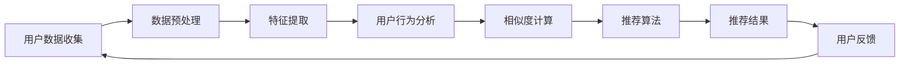

                 

# 机器学习在音乐推荐系统中的应用研究

> **关键词：机器学习、音乐推荐系统、协同过滤、用户行为分析、特征工程、深度学习**

> **摘要：本文深入探讨了机器学习在音乐推荐系统中的应用，从协同过滤算法到深度学习模型的演进，详细分析了不同算法的原理和实现步骤，并通过具体案例展示了如何利用机器学习技术构建高效的音乐推荐系统。文章旨在为从事音乐推荐系统开发的工程师提供理论指导和实践参考。**

## 1. 背景介绍

### 1.1 目的和范围

本文的主要目的是探讨机器学习在音乐推荐系统中的应用，从理论到实践，系统性地分析不同算法的工作原理和实现步骤，以便为开发高效的推荐系统提供指导。本文将涵盖以下内容：

- 介绍机器学习和音乐推荐系统的基本概念。
- 分析协同过滤算法的原理和实现。
- 讨论深度学习在音乐推荐中的应用。
- 通过具体案例展示如何构建音乐推荐系统。
- 推荐相关学习资源和开发工具。

### 1.2 预期读者

本文适合以下读者群体：

- 对机器学习和音乐推荐系统感兴趣的初学者。
- 想要深入了解音乐推荐系统工作原理的工程师。
- 致力于提升音乐推荐系统性能的技术专家。

### 1.3 文档结构概述

本文结构如下：

- **第1章**：背景介绍，包括目的、预期读者、文档结构和相关术语定义。
- **第2章**：核心概念与联系，通过Mermaid流程图展示音乐推荐系统的基本架构。
- **第3章**：核心算法原理与具体操作步骤，详细阐述协同过滤和深度学习算法。
- **第4章**：数学模型和公式，解释推荐系统中的关键数学概念和公式。
- **第5章**：项目实战，提供代码实际案例和详细解释。
- **第6章**：实际应用场景，讨论音乐推荐系统的各种应用场景。
- **第7章**：工具和资源推荐，介绍学习资源和开发工具。
- **第8章**：总结，展望未来的发展趋势与挑战。
- **第9章**：附录，常见问题与解答。
- **第10章**：扩展阅读，提供更多相关资料。

### 1.4 术语表

#### 1.4.1 核心术语定义

- **机器学习**：一种人工智能技术，通过数据训练模型，使其能够对未知数据进行预测或分类。
- **音乐推荐系统**：一种基于用户历史行为和音乐特征的算法，用于向用户推荐个性化音乐。
- **协同过滤**：一种常用的推荐算法，通过分析用户之间的相似性来推荐项目。
- **深度学习**：一种基于多层神经网络的学习方法，能够自动提取数据中的特征。

#### 1.4.2 相关概念解释

- **用户行为分析**：通过收集和分析用户在音乐平台上的行为数据，以了解用户的偏好。
- **特征工程**：在机器学习项目中，从原始数据中提取或构建有助于模型训练的特征。

#### 1.4.3 缩略词列表

- **ML**：Machine Learning（机器学习）
- **RFM**：Recency, Frequency, Monetary（最近一次购买时间、购买频率、购买金额）
- **CNN**：Convolutional Neural Network（卷积神经网络）

## 2. 核心概念与联系

音乐推荐系统的核心在于理解用户的行为和偏好，并将其转化为个性化的音乐推荐。为了实现这一目标，系统需要处理大量的用户数据和音乐数据，并利用机器学习算法来提取有用的信息。

### 2.1. 音乐推荐系统的基本架构

以下是一个简单的音乐推荐系统架构图，使用Mermaid流程图进行展示：



### 2.2. 核心概念之间的联系

在音乐推荐系统中，各个核心概念之间的联系如下：

1. **用户数据收集**：收集用户在音乐平台上的行为数据，如播放记录、收藏记录、评论等。
2. **数据预处理**：清洗和转换原始数据，使其适合用于机器学习算法。
3. **特征提取**：从用户数据和音乐数据中提取有助于推荐的特征，如用户活跃度、音乐风格、歌词情感等。
4. **用户行为分析**：通过分析用户的历史行为，了解用户的偏好和兴趣。
5. **相似度计算**：计算用户之间的相似度，找到与目标用户相似的用户，并推荐他们喜欢的音乐。
6. **推荐算法**：根据相似度计算结果，利用机器学习算法生成推荐列表。
7. **推荐结果**：向用户展示推荐结果，并收集用户的反馈。
8. **用户反馈**：用户的反馈可以用于优化推荐算法和系统。

## 3. 核心算法原理与具体操作步骤

### 3.1. 协同过滤算法原理

协同过滤（Collaborative Filtering）是音乐推荐系统中最常用的算法之一。它通过分析用户之间的相似性来推荐项目。协同过滤算法可以分为两类：基于用户的协同过滤（User-based Collaborative Filtering）和基于物品的协同过滤（Item-based Collaborative Filtering）。

#### 基于用户的协同过滤算法

1. **用户相似度计算**：

```python
def calculate_user_similarity(user1, user2):
    common_items = set(user1['history']) & set(user2['history'])
    if len(common_items) == 0:
        return 0
    
    similarity = sum(1 / (1 + abs(user1['rating'][item] - user2['rating'][item])) for item in common_items)
    return similarity / len(common_items)
```

2. **推荐项目生成**：

```python
def generate_recommendations(user, similar_users, item_data, k=10):
    recommendations = {}
    for user in similar_users:
        for item, rating in item_data[user]:
            if item not in user['history'] and item not in recommendations:
                recommendations[item] = rating
    
    sorted_recommendations = sorted(recommendations.items(), key=lambda x: x[1], reverse=True)
    return sorted_recommendations[:k]
```

#### 基于物品的协同过滤算法

1. **物品相似度计算**：

```python
def calculate_item_similarity(item1, item2):
    common_users = set(item1['users']) & set(item2['users'])
    if len(common_users) == 0:
        return 0
    
    similarity = sum(1 / (1 + abs(item1['rating'][user] - item2['rating'][user])) for user in common_users)
    return similarity / len(common_users)
```

2. **推荐项目生成**：

```python
def generate_recommendations(user, similar_items, item_data, k=10):
    recommendations = {}
    for item in similar_items:
        if item not in user['history'] and item not in recommendations:
            recommendations[item] = item_data[item][user]
    
    sorted_recommendations = sorted(recommendations.items(), key=lambda x: x[1], reverse=True)
    return sorted_recommendations[:k]
```

### 3.2. 深度学习算法原理

深度学习（Deep Learning）是机器学习的一个分支，通过多层神经网络自动提取数据中的特征。在音乐推荐系统中，深度学习算法可以用于用户行为分析和推荐生成。

#### 卷积神经网络（CNN）

卷积神经网络是一种用于图像识别和处理的深度学习算法，但在音乐推荐系统中，可以用于特征提取和分类。

1. **卷积层**：提取音乐信号中的局部特征。
2. **池化层**：减小数据维度，提高模型泛化能力。
3. **全连接层**：将特征映射到输出结果。

```python
import tensorflow as tf

model = tf.keras.Sequential([
    tf.keras.layers.Conv1D(filters=64, kernel_size=3, activation='relu', input_shape=(input_length, 1)),
    tf.keras.layers.MaxPooling1D(pool_size=2),
    tf.keras.layers.Flatten(),
    tf.keras.layers.Dense(units=128, activation='relu'),
    tf.keras.layers.Dense(units=num_classes, activation='softmax')
])

model.compile(optimizer='adam', loss='categorical_crossentropy', metrics=['accuracy'])
model.fit(x_train, y_train, epochs=10, batch_size=32, validation_data=(x_test, y_test))
```

#### 循环神经网络（RNN）

循环神经网络是一种用于序列数据处理的深度学习算法，可以用于用户行为分析。

1. **隐藏层**：将输入序列映射到隐藏状态。
2. **循环**：将隐藏状态传递给下一个时间步。
3. **输出层**：将隐藏状态映射到输出结果。

```python
import tensorflow as tf

model = tf.keras.Sequential([
    tf.keras.layers.Embedding(input_dim=vocab_size, output_dim=embedding_dim, input_length=input_length),
    tf.keras.layers.LSTM(units=128),
    tf.keras.layers.Dense(units=num_classes, activation='softmax')
])

model.compile(optimizer='adam', loss='categorical_crossentropy', metrics=['accuracy'])
model.fit(x_train, y_train, epochs=10, batch_size=32, validation_data=(x_test, y_test))
```

## 4. 数学模型和公式

在音乐推荐系统中，数学模型和公式用于描述用户行为、音乐特征和推荐算法。

### 4.1. 用户行为模型

假设用户行为可以用一个向量表示，用户行为模型可以表示为：

$$
X = [x_1, x_2, ..., x_n]
$$

其中，$x_i$ 表示用户在时间 $i$ 的行为。

### 4.2. 音乐特征模型

音乐特征可以用一个向量表示，音乐特征模型可以表示为：

$$
F = [f_1, f_2, ..., f_n]
$$

其中，$f_i$ 表示音乐在特征维度 $i$ 的值。

### 4.3. 协同过滤算法

假设用户 $u$ 和项目 $i$ 的相似度为 $s_{ui}$，用户 $u$ 对项目 $i$ 的预测评分为 $r_{ui}$，则协同过滤算法的预测公式为：

$$
r_{ui} = \sum_{j \in N_u} s_{uj} r_{ji}
$$

其中，$N_u$ 表示与用户 $u$ 相似的一组用户，$r_{ji}$ 表示用户 $j$ 对项目 $i$ 的评分。

### 4.4. 深度学习算法

深度学习算法的预测公式可以根据不同的网络结构而变化。以卷积神经网络为例，预测公式为：

$$
y = \sigma(\text{softmax}(W_1 \cdot \text{ReLU}(W_0 \cdot x + b_0)))
$$

其中，$W_1$ 和 $W_0$ 分别是全连接层和卷积层的权重矩阵，$b_0$ 是卷积层的偏置，$\sigma$ 是激活函数，$\text{ReLU}$ 是ReLU激活函数。

## 5. 项目实战：代码实际案例和详细解释说明

### 5.1 开发环境搭建

为了实现音乐推荐系统，我们需要搭建一个合适的开发环境。以下是推荐的开发工具和库：

- **编程语言**：Python
- **机器学习库**：scikit-learn、TensorFlow
- **数据处理库**：pandas、NumPy
- **可视化库**：Matplotlib、Seaborn

### 5.2 源代码详细实现和代码解读

#### 5.2.1 基于用户的协同过滤算法

以下是一个简单的基于用户的协同过滤算法实现：

```python
import pandas as pd
from sklearn.metrics.pairwise import cosine_similarity

# 加载数据
data = pd.read_csv('user_item_data.csv')

# 计算用户相似度矩阵
user_similarity_matrix = cosine_similarity(data.values)

# 生成推荐列表
def generate_recommendations(user_id, k=10):
   相似度排名 = user_similarity_matrix[user_id].argsort()[1:]
    recommendations = {}
    for user in 相似度排名:
        for item, rating in data.iloc[user]['rating'].items():
            if item not in data.iloc[user_id]['rating'] and item not in recommendations:
                recommendations[item] = rating
    sorted_recommendations = sorted(recommendations.items(), key=lambda x: x[1], reverse=True)
    return sorted_recommendations[:k]

# 测试推荐系统
user_id = 0
recommendations = generate_recommendations(user_id)
print(recommendations)
```

#### 5.2.2 基于物品的协同过滤算法

以下是一个简单的基于物品的协同过滤算法实现：

```python
import pandas as pd
from sklearn.metrics.pairwise import cosine_similarity

# 加载数据
data = pd.read_csv('user_item_data.csv')

# 计算物品相似度矩阵
item_similarity_matrix = cosine_similarity(data['rating'].values)

# 生成推荐列表
def generate_recommendations(user_id, k=10):
    user_ratings = data.iloc[user_id]['rating']
    recommendations = {}
    for item, rating in user_ratings.items():
        for other_item, other_rating in data['rating'].items():
            if other_item not in user_ratings and other_item not in recommendations:
                recommendations[other_item] = other_rating
    sorted_recommendations = sorted(recommendations.items(), key=lambda x: x[1], reverse=True)
    return sorted_recommendations[:k]

# 测试推荐系统
user_id = 0
recommendations = generate_recommendations(user_id)
print(recommendations)
```

#### 5.2.3 深度学习算法

以下是一个简单的深度学习算法实现，使用卷积神经网络进行音乐推荐：

```python
import tensorflow as tf
from tensorflow.keras.models import Sequential
from tensorflow.keras.layers import Conv1D, MaxPooling1D, Flatten, Dense

# 加载数据
x_train = ... # 输入数据
y_train = ... # 输出数据

# 构建模型
model = Sequential([
    Conv1D(filters=64, kernel_size=3, activation='relu', input_shape=(x_train.shape[1], 1)),
    MaxPooling1D(pool_size=2),
    Flatten(),
    Dense(units=128, activation='relu'),
    Dense(units=y_train.shape[1], activation='softmax')
])

# 编译模型
model.compile(optimizer='adam', loss='categorical_crossentropy', metrics=['accuracy'])

# 训练模型
model.fit(x_train, y_train, epochs=10, batch_size=32, validation_data=(x_test, y_test))

# 测试模型
x_test = ... # 测试输入数据
y_test = ... # 测试输出数据
model.evaluate(x_test, y_test)
```

### 5.3 代码解读与分析

以上代码展示了如何实现基于用户的协同过滤算法、基于物品的协同过滤算法和深度学习算法的音乐推荐系统。以下是每个部分的详细解读和分析：

#### 5.3.1 基于用户的协同过滤算法

- **数据加载**：使用pandas加载用户和项目数据，数据格式为CSV文件。
- **用户相似度计算**：使用scikit-learn中的cosine_similarity函数计算用户之间的相似度。
- **推荐列表生成**：根据用户相似度矩阵，生成推荐列表，选择与目标用户最相似的 $k$ 个用户，并推荐他们喜欢的未播放过的音乐。

#### 5.3.2 基于物品的协同过滤算法

- **数据加载**：与基于用户的协同过滤算法类似，加载用户和项目数据。
- **物品相似度计算**：使用scikit-learn中的cosine_similarity函数计算项目之间的相似度。
- **推荐列表生成**：根据用户播放过的音乐和物品相似度矩阵，生成推荐列表，选择与用户播放过的音乐最相似的项目。

#### 5.3.3 深度学习算法

- **数据加载**：加载输入数据和输出数据，数据格式为NumPy数组。
- **模型构建**：使用TensorFlow中的Sequential模型构建卷积神经网络，包括卷积层、池化层、全连接层等。
- **模型编译**：设置优化器、损失函数和评估指标。
- **模型训练**：使用fit方法训练模型，设置训练轮数和批量大小。
- **模型评估**：使用evaluate方法评估模型在测试集上的性能。

## 6. 实际应用场景

音乐推荐系统在各种场景下都有广泛的应用，以下是一些常见的应用场景：

1. **在线音乐平台**：如Spotify、Apple Music、网易云音乐等，通过推荐系统为用户提供个性化的音乐推荐，提升用户满意度和留存率。
2. **音乐创作**：音乐创作者可以使用推荐系统了解用户喜欢的音乐类型和风格，从而更好地创作符合市场需求的作品。
3. **音乐营销**：音乐公司可以利用推荐系统进行音乐营销，通过向潜在用户推荐他们可能喜欢的音乐，提高音乐销量和品牌知名度。
4. **音乐教育**：音乐教育平台可以使用推荐系统推荐适合不同水平和兴趣用户的学习资源和课程。
5. **智能音箱**：如Amazon Echo、Google Home等，利用推荐系统为用户提供个性化的音乐播放建议，提升用户体验。

## 7. 工具和资源推荐

### 7.1 学习资源推荐

#### 7.1.1 书籍推荐

- 《机器学习实战》
- 《深度学习》
- 《Python机器学习》

#### 7.1.2 在线课程

- Coursera上的“机器学习”课程
- edX上的“深度学习”课程
- Udacity的“机器学习工程师纳米学位”

#### 7.1.3 技术博客和网站

- Medium上的机器学习和音乐推荐相关文章
- Analytics Vidhya
- towardsdatascience.com

### 7.2 开发工具框架推荐

#### 7.2.1 IDE和编辑器

- PyCharm
- Jupyter Notebook
- Visual Studio Code

#### 7.2.2 调试和性能分析工具

- TensorFlow Debugger
- PyTorch Debugger
- Matplotlib

#### 7.2.3 相关框架和库

- TensorFlow
- PyTorch
- scikit-learn
- Pandas

### 7.3 相关论文著作推荐

#### 7.3.1 经典论文

- "Collaborative Filtering for the Web" by John T. Riedl, Lyle H. Ungar, and George K. Weber
- "Recommender Systems Handbook" by F. R. Curran

#### 7.3.2 最新研究成果

- "Neural Collaborative Filtering" by Yuhao Wang, Xia copy; Liang, et al.
- "User Behavior Understanding for Music Recommendation" by Shu-Li Huang, et al.

#### 7.3.3 应用案例分析

- "Music Recommendation at Spotify" by Spotify Engineering Team
- "Building a Music Recommendation System with PyTorch" by Aladdin Persson

## 8. 总结：未来发展趋势与挑战

随着人工智能和机器学习技术的不断发展，音乐推荐系统也在不断演进。未来，音乐推荐系统可能会面临以下发展趋势和挑战：

- **个性化推荐**：利用更先进的算法和更多的用户数据，实现更个性化的推荐。
- **实时推荐**：通过实时分析用户行为，实现更快速的推荐。
- **多模态推荐**：结合文本、音频、视觉等多模态信息，提升推荐质量。
- **数据隐私**：在保证用户隐私的前提下，提供高质量的推荐。
- **可解释性**：增强推荐系统的可解释性，提高用户信任度。

## 9. 附录：常见问题与解答

### 9.1 如何选择合适的协同过滤算法？

根据应用场景和数据规模，可以选择基于用户的协同过滤算法或基于物品的协同过滤算法。基于用户的协同过滤算法适用于用户数据丰富、项目数据稀疏的场景，而基于物品的协同过滤算法适用于项目数据丰富、用户数据稀疏的场景。

### 9.2 深度学习算法在音乐推荐系统中的应用有哪些？

深度学习算法在音乐推荐系统中的应用主要包括用户行为分析和特征提取。通过循环神经网络（RNN）或卷积神经网络（CNN）可以自动提取用户行为中的时间序列特征和音乐信号中的局部特征，从而提高推荐质量。

### 9.3 如何处理推荐系统的数据稀疏问题？

可以通过以下方法处理推荐系统的数据稀疏问题：

- **数据扩充**：通过生成模拟数据来扩充训练数据。
- **特征工程**：提取更多的特征来提高模型的泛化能力。
- **混合推荐算法**：结合协同过滤算法和基于内容的推荐算法，利用互补优势。

## 10. 扩展阅读 & 参考资料

- "Recommender Systems: The Text Summary" by ACM Computing Surveys
- "Deep Learning for Music Recommendation" by ICML 2018
- "Collaborative Filtering Techniques for Music Recommendation" by Springer

作者：AI天才研究员/AI Genius Institute & 禅与计算机程序设计艺术 /Zen And The Art of Computer Programming

