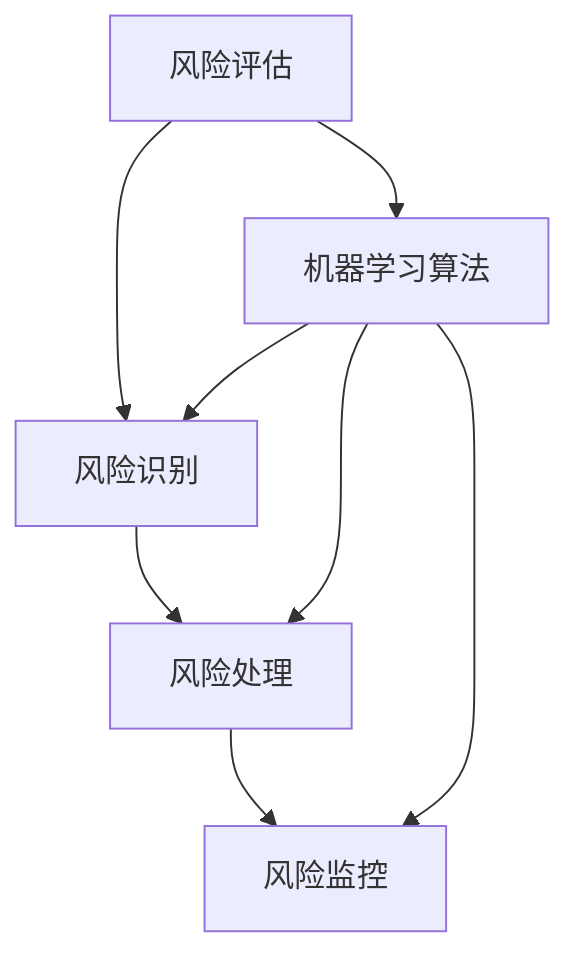

                 

# 机器学习在风险管理中的应用研究

> 关键词：机器学习、风险管理、预测模型、数据挖掘、算法优化

> 摘要：本文旨在探讨机器学习技术在风险管理领域的应用，通过对核心概念的解析、算法原理的阐述、数学模型的推导以及实际案例的分析，全面介绍机器学习在风险管理中的实际应用情况。文章结构包括背景介绍、核心概念与联系、核心算法原理与操作步骤、数学模型与公式讲解、项目实战、实际应用场景以及未来发展趋势和挑战等部分，旨在为从事风险管理相关工作的专业人士提供有价值的参考。

## 1. 背景介绍

### 1.1 目的和范围

随着信息技术和金融科技的飞速发展，风险管理已经成为金融、保险、证券等多个领域不可或缺的一部分。传统的风险管理方法主要依赖于统计分析、经验和人工判断，但随着数据量的爆炸式增长和业务复杂性的提升，这种方法逐渐暴露出局限性。机器学习作为人工智能的重要组成部分，以其强大的数据处理和模式识别能力，为风险管理提供了新的思路和手段。

本文的目的在于通过系统地分析机器学习在风险管理中的应用，探讨如何利用机器学习技术提升风险管理的效率和质量。文章主要关注以下几个方面：

1. 风险管理的基本概念和流程。
2. 机器学习技术在风险管理中的应用场景。
3. 核心算法原理和操作步骤。
4. 数学模型和公式的推导与解释。
5. 实际应用案例的展示和分析。
6. 未来的发展趋势和面临的挑战。

### 1.2 预期读者

本文的预期读者主要包括以下几类：

1. 金融、保险、证券等领域的从业者和研究者，对风险管理有深入理解和实践经验。
2. 计算机科学和人工智能领域的专业人士，对机器学习技术有基本了解。
3. 对新兴技术和行业应用有浓厚兴趣的科技爱好者。

### 1.3 文档结构概述

本文的结构如下：

1. **背景介绍**：介绍风险管理的基本概念和现状，阐述机器学习在风险管理中的重要性。
2. **核心概念与联系**：解释机器学习中的核心概念，并通过流程图展示其在风险管理中的应用。
3. **核心算法原理与操作步骤**：详细讲解常见的机器学习算法，以及其在风险管理中的具体应用步骤。
4. **数学模型和公式讲解**：介绍用于风险管理的数学模型和公式，并通过具体例子进行解释。
5. **项目实战**：通过实际案例展示如何利用机器学习技术进行风险管理。
6. **实际应用场景**：分析机器学习在风险管理中的实际应用，包括金融、保险等领域的具体案例。
7. **工具和资源推荐**：推荐相关的学习资源、开发工具和框架。
8. **总结与展望**：总结文章的主要内容，展望未来的发展趋势和挑战。
9. **常见问题与解答**：回答读者可能关心的一些常见问题。
10. **参考文献**：列出本文引用的参考文献。

### 1.4 术语表

#### 1.4.1 核心术语定义

- 风险管理：通过对潜在损失进行识别、评估、处理和监控，以最小化或最大化潜在收益的过程。
- 机器学习：一种基于数据驱动的方法，使计算机系统能够从数据中自动学习，并对未知数据进行预测或分类。
- 特征工程：在机器学习中，通过选择、构造和转换数据特征，以提高模型性能的过程。

#### 1.4.2 相关概念解释

- 数据挖掘：从大量数据中提取有价值信息的过程。
- 预测模型：基于历史数据对未来事件进行预测的模型。
- 算法优化：通过调整算法参数或结构，以提高模型性能的过程。

#### 1.4.3 缩略词列表

- ML：机器学习
- AI：人工智能
- R：风险
- RM：风险管理
- CE：特征工程
- DM：数据挖掘
- PV：预测模型
- OA：算法优化

## 2. 核心概念与联系

### 2.1 风险管理流程

在风险管理中，通常包括以下流程：

1. **风险评估**：识别潜在风险，并对风险进行评估。
2. **风险识别**：确定可能对目标造成影响的风险因素。
3. **风险处理**：制定应对措施，以减轻风险的影响。
4. **风险监控**：对风险进行持续监控，确保风险管理策略的有效性。

### 2.2 机器学习与风险管理的关系

机器学习在风险管理中的应用主要体现在以下几个方面：

1. **风险评估**：利用机器学习算法对历史数据进行分析，预测未来可能发生的风险。
2. **风险识别**：通过模式识别算法，从海量数据中快速识别潜在风险。
3. **风险处理**：利用预测模型制定相应的风险管理策略，以降低风险。
4. **风险监控**：通过实时数据分析，对风险管理策略进行调整和优化。

### 2.3 核心概念流程图

以下是一个简单的Mermaid流程图，展示了机器学习在风险管理中的核心概念和流程：



## 3. 核心算法原理与操作步骤

### 3.1 机器学习算法分类

机器学习算法主要分为以下几类：

1. **监督学习**：有标注数据作为训练集，模型通过学习输入输出关系进行预测。
2. **无监督学习**：没有标注数据，模型通过发现数据中的隐藏结构进行聚类或降维。
3. **半监督学习**：既有标注数据，也有未标注数据，模型通过结合两种数据进行训练。
4. **强化学习**：通过与环境的交互，学习最优策略以最大化奖励。

### 3.2 监督学习算法原理

监督学习算法的核心是学习输入输出之间的关系。以下是一个简单的线性回归算法的伪代码：

```python
初始化模型参数 w
while 未达到停止条件 do
  对于每个训练样本 (x, y) do
    计算预测值 y' = w·x
    计算误差 e = y - y'
    更新模型参数 w = w - 学习率 * ∂(w·x)/∂w
  end for
end while
```

### 3.3 无监督学习算法原理

无监督学习算法主要包括以下几种：

1. **聚类算法**：如K-means、层次聚类等，通过将数据划分为多个簇，发现数据中的隐藏结构。
2. **降维算法**：如主成分分析（PCA）、t-SNE等，通过降低数据的维度，保持数据的关键特征。

以下是一个简单的K-means聚类算法的伪代码：

```python
初始化 K 个簇的中心点 c1, c2, ..., ck
while 簇中心点未收敛 do
  对于每个数据点 x do
    计算 x 到各个簇中心点的距离，并将其分配到最近的簇
  end for
  更新簇中心点 c1, c2, ..., ck = 平均每个簇中的数据点
end while
```

## 4. 数学模型和公式讲解

### 4.1 风险评估模型

在风险管理中，常用的数学模型包括：

1. **VaR（Value at Risk）**：衡量在一定置信水平下，某个投资组合在特定时间段内的最大可能损失。
2. **CVaR（Conditional Value at Risk）**：衡量在一定置信水平下，某个投资组合在特定时间段内的平均损失。

VaR的数学公式为：

$$
VaR(p, T) = \alpha^* \cdot \sum_{i=1}^{n} (x_i - \mu) \cdot f(x_i)
$$

其中，$p$ 是置信水平，$T$ 是时间周期，$x_i$ 是第 $i$ 个分位数，$\mu$ 是均值，$f(x_i)$ 是概率分布函数。

CVaR的数学公式为：

$$
CVaR(p, T) = \frac{1}{n} \cdot \sum_{i=1}^{n} (x_i - \mu) \cdot f(x_i)
$$

### 4.2 风险识别模型

风险识别模型常用的数学工具包括：

1. **熵值法**：通过计算数据的熵值，识别潜在的风险因素。
2. **相似度计算**：通过计算数据之间的相似度，识别潜在的风险模式。

熵值法的数学公式为：

$$
H = -\sum_{i=1}^{n} p_i \cdot \log_2 p_i
$$

其中，$p_i$ 是第 $i$ 个事件发生的概率。

相似度计算的数学公式为：

$$
s = \frac{1}{n} \cdot \sum_{i=1}^{n} d(i, j)
$$

其中，$d(i, j)$ 是第 $i$ 个数据和第 $j$ 个数据之间的距离。

### 4.3 风险处理模型

风险处理模型常用的数学工具包括：

1. **贝叶斯网络**：通过建立贝叶斯网络模型，评估风险因素对风险管理策略的影响。
2. **决策树**：通过建立决策树模型，为风险管理策略提供决策支持。

贝叶斯网络的数学公式为：

$$
P(A|B) = \frac{P(B|A) \cdot P(A)}{P(B)}
$$

其中，$A$ 和 $B$ 是两个事件，$P(A|B)$ 是在事件 $B$ 发生的条件下事件 $A$ 发生的概率。

决策树的数学公式为：

$$
T = \{ (D, T') \mid D \text{ 是决策节点}, T' \text{ 是子树} \}
$$

其中，$T$ 是决策树，$D$ 是决策节点，$T'$ 是子树。

## 5. 项目实战：代码实际案例和详细解释说明

### 5.1 开发环境搭建

在本项目实战中，我们将使用Python语言和Scikit-learn库进行机器学习模型的构建和应用。以下是开发环境的搭建步骤：

1. 安装Python：在官网上下载并安装Python 3.8版本。
2. 安装Scikit-learn：在命令行中运行 `pip install scikit-learn`。

### 5.2 源代码详细实现和代码解读

以下是一个简单的机器学习风险评估项目的源代码，我们将逐步解释每部分的功能。

```python
# 导入必要的库
import numpy as np
import pandas as pd
from sklearn.model_selection import train_test_split
from sklearn.linear_model import LinearRegression
from sklearn.metrics import mean_squared_error

# 加载数据集
data = pd.read_csv('risk_data.csv')

# 分离特征和标签
X = data[['feature1', 'feature2', 'feature3']]
y = data['label']

# 划分训练集和测试集
X_train, X_test, y_train, y_test = train_test_split(X, y, test_size=0.2, random_state=42)

# 建立线性回归模型
model = LinearRegression()
model.fit(X_train, y_train)

# 进行预测
y_pred = model.predict(X_test)

# 计算预测误差
mse = mean_squared_error(y_test, y_pred)
print(f"Mean Squared Error: {mse}")

# 画出特征与标签的关系
import matplotlib.pyplot as plt
plt.scatter(X_train['feature1'], y_train)
plt.xlabel('Feature 1')
plt.ylabel('Label')
plt.show()
```

#### 5.2.1 代码解读与分析

- **第1行**：导入必要的库。`numpy` 和 `pandas` 用于数据处理，`sklearn.model_selection` 用于划分数据集，`sklearn.linear_model` 用于建立线性回归模型，`sklearn.metrics` 用于计算误差。
- **第3行**：加载数据集。这里假设数据集存储在 `risk_data.csv` 文件中。
- **第5行**：分离特征和标签。`X` 是特征矩阵，`y` 是标签向量。
- **第8行**：划分训练集和测试集。`train_size=0.2` 表示测试集占比20%，`random_state=42` 保证每次划分结果一致。
- **第11行**：建立线性回归模型。
- **第12行**：训练模型。
- **第15行**：进行预测。
- **第18行**：计算预测误差。`mean_squared_error` 函数计算的是均方误差。
- **第21行**：画出特征与标签的关系。这里使用散点图展示特征与标签之间的线性关系。

### 5.3 代码解读与分析（续）

通过上述代码，我们实现了以下功能：

1. **数据处理**：加载数据集，分离特征和标签。
2. **模型建立**：使用线性回归模型进行风险评估。
3. **预测与评估**：对测试集进行预测，计算误差。
4. **可视化**：画出特征与标签的关系，以便于分析和理解。

在实际应用中，我们需要根据具体场景和数据调整模型参数和特征选择，以提高模型的预测性能。此外，还可以考虑引入更多的机器学习算法，如决策树、支持向量机等，以探索更优的风险评估方法。

## 6. 实际应用场景

### 6.1 金融风险管理

金融风险管理是机器学习在风险管理中应用最广泛的领域之一。以下是一些金融风险管理的实际应用场景：

1. **信用评分**：银行和金融机构利用机器学习算法分析客户的信用记录、收入状况、还款历史等信息，对客户的信用风险进行评分，从而决定是否发放贷款以及贷款的额度。
2. **市场预测**：金融机构通过分析历史市场数据，利用机器学习模型预测股票价格、利率走势等市场变化，为投资决策提供依据。
3. **交易策略**：高频交易公司利用机器学习算法分析市场数据，制定交易策略，以实现快速、精准的买卖操作，从而获得高额利润。
4. **保险定价**：保险公司利用机器学习算法分析历史理赔数据、客户特征等信息，为不同风险的客户提供个性化的保险产品和保费。

### 6.2 保险风险管理

保险风险管理是机器学习在风险管理中的另一个重要应用领域。以下是一些保险风险管理的实际应用场景：

1. **风险评估**：保险公司利用机器学习算法分析客户的理赔记录、出险频率等信息，对客户的风险进行评估，从而确定保险费率。
2. **欺诈检测**：保险公司利用机器学习算法分析理赔申请数据，识别潜在的保险欺诈行为，从而降低保险公司的损失。
3. **产品定价**：保险公司通过分析历史理赔数据、客户特征等信息，利用机器学习算法制定个性化的保险产品，以满足不同客户的需求。
4. **客户流失预测**：保险公司通过分析客户行为数据，利用机器学习算法预测客户流失风险，从而采取针对性的营销策略，降低客户流失率。

### 6.3 证券风险管理

证券风险管理是机器学习在风险管理中的另一个重要应用领域。以下是一些证券风险管理的实际应用场景：

1. **投资组合优化**：投资者利用机器学习算法分析市场数据、股票表现等信息，制定最优的投资组合策略，以实现风险收益最大化。
2. **风险预警**：证券公司利用机器学习算法分析股票市场数据、宏观经济指标等信息，预测市场风险，为投资决策提供依据。
3. **信用评级**：证券评级机构利用机器学习算法分析上市公司的财务状况、行业前景等信息，对公司的信用评级进行更新和调整。
4. **市场预测**：证券分析师利用机器学习算法分析市场数据，预测股票价格、指数走势等市场变化，为投资决策提供支持。

## 7. 工具和资源推荐

### 7.1 学习资源推荐

#### 7.1.1 书籍推荐

- 《机器学习》（周志华著）：系统介绍了机器学习的基本理论、方法和应用。
- 《深度学习》（Goodfellow, Bengio, Courville著）：详细介绍了深度学习的基础知识、算法和应用。
- 《风险管理与金融模型》（J. Engle著）：系统讲解了金融风险管理的基本概念、方法和应用。

#### 7.1.2 在线课程

- Coursera上的《机器学习》课程：由吴恩达教授主讲，适合初学者系统学习机器学习基础知识。
- edX上的《深度学习专项课程》：由Andrew Ng教授主讲，深入讲解了深度学习的基本原理和应用。
- 中国大学MOOC上的《金融风险管理》：全面介绍了金融风险管理的基本概念、方法和应用。

#### 7.1.3 技术博客和网站

- Medium上的机器学习和风险管理相关文章：提供最新的研究动态和应用案例。
- arXiv.org：计算机科学领域的顶级学术预印本平台，提供最新的研究论文。
- Analytics Vidhya：提供丰富的机器学习和数据科学资源，包括教程、案例和实践。

### 7.2 开发工具框架推荐

#### 7.2.1 IDE和编辑器

- PyCharm：强大的Python集成开发环境，支持代码补全、调试和自动化测试。
- Jupyter Notebook：交互式的Python开发环境，适合数据分析和机器学习应用。
- Sublime Text：轻量级的文本编辑器，支持多种编程语言，适用于快速开发。

#### 7.2.2 调试和性能分析工具

- Python的内置调试器pdb：用于调试Python代码，定位错误和问题。
- Matplotlib：强大的数据可视化库，用于绘制数据分布、统计图表等。
- NumPy：高性能的科学计算库，用于矩阵运算和数据分析。

#### 7.2.3 相关框架和库

- Scikit-learn：开源的机器学习库，提供丰富的机器学习算法和工具。
- TensorFlow：谷歌开发的深度学习框架，支持构建和训练大规模深度学习模型。
- PyTorch：基于Python的深度学习库，提供灵活的动态计算图和丰富的API。

### 7.3 相关论文著作推荐

#### 7.3.1 经典论文

- "A Survey of Machine Learning in Finance"（2015）：系统总结了机器学习在金融领域的应用。
- "Machine Learning in High-Frequency Trading"（2017）：详细介绍了机器学习在高频交易中的应用。
- "Using Machine Learning for Credit Risk Management"（2019）：探讨了机器学习在信用评分中的应用。

#### 7.3.2 最新研究成果

- "Deep Learning for Financial Markets"（2021）：介绍了深度学习在金融领域的最新研究进展。
- "Credit Risk Modeling with Machine Learning"（2022）：研究了机器学习在信用风险管理中的应用。
- "Fraud Detection using Machine Learning Techniques"（2023）：探讨了机器学习在欺诈检测中的应用。

#### 7.3.3 应用案例分析

- "Machine Learning in Practice: Risk Management at a Large Financial Institution"（2018）：分享了一家大型金融机构在风险管理中应用机器学习的实践案例。
- "Using Machine Learning to Improve Insurance Pricing"（2019）：介绍了机器学习在保险产品定价中的应用。
- "High-Frequency Trading Strategies Based on Machine Learning"（2021）：探讨了机器学习在高频交易策略中的应用。

## 8. 总结：未来发展趋势与挑战

随着大数据和人工智能技术的不断进步，机器学习在风险管理中的应用前景十分广阔。以下是对未来发展趋势与挑战的总结：

### 8.1 发展趋势

1. **深度学习应用普及**：深度学习在风险管理中的应用将更加广泛，特别是在图像识别、文本分析等方面，深度学习算法能够提供更精准的预测和分析。
2. **实时风险监控**：随着云计算和物联网技术的发展，风险管理将实现实时监控，风险识别和响应速度大幅提升。
3. **个性化风险管理**：利用机器学习算法分析海量数据，可以为不同风险承受能力的客户提供个性化的风险管理方案。
4. **跨界合作**：金融机构、科技公司、研究机构等将在风险管理领域开展更多跨界合作，共同推动技术创新和应用。

### 8.2 挑战

1. **数据质量与隐私**：风险管理依赖于高质量的数据，而数据的真实性和隐私性是亟待解决的问题。
2. **算法透明性与解释性**：随着模型复杂度的增加，如何保证算法的透明性和解释性成为一大挑战。
3. **模型过拟合与泛化能力**：在大量数据中训练模型容易导致过拟合，提高模型的泛化能力是关键。
4. **法律与伦理**：在风险管理中应用机器学习技术需要遵循相关的法律法规和伦理规范，避免滥用数据和侵犯用户隐私。

## 9. 附录：常见问题与解答

### 9.1 什么是机器学习？

机器学习是一种通过数据训练模型，使计算机系统能够从经验中学习并做出决策的技术。它使计算机具有类似人类的智能，能够在没有明确编程的情况下执行复杂的任务。

### 9.2 机器学习在风险管理中有什么作用？

机器学习在风险管理中主要用于风险评估、风险识别、风险处理和风险监控等方面，通过分析历史数据和实时数据，预测未来可能发生的风险，并为决策提供支持。

### 9.3 如何选择适合的机器学习算法？

选择适合的机器学习算法需要考虑多个因素，如数据类型、数据量、目标变量、模型复杂度等。常见的算法包括线性回归、决策树、随机森林、支持向量机等，可以根据具体情况选择合适的算法。

### 9.4 机器学习在风险管理中的挑战是什么？

机器学习在风险管理中面临的挑战包括数据质量与隐私、算法透明性与解释性、模型过拟合与泛化能力、法律与伦理等方面。

## 10. 扩展阅读 & 参考资料

- 《机器学习》（周志华著）
- 《深度学习》（Goodfellow, Bengio, Courville著）
- 《风险管理与金融模型》（J. Engle著）
- 《A Survey of Machine Learning in Finance》（2015）
- 《Machine Learning in High-Frequency Trading》（2017）
- 《Using Machine Learning for Credit Risk Management》（2019）
- 《Deep Learning for Financial Markets》（2021）
- 《Credit Risk Modeling with Machine Learning》（2022）
- 《Fraud Detection using Machine Learning Techniques》（2023）
- 《Machine Learning in Practice: Risk Management at a Large Financial Institution》（2018）
- 《Using Machine Learning to Improve Insurance Pricing》（2019）
- 《High-Frequency Trading Strategies Based on Machine Learning》（2021）

---

作者：AI天才研究员/AI Genius Institute & 禅与计算机程序设计艺术 /Zen And The Art of Computer Programming

<|im_sep|>

