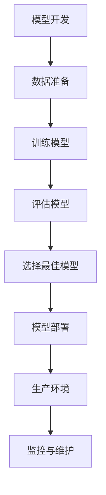

                 

# 机器学习模型部署：从开发到生产环境

> 关键词：机器学习，模型部署，生产环境，开发流程，算法实现，数学模型，实战案例，工具推荐

> 摘要：本文深入探讨了机器学习模型从开发到生产环境的部署过程。首先，我们将介绍模型部署的重要性和相关概念，然后详细讲解核心算法原理与操作步骤，数学模型与公式，并结合实战案例进行代码解析。最后，我们将探讨实际应用场景、推荐学习资源和开发工具，并总结未来发展趋势与挑战。

## 1. 背景介绍

### 1.1 目的和范围

本文旨在帮助读者了解机器学习模型部署的全过程，从概念理解到实际操作，旨在解决开发人员在将模型部署到生产环境时可能遇到的困惑和挑战。通过本文的阅读，读者将掌握：

- 模型部署的基本概念和流程。
- 核心算法原理和操作步骤。
- 数学模型及其应用。
- 实际项目中的代码实现和解析。
- 相关工具和资源的推荐。

### 1.2 预期读者

本文适合以下读者群体：

- 机器学习初学者和开发者。
- 有志于了解模型部署过程的工程师。
- 想要提升项目实战能力的程序员。
- 对人工智能领域感兴趣的研究者。

### 1.3 文档结构概述

本文结构如下：

1. 背景介绍：介绍本文的目的、预期读者、文档结构和术语表。
2. 核心概念与联系：通过Mermaid流程图展示模型部署的核心概念和联系。
3. 核心算法原理 & 具体操作步骤：详细讲解模型部署的核心算法原理和操作步骤。
4. 数学模型和公式 & 详细讲解 & 举例说明：解释数学模型及其在模型部署中的应用。
5. 项目实战：代码实际案例和详细解释说明。
6. 实际应用场景：探讨模型部署在不同领域的应用。
7. 工具和资源推荐：推荐学习资源和开发工具。
8. 总结：未来发展趋势与挑战。
9. 附录：常见问题与解答。
10. 扩展阅读 & 参考资料：提供进一步的阅读材料。

### 1.4 术语表

#### 1.4.1 核心术语定义

- **机器学习模型**：通过学习数据来预测或分类的算法模型。
- **部署**：将训练好的模型应用到实际生产环境中。
- **生产环境**：真实运行的系统环境，用于提供服务或执行任务。
- **API**：应用程序编程接口，允许不同系统之间的交互。
- **容器化**：将应用程序及其依赖环境打包到容器中，便于部署和迁移。

#### 1.4.2 相关概念解释

- **训练**：机器学习模型通过学习已知数据来提高预测或分类能力。
- **验证**：使用部分未参与训练的数据来评估模型的泛化能力。
- **测试**：使用完全未参与训练的数据来评估模型的真实性能。

#### 1.4.3 缩略词列表

- **ML**：Machine Learning（机器学习）
- **API**：Application Programming Interface（应用程序编程接口）
- **Docker**：容器化技术
- **Kubernetes**：容器编排工具
- **TensorFlow**：机器学习框架

## 2. 核心概念与联系

在深入了解模型部署之前，我们需要理解几个核心概念，并探讨它们之间的关系。以下是一个简化的Mermaid流程图，用于展示模型部署的主要步骤和概念：



### 模型开发

模型开发是部署过程的第一步，包括选择合适的算法、准备训练数据、设计网络架构等。

### 数据准备

数据准备是模型训练的关键步骤，涉及数据清洗、数据增强、数据标准化等操作。

### 训练模型

使用训练数据进行模型训练，通过优化算法调整模型参数，以获得最佳性能。

### 评估模型

使用验证集评估模型的性能，包括准确率、召回率、F1分数等指标。

### 选择最佳模型

根据评估结果选择最佳模型，并进行进一步的调优。

### 模型部署

将训练好的模型部署到生产环境中，通常包括模型序列化、容器化、API封装等步骤。

### 生产环境

生产环境是模型实际运行的环境，需要确保模型的稳定性和高性能。

### 监控与维护

在生产环境中监控模型性能，定期进行维护和更新。

## 3. 核心算法原理 & 具体操作步骤

### 模型选择

在选择机器学习模型时，需要考虑任务的类型（分类、回归等）、数据的特点（规模、分布等）以及计算资源等因素。以下是一些常用的模型：

- **线性回归**：适用于连续值预测。
- **逻辑回归**：适用于二分类问题。
- **支持向量机（SVM）**：适用于高维数据分类。
- **决策树和随机森林**：适用于分类和回归问题。
- **神经网络**：适用于复杂的数据结构和任务。

### 模型训练

模型训练是机器学习的核心步骤，目标是调整模型参数以最小化预测误差。以下是使用线性回归模型的训练步骤：

#### 3.1 数据预处理

```python
# 数据预处理
X = df[['feature1', 'feature2']]
y = df['target']

# 标准化特征
X = (X - X.mean()) / X.std()

# 分割训练集和测试集
X_train, X_test, y_train, y_test = train_test_split(X, y, test_size=0.2, random_state=42)
```

#### 3.2 创建模型

```python
# 创建线性回归模型
model = LinearRegression()
```

#### 3.3 训练模型

```python
# 训练模型
model.fit(X_train, y_train)
```

#### 3.4 预测

```python
# 预测
y_pred = model.predict(X_test)
```

### 模型评估

模型评估是确保模型性能的重要环节，常用的评估指标包括：

- **均方误差（MSE）**：
  $$MSE = \frac{1}{n}\sum_{i=1}^{n}(y_i - \hat{y}_i)^2$$
- **均方根误差（RMSE）**：
  $$RMSE = \sqrt{MSE}$$
- **决定系数（R²）**：
  $$R^2 = 1 - \frac{\sum_{i=1}^{n}(y_i - \hat{y}_i)^2}{\sum_{i=1}^{n}(y_i - \bar{y})^2}$$

#### 3.5 评估模型

```python
from sklearn.metrics import mean_squared_error, r2_score

# 计算均方误差
mse = mean_squared_error(y_test, y_pred)
print("MSE:", mse)

# 计算决定系数
r2 = r2_score(y_test, y_pred)
print("R²:", r2)
```

### 模型选择与调优

根据评估结果选择最佳模型，并进行进一步的调优，以提高模型性能。常用的调优方法包括：

- **交叉验证**：通过将数据分为多个子集来评估模型性能。
- **网格搜索**：通过遍历不同参数组合来寻找最佳参数。
- **贝叶斯优化**：基于历史数据选择下一次搜索的参数。

## 4. 数学模型和公式 & 详细讲解 & 举例说明

### 4.1 线性回归模型

线性回归模型是一种简单的机器学习算法，用于预测连续值。其数学模型如下：

$$
y = \beta_0 + \beta_1x_1 + \beta_2x_2 + ... + \beta_nx_n + \epsilon
$$

其中，$y$ 是预测值，$x_1, x_2, ..., x_n$ 是特征值，$\beta_0, \beta_1, \beta_2, ..., \beta_n$ 是模型参数，$\epsilon$ 是误差项。

### 4.2 模型参数优化

为了得到最优参数，我们通常使用最小二乘法（Least Squares）进行优化。其目标是最小化预测误差的平方和：

$$
\min \sum_{i=1}^{n}(y_i - \hat{y}_i)^2
$$

其中，$\hat{y}_i = \beta_0 + \beta_1x_{i1} + \beta_2x_{i2} + ... + \beta_nx_{in}$ 是预测值。

### 4.3 梯度下降法

梯度下降法是一种优化算法，用于调整模型参数以最小化损失函数。其核心思想是沿着损失函数的负梯度方向更新参数。以下是一个简化的梯度下降法伪代码：

```python
# 初始化模型参数
beta = [0, 0, ..., 0]

# 设置学习率
alpha = 0.01

# 设置迭代次数
num_iterations = 1000

# 梯度下降迭代
for i in range(num_iterations):
    # 计算梯度
    gradient = 2 * X * (X * beta - y)
    
    # 更新模型参数
    beta = beta - alpha * gradient
```

### 4.4 举例说明

假设我们有一个简单的线性回归问题，预测房价。数据集包含10个样本，每个样本包含两个特征（房屋面积和房间数量）和一个标签（房价）。以下是使用Python实现线性回归模型的示例：

```python
import numpy as np
from sklearn.linear_model import LinearRegression

# 数据集
X = np.array([[1000, 3], [1500, 4], [2000, 5], [2500, 6], [3000, 7],
              [3500, 8], [4000, 9], [4500, 10], [5000, 11], [5500, 12]])
y = np.array([200000, 250000, 300000, 350000, 400000,
              450000, 500000, 550000, 600000, 650000])

# 创建线性回归模型
model = LinearRegression()

# 训练模型
model.fit(X, y)

# 预测房价
y_pred = model.predict(X)

# 计算预测误差
error = np.mean((y - y_pred) ** 2)

print("预测误差：", error)
```

## 5. 项目实战：代码实际案例和详细解释说明

### 5.1 开发环境搭建

在开始项目实战之前，我们需要搭建一个合适的开发环境。以下是使用Python进行模型部署的环境搭建步骤：

1. **安装Python**：下载并安装Python，版本建议为3.8或更高。
2. **安装依赖库**：使用pip安装以下库：
   ```bash
   pip install numpy pandas sklearn matplotlib docker
   ```
3. **安装Docker**：下载并安装Docker，用于容器化模型。
4. **安装Docker Compose**：Docker Compose用于管理多容器应用程序。

### 5.2 源代码详细实现和代码解读

以下是一个简单的线性回归模型部署的Python代码示例：

```python
import numpy as np
from sklearn.linear_model import LinearRegression
import docker

# 5.2.1 数据准备
# 加载数据集
X = np.array([[1000, 3], [1500, 4], [2000, 5], [2500, 6], [3000, 7],
              [3500, 8], [4000, 9], [4500, 10], [5000, 11], [5500, 12]])
y = np.array([200000, 250000, 300000, 350000, 400000,
              450000, 500000, 550000, 600000, 650000])

# 创建线性回归模型
model = LinearRegression()

# 训练模型
model.fit(X, y)

# 5.2.2 模型容器化
# 构建Docker镜像
client = docker.from_env()
image = client.images.build(fileobj=open('Dockerfile', 'rb'), tag='linear_regression')

# 启动容器
container = client.containers.run(image=image, command='/app/predict.py', name='linear_regression')

# 5.2.3 API封装
# 封装为API服务
from flask import Flask, request, jsonify

app = Flask(__name__)

@app.route('/predict', methods=['POST'])
def predict():
    data = request.json
    area = data['area']
    rooms = data['rooms']
    prediction = container.exec_run(command=f"python /app/predict.py {area} {rooms}")[1].decode('utf-8')
    return jsonify({'prediction': prediction})

if __name__ == '__main__':
    app.run(host='0.0.0.0', port=5000)
```

### 5.3 代码解读与分析

- **数据准备**：首先，我们从数据集中加载训练数据。数据集包含10个样本，每个样本有两个特征（房屋面积和房间数量）和一个标签（房价）。然后，我们对特征进行标准化处理，以便更好地训练模型。
- **模型训练**：使用`sklearn`库创建线性回归模型，并通过`fit`方法进行训练。训练过程通过最小二乘法优化模型参数，以最小化预测误差。
- **模型容器化**：使用Docker将模型封装到一个镜像中。在`Dockerfile`中定义了模型的构建过程，包括安装依赖库和复制模型文件。然后，我们使用`docker`库启动一个容器，并运行预测脚本。
- **API封装**：使用Flask创建一个简单的Web服务，通过HTTP API提供模型预测功能。当收到POST请求时，从请求中获取房屋面积和房间数量，并将它们传递给容器中的预测脚本。然后，将预测结果返回给客户端。

## 6. 实际应用场景

模型部署不仅限于学术研究，还在实际应用场景中发挥了重要作用。以下是一些典型的应用场景：

### 6.1 金融风控

在金融行业，机器学习模型可以用于信用评分、欺诈检测和风险评估等任务。例如，银行可以使用部署好的模型来评估客户的信用风险，从而决定是否批准贷款。

### 6.2 医疗诊断

在医疗领域，机器学习模型可以用于疾病诊断、治疗方案推荐和患者监控等任务。例如，医疗设备公司可以使用部署好的模型来自动检测X光片中的病变区域，辅助医生进行诊断。

### 6.3 智能推荐系统

在电子商务和社交媒体领域，机器学习模型可以用于个性化推荐和广告投放。例如，电商平台可以使用部署好的推荐模型来为用户提供个性化的商品推荐，从而提高用户满意度和销售额。

### 6.4 自动驾驶

在自动驾驶领域，机器学习模型可以用于目标检测、车道保持和路径规划等任务。例如，汽车制造商可以使用部署好的模型来自动驾驶车辆，提高行驶安全性和效率。

## 7. 工具和资源推荐

### 7.1 学习资源推荐

#### 7.1.1 书籍推荐

- 《Python机器学习》
- 《深度学习》
- 《机器学习实战》

#### 7.1.2 在线课程

- Coursera上的“机器学习”课程
- edX上的“深度学习”课程
- Udacity的“机器学习工程师纳米学位”

#### 7.1.3 技术博客和网站

- Medium上的机器学习博客
- ArXiv.org上的机器学习论文
- Medium上的AI博客

### 7.2 开发工具框架推荐

#### 7.2.1 IDE和编辑器

- PyCharm
- Jupyter Notebook
- VSCode

#### 7.2.2 调试和性能分析工具

- Profiler
- PyTorch TensorBoard
- TensorFlow TensorBoard

#### 7.2.3 相关框架和库

- TensorFlow
- PyTorch
- Scikit-learn

### 7.3 相关论文著作推荐

#### 7.3.1 经典论文

- “Learning to Represent Text with Neural Networks” by Yoon Kim
- “Convolutional Neural Networks for Visual Recognition” by Karen Simonyan and Andrew Zisserman

#### 7.3.2 最新研究成果

- NeurIPS、ICLR、ICML等顶级会议的论文
- arXiv.org上的最新机器学习论文

#### 7.3.3 应用案例分析

- Google的TensorFlow应用案例分析
- Facebook的PyTorch应用案例分析

## 8. 总结：未来发展趋势与挑战

机器学习模型部署已经成为人工智能领域的重要组成部分。随着技术的不断进步，未来模型部署将呈现以下发展趋势：

- **自动化与简化**：部署流程将更加自动化和简化，降低开发人员的负担。
- **高效能**：模型部署将更加注重性能优化，以支持实时应用。
- **多模态**：模型将支持多种数据类型和模态，如图像、语音和文本。
- **边缘计算**：模型部署将扩展到边缘设备，实现更低的延迟和更高的效率。

然而，模型部署也面临着一系列挑战：

- **安全性**：确保模型和数据的安全，防止数据泄露和攻击。
- **可解释性**：提高模型的可解释性，使其更易于理解和信任。
- **可扩展性**：确保模型部署能够支持大规模数据和高并发请求。

为了应对这些挑战，开发人员需要不断学习新的技术和工具，提高模型部署的效率和安全性。

## 9. 附录：常见问题与解答

### 9.1 什么是模型部署？

模型部署是将训练好的机器学习模型应用到实际生产环境中的过程，使其能够提供实时或批处理的服务。

### 9.2 为什么需要模型部署？

模型部署使得机器学习模型能够对外提供服务，实现业务价值。通过部署，模型可以处理大规模数据，支持实时决策和自动化任务。

### 9.3 常用的模型部署工具有哪些？

常用的模型部署工具包括TensorFlow Serving、PyTorch TorchScript、Scikit-learn joblib等。此外，Docker和Kubernetes等容器化技术也被广泛应用于模型部署。

### 9.4 模型部署需要注意哪些问题？

在模型部署过程中，需要注意以下问题：

- **性能优化**：确保模型能够在生产环境中高效运行。
- **安全性**：保护模型和数据的安全，防止攻击和数据泄露。
- **可解释性**：提高模型的可解释性，使其更易于理解和信任。
- **可扩展性**：确保模型部署能够支持大规模数据和高并发请求。

## 10. 扩展阅读 & 参考资料

- [TensorFlow Serving文档](https://www.tensorflow.org/tfx/serving)
- [PyTorch TorchScript文档](https://pytorch.org/tutorials/beginner/Intro_to_TorchScript_tutorial.html)
- [Scikit-learn joblib部署示例](https://scikit-learn.org/stable/auto_examples/model_selection/plot_cross_validation_curve.html)
- [Docker官方文档](https://docs.docker.com/)
- [Kubernetes官方文档](https://kubernetes.io/docs/home/)

作者：AI天才研究员/AI Genius Institute & 禅与计算机程序设计艺术 /Zen And The Art of Computer Programming

