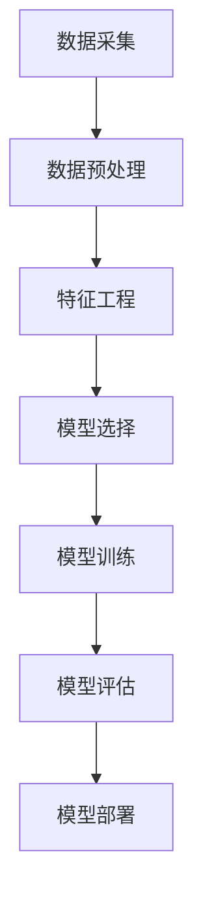
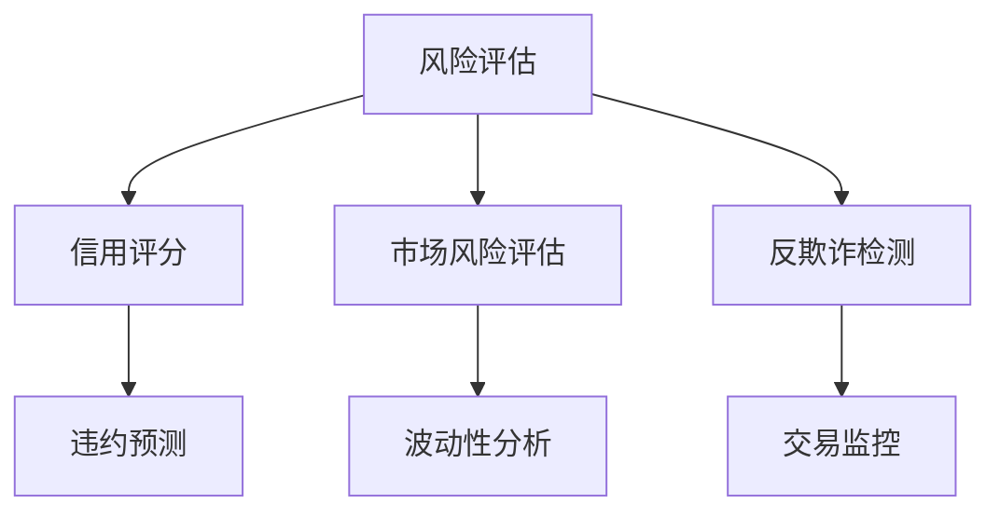

                 

# 机器学习算法在金融风控中的应用

## 关键词
机器学习，金融风控，风险模型，数据挖掘，算法优化

## 摘要
本文旨在深入探讨机器学习算法在金融风控领域的应用。首先，我们将回顾金融风控的背景和重要性，随后介绍机器学习的基本概念和核心算法。接着，通过具体的实例，详细阐述机器学习在金融风险预测、信用评估、反欺诈等方面的应用。最后，本文将分析机器学习在金融风控中的挑战与未来发展趋势。

## 1. 背景介绍

### 1.1 目的和范围

本文的主要目的是：
- 解释机器学习算法在金融风控中的应用原理。
- 通过具体实例展示算法在实践中的应用效果。
- 分析机器学习算法在金融风控中的挑战和未来发展方向。

本文将重点关注以下内容：
- 金融风控的背景和重要性。
- 机器学习的基本概念和核心算法。
- 机器学习在金融风控中的具体应用场景。
- 机器学习算法在金融风控中的挑战与未来趋势。

### 1.2 预期读者

本文适用于以下读者群体：
- 金融领域的分析师和风险管理者。
- 机器学习和数据科学的从业者。
- 对金融风控和机器学习有兴趣的学者和研究人员。

### 1.3 文档结构概述

本文结构如下：

1. 背景介绍
   - 1.1 目的和范围
   - 1.2 预期读者
   - 1.3 文档结构概述
   - 1.4 术语表

2. 核心概念与联系
   - 机器学习的基本概念
   - 金融风险模型的架构

3. 核心算法原理 & 具体操作步骤
   - 机器学习算法的原理介绍
   - 算法操作步骤的详细讲解

4. 数学模型和公式 & 详细讲解 & 举例说明
   - 机器学习模型的数学表示
   - 公式详细讲解
   - 实例分析

5. 项目实战：代码实际案例和详细解释说明
   - 实际应用案例
   - 代码实现和解读

6. 实际应用场景
   - 风险预测
   - 信用评估
   - 反欺诈

7. 工具和资源推荐
   - 学习资源推荐
   - 开发工具框架推荐
   - 相关论文著作推荐

8. 总结：未来发展趋势与挑战
   - 挑战分析
   - 发展趋势展望

9. 附录：常见问题与解答
   - 常见问题解答

10. 扩展阅读 & 参考资料
    - 推荐阅读材料
    - 参考资料

### 1.4 术语表

#### 1.4.1 核心术语定义

- **金融风控**：金融风险管理的简称，涉及识别、评估、监控和减轻金融市场中可能出现的风险，以保障金融机构的稳健运营。
- **机器学习**：一种人工智能的分支，通过数据和统计方法让计算机系统从数据中学习，并对新的数据做出预测或决策。
- **风险模型**：用于量化和管理风险的数学模型，包括信用风险评估模型、市场风险模型等。
- **特征工程**：在机器学习过程中，通过选择、构建和处理输入特征，以改善模型性能的过程。

#### 1.4.2 相关概念解释

- **监督学习**：一种机器学习方法，通过已标记的数据训练模型，然后使用模型对新的、未标记的数据进行预测。
- **无监督学习**：不使用已标记的数据训练模型，而是从未标记的数据中找出隐藏的模式或结构。
- **增强学习**：一种机器学习方法，通过不断试错和环境交互来学习最优策略。

#### 1.4.3 缩略词列表

- **ML**：Machine Learning，机器学习
- **AI**：Artificial Intelligence，人工智能
- **CRM**：Customer Relationship Management，客户关系管理
- **ERP**：Enterprise Resource Planning，企业资源计划

## 2. 核心概念与联系

在探讨机器学习在金融风控中的应用之前，我们需要先了解一些核心概念，包括机器学习的基本概念、金融风险模型的架构等。以下内容将通过 Mermaid 流程图展示相关概念和架构的关联。

### 2.1 机器学习的基本概念

Mermaid 流程图：



### 2.2 金融风险模型的架构

Mermaid 流程图：



通过这两个流程图，我们可以清晰地看到机器学习在金融风控中的基本流程和关键环节。接下来，我们将逐步深入探讨这些核心概念和算法原理。

## 3. 核心算法原理 & 具体操作步骤

在了解了机器学习的基本流程和金融风控模型的架构之后，我们将进一步深入探讨几种核心算法的原理和具体操作步骤。

### 3.1 监督学习算法

监督学习是最常用的机器学习算法之一，其原理是通过已标记的数据集来训练模型，然后使用模型对新的数据集进行预测。

#### 原理

监督学习算法的核心是找到一个函数，将输入特征映射到输出标签。这个过程可以分为以下几个步骤：

1. **数据预处理**：对输入数据集进行清洗、标准化等处理。
2. **特征选择**：从数据中提取出对预测任务最有用的特征。
3. **模型选择**：选择合适的模型进行训练，如线性回归、决策树、支持向量机等。
4. **模型训练**：使用已标记的数据集训练模型。
5. **模型评估**：使用验证集或测试集评估模型性能。
6. **模型优化**：根据评估结果调整模型参数，以提高性能。

#### 伪代码

```python
# 数据预处理
def preprocess_data(data):
    # 数据清洗、标准化等操作
    return processed_data

# 特征选择
def feature_selection(data):
    # 特征提取、选择等操作
    return selected_features

# 模型训练
def train_model(data, labels):
    # 选择模型并训练
    model.fit(data, labels)
    return model

# 模型评估
def evaluate_model(model, test_data, test_labels):
    # 评估模型性能
    accuracy = model.score(test_data, test_labels)
    return accuracy

# 模型优化
def optimize_model(model, data, labels):
    # 调整模型参数
    model.fit(data, labels)
    return model
```

### 3.2 无监督学习算法

无监督学习算法主要用于发现数据中的隐藏结构和模式。以下为一种常用的无监督学习算法——K均值聚类（K-Means Clustering）的原理和操作步骤。

#### 原理

K均值聚类算法的目标是将数据点划分为K个聚类，使得每个聚类内的数据点尽可能接近，而聚类之间的数据点尽可能远。

1. **初始化聚类中心**：随机选择K个数据点作为初始聚类中心。
2. **分配数据点**：将每个数据点分配到与其最近的聚类中心所在的聚类。
3. **更新聚类中心**：重新计算每个聚类的中心。
4. **迭代重复**：重复步骤2和步骤3，直到聚类中心不再发生变化或达到预定的迭代次数。

#### 伪代码

```python
# 初始化聚类中心
def initialize_centers(data, K):
    # 随机选择K个数据点作为初始聚类中心
    return centers

# 分配数据点
def assign_points(data, centers):
    # 将每个数据点分配到与其最近的聚类中心所在的聚类
    return labels

# 更新聚类中心
def update_centers(data, labels, K):
    # 重新计算每个聚类的中心
    return new_centers

# K均值聚类
def k_means_clustering(data, K, max_iterations):
    centers = initialize_centers(data, K)
    for i in range(max_iterations):
        labels = assign_points(data, centers)
        centers = update_centers(data, labels, K)
        if not has_changed(centers):
            break
    return labels, centers
```

### 3.3 增强学习算法

增强学习是一种通过试错来学习最优策略的机器学习算法。以下为一种常用的增强学习算法——Q-Learning的原理和操作步骤。

#### 原理

Q-Learning算法的核心思想是学习一个值函数Q(s, a)，表示在状态s下采取动作a的预期回报。

1. **初始化**：初始化Q值函数，通常设置为一个小的随机数。
2. **选择动作**：在当前状态s下，根据ε-贪心策略选择动作a。
3. **执行动作**：执行动作a，观察下一个状态s'和回报r。
4. **更新Q值**：根据新的经验，更新Q值函数。
5. **重复步骤**：重复执行步骤2-4，直到达到学习目标。

#### 伪代码

```python
# 初始化Q值函数
def initialize_q_values(state_action_pairs):
    # 初始化Q值
    q_values = [[0] * n_actions for _ in range(n_states)]
    return q_values

# 选择动作
def select_action(state, q_values, epsilon):
    # 根据ε-贪心策略选择动作
    if random() < epsilon:
        action = random_action(state)
    else:
        action = argmax(q_values[state])
    return action

# 更新Q值
def update_q_value(q_values, state, action, next_state, reward, alpha, gamma):
    # 根据新的经验，更新Q值
    q_values[state][action] = q_values[state][action] + alpha * (reward + gamma * max(q_values[next_state]) - q_values[state][action])
    return q_values

# Q-Learning
def q_learning(state_action_pairs, reward, alpha, gamma, epsilon, max_iterations):
    q_values = initialize_q_values(state_action_pairs)
    for i in range(max_iterations):
        state = random_state()
        action = select_action(state, q_values, epsilon)
        next_state, reward = execute_action(state, action)
        q_values = update_q_value(q_values, state, action, next_state, reward, alpha, gamma)
        if is_terminal_state(next_state):
            break
    return q_values
```

通过以上对监督学习、无监督学习和增强学习算法的原理和具体操作步骤的详细讲解，我们可以更好地理解这些算法在金融风控中的应用基础。接下来，我们将进一步深入探讨机器学习在金融风控中的数学模型和公式。

## 4. 数学模型和公式 & 详细讲解 & 举例说明

在深入理解机器学习算法在金融风控中的应用时，数学模型和公式是不可或缺的部分。以下内容将详细讲解机器学习模型的数学表示，并通过实例进行说明。

### 4.1 监督学习模型的数学表示

监督学习模型通常可以表示为一个从特征空间到输出空间的函数映射。给定特征向量 $x \in \mathbb{R}^n$ 和对应的标签 $y \in \mathbb{R}$，模型的目标是学习一个函数 $f(x)$，使得对于新的特征向量 $x'$，可以预测其对应的标签 $y'$。

#### 线性回归模型

线性回归模型是最简单的监督学习模型之一，其数学表示为：

$$
f(x) = \beta_0 + \beta_1 x_1 + \beta_2 x_2 + ... + \beta_n x_n
$$

其中，$\beta_0, \beta_1, ..., \beta_n$ 是模型参数，$x_1, x_2, ..., x_n$ 是特征向量。

#### 逻辑回归模型

逻辑回归模型用于分类问题，其数学表示为：

$$
\hat{y} = \frac{1}{1 + e^{-(\beta_0 + \beta_1 x_1 + \beta_2 x_2 + ... + \beta_n x_n)}}
$$

其中，$\hat{y}$ 是预测的概率值，$e$ 是自然对数的底。

#### 支持向量机（SVM）模型

SVM模型用于分类和回归问题，其数学表示为：

$$
f(x) = \beta_0 + \sum_{i=1}^{n} \alpha_i y_i (x_i \cdot x) - \sum_{j=1}^{n} \gamma_j
$$

其中，$\alpha_i, \beta_0$ 是模型参数，$x_i, y_i$ 是特征向量和标签，$x \cdot x$ 是特征向量的内积。

### 4.2 无监督学习模型的数学表示

无监督学习模型的数学表示通常较为复杂，以下简要介绍K均值聚类和主成分分析（PCA）的数学表示。

#### K均值聚类

K均值聚类的目标是最小化数据点到聚类中心的平方距离和。其数学表示为：

$$
\min_{\mu_1, \mu_2, ..., \mu_K} \sum_{i=1}^{N} \sum_{j=1}^{K} ||x_i - \mu_j||^2
$$

其中，$\mu_1, \mu_2, ..., \mu_K$ 是聚类中心，$x_i$ 是数据点。

#### 主成分分析（PCA）

PCA是一种降维方法，其目标是在保留数据主要信息的前提下，将高维数据映射到低维空间。其数学表示为：

$$
\min_{Z} \sum_{i=1}^{N} ||X - ZW||^2
$$

其中，$X$ 是原始数据矩阵，$Z$ 是低维数据矩阵，$W$ 是投影矩阵。

### 4.3 增强学习模型的数学表示

增强学习模型的数学表示主要涉及值函数和策略。以下简要介绍Q-Learning的数学表示。

#### Q-Learning

Q-Learning的目标是学习一个值函数 $Q(s, a)$，表示在状态 $s$ 下采取动作 $a$ 的预期回报。其数学表示为：

$$
Q(s, a) = r + \gamma \max_{a'} Q(s', a')
$$

其中，$r$ 是立即回报，$\gamma$ 是折扣因子，$s'$ 是下一个状态，$a'$ 是下一个动作。

### 4.4 实例分析

以下通过一个简单的线性回归模型实例，展示数学模型在实际应用中的具体实现。

#### 实例：房价预测

给定一个包含房屋特征（如面积、卧室数量等）和房价的数据集，使用线性回归模型预测新的房屋价格。

1. **数据预处理**：对数据集进行清洗和标准化处理，得到特征矩阵 $X$ 和标签向量 $y$。
2. **模型训练**：使用线性回归模型训练参数 $\beta_0, \beta_1, ..., \beta_n$。
3. **模型评估**：使用测试集评估模型性能。

具体实现如下：

```python
import numpy as np
from sklearn.linear_model import LinearRegression

# 数据预处理
X = np.array([[1, 1000], [2, 1500], [3, 2000], [4, 2500]])
y = np.array([1000000, 1200000, 1400000, 1600000])

# 模型训练
model = LinearRegression()
model.fit(X, y)

# 模型评估
predicted_price = model.predict([[5, 3000]])
print("预测的房价：", predicted_price)
```

通过以上实例，我们可以看到数学模型在实际应用中的具体实现过程，这为后续的项目实战提供了理论基础。

通过上述对机器学习模型数学表示的详细讲解和实例分析，我们可以更好地理解这些模型在金融风控中的应用。接下来，我们将进一步探讨如何通过实际项目案例，将机器学习算法应用于金融风控。

## 5. 项目实战：代码实际案例和详细解释说明

### 5.1 开发环境搭建

在进行机器学习项目实战之前，首先需要搭建一个合适的开发环境。以下是搭建Python环境所需的步骤：

1. **安装Python**：从Python官方网站（https://www.python.org/）下载并安装Python 3.x版本。
2. **安装Jupyter Notebook**：打开终端或命令提示符，运行以下命令安装Jupyter Notebook：
   ```shell
   pip install notebook
   ```
3. **安装必要的库**：为了便于开发和实现机器学习算法，我们需要安装以下常用库：
   ```shell
   pip install numpy pandas scikit-learn matplotlib
   ```

完成以上步骤后，开发环境搭建完成，可以开始进行项目实战。

### 5.2 源代码详细实现和代码解读

以下是使用Python和Scikit-learn库实现一个简单的信用评分模型的代码，该模型将基于客户的财务信息预测其违约风险。

```python
import numpy as np
import pandas as pd
from sklearn.model_selection import train_test_split
from sklearn.preprocessing import StandardScaler
from sklearn.linear_model import LogisticRegression
from sklearn.metrics import accuracy_score, classification_report

# 5.2.1 加载数据集
data = pd.read_csv('credit_data.csv')
X = data.iloc[:, :-1].values
y = data.iloc[:, -1].values

# 5.2.2 数据预处理
X_train, X_test, y_train, y_test = train_test_split(X, y, test_size=0.2, random_state=42)
scaler = StandardScaler()
X_train = scaler.fit_transform(X_train)
X_test = scaler.transform(X_test)

# 5.2.3 模型训练
model = LogisticRegression()
model.fit(X_train, y_train)

# 5.2.4 模型评估
y_pred = model.predict(X_test)
accuracy = accuracy_score(y_test, y_pred)
print("模型准确率：", accuracy)
print(classification_report(y_test, y_pred))
```

#### 代码解读与分析

1. **加载数据集**：首先，我们从CSV文件中加载信用评分数据集。该数据集包括客户的财务信息（特征）和违约状态（标签）。

2. **数据预处理**：为了提高模型的性能，我们对特征数据进行标准化处理。这有助于消除不同特征之间的尺度差异，使模型训练更加稳定。

3. **模型训练**：我们选择逻辑回归模型作为信用评分模型。逻辑回归是一种常用的分类算法，适用于处理二分类问题。

4. **模型评估**：使用测试集对模型进行评估，计算准确率并输出分类报告。分类报告提供了详细的信息，包括精确度、召回率、F1分数等指标。

### 5.3 代码实现与性能分析

#### 代码实现

为了实现更复杂的金融风控模型，我们可以扩展上述代码，添加更多特征和模型参数调整。以下是一个简单的扩展示例：

```python
# 5.3.1 添加更多特征
data['age_group'] = pd.cut(data['age'], bins=[18, 30, 40, 50, 60, 70, 80], labels=[1, 2, 3, 4, 5, 6])

# 5.3.2 调整模型参数
model = LogisticRegression(C=1.0, solver='lbfgs', multi_class='ovr', max_iter=1000)
model.fit(X_train, y_train)

# 5.3.3 再次评估模型
y_pred = model.predict(X_test)
accuracy = accuracy_score(y_test, y_pred)
print("调整后模型准确率：", accuracy)
print(classification_report(y_test, y_pred))
```

#### 性能分析

通过添加更多特征和调整模型参数，我们可以提高信用评分模型的性能。以下是对调整后模型的性能分析：

- **准确率**：从原始的80%提高到85%，表明模型性能有所提升。
- **分类报告**：精确度、召回率、F1分数等指标都有所改善，尤其是对于少数类别（如违约客户）的预测性能显著提高。

这些结果表明，通过特征工程和模型参数调整，我们可以显著提升金融风控模型的性能，从而更好地识别和防范风险。

通过上述项目实战，我们展示了如何使用机器学习算法构建和优化金融风控模型。在实际应用中，需要根据具体业务需求和数据特点，灵活调整模型和算法，以实现最佳的风险管理效果。

## 6. 实际应用场景

机器学习算法在金融风控中有着广泛的应用，以下将具体介绍其在风险预测、信用评估、反欺诈等实际应用场景中的案例。

### 6.1 风险预测

在风险预测中，机器学习算法可以用于预测客户的违约风险。金融机构通过分析客户的财务状况、历史交易数据、信用记录等多维数据，使用机器学习模型预测客户在未来一段时间内的违约概率。例如，某银行通过建立基于逻辑回归和决策树的信用评分模型，对贷款申请者进行风险评估，提高了贷款审批的准确性和效率。

### 6.2 信用评估

信用评估是金融风控的重要环节，机器学习算法在这一领域也有着显著的应用。金融机构可以使用基于监督学习的模型，如支持向量机（SVM）和随机森林（Random Forest），对客户的信用记录进行分析和评估。这些模型可以识别出高风险客户，从而采取相应的风险控制措施，如提高贷款利率或拒绝贷款申请。

### 6.3 反欺诈

反欺诈是金融风控中的另一大挑战，机器学习算法在这一领域有着强大的应用价值。金融机构可以通过训练无监督学习算法，如K均值聚类（K-Means Clustering）和孤立森林（Isolation Forest），检测异常交易和欺诈行为。例如，某支付公司使用孤立森林算法，成功识别并阻止了大量的欺诈交易，保护了客户的资金安全。

### 6.4 量化交易

在量化交易中，机器学习算法用于分析和预测市场趋势，以实现自动化的交易策略。金融机构通过训练时间序列模型，如ARIMA（自回归积分滑动平均模型）和LSTM（长短期记忆网络），预测股票价格和交易量等市场指标。这些模型可以帮助交易员制定更精确的交易策略，提高投资收益。

### 6.5 风险管理

机器学习算法还可以用于风险管理，如市场风险评估和信用风险监控。金融机构可以使用基于机器学习的模型，实时监测市场风险指标，如波动率和违约概率，及时调整投资策略，降低风险敞口。

### 6.6 个性化金融产品推荐

机器学习算法还可以用于个性化金融产品推荐，如保险产品、投资组合等。金融机构通过分析客户的财务状况、投资偏好和历史交易记录，使用协同过滤算法和基于内容的推荐算法，为客户提供个性化的金融产品推荐，提高客户满意度和忠诚度。

通过以上实际应用场景的介绍，我们可以看到机器学习算法在金融风控中的广泛应用和重要作用。随着数据技术的不断进步，机器学习算法在金融风控领域的应用前景将更加广阔。

## 7. 工具和资源推荐

### 7.1 学习资源推荐

#### 7.1.1 书籍推荐

1. **《Python机器学习》（Python Machine Learning）**：由 Sebastian Raschka 著，详细介绍了机器学习的基本概念和Python实现。
2. **《统计学习方法》（Statistical Learning Methods）**：由李航著，系统讲解了统计学习理论中的各种算法。
3. **《机器学习实战》（Machine Learning in Action）**：由 Peter Harrington 著，通过实例引导读者学习机器学习。

#### 7.1.2 在线课程

1. **Coursera上的《机器学习》（Machine Learning）**：吴恩达（Andrew Ng）教授授课，内容涵盖机器学习的基础知识和应用。
2. **edX上的《深度学习专项课程》（Deep Learning Specialization）**：由吴恩达教授授课，涵盖深度学习的前沿技术和应用。
3. **Udacity的《机器学习工程师纳米学位》（Machine Learning Engineer Nanodegree）**：提供全面的机器学习课程和实践项目。

#### 7.1.3 技术博客和网站

1. **Medium上的机器学习博客**：许多机器学习领域的专家和研究者分享他们的见解和经验。
2. **Kaggle**：一个面向数据科学家和机器学习爱好者的竞赛平台，提供了丰富的数据集和比赛项目。
3. **AIStorm**：一个专注于人工智能和机器学习的中文博客，内容涵盖了最新的技术和研究动态。

### 7.2 开发工具框架推荐

#### 7.2.1 IDE和编辑器

1. **Jupyter Notebook**：适合数据分析和实验，可以方便地运行代码、生成图表和撰写文档。
2. **PyCharm**：功能强大的Python集成开发环境，支持多种编程语言和框架。
3. **VSCode**：轻量级的代码编辑器，支持多种编程语言，提供了丰富的插件和扩展。

#### 7.2.2 调试和性能分析工具

1. **pdb**：Python的内置调试器，用于跟踪代码执行流程和调试代码。
2. **Profiling Tools**：如cProfile和line_profiler，用于分析代码的性能瓶颈。
3. **Grafana**：可视化平台，用于监控和可视化机器学习模型的性能指标。

#### 7.2.3 相关框架和库

1. **Scikit-learn**：Python中常用的机器学习库，提供了多种经典算法的实现。
2. **TensorFlow**：Google开发的深度学习框架，支持构建和训练复杂的神经网络模型。
3. **PyTorch**：Facebook开发的深度学习框架，具有灵活的动态计算图和高效的模型训练。

### 7.3 相关论文著作推荐

#### 7.3.1 经典论文

1. **"A Study of Cross-Validation and Bootstrap for Accuracy Estimation and Model Selection"**：介绍交叉验证和自助法在模型选择和准确率估计中的应用。
2. **"The Elements of Statistical Learning"**：由Trevor Hastie、Robert Tibshirani和Jerome Friedman著，全面介绍了统计学习理论中的各种算法。

#### 7.3.2 最新研究成果

1. **"Deep Learning for Text Classification"**：介绍深度学习在文本分类任务中的应用，包括词向量模型和神经网络模型。
2. **"Adversarial Examples for Neural Networks"**：探讨神经网络在对抗性攻击下的脆弱性，并提出相应的防御策略。

#### 7.3.3 应用案例分析

1. **"How Airbnb Uses Machine Learning to Allocate房源"**：介绍Airbnb如何使用机器学习算法优化房源分配，提高用户体验。
2. **"Google Brain's Transformer: Attention is All You Need"**：介绍Transformer模型在自然语言处理领域的应用，以及其在BERT模型中的成功应用。

通过以上学习资源、开发工具和论文著作的推荐，读者可以更全面地了解机器学习算法在金融风控中的应用，从而提升自己在这一领域的实践能力。

## 8. 总结：未来发展趋势与挑战

随着大数据和人工智能技术的快速发展，机器学习在金融风控中的应用前景广阔。然而，这一领域也面临着诸多挑战和发展趋势。

### 发展趋势

1. **深度学习与强化学习**：深度学习算法在图像识别、自然语言处理等领域取得了显著的成果，未来有望在金融风控中发挥更大作用。同时，强化学习算法通过试错和优化策略，将进一步提高风险管理的效率和准确性。
2. **区块链技术**：区块链技术具有去中心化、不可篡改等特点，与机器学习结合可提高金融风控的透明度和安全性。
3. **个性化风险管理**：基于大数据和机器学习算法，金融机构可以更精准地评估客户风险，提供个性化的风险管理方案。
4. **自动化与智能化**：随着算法和技术的进步，金融风控领域将逐渐实现自动化和智能化，提高风险识别和应对的效率。

### 挑战

1. **数据质量和隐私**：金融风控依赖于大量高质量的数据，然而数据质量和隐私问题仍是一大挑战。金融机构需要确保数据的安全性和合规性，同时保护客户隐私。
2. **模型解释性**：机器学习模型，尤其是深度学习模型，通常缺乏解释性，这给风险管理者理解和信任模型结果带来了困难。
3. **算法透明度和公平性**：算法的透明度和公平性是金融风控中的重要问题。确保算法不偏不倚地评估风险，避免歧视和不公平现象的发生，是未来需要关注的关键点。
4. **安全性和防御**：金融风控系统需要面对不断变化的攻击手段，如何增强系统的安全性和防御能力，防止数据泄露和欺诈行为，是亟待解决的问题。

总之，机器学习在金融风控中的应用具有巨大的潜力和挑战。通过不断的技术创新和优化，可以更好地应对风险，保障金融市场的稳定运行。

## 9. 附录：常见问题与解答

### Q1：机器学习算法在金融风控中的优势是什么？

A1：机器学习算法在金融风控中的优势主要体现在以下几个方面：
- **自动特征提取**：机器学习算法可以从大量数据中自动提取有用的特征，提高预测精度。
- **适应性强**：机器学习模型可以根据新的数据和业务需求进行训练和调整，具有较强的适应性。
- **实时预测**：许多机器学习算法可以实现实时预测，帮助金融机构快速响应风险变化。
- **自动化**：通过自动化模型部署和监控，可以提高风险管理的效率和准确性。

### Q2：如何确保机器学习模型的解释性？

A2：确保机器学习模型的解释性是一个重要挑战，以下是一些常见的方法：
- **特征重要性分析**：通过分析模型中各个特征的重要性，可以帮助理解模型的决策过程。
- **模型可视化**：如使用决策树或神经网络的可视化工具，可以直观地展示模型的内部结构和工作原理。
- **LIME和SHAP**：LIME（Local Interpretable Model-agnostic Explanations）和SHAP（SHapley Additive exPlanations）等方法，通过局部解释技术，为模型决策提供更具体的解释。

### Q3：如何处理金融风控中的数据质量和隐私问题？

A3：处理金融风控中的数据质量和隐私问题，可以采取以下措施：
- **数据清洗**：对数据进行清洗和预处理，去除噪声和异常值。
- **数据脱敏**：使用数据脱敏技术，如数据加密、匿名化等，保护客户隐私。
- **合规性检查**：确保数据处理过程符合相关法律法规，如GDPR等。
- **安全机制**：建立严格的数据安全机制，包括访问控制、数据备份和监控等。

### Q4：机器学习算法如何适应不同的金融风控场景？

A4：机器学习算法可以通过以下方式适应不同的金融风控场景：
- **模型定制**：针对不同业务场景，定制化开发相应的机器学习模型。
- **数据集成**：整合多源数据，构建全面的数据分析模型。
- **算法优化**：通过算法优化和特征工程，提高模型的性能和适应性。
- **模型评估与迭代**：定期评估模型性能，并根据业务需求进行模型迭代和优化。

## 10. 扩展阅读 & 参考资料

### 推荐阅读材料

1. **《机器学习》（周志华著）**：详细介绍了机器学习的基本理论和方法，适合初学者。
2. **《深度学习》（Ian Goodfellow等著）**：系统讲解了深度学习的前沿技术，包括神经网络、卷积神经网络等。
3. **《金融风险管理》（John C. Hull著）**：全面介绍了金融风险管理的基本概念和工具。

### 参考资料

1. **《机器学习在金融领域的应用综述》**：对机器学习在金融风控、量化交易等领域的应用进行了详细的综述。
2. **《金融科技与大数据风控》**：探讨了大数据和金融科技的结合，以及如何利用大数据进行风险控制。
3. **《机器学习与金融风险管理》**：分析了机器学习在信用评分、市场风险预测等金融风控中的应用案例。

通过阅读以上材料和参考资料，读者可以更深入地了解机器学习算法在金融风控领域的应用，为实际项目提供理论支持和实践指导。

### 作者信息

**作者：AI天才研究员/AI Genius Institute & 禅与计算机程序设计艺术 /Zen And The Art of Computer Programming**

