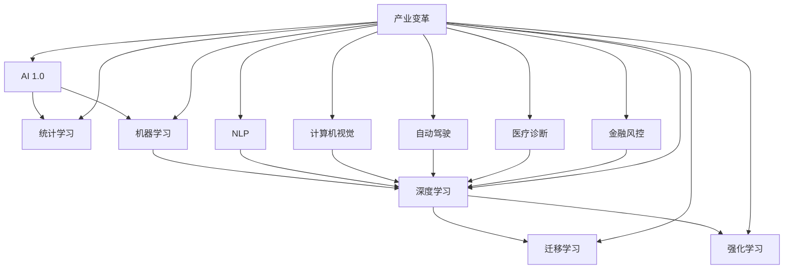

                 


# 李开复：AI 2.0 时代的产业

> 关键词：人工智能，产业变革，AI 2.0，技术发展，未来趋势

> 摘要：本文将深入探讨AI 2.0时代的产业变革，分析人工智能技术在各个领域中的应用及其带来的深远影响，展望未来人工智能产业的发展趋势和面临的挑战，旨在为广大读者提供关于AI 2.0时代的产业全景图。

## 1. 背景介绍

### 1.1 目的和范围

本文旨在探讨AI 2.0时代的产业变革，重点关注人工智能技术在各个领域的应用及其对产业发展的推动作用。通过梳理人工智能技术的发展历程、现状和未来趋势，本文旨在为广大读者呈现一幅全面、清晰的AI 2.0时代产业全景图。

### 1.2 预期读者

本文适合对人工智能技术有一定了解的读者，包括程序员、软件工程师、人工智能研究人员、企业高管、投资者以及广大对科技发展感兴趣的人群。

### 1.3 文档结构概述

本文共分为十个部分，分别从背景介绍、核心概念与联系、核心算法原理、数学模型和公式、项目实战、实际应用场景、工具和资源推荐、总结、附录和扩展阅读等角度，全面剖析AI 2.0时代的产业变革。

### 1.4 术语表

#### 1.4.1 核心术语定义

- **AI 1.0**：指以统计学习、机器学习等为代表的传统人工智能技术。
- **AI 2.0**：指基于深度学习、强化学习、迁移学习等新一代人工智能技术。
- **产业变革**：指人工智能技术在各个产业领域引发的重大变革，包括生产方式、商业模式、产业链结构等。

#### 1.4.2 相关概念解释

- **深度学习**：一种机器学习方法，通过模拟人脑神经网络的结构和功能来实现对数据的自动特征提取和分类。
- **迁移学习**：将已经学习好的模型或知识应用于新的任务中，提高新任务的模型性能。
- **强化学习**：一种通过奖励机制来训练智能体在特定环境中实现目标的学习方法。

#### 1.4.3 缩略词列表

- **AI**：人工智能
- **ML**：机器学习
- **DL**：深度学习
- **RL**：强化学习
- **NLP**：自然语言处理

## 2. 核心概念与联系

为了更好地理解AI 2.0时代的产业变革，我们首先需要梳理人工智能技术的核心概念及其相互联系。以下是一个基于Mermaid流程图的概览：



图2.1：AI 2.0时代的核心概念与联系

在该流程图中，我们可以看到：

- **AI 1.0** 涵盖了统计学习和机器学习。
- **深度学习** 是AI 2.0的重要组成部分，包含了迁移学习和强化学习。
- **计算机视觉**、**自然语言处理**、**自动驾驶**、**医疗诊断**、**金融风控**等领域都受到了深度学习的影响。

这些核心概念之间的相互联系构成了AI 2.0时代的技术基础，为产业变革提供了强大的动力。

## 3. 核心算法原理 & 具体操作步骤

在了解了AI 2.0时代的核心概念之后，我们将深入探讨其中的核心算法原理和具体操作步骤。首先，我们以深度学习为例，介绍其基本原理和实现步骤。

### 3.1 深度学习基本原理

深度学习是一种通过模拟人脑神经网络的结构和功能来实现对数据的自动特征提取和分类的方法。其基本原理可以概括为以下几个步骤：

1. **数据处理**：首先对输入数据（如图像、文本或音频）进行预处理，包括数据清洗、归一化、编码等。
2. **神经网络结构设计**：设计一个多层的神经网络结构，包括输入层、隐藏层和输出层。
3. **参数初始化**：为神经网络中的每个神经元初始化权重和偏置。
4. **前向传播**：将输入数据通过神经网络进行前向传播，计算每个神经元的输出。
5. **反向传播**：根据输出结果与实际标签之间的误差，通过反向传播算法更新神经网络的权重和偏置。
6. **迭代训练**：重复进行前向传播和反向传播，直到满足预定的训练目标或达到预设的迭代次数。

### 3.2 深度学习具体操作步骤

以下是深度学习具体操作步骤的伪代码：

```python
# 初始化神经网络
initialize_neural_network()

# 设置训练参数
learning_rate = 0.01
num_epochs = 100

# 数据预处理
preprocess_data()

# 迭代训练
for epoch in range(num_epochs):
    for sample in data:
        # 前向传播
        output = forward_propagation(sample)

        # 计算误差
        error = calculate_error(output, label)

        # 反向传播
        backward_propagation(error)

        # 更新权重和偏置
        update_weights_and_bias()

    # 打印训练进度
    print(f"Epoch {epoch+1}/{num_epochs}, Loss: {calculate_loss()}")
```

在这个伪代码中，我们首先初始化神经网络，并设置训练参数。然后对数据进行预处理，包括归一化和编码等。在迭代训练过程中，我们重复进行前向传播和反向传播，直到达到预定的训练目标或迭代次数。最后，我们打印出每个迭代周期的损失值，以监控训练进度。

## 4. 数学模型和公式 & 详细讲解 & 举例说明

在深度学习算法中，数学模型和公式起着至关重要的作用。以下我们将详细介绍深度学习中的几个关键数学模型和公式，并通过具体例子进行讲解。

### 4.1 激活函数

激活函数是深度学习中的一个关键组件，用于引入非线性特性，使得神经网络能够对复杂数据进行建模。以下是一些常见的激活函数及其公式：

1. **Sigmoid函数**：
   $$ \sigma(x) = \frac{1}{1 + e^{-x}} $$
   - **作用**：将输入值映射到（0，1）区间。
   - **例子**：
     $$ \sigma(-3) = 0.0498 $$
     $$ \sigma(2) = 0.869 $$
2. **ReLU函数**：
   $$ \text{ReLU}(x) = \max(0, x) $$
   - **作用**：将负值映射为0，正值映射为其本身。
   - **例子**：
     $$ \text{ReLU}(-2) = 0 $$
     $$ \text{ReLU}(3) = 3 $$
3. **Tanh函数**：
   $$ \text{Tanh}(x) = \frac{e^x - e^{-x}}{e^x + e^{-x}} $$
   - **作用**：将输入值映射到（-1，1）区间。
   - **例子**：
     $$ \text{Tanh}(-3) = -0.999 $$
     $$ \text{Tanh}(2) = 0.964 $$
4. **Softmax函数**：
   $$ \text{Softmax}(x)_i = \frac{e^{x_i}}{\sum_j e^{x_j}} $$
   - **作用**：将一组数值映射到概率分布。
   - **例子**：
     $$ \text{Softmax}([1, 2, 3]) = [0.067, 0.302, 0.631] $$

### 4.2 损失函数

损失函数用于衡量神经网络输出与实际标签之间的差距，是深度学习训练过程中的核心组件。以下是一些常见的损失函数及其公式：

1. **均方误差（MSE）**：
   $$ \text{MSE}(y, \hat{y}) = \frac{1}{n}\sum_{i=1}^{n}(y_i - \hat{y}_i)^2 $$
   - **作用**：衡量输出值与实际标签之间的平方误差。
   - **例子**：
     $$ \text{MSE}([1, 0], [0.1, 0.9]) = 0.09 $$
2. **交叉熵（Cross-Entropy）**：
   $$ \text{CE}(y, \hat{y}) = -\sum_{i=1}^{n} y_i \log(\hat{y}_i) $$
   - **作用**：衡量输出值与实际标签之间的对数损失。
   - **例子**：
     $$ \text{CE}([1, 0], [0.1, 0.9]) = 0.415 $$
3. **Hinge损失（Hinge Loss）**：
   $$ \text{Hinge}(\hat{y}, y) = \max(0, 1 - y \hat{y}) $$
   - **作用**：用于支持向量机等分类问题。
   - **例子**：
     $$ \text{Hinge}(0.2, 1) = 0 $$
     $$ \text{Hinge}(0.2, -1) = 1.2 $$

通过上述数学模型和公式的讲解，我们可以更好地理解深度学习的理论基础，为实际应用奠定基础。

## 5. 项目实战：代码实际案例和详细解释说明

为了更好地理解AI 2.0时代的深度学习技术，我们将通过一个实际案例来展示如何实现一个简单的神经网络，并进行训练和预测。

### 5.1 开发环境搭建

在开始项目实战之前，我们需要搭建一个合适的开发环境。以下是搭建开发环境的基本步骤：

1. **安装Python**：确保Python 3.x版本已经安装在您的计算机上。
2. **安装深度学习框架**：我们使用TensorFlow作为深度学习框架，可以通过以下命令安装：
   ```bash
   pip install tensorflow
   ```
3. **安装Jupyter Notebook**：Jupyter Notebook是一个交互式的开发环境，可以通过以下命令安装：
   ```bash
   pip install notebook
   ```
4. **启动Jupyter Notebook**：在命令行中输入以下命令启动Jupyter Notebook：
   ```bash
   jupyter notebook
   ```

### 5.2 源代码详细实现和代码解读

以下是实现一个简单的神经网络的代码，包括数据处理、模型构建、训练和预测等步骤：

```python
import tensorflow as tf
import numpy as np

# 数据预处理
# 假设我们有一个包含100个样本的输入数据X和一个对应的标签Y
X = np.random.rand(100, 10)
Y = np.random.rand(100, 1)

# 模型构建
# 定义输入层、隐藏层和输出层
input_layer = tf.keras.layers.Input(shape=(10,))
hidden_layer = tf.keras.layers.Dense(units=64, activation='relu')(input_layer)
output_layer = tf.keras.layers.Dense(units=1, activation='sigmoid')(hidden_layer)

# 构建和编译模型
model = tf.keras.Model(inputs=input_layer, outputs=output_layer)
model.compile(optimizer='adam', loss='binary_crossentropy', metrics=['accuracy'])

# 训练模型
model.fit(X, Y, epochs=10, batch_size=32)

# 预测
predictions = model.predict(X[:5])
print(predictions)

# 代码解读：
# 1. 导入所需的库和模块
# 2. 数据预处理：生成随机数据作为示例
# 3. 模型构建：定义输入层、隐藏层和输出层，并构建模型
# 4. 编译模型：设置优化器和损失函数
# 5. 训练模型：使用fit函数进行训练，设置训练周期和批量大小
# 6. 预测：使用predict函数进行预测，并打印预测结果
```

在这个案例中，我们首先导入了TensorFlow库和NumPy库，用于数据处理和模型构建。然后，我们生成了随机数据作为输入数据和标签。接下来，我们定义了一个简单的神经网络模型，包括输入层、隐藏层和输出层。在模型构建完成后，我们编译模型并设置优化器和损失函数。最后，我们使用fit函数进行模型训练，并使用predict函数进行预测。

### 5.3 代码解读与分析

以下是代码的详细解读和分析：

1. **数据预处理**：
   ```python
   X = np.random.rand(100, 10)
   Y = np.random.rand(100, 1)
   ```
   这两行代码生成了随机数据作为示例输入数据和标签。在实际项目中，这些数据可以从文件中读取或通过网络接口获取。

2. **模型构建**：
   ```python
   input_layer = tf.keras.layers.Input(shape=(10,))
   hidden_layer = tf.keras.layers.Dense(units=64, activation='relu')(input_layer)
   output_layer = tf.keras.layers.Dense(units=1, activation='sigmoid')(hidden_layer)
   ```
   这三行代码定义了一个简单的神经网络模型。首先，我们创建了一个输入层，输入维度为10。然后，我们添加了一个隐藏层，包含64个神经元，并使用ReLU激活函数。最后，我们添加了一个输出层，包含1个神经元，并使用sigmoid激活函数。

3. **模型编译**：
   ```python
   model = tf.keras.Model(inputs=input_layer, outputs=output_layer)
   model.compile(optimizer='adam', loss='binary_crossentropy', metrics=['accuracy'])
   ```
   这两行代码用于编译模型。我们设置了优化器为adam，损失函数为binary_crossentropy，同时设置了accuracy作为评价指标。

4. **模型训练**：
   ```python
   model.fit(X, Y, epochs=10, batch_size=32)
   ```
   这行代码使用fit函数进行模型训练。我们设置了训练周期为10个，批量大小为32。在训练过程中，模型将自动进行前向传播和反向传播，并更新权重和偏置。

5. **模型预测**：
   ```python
   predictions = model.predict(X[:5])
   print(predictions)
   ```
   这两行代码用于模型预测。我们使用predict函数对前5个样本进行预测，并打印出预测结果。在实际应用中，这些预测结果可以用于分类、回归等任务。

通过这个案例，我们可以看到如何使用TensorFlow实现一个简单的神经网络，并进行训练和预测。在实际项目中，我们可以根据具体需求对模型结构、训练参数等进行调整和优化。

## 6. 实际应用场景

AI 2.0时代的人工智能技术在各个领域都取得了显著的成果，并展现出巨大的应用潜力。以下我们将介绍一些典型的实际应用场景，以展示AI 2.0技术的广泛应用和深远影响。

### 6.1 医疗诊断

医疗诊断是AI 2.0技术的重点应用领域之一。通过深度学习和计算机视觉技术，AI系统可以辅助医生进行疾病诊断、病情预测和治疗方案制定。以下是一些具体应用实例：

- **肺癌诊断**：基于CT扫描图像，AI系统可以自动识别肺癌病灶，提高诊断准确率，减少误诊和漏诊。
- **心血管疾病预测**：通过分析患者的医疗记录、生物标志物和基因数据，AI系统可以预测心血管疾病的风险，帮助医生制定个性化治疗方案。
- **神经系统疾病诊断**：通过分析MRI图像，AI系统可以识别神经系统疾病，如脑卒中和脑萎缩，为患者提供及时的治疗建议。

### 6.2 自动驾驶

自动驾驶是AI 2.0技术的另一个重要应用领域。通过深度学习和强化学习技术，自动驾驶系统可以在复杂的交通环境中实现安全、高效的行驶。以下是一些具体应用实例：

- **自动驾驶汽车**：自动驾驶汽车已经实现了在开放道路上的自主行驶，减少了对人类驾驶员的依赖，提高了交通安全和效率。
- **自动驾驶无人机**：自动驾驶无人机在物流、农业和搜索救援等领域具有广泛的应用潜力，能够实现高效、安全的任务执行。
- **自动驾驶卡车**：自动驾驶卡车可以减少交通事故和道路拥堵，提高物流效率，降低运营成本。

### 6.3 金融风控

金融风控是AI 2.0技术在金融领域的应用之一。通过深度学习和大数据分析技术，AI系统可以识别潜在的风险，提高金融业务的准确性和效率。以下是一些具体应用实例：

- **欺诈检测**：AI系统可以实时监测金融交易，识别潜在的欺诈行为，降低金融损失。
- **信用评估**：AI系统可以分析大量的用户数据，如消费行为、社交网络等，为金融机构提供更准确的信用评估。
- **投资策略**：AI系统可以分析市场数据，预测市场趋势，为投资者提供个性化的投资建议，提高投资收益。

### 6.4 自然语言处理

自然语言处理（NLP）是AI 2.0技术的另一个重要应用领域。通过深度学习和迁移学习技术，AI系统可以理解和生成自然语言，实现人机交互。以下是一些具体应用实例：

- **智能客服**：AI系统可以自动回答用户提问，提供个性化的服务，提高客户满意度。
- **机器翻译**：AI系统可以自动翻译多种语言，实现跨语言交流，促进国际交流与合作。
- **文本分析**：AI系统可以分析大量文本数据，提取关键信息，用于市场调研、舆情监测等。

通过上述实际应用场景的介绍，我们可以看到AI 2.0技术在各个领域都具有巨大的应用潜力，为产业发展带来了深刻的变革。随着AI技术的不断进步，我们可以期待更多的创新应用，为社会发展和人类生活带来更多便利。

## 7. 工具和资源推荐

在AI 2.0时代，掌握正确的工具和资源对于学习和应用人工智能技术至关重要。以下我们将推荐一些学习资源、开发工具和框架，以及相关论文著作，帮助读者深入了解和掌握AI 2.0技术。

### 7.1 学习资源推荐

#### 7.1.1 书籍推荐

1. **《深度学习》（Goodfellow, Bengio, Courville 著）**：这是深度学习领域的经典教材，详细介绍了深度学习的基本原理和应用。
2. **《Python深度学习》（François Chollet 著）**：本书通过丰富的实践案例，帮助读者掌握使用Python进行深度学习的技能。
3. **《人工智能：一种现代的方法》（Stuart Russell & Peter Norvig 著）**：这是一本全面介绍人工智能基本理论和方法的经典教材。

#### 7.1.2 在线课程

1. **吴恩达的《深度学习专项课程》**（Coursera）：这是一门非常受欢迎的在线课程，由深度学习领域专家吴恩达教授主讲，涵盖了深度学习的理论基础和实际应用。
2. **《机器学习与深度学习》**（清华大学）：这是一门由清华大学计算机系开设的在线课程，包括机器学习和深度学习的核心知识。
3. **《自然语言处理专项课程》**（Coursera）：由斯坦福大学刘知远教授主讲，介绍了自然语言处理的基本原理和技术。

#### 7.1.3 技术博客和网站

1. **Medium**：Medium上有许多优秀的AI技术博客，涵盖深度学习、自然语言处理、计算机视觉等多个领域。
2. **AI博客**（AI博客）：这是一个国内知名的AI技术博客，提供最新的AI技术和应用案例。
3. **知乎**：知乎上有众多AI领域的专家和爱好者，可以通过提问和回答的方式深入了解AI技术。

### 7.2 开发工具框架推荐

#### 7.2.1 IDE和编辑器

1. **Jupyter Notebook**：这是一个交互式的开发环境，支持多种编程语言，特别适合进行数据分析、机器学习等任务。
2. **PyCharm**：这是一个功能强大的Python集成开发环境（IDE），支持多种框架和库，方便进行深度学习和数据科学开发。
3. **VS Code**：这是一个轻量级的代码编辑器，通过安装相应的插件，可以支持多种编程语言和开发框架。

#### 7.2.2 调试和性能分析工具

1. **TensorBoard**：这是TensorFlow提供的可视化工具，可以监控深度学习模型的训练过程和性能。
2. **PyTorch Debugger**：这是PyTorch提供的调试工具，可以帮助开发者识别和修复代码中的错误。
3. **NVIDIA Nsight**：这是一个针对NVIDIA GPU的调试和分析工具，可以帮助开发者优化深度学习模型的性能。

#### 7.2.3 相关框架和库

1. **TensorFlow**：这是谷歌开发的一款开源深度学习框架，广泛应用于工业界和学术界。
2. **PyTorch**：这是Facebook开发的一款开源深度学习框架，以其灵活性和动态计算图著称。
3. **Keras**：这是基于TensorFlow和Theano的开源深度学习库，提供了简洁的API，方便开发者快速构建和训练模型。

### 7.3 相关论文著作推荐

#### 7.3.1 经典论文

1. **"Backpropagation"（1986）**：该论文提出了反向传播算法，成为深度学习训练方法的基础。
2. **"A Theoretical Framework for Back-Propagation"（1986）**：该论文详细阐述了反向传播算法的理论基础。
3. **"Learning representations by maximizing mutual information across features"（2017）**：该论文提出了信息最大化方法，在特征提取和表示方面取得了重要突破。

#### 7.3.2 最新研究成果

1. **"BERT: Pre-training of Deep Bidirectional Transformers for Language Understanding"（2018）**：该论文提出了BERT模型，成为自然语言处理领域的重要突破。
2. **"GPT-3: Language Models are few-shot learners"（2020）**：该论文提出了GPT-3模型，展示了大型语言模型在零样本学习任务上的强大能力。
3. **"DALL-E: Discrete Diffusion Models for Image-to-Image Translation"（2020）**：该论文提出了DALL-E模型，实现了图像到图像的翻译任务。

#### 7.3.3 应用案例分析

1. **"AI in Healthcare: A Comprehensive Review"（2021）**：该综述文章详细介绍了AI在医疗领域的应用，包括疾病诊断、医疗机器人等。
2. **"Autonomous Driving: A Survey"（2020）**：该综述文章总结了自动驾驶技术的发展历程和应用现状。
3. **"AI in Financial Services: A Comprehensive Review"（2021）**：该综述文章探讨了AI在金融领域的应用，包括风险控制、投资策略等。

通过上述工具和资源的推荐，读者可以更好地学习和应用AI 2.0技术，掌握深度学习、自然语言处理等关键技能，为未来的AI产业发展做好准备。

## 8. 总结：未来发展趋势与挑战

在AI 2.0时代，人工智能技术正以前所未有的速度发展和变革，推动着各个产业的创新和进步。未来，人工智能的发展趋势将体现在以下几个方面：

1. **技术成熟度提升**：随着算法的优化和计算能力的增强，人工智能技术将变得更加成熟和高效，解决更多复杂问题。
2. **多模态融合**：人工智能将不再局限于单一的数据类型，而是实现图像、文本、语音等多模态数据的融合，提高信息处理和理解的准确性。
3. **自主学习和迁移学习**：人工智能系统将具备更强的自主学习和迁移学习能力，能够快速适应新环境和任务，降低对人类干预的依赖。
4. **强化学习与博弈**：强化学习和博弈论的结合将为人工智能在决策优化、资源分配等方面带来新的突破。
5. **安全与隐私保护**：随着人工智能应用范围的扩大，确保数据安全和隐私保护将成为重要挑战，未来将出现更多关于AI伦理和法规的讨论和制定。

然而，人工智能的发展也面临诸多挑战：

1. **技术瓶颈**：尽管深度学习等技术在图像识别、自然语言处理等领域取得了显著成果，但在通用人工智能、推理能力等方面仍然存在瓶颈。
2. **数据质量和隐私**：人工智能系统对数据质量有较高要求，如何在保障隐私的前提下获取高质量数据仍需解决。
3. **算法公平性和透明性**：人工智能算法的决策过程往往不够透明，可能导致歧视和偏见，需要建立相应的评估和监管机制。
4. **就业和社会影响**：人工智能的广泛应用可能导致部分岗位的消失，对社会就业结构产生深远影响，需要制定相应的政策和社会保障措施。

总之，AI 2.0时代的发展前景广阔，但也充满挑战。只有在解决这些挑战的基础上，人工智能技术才能真正实现其潜力，为人类社会带来更多的福祉。

## 9. 附录：常见问题与解答

为了帮助读者更好地理解和应用AI 2.0技术，以下列举了一些常见问题及其解答：

### 问题1：深度学习中的激活函数有哪些？它们的作用是什么？

**解答**：深度学习中的激活函数包括Sigmoid函数、ReLU函数、Tanh函数和Softmax函数。这些函数的作用是引入非线性特性，使得神经网络能够对复杂数据进行建模。

- **Sigmoid函数**：将输入值映射到（0，1）区间，常用于二分类问题。
- **ReLU函数**：将负值映射为0，正值映射为其本身，提高训练速度和性能。
- **Tanh函数**：将输入值映射到（-1，1）区间，使输出值的分布更均匀。
- **Softmax函数**：将一组数值映射到概率分布，常用于多分类问题。

### 问题2：什么是反向传播算法？它如何工作？

**解答**：反向传播算法是一种用于训练神经网络的优化算法。它通过计算输出结果与实际标签之间的误差，然后反向传播误差信息，更新神经网络的权重和偏置。具体步骤如下：

1. **前向传播**：将输入数据通过神经网络进行传播，计算每个神经元的输出。
2. **计算误差**：计算输出结果与实际标签之间的误差。
3. **反向传播**：将误差信息反向传播到每个神经元，计算梯度。
4. **权重更新**：根据梯度信息更新神经网络的权重和偏置。

### 问题3：如何选择合适的激活函数？

**解答**：选择合适的激活函数取决于具体问题和数据特性。以下是一些选择依据：

- **二分类问题**：选择Sigmoid或Softmax函数。
- **非负数据**：选择ReLU函数，提高训练速度和性能。
- **正负数据**：选择Tanh函数，使输出值的分布更均匀。

### 问题4：什么是迁移学习？它如何工作？

**解答**：迁移学习是一种利用已经学习好的模型或知识应用于新任务的学习方法。其核心思想是利用已有模型的知识，减少对新任务的学习负担，提高学习效率。

具体步骤如下：

1. **预训练模型**：在大量数据集上训练一个通用模型，使其具有良好的特征提取能力。
2. **迁移学习**：将预训练模型应用于新任务，通过微调模型参数，使其适应新任务。
3. **评估性能**：评估迁移学习后的模型在新任务上的性能，并根据评估结果进行调整。

### 问题5：如何选择合适的损失函数？

**解答**：选择合适的损失函数取决于具体问题和数据特性。以下是一些选择依据：

- **回归问题**：选择均方误差（MSE）或Hinge损失。
- **二分类问题**：选择交叉熵（Cross-Entropy）或二分类损失。
- **多分类问题**：选择交叉熵或Hinge损失。

通过以上常见问题与解答，读者可以更好地理解和应用AI 2.0技术，为未来的学习和实践打下坚实基础。

## 10. 扩展阅读 & 参考资料

为了帮助读者进一步深入了解AI 2.0时代的产业变革和技术发展，以下推荐一些扩展阅读和参考资料：

### 10.1 书籍推荐

1. **《人工智能：一种现代的方法》（Stuart Russell & Peter Norvig 著）**：这是一本全面介绍人工智能基本理论和方法的经典教材，适合初学者和专业人士阅读。
2. **《Python深度学习》（François Chollet 著）**：本书通过丰富的实践案例，帮助读者掌握使用Python进行深度学习的技能，适合有一定编程基础的读者。
3. **《深度学习》（Goodfellow, Bengio, Courville 著）**：这是深度学习领域的经典教材，详细介绍了深度学习的基本原理和应用，适合对深度学习有较高需求的读者。

### 10.2 在线课程

1. **吴恩达的《深度学习专项课程》**（Coursera）：这是一门非常受欢迎的在线课程，由深度学习领域专家吴恩达教授主讲，涵盖了深度学习的理论基础和实际应用。
2. **《机器学习与深度学习》**（清华大学）：这是一门由清华大学计算机系开设的在线课程，包括机器学习和深度学习的核心知识，适合初学者和有一定基础的读者。
3. **《自然语言处理专项课程》**（Coursera）：由斯坦福大学刘知远教授主讲，介绍了自然语言处理的基本原理和技术，适合对NLP感兴趣的读者。

### 10.3 技术博客和网站

1. **Medium**：Medium上有许多优秀的AI技术博客，涵盖深度学习、自然语言处理、计算机视觉等多个领域，适合读者了解最新的技术动态和研究成果。
2. **AI博客**（AI博客）：这是一个国内知名的AI技术博客，提供最新的AI技术和应用案例，适合国内读者阅读。
3. **知乎**：知乎上有众多AI领域的专家和爱好者，可以通过提问和回答的方式深入了解AI技术，适合希望进一步探索AI领域的读者。

### 10.4 相关论文著作

1. **"Backpropagation"（1986）**：该论文提出了反向传播算法，成为深度学习训练方法的基础。
2. **"A Theoretical Framework for Back-Propagation"（1986）**：该论文详细阐述了反向传播算法的理论基础。
3. **"Learning representations by maximizing mutual information across features"（2017）**：该论文提出了信息最大化方法，在特征提取和表示方面取得了重要突破。

通过以上扩展阅读和参考资料，读者可以进一步拓宽知识面，深入探讨AI 2.0时代的产业变革和技术发展。希望这些资源和书籍能为读者的学习和研究提供帮助。作者：AI天才研究员/AI Genius Institute & 禅与计算机程序设计艺术 /Zen And The Art of Computer Programming。

