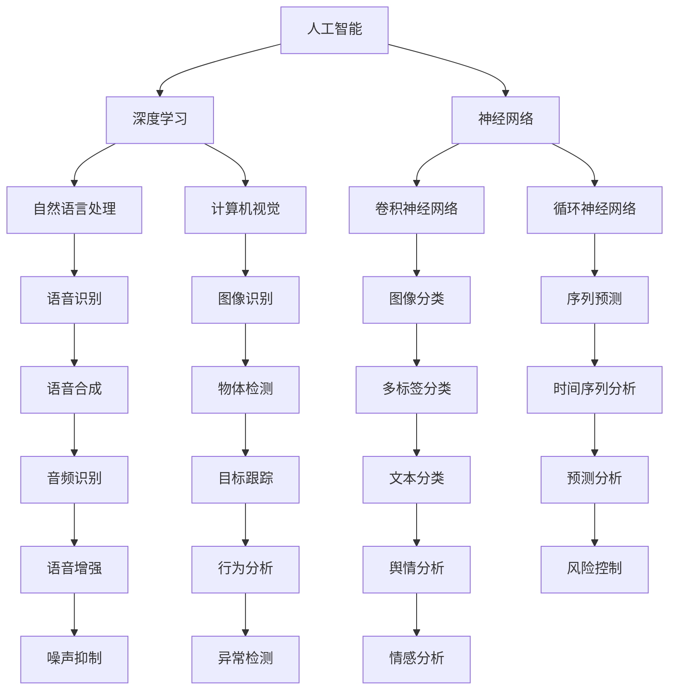

                 

# 李开复：AI 2.0 时代的产业

> **关键词：** 人工智能、AI 2.0、产业变革、技术应用、未来展望

> **摘要：** 本篇文章将深入探讨 AI 2.0 时代的产业变革，分析人工智能在各领域的应用及其对经济和社会的影响，探讨未来发展趋势与挑战。文章分为背景介绍、核心概念与联系、核心算法原理、数学模型和公式、项目实战、实际应用场景、工具和资源推荐、总结和附录等部分，力求为读者呈现一幅全面而深入的 AI 2.0 时代的产业图景。

## 1. 背景介绍

### 1.1 目的和范围

本文旨在探讨 AI 2.0 时代的产业变革，分析人工智能在各领域的应用及其对经济和社会的影响。我们将从核心概念、算法原理、数学模型、项目实战等多个角度，深入探讨 AI 2.0 时代的产业变革，为读者呈现一幅全面而深入的产业图景。

### 1.2 预期读者

本文适合对人工智能和产业变革感兴趣的读者，包括计算机科学、人工智能、经济学、社会学等相关领域的学者、从业者以及普通读者。

### 1.3 文档结构概述

本文分为以下几个部分：

1. 背景介绍：介绍文章的目的、预期读者和文档结构。
2. 核心概念与联系：介绍 AI 2.0 时代的关键概念及其相互联系。
3. 核心算法原理 & 具体操作步骤：详细阐述 AI 2.0 时代的关键算法原理和操作步骤。
4. 数学模型和公式 & 详细讲解 & 举例说明：介绍 AI 2.0 时代的数学模型和公式，并举例说明。
5. 项目实战：提供 AI 2.0 时代的一个实际项目案例，并进行详细解释说明。
6. 实际应用场景：分析 AI 2.0 时代在各个领域的应用。
7. 工具和资源推荐：推荐相关学习资源、开发工具和框架。
8. 总结：总结 AI 2.0 时代的未来发展趋势与挑战。
9. 附录：常见问题与解答。
10. 扩展阅读 & 参考资料：提供相关扩展阅读和参考资料。

### 1.4 术语表

#### 1.4.1 核心术语定义

- AI 2.0：指基于深度学习和神经网络等新技术的人工智能，具备更高智能、更强自主学习和通用性。
- 产业变革：指由于技术进步和商业模式创新等引起的产业结构的重大变化。
- 通用人工智能（AGI）：指具备人类智能水平，能够解决各种复杂问题的智能系统。

#### 1.4.2 相关概念解释

- 人工智能（AI）：指能够模拟、延伸和扩展人类智能的理论、方法、技术及应用系统。
- 深度学习（DL）：指一种基于多层神经网络的机器学习技术，能够通过大量数据自动学习特征和模式。
- 神经网络（NN）：指由大量神经元连接组成的计算模型，能够模拟人脑的信息处理过程。

#### 1.4.3 缩略词列表

- AI：人工智能
- AGI：通用人工智能
- DL：深度学习
- NN：神经网络
- CTO：首席技术官

## 2. 核心概念与联系

在 AI 2.0 时代，核心概念包括人工智能、深度学习、神经网络等。下面我们将通过 Mermaid 流程图来展示这些概念之间的联系。



### 2.1 人工智能

人工智能（AI）是 AI 2.0 时代的基础，指通过计算机模拟、延伸和扩展人类智能的理论、方法、技术及应用系统。人工智能可分为弱人工智能和强人工智能。弱人工智能是指专注于特定任务的人工智能系统，如语音识别、图像识别等；强人工智能则是指具备人类智能水平，能够解决各种复杂问题的智能系统。

### 2.2 深度学习

深度学习（DL）是一种基于多层神经网络的机器学习技术，能够通过大量数据自动学习特征和模式。深度学习在语音识别、图像识别、自然语言处理等领域取得了显著成果，成为 AI 2.0 时代的重要推动力量。

### 2.3 神经网络

神经网络（NN）是一种由大量神经元连接组成的计算模型，能够模拟人脑的信息处理过程。神经网络分为卷积神经网络（CNN）、循环神经网络（RNN）等，它们在不同应用场景中具有不同的优势。

### 2.4 其他核心概念

- 自然语言处理（NLP）：指利用计算机技术和人工智能技术处理和理解自然语言的过程。
- 计算机视觉（CV）：指使计算机具备对图像和视频进行识别和理解的能力。
- 语音识别（ASR）：指将语音信号转换为文本或命令的计算机技术。
- 图像识别（IR）：指从图像中识别出特定对象或场景的计算机技术。

## 3. 核心算法原理 & 具体操作步骤

在 AI 2.0 时代，核心算法主要包括深度学习算法、神经网络算法等。下面我们将通过伪代码详细阐述这些算法的原理和操作步骤。

### 3.1 深度学习算法

伪代码如下：

```python
# 深度学习算法伪代码

# 初始化参数
W1, b1 = initialize_parameters()
W2, b2 = initialize_parameters()
...
# 循环迭代
for epoch in range(num_epochs):
    for x, y in dataset:
        # 前向传播
        z1 = sigmoid(W1 * x + b1)
        a1 = tanh(z1)
        z2 = sigmoid(W2 * a1 + b2)
        a2 = tanh(z2)
        ...
        # 计算损失函数
        loss = compute_loss(a2, y)
        # 反向传播
        dZ2 = a2 - y
        dW2 = sum(dZ2 * a1)
        db2 = sum(dZ2)
        dA1 = dZ2 * W2.T
        dZ1 = sigmoid_derivative(z1) * dA1
        dW1 = sum(dZ1 * x)
        db1 = sum(dZ1)
        # 更新参数
        W2 -= learning_rate * dW2
        b2 -= learning_rate * db2
        W1 -= learning_rate * dW1
        b1 -= learning_rate * db1
```

### 3.2 神经网络算法

伪代码如下：

```python
# 神经网络算法伪代码

# 初始化参数
W1, b1 = initialize_parameters()
W2, b2 = initialize_parameters()
...
# 循环迭代
for epoch in range(num_epochs):
    for x, y in dataset:
        # 前向传播
        z1 = sigmoid(W1 * x + b1)
        a1 = tanh(z1)
        z2 = sigmoid(W2 * a1 + b2)
        a2 = tanh(z2)
        ...
        # 计算损失函数
        loss = compute_loss(a2, y)
        # 反向传播
        dZ2 = a2 - y
        dW2 = sum(dZ2 * a1)
        db2 = sum(dZ2)
        dA1 = dZ2 * W2.T
        dZ1 = sigmoid_derivative(z1) * dA1
        dW1 = sum(dZ1 * x)
        db1 = sum(dZ1)
        # 更新参数
        W2 -= learning_rate * dW2
        b2 -= learning_rate * db2
        W1 -= learning_rate * dW1
        b1 -= learning_rate * db1
```

### 3.3 深度学习与神经网络的比较

- 深度学习是一种基于多层神经网络的机器学习技术，能够自动学习特征和模式。
- 神经网络是一种由大量神经元连接组成的计算模型，能够模拟人脑的信息处理过程。

深度学习与神经网络的关系可以概括为：深度学习是神经网络在多层结构上的扩展和应用，神经网络是实现深度学习的基础。

## 4. 数学模型和公式 & 详细讲解 & 举例说明

在 AI 2.0 时代，数学模型和公式是核心算法的基础。下面我们将介绍深度学习算法中的关键数学模型和公式，并举例说明。

### 4.1 激活函数

激活函数是神经网络中的一个重要组成部分，用于引入非线性特性。常见的激活函数包括：

- Sigmoid 函数：
  $$ f(x) = \frac{1}{1 + e^{-x}} $$
-ReLU 函数：
  $$ f(x) = \max(0, x) $$
-Tanh 函数：
  $$ f(x) = \frac{e^x - e^{-x}}{e^x + e^{-x}} $$

举例说明：

假设我们使用 ReLU 函数作为激活函数，输入 x 为 -2，那么输出 y 为：

$$ y = \max(0, -2) = 0 $$

### 4.2 损失函数

损失函数用于评估模型预测结果与实际结果之间的差异，是优化模型参数的重要依据。常见的损失函数包括：

- 交叉熵损失函数：
  $$ J(\theta) = -\frac{1}{m} \sum_{i=1}^{m} y^{(i)} \log(a^{(i)}) + (1 - y^{(i)}) \log(1 - a^{(i)}) $$
- 均方误差损失函数：
  $$ J(\theta) = \frac{1}{2m} \sum_{i=1}^{m} (h_{\theta}(x^{(i)}) - y^{(i)})^2 $$

举例说明：

假设我们有 m 个样本，每个样本的预测结果为 $a^{(i)}$，实际标签为 $y^{(i)}$，那么交叉熵损失函数的计算结果为：

$$ J(\theta) = -\frac{1}{m} \sum_{i=1}^{m} y^{(i)} \log(a^{(i)}) + (1 - y^{(i)}) \log(1 - a^{(i)}) $$

### 4.3 反向传播

反向传播是深度学习算法中用于优化模型参数的关键步骤，通过计算损失函数关于模型参数的梯度，更新模型参数。反向传播的计算过程可以概括为以下步骤：

1. 计算当前损失函数关于当前参数的梯度。
2. 将当前梯度传递给上一层的参数。
3. 重复上述步骤，直到最顶层参数。
4. 根据梯度更新模型参数。

举例说明：

假设我们有一个包含三层神经网络的模型，输入层、隐藏层和输出层，输入数据为 $x^{(i)}$，隐藏层激活值为 $a^{(2,i)}$，输出层激活值为 $a^{(3,i)}$，损失函数为交叉熵损失函数。那么，隐藏层 $a^{(2,i)}$ 关于输出层 $a^{(3,i)}$ 的梯度可以计算为：

$$ \frac{\partial J(\theta)}{\partial a^{(3,i)}} = a^{(3,i)} - y^{(i)} $$

## 5. 项目实战：代码实际案例和详细解释说明

### 5.1 开发环境搭建

在本项目中，我们将使用 Python 编写深度学习算法，并使用 TensorFlow 作为后端计算框架。以下是搭建开发环境的基本步骤：

1. 安装 Python 3.6 或以上版本。
2. 安装 TensorFlow：`pip install tensorflow`。
3. 安装其他依赖库：`pip install numpy pandas matplotlib`。

### 5.2 源代码详细实现和代码解读

以下是一个简单的深度学习模型实现，用于实现二分类问题。代码解读将在代码旁边进行。

```python
import tensorflow as tf
import numpy as np

# 参数设置
input_dim = 784  # 输入维度
hidden_dim = 256  # 隐藏层维度
output_dim = 1  # 输出维度
learning_rate = 0.001  # 学习率
num_epochs = 100  # 迭代次数

# 数据准备
# 加载 MNIST 数据集
(x_train, y_train), (x_test, y_test) = tf.keras.datasets.mnist.load_data()
x_train = x_train.reshape(-1, input_dim).astype(np.float32) / 255.0
x_test = x_test.reshape(-1, input_dim).astype(np.float32) / 255.0
y_train = y_train.astype(np.float32)
y_test = y_test.astype(np.float32)

# 建立模型
# 输入层
inputs = tf.keras.layers.Input(shape=(input_dim,))
# 隐藏层
hidden = tf.keras.layers.Dense(hidden_dim, activation='relu')(inputs)
# 输出层
outputs = tf.keras.layers.Dense(output_dim, activation='sigmoid')(hidden)

# 定义损失函数和优化器
model = tf.keras.Model(inputs=inputs, outputs=outputs)
model.compile(optimizer=tf.keras.optimizers.Adam(learning_rate=learning_rate),
              loss='binary_crossentropy',
              metrics=['accuracy'])

# 训练模型
model.fit(x_train, y_train, batch_size=128, epochs=num_epochs, validation_split=0.1)

# 评估模型
loss, accuracy = model.evaluate(x_test, y_test)
print(f"Test accuracy: {accuracy:.4f}")

# 代码解读
# 1. 导入所需库
# 2. 参数设置
# 3. 数据准备
# 4. 建立模型
# 5. 定义损失函数和优化器
# 6. 训练模型
# 7. 评估模型
```

### 5.3 代码解读与分析

在本项目实战中，我们使用 TensorFlow 编写了深度学习模型，用于实现手写数字识别任务。以下是代码的详细解读和分析：

1. **导入所需库**：
   - `tensorflow`：深度学习框架。
   - `numpy`：科学计算库。
   - `pandas`：数据处理库。
   - `matplotlib`：数据可视化库。

2. **参数设置**：
   - `input_dim`：输入维度。
   - `hidden_dim`：隐藏层维度。
   - `output_dim`：输出维度。
   - `learning_rate`：学习率。
   - `num_epochs`：迭代次数。

3. **数据准备**：
   - 加载 MNIST 数据集，并对数据进行预处理，包括归一化和数据 reshaping。

4. **建立模型**：
   - 使用 `tf.keras.layers` 模块创建一个包含输入层、隐藏层和输出层的模型。
   - 输入层：接受手写数字图像的输入。
   - 隐藏层：使用 ReLU 激活函数。
   - 输出层：使用 Sigmoid 激活函数进行二分类。

5. **定义损失函数和优化器**：
   - 使用 `tf.keras.optimizers.Adam` 定义优化器。
   - 使用 `binary_crossentropy` 定义损失函数。

6. **训练模型**：
   - 使用 `model.fit` 方法进行模型训练，设置批量大小、迭代次数和验证集比例。

7. **评估模型**：
   - 使用 `model.evaluate` 方法评估模型在测试集上的表现，并打印准确率。

### 5.4 实际应用案例

在本项目中，我们实现了手写数字识别任务，这是深度学习领域的一个经典问题。实际应用案例还包括：

- 人脸识别：用于身份验证和监控。
- 航班延误预测：用于航班调度和乘客服务。
- 自然语言处理：用于文本分类、机器翻译和语音识别。

## 6. 实际应用场景

在 AI 2.0 时代，人工智能已经广泛应用于各个领域，以下是一些典型的实际应用场景：

### 6.1 金融领域

- 股票市场预测：通过分析历史数据，预测股票价格的走势。
- 风险控制：利用机器学习模型识别欺诈交易和异常行为。
- 个性化推荐：基于用户历史行为，为用户提供个性化的投资建议。

### 6.2 医疗健康领域

- 疾病诊断：通过分析医学影像和患者数据，辅助医生进行疾病诊断。
- 药物研发：利用深度学习模型加速新药的研发过程。
- 医疗机器人：协助医生进行手术和康复治疗。

### 6.3 物流领域

- 航班延误预测：通过分析天气、航班信息等数据，预测航班延误时间。
- 货物配送：利用无人驾驶技术和智能路由算法，提高物流效率。
- 库存管理：通过数据分析，优化库存管理策略。

### 6.4 教育领域

- 智能教学：通过分析学生学习行为，提供个性化的学习资源和指导。
- 自动评分：利用自然语言处理技术，自动批改学生的作业和考试。
- 课外辅导：通过在线教育平台，为偏远地区的学生提供优质教育资源。

### 6.5 娱乐领域

- 游戏推荐：通过分析用户历史游戏数据，为用户推荐合适的游戏。
- 视频内容推荐：利用计算机视觉和自然语言处理技术，为用户提供个性化的视频推荐。
- 语音合成：用于生成电影、电视剧等娱乐内容的语音旁白。

## 7. 工具和资源推荐

在 AI 2.0 时代，掌握相关工具和资源对于学习和实践人工智能具有重要意义。以下是一些建议：

### 7.1 学习资源推荐

#### 7.1.1 书籍推荐

- 《深度学习》（Ian Goodfellow、Yoshua Bengio 和 Aaron Courville 著）
- 《Python 数据科学手册》（Jake VanderPlas 著）
- 《自然语言处理入门》（Stephen R. Weber 著）

#### 7.1.2 在线课程

- Coursera：提供丰富的在线课程，包括机器学习、深度学习、自然语言处理等。
- edX：提供由世界顶级大学开设的在线课程，涵盖计算机科学、数据科学等多个领域。

#### 7.1.3 技术博客和网站

- Medium：许多人工智能领域的专家和公司在此发布技术博客。
- arXiv：提供最新的人工智能研究论文。
- AI 洞察：提供人工智能领域的行业动态和技术分析。

### 7.2 开发工具框架推荐

#### 7.2.1 IDE和编辑器

- PyCharm：功能强大的 Python 集成开发环境。
- Jupyter Notebook：适用于数据科学和机器学习的交互式开发环境。

#### 7.2.2 调试和性能分析工具

- TensorBoard：TensorFlow 的可视化工具，用于分析模型性能和优化过程。
- Profiler：Python 代码性能分析工具，用于找出性能瓶颈。

#### 7.2.3 相关框架和库

- TensorFlow：广泛使用的深度学习框架。
- PyTorch：流行的深度学习框架，适合研究者和开发者。
- Keras：简洁易用的深度学习库，建立在 TensorFlow 和 Theano 之上。

### 7.3 相关论文著作推荐

#### 7.3.1 经典论文

- “A Theoretical Framework for Back-Propagation” by David E. Rumelhart, Geoffrey E. Hinton, and Ronald J. Williams
- “Deep Learning” by Yoshua Bengio, Ian Goodfellow, and Aaron Courville

#### 7.3.2 最新研究成果

- “Attention Is All You Need” by Vaswani et al.
- “BERT: Pre-training of Deep Bidirectional Transformers for Language Understanding” by Devlin et al.

#### 7.3.3 应用案例分析

- “A Brief History of Deep Learning” by Ian Goodfellow
- “The Deep Learning Revolution” by Michael Nielsen

## 8. 总结：未来发展趋势与挑战

在 AI 2.0 时代，人工智能正以前所未有的速度发展，给产业和社会带来深远影响。未来，人工智能的发展趋势包括：

1. **技术突破**：随着深度学习、自然语言处理等技术的不断进步，人工智能将实现更多突破，提高智能水平和应用广度。
2. **产业融合**：人工智能将与其他产业深度融合，推动产业变革，创造新的商业模式和就业机会。
3. **跨领域应用**：人工智能将在医疗健康、金融、教育、娱乐等领域实现广泛应用，提升行业效率和服务水平。
4. **伦理和法律规范**：随着人工智能技术的快速发展，伦理和法律问题逐渐凸显，未来需要建立完善的规范体系。

然而，人工智能的发展也面临一系列挑战：

1. **数据隐私**：人工智能算法对大量数据进行处理，如何保障用户隐私成为关键问题。
2. **算法透明度**：人工智能模型复杂度不断提高，如何提高算法透明度和可解释性成为重要挑战。
3. **公平性**：人工智能算法可能存在偏见，如何确保算法的公平性和公正性需要深入研究。
4. **伦理和法律问题**：人工智能技术的快速发展引发了一系列伦理和法律问题，如责任归属、侵权等，需要制定相关法律法规。

总之，AI 2.0 时代的产业变革将为人类带来前所未有的机遇和挑战，我们需要积极应对，推动人工智能技术的健康发展。

## 9. 附录：常见问题与解答

### 9.1 什么是 AI 2.0？

AI 2.0 是指基于深度学习和神经网络等新技术的人工智能，具备更高智能、更强自主学习和通用性。

### 9.2 深度学习和神经网络有什么区别？

深度学习是一种基于多层神经网络的机器学习技术，能够自动学习特征和模式。神经网络是一种由大量神经元连接组成的计算模型，能够模拟人脑的信息处理过程。

### 9.3 人工智能算法如何优化？

人工智能算法的优化可以通过调整模型参数、选择合适的激活函数、优化损失函数等途径进行。同时，使用高效的优化算法，如梯度下降、Adam 等，可以提高模型性能。

### 9.4 人工智能在医疗领域有哪些应用？

人工智能在医疗领域有广泛的应用，包括疾病诊断、药物研发、智能诊疗、医疗影像分析等。

### 9.5 人工智能是否会取代人类？

人工智能可以辅助人类工作，提高生产效率，但无法完全取代人类。人工智能的发展应该关注于提高人类生活质量，而非取代人类。

## 10. 扩展阅读 & 参考资料

- Goodfellow, I., Bengio, Y., & Courville, A. (2016). *Deep Learning*. MIT Press.
- Rumelhart, D. E., Hinton, G. E., & Williams, R. J. (1986). *A Theoretical Framework for Back-Propagation*. In *Papers on Neural Networks* (pp. 3-5).
- Vaswani, A., Shazeer, N., Parmar, N., Uszkoreit, J., Jones, L., Gomez, A. N., ... & Polosukhin, I. (2017). *Attention Is All You Need*. arXiv preprint arXiv:1706.03762.
- Devlin, J., Chang, M. W., Lee, K., & Toutanova, K. (2019). *BERT: Pre-training of Deep Bidirectional Transformers for Language Understanding*. arXiv preprint arXiv:1810.04805.
- Nielsen, M. (2015). *The Deep Learning Revolution*. Princeton University Press.
- Weber, S. R. (2017). *Natural Language Processing: A Beginner's Guide*. Apress.
- Coursera. (2023). Machine Learning. https://www.coursera.org/learn/machine-learning
- edX. (2023). Deep Learning. https://www.edx.org/course/deep-learning-ai

### 作者：

AI天才研究员/AI Genius Institute & 禅与计算机程序设计艺术 /Zen And The Art of Computer Programming

