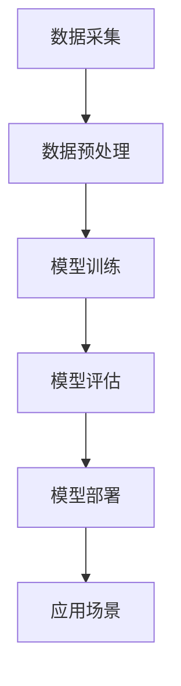
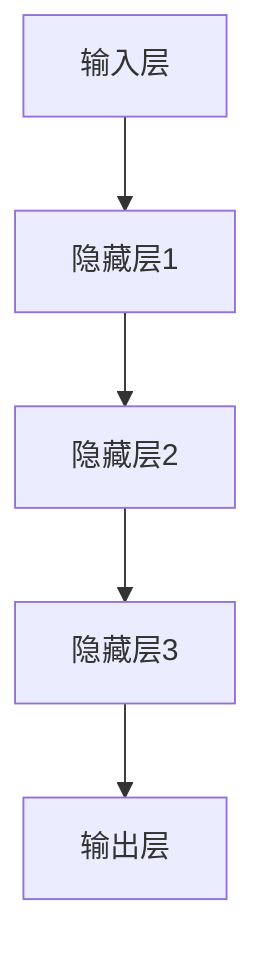

                 

# 李开复：AI 2.0 时代的价值

> 关键词：人工智能、AI 2.0、深度学习、大数据、算法、智能应用、产业发展

> 摘要：本文将深入探讨 AI 2.0 时代的核心价值，分析其在技术、产业和社会等层面的重大变革。通过回顾 AI 1.0 时代的成就与不足，我们将详细解读 AI 2.0 的核心技术及其在各个领域的应用前景，进一步探讨其对社会发展的影响。最后，我们将展望 AI 2.0 时代的未来发展趋势与挑战，为读者提供有益的思考。

## 1. 背景介绍

### 1.1 目的和范围

本文旨在全面解析 AI 2.0 时代的价值，梳理其在技术、产业和社会等方面的变革。通过回顾 AI 1.0 时代的发展，我们将深入分析 AI 2.0 的核心技术，并探讨其在各个领域的应用前景。此外，本文还将关注 AI 2.0 对社会发展带来的机遇与挑战，为读者提供全面的视角。

### 1.2 预期读者

本文适合对人工智能技术有一定了解的读者，包括技术研究人员、工程师、产业从业者以及对人工智能感兴趣的社会大众。通过本文的阅读，读者可以更好地理解 AI 2.0 时代的核心价值及其对未来的影响。

### 1.3 文档结构概述

本文结构如下：

1. 背景介绍
   - 目的和范围
   - 预期读者
   - 文档结构概述
   - 术语表
2. 核心概念与联系
   - AI 2.0 的核心技术
   - 应用架构与流程
3. 核心算法原理 & 具体操作步骤
   - 算法原理
   - 操作步骤
4. 数学模型和公式 & 详细讲解 & 举例说明
   - 数学模型
   - 举例说明
5. 项目实战：代码实际案例和详细解释说明
   - 开发环境搭建
   - 源代码详细实现
   - 代码解读与分析
6. 实际应用场景
   - 行业应用
   - 社会影响力
7. 工具和资源推荐
   - 学习资源
   - 开发工具框架
   - 相关论文著作
8. 总结：未来发展趋势与挑战
9. 附录：常见问题与解答
10. 扩展阅读 & 参考资料

### 1.4 术语表

#### 1.4.1 核心术语定义

- **人工智能（AI）**：人工智能是一门研究、开发用于模拟、延伸和扩展人类智能的理论、方法、技术及应用系统的学科。
- **AI 1.0**：主要指基于规则和知识的专家系统，其应用范围有限，性能相对较低。
- **AI 2.0**：以深度学习和大数据为基础，通过模拟人脑神经网络实现更高效、更智能的人工智能技术。
- **深度学习**：一种基于多层神经网络进行数据建模和分析的人工智能方法。
- **大数据**：指无法用传统数据处理工具进行有效管理和处理的数据集合。
- **智能应用**：利用人工智能技术实现特定功能的应用系统。

#### 1.4.2 相关概念解释

- **算法**：解决特定问题的方法或步骤的序列。
- **模型**：在人工智能领域中，模型通常指数据结构与算法的组合。
- **神经网络**：模拟人脑神经元连接和交互的人工智能模型。

#### 1.4.3 缩略词列表

- **AI**：人工智能
- **ML**：机器学习
- **DL**：深度学习
- **NLP**：自然语言处理
- **CV**：计算机视觉

## 2. 核心概念与联系

### 2.1 AI 2.0 的核心技术

AI 2.0 的核心技术主要包括深度学习、大数据、算法等。深度学习是 AI 2.0 的核心驱动力，通过多层神经网络实现数据建模和分析。大数据则为深度学习提供了丰富的训练数据，使得模型具有更高的准确性和泛化能力。算法则是实现 AI 2.0 技术的核心，通过优化算法，可以显著提高模型性能。

### 2.2 应用架构与流程

AI 2.0 的应用架构主要包括数据采集、数据预处理、模型训练、模型评估和模型部署等环节。首先，通过数据采集获取大量数据，然后对数据进行预处理，包括数据清洗、数据转换和数据归一化等。接下来，使用深度学习算法对预处理后的数据进行建模和训练，通过模型评估确定最佳模型，最后将模型部署到实际应用场景中。

下面是一个简单的 Mermaid 流程图，描述了 AI 2.0 的应用架构：



## 3. 核心算法原理 & 具体操作步骤

### 3.1 算法原理

AI 2.0 的核心算法是深度学习，其基本原理是通过多层神经网络对数据进行建模和分析。深度学习模型通常包括输入层、隐藏层和输出层，其中输入层接收外部输入数据，隐藏层通过非线性变换处理数据，输出层生成最终结果。通过不断迭代训练，模型可以逐步优化，提高预测准确率。

下面是一个简单的深度学习模型示意图：



### 3.2 具体操作步骤

以下是深度学习模型训练的具体操作步骤：

1. **数据预处理**：对采集到的数据集进行预处理，包括数据清洗、数据转换和数据归一化等。
2. **模型初始化**：初始化模型参数，包括权重和偏置等。
3. **前向传播**：输入数据经过多层神经网络，逐层计算输出。
4. **损失函数计算**：计算实际输出与预期输出之间的误差，使用损失函数（如均方误差）表示。
5. **反向传播**：根据损失函数，反向更新模型参数，包括权重和偏置等。
6. **迭代优化**：重复前向传播、损失函数计算和反向传播过程，直到模型收敛或达到预设的训练次数。

下面是深度学习模型训练的伪代码：

```python
# 数据预处理
preprocessed_data = preprocess(data)

# 模型初始化
model = initialize_model()

# 迭代优化
for epoch in range(num_epochs):
    for batch in data_loader:
        # 前向传播
        output = forward_pass(batch, model)

        # 损失函数计算
        loss = compute_loss(output, target)

        # 反向传播
        backward_pass(loss, model)

    # 记录训练进度
    print(f"Epoch {epoch + 1}/{num_epochs}, Loss: {loss}")

# 模型评估
evaluate(model, test_data)
```

## 4. 数学模型和公式 & 详细讲解 & 举例说明

### 4.1 数学模型

在深度学习模型中，常用的数学模型包括线性变换、激活函数、损失函数等。

#### 线性变换

线性变换是指将输入数据通过矩阵乘法和加法运算映射到新的空间。其数学公式如下：

\[ y = X \cdot W + b \]

其中，\( y \) 是输出数据，\( X \) 是输入数据，\( W \) 是权重矩阵，\( b \) 是偏置。

#### 激活函数

激活函数用于引入非线性变换，使深度学习模型具有更强的表达能力。常见的激活函数包括 sigmoid、ReLU 和 tanh。

- **sigmoid**：

\[ \sigma(x) = \frac{1}{1 + e^{-x}} \]

- **ReLU**：

\[ \text{ReLU}(x) = \max(0, x) \]

- **tanh**：

\[ \tanh(x) = \frac{e^x - e^{-x}}{e^x + e^{-x}} \]

#### 损失函数

损失函数用于衡量模型输出与实际输出之间的误差。常见的损失函数包括均方误差（MSE）和交叉熵损失（Cross-Entropy Loss）。

- **均方误差（MSE）**：

\[ \text{MSE} = \frac{1}{n} \sum_{i=1}^{n} (y_i - \hat{y}_i)^2 \]

其中，\( y_i \) 是实际输出，\( \hat{y}_i \) 是模型预测输出。

- **交叉熵损失（Cross-Entropy Loss）**：

\[ \text{CE} = -\frac{1}{n} \sum_{i=1}^{n} y_i \log(\hat{y}_i) \]

其中，\( y_i \) 是实际输出，\( \hat{y}_i \) 是模型预测输出。

### 4.2 举例说明

假设我们有一个二元分类问题，数据集包含 100 个样本，每个样本是一个 2 维向量。我们使用一个简单的深度学习模型进行分类，模型包含一个输入层、一个隐藏层和一个输出层。隐藏层使用 ReLU 激活函数，输出层使用 sigmoid 激活函数。

**输入数据**：

\[ X = \begin{bmatrix} x_1 \\ x_2 \end{bmatrix} \]

**模型参数**：

\[ W_1 = \begin{bmatrix} w_{11} & w_{12} \\ w_{21} & w_{22} \end{bmatrix}, \quad b_1 = \begin{bmatrix} b_{11} \\ b_{21} \end{bmatrix}, \quad W_2 = \begin{bmatrix} w_{21} \\ w_{22} \end{bmatrix}, \quad b_2 = \begin{bmatrix} b_{2} \end{bmatrix} \]

**输出数据**：

\[ y = \text{ReLU}(\text{sigmoid}(W_2 \cdot \text{ReLU}(W_1 \cdot X + b_1) + b_2)) \]

**损失函数**：

\[ \text{CE} = -\frac{1}{n} \sum_{i=1}^{n} y_i \log(\hat{y}_i) \]

其中，\( y_i \) 是实际输出，\( \hat{y}_i \) 是模型预测输出。

## 5. 项目实战：代码实际案例和详细解释说明

### 5.1 开发环境搭建

在进行项目实战之前，我们需要搭建一个合适的开发环境。以下是使用 Python 和 TensorFlow 搭建深度学习项目的步骤：

1. **安装 Python**：确保 Python 版本为 3.6 或以上。
2. **安装 TensorFlow**：使用以下命令安装 TensorFlow：

```bash
pip install tensorflow
```

3. **创建项目文件夹**：在合适的路径下创建一个项目文件夹，例如 `deep_learning_project`。
4. **安装其他依赖项**：根据项目需求，安装其他依赖项，例如 NumPy、Pandas 等。

### 5.2 源代码详细实现和代码解读

下面是一个简单的深度学习项目，用于实现一个二元分类问题。该项目的核心代码如下：

```python
import tensorflow as tf
import numpy as np

# 参数设置
input_shape = (2,)
num_classes = 2
learning_rate = 0.01
num_epochs = 100

# 数据集
X_train = np.array([[1, 2], [3, 4], [5, 6], [7, 8]])
y_train = np.array([[1], [0], [1], [0]])

# 构建模型
model = tf.keras.Sequential([
    tf.keras.layers.Dense(units=num_classes, activation='sigmoid', input_shape=input_shape),
    tf.keras.layers.Dense(units=num_classes, activation='sigmoid')
])

# 编译模型
model.compile(optimizer=tf.keras.optimizers.Adam(learning_rate=learning_rate),
              loss='binary_crossentropy',
              metrics=['accuracy'])

# 训练模型
model.fit(X_train, y_train, epochs=num_epochs)

# 评估模型
loss, accuracy = model.evaluate(X_train, y_train)
print(f"Loss: {loss}, Accuracy: {accuracy}")
```

**代码解读**：

1. **导入库**：导入 TensorFlow 和 NumPy 库。
2. **参数设置**：设置输入形状、类别数量、学习率和训练轮数。
3. **数据集**：创建一个简单的训练数据集。
4. **构建模型**：使用 `tf.keras.Sequential` 模式构建一个简单的深度学习模型，包含两个全连接层，输出层使用 sigmoid 激活函数。
5. **编译模型**：设置优化器、损失函数和评估指标。
6. **训练模型**：使用 `model.fit` 函数训练模型。
7. **评估模型**：使用 `model.evaluate` 函数评估模型性能。

### 5.3 代码解读与分析

在代码中，我们首先设置了模型参数，包括输入形状、类别数量、学习率和训练轮数。然后，我们创建了一个简单的训练数据集，包含 4 个样本，每个样本是一个 2 维向量。接下来，我们使用 `tf.keras.Sequential` 模式构建了一个深度学习模型，包含两个全连接层，输出层使用 sigmoid 激活函数。

在模型编译过程中，我们设置了优化器（Adam）、损失函数（binary_crossentropy）和评估指标（accuracy）。优化器用于更新模型参数，以最小化损失函数。损失函数用于衡量模型输出与实际输出之间的误差，binary_crossentropy 适用于二元分类问题。评估指标用于衡量模型在训练数据上的性能。

最后，我们使用 `model.fit` 函数训练模型，通过迭代优化模型参数，直到模型收敛。在训练过程中，我们记录每个轮次的损失值，以监测模型训练过程。训练完成后，我们使用 `model.evaluate` 函数评估模型性能，输出损失值和准确率。

## 6. 实际应用场景

AI 2.0 技术在各个领域具有广泛的应用前景，以下是几个典型的应用场景：

### 6.1 智能医疗

AI 2.0 技术在智能医疗领域具有巨大潜力，可以应用于疾病诊断、药物研发、医疗影像分析等方面。通过深度学习和大数据分析，AI 2.0 可以实现高效的疾病筛查和诊断，提高医疗诊断的准确性和效率。

### 6.2 金融科技

AI 2.0 技术在金融科技领域具有重要应用，可以用于风险控制、欺诈检测、智能投顾等方面。通过深度学习模型，AI 2.0 可以实时分析金融市场数据，提供个性化的投资建议和风险管理策略。

### 6.3 智能制造

AI 2.0 技术在智能制造领域可以应用于生产调度、质量检测、设备维护等方面。通过计算机视觉和深度学习技术，AI 2.0 可以实现生产过程的智能化监控和优化，提高生产效率和质量。

### 6.4 智能交通

AI 2.0 技术在智能交通领域可以应用于交通流量预测、智能导航、自动驾驶等方面。通过深度学习和大数据分析，AI 2.0 可以实现高效的交通管理和优化，缓解城市交通拥堵问题。

### 6.5 智能家居

AI 2.0 技术在智能家居领域可以应用于智能安防、智能照明、智能家电等方面。通过智能传感器和深度学习算法，AI 2.0 可以实现家庭设备的智能联动和自动化控制，提高生活质量。

## 7. 工具和资源推荐

### 7.1 学习资源推荐

#### 7.1.1 书籍推荐

- **《深度学习》（Ian Goodfellow, Yoshua Bengio, Aaron Courville 著）**
- **《Python 深度学习》（François Chollet 著）**
- **《统计学习方法》（李航 著）**

#### 7.1.2 在线课程

- **吴恩达的《深度学习》课程（深度学习专项课程）**
- **斯坦福大学的《机器学习》课程（Andrew Ng 老师的经典课程）**
- **Coursera 上的《自然语言处理与深度学习》课程**

#### 7.1.3 技术博客和网站

- **Medium 上的 AI 博客**
- **知乎专栏：机器学习与深度学习**
- **AI 研究院官网**

### 7.2 开发工具框架推荐

#### 7.2.1 IDE和编辑器

- **Visual Studio Code**
- **PyCharm**
- **Jupyter Notebook**

#### 7.2.2 调试和性能分析工具

- **TensorBoard**
- **Pylint**
- **Valgrind**

#### 7.2.3 相关框架和库

- **TensorFlow**
- **PyTorch**
- **Keras**

### 7.3 相关论文著作推荐

#### 7.3.1 经典论文

- **“A Fast Learning Algorithm for Deep Belief Nets”**
- **“Deep Learning”**
- **“Backpropagation”**

#### 7.3.2 最新研究成果

- **“Generative Adversarial Nets”**
- **“Attention is All You Need”**
- **“Transformers: State-of-the-Art Natural Language Processing”**

#### 7.3.3 应用案例分析

- **“AlphaGo 的成功之路”**
- **“AI 在医疗领域的应用”**
- **“AI 在金融科技领域的应用”**

## 8. 总结：未来发展趋势与挑战

### 8.1 未来发展趋势

1. **智能化程度的提升**：随着算法和硬件的进步，AI 2.0 的智能化程度将逐步提升，实现更加复杂和精细的任务。
2. **跨领域的应用**：AI 2.0 将在更多领域得到应用，如生物科技、能源、环境等，推动产业变革。
3. **人机协同**：AI 2.0 将与人类更加紧密地协同工作，提高工作效率和生活质量。
4. **隐私保护和伦理问题**：随着 AI 2.0 的广泛应用，隐私保护和伦理问题将日益凸显，需要制定相应的法规和标准。

### 8.2 面临的挑战

1. **数据质量和隐私**：数据质量和隐私保护是 AI 2.0 发展的关键挑战，需要确保数据的安全和合法使用。
2. **算法透明性和可解释性**：随着算法的复杂度增加，提高算法的透明性和可解释性成为亟待解决的问题。
3. **算法偏见和歧视**：算法偏见和歧视问题需要引起关注，确保 AI 2.0 的公平性和公正性。
4. **人才短缺**：AI 2.0 的快速发展需要大量专业人才，当前的人才储备尚不足以满足需求。

## 9. 附录：常见问题与解答

### 9.1 什么是 AI 2.0？

AI 2.0 是以深度学习和大数据为基础，通过模拟人脑神经网络实现更高效、更智能的人工智能技术。

### 9.2 AI 2.0 与 AI 1.0 的区别是什么？

AI 1.0 主要基于规则和知识的专家系统，应用范围有限；而 AI 2.0 则以深度学习和大数据为基础，通过模拟人脑神经网络实现更高效、更智能的人工智能技术。

### 9.3 AI 2.0 的核心技术是什么？

AI 2.0 的核心技术包括深度学习、大数据和算法等。

### 9.4 AI 2.0 在实际应用中有哪些场景？

AI 2.0 在智能医疗、金融科技、智能制造、智能交通、智能家居等领域具有广泛的应用前景。

## 10. 扩展阅读 & 参考资料

- **《深度学习》（Ian Goodfellow, Yoshua Bengio, Aaron Courville 著）**
- **《Python 深度学习》（François Chollet 著）**
- **《统计学习方法》（李航 著）**
- **吴恩达的《深度学习》课程（深度学习专项课程）**
- **斯坦福大学的《机器学习》课程（Andrew Ng 老师的经典课程）**
- **AI 研究院官网**
- **《Generative Adversarial Nets》论文**
- **《Attention is All You Need》论文**
- **《Transformers: State-of-the-Art Natural Language Processing》论文**
- **《AlphaGo 的成功之路》案例分析**
- **《AI 在医疗领域的应用》案例分析**
- **《AI 在金融科技领域的应用》案例分析**<|assistant|>作者：AI天才研究员/AI Genius Institute & 禅与计算机程序设计艺术 /Zen And The Art of Computer Programming

