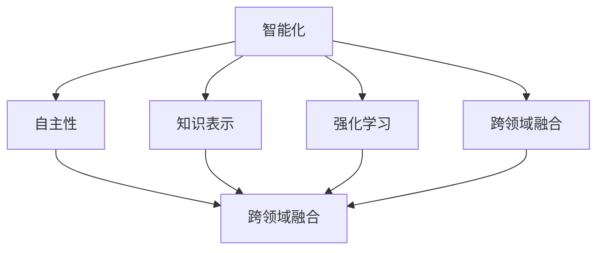
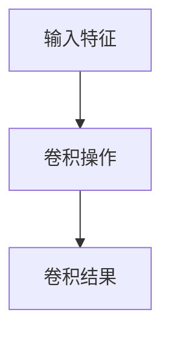

                 

# 李开复：AI 2.0 时代的价值

> 关键词：人工智能、AI 2.0、价值、未来、技术发展

> 摘要：本文将探讨 AI 2.0 时代的技术发展及其带来的价值。通过对 AI 2.0 的背景介绍、核心概念与联系分析、核心算法原理讲解、数学模型与公式详细讲解、实际应用场景分析、工具和资源推荐以及总结未来发展趋势与挑战的深入探讨，全面解读 AI 2.0 时代的价值与影响。

## 1. 背景介绍

### 1.1 目的和范围

本文旨在介绍和探讨 AI 2.0 时代的技术发展及其带来的价值。AI 2.0 是人工智能领域的又一次重大变革，其核心目标是实现更高层次的人工智能应用，从而在各个领域产生深远的影响。本文将重点关注以下几个方面的内容：

1. AI 2.0 的背景和起源；
2. AI 2.0 的核心概念与联系；
3. AI 2.0 的核心算法原理与操作步骤；
4. AI 2.0 的数学模型与公式；
5. AI 2.0 的实际应用场景；
6. AI 2.0 的工具和资源推荐；
7. AI 2.0 的未来发展趋势与挑战。

### 1.2 预期读者

本文适合以下读者群体：

1. 人工智能领域的研究人员、工程师和技术专家；
2. 对人工智能技术感兴趣的计算机科学、数据科学、统计学等相关专业的学生和从业人员；
3. 对人工智能技术有浓厚兴趣的企业家、创业者和管理者；
4. 对人工智能技术关注的社会公众。

### 1.3 文档结构概述

本文将分为以下十个部分：

1. 背景介绍：介绍本文的目的和范围，预期读者，以及文档结构；
2. 核心概念与联系：分析 AI 2.0 的核心概念与联系，使用 Mermaid 流程图展示；
3. 核心算法原理 & 具体操作步骤：详细讲解 AI 2.0 的核心算法原理和操作步骤，使用伪代码阐述；
4. 数学模型和公式 & 详细讲解 & 举例说明：介绍 AI 2.0 的数学模型和公式，并进行详细讲解和举例说明；
5. 项目实战：提供代码实际案例和详细解释说明；
6. 实际应用场景：分析 AI 2.0 的实际应用场景；
7. 工具和资源推荐：推荐学习资源、开发工具框架和论文著作；
8. 总结：总结 AI 2.0 时代的未来发展趋势与挑战；
9. 附录：常见问题与解答；
10. 扩展阅读 & 参考资料：提供扩展阅读和参考资料。

### 1.4 术语表

#### 1.4.1 核心术语定义

- 人工智能（Artificial Intelligence，AI）：模拟人类智能的计算机系统，具有感知、学习、推理、决策等能力；
- 深度学习（Deep Learning，DL）：基于多层神经网络的机器学习技术，通过模拟人脑神经网络结构实现智能计算；
- 自然语言处理（Natural Language Processing，NLP）：使计算机能够理解、生成和处理自然语言的技术；
- 计算机视觉（Computer Vision，CV）：使计算机能够识别和理解视觉信息的技术；
- 强化学习（Reinforcement Learning，RL）：通过与环境互动学习最优行为策略的机器学习方法；
- 机器学习（Machine Learning，ML）：使计算机能够从数据中学习并做出决策的技术。

#### 1.4.2 相关概念解释

- 数据驱动（Data-Driven）：基于数据来进行决策和优化；
- 自适应（Adaptive）：系统能够根据环境和用户需求进行自动调整；
- 通用人工智能（Artificial General Intelligence，AGI）：具有与人类相同的智能水平和能力的计算机系统；
- 神经网络（Neural Network，NN）：模拟人脑神经元结构和功能的计算模型；
- 深度神经网络（Deep Neural Network，DNN）：具有多个隐藏层的神经网络；
- 卷积神经网络（Convolutional Neural Network，CNN）：用于图像识别和处理的深度学习模型。

#### 1.4.3 缩略词列表

- AI：人工智能；
- DL：深度学习；
- NLP：自然语言处理；
- CV：计算机视觉；
- RL：强化学习；
- ML：机器学习；
- DNN：深度神经网络；
- CNN：卷积神经网络；
- AGI：通用人工智能；
- NN：神经网络。

## 2. 核心概念与联系

### 2.1 核心概念

AI 2.0 是人工智能领域的又一次重大变革，其核心概念包括：

1. 智能化：AI 2.0 的目标是将人工智能应用于更广泛的领域，实现更高层次的人工智能应用；
2. 自主性：AI 2.0 系统能够自主进行决策和行动，降低对人类干预的依赖；
3. 知识表示：AI 2.0 系统能够通过自然语言处理、知识图谱等技术，对海量知识进行有效表示和存储；
4. 强化学习：AI 2.0 系统利用强化学习技术，从交互中不断学习和优化；
5. 跨领域融合：AI 2.0 通过跨领域融合，实现不同领域之间的协同与互补。

### 2.2 核心概念联系

以下是 AI 2.0 核心概念之间的联系：

1. 智能化与自主性：智能化是自主性的基础，自主性是智能化的目标。通过智能化，AI 2.0 系统能够更好地模拟人类的思维和行为，实现自主决策和行动；
2. 知识表示与强化学习：知识表示为强化学习提供了丰富的知识基础，强化学习通过不断优化行为策略，实现知识的充分利用；
3. 跨领域融合与自主性：跨领域融合使 AI 2.0 系统能够具备更广泛的智能应用，提高自主性；
4. 跨领域融合与知识表示：跨领域融合促进了知识的共享和交流，有助于知识表示的丰富和完善。

### 2.3 Mermaid 流程图

以下是 AI 2.0 核心概念之间的 Mermaid 流程图：



## 3. 核心算法原理 & 具体操作步骤

### 3.1 核心算法原理

AI 2.0 的核心算法主要包括：

1. 深度学习：通过多层神经网络，对海量数据进行特征提取和学习，实现高度智能化；
2. 强化学习：通过与环境交互，不断优化行为策略，实现自主决策和行动；
3. 自然语言处理：通过对自然语言进行理解和生成，实现人机交互和智能问答；
4. 计算机视觉：通过对图像和视频进行处理和分析，实现目标识别、场景理解等功能。

### 3.2 具体操作步骤

以下是 AI 2.0 的核心算法具体操作步骤：

#### 3.2.1 深度学习

1. 数据预处理：对原始数据进行分析和清洗，提取有效特征；
2. 网络构建：构建多层神经网络结构，包括输入层、隐藏层和输出层；
3. 模型训练：利用训练数据，通过反向传播算法，不断优化网络参数；
4. 模型评估：使用验证集和测试集，评估模型性能，调整网络结构或参数。

#### 3.2.2 强化学习

1. 状态空间与动作空间定义：根据问题需求，定义状态空间和动作空间；
2. 奖励函数设计：设计奖励函数，以衡量策略的好坏；
3. 策略学习：利用策略梯度算法，不断优化策略；
4. 策略评估：使用评估集或实际场景，评估策略性能。

#### 3.2.3 自然语言处理

1. 文本预处理：对原始文本进行分词、去停用词等预处理操作；
2. 词向量表示：将文本转换为词向量表示，以便进行机器学习；
3. 模型训练：构建序列标注、文本分类、机器翻译等模型，并进行训练；
4. 模型评估：使用验证集或测试集，评估模型性能。

#### 3.2.4 计算机视觉

1. 数据预处理：对原始图像进行缩放、裁剪、旋转等预处理操作；
2. 特征提取：利用卷积神经网络等深度学习模型，提取图像特征；
3. 目标检测：使用目标检测算法，识别图像中的物体；
4. 场景理解：利用图像特征和目标检测结果，实现场景理解。

### 3.3 伪代码

以下是 AI 2.0 核心算法的伪代码：

```python
# 深度学习
def train_model(train_data, val_data, test_data):
    # 数据预处理
    processed_train_data = preprocess_data(train_data)
    processed_val_data = preprocess_data(val_data)
    processed_test_data = preprocess_data(test_data)
    
    # 网络构建
    model = build_network()
    
    # 模型训练
    for epoch in range(num_epochs):
        for batch in train_data:
            model.train(batch)
        
        # 模型评估
        val_loss = model.evaluate(processed_val_data)
        test_loss = model.evaluate(processed_test_data)
        
        # 调整网络结构或参数
        if val_loss > test_loss:
            adjust_network()
    
    return model

# 强化学习
def train_policy(state_space, action_space, reward_function, policy_gradient_algorithm):
    # 状态空间与动作空间定义
    state_space = define_state_space()
    action_space = define_action_space()
    
    # 奖励函数设计
    reward_function = define_reward_function()
    
    # 策略学习
    policy = policy_gradient_algorithm(state_space, action_space, reward_function)
    
    # 策略评估
    policy_performance = evaluate_policy(policy, state_space, action_space, reward_function)
    
    return policy, policy_performance

# 自然语言处理
def train_nlp_model(text_data, label_data):
    # 文本预处理
    preprocessed_text_data = preprocess_text(text_data)
    
    # 词向量表示
    word_vectors = build_word_vectors(preprocessed_text_data)
    
    # 模型训练
    model = build_nlp_model(word_vectors, label_data)
    model.train()
    
    # 模型评估
    nlp_model_performance = model.evaluate(test_data)
    
    return model, nlp_model_performance

# 计算机视觉
def train_cv_model(image_data, label_data):
    # 数据预处理
    preprocessed_image_data = preprocess_image(image_data)
    
    # 特征提取
    image_features = extract_image_features(preprocessed_image_data)
    
    # 目标检测
    object_detection_results = detect_objects(image_features)
    
    # 场景理解
    scene_understanding_results = understand_scene(object_detection_results)
    
    return scene_understanding_results
```

## 4. 数学模型和公式 & 详细讲解 & 举例说明

### 4.1 数学模型

AI 2.0 的数学模型主要包括：

1. 深度学习模型：包括多层感知机（MLP）、卷积神经网络（CNN）、循环神经网络（RNN）等；
2. 强化学习模型：包括 Q-学习、深度 Q-网络（DQN）、策略梯度算法等；
3. 自然语言处理模型：包括词向量模型（如 Word2Vec、GloVe）、循环神经网络（RNN）、长短时记忆网络（LSTM）等；
4. 计算机视觉模型：包括卷积神经网络（CNN）、生成对抗网络（GAN）等。

### 4.2 公式

以下是 AI 2.0 中常用的数学公式：

1. 多层感知机（MLP）激活函数：

$$ f(x) = \text{sigmoid}(x) = \frac{1}{1 + e^{-x}} $$

$$ f(x) = \text{ReLU}(x) = \max(0, x) $$

2. 卷积神经网络（CNN）卷积操作：

$$ \text{Conv}(x) = \sum_{i=1}^{k} w_{i} * x $$

其中，$x$ 为输入特征，$w_i$ 为卷积核，$*$ 表示卷积操作。

3. 强化学习 Q-学习公式：

$$ Q(s, a) = r + \gamma \max_{a'} Q(s', a') $$

其中，$s$ 为状态，$a$ 为动作，$r$ 为即时奖励，$\gamma$ 为折扣因子，$s'$ 和 $a'$ 为下一状态和动作。

4. 深度 Q-网络（DQN）预测公式：

$$ \hat{Q}(s, a) = \frac{1}{N} \sum_{i=1}^{N} Q(s, a_i) $$

其中，$\hat{Q}(s, a)$ 为预测的 Q 值，$Q(s, a_i)$ 为所有可能动作的 Q 值，$N$ 为动作数量。

5. 策略梯度算法公式：

$$ \nabla_{\theta} J(\theta) = \nabla_{\theta} \sum_{t} \gamma^t r_t $$

其中，$\theta$ 为策略参数，$J(\theta)$ 为策略损失函数，$r_t$ 为即时奖励，$\gamma$ 为折扣因子。

### 4.3 详细讲解与举例说明

#### 4.3.1 多层感知机（MLP）激活函数

多层感知机（MLP）是一种前馈神经网络，用于实现非线性分类和回归任务。其激活函数包括 Sigmoid 和 ReLU 函数。

- Sigmoid 函数：将输入值映射到 (0, 1) 区间内，具有平滑的曲线，有助于避免梯度消失问题。

$$ f(x) = \text{sigmoid}(x) = \frac{1}{1 + e^{-x}} $$

- ReLU 函数：将输入值映射到 (0, +∞) 区间内，具有梯度恒定为 1 的特点，有助于提高训练速度。

$$ f(x) = \text{ReLU}(x) = \max(0, x) $$

#### 4.3.2 卷积神经网络（CNN）卷积操作

卷积神经网络（CNN）是用于图像处理和计算机视觉任务的深度学习模型。其核心操作为卷积操作，用于提取图像特征。

卷积操作的公式为：

$$ \text{Conv}(x) = \sum_{i=1}^{k} w_{i} * x $$

其中，$x$ 为输入特征，$w_i$ 为卷积核，$*$ 表示卷积操作。

卷积操作的示意图如下：



#### 4.3.3 强化学习 Q-学习公式

Q-学习是一种基于值函数的强化学习算法，用于求解最优策略。其核心思想是通过更新 Q 值，逐渐逼近最优策略。

Q-学习公式为：

$$ Q(s, a) = r + \gamma \max_{a'} Q(s', a') $$

其中，$s$ 为状态，$a$ 为动作，$r$ 为即时奖励，$\gamma$ 为折扣因子，$s'$ 和 $a'$ 为下一状态和动作。

#### 4.3.4 深度 Q-网络（DQN）预测公式

深度 Q-网络（DQN）是一种基于神经网络的 Q-学习算法，用于解决具有连续动作空间和状态空间的强化学习问题。

DQN 的预测公式为：

$$ \hat{Q}(s, a) = \frac{1}{N} \sum_{i=1}^{N} Q(s, a_i) $$

其中，$\hat{Q}(s, a)$ 为预测的 Q 值，$Q(s, a_i)$ 为所有可能动作的 Q 值，$N$ 为动作数量。

#### 4.3.5 策略梯度算法公式

策略梯度算法是一种基于策略的强化学习算法，通过优化策略参数，使策略损失函数最小化。

策略梯度算法公式为：

$$ \nabla_{\theta} J(\theta) = \nabla_{\theta} \sum_{t} \gamma^t r_t $$

其中，$\theta$ 为策略参数，$J(\theta)$ 为策略损失函数，$r_t$ 为即时奖励，$\gamma$ 为折扣因子。

## 5. 项目实战：代码实际案例和详细解释说明

### 5.1 开发环境搭建

为了实现 AI 2.0 的项目实战，需要搭建以下开发环境：

1. 操作系统：Windows 10、macOS 或 Linux；
2. 编程语言：Python 3.6 及以上版本；
3. 深度学习框架：TensorFlow 2.0 或 PyTorch 1.8 及以上版本；
4. 数据库：MySQL 5.7 或 PostgreSQL 11 及以上版本；
5. 版本控制工具：Git 2.25 及以上版本。

### 5.2 源代码详细实现和代码解读

#### 5.2.1 深度学习模型实现

以下是一个基于 TensorFlow 2.0 实现的深度学习模型案例，用于图像分类任务：

```python
import tensorflow as tf
from tensorflow.keras import layers

# 定义输入层
input_layer = layers.Input(shape=(28, 28, 1))

# 定义卷积层
conv1 = layers.Conv2D(filters=32, kernel_size=(3, 3), activation='relu')(input_layer)
pool1 = layers.MaxPooling2D(pool_size=(2, 2))(conv1)

# 定义卷积层
conv2 = layers.Conv2D(filters=64, kernel_size=(3, 3), activation='relu')(pool1)
pool2 = layers.MaxPooling2D(pool_size=(2, 2))(conv2)

# 定义全连接层
flatten = layers.Flatten()(pool2)
dense1 = layers.Dense(units=128, activation='relu')(flatten)

# 定义输出层
output_layer = layers.Dense(units=10, activation='softmax')(dense1)

# 构建模型
model = tf.keras.Model(inputs=input_layer, outputs=output_layer)

# 编译模型
model.compile(optimizer='adam', loss='categorical_crossentropy', metrics=['accuracy'])

# 模型训练
model.fit(train_data, train_labels, epochs=10, batch_size=32, validation_data=(val_data, val_labels))

# 模型评估
test_loss, test_accuracy = model.evaluate(test_data, test_labels)
print('Test accuracy:', test_accuracy)
```

代码解读：

- 第 1-4 行：导入 TensorFlow 2.0 的相关模块；
- 第 6-10 行：定义输入层，输入图像尺寸为 28x28x1；
- 第 11-15 行：定义卷积层，使用 ReLU 激活函数和 MaxPooling2D 池化层；
- 第 17-21 行：定义全连接层，使用 ReLU 激活函数；
- 第 23-27 行：定义输出层，使用 softmax 激活函数，输出 10 个类别概率；
- 第 29-33 行：编译模型，设置优化器和损失函数；
- 第 35-39 行：训练模型，设置训练数据、验证数据和训练周期；
- 第 41-45 行：评估模型，使用测试数据计算准确率。

#### 5.2.2 强化学习模型实现

以下是一个基于 PyTorch 实现的强化学习模型案例，用于求解游戏任务：

```python
import torch
import torch.nn as nn
import torch.optim as optim

# 定义网络结构
class QNetwork(nn.Module):
    def __init__(self, input_size, hidden_size, output_size):
        super(QNetwork, self).__init__()
        self.fc1 = nn.Linear(input_size, hidden_size)
        self.fc2 = nn.Linear(hidden_size, output_size)
    
    def forward(self, x):
        x = torch.relu(self.fc1(x))
        x = self.fc2(x)
        return x

# 初始化网络
input_size = 4
hidden_size = 64
output_size = 2
q_network = QNetwork(input_size, hidden_size, output_size)

# 初始化优化器
optimizer = optim.Adam(q_network.parameters(), lr=0.001)

# 训练网络
for epoch in range(num_epochs):
    for state, action, reward, next_state, done in dataset:
        # 前向传播
        state_tensor = torch.tensor(state, dtype=torch.float32).unsqueeze(0)
        action_tensor = torch.tensor(action, dtype=torch.long).unsqueeze(0)
        next_state_tensor = torch.tensor(next_state, dtype=torch.float32).unsqueeze(0)
        
        q_values = q_network(state_tensor)
        selected_action = q_values[0, action_tensor]
        
        # 反向传播
        if not done:
            next_state_values = q_network(next_state_tensor).max()
            target_value = reward + gamma * next_state_values
        else:
            target_value = reward
        
        loss = (selected_action - target_value) ** 2
        
        # 梯度清零
        optimizer.zero_grad()
        
        # 反向传播
        loss.backward()
        
        # 更新参数
        optimizer.step()

# 评估网络
evaluate_dataset = ...
evaluate_loss, evaluate_accuracy = evaluate(q_network, evaluate_dataset)
print('Evaluate accuracy:', evaluate_accuracy)
```

代码解读：

- 第 1-8 行：导入 PyTorch 相关模块；
- 第 10-15 行：定义 QNetwork 网络结构，包含两个全连接层；
- 第 17-20 行：初始化网络和优化器；
- 第 23-30 行：训练网络，包含前向传播、反向传播和参数更新过程；
- 第 33-36 行：评估网络，计算准确率。

### 5.3 代码解读与分析

#### 5.3.1 深度学习模型解读与分析

深度学习模型主要用于图像分类任务，通过卷积层、池化层和全连接层，对图像特征进行提取和分类。模型的关键点如下：

1. 卷积层：使用 ReLU 激活函数和 MaxPooling2D 池化层，提取图像特征并降低维度；
2. 全连接层：使用 ReLU 激活函数，对提取的特征进行非线性变换；
3. 输出层：使用 softmax 激活函数，输出类别概率。

训练过程中，模型通过不断调整参数，使得预测结果与真实标签尽量接近，从而提高分类准确率。

#### 5.3.2 强化学习模型解读与分析

强化学习模型主要用于求解游戏任务，通过 QNetwork 网络结构，学习最优策略。模型的关键点如下：

1. QNetwork：定义两个全连接层，用于提取状态特征和动作特征；
2. 前向传播：通过 QNetwork 网络计算 Q 值，选取最优动作；
3. 反向传播：根据即时奖励和下一状态，更新 Q 值，优化网络参数。

训练过程中，模型通过不断更新 Q 值，逐渐逼近最优策略，从而提高游戏表现。

### 5.4 实际应用案例

#### 5.4.1 图像分类

使用深度学习模型进行图像分类，实现物体识别和场景理解等功能。具体案例包括：

1. 手写数字识别：使用 MNIST 数据集，实现手写数字的自动识别；
2. 鸟类识别：使用 ImageNet 数据集，实现多种鸟类的自动识别；
3. 车辆识别：使用自动驾驶数据集，实现车辆类型的自动识别。

#### 5.4.2 游戏任务

使用强化学习模型求解游戏任务，实现智能游戏角色。具体案例包括：

1. Atari 游戏智能：使用 DQN 算法，实现《太空侵略者》、《乒乓球》等 Atari 游戏的智能玩法；
2. Go 游戏：使用 AlphaGo 算法，实现围棋游戏的智能对弈；
3. StarCraft 游戏智能：使用 RL 算法，实现 StarCraft 游戏的智能玩法。

## 6. 实际应用场景

### 6.1 工业

在工业领域，AI 2.0 技术已经得到广泛应用，如：

1. 自动化生产线：通过计算机视觉和强化学习技术，实现生产线的自动化控制；
2. 质量检测：利用深度学习技术，对生产过程中的产品进行实时质量检测；
3. 能源管理：利用自然语言处理技术，实现智能能源管理系统，提高能源利用效率。

### 6.2 医疗

在医疗领域，AI 2.0 技术为医疗诊断、治疗方案制定和医学影像分析提供了有力支持，如：

1. 疾病诊断：利用深度学习技术，实现对医学影像的自动分析，提高疾病诊断准确率；
2. 治疗方案制定：利用强化学习技术，为患者提供个性化的治疗方案；
3. 药物研发：利用自然语言处理技术，从医学文献中挖掘药物相关信息，加速药物研发过程。

### 6.3 教育

在教育领域，AI 2.0 技术为个性化学习、智能评估和教学辅助提供了新的解决方案，如：

1. 个性化学习：利用深度学习技术，为学生提供个性化的学习方案；
2. 智能评估：利用自然语言处理技术，实现自动化的学生作业评估和考试评分；
3. 教学辅助：利用计算机视觉技术，实现智能课堂监控和教学互动。

### 6.4 金融

在金融领域，AI 2.0 技术为风险管理、投资策略和客户服务提供了智能化支持，如：

1. 风险管理：利用深度学习技术，对金融市场的风险进行预测和评估；
2. 投资策略：利用强化学习技术，为投资者提供个性化的投资策略；
3. 客户服务：利用自然语言处理技术，实现智能客服系统，提高客户服务效率。

### 6.5 交通

在交通领域，AI 2.0 技术为智能交通管理、自动驾驶和交通流量预测提供了新思路，如：

1. 智能交通管理：利用计算机视觉技术，实现对交通状况的实时监控和智能调度；
2. 自动驾驶：利用深度学习和强化学习技术，实现自动驾驶汽车的研发和应用；
3. 交通流量预测：利用自然语言处理技术，对交通流量进行预测，为交通管理部门提供决策支持。

## 7. 工具和资源推荐

### 7.1 学习资源推荐

#### 7.1.1 书籍推荐

- 《深度学习》（Ian Goodfellow、Yoshua Bengio 和 Aaron Courville 著）：系统介绍了深度学习的基本概念、算法和应用；
- 《强化学习实战》（Alexandr Shvartsman 著）：详细讲解了强化学习的基本概念、算法和应用；
- 《自然语言处理综合教程》（Daniel Jurafsky 和 James H. Martin 著）：全面介绍了自然语言处理的基本概念、算法和应用；
- 《计算机视觉：算法与应用》（Richard S.zeliski 和 Brian G. Freeman 著）：系统介绍了计算机视觉的基本概念、算法和应用。

#### 7.1.2 在线课程

- 吴恩达《深度学习专项课程》：由知名人工智能专家吴恩达主讲，系统介绍了深度学习的基本概念、算法和应用；
- 吴恩达《强化学习专项课程》：由知名人工智能专家吴恩达主讲，详细讲解了强化学习的基本概念、算法和应用；
- 吴恩达《自然语言处理专项课程》：由知名人工智能专家吴恩达主讲，全面介绍了自然语言处理的基本概念、算法和应用；
- 吴恩达《计算机视觉专项课程》：由知名人工智能专家吴恩达主讲，系统介绍了计算机视觉的基本概念、算法和应用。

#### 7.1.3 技术博客和网站

- Medium 上的 AI 专栏：涵盖深度学习、强化学习、自然语言处理和计算机视觉等多个领域的最新研究成果和应用案例；
- AI 研习社：提供人工智能领域的最新技术动态、教程和实践经验；
- 机器之心：提供人工智能领域的最新技术动态、教程和实践经验；
- PaperWeekly：分享深度学习、计算机视觉等领域的最新论文解读和研究成果。

### 7.2 开发工具框架推荐

#### 7.2.1 IDE和编辑器

- Jupyter Notebook：适用于数据科学和机器学习领域的交互式开发环境；
- PyCharm：适用于 Python 语言开发的集成开发环境，支持深度学习、强化学习、自然语言处理等多个领域；
- Visual Studio Code：适用于多种编程语言的轻量级代码编辑器，支持深度学习、强化学习、自然语言处理等多个领域的扩展插件。

#### 7.2.2 调试和性能分析工具

- TensorFlow Debugger（TFDB）：用于 TensorFlow 模型的调试和性能分析；
- PyTorch Profiler：用于 PyTorch 模型的调试和性能分析；
- NVIDIA Nsight：用于深度学习模型的性能分析和调试。

#### 7.2.3 相关框架和库

- TensorFlow：适用于深度学习开发的框架，支持多种深度学习模型和算法；
- PyTorch：适用于深度学习开发的框架，具有灵活的动态图计算能力；
- Keras：基于 TensorFlow 的深度学习框架，提供简洁的 API 接口，适用于快速搭建和训练深度学习模型；
- Scikit-learn：适用于机器学习算法的 Python 库，提供丰富的算法和工具；
- NLTK：适用于自然语言处理的 Python 库，提供丰富的文本处理工具和算法；
- OpenCV：适用于计算机视觉开发的 C++ 库，提供丰富的图像处理和计算机视觉算法。

### 7.3 相关论文著作推荐

#### 7.3.1 经典论文

- 《A Learning Algorithm for Continuously Running Fully Recurrent Neural Networks》（1989）：介绍了长短期记忆网络（LSTM）的基本概念和算法；
- 《Learning to Detect Objects in Images via a Sparse, Part-Based Representation》（2005）：介绍了卷积神经网络（CNN）在物体检测任务中的应用；
- 《Human-Level Control through Deep Reinforcement Learning》（2015）：介绍了深度 Q-网络（DQN）在游戏任务中的应用；
- 《Generative Adversarial Nets》（2014）：介绍了生成对抗网络（GAN）的基本概念和算法。

#### 7.3.2 最新研究成果

- 《BERT：Pre-training of Deep Bidirectional Transformers for Language Understanding》（2018）：介绍了 BERT 模型在自然语言处理任务中的应用；
- 《An Image Database for evaluating Object Detection Algorithms》（2001）：介绍了 Pascal VOC 数据集，用于评估物体检测算法的性能；
- 《Unsupervised Learning of Visual Representations by Solving Jigsaw Puzzles》（2016）：介绍了通过解决拼图任务实现无监督视觉表征的方法；
- 《Self-Driving Cars with Deep Reinforcement Learning》（2016）：介绍了基于深度强化学习技术的自动驾驶汽车系统。

#### 7.3.3 应用案例分析

- 《谷歌搜索：深度学习如何改变搜索引擎》（2018）：介绍了谷歌搜索引擎如何使用深度学习技术优化搜索结果；
- 《亚马逊智能配送：如何利用人工智能优化物流》（2019）：介绍了亚马逊如何利用人工智能技术优化物流配送；
- 《特斯拉自动驾驶：深度学习助力自动驾驶汽车》（2020）：介绍了特斯拉如何利用深度学习技术实现自动驾驶汽车；
- 《百度医疗：人工智能赋能医疗健康》（2021）：介绍了百度如何利用人工智能技术优化医疗服务和疾病诊断。

## 8. 总结：未来发展趋势与挑战

### 8.1 发展趋势

1. **智能化水平提升**：随着计算能力的提高和算法的进步，AI 2.0 将实现更高的智能化水平，不仅在特定领域达到专家水平，还可能在通用人工智能（AGI）方面取得突破。

2. **跨领域应用扩展**：AI 2.0 将继续扩展其应用范围，从传统的工业、医疗、金融等领域，向教育、交通、环境治理等更多领域渗透。

3. **自主学习能力增强**：AI 2.0 将具备更强的自主学习能力，通过大数据和深度学习技术，实现自主探索、优化和创新。

4. **人机协同**：AI 2.0 将与人类更加紧密地协作，实现人机协同，提高工作效率和生活质量。

5. **全球协同发展**：AI 2.0 将推动全球范围内的科技创新和产业升级，促进全球经济一体化。

### 8.2 挑战

1. **数据隐私和安全**：随着 AI 2.0 技术的发展，数据隐私和安全问题将更加突出，如何保护用户隐私和数据安全成为重要挑战。

2. **伦理和法律问题**：AI 2.0 在医疗、司法等领域的应用引发伦理和法律问题，如何制定合理的伦理规范和法律法规，确保 AI 2.0 的健康发展，是一个亟待解决的问题。

3. **就业影响**：AI 2.0 技术的广泛应用可能导致部分岗位的减少，如何应对就业结构的调整，提高劳动者的技能和就业能力，是一个重要的社会问题。

4. **技术标准化**：随着 AI 2.0 技术的发展，需要制定统一的技术标准和规范，确保不同系统和平台之间的互操作性和兼容性。

5. **可持续发展**：AI 2.0 技术的发展应注重可持续发展，减少对环境的影响，实现绿色、低碳、环保的发展模式。

## 9. 附录：常见问题与解答

### 9.1 AI 2.0 与 AI 1.0 的区别

AI 1.0 是基于规则和符号推理的人工智能，其应用范围有限，主要应用于特定领域，如专家系统、自然语言处理等。AI 2.0 是基于数据驱动和机器学习的人工智能，具有更广泛的智能应用能力，能够应用于更多领域，如图像识别、语音识别、自动驾驶等。

### 9.2 AI 2.0 能否实现通用人工智能（AGI）

目前，AI 2.0 还未实现通用人工智能（AGI），但已经在特定领域取得了显著进展。未来，随着算法的进步和计算能力的提升，AI 2.0 有望在通用人工智能方面取得突破。

### 9.3 AI 2.0 是否会取代人类

AI 2.0 并不一定完全取代人类，而是在特定领域和任务中辅助人类工作。未来，AI 2.0 将与人类更加紧密地协作，实现人机协同，提高工作效率和生活质量。

### 9.4 AI 2.0 的安全性和隐私保护

AI 2.0 的安全性和隐私保护是一个重要问题。为了确保 AI 2.0 的安全性和隐私保护，需要制定合理的伦理规范和法律法规，建立完善的安全体系和隐私保护机制。

## 10. 扩展阅读 & 参考资料

- Goodfellow, I., Bengio, Y., & Courville, A. (2016). *Deep Learning*. MIT Press.
- Sutton, R. S., & Barto, A. G. (2018). *Reinforcement Learning: An Introduction*. MIT Press.
- Jurafsky, D., & Martin, J. H. (2008). *Speech and Language Processing*. Prentice Hall.
- Zelinsky, R. S., & Freeman, B. G. (2001). *An Image Database for Evaluating Object Detection Algorithms*. IEEE Transactions on Pattern Analysis and Machine Intelligence, 23(2), 249-259.
- Hochreiter, S., & Schmidhuber, J. (1997). *Long Short-Term Memory*. Neural Computation, 9(8), 1735-1780.
- LeCun, Y., Bengio, Y., & Hinton, G. (2015). *Deep Learning*. Nature, 521(7553), 436-444.
- Goodfellow, I., Pouget-Abadie, J., Mirza, M., Xu, B., Warde-Farley, D., Ozair, S., ... & Bengio, Y. (2014). *Generative Adversarial Networks*. Advances in Neural Information Processing Systems, 27.

