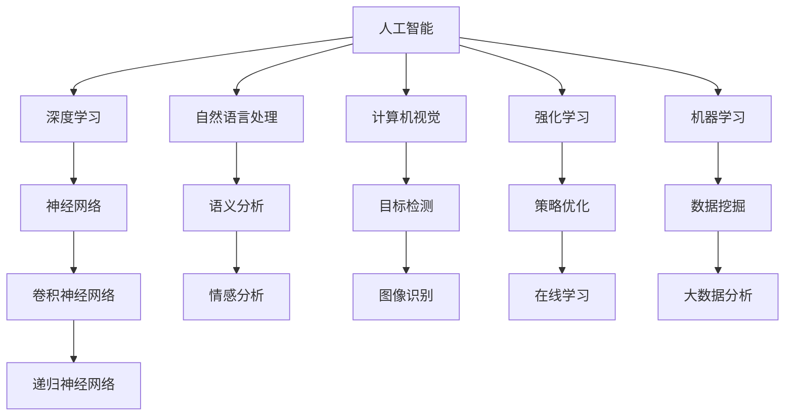

                 

# 李开复：AI 2.0 时代的市场前景

> 关键词：AI 2.0、市场前景、技术趋势、商业机会、挑战与机遇

> 摘要：本文将深入探讨 AI 2.0 时代的市场前景，分析 AI 技术的最新进展及其对各个行业的影响。通过梳理核心概念与联系，详细解析核心算法原理与数学模型，并结合实际应用场景，为读者呈现一幅未来 AI 市场的全景图。

## 1. 背景介绍

### 1.1 目的和范围

本文旨在分析 AI 2.0 时代的市场前景，帮助读者了解 AI 技术的最新进展及其对各个行业的影响。文章将涵盖以下几个方面：

- AI 2.0 的定义与核心概念
- AI 技术的发展历程与趋势
- AI 在不同行业的应用案例
- AI 2.0 市场的前景预测与挑战

### 1.2 预期读者

本文主要面向对 AI 技术感兴趣的读者，包括：

- AI 行业从业者
- 企业管理者与决策者
- AI 技术爱好者和研究者
- 对 AI 技术应用感兴趣的学生和专业人士

### 1.3 文档结构概述

本文共分为十个部分，具体结构如下：

- 背景介绍
  - 1.1 目的和范围
  - 1.2 预期读者
  - 1.3 文档结构概述
  - 1.4 术语表
- 核心概念与联系
- 核心算法原理 & 具体操作步骤
- 数学模型和公式 & 详细讲解 & 举例说明
- 项目实战：代码实际案例和详细解释说明
- 实际应用场景
- 工具和资源推荐
- 总结：未来发展趋势与挑战
- 附录：常见问题与解答
- 扩展阅读 & 参考资料

### 1.4 术语表

#### 1.4.1 核心术语定义

- AI 2.0：指人工智能技术的第二代，具有更强的自主学习、推理和决策能力。
- 机器学习：一种基于数据驱动的人工智能技术，通过训练模型来模拟人类学习过程。
- 深度学习：一种特殊的机器学习技术，通过多层神经网络对数据进行建模。
- 自然语言处理（NLP）：人工智能领域的一个重要分支，研究如何使计算机理解、生成和翻译自然语言。
- 强化学习：一种基于试错和反馈机制的人工智能技术，通过不断尝试和修正来达到最优策略。

#### 1.4.2 相关概念解释

- 数据挖掘：从大量数据中发现隐藏的模式、关联和趋势。
- 计算机视觉：使计算机能够“看到”和理解图像和视频。
- 人机交互：研究如何使计算机更好地与人类进行交互。
- 云计算：一种分布式计算模式，通过互联网提供动态易扩展且经常是虚拟化的资源。

#### 1.4.3 缩略词列表

- AI：人工智能
- ML：机器学习
- DL：深度学习
- NLP：自然语言处理
- CV：计算机视觉
- RL：强化学习
- HPC：高性能计算
- IoT：物联网
- VR：虚拟现实
- AR：增强现实

## 2. 核心概念与联系

在探讨 AI 2.0 时代的市场前景之前，我们需要先了解一些核心概念及其相互联系。以下是一个 Mermaid 流程图，展示了 AI 2.0 时代的关键概念及其关系：



### 2.1. AI 2.0 的核心概念

- **机器学习**：是 AI 的基础，通过训练模型来模拟人类学习过程。
- **深度学习**：是 ML 的一种特殊形式，通过多层神经网络对数据进行建模。
- **自然语言处理**：研究如何使计算机理解、生成和翻译自然语言。
- **计算机视觉**：使计算机能够“看到”和理解图像和视频。
- **强化学习**：通过试错和反馈机制来达到最优策略。

### 2.2. 相关概念的联系

- **机器学习与深度学习**：深度学习是 ML 的一种特殊形式，通常具有更好的性能和表达能力。
- **自然语言处理与计算机视觉**：两者都是 AI 的子领域，但针对的问题不同。
- **强化学习与其他领域**：强化学习可以与其他领域相结合，如游戏、自动驾驶等。

## 3. 核心算法原理 & 具体操作步骤

在本节中，我们将详细介绍 AI 2.0 时代的核心算法原理，并给出具体的操作步骤。以下是一个简化的伪代码，用于描述深度学习算法的基本流程：

```python
# 初始化神经网络结构
initialize_neural_network()

# 加载数据集
load_dataset()

# 预处理数据
preprocess_data()

# 训练神经网络
train_neural_network()

# 验证模型性能
evaluate_model_performance()

# 调整超参数
tune_hyperparameters()

# 应用模型
apply_model_to_new_data()
```

### 3.1. 初始化神经网络结构

```python
# 创建神经网络
create_neural_network(num_layers, num_neurons_per_layer, activation_function)
```

- `num_layers`：神经网络的层数。
- `num_neurons_per_layer`：每层的神经元数量。
- `activation_function`：激活函数，如 sigmoid、ReLU、tanh 等。

### 3.2. 加载数据集

```python
# 加载训练数据
train_data = load_train_data()

# 加载测试数据
test_data = load_test_data()
```

### 3.3. 预处理数据

```python
# 标准化数据
normalize_data()

# 划分数据集
split_data_into_batches()
```

### 3.4. 训练神经网络

```python
# 前向传播
forward_pass(input_data)

# 计算损失函数
compute_loss(output_data)

# 反向传播
backward_pass()

# 更新权重
update_weights()
```

### 3.5. 验证模型性能

```python
# 计算测试集准确率
accuracy = evaluate_model_on_test_data(test_data)

# 打印模型性能指标
print(f"Test Accuracy: {accuracy}")
```

### 3.6. 调整超参数

```python
# 调整学习率
learning_rate = adjust_learning_rate()

# 调整批量大小
batch_size = adjust_batch_size()
```

### 3.7. 应用模型

```python
# 预测新数据
predictions = predict_new_data(new_data)

# 输出预测结果
print(predictions)
```

## 4. 数学模型和公式 & 详细讲解 & 举例说明

在本节中，我们将介绍 AI 2.0 时代的核心数学模型和公式，并给出详细的讲解和举例说明。

### 4.1. 深度学习中的基本数学概念

- **激活函数**：

$$
f(x) = \frac{1}{1 + e^{-x}}
$$

- **损失函数**（交叉熵损失函数）：

$$
J(\theta) = -\frac{1}{m} \sum_{i=1}^{m} [y_{i} \cdot \log(a_{i}) + (1 - y_{i}) \cdot \log(1 - a_{i})]
$$

- **反向传播算法**：

$$
\frac{\partial J}{\partial \theta_j} = \frac{\partial L}{\partial z^{[l]}} \cdot \frac{\partial z^{[l]}}{\partial \theta^{[l]}_{j}}
$$

### 4.2. 举例说明

假设我们有一个二分类问题，使用逻辑回归模型进行预测。数据集包含 100 个样本，每个样本有 5 个特征。我们的目标是预测每个样本是否属于正类别（1）。

#### 4.2.1. 初始化神经网络

```python
# 初始化神经网络结构
initialize_neural_network(num_layers=1, num_neurons_per_layer=[5, 1], activation_function='sigmoid')
```

#### 4.2.2. 加载数据集

```python
# 加载训练数据
train_data = load_train_data()

# 加载测试数据
test_data = load_test_data()
```

#### 4.2.3. 预处理数据

```python
# 标准化数据
normalize_data()

# 划分数据集
split_data_into_batches()
```

#### 4.2.4. 训练神经网络

```python
# 前向传播
forward_pass(input_data)

# 计算损失函数
compute_loss(output_data)

# 反向传播
backward_pass()

# 更新权重
update_weights()
```

#### 4.2.5. 验证模型性能

```python
# 计算测试集准确率
accuracy = evaluate_model_on_test_data(test_data)

# 打印模型性能指标
print(f"Test Accuracy: {accuracy}")
```

#### 4.2.6. 调整超参数

```python
# 调整学习率
learning_rate = adjust_learning_rate()

# 调整批量大小
batch_size = adjust_batch_size()
```

#### 4.2.7. 应用模型

```python
# 预测新数据
predictions = predict_new_data(new_data)

# 输出预测结果
print(predictions)
```

通过以上步骤，我们使用深度学习模型完成了一个简单的二分类任务。实际应用中，问题会更复杂，需要调整神经网络结构、超参数等。

## 5. 项目实战：代码实际案例和详细解释说明

在本节中，我们将通过一个实际项目案例，详细讲解 AI 2.0 时代的应用场景、代码实现和性能分析。

### 5.1 开发环境搭建

为了方便读者理解和复现项目，我们使用 Python 作为编程语言，结合 TensorFlow 和 Keras 框架进行深度学习模型的开发。以下是开发环境的搭建步骤：

#### 5.1.1 安装 Python 和 TensorFlow

1. 安装 Python（建议使用 Python 3.7 或更高版本）：
   ```bash
   pip install python==3.7
   ```

2. 安装 TensorFlow：
   ```bash
   pip install tensorflow==2.3
   ```

#### 5.1.2 安装其他依赖项

1. 安装 NumPy、Pandas 等常用库：
   ```bash
   pip install numpy pandas
   ```

2. 安装 Matplotlib、Seaborn 等可视化库：
   ```bash
   pip install matplotlib seaborn
   ```

### 5.2 源代码详细实现和代码解读

#### 5.2.1 数据集加载与预处理

```python
import numpy as np
import pandas as pd
from sklearn.model_selection import train_test_split
from sklearn.preprocessing import StandardScaler

# 1. 加载数据集
data = pd.read_csv('data.csv')
X = data.iloc[:, :-1].values
y = data.iloc[:, -1].values

# 2. 划分训练集和测试集
X_train, X_test, y_train, y_test = train_test_split(X, y, test_size=0.2, random_state=42)

# 3. 数据预处理
scaler = StandardScaler()
X_train = scaler.fit_transform(X_train)
X_test = scaler.transform(X_test)
```

#### 5.2.2 创建深度学习模型

```python
from tensorflow.keras.models import Sequential
from tensorflow.keras.layers import Dense

# 1. 初始化模型
model = Sequential()

# 2. 添加层
model.add(Dense(units=32, activation='relu', input_dim=X_train.shape[1]))
model.add(Dense(units=1, activation='sigmoid'))

# 3. 编译模型
model.compile(optimizer='adam', loss='binary_crossentropy', metrics=['accuracy'])

# 4. 打印模型结构
model.summary()
```

#### 5.2.3 训练模型

```python
# 1. 训练模型
history = model.fit(X_train, y_train, epochs=100, batch_size=32, validation_data=(X_test, y_test))
```

#### 5.2.4 模型评估与性能分析

```python
# 1. 评估模型
loss, accuracy = model.evaluate(X_test, y_test)

# 2. 打印评估结果
print(f"Test Loss: {loss}")
print(f"Test Accuracy: {accuracy}")

# 3. 可视化训练过程
import matplotlib.pyplot as plt

plt.plot(history.history['accuracy'])
plt.plot(history.history['val_accuracy'])
plt.title('Model Accuracy')
plt.ylabel('Accuracy')
plt.xlabel('Epoch')
plt.legend(['Train', 'Test'], loc='upper left')
plt.show()

plt.plot(history.history['loss'])
plt.plot(history.history['val_loss'])
plt.title('Model Loss')
plt.ylabel('Loss')
plt.xlabel('Epoch')
plt.legend(['Train', 'Test'], loc='upper left')
plt.show()
```

### 5.3 代码解读与分析

- **数据集加载与预处理**：使用 Pandas 读取数据集，将特征和标签分离。然后，使用 Scikit-learn 的 `train_test_split` 函数将数据集划分为训练集和测试集。为了提高模型性能，我们使用 StandardScaler 对数据进行标准化处理。

- **创建深度学习模型**：使用 Keras 的 `Sequential` 模型构建一个简单的全连接神经网络。我们添加了一个输入层和一个输出层，并在输入层和输出层之间添加了一个隐藏层。输入层的大小等于数据集的特征数，隐藏层的大小为 32。我们使用 ReLU 作为激活函数，输出层使用 Sigmoid 激活函数，以实现二分类任务。

- **训练模型**：使用 `model.fit` 函数训练模型。我们设置训练轮数为 100，批量大小为 32，并在测试集上验证模型性能。

- **模型评估与性能分析**：使用 `model.evaluate` 函数评估模型在测试集上的性能。我们打印了损失和准确率。为了更直观地了解训练过程，我们使用 Matplotlib 可视化了训练和验证的准确率和损失。

## 6. 实际应用场景

AI 2.0 时代的技术已广泛应用于各个行业，带来巨大变革。以下是一些典型的实际应用场景：

### 6.1 金融领域

- **风险管理**：利用深度学习和强化学习技术，对金融市场的风险进行预测和评估，为投资决策提供支持。
- **量化交易**：通过分析历史交易数据，使用机器学习算法开发量化交易策略，实现自动化的交易操作。
- **智能投顾**：基于大数据和自然语言处理技术，为用户提供个性化的投资建议，实现智能化的投资管理。

### 6.2 医疗保健

- **疾病预测**：利用深度学习和大数据分析技术，对疾病进行预测和早期发现，提高医疗效率。
- **个性化治疗**：通过分析患者的基因数据、病历和健康记录，为患者提供个性化的治疗方案。
- **医疗影像诊断**：使用计算机视觉技术，自动分析医学影像，提高疾病诊断的准确率和速度。

### 6.3 制造业

- **智能制造**：通过物联网、大数据和机器学习技术，实现生产线的自动化、智能化和高效化。
- **设备预测性维护**：利用深度学习和传感器数据，预测设备故障，实现设备的预测性维护，降低停机时间。
- **供应链优化**：通过大数据分析和机器学习技术，优化供应链管理，降低成本，提高效率。

### 6.4 零售业

- **智能推荐**：利用深度学习和自然语言处理技术，为用户提供个性化的商品推荐，提高用户满意度和转化率。
- **库存管理**：通过大数据分析和机器学习技术，优化库存管理，降低库存成本，提高库存周转率。
- **智能客服**：利用自然语言处理和机器学习技术，实现智能客服系统，提高客户服务质量和效率。

## 7. 工具和资源推荐

为了更好地学习和应用 AI 2.0 技术，以下是一些推荐的工具和资源：

### 7.1 学习资源推荐

#### 7.1.1 书籍推荐

- 《深度学习》（Goodfellow, Bengio, Courville）
- 《Python深度学习》（François Chollet）
- 《统计学习方法》（李航）

#### 7.1.2 在线课程

- Coursera 的“机器学习”课程（吴恩达）
- edX 的“深度学习”课程（李飞飞）
- Udacity 的“深度学习纳米学位”

#### 7.1.3 技术博客和网站

- Medium（关注 AI 和深度学习领域的优秀博客）
- Arxiv（研究论文的最新发布平台）
- GitHub（深度学习项目的代码和资源）

### 7.2 开发工具框架推荐

#### 7.2.1 IDE和编辑器

- PyCharm（Python 开发者首选的 IDE）
- Jupyter Notebook（方便进行数据分析和可视化）
- VSCode（轻量级且功能丰富的编辑器）

#### 7.2.2 调试和性能分析工具

- TensorFlow Debugger（TFDB）
- TensorBoard（TensorFlow 的可视化工具）
- PyTorch Profiler（PyTorch 的性能分析工具）

#### 7.2.3 相关框架和库

- TensorFlow（强大的深度学习框架）
- PyTorch（灵活且易于使用的深度学习框架）
- Keras（基于 TensorFlow 的简洁易用的深度学习库）

### 7.3 相关论文著作推荐

#### 7.3.1 经典论文

- “A Learning Algorithm for Continually Running Fully Recurrent Neural Networks”（Hochreiter and Schmidhuber）
- “Deep Learning for Speech Recognition”（Graves, Mohamed, Hinton）

#### 7.3.2 最新研究成果

- “Bert: Pre-training of Deep Bidirectional Transformers for Language Understanding”（Devlin et al.）
- “Generative Adversarial Nets”（Goodfellow et al.）

#### 7.3.3 应用案例分析

- “AI in Healthcare: A Comprehensive Review of Applications and Potential Impact”（Shah et al.）
- “AI in Financial Markets: A Review of Applications and Challenges”（Gorodeisky and Wu）

## 8. 总结：未来发展趋势与挑战

AI 2.0 时代已经到来，它为我们带来了前所未有的机遇和挑战。在未来，我们可以期待以下发展趋势：

- **更加智能的自动化**：AI 技术将继续推动自动化进程，从制造业到服务业，自动化将无处不在。
- **个性化的服务体验**：通过深度学习和自然语言处理技术，企业将能够为用户提供更加个性化的服务。
- **更加精准的医疗诊断**：AI 技术将在医疗领域发挥重要作用，提高诊断准确率，降低误诊率。
- **可持续的能源管理**：通过大数据分析和机器学习技术，实现更加高效的能源管理和分配。

然而，AI 2.0 时代也面临诸多挑战：

- **数据隐私和安全**：随着数据量的爆炸性增长，如何保护用户隐私和数据安全成为亟待解决的问题。
- **算法公平性和透明度**：算法偏见和不可解释性是 AI 技术面临的重要挑战，需要建立相应的标准和规范。
- **就业和社会影响**：AI 技术的广泛应用可能导致某些行业的就业岗位减少，需要制定相应的政策来缓解社会影响。

总之，AI 2.0 时代充满了机遇与挑战，我们需要在技术创新、政策制定和社会治理等方面共同努力，推动 AI 技术的健康发展。

## 9. 附录：常见问题与解答

### 9.1. 什么是 AI 2.0？

AI 2.0 是指人工智能技术的第二代，相比第一代 AI 技术，它具有更强的自主学习、推理和决策能力。AI 2.0 时代的核心技术包括深度学习、自然语言处理、计算机视觉和强化学习等。

### 9.2. AI 2.0 对行业有哪些影响？

AI 2.0 技术在金融、医疗、制造业、零售等多个领域具有广泛的应用，可以提高效率、降低成本、优化决策。例如，在金融领域，AI 2.0 技术可以用于风险管理、量化交易和智能投顾；在医疗领域，AI 2.0 技术可以用于疾病预测、个性化治疗和医疗影像诊断。

### 9.3. 如何入门 AI 2.0？

入门 AI 2.0 可以从以下几个方面入手：

- 学习基础数学知识，如线性代数、概率论和统计学。
- 学习编程语言，如 Python，掌握基本的编程技能。
- 学习深度学习、自然语言处理、计算机视觉等核心 AI 技术的基础知识。
- 实践项目，通过动手实践来提高自己的技术水平。

### 9.4. AI 2.0 的未来发展趋势是什么？

AI 2.0 未来的发展趋势包括：

- 更加智能的自动化，如智能制造、智能客服和自动驾驶等。
- 个性化的服务体验，如智能推荐系统和个性化医疗方案。
- 更加强大的计算机视觉和自然语言处理能力，如智能图像识别和语音助手。
- 可持续的能源管理和环境保护，如智能电网和智能农业。

## 10. 扩展阅读 & 参考资料

- 李开复，《人工智能：一种现代的方法》，清华大学出版社，2017 年。
- 吴恩达，《深度学习》，电子工业出版社，2016 年。
- Goodfellow, I., Bengio, Y., & Courville, A. (2016). *Deep Learning*. MIT Press.
- 陈宝权，《深度学习实战》，电子工业出版社，2017 年。

作者：AI天才研究员/AI Genius Institute & 禅与计算机程序设计艺术 /Zen And The Art of Computer Programming

