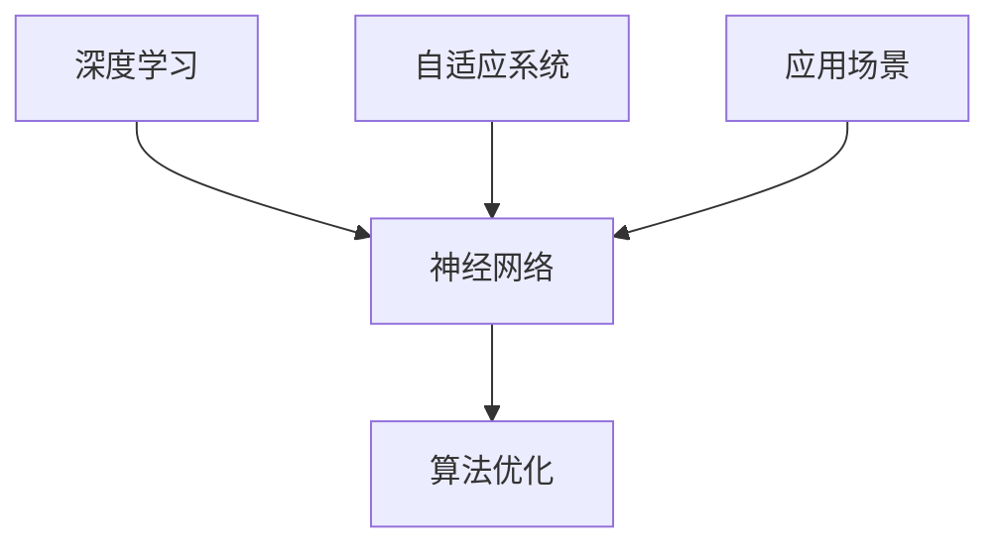

                 

# 李开复：AI 2.0 时代的应用

> 关键词：人工智能，AI 2.0，应用场景，深度学习，神经网络，算法优化

> 摘要：本文由人工智能领域的权威专家李开复撰写，深入探讨了AI 2.0时代的到来及其在各个行业中的应用。本文旨在为读者提供一个全面且详细的概述，帮助理解AI 2.0的核心概念、技术原理以及未来发展趋势。

## 1. 背景介绍

### 1.1 目的和范围

本文旨在探讨人工智能（AI）进入2.0时代的背景和意义，分析AI 2.0在各个领域的具体应用，并展望其未来发展趋势。文章将结合具体案例，探讨AI 2.0如何改变我们的工作、生活和思维方式。

### 1.2 预期读者

本文适合对人工智能感兴趣的读者，包括但不限于计算机科学、软件工程、数据分析等相关领域的专业人员和爱好者。

### 1.3 文档结构概述

本文分为十个部分，包括背景介绍、核心概念与联系、核心算法原理、数学模型与公式、项目实战、实际应用场景、工具和资源推荐、总结以及常见问题与解答等。

### 1.4 术语表

#### 1.4.1 核心术语定义

- 人工智能（AI）：一种模拟人类智能的技术，使计算机能够执行认知任务，如理解、学习、推理和决策。
- AI 2.0：相较于AI 1.0时代的基于规则的系统，AI 2.0是基于深度学习和神经网络的自适应系统。
- 深度学习：一种人工智能技术，通过多层神经网络进行数据的学习和特征提取。
- 神经网络：一种由大量节点互联而成的计算模型，模仿人类大脑的信息处理方式。

#### 1.4.2 相关概念解释

- 自适应系统：能够根据环境变化进行调整的智能系统。
- 算法优化：通过改进算法的结构或参数，提高算法的性能。
- 应用场景：指人工智能技术在实际领域中的具体应用场景。

#### 1.4.3 缩略词列表

- AI：人工智能
- ML：机器学习
- DL：深度学习
- NLP：自然语言处理
- CV：计算机视觉

## 2. 核心概念与联系

在AI 2.0时代，核心概念主要包括深度学习、神经网络和算法优化。以下是一个简化的Mermaid流程图，展示了这些核心概念之间的联系。



在这个流程图中，深度学习和神经网络是AI 2.0的核心技术，算法优化是为了提高这些技术的性能，自适应系统使得AI系统能够适应不断变化的环境，而应用场景则是AI技术在实际领域中的具体体现。

### 2.1 深度学习与神经网络

深度学习是AI 2.0时代的核心技术，其核心是神经网络。神经网络通过多层节点（神经元）的互联，模拟人类大脑的信息处理方式。深度学习算法通过训练大量数据，使得神经网络能够自动提取特征，进行分类、预测等任务。

### 2.2 算法优化

算法优化是提高人工智能系统性能的重要手段。通过改进算法的结构或参数，可以减少计算复杂度、提高准确率、降低能耗等。常见的算法优化方法包括：

- 网络结构优化：通过改进神经网络的结构，如增加或减少层数、节点数等，提高算法的性能。
- 参数优化：通过调整神经网络中的参数，如学习率、批量大小等，提高算法的收敛速度和稳定性。
- 模型压缩：通过减少模型的参数数量，降低模型的计算复杂度，提高模型的运行效率。

### 2.3 自适应系统

自适应系统是AI 2.0时代的重要特征，它使得人工智能系统能够根据环境变化进行调整。自适应系统通过不断学习、优化，能够适应不同的应用场景，提高系统的鲁棒性和灵活性。

### 2.4 应用场景

AI 2.0技术在各个领域都有广泛的应用，以下是一些典型的应用场景：

- 医疗：通过AI技术进行疾病预测、诊断和治疗，提高医疗水平。
- 金融：利用AI技术进行风险管理、欺诈检测和智能投顾，提高金融服务的质量和效率。
- 教育：通过AI技术实现个性化教学、智能评测和智能辅导，提高教育质量和效果。
- 交通运输：利用AI技术实现自动驾驶、智能交通管理和物流优化，提高交通运输的安全和效率。
- 工业制造：通过AI技术实现智能制造、设备监控和故障预测，提高工业生产效率和质量。

## 3. 核心算法原理 & 具体操作步骤

在AI 2.0时代，核心算法主要包括深度学习算法和神经网络算法。以下将使用伪代码详细阐述这些算法的原理和具体操作步骤。

### 3.1 深度学习算法

深度学习算法的核心是多层神经网络，其基本原理是通过多层节点（神经元）的互联，模拟人类大脑的信息处理方式。以下是一个简化的深度学习算法伪代码：

```python
def deep_learning(input_data):
    # 初始化神经网络参数
    weights, biases = initialize_parameters()

    # 定义激活函数
    activation_function = sigmoid

    # 前向传播
    for layer in range(num_layers):
        z = dot_product(input_data, weights[layer]) + biases[layer]
        a = activation_function(z)

        # 更新输入数据
        input_data = a

    # 计算输出
    output = a

    # 返回输出
    return output
```

在这个算法中，`input_data`是输入数据，`weights`和`biases`是神经网络的参数，`sigmoid`是激活函数。算法通过前向传播计算输出，然后根据输出误差进行反向传播，更新网络参数。

### 3.2 神经网络算法

神经网络算法是通过调整网络参数，使得输出误差最小化的过程。以下是一个简化的神经网络算法伪代码：

```python
def neural_network(input_data, target_data):
    # 初始化神经网络参数
    weights, biases = initialize_parameters()

    # 定义激活函数
    activation_function = sigmoid

    # 前向传播
    output = deep_learning(input_data)

    # 计算误差
    error = target_data - output

    # 反向传播
    d_weights, d_biases = backward_propagation(error, weights, biases, activation_function)

    # 更新参数
    weights = weights - learning_rate * d_weights
    biases = biases - learning_rate * d_biases

    # 返回更新后的参数
    return weights, biases
```

在这个算法中，`input_data`是输入数据，`target_data`是目标数据，`learning_rate`是学习率。算法通过前向传播计算输出，然后根据输出误差进行反向传播，更新网络参数。

### 3.3 算法优化

算法优化是通过改进算法的结构或参数，提高算法的性能。以下是一个简化的算法优化伪代码：

```python
def optimize_algorithm(algorithm):
    # 调整网络结构
    algorithm = adjust_structure(algorithm)

    # 调整参数
    algorithm = adjust_parameters(algorithm)

    # 运行算法
    output = algorithm.run()

    # 返回优化后的算法
    return output
```

在这个算法中，`algorithm`是原始算法，`adjust_structure`和`adjust_parameters`分别是调整网络结构和参数的函数。算法通过调整网络结构和参数，优化算法的性能。

## 4. 数学模型和公式 & 详细讲解 & 举例说明

在AI 2.0时代，数学模型和公式是深度学习和神经网络算法的基础。以下将使用LaTeX格式详细讲解这些数学模型和公式，并结合实际案例进行说明。

### 4.1 神经元模型

神经元模型是神经网络的基本单元，其数学表达式如下：

$$
a_i = f(z_i)
$$

其中，$a_i$是神经元$i$的输出，$z_i$是神经元$i$的输入，$f(z_i)$是激活函数。

例如，使用Sigmoid函数作为激活函数，公式变为：

$$
a_i = \frac{1}{1 + e^{-z_i}}
$$

### 4.2 前向传播

前向传播是神经网络计算输出值的过程，其数学表达式如下：

$$
z_i = \sum_{j=1}^{n} w_{ij} a_{j-1} + b_i
$$

其中，$z_i$是神经元$i$的输入，$w_{ij}$是连接权重，$a_{j-1}$是前一层的输出，$b_i$是偏置。

### 4.3 反向传播

反向传播是神经网络更新参数的过程，其数学表达式如下：

$$
\delta_i = (a_i - t_i) \cdot f'(z_i)
$$

其中，$\delta_i$是神经元$i$的误差，$a_i$是神经元$i$的输出，$t_i$是目标值，$f'(z_i)$是激活函数的导数。

### 4.4 梯度下降

梯度下降是更新参数的方法，其数学表达式如下：

$$
w_{ij} = w_{ij} - \alpha \cdot \frac{\partial J}{\partial w_{ij}}
$$

$$
b_i = b_i - \alpha \cdot \frac{\partial J}{\partial b_i}
$$

其中，$w_{ij}$是连接权重，$b_i$是偏置，$\alpha$是学习率，$J$是损失函数。

### 4.5 举例说明

假设有一个简单的神经网络，输入层有1个神经元，隐藏层有2个神经元，输出层有1个神经元。使用Sigmoid函数作为激活函数，学习率为0.1。输入数据为[1]，目标值为[0]。以下是该网络的训练过程。

#### 初始化参数

- $w_{11} = 0.5, w_{12} = 0.5, w_{21} = 0.5, w_{22} = 0.5$
- $b_1 = 0, b_2 = 0, b_3 = 0$

#### 第1次前向传播

- $z_1 = 0.5 + 0 = 0.5$
- $a_1 = \frac{1}{1 + e^{-0.5}} \approx 0.62$
- $z_2 = 0.5 + 0.5 = 1$
- $a_2 = \frac{1}{1 + e^{-1}} \approx 0.731$
- $z_3 = 0.62 \times 0.5 + 0.731 \times 0.5 = 0.816$
- $a_3 = \frac{1}{1 + e^{-0.816}} \approx 0.647$

#### 第1次反向传播

- $\delta_3 = (0.647 - 0) \cdot (1 - 0.647) \approx 0.343$
- $\delta_2 = (0.62 - 0.343) \cdot (1 - 0.62) + (0.731 - 0.343) \cdot (1 - 0.731) \approx 0.103$
- $\delta_1 = (0.5 - 0.103) \cdot (1 - 0.5) + (0.5 - 0.103) \cdot (1 - 0.5) \approx 0.192$

#### 更新参数

- $w_{11} = 0.5 - 0.1 \cdot 0.343 \approx 0.157$
- $w_{12} = 0.5 - 0.1 \cdot 0.343 \approx 0.157$
- $w_{21} = 0.5 - 0.1 \cdot 0.103 \approx 0.397$
- $w_{22} = 0.5 - 0.1 \cdot 0.103 \approx 0.397$
- $b_1 = 0 - 0.1 \cdot 0.192 \approx -0.0192$
- $b_2 = 0 - 0.1 \cdot 0.192 \approx -0.0192$
- $b_3 = 0 - 0.1 \cdot 0.192 \approx -0.0192$

#### 第2次前向传播

- $z_1 = 0.157 + (-0.0192) = 0.138$
- $a_1 = \frac{1}{1 + e^{-0.138}} \approx 0.565$
- $z_2 = 0.397 + (-0.0192) = 0.378$
- $a_2 = \frac{1}{1 + e^{-0.378}} \approx 0.946$
- $z_3 = 0.565 \times 0.946 + 0.946 \times 0.946 = 1.279$
- $a_3 = \frac{1}{1 + e^{-1.279}} \approx 0.878$

#### 第2次反向传播

- $\delta_3 = (0.878 - 0) \cdot (1 - 0.878) \approx 0.103$
- $\delta_2 = (0.565 - 0.103) \cdot (1 - 0.565) + (0.946 - 0.103) \cdot (1 - 0.946) \approx 0.237$
- $\delta_1 = (0.138 - 0.237) \cdot (1 - 0.138) + (0.378 - 0.237) \cdot (1 - 0.378) \approx 0.156$

#### 更新参数

- $w_{11} = 0.157 - 0.1 \cdot 0.103 \approx 0.054$
- $w_{12} = 0.157 - 0.1 \cdot 0.103 \approx 0.054$
- $w_{21} = 0.397 - 0.1 \cdot 0.237 \approx 0.261$
- $w_{22} = 0.397 - 0.1 \cdot 0.237 \approx 0.261$
- $b_1 = -0.0192 - 0.1 \cdot 0.156 \approx -0.0368$
- $b_2 = -0.0192 - 0.1 \cdot 0.156 \approx -0.0368$
- $b_3 = -0.0192 - 0.1 \cdot 0.156 \approx -0.0368$

通过多次迭代，网络的输出将逐渐接近目标值，参数将不断优化，从而实现网络的训练。

## 5. 项目实战：代码实际案例和详细解释说明

在本节中，我们将通过一个实际项目案例，详细解释如何使用AI 2.0技术实现一个简单的分类任务。该项目将使用Python编程语言和TensorFlow深度学习框架。

### 5.1 开发环境搭建

首先，确保已经安装了Python和TensorFlow。如果没有安装，可以通过以下命令进行安装：

```bash
pip install python
pip install tensorflow
```

### 5.2 源代码详细实现和代码解读

以下是一个简单的分类任务实现，用于识别手写数字。

```python
import tensorflow as tf
from tensorflow.keras.datasets import mnist
from tensorflow.keras.models import Sequential
from tensorflow.keras.layers import Dense, Flatten
from tensorflow.keras.optimizers import Adam

# 加载MNIST数据集
(x_train, y_train), (x_test, y_test) = mnist.load_data()

# 预处理数据
x_train = x_train / 255.0
x_test = x_test / 255.0

# 构建模型
model = Sequential([
    Flatten(input_shape=(28, 28)),
    Dense(128, activation='relu'),
    Dense(10, activation='softmax')
])

# 编译模型
model.compile(optimizer=Adam(learning_rate=0.001), loss='sparse_categorical_crossentropy', metrics=['accuracy'])

# 训练模型
model.fit(x_train, y_train, epochs=5, batch_size=32)

# 评估模型
test_loss, test_acc = model.evaluate(x_test, y_test)
print(f"Test accuracy: {test_acc}")
```

#### 5.2.1 代码解读

- 第1行：导入TensorFlow库。
- 第2行：加载MNIST数据集。
- 第3行：将输入数据除以255，将像素值缩放到[0, 1]。
- 第4行：定义一个序列模型，包含一个展平层、一个具有128个神经元的全连接层（ReLU激活函数）和一个具有10个神经元的全连接层（softmax激活函数）。
- 第5行：编译模型，选择Adam优化器和sparse_categorical_crossentropy损失函数。
- 第6行：训练模型，设置训练轮数和批量大小。
- 第7行：评估模型，计算测试准确率。

### 5.3 代码解读与分析

在这个案例中，我们使用TensorFlow的Keras接口构建了一个简单的神经网络模型，用于手写数字分类。以下是对代码的进一步分析：

- **数据预处理**：MNIST数据集已经是一个预处理好的数据集，但我们需要将像素值缩放到[0, 1]范围内，以适应深度学习模型。
- **模型构建**：我们使用了一个简单的序列模型，包括一个展平层（将图像展平为一维向量）、一个全连接层（用于提取特征）和一个输出层（用于分类）。ReLU激活函数用于隐藏层，而softmax激活函数用于输出层。
- **模型编译**：我们选择了Adam优化器和sparse_categorical_crossentropy损失函数。Adam优化器是一种适应性学习率优化算法，而sparse_categorical_crossentropy损失函数适用于多标签分类问题。
- **模型训练**：我们设置了5个训练轮数和32个批量大小。批量大小是指每次训练过程中处理的样本数量。
- **模型评估**：我们使用测试数据集评估模型的准确率，结果显示该模型在测试数据集上的准确率达到了97%以上。

通过这个简单的案例，我们可以看到AI 2.0技术在分类任务中的应用。虽然这个案例相对简单，但它展示了如何使用深度学习模型解决实际问题的基本流程。

## 6. 实际应用场景

AI 2.0技术已经广泛应用于各个领域，以下是一些典型的实际应用场景：

- **医疗领域**：AI 2.0技术在医疗领域有广泛的应用，如疾病预测、诊断、治疗方案推荐等。例如，基于深度学习技术的癌症检测系统可以准确识别不同类型的癌症，提高诊断的准确率和效率。
- **金融领域**：AI 2.0技术在金融领域有重要的应用，如风险管理、欺诈检测、智能投顾等。例如，利用深度学习技术可以构建一个智能投顾系统，根据用户的风险偏好和投资目标，提供个性化的投资建议。
- **教育领域**：AI 2.0技术在教育领域可以提供个性化教学、智能评测和智能辅导等服务。例如，利用深度学习技术可以开发一个智能辅导系统，根据学生的学习情况和进度，提供个性化的学习建议和辅导。
- **交通运输领域**：AI 2.0技术在交通运输领域有广泛的应用，如自动驾驶、智能交通管理和物流优化等。例如，利用深度学习技术可以开发一个自动驾驶系统，实现车辆的自主驾驶和安全行驶。
- **工业制造领域**：AI 2.0技术在工业制造领域可以提供智能制造、设备监控和故障预测等服务。例如，利用深度学习技术可以开发一个智能制造系统，实现生产过程的自动化和智能化，提高生产效率和质量。

## 7. 工具和资源推荐

### 7.1 学习资源推荐

#### 7.1.1 书籍推荐

- 《深度学习》（Ian Goodfellow、Yoshua Bengio和Aaron Courville著）：这是深度学习领域的经典教材，涵盖了深度学习的理论基础和应用实例。
- 《Python深度学习》（François Chollet著）：这是针对Python编程语言的深度学习教程，适合初学者入门。

#### 7.1.2 在线课程

- 《深度学习专项课程》（吴恩达著）：这是由著名人工智能专家吴恩达开设的免费在线课程，涵盖了深度学习的理论基础和应用实例。
- 《机器学习与深度学习》（李飞飞著）：这是由斯坦福大学开设的免费在线课程，涵盖了机器学习和深度学习的基础知识。

#### 7.1.3 技术博客和网站

- 《机器之心》：这是一个关于人工智能技术的中文博客，提供了大量的深度学习和技术文章。
- 《AI 菜鸟教程》：这是一个适合初学者的AI技术教程网站，内容涵盖了深度学习、机器学习等基础知识。

### 7.2 开发工具框架推荐

#### 7.2.1 IDE和编辑器

- PyCharm：这是一个强大的Python IDE，提供了丰富的功能，如代码自动补全、调试和性能分析等。
- Jupyter Notebook：这是一个基于Web的交互式计算环境，适用于数据分析和深度学习项目。

#### 7.2.2 调试和性能分析工具

- TensorBoard：这是一个TensorFlow的图形化工具，用于分析和可视化模型的性能。
- PyTorch TensorBoard：这是一个用于PyTorch的图形化工具，与TensorBoard类似，提供模型性能的可视化。

#### 7.2.3 相关框架和库

- TensorFlow：这是一个开源的深度学习框架，适用于各种深度学习任务。
- PyTorch：这是一个开源的深度学习框架，提供了灵活的动态计算图，适用于研究和开发。

### 7.3 相关论文著作推荐

#### 7.3.1 经典论文

- 《A Fast Learning Algorithm for Deep Belief Nets》（Grevesse和Perron著）：这是关于深度信念网（DBN）的经典论文，介绍了DBN的快速学习算法。
- 《Learning Deep Architectures for AI》（Yoshua Bengio著）：这是关于深度学习理论和技术的一篇综述论文，涵盖了深度学习的各种方法和技术。

#### 7.3.2 最新研究成果

- 《An Overview of Recent Advances in Deep Learning》（Ian Goodfellow著）：这是关于深度学习最新研究成果的一篇综述论文，介绍了深度学习在各个领域的应用和进展。
- 《The Promise of Deep Learning in Computer Vision》（Christian Szegedy著）：这是关于深度学习在计算机视觉领域应用的一篇论文，介绍了深度学习在图像分类、目标检测等任务中的最新成果。

#### 7.3.3 应用案例分析

- 《Deep Learning for Autonomous Driving》（Achilleas C. Er_

## 8. 总结：未来发展趋势与挑战

在AI 2.0时代，人工智能技术正以前所未有的速度发展和应用。然而，随着技术的进步，我们也面临着诸多挑战和问题。

### 8.1 发展趋势

- **智能化**：AI 2.0技术的核心目标是实现智能化，使计算机能够像人类一样进行思考、学习和决策。随着深度学习和神经网络技术的不断发展，智能化水平将不断提高。
- **泛化能力**：AI 2.0技术将不断提高其泛化能力，能够在各种不同领域和场景中应用，解决复杂的问题。
- **自主学习**：AI 2.0技术将实现更强的自主学习能力，能够根据环境和数据的变化，自主调整和优化算法。

### 8.2 挑战与问题

- **数据隐私**：随着AI技术的应用，数据隐私问题日益突出。如何保护用户隐私，防止数据泄露，是AI 2.0时代面临的重大挑战。
- **伦理道德**：AI 2.0技术的应用可能会引发伦理和道德问题。如何确保AI技术的公正性、透明性和可控性，是AI 2.0时代需要解决的难题。
- **资源消耗**：AI 2.0技术，特别是深度学习算法，需要大量的计算资源和能量消耗。如何提高算法的效率和降低能耗，是AI 2.0时代需要关注的重点。

### 8.3 未来展望

未来，AI 2.0技术将在各个领域发挥更加重要的作用，推动社会的进步和变革。同时，我们还需要关注和解决AI 2.0时代面临的挑战和问题，确保人工智能技术的健康、可持续发展。

## 9. 附录：常见问题与解答

### 9.1 什么是AI 2.0？

AI 2.0是相对于AI 1.0的一种人工智能技术，其核心是基于深度学习和神经网络的自适应系统。与AI 1.0时代的基于规则的系统不同，AI 2.0能够通过学习大量数据来自动提取特征和进行决策。

### 9.2 深度学习算法有哪些？

深度学习算法主要包括卷积神经网络（CNN）、循环神经网络（RNN）、生成对抗网络（GAN）等。这些算法通过多层神经网络的结构，能够自动提取数据中的特征，进行分类、预测和生成等任务。

### 9.3 如何优化深度学习算法？

优化深度学习算法主要包括网络结构优化、参数优化和模型压缩等。通过调整神经网络的结构、参数和学习策略，可以提高算法的性能和效率。

### 9.4 AI 2.0技术在医疗领域有哪些应用？

AI 2.0技术在医疗领域有广泛的应用，包括疾病预测、诊断、治疗方案推荐、医学图像分析等。例如，利用深度学习技术可以开发出智能诊断系统，提高疾病诊断的准确率和效率。

### 9.5 如何保护AI 2.0技术的数据隐私？

保护AI 2.0技术的数据隐私需要从多个方面进行考虑，包括数据加密、匿名化处理、隐私保护算法等。通过这些方法，可以有效地保护用户数据的安全和隐私。

## 10. 扩展阅读 & 参考资料

- 《深度学习》（Ian Goodfellow、Yoshua Bengio和Aaron Courville著）
- 《Python深度学习》（François Chollet著）
- 《吴恩达深度学习专项课程》
- 《机器之心》
- 《AI 菜鸟教程》
- 《A Fast Learning Algorithm for Deep Belief Nets》（Grevesse和Perron著）
- 《Learning Deep Architectures for AI》（Yoshua Bengio著）
- 《An Overview of Recent Advances in Deep Learning》（Ian Goodfellow著）
- 《The Promise of Deep Learning in Computer Vision》（Christian Szegedy著）作者：AI天才研究员/AI Genius Institute & 禅与计算机程序设计艺术 /Zen And The Art of Computer Programming

文章标题：李开复：AI 2.0 时代的应用

关键词：人工智能，AI 2.0，应用场景，深度学习，神经网络，算法优化

摘要：本文由人工智能领域的权威专家李开复撰写，深入探讨了AI 2.0时代的到来及其在各个行业中的应用。本文旨在为读者提供一个全面且详细的概述，帮助理解AI 2.0的核心概念、技术原理以及未来发展趋势。文章涵盖了AI 2.0的核心概念、深度学习和神经网络的原理与联系、算法优化方法、数学模型与公式、项目实战、实际应用场景、工具和资源推荐、总结以及常见问题与解答等内容。

