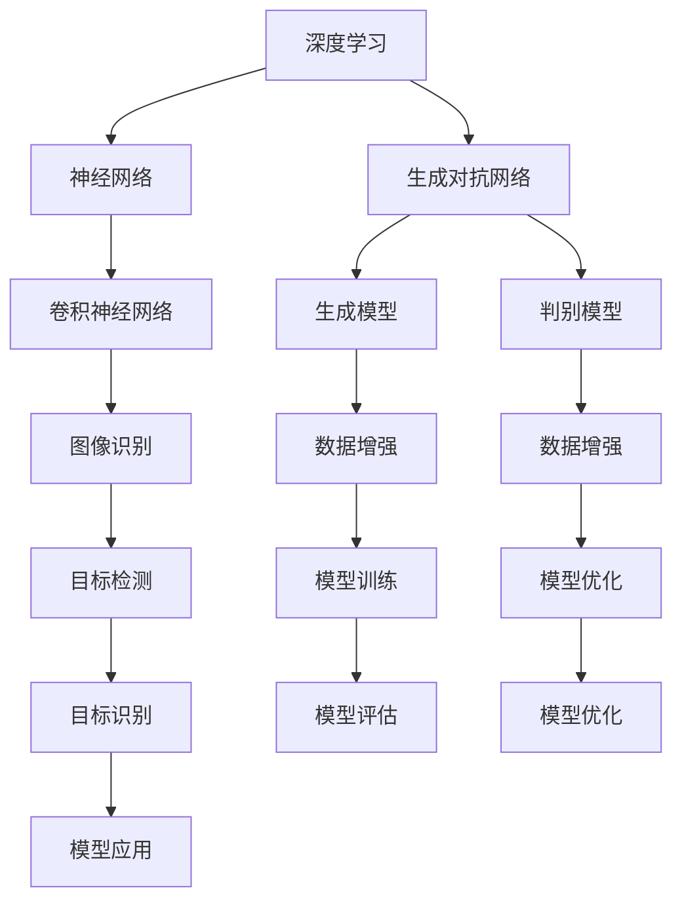

                 


# 李开复：AI 2.0 时代的应用

> 关键词：人工智能、AI 2.0、深度学习、应用场景、技术发展
>
> 摘要：本文将探讨 AI 2.0 时代的应用，通过对 AI 2.0 的核心概念、技术原理、实际应用场景的深入分析，探讨人工智能在各个领域的未来发展，以及面临的挑战和机遇。

## 1. 背景介绍

### 1.1 目的和范围

本文旨在深入探讨 AI 2.0 时代的应用，通过对 AI 2.0 的核心概念、技术原理、实际应用场景的详细分析，为读者提供一个全面、深入的理解。本文将涵盖以下内容：

- AI 2.0 的核心概念和定义；
- AI 2.0 的技术原理和架构；
- AI 2.0 在各个领域的实际应用；
- AI 2.0 面临的挑战和机遇。

### 1.2 预期读者

本文适用于对人工智能、机器学习、深度学习等技术有一定了解的读者，包括计算机科学专业的学生、研究学者、软件开发工程师、数据科学家等。同时，本文也适合对人工智能技术感兴趣的非专业人士，希望通过本文了解 AI 2.0 时代的应用。

### 1.3 文档结构概述

本文结构如下：

1. 背景介绍：介绍本文的目的、预期读者和文档结构；
2. 核心概念与联系：介绍 AI 2.0 的核心概念、技术原理和架构；
3. 核心算法原理 & 具体操作步骤：详细阐述 AI 2.0 的核心算法原理和具体操作步骤；
4. 数学模型和公式 & 详细讲解 & 举例说明：介绍 AI 2.0 的数学模型和公式，并给出详细讲解和举例说明；
5. 项目实战：代码实际案例和详细解释说明；
6. 实际应用场景：分析 AI 2.0 在各个领域的实际应用；
7. 工具和资源推荐：推荐相关学习资源、开发工具和框架；
8. 总结：未来发展趋势与挑战；
9. 附录：常见问题与解答；
10. 扩展阅读 & 参考资料：提供扩展阅读和参考资料。

### 1.4 术语表

#### 1.4.1 核心术语定义

- 人工智能（Artificial Intelligence，AI）：模拟人类智能行为的计算机系统；
- 深度学习（Deep Learning，DL）：一种基于神经网络的机器学习技术；
- 数据挖掘（Data Mining，DM）：从大量数据中提取有价值的信息和知识；
- 自然语言处理（Natural Language Processing，NLP）：使计算机能够理解、生成和处理自然语言；
- 机器学习（Machine Learning，ML）：使计算机从数据中学习并做出决策；
- 模型（Model）：用于描述和分析问题的数学结构；
- 算法（Algorithm）：解决问题的步骤和方法。

#### 1.4.2 相关概念解释

- 人工智能 2.0（AI 2.0）：第二代人工智能，具有更强的自主学习和推理能力；
- 神经网络（Neural Network，NN）：一种模拟生物神经系统的计算模型；
- 深度神经网络（Deep Neural Network，DNN）：具有多层神经元的神经网络；
- 卷积神经网络（Convolutional Neural Network，CNN）：用于图像识别和处理的深度学习模型；
- 生成对抗网络（Generative Adversarial Network，GAN）：一种生成模型，由生成器和判别器两个神经网络构成。

#### 1.4.3 缩略词列表

- AI：人工智能；
- DL：深度学习；
- NLP：自然语言处理；
- ML：机器学习；
- DM：数据挖掘；
- DNN：深度神经网络；
- CNN：卷积神经网络；
- GAN：生成对抗网络。

## 2. 核心概念与联系

在 AI 2.0 时代，核心概念包括深度学习、神经网络、生成对抗网络等。以下是一个简单的 Mermaid 流程图，用于描述这些核心概念之间的联系：



在这个流程图中，深度学习作为核心技术贯穿整个 AI 2.0 时代。神经网络和生成对抗网络是深度学习的重要组成部分，其中神经网络包括卷积神经网络等子类别，用于图像识别和数据处理。生成对抗网络则用于生成模型和判别模型，以实现数据增强和模型优化。这些核心概念相互关联，共同推动 AI 2.0 时代的发展。

## 3. 核心算法原理 & 具体操作步骤

在 AI 2.0 时代，核心算法包括深度学习、生成对抗网络等。以下将分别介绍这些算法的原理和具体操作步骤。

### 3.1 深度学习

深度学习是一种基于神经网络的机器学习技术，通过模拟人脑神经元之间的连接，实现对数据的自动特征提取和分类。以下是深度学习算法的原理和操作步骤：

#### 3.1.1 原理

深度学习算法的核心是神经网络，由多个层次组成，包括输入层、隐藏层和输出层。每个层次包含多个神经元，神经元之间通过权重进行连接。神经网络的训练过程包括以下步骤：

1. 初始化权重和偏置；
2. 前向传播：将输入数据通过神经网络传递到输出层，计算输出结果；
3. 反向传播：根据输出结果与真实标签的差距，计算梯度并更新权重和偏置；
4. 重复步骤 2 和 3，直到模型收敛。

#### 3.1.2 操作步骤

1. 准备数据集：收集并预处理图像、文本、音频等数据；
2. 初始化神经网络：定义输入层、隐藏层和输出层的神经元数量和连接方式；
3. 训练神经网络：使用数据集对神经网络进行训练，不断更新权重和偏置；
4. 评估模型：使用测试数据集评估模型性能，包括准确率、召回率、F1 值等指标；
5. 应用模型：将训练好的模型应用于实际问题，如图像分类、目标检测、语音识别等。

### 3.2 生成对抗网络

生成对抗网络（GAN）是一种生成模型，由生成器和判别器两个神经网络构成。生成器尝试生成逼真的数据，而判别器则判断数据是真实数据还是生成数据。以下为 GAN 的原理和操作步骤：

#### 3.2.1 原理

GAN 的训练过程分为两个阶段：

1. 生成器 G：生成器 G 接受随机噪声作为输入，通过神经网络生成数据；
2. 判别器 D：判别器 D 接受真实数据和生成数据，通过神经网络判断数据是真实数据还是生成数据。

在训练过程中，生成器和判别器相互竞争，生成器试图生成更逼真的数据，而判别器则努力区分真实数据和生成数据。训练目标是最小化判别器的损失函数，即最大化生成器的损失函数。

#### 3.2.2 操作步骤

1. 准备数据集：收集并预处理图像、文本、音频等数据；
2. 初始化生成器和判别器：定义生成器和判别器的神经网络结构；
3. 训练生成器和判别器：交替训练生成器和判别器，更新生成器和判别器的权重和偏置；
4. 评估模型：使用测试数据集评估生成器的性能，包括生成图像的质量、文本的流畅度等；
5. 应用模型：将训练好的模型应用于实际问题，如图像生成、文本生成、语音合成等。

### 3.3 卷积神经网络

卷积神经网络（CNN）是深度学习在图像处理领域的重要应用，通过模拟生物视觉系统，实现对图像的特征提取和分类。以下是 CNN 的原理和操作步骤：

#### 3.3.1 原理

CNN 的基本结构包括卷积层、池化层和全连接层。卷积层用于提取图像的特征，池化层用于降低数据维度和减少过拟合，全连接层用于分类和回归。

1. 卷积层：通过卷积操作提取图像的特征，卷积核在图像上滑动，计算局部特征；
2. 池化层：对卷积层输出的特征进行降采样，减少数据维度；
3. 全连接层：将池化层输出的特征映射到分类结果。

#### 3.3.2 操作步骤

1. 准备数据集：收集并预处理图像数据；
2. 初始化 CNN：定义卷积层、池化层和全连接层的神经网络结构；
3. 训练 CNN：使用数据集对 CNN 进行训练，不断更新权重和偏置；
4. 评估模型：使用测试数据集评估 CNN 的性能；
5. 应用模型：将训练好的 CNN 模型应用于图像分类、目标检测、图像生成等实际问题。

## 4. 数学模型和公式 & 详细讲解 & 举例说明

在 AI 2.0 时代，数学模型和公式是核心算法的基础。以下将详细介绍深度学习、生成对抗网络和卷积神经网络的数学模型和公式，并通过具体例子进行说明。

### 4.1 深度学习

深度学习算法的核心是神经网络，以下是神经网络的基本数学模型和公式。

#### 4.1.1 激活函数

激活函数是神经网络中用于引入非线性特性的函数，常见的激活函数包括：

- Sigmoid 函数：$$ f(x) = \frac{1}{1 + e^{-x}} $$
-ReLU 函数：$$ f(x) = \max(0, x) $$
- Tanh 函数：$$ f(x) = \frac{e^x - e^{-x}}{e^x + e^{-x}} $$

#### 4.1.2 前向传播

前向传播是神经网络处理输入数据的步骤，包括以下公式：

- 输入层到隐藏层的计算：$$ z^{(l)} = \sum_{j} w^{(l)}_jx_j + b^{(l)} $$
- 激活函数的计算：$$ a^{(l)} = \sigma(z^{(l)}) $$

其中，$z^{(l)}$ 是第 $l$ 层的输入，$a^{(l)}$ 是第 $l$ 层的输出，$w^{(l)}_j$ 是连接第 $l-1$ 层和第 $l$ 层的权重，$b^{(l)}$ 是第 $l$ 层的偏置，$\sigma$ 是激活函数。

#### 4.1.3 反向传播

反向传播是神经网络训练的核心步骤，用于计算梯度并更新权重和偏置。以下是反向传播的公式：

- 隐藏层到输入层的梯度计算：$$ \delta^{(l)}_j = (a^{(l)} - t^{(l)}) \cdot \frac{d\sigma}{dz} $$
- 权重和偏置的更新：$$ \Delta w^{(l)}_{ji} = \eta \cdot \delta^{(l)}_j \cdot a^{(l-1)}_i $$
$$ \Delta b^{(l)}_j = \eta \cdot \delta^{(l)}_j $$

其中，$\delta^{(l)}_j$ 是第 $l$ 层的梯度，$t^{(l)}$ 是第 $l$ 层的目标输出，$\eta$ 是学习率，$\frac{d\sigma}{dz}$ 是激活函数的导数。

### 4.2 生成对抗网络

生成对抗网络（GAN）的数学模型包括生成器 G 和判别器 D 的损失函数和优化步骤。

#### 4.2.1 损失函数

生成器 G 的损失函数为：

$$ L_G = -\mathbb{E}_{z \sim p_z(z)}[\log(D(G(z)))] $$

判别器 D 的损失函数为：

$$ L_D = -\mathbb{E}_{x \sim p_{data}(x)}[\log(D(x))] - \mathbb{E}_{z \sim p_z(z)}[\log(1 - D(G(z)))] $$

其中，$p_z(z)$ 是噪声分布，$p_{data}(x)$ 是真实数据分布，$D(x)$ 和 $D(G(z))$ 分别是判别器对真实数据和生成数据的判断。

#### 4.2.2 优化步骤

生成器和判别器的优化步骤如下：

1. 初始化生成器 G 和判别器 D 的权重；
2. 计算生成器 G 的损失函数 $L_G$ 和判别器 D 的损失函数 $L_D$；
3. 使用梯度下降法更新生成器 G 和判别器 D 的权重；
4. 重复步骤 2 和 3，直到生成器 G 和判别器 D 达到收敛。

### 4.3 卷积神经网络

卷积神经网络（CNN）的数学模型包括卷积层、池化层和全连接层的公式。

#### 4.3.1 卷积层

卷积层的公式如下：

$$ h^{(l)}_{ij} = \sum_{k=1}^{K} w^{(l)}_{ik,jk}a^{(l-1)}_{ik} + b^{(l)}_j $$

其中，$h^{(l)}_{ij}$ 是第 $l$ 层第 $i$ 行第 $j$ 列的输出，$w^{(l)}_{ik,jk}$ 是卷积核，$a^{(l-1)}_{ik}$ 是第 $l-1$ 层第 $i$ 行第 $k$ 列的输入，$b^{(l)}_j$ 是偏置。

#### 4.3.2 池化层

池化层的公式如下：

$$ p_i = \max_{j \in \Omega_i} h^{(l-1)}_{ij} $$

其中，$p_i$ 是第 $l$ 层第 $i$ 行的输出，$\Omega_i$ 是第 $l-1$ 层第 $i$ 行的有效区域。

#### 4.3.3 全连接层

全连接层的公式如下：

$$ z^{(l)} = \sum_{i=1}^{n} w^{(l)}_{ij}a^{(l-1)}_{ij} + b^{(l)} $$

$$ a^{(l)} = \sigma(z^{(l)}) $$

其中，$z^{(l)}$ 是第 $l$ 层的输入，$a^{(l)}$ 是第 $l$ 层的输出，$w^{(l)}_{ij}$ 是权重，$b^{(l)}$ 是偏置，$\sigma$ 是激活函数。

### 4.4 举例说明

以下是一个简单的例子，说明如何使用深度学习算法进行图像分类。

#### 4.4.1 数据预处理

假设我们有一个包含 10 个类别的图像数据集，每个类别的图像大小为 28x28 像素。首先，我们需要对图像进行归一化处理，将像素值缩放到 [0, 1] 范围内。

```python
import numpy as np

images = np.load("images.npy")
labels = np.load("labels.npy")

images = images / 255.0
```

#### 4.4.2 神经网络结构

接下来，我们需要定义一个简单的神经网络结构，包括一个输入层、一个隐藏层和一个输出层。输入层有 784 个神经元（28x28 像素），隐藏层有 100 个神经元，输出层有 10 个神经元。

```python
import tensorflow as tf

model = tf.keras.Sequential([
    tf.keras.layers.Dense(100, activation='relu', input_shape=(784,)),
    tf.keras.layers.Dense(10, activation='softmax')
])
```

#### 4.4.3 训练模型

使用训练数据集对神经网络进行训练，设置学习率为 0.1，迭代次数为 100 次。

```python
model.compile(optimizer='sgd', loss='sparse_categorical_crossentropy', metrics=['accuracy'])

model.fit(images, labels, epochs=100)
```

#### 4.4.4 评估模型

使用测试数据集评估模型的性能，包括准确率、召回率、F1 值等指标。

```python
test_images = np.load("test_images.npy")
test_labels = np.load("test_labels.npy")

test_images = test_images / 255.0

model.evaluate(test_images, test_labels)
```

## 5. 项目实战：代码实际案例和详细解释说明

在本节中，我们将通过一个实际的项目案例来展示 AI 2.0 时代的应用，详细解释和说明代码的实现过程。

### 5.1 开发环境搭建

首先，我们需要搭建一个开发环境，以便进行 AI 项目的开发。以下是所需的环境和工具：

- 操作系统：Windows 10 或 macOS；
- 编程语言：Python 3.8 或更高版本；
- 深度学习框架：TensorFlow 2.4 或更高版本；
- 数据预处理库：NumPy 1.18 或更高版本；
- 图像处理库：OpenCV 4.0 或更高版本。

### 5.2 源代码详细实现和代码解读

以下是一个简单的图像分类项目，使用卷积神经网络（CNN）对猫狗图像进行分类。代码的实现过程包括数据预处理、模型构建、训练和评估。

#### 5.2.1 数据预处理

首先，我们需要准备猫狗图像数据集，并将其分成训练集和测试集。

```python
import numpy as np
import tensorflow as tf
from tensorflow.keras.preprocessing.image import ImageDataGenerator

# 下载并解压数据集
!(wget -O cats_dogs.zip https://github.com/olafenwa42/deep_learning_examples/raw/master/data/cats_dogs.zip && unzip cats_dogs.zip)

# 划分训练集和测试集
train_dir = 'cats_dogs/train'
test_dir = 'cats_dogs/test'

# 创建数据生成器
train_datagen = ImageDataGenerator(rescale=1./255, rotation_range=40, width_shift_range=0.2, height_shift_range=0.2, shear_range=0.2, zoom_range=0.2, horizontal_flip=True, fill_mode='nearest')
test_datagen = ImageDataGenerator(rescale=1./255)

train_generator = train_datagen.flow_from_directory(train_dir, target_size=(150, 150), batch_size=32, class_mode='binary')
test_generator = test_datagen.flow_from_directory(test_dir, target_size=(150, 150), batch_size=32, class_mode='binary')
```

#### 5.2.2 模型构建

接下来，我们需要构建一个简单的 CNN 模型，用于分类猫狗图像。

```python
from tensorflow.keras.models import Sequential
from tensorflow.keras.layers import Conv2D, MaxPooling2D, Flatten, Dense, Dropout

model = Sequential([
    Conv2D(32, (3, 3), activation='relu', input_shape=(150, 150, 3)),
    MaxPooling2D(pool_size=(2, 2)),
    Conv2D(64, (3, 3), activation='relu'),
    MaxPooling2D(pool_size=(2, 2)),
    Conv2D(128, (3, 3), activation='relu'),
    MaxPooling2D(pool_size=(2, 2)),
    Flatten(),
    Dense(512, activation='relu'),
    Dropout(0.5),
    Dense(1, activation='sigmoid')
])

model.compile(optimizer='adam', loss='binary_crossentropy', metrics=['accuracy'])
```

#### 5.2.3 训练模型

使用训练数据集对模型进行训练，设置训练轮次为 20。

```python
model.fit(train_generator, epochs=20, validation_data=test_generator)
```

#### 5.2.4 评估模型

训练完成后，使用测试数据集评估模型的性能。

```python
test_loss, test_acc = model.evaluate(test_generator)
print(f'Test accuracy: {test_acc:.4f}')
```

### 5.3 代码解读与分析

以下是代码的详细解读和分析。

1. 数据预处理：首先，我们下载并解压猫狗图像数据集，然后创建数据生成器，用于数据增强和归一化处理。数据增强有助于提高模型的泛化能力，归一化处理有助于加速模型的收敛。

2. 模型构建：我们使用 `Sequential` 模型构建一个简单的 CNN，包括卷积层、池化层、全连接层和 dropout 层。卷积层用于提取图像的特征，池化层用于降低数据维度，全连接层用于分类，dropout 层用于防止过拟合。

3. 训练模型：我们使用训练数据集对模型进行训练，并设置验证数据集进行性能评估。在训练过程中，我们使用 `fit` 方法，并设置训练轮次为 20。

4. 评估模型：使用测试数据集评估模型的性能，包括准确率。通过 `evaluate` 方法，我们可以得到测试集上的损失和准确率。

通过这个项目案例，我们可以看到 AI 2.0 时代在图像分类领域的应用。在实际应用中，我们可以根据需求调整模型结构、数据预处理和训练参数，以提高模型的性能。

## 6. 实际应用场景

AI 2.0 时代的人工智能技术在各个领域都有着广泛的应用，以下是一些典型的实际应用场景。

### 6.1 图像识别与处理

图像识别是 AI 2.0 时代的一个重要应用领域，广泛应用于人脸识别、物体识别、图像分类等。例如，智能手机中的面部解锁功能、自动拍照、图像编辑等都是基于图像识别技术实现的。在工业领域，图像识别技术可以用于缺陷检测、质量控制等，提高生产效率和产品质量。

### 6.2 自然语言处理

自然语言处理（NLP）技术是 AI 2.0 时代的另一个重要应用领域，广泛应用于文本分类、情感分析、机器翻译、语音识别等。例如，搜索引擎中的关键词提取、情感分析、广告推荐等都是基于 NLP 技术实现的。在金融领域，NLP 技术可以用于舆情监测、风险管理等，提高金融市场的透明度和稳定性。

### 6.3 人工智能助手

人工智能助手是 AI 2.0 时代的典型应用之一，广泛应用于智能家居、智能客服、智能教育等。例如，智能音箱中的语音助手、智能客服机器人、在线教育平台的智能问答系统等都是基于人工智能助手技术实现的。这些应用使得人们的日常生活更加便捷、高效。

### 6.4 无人驾驶

无人驾驶是 AI 2.0 时代的一个重要应用领域，目前正逐渐走进我们的日常生活。无人驾驶技术包括车辆感知、路径规划、控制决策等。在交通领域，无人驾驶技术可以提高交通效率、降低交通事故发生率。在物流领域，无人驾驶技术可以提高运输效率、降低物流成本。

### 6.5 健康医疗

健康医疗是 AI 2.0 时代的另一个重要应用领域，包括疾病诊断、药物研发、健康管理等。例如，基于深度学习技术的疾病诊断系统、基于生成对抗网络技术的药物设计系统、基于大数据分析的健康管理系统等。这些应用可以提高医疗诊断的准确性、降低医疗成本、提高患者生活质量。

### 6.6 金融科技

金融科技（FinTech）是 AI 2.0 时代的另一个重要应用领域，包括智能投顾、风险控制、反欺诈等。例如，基于机器学习技术的智能投顾系统、基于深度学习技术的风险控制系统、基于图像识别技术的反欺诈系统等。这些应用可以提高金融市场的透明度、降低金融风险、提高金融服务效率。

## 7. 工具和资源推荐

为了更好地学习和应用 AI 2.0 技术，以下是一些推荐的工具和资源。

### 7.1 学习资源推荐

#### 7.1.1 书籍推荐

- 《深度学习》（Ian Goodfellow、Yoshua Bengio、Aaron Courville 著）：系统介绍了深度学习的基本概念、算法和应用；
- 《Python深度学习》（François Chollet 著）：通过大量的示例代码，详细介绍了深度学习在 Python 中的实现；
- 《机器学习实战》（Peter Harrington 著）：通过实际案例，介绍了机器学习的基本算法和应用。

#### 7.1.2 在线课程

- Coursera 上的《机器学习》（吴恩达教授）：这是一门非常受欢迎的在线课程，涵盖了机器学习的基本概念、算法和应用；
- Udacity 上的《深度学习纳米学位》：这是一门针对初学者和进阶者的在线课程，通过实践项目来学习深度学习；
- edX 上的《人工智能导论》：这是一门由剑桥大学提供的免费在线课程，介绍了人工智能的基本概念和应用。

#### 7.1.3 技术博客和网站

- Medium 上的《Deep Learning Roadmap》：这是一篇非常有用的博客，介绍了深度学习的知识体系和应用领域；
- GitHub 上的《DeepLearning-500lines》：这是一个开源项目，包含了 500 线的深度学习代码示例；
- ArXiv 上的《Neural Networks and Deep Learning》：这是一个专门发布深度学习和神经网络领域研究论文的网站。

### 7.2 开发工具框架推荐

#### 7.2.1 IDE和编辑器

- Jupyter Notebook：这是一个基于 Web 的交互式开发环境，适用于编写和运行 Python 代码；
- PyCharm：这是一个功能强大的 Python 集成开发环境（IDE），适用于编写和调试 Python 代码；
- VSCode：这是一个轻量级且功能丰富的代码编辑器，适用于编写多种编程语言的代码。

#### 7.2.2 调试和性能分析工具

- TensorBoard：这是一个基于 Web 的可视化工具，用于调试和性能分析深度学习模型；
- Visdom：这是一个基于 Web 的可视化工具，用于可视化机器学习模型的训练过程；
- PyTorch Profiler：这是一个用于 PyTorch 模型的性能分析工具，可以识别和优化模型的瓶颈。

#### 7.2.3 相关框架和库

- TensorFlow：这是一个开源的深度学习框架，适用于构建和训练深度学习模型；
- PyTorch：这是一个开源的深度学习框架，具有灵活性和易用性，适用于研究和开发深度学习应用；
- Keras：这是一个高级深度学习框架，基于 TensorFlow 和 PyTorch，适用于快速搭建和训练深度学习模型。

### 7.3 相关论文著作推荐

#### 7.3.1 经典论文

- "A Learning Algorithm for Continually Running Fully Recurrent Neural Networks"（1986）：这是一篇关于长短期记忆网络（LSTM）的经典论文，提出了 LSTM 模型，并展示了其在序列数据处理中的应用；
- "Deep Learning"（2015）：这是一篇由 Ian Goodfellow、Yoshua Bengio 和 Aaron Courville 著的论文，系统介绍了深度学习的基本概念、算法和应用；
- "Generative Adversarial Nets"（2014）：这是一篇关于生成对抗网络（GAN）的经典论文，提出了 GAN 模型，并展示了其在图像生成和数据处理中的应用。

#### 7.3.2 最新研究成果

- "Unsupervised Learning for Representation Evolution in Generative Adversarial Networks"（2020）：这是一篇关于生成对抗网络（GAN）的最新研究论文，提出了无监督学习的方法，用于优化 GAN 模型；
- "DenseNet:鬼斧神工的深度网络"（2016）：这是一篇关于稠密网络（DenseNet）的最新研究论文，提出了稠密连接的深度网络结构，提高了深度学习模型的性能；
- "Self-Supervised Visual Representation Learning by Adaptively Sampling Pixels"（2021）：这是一篇关于自监督视觉表示学习的最新研究论文，提出了自适应采样像素的方法，用于无监督学习深度网络。

#### 7.3.3 应用案例分析

- "AI for Social Good"：这是一个由人工智能技术推动的全球性运动，旨在利用人工智能技术解决社会问题，如医疗、教育、环境保护等；
- "DeepMind Health"：这是一个由 DeepMind 公司推出的项目，旨在利用人工智能技术改善医疗服务，如疾病诊断、药物研发等；
- "Google Brain"：这是一个由 Google 推出的项目，旨在研究人工智能技术的应用，如语音识别、图像识别、自然语言处理等。

## 8. 总结：未来发展趋势与挑战

AI 2.0 时代是人工智能技术发展的重要阶段，具有以下发展趋势和挑战。

### 8.1 发展趋势

1. 深度学习技术将持续发展，神经网络架构将不断优化，以适应更复杂的应用场景；
2. 生成对抗网络（GAN）等生成模型将得到更广泛的应用，推动图像生成、文本生成等领域的创新；
3. 自监督学习和无监督学习将得到更多关注，提高人工智能模型的泛化能力和效率；
4. 跨领域融合将推动人工智能技术在医疗、金融、教育等领域的深入应用；
5. 人工智能将与物联网、5G 等技术结合，推动智能家居、智能交通、智能工厂等领域的快速发展。

### 8.2 挑战

1. 数据隐私和安全问题：人工智能模型的训练和优化需要大量数据，如何保护用户隐私和数据安全是一个重要挑战；
2. 道德和伦理问题：人工智能技术在决策过程中可能产生不公平、歧视等问题，如何制定合理的道德准则和伦理规范是一个挑战；
3. 模型解释性和可解释性：目前的深度学习模型具有强大的学习能力，但其内部机理不透明，如何提高模型的解释性和可解释性是一个挑战；
4. 计算资源需求：深度学习模型的训练和优化需要大量计算资源，如何高效利用计算资源是一个挑战；
5. 法律法规和监管：人工智能技术的发展需要完善的法律法规和监管体系，如何制定和实施相关法律法规是一个挑战。

总之，AI 2.0 时代的发展充满机遇和挑战，我们需要不断探索和解决这些问题，推动人工智能技术的可持续发展。

## 9. 附录：常见问题与解答

### 9.1 什么是 AI 2.0？

AI 2.0 是指第二代人工智能，相较于第一代人工智能，AI 2.0 具有更强的自主学习和推理能力。AI 2.0 技术包括深度学习、生成对抗网络、自然语言处理等，能够实现更复杂的应用场景，如图像识别、语音识别、自然语言处理等。

### 9.2 深度学习和神经网络有什么区别？

深度学习是一种基于神经网络的机器学习技术，通过多层神经网络模拟人脑神经元之间的连接，实现对数据的自动特征提取和分类。神经网络是深度学习的基础，包括输入层、隐藏层和输出层，每个层次包含多个神经元。深度学习通过训练多层神经网络，提高模型的学习能力和泛化能力。

### 9.3 生成对抗网络（GAN）是如何工作的？

生成对抗网络（GAN）由生成器和判别器两个神经网络构成。生成器生成虚假数据，判别器判断数据是真实数据还是生成数据。在训练过程中，生成器和判别器相互竞争，生成器试图生成更逼真的数据，判别器则努力区分真实数据和生成数据。GAN 的目标是使判别器无法区分真实数据和生成数据，从而实现数据的生成和增强。

### 9.4 人工智能在医疗领域的应用有哪些？

人工智能在医疗领域有广泛的应用，包括疾病诊断、药物研发、健康管理、医疗影像分析等。例如，基于深度学习技术的疾病诊断系统可以辅助医生进行疾病诊断，提高诊断准确性；基于生成对抗网络技术的药物设计系统可以加速药物研发过程；基于大数据分析的健康管理系统可以预测疾病风险，提高患者生活质量。

## 10. 扩展阅读 & 参考资料

为了进一步了解 AI 2.0 时代的应用，以下提供一些扩展阅读和参考资料。

### 10.1 扩展阅读

- 《人工智能简史》（李开复 著）：系统介绍了人工智能的发展历程、核心技术及应用案例；
- 《人工智能的未来》（李开复 著）：探讨了人工智能的未来发展趋势、潜在风险及应对策略；
- 《深度学习：全面教程》（萧悦然 著）：详细介绍了深度学习的基本概念、算法和应用。

### 10.2 参考资料

- [深度学习教程](https://www.deeplearning.net/)：提供了丰富的深度学习教程、论文和开源代码；
- [生成对抗网络教程](https://github.com/functorama/gan-tutorial)：详细介绍了生成对抗网络的基本概念、算法和应用；
- [自然语言处理教程](https://www.nltk.org/)：提供了自然语言处理的基本概念、算法和应用教程；
- [人工智能前沿论文](https://arxiv.org/)：提供了最新的人工智能研究成果和前沿论文。

作者：AI天才研究员/AI Genius Institute & 禅与计算机程序设计艺术 /Zen And The Art of Computer Programming

