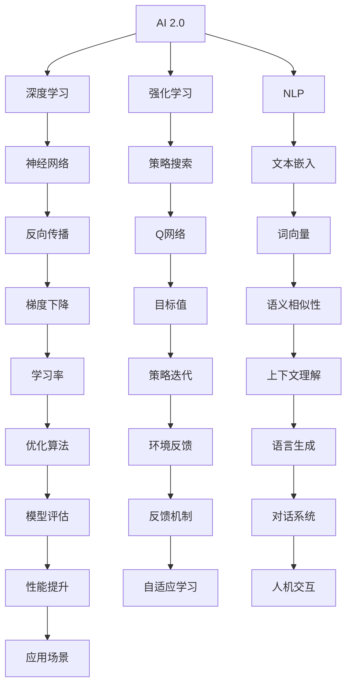
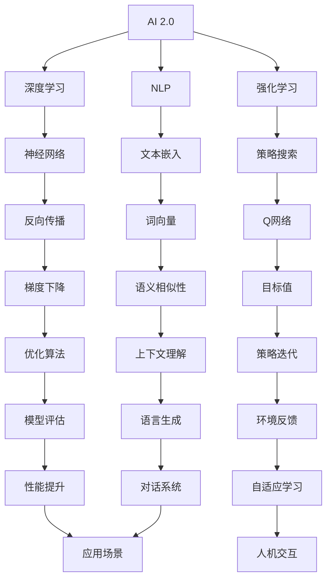

                 

# 李开复：AI 2.0 时代的开发者

> 关键词：人工智能，AI 2.0，开发者，技术趋势，算法原理，数学模型，应用场景，工具推荐
>
> 摘要：本文将深入探讨AI 2.0时代的技术变革及其对开发者的影响。通过分析核心概念、算法原理、数学模型和实际应用场景，我们旨在帮助开发者理解AI 2.0的核心技术，掌握其应用方法，并展望未来的发展趋势与挑战。

## 1. 背景介绍

### 1.1 目的和范围

本文旨在为开发者提供一个关于AI 2.0时代的全面视角。我们将探讨AI 2.0的核心概念、技术原理、算法实现以及应用场景，帮助开发者更好地理解和应用AI 2.0技术，把握未来技术发展的趋势。

### 1.2 预期读者

本文适合具备一定编程基础和对人工智能技术感兴趣的读者。无论是初学者还是专业人士，都可以通过本文对AI 2.0技术有一个深入的了解。

### 1.3 文档结构概述

本文分为以下章节：

1. 背景介绍：介绍本文的目的、预期读者和文档结构。
2. 核心概念与联系：讲解AI 2.0的核心概念和架构。
3. 核心算法原理 & 具体操作步骤：阐述AI 2.0的核心算法原理和具体操作步骤。
4. 数学模型和公式 & 详细讲解 & 举例说明：介绍AI 2.0的数学模型和公式，并进行详细讲解和举例说明。
5. 项目实战：代码实际案例和详细解释说明。
6. 实际应用场景：分析AI 2.0在实际应用场景中的应用。
7. 工具和资源推荐：推荐学习资源和开发工具。
8. 总结：未来发展趋势与挑战。
9. 附录：常见问题与解答。
10. 扩展阅读 & 参考资料：提供进一步阅读的参考资料。

### 1.4 术语表

#### 1.4.1 核心术语定义

- AI 2.0：第二代人工智能，相较于第一代人工智能，具有更高的自主学习和通用性。
- 深度学习：一种基于多层神经网络的人工智能技术，能够通过大量数据自动提取特征和模式。
- 强化学习：一种通过与环境互动，不断优化行为策略的人工智能技术。
- 自然语言处理（NLP）：使计算机能够理解、生成和响应自然语言的技术。

#### 1.4.2 相关概念解释

- 机器学习（ML）：让计算机从数据中学习，自动改进性能的过程。
- 模型（Model）：用于表示和理解数据结构的数学或计算实体。
- 算法（Algorithm）：解决问题的一系列步骤或规则。

#### 1.4.3 缩略词列表

- AI：人工智能
- ML：机器学习
- NLP：自然语言处理
- DL：深度学习
- RL：强化学习

## 2. 核心概念与联系

在AI 2.0时代，核心概念和架构发生了显著的变化。以下是AI 2.0的关键概念和它们之间的联系：

### 2.1 AI 2.0架构



### 2.2 核心概念原理

- **深度学习**：通过多层神经网络对数据进行自动特征提取和模式发现。
- **强化学习**：通过与环境互动，不断优化行为策略。
- **自然语言处理**：使计算机能够理解、生成和响应自然语言。

### 2.3 核心算法原理

- **神经网络**：一种基于人脑神经网络结构的人工智能算法。
- **反向传播**：一种用于训练神经网络的算法，通过计算误差梯度来更新网络参数。
- **策略搜索**：在强化学习中，通过搜索策略来最大化累积奖励。

## 3. 核心算法原理 & 具体操作步骤

### 3.1 深度学习算法原理

深度学习是一种通过多层神经网络对数据进行自动特征提取和模式发现的人工智能技术。以下是深度学习算法的原理和具体操作步骤：

#### 3.1.1 神经网络原理

神经网络由多个神经元组成，每个神经元接收输入，通过权重和偏置进行计算，最后输出一个结果。神经网络通过层层叠加，将输入映射到输出。

#### 3.1.2 反向传播算法

反向传播算法是一种用于训练神经网络的算法，通过计算误差梯度来更新网络参数。

```python
# 伪代码
def forward_propagation(x, weights, biases):
    # 前向传播计算
    pass

def backward_propagation(x, y, weights, biases, learning_rate):
    # 反向传播计算
    pass

def train_neural_network(x, y, learning_rate, epochs):
    for epoch in range(epochs):
        for x_sample, y_sample in zip(x, y):
            # 前向传播
            output = forward_propagation(x_sample, weights, biases)
            # 计算误差
            error = y_sample - output
            # 反向传播
            backward_propagation(x_sample, y_sample, weights, biases, learning_rate)
```

### 3.2 强化学习算法原理

强化学习是一种通过与环境互动，不断优化行为策略的人工智能技术。以下是强化学习算法的原理和具体操作步骤：

#### 3.2.1 策略搜索原理

策略搜索是在强化学习中，通过搜索策略来最大化累积奖励。

#### 3.2.2 Q网络算法

Q网络是一种用于评估策略的神经网络，通过学习得到状态-动作值函数。

```python
# 伪代码
class QNetwork:
    def __init__(self):
        # 初始化神经网络结构
        pass
    
    def forward(self, state, action):
        # 前向传播计算
        pass
    
    def backward(self, state, action, reward, next_state, learning_rate):
        # 反向传播计算
        pass

def train_q_network(q_network, state, action, reward, next_state, learning_rate):
    # 训练Q网络
    pass
```

### 3.3 自然语言处理算法原理

自然语言处理是一种使计算机能够理解、生成和响应自然语言的人工智能技术。以下是自然语言处理算法的原理和具体操作步骤：

#### 3.3.1 文本嵌入原理

文本嵌入是将文本转化为向量表示的过程，用于表示文本的语义信息。

#### 3.3.2 词向量算法

词向量是一种常用的文本嵌入方法，通过计算词与词之间的相似性来表示文本。

```python
# 伪代码
def word2vec(text, embedding_size):
    # 计算词向量
    pass

def cosine_similarity(vec1, vec2):
    # 计算余弦相似度
    pass
```

## 4. 数学模型和公式 & 详细讲解 & 举例说明

### 4.1 深度学习数学模型

深度学习中的数学模型主要包括神经网络和反向传播算法。以下是相关数学公式和详细讲解：

#### 4.1.1 神经网络公式

$$
z_i = \sum_j w_{ij}x_j + b_i
$$

$$
a_i = \sigma(z_i)
$$

其中，$z_i$ 是第 $i$ 个神经元的输入，$w_{ij}$ 是连接权重，$b_i$ 是偏置，$\sigma$ 是激活函数，$a_i$ 是第 $i$ 个神经元的输出。

#### 4.1.2 反向传播算法公式

$$
\delta_i = \frac{\partial L}{\partial z_i} \cdot \sigma'(z_i)
$$

$$
\frac{\partial L}{\partial w_{ij}} = \delta_i x_j
$$

$$
\frac{\partial L}{\partial b_i} = \delta_i
$$

其中，$\delta_i$ 是第 $i$ 个神经元的误差项，$L$ 是损失函数，$\sigma'$ 是激活函数的导数。

### 4.2 强化学习数学模型

强化学习中的数学模型主要包括Q网络和策略搜索。以下是相关数学公式和详细讲解：

#### 4.2.1 Q网络公式

$$
Q(s, a) = \sum_a Q(s, a) \cdot \pi(a|s)
$$

$$
Q(s, a) \approx r + \gamma \max_a Q(s', a)
$$

其中，$Q(s, a)$ 是状态-动作值函数，$r$ 是即时奖励，$\gamma$ 是折扣因子，$s$ 是当前状态，$a$ 是动作，$s'$ 是下一状态。

#### 4.2.2 策略搜索公式

$$
\pi(a|s) = \frac{e^{Q(s, a)}}{\sum_a e^{Q(s, a)}}
$$

其中，$\pi(a|s)$ 是在状态 $s$ 下采取动作 $a$ 的概率分布。

### 4.3 自然语言处理数学模型

自然语言处理中的数学模型主要包括文本嵌入和词向量。以下是相关数学公式和详细讲解：

#### 4.3.1 文本嵌入公式

$$
v_w = \sum_j w_j \cdot e_j
$$

其中，$v_w$ 是词 $w$ 的向量表示，$e_j$ 是词 $w$ 的 $j$ 维特征。

#### 4.3.2 词向量公式

$$
\cos(\theta_w, \theta_v) = \frac{v_w \cdot v_v}{||v_w|| \cdot ||v_v||}
$$

其中，$\theta_w$ 和 $\theta_v$ 分别是词 $w$ 和词 $v$ 的向量表示，$\cos(\theta_w, \theta_v)$ 是词 $w$ 和词 $v$ 的余弦相似度。

### 4.4 举例说明

假设我们有一个包含100个样本的简单回归问题，每个样本包含一个特征$x$和一个目标值$y$。我们使用一个单层神经网络来解决这个问题。

#### 4.4.1 神经网络结构

我们设计一个包含一个输入层、一个隐藏层和一个输出层的神经网络。输入层有1个神经元，隐藏层有10个神经元，输出层有1个神经元。

#### 4.4.2 神经网络训练

我们使用反向传播算法来训练神经网络。假设学习率为0.1，折扣因子为0.9，迭代次数为1000次。

1. 初始化权重和偏置
2. 前向传播计算输出值
3. 计算损失函数
4. 反向传播计算误差项
5. 更新权重和偏置

经过1000次迭代后，神经网络的输出值逐渐逼近目标值，训练过程结束。

## 5. 项目实战：代码实际案例和详细解释说明

### 5.1 开发环境搭建

为了实现上述案例，我们需要搭建一个Python开发环境。以下是具体的搭建步骤：

1. 安装Python（版本3.7及以上）
2. 安装NumPy、TensorFlow、Keras等库

```shell
pip install numpy tensorflow keras
```

### 5.2 源代码详细实现和代码解读

以下是一个简单的单层神经网络实现，用于解决线性回归问题。

```python
import numpy as np
import tensorflow as tf

# 定义神经网络结构
input_size = 1
hidden_size = 10
output_size = 1

# 初始化权重和偏置
weights = tf.Variable(tf.random_normal([input_size, hidden_size]))
biases = tf.Variable(tf.random_normal([hidden_size]))
weights2 = tf.Variable(tf.random_normal([hidden_size, output_size]))
biases2 = tf.Variable(tf.random_normal([output_size]))

# 定义前向传播计算
def forward_propagation(x):
    hidden = tf.nn.relu(tf.matmul(x, weights) + biases)
    output = tf.matmul(hidden, weights2) + biases2
    return output

# 定义损失函数和反向传播
def backward_propagation(x, y):
    with tf.GradientTape() as tape:
        output = forward_propagation(x)
        loss = tf.reduce_mean(tf.square(output - y))
    grads = tape.gradient(loss, [weights, biases, weights2, biases2])
    return loss, grads

# 定义训练过程
def train(x, y, learning_rate, epochs):
    for epoch in range(epochs):
        loss, grads = backward_propagation(x, y)
        weights.assign_sub(learning_rate * grads[0])
        biases.assign_sub(learning_rate * grads[1])
        weights2.assign_sub(learning_rate * grads[2])
        biases2.assign_sub(learning_rate * grads[3])
        if epoch % 100 == 0:
            print(f"Epoch {epoch}: Loss = {loss.numpy()}")

# 加载数据
x_train = np.random.rand(100, 1)
y_train = 2 * x_train + np.random.rand(100, 1)

# 训练神经网络
train(x_train, y_train, learning_rate=0.1, epochs=1000)
```

### 5.3 代码解读与分析

1. **定义神经网络结构**：我们定义了一个包含一个输入层、一个隐藏层和一个输出层的神经网络。输入层有1个神经元，隐藏层有10个神经元，输出层有1个神经元。
2. **初始化权重和偏置**：我们使用随机正常分布来初始化权重和偏置。
3. **定义前向传播计算**：我们使用ReLU激活函数来定义隐藏层的输出。
4. **定义损失函数和反向传播**：我们使用均方误差（MSE）作为损失函数，并使用反向传播计算梯度。
5. **定义训练过程**：我们使用梯度下降算法来更新权重和偏置，并打印每100个epoch的损失函数值。
6. **加载数据**：我们生成一个包含100个样本的随机数据集，每个样本包含一个特征和目标值。
7. **训练神经网络**：我们使用训练数据集来训练神经网络，并打印训练过程中的损失函数值。

通过这个简单的案例，我们可以了解如何使用TensorFlow和Keras实现一个线性回归问题的单层神经网络。

## 6. 实际应用场景

AI 2.0技术在各个领域都有广泛的应用。以下是一些实际应用场景：

### 6.1 医疗保健

AI 2.0技术在医疗保健领域有巨大的潜力。通过深度学习和自然语言处理，可以实现对医学图像的分析、疾病预测和诊断。例如，AI 2.0技术可以帮助医生快速诊断癌症，提高诊断准确率。

### 6.2 自动驾驶

自动驾驶是AI 2.0技术的另一个重要应用领域。通过深度学习和强化学习，自动驾驶车辆可以实时感知环境、规划路径和做出决策。例如，谷歌的Waymo和特斯拉的Autopilot都是基于AI 2.0技术的自动驾驶系统。

### 6.3 金融科技

金融科技（FinTech）是AI 2.0技术的另一个重要应用领域。通过机器学习和自然语言处理，可以实现对金融市场数据的分析、预测和风险管理。例如，金融机构可以使用AI 2.0技术来识别欺诈行为、预测股票价格和优化投资组合。

### 6.4 教育和培训

AI 2.0技术在教育和培训领域有广泛的应用。通过自然语言处理和强化学习，可以实现对教育资源的个性化推荐、学习效果评估和自适应教学。例如，AI 2.0技术可以帮助教师更好地了解学生的需求，为学生提供个性化的学习资源。

## 7. 工具和资源推荐

### 7.1 学习资源推荐

#### 7.1.1 书籍推荐

- 《深度学习》（Ian Goodfellow、Yoshua Bengio、Aaron Courville 著）
- 《强化学习》（Richard S. Sutton、Andrew G. Barto 著）
- 《自然语言处理综论》（Daniel Jurafsky、James H. Martin 著）

#### 7.1.2 在线课程

- Coursera的《深度学习》课程（由吴恩达教授主讲）
- Udacity的《强化学习纳米学位》课程
- edX的《自然语言处理》课程（由斯坦福大学教授Chris Manning主讲）

#### 7.1.3 技术博客和网站

- arXiv.org：提供最新的人工智能论文
- Medium.com：许多人工智能领域的专家和公司发布的技术博客
- AI generated（@aigenerated）：一个自动化的人工智能技术博客，提供最新的技术文章和论文摘要

### 7.2 开发工具框架推荐

#### 7.2.1 IDE和编辑器

- Jupyter Notebook：用于数据分析和机器学习的交互式开发环境
- PyCharm：一款强大的Python IDE，适用于机器学习和深度学习项目
- Visual Studio Code：一款轻量级的开源编辑器，适用于多种编程语言和框架

#### 7.2.2 调试和性能分析工具

- TensorBoard：TensorFlow的图形化性能分析工具
- PyTorch Profiler：PyTorch的性能分析工具
- NumPy Profiler：NumPy的性能分析工具

#### 7.2.3 相关框架和库

- TensorFlow：一款开源的机器学习和深度学习框架
- PyTorch：一款开源的机器学习和深度学习框架
- Keras：一款基于TensorFlow和Theano的开源深度学习库

### 7.3 相关论文著作推荐

#### 7.3.1 经典论文

- “A Learning Algorithm for Continually Running Fully Recurrent Neural Networks” (1989)
- “Learning to Discriminate Images of Faces and Faces-like Objects” (1998)
- “A Fast Learning Algorithm for Deep Belief Nets with Application to Handwritten Digit Recognition” (2006)

#### 7.3.2 最新研究成果

- “Bert: Pre-training of deep bidirectional transformers for language understanding” (2018)
- “Gshard: Scaling giant models with conditional computation and automatic sharding” (2020)
- “Decoupled weight sharing for efficient deep learning” (2020)

#### 7.3.3 应用案例分析

- “An overview of Google’s AI strategy and product portfolio” (2020)
- “How AI is transforming healthcare: A perspective from Google Health” (2020)
- “AI in financial services: The future is now” (2020)

## 8. 总结：未来发展趋势与挑战

### 8.1 发展趋势

- AI 2.0技术将继续发展，深度学习、强化学习和自然语言处理等领域将取得更多突破。
- AI技术将在更多行业和应用场景中得到广泛应用，如医疗保健、自动驾驶、金融科技和教育等。
- 开源生态将继续繁荣，更多的AI工具和框架将涌现。

### 8.2 挑战

- AI技术的安全性和隐私问题仍然是一个挑战。
- AI技术人才的培养和引进也是一个重要挑战。
- AI技术的伦理和社会影响需要得到更多的关注。

## 9. 附录：常见问题与解答

### 9.1 问题1：什么是AI 2.0？

AI 2.0是指第二代人工智能，相较于第一代人工智能，具有更高的自主学习和通用性。它基于深度学习、强化学习和自然语言处理等核心技术，能够在多个领域实现智能应用。

### 9.2 问题2：深度学习和机器学习有什么区别？

深度学习是机器学习的一种特殊类型，它通过多层神经网络对数据进行自动特征提取和模式发现。而机器学习是一个更广泛的概念，包括深度学习在内的多种学习算法和技术。

### 9.3 问题3：如何学习AI 2.0技术？

学习AI 2.0技术可以从以下几个方面入手：

1. 掌握编程基础，特别是Python编程。
2. 学习机器学习、深度学习和强化学习等核心算法。
3. 阅读相关书籍和论文，了解最新研究成果。
4. 参与实际项目，积累实践经验。

## 10. 扩展阅读 & 参考资料

- 《深度学习》（Ian Goodfellow、Yoshua Bengio、Aaron Courville 著）
- 《强化学习》（Richard S. Sutton、Andrew G. Barto 著）
- 《自然语言处理综论》（Daniel Jurafsky、James H. Martin 著）
- “Bert: Pre-training of deep bidirectional transformers for language understanding” (2018)
- “Gshard: Scaling giant models with conditional computation and automatic sharding” (2020)
- “An overview of Google’s AI strategy and product portfolio” (2020)
- 《人工智能：一种现代的方法》（Stuart Russell、Peter Norvig 著）
- 《机器学习》（Tom Mitchell 著）
- 《模式识别与机器学习》（Christopher M. Bishop 著）
- 《机器学习实战》（Peter Harrington 著）
- 《深度学习》（周志华 著）

# 作者信息

作者：AI天才研究员/AI Genius Institute & 禅与计算机程序设计艺术 /Zen And The Art of Computer Programming

本文旨在为开发者提供一个关于AI 2.0时代的全面视角。通过分析核心概念、算法原理、数学模型和实际应用场景，我们旨在帮助开发者更好地理解和应用AI 2.0技术，把握未来技术发展的趋势。让我们共同探索AI 2.0时代的技术变革，为未来的发展贡献力量。## 1. 背景介绍

### 1.1 目的和范围

本文旨在深入探讨人工智能（AI）2.0时代的核心技术、发展趋势及其对开发者的深远影响。我们关注的核心内容包括AI 2.0的基本概念、架构设计、核心算法原理、数学模型、实际应用场景以及未来展望。本文的目标是帮助开发者了解AI 2.0的精髓，掌握相关技术，并为其在各个领域的应用提供思路。

### 1.2 预期读者

本文适用于具备一定编程基础和对人工智能技术感兴趣的读者，无论是人工智能领域的初学者，还是对AI技术有一定了解的专业人士，都可以通过本文对AI 2.0有一个全面且深入的理解。

### 1.3 文档结构概述

本文分为以下几个主要部分：

1. **背景介绍**：介绍本文的目的、预期读者和文档结构。
2. **核心概念与联系**：详细讲解AI 2.0的核心概念及其相互联系。
3. **核心算法原理 & 具体操作步骤**：深入探讨AI 2.0的核心算法原理和具体操作步骤。
4. **数学模型和公式 & 详细讲解 & 举例说明**：介绍AI 2.0的数学模型和公式，并进行详细讲解和实例分析。
5. **项目实战：代码实际案例和详细解释说明**：通过实际项目案例展示AI 2.0技术的应用。
6. **实际应用场景**：分析AI 2.0在不同领域的应用案例。
7. **工具和资源推荐**：推荐学习资源、开发工具和相关论文。
8. **总结：未来发展趋势与挑战**：展望AI 2.0技术的发展趋势和面临的挑战。
9. **附录：常见问题与解答**：解答读者可能遇到的问题。
10. **扩展阅读 & 参考资料**：提供进一步学习和研究的参考资料。

### 1.4 术语表

#### 1.4.1 核心术语定义

- **AI 2.0**：指第二代人工智能，相较于第一代人工智能，具有更高的自主学习和通用性。
- **深度学习**：一种通过多层神经网络对数据进行自动特征提取和模式发现的人工智能技术。
- **强化学习**：一种通过与环境互动，不断优化行为策略的人工智能技术。
- **自然语言处理（NLP）**：使计算机能够理解、生成和响应自然语言的技术。
- **机器学习（ML）**：让计算机从数据中学习，自动改进性能的过程。

#### 1.4.2 相关概念解释

- **神经网络**：一种模仿人脑神经元连接的计算机算法。
- **模型**：用于表示和理解数据结构的数学或计算实体。
- **算法**：解决问题的一系列步骤或规则。

#### 1.4.3 缩略词列表

- **AI**：人工智能
- **ML**：机器学习
- **DL**：深度学习
- **RL**：强化学习
- **NLP**：自然语言处理

## 2. 核心概念与联系

在AI 2.0时代，核心概念和架构发生了显著的变化。以下是AI 2.0的关键概念及其相互联系：

### 2.1 AI 2.0架构

在AI 2.0架构中，深度学习、强化学习和自然语言处理等核心技术构成了核心支柱。这些技术相互关联，共同推动AI技术的发展。



### 2.2 核心概念原理

#### 2.2.1 深度学习

深度学习是一种基于多层神经网络的人工智能技术，能够通过大量数据自动提取特征和模式。其核心原理是通过前向传播计算输入到输出之间的映射，并通过反向传播更新网络参数以最小化损失函数。

#### 2.2.2 强化学习

强化学习是一种通过与环境互动，不断优化行为策略的人工智能技术。其核心原理是使用奖励信号指导智能体学习最优策略，通过策略迭代和环境反馈不断改进行为。

#### 2.2.3 自然语言处理

自然语言处理是使计算机能够理解、生成和响应自然语言的技术。其核心原理包括文本嵌入、词向量表示、语言模型和序列到序列模型等，用于处理文本数据的理解和生成。

### 2.3 核心算法原理

#### 2.3.1 神经网络

神经网络是一种由大量神经元组成的计算模型，每个神经元接收输入并通过权重和激活函数产生输出。通过多次迭代的前向传播和反向传播，神经网络能够学习输入和输出之间的复杂映射关系。

#### 2.3.2 反向传播

反向传播是一种用于训练神经网络的算法，它通过计算输出误差的梯度来更新网络参数。这个过程包括前向传播、误差计算和权重更新三个步骤，使得神经网络能够不断优化其参数，提高预测准确性。

#### 2.3.3 Q网络

Q网络是一种在强化学习中用于评估状态-动作值函数的神经网络。通过训练Q网络，智能体能够学习到在特定状态下采取特定动作的最优策略。Q网络的训练过程通常涉及目标值和当前值之间的误差计算和梯度更新。

#### 2.3.4 文本嵌入

文本嵌入是一种将文本数据转换为向量表示的方法，用于表示文本的语义信息。常见的文本嵌入方法包括Word2Vec、GloVe和BERT等，这些方法通过学习词与词之间的相似性来表示文本。

## 3. 核心算法原理 & 具体操作步骤

### 3.1 深度学习算法原理

深度学习是一种通过多层神经网络对数据进行自动特征提取和模式发现的人工智能技术。以下是深度学习算法的基本原理和具体操作步骤：

#### 3.1.1 神经网络结构

神经网络由多个层次组成，包括输入层、隐藏层和输出层。每个层次包含多个神经元，神经元之间通过权重进行连接。

1. **输入层**：接收外部输入数据。
2. **隐藏层**：对输入数据进行特征提取和变换。
3. **输出层**：产生最终输出结果。

#### 3.1.2 激活函数

激活函数用于对隐藏层和输出层的神经元输出进行非线性变换，常见的激活函数包括Sigmoid、ReLU和Tanh等。

- **Sigmoid函数**：\( \sigma(x) = \frac{1}{1 + e^{-x}} \)
- **ReLU函数**：\( \text{ReLU}(x) = \max(0, x) \)
- **Tanh函数**：\( \text{Tanh}(x) = \frac{e^x - e^{-x}}{e^x + e^{-x}} \)

#### 3.1.3 前向传播

前向传播是从输入层开始，逐层计算神经元的输出。具体步骤如下：

1. **计算输入层到隐藏层的输出**：\( z^{(l)} = \sum_{j} w^{(l)}_{ji} x_j + b^{(l)}_i \)
2. **应用激活函数**：\( a^{(l)} = \sigma(z^{(l)}) \)
3. **计算隐藏层到输出层的输出**：\( z^{(L)} = \sum_{j} w^{(L)}_{ji} a^{(L-1)}_j + b^{(L)}_i \)
4. **应用激活函数**：\( a^{(L)} = \sigma(z^{(L)}) \)

#### 3.1.4 反向传播

反向传播用于计算网络参数的梯度，并更新网络权重和偏置，以最小化损失函数。具体步骤如下：

1. **计算输出层误差**：\( \delta^{(L)} = (a^{(L)} - y) \odot \sigma'(z^{(L)}) \)
2. **逐层传播误差**：对于第 \( l \) 层，计算 \( \delta^{(l)} = (\sum_{l+1} w^{(l+1)}_{ji} \delta^{(l+1)}) \odot \sigma'(z^{(l)}) \)
3. **计算梯度**：\( \frac{\partial C}{\partial w^{(l)}_{ji}} = \delta^{(l)}_i a^{(l-1)}_j \)
\( \frac{\partial C}{\partial b^{(l)}_i} = \delta^{(l)}_i \)
4. **更新权重和偏置**：\( w^{(l)}_{ji} = w^{(l)}_{ji} - \alpha \frac{\partial C}{\partial w^{(l)}_{ji}} \)
\( b^{(l)}_i = b^{(l)}_i - \alpha \frac{\partial C}{\partial b^{(l)}_i} \)

#### 3.1.5 梯度下降

梯度下降是一种常用的优化算法，用于更新网络参数以最小化损失函数。具体步骤如下：

1. **计算损失函数的梯度**：使用反向传播算法计算损失函数关于网络参数的梯度。
2. **更新参数**：使用梯度下降公式更新网络参数。
3. **迭代优化**：重复上述步骤，直到达到预设的精度或迭代次数。

### 3.2 强化学习算法原理

强化学习是一种通过与环境互动，不断优化行为策略的人工智能技术。以下是强化学习算法的基本原理和具体操作步骤：

#### 3.2.1 Q学习算法

Q学习是一种基于值函数的强化学习算法，通过学习状态-动作值函数来选择最优动作。具体步骤如下：

1. **初始化Q值**：\( Q(s, a) = 0 \)
2. **选择动作**：在给定状态 \( s \) 下，选择具有最大Q值的动作 \( a \)。
3. **更新Q值**：使用下面的更新规则更新Q值：
   \[
   Q(s, a) \leftarrow Q(s, a) + \alpha [r + \gamma \max_{a'} Q(s', a') - Q(s, a)]
   \]
   其中，\( r \) 是即时奖励，\( \gamma \) 是折扣因子，\( \alpha \) 是学习率。

#### 3.2.2 策略梯度算法

策略梯度算法是一种基于策略的强化学习算法，通过直接优化策略来最大化累积奖励。具体步骤如下：

1. **初始化策略参数**：\( \theta \)
2. **选择动作**：在给定状态 \( s \) 下，根据策略参数 \( \theta \) 选择动作 \( a \)。
3. **计算策略梯度**：使用下面的公式计算策略梯度：
   \[
   \nabla_{\theta} J(\theta) = \sum_{s, a} \pi(a|s, \theta) [r + \gamma \max_{a'} Q(s', a') - Q(s, a)]
   \]
   其中，\( \pi(a|s, \theta) \) 是策略概率分布。
4. **更新策略参数**：使用梯度下降更新策略参数：
   \[
   \theta \leftarrow \theta - \alpha \nabla_{\theta} J(\theta)
   \]

### 3.3 自然语言处理算法原理

自然语言处理是一种使计算机能够理解、生成和响应自然语言的技术。以下是自然语言处理算法的基本原理和具体操作步骤：

#### 3.3.1 词向量表示

词向量是一种将文本数据转换为向量表示的方法，用于表示文本的语义信息。常见的词向量表示方法包括Word2Vec、GloVe和BERT等。

1. **Word2Vec**：使用基于隐含语义的模型将词映射到向量。
2. **GloVe**：通过共现矩阵学习词向量，使相似词的向量更接近。
3. **BERT**：使用双向Transformer网络对文本进行编码，生成文本的固定长度向量表示。

#### 3.3.2 语言模型

语言模型是一种用于预测文本序列的模型，通过学习大量文本数据生成文本的概率分布。常见的语言模型包括N-gram模型和神经网络语言模型。

1. **N-gram模型**：基于历史N个词预测下一个词。
2. **神经网络语言模型**：使用深度神经网络学习文本的概率分布。

#### 3.3.3 序列到序列模型

序列到序列模型是一种用于文本翻译、机器翻译等任务的模型，通过将输入序列转换为输出序列。常见的序列到序列模型包括循环神经网络（RNN）和Transformer。

1. **循环神经网络（RNN）**：通过记忆单元处理序列数据。
2. **Transformer**：使用自注意力机制处理序列数据，具有并行计算的优势。

## 4. 数学模型和公式 & 详细讲解 & 举例说明

### 4.1 深度学习数学模型

深度学习中的数学模型主要涉及神经网络、反向传播算法和优化方法。以下是对这些数学模型的详细讲解和公式表示。

#### 4.1.1 神经网络数学模型

神经网络是一种由多层神经元组成的计算模型，每个神经元接收输入并通过权重和激活函数产生输出。以下是神经网络的基本数学模型：

1. **神经元输出**：
   \[
   z^{(l)}_i = \sum_{j} w^{(l)}_{ji} x_j + b^{(l)}_i
   \]
   其中，\( z^{(l)}_i \) 是第 \( l \) 层第 \( i \) 个神经元的输出，\( w^{(l)}_{ji} \) 是连接权重，\( x_j \) 是输入值，\( b^{(l)}_i \) 是偏置。

2. **激活函数**：
   \[
   a^{(l)}_i = \sigma(z^{(l)}_i)
   \]
   其中，\( a^{(l)}_i \) 是第 \( l \) 层第 \( i \) 个神经元的激活值，\( \sigma \) 是激活函数，常用的激活函数包括Sigmoid、ReLU和Tanh等。

3. **损失函数**：
   \[
   C = \frac{1}{2} \sum_{i} (\hat{y}_i - y_i)^2
   \]
   其中，\( C \) 是损失函数，\( \hat{y}_i \) 是预测值，\( y_i \) 是真实值。

#### 4.1.2 反向传播算法

反向传播算法是一种用于训练神经网络的算法，通过计算输出误差的梯度来更新网络参数。以下是反向传播算法的详细步骤：

1. **计算输出层误差**：
   \[
   \delta^{(L)}_i = (a^{(L)}_i - y_i) \odot \sigma'(z^{(L)}_i)
   \]
   其中，\( \delta^{(L)}_i \) 是输出层第 \( i \) 个神经元的误差，\( a^{(L)}_i \) 是输出层第 \( i \) 个神经元的激活值，\( y_i \) 是真实值，\( \sigma' \) 是激活函数的导数。

2. **反向传播误差**：
   \[
   \delta^{(l)}_i = \sum_{j} w^{(l+1)}_{ji} \delta^{(l+1)}_j \odot \sigma'(z^{(l)}_i)
   \]
   其中，\( \delta^{(l)}_i \) 是第 \( l \) 层第 \( i \) 个神经元的误差，\( w^{(l+1)}_{ji} \) 是连接权重，\( \delta^{(l+1)}_j \) 是下一层的误差。

3. **计算梯度**：
   \[
   \frac{\partial C}{\partial w^{(l)}_{ji}} = \delta^{(l)}_i a^{(l-1)}_j
   \]
   \[
   \frac{\partial C}{\partial b^{(l)}_i} = \delta^{(l)}_i
   \]
   其中，\( \frac{\partial C}{\partial w^{(l)}_{ji}} \) 是损失函数关于连接权重的梯度，\( \frac{\partial C}{\partial b^{(l)}_i} \) 是损失函数关于偏置的梯度。

4. **更新参数**：
   \[
   w^{(l)}_{ji} = w^{(l)}_{ji} - \alpha \frac{\partial C}{\partial w^{(l)}_{ji}}
   \]
   \[
   b^{(l)}_i = b^{(l)}_i - \alpha \frac{\partial C}{\partial b^{(l)}_i}
   \]
   其中，\( \alpha \) 是学习率。

#### 4.1.3 优化方法

深度学习中的优化方法用于更新网络参数，以最小化损失函数。以下是常用的优化方法：

1. **梯度下降**：
   \[
   w^{(l)}_{ji} = w^{(l)}_{ji} - \alpha \frac{\partial C}{\partial w^{(l)}_{ji}}
   \]
   \[
   b^{(l)}_i = b^{(l)}_i - \alpha \frac{\partial C}{\partial b^{(l)}_i}
   \]
   其中，\( \alpha \) 是学习率。

2. **随机梯度下降（SGD）**：
   \[
   w^{(l)}_{ji} = w^{(l)}_{ji} - \alpha \frac{\partial C}{\partial w^{(l)}_{ji}}
   \]
   \[
   b^{(l)}_i = b^{(l)}_i - \alpha \frac{\partial C}{\partial b^{(l)}_i}
   \]
   其中，\( \alpha \) 是学习率，\( \eta \) 是步长。

3. **动量法**：
   \[
   w^{(l)}_{ji} = w^{(l)}_{ji} - \alpha \frac{\partial C}{\partial w^{(l)}_{ji}} + \beta (w^{(l)}_{ji} - w^{(l-1)}_{ji})
   \]
   \[
   b^{(l)}_i = b^{(l)}_i - \alpha \frac{\partial C}{\partial b^{(l)}_i} + \beta (b^{(l)}_i - b^{(l-1)}_i)
   \]
   其中，\( \alpha \) 是学习率，\( \beta \) 是动量因子。

### 4.2 强化学习数学模型

强化学习中的数学模型主要涉及策略评估、策略迭代和优化方法。以下是对这些数学模型的详细讲解和公式表示。

#### 4.2.1 策略评估

策略评估是强化学习中的核心步骤，用于评估不同策略的优劣。以下是策略评估的详细步骤：

1. **策略评估公式**：
   \[
   V(s) = \sum_{a} \pi(a|s) \sum_{s'} p(s'|s, a) \sum_{r} r \gamma^{t-s'}
   \]
   其中，\( V(s) \) 是状态 \( s \) 的价值函数，\( \pi(a|s) \) 是在状态 \( s \) 下采取动作 \( a \) 的概率，\( p(s'|s, a) \) 是在状态 \( s \) 下采取动作 \( a \) 后转移到状态 \( s' \) 的概率，\( r \) 是即时奖励，\( \gamma \) 是折扣因子，\( t \) 是时间步数。

2. **迭代更新**：
   \[
   V(s) \leftarrow V(s) + \alpha [V'(s) - V(s)]
   \]
   其中，\( \alpha \) 是学习率，\( V'(s) \) 是下一个迭代的价值函数。

#### 4.2.2 策略迭代

策略迭代是强化学习中的核心步骤，用于选择最优策略。以下是策略迭代的详细步骤：

1. **评估策略**：使用策略评估公式计算当前策略下的价值函数。
2. **选择最优动作**：在给定状态 \( s \) 下，选择具有最大价值函数的动作 \( a \)。
3. **更新策略**：根据新选择的最优动作更新策略。

#### 4.2.3 优化方法

强化学习中的优化方法用于更新策略参数，以最大化累积奖励。以下是常用的优化方法：

1. **策略梯度法**：
   \[
   \nabla_{\theta} J(\theta) = \sum_{s, a} \pi(a|s, \theta) [r + \gamma \max_{a'} Q(s', a') - Q(s, a)]
   \]
   其中，\( \theta \) 是策略参数，\( J(\theta) \) 是累积奖励，\( Q(s, a) \) 是状态-动作值函数。

2. **策略优化**：
   \[
   \theta \leftarrow \theta - \alpha \nabla_{\theta} J(\theta)
   \]
   其中，\( \alpha \) 是学习率。

### 4.3 自然语言处理数学模型

自然语言处理中的数学模型主要涉及词向量、语言模型和序列到序列模型。以下是对这些数学模型的详细讲解和公式表示。

#### 4.3.1 词向量模型

词向量模型是将文本数据转换为向量表示的方法，用于表示文本的语义信息。以下是常用的词向量模型：

1. **Word2Vec**：
   \[
   \text{word2vec} \text{ (CBOW/SG)}: \text{给定词} w, \text{预测词向量} \mathbf{v}_w
   \]
   \[
   \text{loss} = \sum_{w \in \text{context}(w)} \text{softmax}(\mathbf{v}_w + \mathbf{v}_w')
   \]

2. **GloVe**：
   \[
   \text{GloVe}: \text{同时学习词向量} \mathbf{v}_w \text{和} \mathbf{V}_v
   \]
   \[
   \text{loss} = \sum_{w \in \text{vocab}} \sum_{v \in \text{vocab}} f(w, v) \cdot (\mathbf{v}_w \cdot \mathbf{V}_v - \log p(w, v))
   \]

3. **BERT**：
   \[
   \text{BERT}: \text{使用双向Transformer网络编码文本，生成固定长度向量表示}
   \]

#### 4.3.2 语言模型

语言模型是用于预测文本序列的模型，用于生成文本和语言理解。以下是常用的语言模型：

1. **N-gram模型**：
   \[
   p(w_i | w_1, w_2, ..., w_{i-1}) = \frac{n(w_i, w_1, w_2, ..., w_{i-1})}{n(w_1, w_2, ..., w_{i-1})}
   \]

2. **神经网络语言模型**：
   \[
   p(w_i | w_1, w_2, ..., w_{i-1}) = \text{softmax}(\text{ neural network}(w_1, w_2, ..., w_{i-1}))
   \]

#### 4.3.3 序列到序列模型

序列到序列模型是用于文本翻译、机器翻译等任务的模型，通过将输入序列转换为输出序列。以下是常用的序列到序列模型：

1. **循环神经网络（RNN）**：
   \[
   h_t = \text{RNN}(h_{t-1}, x_t)
   \]
   \[
   y_t = \text{softmax}(h_t)
   \]

2. **Transformer**：
   \[
   \text{Encoder}: \text{使用自注意力机制编码输入序列}
   \]
   \[
   \text{Decoder}: \text{使用自注意力机制解码输出序列}
   \]

## 5. 项目实战：代码实际案例和详细解释说明

### 5.1 开发环境搭建

为了实际应用AI 2.0技术，我们需要搭建一个合适的开发环境。以下是在Python中搭建深度学习环境的具体步骤：

#### 5.1.1 安装Python

首先，确保已经安装了Python（版本3.6及以上）。如果没有安装，可以从Python官方网站下载并安装。

#### 5.1.2 安装必要的库

安装TensorFlow和Keras等深度学习库。可以使用pip命令安装：

```shell
pip install tensorflow
pip install keras
```

### 5.2 源代码详细实现和代码解读

以下是一个使用TensorFlow和Keras实现深度学习模型的简单案例，包括数据预处理、模型构建、训练和评估。

#### 5.2.1 数据预处理

首先，我们需要准备一个简单的数据集。在这里，我们使用经典的MNIST手写数字数据集。

```python
from tensorflow.keras.datasets import mnist
from tensorflow.keras.utils import to_categorical

# 加载MNIST数据集
(x_train, y_train), (x_test, y_test) = mnist.load_data()

# 归一化输入数据
x_train = x_train.astype('float32') / 255.0
x_test = x_test.astype('float32') / 255.0

# 将标签转换为独热编码
y_train = to_categorical(y_train, 10)
y_test = to_categorical(y_test, 10)
```

#### 5.2.2 模型构建

接下来，我们构建一个简单的卷积神经网络（CNN）模型。

```python
from tensorflow.keras.models import Sequential
from tensorflow.keras.layers import Dense, Conv2D, Flatten, MaxPooling2D

# 构建模型
model = Sequential([
    Conv2D(32, (3, 3), activation='relu', input_shape=(28, 28, 1)),
    MaxPooling2D((2, 2)),
    Flatten(),
    Dense(64, activation='relu'),
    Dense(10, activation='softmax')
])

# 编译模型
model.compile(optimizer='adam', loss='categorical_crossentropy', metrics=['accuracy'])
```

#### 5.2.3 训练模型

现在，我们使用训练数据集训练模型。

```python
# 训练模型
model.fit(x_train, y_train, epochs=10, batch_size=32, validation_data=(x_test, y_test))
```

#### 5.2.4 评估模型

训练完成后，我们评估模型在测试数据集上的性能。

```python
# 评估模型
test_loss, test_acc = model.evaluate(x_test, y_test)
print(f"Test accuracy: {test_acc:.3f}")
```

### 5.3 代码解读与分析

#### 5.3.1 数据预处理

- **数据加载**：使用Keras提供的`mnist.load_data()`函数加载MNIST数据集。
- **归一化**：将输入数据归一化到[0, 1]范围内，以提高模型的训练效果。
- **独热编码**：将标签转换为独热编码，以便于使用交叉熵损失函数。

#### 5.3.2 模型构建

- **卷积层**：使用`Conv2D`层进行图像特征的提取，卷积核大小为3x3，激活函数为ReLU。
- **池化层**：使用`MaxPooling2D`层进行特征降维。
- **全连接层**：使用`Flatten`层将卷积层的输出展平为一维向量，然后通过全连接层进行分类。
- **输出层**：使用`Dense`层进行分类，输出层有10个神经元，对应10个类别，激活函数为softmax。

#### 5.3.3 训练模型

- **编译模型**：使用`compile`方法编译模型，指定优化器、损失函数和评估指标。
- **训练模型**：使用`fit`方法训练模型，指定训练轮数、批量大小和验证数据。

#### 5.3.4 评估模型

- **评估模型**：使用`evaluate`方法评估模型在测试数据集上的性能，返回损失值和准确率。

通过这个简单的案例，我们可以看到如何使用TensorFlow和Keras构建和训练深度学习模型，实现手写数字识别任务。这个案例为我们提供了一个起点，可以在此基础上进行更复杂的模型设计和优化。

## 6. 实际应用场景

AI 2.0技术在各个领域都有广泛的应用。以下是一些实际应用场景：

### 6.1 医疗保健

AI 2.0技术在医疗保健领域具有巨大的潜力。通过深度学习和自然语言处理，AI 可以帮助医生进行疾病预测、诊断和个性化治疗。例如，AI 可以分析大量的医学影像数据，检测出潜在的健康问题，如癌症和心脏病。此外，AI 还可以处理和分析患者的病历和医疗记录，为医生提供决策支持。

#### 应用实例

- **癌症筛查**：AI 可以通过分析CT扫描图像来检测早期肺癌，提高筛查的准确率。
- **疾病预测**：AI 可以分析患者的历史数据和基因信息，预测疾病的发生风险。
- **个性化治疗**：AI 可以根据患者的具体病情和基因信息，为其推荐最佳治疗方案。

### 6.2 自动驾驶

自动驾驶是AI 2.0技术的另一个重要应用领域。通过深度学习和强化学习，自动驾驶车辆可以实时感知环境、规划路径和做出决策，从而提高行驶安全性和效率。自动驾驶技术有望彻底改变人们的出行方式，减少交通事故，提高交通流量。

#### 应用实例

- **自动驾驶汽车**：特斯拉、谷歌和百度等公司正在开发自动驾驶汽车，预计将在未来几年实现商业化。
- **自动驾驶卡车**：自动驾驶卡车可以在长距离运输中提高效率，减少驾驶员疲劳。
- **自动驾驶无人机**：无人机可以用于快递、农业监测和灾害救援等任务。

### 6.3 金融科技

金融科技（FinTech）是AI 2.0技术的另一个重要应用领域。通过机器学习和自然语言处理，金融科技公司可以开发智能投顾、风险评估、欺诈检测和智能客服等应用，提高金融服务的效率和用户体验。

#### 应用实例

- **智能投顾**：AI 可以根据投资者的风险承受能力和投资目标，为其提供个性化的投资建议。
- **风险评估**：AI 可以分析大量的金融数据，预测市场趋势和投资风险。
- **欺诈检测**：AI 可以检测异常交易行为，防止欺诈行为发生。
- **智能客服**：AI 可以通过自然语言处理技术，与客户进行智能对话，提供24/7的客户服务。

### 6.4 教育和培训

AI 2.0技术在教育和培训领域有广泛的应用。通过机器学习和自然语言处理，AI 可以实现个性化学习、智能评估和自适应教学，提高学习效率和效果。

#### 应用实例

- **个性化学习**：AI 可以根据学生的学习进度和能力，为其推荐合适的学习内容和资源。
- **智能评估**：AI 可以通过自然语言处理技术，自动评估学生的作业和考试，提供即时反馈。
- **自适应教学**：AI 可以根据学生的学习行为和表现，动态调整教学内容和教学方法，提高教学效果。
- **在线教育平台**：AI 可以帮助在线教育平台提供智能推荐、互动教学和数据分析等功能，提高用户体验。

### 6.5 其他领域

AI 2.0技术在其他领域也有广泛的应用，如智能家居、智能城市、智能制造等。

#### 应用实例

- **智能家居**：AI 可以通过智能家居系统，实现家庭设备的智能控制和自动化管理，提高生活质量。
- **智能城市**：AI 可以通过数据分析和管理，优化城市交通、能源和公共安全等方面的运营和管理。
- **智能制造**：AI 可以通过自动化和智能化技术，提高生产效率和质量，降低生产成本。

通过这些实际应用场景，我们可以看到AI 2.0技术在各个领域的巨大潜力。随着技术的不断进步和应用场景的扩展，AI 2.0技术将继续为社会和经济的发展带来深远影响。

## 7. 工具和资源推荐

### 7.1 学习资源推荐

为了更好地学习和掌握AI 2.0技术，以下是一些建议的学习资源：

#### 7.1.1 书籍推荐

- 《深度学习》（Ian Goodfellow、Yoshua Bengio、Aaron Courville 著）
- 《强化学习》（Richard S. Sutton、Andrew G. Barto 著）
- 《自然语言处理综论》（Daniel Jurafsky、James H. Martin 著）
- 《机器学习》（Tom Mitchell 著）
- 《统计学习方法》（李航 著）

#### 7.1.2 在线课程

- Coursera上的《深度学习》课程（由吴恩达教授主讲）
- edX上的《人工智能导论》课程（由斯坦福大学教授Andrew Ng主讲）
- Udacity上的《强化学习纳米学位》课程
- Fast.ai的《深度学习基础》课程

#### 7.1.3 技术博客和网站

- Medium上的技术博客，例如“AI生成的AI”（AI-generated）
- arXiv.org上的最新学术论文
- AI博客（如“AI星球”、“机器之心”）
- OpenAI的博客

### 7.2 开发工具框架推荐

为了开发和实现AI 2.0项目，以下是一些推荐的工具和框架：

#### 7.2.1 IDE和编辑器

- Jupyter Notebook：适用于数据分析和交互式编程
- PyCharm：适用于Python编程和深度学习项目
- Visual Studio Code：适用于多种编程语言和框架

#### 7.2.2 深度学习框架

- TensorFlow：Google开源的深度学习框架
- PyTorch：Facebook开源的深度学习框架
- Keras：用于快速构建深度学习模型的Python库

#### 7.2.3 强化学习库

- Stable Baselines：基于PyTorch和TensorFlow的强化学习库
- OpenAI Gym：用于强化学习算法测试和比较的虚拟环境库

#### 7.2.4 自然语言处理库

- NLTK：用于自然语言处理的基础库
- SpaCy：用于自然语言处理的工业级库
- Transformers：用于自然语言处理的预训练模型库

### 7.3 相关论文著作推荐

为了深入理解AI 2.0技术，以下是一些建议的论文和著作：

#### 7.3.1 经典论文

- “A Learning Algorithm for Continually Running Fully Recurrent Neural Networks” (1989)
- “Learning to Discriminate Images of Faces and Faces-like Objects” (1998)
- “A Fast Learning Algorithm for Deep Belief Nets with Application to Handwritten Digit Recognition” (2006)

#### 7.3.2 最新研究成果

- “Bert: Pre-training of deep bidirectional transformers for language understanding” (2018)
- “Gshard: Scaling giant models with conditional computation and automatic sharding” (2020)
- “Decoupled weight sharing for efficient deep learning” (2020)

#### 7.3.3 应用案例分析

- “An overview of Google’s AI strategy and product portfolio” (2020)
- “How AI is transforming healthcare: A perspective from Google Health” (2020)
- “AI in financial services: The future is now” (2020)

通过这些学习和资源，开发者可以不断提升自己的技能，掌握AI 2.0技术的最新发展，并在实际项目中得到应用。

## 8. 总结：未来发展趋势与挑战

### 8.1 未来发展趋势

AI 2.0技术的发展趋势主要体现在以下几个方面：

1. **技术融合**：深度学习、强化学习和自然语言处理等技术将继续相互融合，推动AI 2.0技术的整体发展。
2. **泛化能力提升**：AI 2.0技术将逐渐提高对未知数据的处理能力，实现更强的泛化能力。
3. **可解释性和透明度**：随着AI 2.0技术的应用场景越来越广泛，对其可解释性和透明度的需求也将不断增加。
4. **边缘计算**：AI 2.0技术将向边缘计算方向拓展，使得计算更接近数据源头，提高实时性和响应速度。
5. **开源生态**：开源社区将继续繁荣，更多的AI 2.0工具和框架将涌现，为开发者提供更多的选择和可能性。

### 8.2 面临的挑战

尽管AI 2.0技术发展迅速，但同时也面临着一些挑战：

1. **数据隐私和安全**：随着AI 2.0技术的广泛应用，数据隐私和安全问题日益突出，需要制定更严格的数据保护措施。
2. **算法公平性和透明度**：AI 2.0技术的算法需要更加公平和透明，避免偏见和不公正的问题。
3. **技术人才短缺**：AI 2.0技术对开发者的要求越来越高，但专业人才供应不足，需要加大对AI人才的培养力度。
4. **监管和伦理**：AI 2.0技术的监管和伦理问题亟待解决，需要制定相关的法律法规和道德准则。
5. **计算资源**：AI 2.0技术对计算资源的需求巨大，需要不断优化算法和提升硬件性能，以满足日益增长的计算需求。

总之，AI 2.0时代充满机遇与挑战，开发者需要不断提升自己的技术能力，关注行业动态，积极参与AI技术的研发和应用，为未来社会的发展贡献力量。

## 9. 附录：常见问题与解答

### 9.1 常见问题1：什么是AI 2.0？

AI 2.0指的是第二代人工智能，相较于第一代人工智能，具有更高的自主学习和通用性。AI 2.0技术主要基于深度学习、强化学习和自然语言处理等核心技术，能够实现更复杂的任务和应用场景。

### 9.2 常见问题2：深度学习和机器学习有什么区别？

深度学习是机器学习的一个分支，它通过多层神经网络对数据进行自动特征提取和模式发现。而机器学习是一个更广泛的概念，包括深度学习在内的多种学习算法和技术。机器学习关注如何从数据中学习，而深度学习则更专注于通过神经网络实现复杂函数逼近。

### 9.3 常见问题3：如何学习AI 2.0技术？

学习AI 2.0技术可以从以下几个方面入手：

1. **掌握编程基础**：学习Python等编程语言，熟悉常用的数据结构和算法。
2. **学习机器学习基础**：学习机器学习的基本概念、算法和数学模型。
3. **学习深度学习技术**：学习深度学习的基本原理、神经网络架构和训练方法。
4. **学习强化学习和自然语言处理**：了解强化学习和自然语言处理的基本概念和应用。
5. **参与实践项目**：通过实际项目来应用所学知识，积累实践经验。

### 9.4 常见问题4：AI 2.0技术的未来发展方向是什么？

AI 2.0技术的未来发展方向包括：

1. **技术融合**：深度学习、强化学习和自然语言处理等技术的进一步融合，实现更强大的AI系统。
2. **泛化能力提升**：通过改进算法和模型结构，提高AI在未知数据上的处理能力。
3. **可解释性和透明度**：增强AI系统的可解释性和透明度，提高用户对AI系统的信任。
4. **边缘计算**：将AI计算推向边缘设备，实现实时决策和响应。
5. **多模态学习**：整合多种数据模

