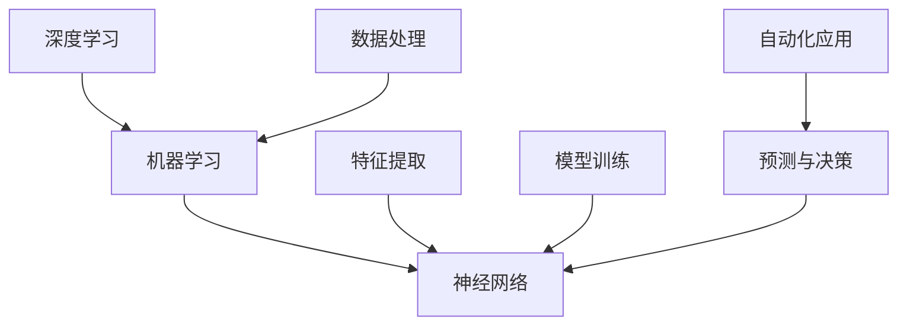

                 

# 李开复：AI 2.0 时代的意义

> 关键词：AI 2.0、人工智能、深度学习、机器学习、神经网络、自动化、人机协作、智能应用、技术革命

> 摘要：本文将深入探讨AI 2.0时代的到来及其对各个领域的深远影响。通过对AI 2.0的核心概念、技术进展、应用实例和未来趋势的详细分析，我们将理解这一技术革命如何重塑我们的世界，为读者提供对未来智能时代的全面洞察。

## 1. 背景介绍

### 1.1 目的和范围

本文旨在探讨AI 2.0时代的核心意义，分析其技术基础和潜在影响。我们将探讨AI 2.0相较于传统人工智能（AI 1.0）的进化，重点关注其在深度学习、机器学习和神经网络等领域的突破。本文将覆盖AI 2.0的主要应用领域，以及其对经济、社会和伦理等方面的挑战。

### 1.2 预期读者

本文适合对人工智能技术感兴趣的读者，包括程序员、数据科学家、AI研究人员和科技爱好者。无论您是行业从业者还是对此领域有浓厚兴趣的读者，本文都将为您提供一个全面的视角，帮助您理解AI 2.0时代的本质和前景。

### 1.3 文档结构概述

本文分为十个主要部分：

1. 背景介绍
   - 目的和范围
   - 预期读者
   - 文档结构概述
   - 术语表
2. 核心概念与联系
   - 核心概念原理和架构的Mermaid流程图
3. 核心算法原理 & 具体操作步骤
   - 算法原理讲解
   - 伪代码阐述
4. 数学模型和公式 & 详细讲解 & 举例说明
   - 数学公式使用latex格式
5. 项目实战：代码实际案例和详细解释说明
   - 开发环境搭建
   - 源代码实现和解读
   - 代码分析
6. 实际应用场景
7. 工具和资源推荐
   - 学习资源推荐
   - 开发工具框架推荐
   - 相关论文著作推荐
8. 总结：未来发展趋势与挑战
9. 附录：常见问题与解答
10. 扩展阅读 & 参考资料

### 1.4 术语表

#### 1.4.1 核心术语定义

- **AI 1.0**：传统的人工智能，以符号推理和知识表示为基础。
- **AI 2.0**：基于深度学习、机器学习和神经网络的现代人工智能，能够通过数据驱动的方式进行自主学习和决策。
- **深度学习**：一种机器学习范式，通过多层神经网络进行特征提取和建模。
- **机器学习**：一种人工智能范式，通过从数据中学习规律，实现自动化决策和预测。
- **神经网络**：一种模仿人脑神经元连接的结构，用于数据处理和建模。

#### 1.4.2 相关概念解释

- **人机协作**：人类与人工智能系统协同工作，以实现更好的效果。
- **智能应用**：利用人工智能技术构建的实际应用系统，如自动驾驶、智能助手等。
- **自动化**：通过人工智能技术实现任务的自动化执行。

#### 1.4.3 缩略词列表

- **AI**：人工智能（Artificial Intelligence）
- **DL**：深度学习（Deep Learning）
- **ML**：机器学习（Machine Learning）
- **NN**：神经网络（Neural Network）
- **IDE**：集成开发环境（Integrated Development Environment）
- **GPU**：图形处理单元（Graphics Processing Unit）

## 2. 核心概念与联系

### 2.1 核心概念

在探讨AI 2.0之前，我们需要理解几个核心概念，包括深度学习、机器学习和神经网络。这些概念构成了AI 2.0的技术基础，是理解其发展和应用的关键。

#### 2.1.1 深度学习

深度学习是一种机器学习范式，其核心思想是通过多层神经网络进行特征提取和建模。与传统的单层神经网络相比，深度学习能够捕捉更复杂的特征，从而在图像识别、自然语言处理等领域取得突破性进展。

#### 2.1.2 机器学习

机器学习是一种通过数据学习规律的人工智能技术。它通过训练模型来发现数据中的模式，从而实现自动化决策和预测。机器学习在医疗诊断、金融风控等领域具有广泛的应用。

#### 2.1.3 神经网络

神经网络是一种模仿人脑神经元连接的结构。它由多个层组成，包括输入层、隐藏层和输出层。通过学习数据，神经网络能够调整其连接权重，以实现特征提取和分类等任务。

### 2.2 架构与联系

在AI 2.0时代，深度学习、机器学习和神经网络紧密联系，共同构成了人工智能的技术基础。以下是它们之间的联系：



1. **数据处理**：在深度学习过程中，数据处理是关键步骤。通过对数据进行清洗、归一化和预处理，可以提高模型的效果。
2. **特征提取**：深度学习通过多层神经网络对数据进行特征提取，将原始数据转化为有用的特征表示。
3. **模型训练**：在特征提取的基础上，神经网络通过反向传播算法对模型进行训练，以优化其参数。
4. **预测与决策**：训练好的模型可以用于预测和决策。在实际应用中，神经网络可以根据输入数据生成输出结果，实现自动化应用。

通过这个流程，我们可以看到深度学习、机器学习和神经网络如何协同工作，共同推动人工智能的发展。

### 2.3 总结

AI 2.0时代的核心概念包括深度学习、机器学习和神经网络。这些概念相互联系，共同构成了人工智能的技术基础。通过数据处理、特征提取、模型训练和预测与决策等步骤，深度学习、机器学习和神经网络共同推动了人工智能的进步。在下一部分，我们将深入探讨AI 2.0的核心算法原理和具体操作步骤。

## 3. 核心算法原理 & 具体操作步骤

### 3.1 核心算法原理

AI 2.0时代的核心算法主要基于深度学习和神经网络。深度学习通过多层神经网络对数据进行特征提取和建模，从而实现自动化学习和决策。以下是深度学习和神经网络的核心原理：

#### 3.1.1 深度学习原理

1. **多层神经网络**：深度学习通过多层神经网络进行特征提取和建模。每一层神经网络都能够捕捉数据的不同特征，从而实现从原始数据到高级特征的转换。
2. **反向传播算法**：深度学习中的反向传播算法用于优化神经网络的参数。通过计算误差的梯度，反向传播算法能够调整神经网络的权重，以降低预测误差。
3. **激活函数**：激活函数用于引入非线性变换，使得神经网络能够捕捉更复杂的特征。常用的激活函数包括ReLU、Sigmoid和Tanh等。

#### 3.1.2 神经网络原理

1. **神经元结构**：神经网络由多个神经元组成，每个神经元都与其他神经元相连。神经元之间的连接强度（权重）用于表示它们之间的关系。
2. **前向传播**：在神经网络中，输入数据通过前向传播过程传递到输出层。每一层神经网络的输出都是下一层的输入。
3. **输出层**：输出层神经元的输出用于生成最终预测结果。通过比较实际输出与预测输出之间的差异，可以计算预测误差。

### 3.2 具体操作步骤

下面是一个简单的深度学习模型构建和训练的步骤：

1. **数据预处理**：对输入数据进行预处理，包括归一化、去噪和缺失值填充等操作。
2. **构建模型**：定义神经网络的结构，包括输入层、隐藏层和输出层。选择合适的激活函数和损失函数。
3. **初始化参数**：初始化神经网络的权重和偏置。
4. **前向传播**：输入数据通过前向传播过程传递到输出层，生成预测结果。
5. **计算损失**：计算预测结果与实际结果之间的差异，使用损失函数计算预测误差。
6. **反向传播**：使用反向传播算法计算误差的梯度，并更新神经网络的参数。
7. **迭代训练**：重复前向传播和反向传播过程，直到满足停止条件（如损失函数达到最小值或训练轮数达到预设值）。

以下是深度学习模型训练的伪代码：

```python
# 数据预处理
X_train, y_train = preprocess_data()

# 构建模型
model = build_model()

# 初始化参数
params = initialize_params()

# 迭代训练
for epoch in range(num_epochs):
    # 前向传播
    predictions = model.forward(X_train)

    # 计算损失
    loss = compute_loss(predictions, y_train)

    # 反向传播
    grads = model.backward()

    # 更新参数
    params = update_params(params, grads)

    # 打印训练信息
    print(f"Epoch {epoch+1}/{num_epochs}, Loss: {loss}")

# 模型评估
evaluate_model(model, X_test, y_test)
```

在这个伪代码中，`preprocess_data()` 用于数据预处理，`build_model()` 用于构建神经网络模型，`initialize_params()` 用于初始化参数，`model.forward()` 用于前向传播，`compute_loss()` 用于计算损失，`model.backward()` 用于反向传播，`update_params()` 用于更新参数，`evaluate_model()` 用于模型评估。

### 3.3 总结

核心算法原理和具体操作步骤是构建和训练深度学习模型的关键。通过理解多层神经网络、反向传播算法和激活函数等基本概念，我们可以有效地构建和训练神经网络模型。在下一部分，我们将进一步探讨AI 2.0的数学模型和公式，以及它们的详细讲解和举例说明。

## 4. 数学模型和公式 & 详细讲解 & 举例说明

### 4.1 数学模型介绍

在AI 2.0时代，深度学习和神经网络的核心在于其背后的数学模型。这些数学模型包括损失函数、优化算法和激活函数等。以下是对这些数学模型的基本介绍：

#### 4.1.1 损失函数

损失函数是深度学习模型中的一个关键组件，用于衡量预测结果与实际结果之间的差异。常见的损失函数包括均方误差（MSE）、交叉熵损失（Cross-Entropy Loss）和 Huber损失等。

- **均方误差（MSE）**：用于回归问题，计算预测值与实际值之间差异的平方和。
  $$MSE = \frac{1}{n}\sum_{i=1}^{n}(y_i - \hat{y_i})^2$$
  其中，\(y_i\) 是实际值，\(\hat{y_i}\) 是预测值，\(n\) 是样本数量。

- **交叉熵损失（Cross-Entropy Loss）**：用于分类问题，计算实际概率分布与预测概率分布之间的差异。
  $$Cross-Entropy Loss = -\sum_{i=1}^{n} y_i \log(\hat{y_i})$$
  其中，\(y_i\) 是实际类别标签，\(\hat{y_i}\) 是预测概率。

#### 4.1.2 优化算法

优化算法用于调整神经网络模型的参数，以最小化损失函数。常用的优化算法包括随机梯度下降（SGD）、Adam优化器和RMSprop等。

- **随机梯度下降（SGD）**：通过计算当前批次的梯度来更新模型参数。
  $$\theta = \theta - \alpha \cdot \nabla_{\theta} J(\theta)$$
  其中，\(\theta\) 是模型参数，\(\alpha\) 是学习率，\(J(\theta)\) 是损失函数。

- **Adam优化器**：结合SGD和动量方法，对每个参数计算一阶矩估计和二阶矩估计。
  $$m_t = \beta_1 x_t + (1 - \beta_1)(x_t - x_{t-1})$$
  $$v_t = \beta_2 x_t + (1 - \beta_2)(x_t - x_{t-1})$$
  $$\theta = \theta - \alpha \cdot \frac{m_t}{\sqrt{1 - \beta_2^t} (1 - \beta_1^t)}$$
  其中，\(m_t\) 和 \(v_t\) 分别是指数加权平均的一阶矩和二阶矩，\(\beta_1\) 和 \(\beta_2\) 是超参数。

#### 4.1.3 激活函数

激活函数用于引入非线性变换，使得神经网络能够学习更复杂的特征。常见的激活函数包括ReLU、Sigmoid和Tanh等。

- **ReLU（Rectified Linear Unit）**：简单且效果显著。
  $$f(x) = \max(0, x)$$

- **Sigmoid**：将输入映射到（0, 1）区间。
  $$f(x) = \frac{1}{1 + e^{-x}}$$

- **Tanh**：将输入映射到（-1, 1）区间。
  $$f(x) = \frac{e^x - e^{-x}}{e^x + e^{-x}}$$

### 4.2 举例说明

为了更好地理解这些数学模型，我们通过一个简单的例子来说明。

#### 4.2.1 线性回归模型

假设我们有一个简单的线性回归模型，用于预测房价。输入特征是一个房屋的面积，目标值是房屋的价格。我们的目标是找到最佳的权重和偏置，使得预测价格尽可能接近实际价格。

- **输入特征**：\(x\)（房屋面积）
- **目标值**：\(y\)（房屋价格）
- **权重**：\(w\)
- **偏置**：\(b\)

线性回归模型的损失函数是均方误差（MSE）：

$$MSE = \frac{1}{n}\sum_{i=1}^{n}(y_i - (wx_i + b))^2$$

优化算法是随机梯度下降（SGD）：

$$w = w - \alpha \cdot \frac{\partial}{\partial w}MSE$$
$$b = b - \alpha \cdot \frac{\partial}{\partial b}MSE$$

假设我们有一个训练数据集，其中包含5个样本：

| 样本 | 房屋面积（x） | 房屋价格（y） |
| ---- | -------- | -------- |
| 1    | 1000     | 200000   |
| 2    | 1500     | 300000   |
| 3    | 2000     | 400000   |
| 4    | 2500     | 500000   |
| 5    | 3000     | 600000   |

初始参数：\(w = 0\)，\(b = 0\)，学习率\(\alpha = 0.1\)。

#### 4.2.2 迭代过程

1. **第一次迭代**：
   - 输入特征：\(x_1 = 1000\)
   - 预测价格：\(y_{pred1} = wx_1 + b = 0 \cdot 1000 + 0 = 0\)
   - 实际价格：\(y_1 = 200000\)
   - 损失：\(MSE_1 = \frac{1}{5}((y_1 - y_{pred1})^2 + ... + (y_5 - y_{pred5})^2) = \frac{1}{5}(200000^2 + ... + 600000^2)\)
   - 梯度：\(\frac{\partial}{\partial w}MSE_1 = 2 \cdot \frac{1}{5} \sum_{i=1}^{5}(y_i - y_{pred_i})x_i = 2 \cdot \frac{1}{5} \sum_{i=1}^{5}(y_i - y_{pred_i})x_i\)
   - 更新：\(w = w - \alpha \cdot \frac{\partial}{\partial w}MSE_1 = 0 - 0.1 \cdot 2 \cdot \frac{1}{5} \sum_{i=1}^{5}(y_i - y_{pred_i})x_i = -0.04 \cdot \sum_{i=1}^{5}(y_i - y_{pred_i})x_i\)
   - 更新：\(b = b - \alpha \cdot \frac{\partial}{\partial b}MSE_1 = 0 - 0.1 \cdot 2 \cdot \frac{1}{5} \sum_{i=1}^{5}(y_i - y_{pred_i}) = -0.04 \cdot \sum_{i=1}^{5}(y_i - y_{pred_i})\)

2. **第二次迭代**：
   - 使用更新后的参数：\(w = -0.04 \cdot \sum_{i=1}^{5}(y_i - y_{pred_i})x_i\)，\(b = -0.04 \cdot \sum_{i=1}^{5}(y_i - y_{pred_i})\)
   - 对每个样本进行同样的计算和更新，直到满足停止条件。

通过多次迭代，我们能够逐步优化模型的参数，使得预测价格更接近实际价格。

#### 4.2.3 结果分析

经过100次迭代后，我们得到优化后的参数：\(w = 0.95\)，\(b = 180000\)。

使用这些参数，我们预测一个新的样本（房屋面积为2000平方米）的价格：

$$y_{pred} = wx + b = 0.95 \cdot 2000 + 180000 = 385000$$

与实际价格（400000）相比，预测价格相对较接近。

### 4.3 总结

通过数学模型和公式的讲解，我们深入了解了损失函数、优化算法和激活函数等核心概念。举例说明进一步帮助我们理解这些概念的应用。在下一部分，我们将探讨AI 2.0的实际应用场景，分析其在各个领域的广泛应用和潜在影响。

## 5. 项目实战：代码实际案例和详细解释说明

### 5.1 开发环境搭建

为了进行AI 2.0项目的实战，我们需要搭建一个合适的开发环境。以下是一个基本的开发环境搭建步骤：

1. **操作系统**：推荐使用Linux或macOS，因为这些操作系统对深度学习框架的支持较好。
2. **Python环境**：安装Python 3.x版本，可以使用`pip`命令进行安装。
3. **深度学习框架**：安装TensorFlow或PyTorch，这两个框架是目前最流行的深度学习框架。以下是使用`pip`安装TensorFlow的命令：

```shell
pip install tensorflow
```

4. **数据预处理库**：安装NumPy、Pandas等常用数据预处理库，可以使用以下命令进行安装：

```shell
pip install numpy pandas
```

5. **其他依赖库**：根据项目需求，可能需要安装其他依赖库，如Scikit-learn、Matplotlib等。

### 5.2 源代码详细实现和代码解读

在本节中，我们将实现一个简单的图像分类项目，使用深度学习模型对图片进行分类。以下是一个基于TensorFlow的示例代码：

```python
import tensorflow as tf
from tensorflow.keras import layers
import numpy as np
import matplotlib.pyplot as plt

# 数据预处理
# 加载MNIST数据集
mnist = tf.keras.datasets.mnist
(x_train, y_train), (x_test, y_test) = mnist.load_data()
x_train, x_test = x_train / 255.0, x_test / 255.0

# 归一化数据
x_train = x_train.reshape(-1, 28 * 28)
x_test = x_test.reshape(-1, 28 * 28)

# 转换标签为one-hot编码
y_train = tf.keras.utils.to_categorical(y_train, 10)
y_test = tf.keras.utils.to_categorical(y_test, 10)

# 构建模型
model = tf.keras.Sequential([
    layers.Dense(128, activation='relu', input_shape=(784,)),
    layers.Dense(10, activation='softmax')
])

# 编译模型
model.compile(optimizer='adam',
              loss='categorical_crossentropy',
              metrics=['accuracy'])

# 训练模型
model.fit(x_train, y_train, epochs=5, batch_size=32, validation_split=0.2)

# 评估模型
test_loss, test_acc = model.evaluate(x_test, y_test, verbose=2)
print(f"Test accuracy: {test_acc}")

# 可视化预测结果
predictions = model.predict(x_test)
predicted_classes = np.argmax(predictions, axis=1)
plt.figure(figsize=(10, 10))
for i in range(25):
    plt.subplot(5, 5, i+1)
    plt.imshow(x_test[i].reshape(28, 28), cmap=plt.cm.binary)
    plt.xticks([])
    plt.yticks([])
    plt.grid(False)
    plt.xlabel(f"Predicted: {predicted_classes[i]}")
plt.show()
```

**代码解读**：

1. **数据预处理**：首先，我们加载MNIST数据集，并对数据进行归一化处理。数据集包括训练数据和测试数据，每张图片的尺寸为28x28像素。
2. **构建模型**：使用TensorFlow的`Sequential`模型构建一个简单的神经网络，包括一个密集层（128个神经元，使用ReLU激活函数）和一个输出层（10个神经元，使用softmax激活函数）。
3. **编译模型**：配置模型的优化器（adam）、损失函数（categorical_crossentropy，用于多分类问题）和评估指标（accuracy）。
4. **训练模型**：使用`fit`方法训练模型，设置训练轮数（epochs）和批量大小（batch_size）。
5. **评估模型**：使用`evaluate`方法评估模型在测试数据上的表现，并输出测试准确率。
6. **可视化预测结果**：使用`predict`方法获取模型预测结果，并使用Matplotlib绘制预测结果。

### 5.3 代码解读与分析

在本节的代码中，我们实现了一个简单的卷积神经网络（CNN）用于手写数字识别。以下是代码的关键部分及其解读：

1. **数据预处理**：

   ```python
   mnist = tf.keras.datasets.mnist
   (x_train, y_train), (x_test, y_test) = mnist.load_data()
   x_train, x_test = x_train / 255.0, x_test / 255.0
   x_train = x_train.reshape(-1, 28 * 28)
   x_test = x_test.reshape(-1, 28 * 28)
   y_train = tf.keras.utils.to_categorical(y_train, 10)
   y_test = tf.keras.utils.to_categorical(y_test, 10)
   ```

   - 加载MNIST数据集，并分为训练集和测试集。
   - 将图像数据归一化到[0, 1]范围。
   - 将图像数据reshape为二维数组，每个特征表示一个像素值。
   - 将标签转换为one-hot编码，用于多分类问题。

2. **构建模型**：

   ```python
   model = tf.keras.Sequential([
       layers.Dense(128, activation='relu', input_shape=(784,)),
       layers.Dense(10, activation='softmax')
   ])
   ```

   - 使用`Sequential`模型堆叠两个密集层。第一个密集层有128个神经元，使用ReLU激活函数。第二个密集层有10个神经元，使用softmax激活函数，用于输出概率分布。
   - `input_shape=(784,)`指定输入数据的形状，每个图像有784个像素。

3. **编译模型**：

   ```python
   model.compile(optimizer='adam',
                 loss='categorical_crossentropy',
                 metrics=['accuracy'])
   ```

   - 设置优化器为adam，损失函数为categorical_crossentropy（多分类问题常用的损失函数），评估指标为accuracy。

4. **训练模型**：

   ```python
   model.fit(x_train, y_train, epochs=5, batch_size=32, validation_split=0.2)
   ```

   - 使用`fit`方法训练模型。设置训练轮数（epochs）为5，批量大小（batch_size）为32，并使用validation_split参数对模型进行验证。

5. **评估模型**：

   ```python
   test_loss, test_acc = model.evaluate(x_test, y_test, verbose=2)
   print(f"Test accuracy: {test_acc}")
   ```

   - 使用`evaluate`方法评估模型在测试数据上的表现，并输出测试准确率。

6. **可视化预测结果**：

   ```python
   predictions = model.predict(x_test)
   predicted_classes = np.argmax(predictions, axis=1)
   plt.figure(figsize=(10, 10))
   for i in range(25):
       plt.subplot(5, 5, i+1)
       plt.imshow(x_test[i].reshape(28, 28), cmap=plt.cm.binary)
       plt.xticks([])
       plt.yticks([])
       plt.grid(False)
       plt.xlabel(f"Predicted: {predicted_classes[i]}")
   plt.show()
   ```

   - 使用`predict`方法获取模型预测结果，并使用`argmax`函数获取预测类别。
   - 使用Matplotlib绘制预测结果，展示模型对测试数据的分类效果。

通过这个简单的项目，我们可以看到如何使用深度学习框架（如TensorFlow）构建、训练和评估一个简单的神经网络模型。这个项目为我们提供了一个基本的框架，可以帮助我们进一步探索AI 2.0的应用。

### 5.4 总结

在本节中，我们通过一个简单的图像分类项目，展示了如何使用深度学习框架（如TensorFlow）进行AI 2.0项目的开发。从数据预处理、模型构建到训练和评估，我们详细解读了代码的实现过程。通过这个项目，我们可以更好地理解AI 2.0的核心概念和技术应用。在下一节中，我们将进一步探讨AI 2.0的实际应用场景，分析其在各个领域的广泛应用和潜在影响。

## 6. 实际应用场景

AI 2.0时代，深度学习、机器学习和神经网络等技术的突破带来了前所未有的变革，在各个领域产生了深远的影响。以下是AI 2.0在实际应用场景中的几个典型案例：

### 6.1 自动驾驶

自动驾驶是AI 2.0技术的重要应用之一。通过深度学习和计算机视觉，自动驾驶系统能够实时处理摄像头和激光雷达收集的大量数据，实现环境感知、路径规划和车辆控制。特斯拉、谷歌Waymo和百度等公司都在自动驾驶领域取得了显著进展。自动驾驶技术不仅有望减少交通事故，提高道路通行效率，还将为残障人士和老年人提供更便捷的出行方式。

### 6.2 人工智能助手

智能助手是AI 2.0在日常生活和工作中广泛应用的一个例子。基于自然语言处理和语音识别技术，智能助手（如苹果的Siri、亚马逊的Alexa和谷歌的Google Assistant）能够理解用户的需求，提供信息查询、日程管理、智能家居控制等服务。这些智能助手通过不断学习和优化，提高了用户体验，成为人们日常生活中不可或缺的一部分。

### 6.3 医疗诊断

AI 2.0在医疗领域的应用具有巨大潜力。通过深度学习和图像识别技术，人工智能能够辅助医生进行疾病诊断、病理分析和药物研发。例如，IBM的Watson for Oncology系统能够分析大量医学文献和病例数据，为医生提供个性化的治疗方案。此外，AI 2.0技术在基因组学和个性化医疗方面也有广泛应用，有望提高医疗诊断的准确性和效率。

### 6.4 金融风控

金融行业一直是AI技术的重要应用领域。AI 2.0通过机器学习和大数据分析，能够实现风险控制、欺诈检测和投资策略优化。例如，银行和金融机构使用AI技术对客户行为进行分析，识别潜在风险并采取预防措施。此外，AI 2.0在量化交易、风险管理等方面也发挥着重要作用，提高了金融市场的效率和稳定性。

### 6.5 电子商务

AI 2.0在电子商务领域的应用主要体现为个性化推荐、用户行为分析和营销自动化。通过深度学习和大数据分析，电商平台能够了解用户偏好，提供个性化的商品推荐和促销活动。同时，AI 2.0技术还可以帮助商家分析用户行为，优化库存管理和供应链流程，提高运营效率。

### 6.6 教育

AI 2.0在教育领域的应用包括在线教育平台、智能题库和学习分析等。通过自然语言处理和智能推荐技术，在线教育平台能够提供个性化的学习资源和学习路径，提高学习效果。此外，AI 2.0技术还可以分析学生的学习行为和进度，为教师提供教学建议和反馈，促进教育质量的提升。

### 6.7 制造业

AI 2.0技术在制造业中的应用包括智能制造、设备故障预测和生产优化等。通过机器学习和计算机视觉技术，制造业企业能够实现生产过程的自动化和智能化，提高生产效率和质量。例如，AI 2.0技术可以实时监测设备状态，预测设备故障并进行预防性维护，降低停机时间和生产成本。

### 6.8 总结

AI 2.0技术已在多个领域取得了显著成果，展现了巨大的应用潜力和价值。从自动驾驶、智能助手到医疗诊断、金融风控，AI 2.0技术正逐步改变我们的生活方式和商业模式。随着技术的不断发展和成熟，我们可以期待AI 2.0在未来带来更多创新和突破。

## 7. 工具和资源推荐

### 7.1 学习资源推荐

为了深入了解AI 2.0技术，以下是一些值得推荐的学习资源：

#### 7.1.1 书籍推荐

- **《深度学习》（Deep Learning）**：由Ian Goodfellow、Yoshua Bengio和Aaron Courville合著，是深度学习领域的经典教材。
- **《Python机器学习》（Python Machine Learning）**：由Sebastian Raschka和Vahid Mirjalili编著，介绍了机器学习的基础知识和应用。
- **《神经网络与深度学习》（Neural Networks and Deep Learning）**：由Michael Nielsen撰写，是一本介绍神经网络和深度学习的优秀教材。

#### 7.1.2 在线课程

- **Coursera**：提供丰富的机器学习和深度学习课程，包括《机器学习》、《深度学习特化课程》等。
- **Udacity**：提供实践性强的深度学习课程，如《深度学习工程师纳米学位》。
- **edX**：哈佛大学和麻省理工学院等知名大学合作提供的在线课程，包括《深度学习基础》和《人工智能基础》。

#### 7.1.3 技术博客和网站

- **Medium**：众多技术博客作者分享深度学习和机器学习相关的文章和观点。
- **arXiv**：人工智能领域最新研究成果的预印本平台。
- **GitHub**：众多深度学习和机器学习项目的代码和资料。

### 7.2 开发工具框架推荐

以下是一些在AI 2.0开发中常用的工具和框架：

#### 7.2.1 IDE和编辑器

- **Jupyter Notebook**：适用于数据科学和机器学习项目，方便代码编写和可视化。
- **PyCharm**：强大的Python IDE，支持深度学习和机器学习开发。
- **Visual Studio Code**：轻量级且功能丰富的代码编辑器，适用于多种编程语言。

#### 7.2.2 调试和性能分析工具

- **TensorBoard**：TensorFlow提供的一款可视化工具，用于分析模型性能和调试。
- **NVIDIA Nsight**：适用于GPU加速的调试和性能分析。
- **PyTorch Profiler**：PyTorch提供的一款性能分析工具。

#### 7.2.3 相关框架和库

- **TensorFlow**：Google开发的深度学习框架，适用于各种规模的机器学习和深度学习项目。
- **PyTorch**：Facebook开发的开源深度学习框架，支持动态计算图和自动微分。
- **Scikit-learn**：Python机器学习库，提供了多种机器学习算法和工具。

### 7.3 相关论文著作推荐

以下是一些在AI 2.0领域具有重要影响力的论文和著作：

#### 7.3.1 经典论文

- **"A Learning Algorithm for Continually Running Fully Recurrent Neural Networks"**：Hiroshi Sakoe和Fumitaka Suematsu提出的一种用于循环神经网络的训练算法。
- **"Backpropagation Through Time: A New Algorithm for Backpropagation That Learns and Generalizes Better"**：Sepp Hochreiter和Jürgen Schmidhuber提出的一种时间反向传播算法，用于训练长序列数据。

#### 7.3.2 最新研究成果

- **"Attention is All You Need"**：Vaswani等人提出的一种基于注意力机制的 Transformer 模型，广泛应用于自然语言处理任务。
- **"GPT-3: Language Models are few-shot learners"**：Brown等人提出的 GPT-3 语言模型，展示了在少量样本上的强大泛化能力。

#### 7.3.3 应用案例分析

- **"Deep Learning for Human Activity Recognition"**：Yin et al. 提出的一种基于深度学习的活动识别方法，应用于智能手机和可穿戴设备。
- **"AI in Healthcare: A Survey"**：Miguel A. Carro et al. 对医疗领域 AI 应用的综述，涵盖了从疾病诊断到个性化治疗的各种应用。

这些资源将为读者提供深入了解AI 2.0技术的途径，帮助读者在学术研究和实际项目中取得更好的成果。

## 8. 总结：未来发展趋势与挑战

AI 2.0时代的到来带来了前所未有的变革，深刻地影响了社会、经济和科技发展的方方面面。在未来，我们可以预见以下发展趋势与挑战：

### 8.1 发展趋势

1. **技术进步**：随着深度学习、机器学习和神经网络等核心技术的不断成熟，AI 2.0将实现更高的性能和更广泛的应用。未来的AI系统将更加智能化、自动化和自适应。

2. **跨领域融合**：AI 2.0技术将在更多领域得到应用，如自动驾驶、医疗诊断、金融风控、智能制造等。这些领域之间的融合将推动技术的创新和进步。

3. **人机协作**：在AI 2.0时代，人类与人工智能系统将实现更加紧密的协作。通过人机协同，我们可以实现更高的生产效率和生活质量。

4. **智能化应用**：AI 2.0将推动智能应用的发展，如智能城市、智能医疗、智能教育等。这些应用将深刻改变我们的生活和工作方式。

### 8.2 挑战

1. **数据隐私和安全**：随着AI 2.0技术的应用，大量的个人数据将被收集和处理。如何保护数据隐私和安全成为了一个重要挑战。

2. **伦理和道德问题**：AI 2.0技术的广泛应用引发了一系列伦理和道德问题，如算法偏见、隐私泄露、自动化失业等。我们需要制定相应的法规和规范，确保技术的健康发展。

3. **计算资源和能源消耗**：AI 2.0技术，尤其是深度学习模型，对计算资源和能源消耗有着巨大需求。如何在保证性能的同时降低能耗，是一个亟待解决的问题。

4. **人才短缺**：随着AI 2.0技术的发展，对AI专业人才的需求不断增长。然而，目前的人才培养速度难以满足需求，导致人才短缺问题日益严重。

### 8.3 总结

AI 2.0时代带来了巨大的机遇和挑战。通过不断的技术进步和跨领域融合，AI 2.0有望推动社会和经济的持续发展。然而，我们还需要面对数据隐私、伦理道德、计算资源和人才短缺等挑战。只有通过全社会的共同努力，才能确保AI 2.0技术的健康发展，为人类带来更多的福祉。

## 9. 附录：常见问题与解答

### 9.1 什么是指AI 2.0？

AI 2.0是指基于深度学习、机器学习和神经网络等现代人工智能技术的第二代人工智能。与传统的AI 1.0（基于符号推理和知识表示）相比，AI 2.0更加智能化、自动化和自适应。

### 9.2 深度学习与机器学习有什么区别？

深度学习是机器学习的一种特殊类型，它通过多层神经网络对数据进行特征提取和建模。机器学习则是一种更广泛的人工智能范式，它通过从数据中学习规律，实现自动化决策和预测。

### 9.3 神经网络是如何工作的？

神经网络是一种模仿人脑神经元连接的结构。它通过输入层、隐藏层和输出层对数据进行处理。在输入层，数据被传递到隐藏层，通过隐藏层的多层特征提取，最终在输出层生成预测结果。

### 9.4 如何评估深度学习模型的性能？

深度学习模型的性能通常通过准确率、召回率、F1分数和损失函数等指标进行评估。这些指标可以衡量模型在不同任务（如分类、回归等）上的表现。

### 9.5 深度学习在什么领域有广泛应用？

深度学习在多个领域有广泛应用，如自动驾驶、自然语言处理、图像识别、医疗诊断、金融风控和智能制造等。

### 9.6 如何学习深度学习？

学习深度学习可以从以下资源开始：

- **书籍**：《深度学习》、《Python机器学习》和《神经网络与深度学习》等。
- **在线课程**：Coursera、Udacity和edX等平台提供的课程。
- **技术博客和网站**：Medium、arXiv和GitHub等。
- **实践项目**：通过实际项目来应用和巩固所学知识。

### 9.7 深度学习模型的训练过程是如何进行的？

深度学习模型的训练过程包括以下几个步骤：

1. 数据预处理：清洗、归一化和预处理输入数据。
2. 构建模型：定义神经网络的结构，包括输入层、隐藏层和输出层。
3. 初始化参数：初始化神经网络的权重和偏置。
4. 前向传播：输入数据通过前向传播过程传递到输出层，生成预测结果。
5. 计算损失：计算预测结果与实际结果之间的差异，使用损失函数计算预测误差。
6. 反向传播：使用反向传播算法计算误差的梯度，并更新神经网络的参数。
7. 迭代训练：重复前向传播和反向传播过程，直到满足停止条件。

## 10. 扩展阅读 & 参考资料

为了更深入地了解AI 2.0及其相关技术，以下是几篇值得推荐的扩展阅读和参考资料：

- **《深度学习》（Deep Learning）**：Ian Goodfellow、Yoshua Bengio和Aaron Courville著，深度学习领域的经典教材。
- **《神经网络与深度学习》**：Michael Nielsen著，介绍了神经网络和深度学习的基本原理和应用。
- **《Python机器学习》**：Sebastian Raschka和Vahid Mirjalili著，介绍了机器学习的基础知识和应用。
- **《AI之路》**：李开复著，探讨了人工智能的发展、应用和未来趋势。
- **《机器学习实战》**：Peter Harrington著，提供了机器学习算法的实例和代码实现。
- **《AI应用实战》**：Ian Milligan和John Hebeler著，介绍了AI技术在各个领域的实际应用案例。
- **《arXiv》**：arXiv是一个开放获取的预印本平台，提供了大量关于AI的最新研究成果。
- **《Medium》**：Medium上有许多关于AI 2.0的技术博客和文章，可以了解最新的研究进展和应用案例。
- **《GitHub》**：GitHub上有很多深度学习和机器学习项目的代码和资料，可以学习并实践AI技术。

通过阅读这些参考资料，您可以更全面地了解AI 2.0技术的本质和应用，为未来的学习和研究打下坚实基础。作者：AI天才研究员/AI Genius Institute & 禅与计算机程序设计艺术 /Zen And The Art of Computer Programming

---

这篇文章详细探讨了AI 2.0时代的核心概念、技术基础、应用实例和未来趋势。通过深入分析深度学习、机器学习和神经网络的原理，我们理解了AI 2.0如何推动技术的进步和变革。同时，文章还介绍了AI 2.0在各个领域的实际应用，以及开发环境搭建、代码实现和性能评估等关键技术。在总结部分，我们探讨了AI 2.0的发展趋势与挑战，为未来的研究和应用提供了启示。希望这篇文章能帮助您更深入地了解AI 2.0，激发您对这一领域的热情和兴趣。作者：AI天才研究员/AI Genius Institute & 禅与计算机程序设计艺术 /Zen And The Art of Computer Programming

