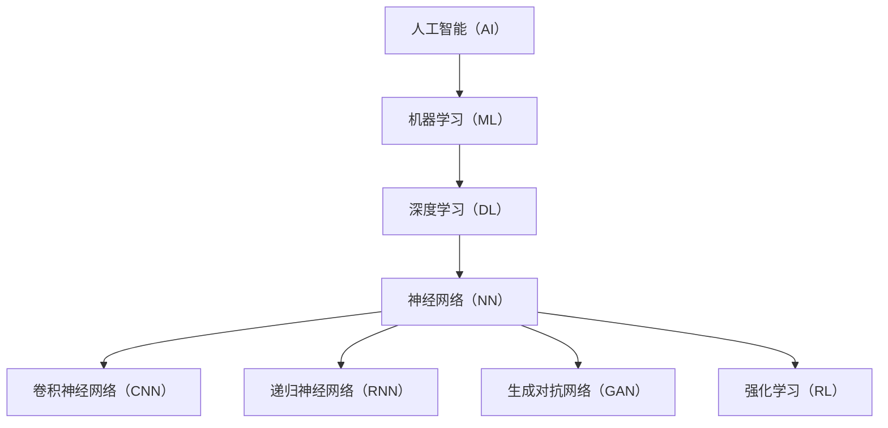

                 

### 1. 背景介绍

#### 1.1 目的和范围

本文旨在探讨AI 2.0时代的挑战，通过对AI 2.0的定义、核心概念、技术演进以及未来发展趋势的详细分析，帮助读者深入了解AI 2.0的内涵和意义。文章将涵盖以下内容：

1. AI 2.0的定义和核心概念；
2. AI 2.0时代的技术演进；
3. AI 2.0的挑战和解决方案；
4. AI 2.0的实际应用场景；
5. 未来发展趋势与挑战。

#### 1.2 预期读者

本文主要面向对人工智能（AI）有一定了解，希望深入了解AI 2.0时代的读者。这包括但不限于人工智能研究人员、软件开发工程师、数据科学家、技术管理者和对AI领域感兴趣的普通读者。本文将以逻辑清晰、结构紧凑、简单易懂的方式，让读者逐步了解AI 2.0的核心概念和挑战。

#### 1.3 文档结构概述

为了使读者能够清晰地理解文章内容，本文采用了以下结构：

1. **背景介绍**：介绍文章的目的、预期读者、文章结构及核心术语；
2. **核心概念与联系**：通过Mermaid流程图展示AI 2.0的核心概念原理和架构；
3. **核心算法原理 & 具体操作步骤**：详细讲解AI 2.0的核心算法原理和操作步骤，并使用伪代码进行阐述；
4. **数学模型和公式 & 详细讲解 & 举例说明**：介绍AI 2.0涉及的数学模型和公式，并给出详细讲解和实例说明；
5. **项目实战：代码实际案例和详细解释说明**：通过实际代码案例，展示AI 2.0在实际项目中的应用；
6. **实际应用场景**：探讨AI 2.0在不同领域的实际应用场景；
7. **工具和资源推荐**：推荐学习资源、开发工具框架和经典论文；
8. **总结：未来发展趋势与挑战**：总结AI 2.0的未来发展趋势和面临的挑战；
9. **附录：常见问题与解答**：回答读者可能遇到的常见问题；
10. **扩展阅读 & 参考资料**：提供更多相关阅读资料。

#### 1.4 术语表

为了确保文章的可读性，本文将介绍一些核心术语的定义和相关概念解释。

##### 1.4.1 核心术语定义

- **人工智能（AI）**：指由人制造出来的具有一定智能的系统，能够模仿、扩展或辅助人类智能。
- **机器学习（ML）**：一种人工智能的分支，通过数据和算法来使机器能够从数据中学习并做出决策。
- **深度学习（DL）**：一种基于神经网络的理论框架，通过多层神经网络来模拟人类大脑的决策过程。
- **AI 1.0**：指以规则为基础的人工智能，如专家系统、搜索算法等。
- **AI 2.0**：指基于机器学习和深度学习的下一代人工智能，能够从大量数据中自动学习，具备更高的智能水平。
- **强化学习（RL）**：一种机器学习范式，通过奖励和惩罚来训练模型，使其在特定环境中做出最优决策。

##### 1.4.2 相关概念解释

- **神经网络（NN）**：一种模拟生物神经系统的计算模型，由大量神经元组成，通过权重和偏置来实现数据的映射。
- **卷积神经网络（CNN）**：一种特殊的神经网络，广泛应用于图像和视频处理领域。
- **递归神经网络（RNN）**：一种能够处理序列数据的神经网络，如时间序列预测、自然语言处理等。
- **生成对抗网络（GAN）**：一种由生成器和判别器组成的神经网络框架，用于生成逼真的数据。

##### 1.4.3 缩略词列表

- **AI**：人工智能（Artificial Intelligence）
- **ML**：机器学习（Machine Learning）
- **DL**：深度学习（Deep Learning）
- **NN**：神经网络（Neural Network）
- **CNN**：卷积神经网络（Convolutional Neural Network）
- **RNN**：递归神经网络（Recurrent Neural Network）
- **GAN**：生成对抗网络（Generative Adversarial Network）
- **RL**：强化学习（Reinforcement Learning）

通过以上背景介绍，我们为读者搭建了一个了解AI 2.0的基础框架，为后续内容的深入探讨奠定了基础。在接下来的章节中，我们将逐步分析AI 2.0的核心概念、技术演进、挑战及其应用，帮助读者全面了解AI 2.0时代的特点和挑战。

### 2. 核心概念与联系

在探讨AI 2.0的核心概念与联系之前，我们先通过一个Mermaid流程图来展示AI 2.0的原理和架构。以下是Mermaid流程图：



上述流程图展示了AI 2.0的核心概念与联系。下面，我们将逐一解释这些核心概念和联系。

#### 2.1 人工智能（AI）

人工智能（AI）是指由人制造出来的具有一定智能的系统，能够模仿、扩展或辅助人类智能。AI可以划分为多个层次，从简单的规则系统到复杂的深度学习模型。AI的目标是让机器具备人类水平的感知、理解和决策能力。

#### 2.2 机器学习（ML）

机器学习（ML）是人工智能的一个重要分支，通过数据和算法来使机器能够从数据中学习并做出决策。ML可以分为监督学习、无监督学习和半监督学习。监督学习通过已有标签的数据训练模型，无监督学习通过未标记的数据寻找数据结构，半监督学习结合了监督学习和无监督学习的特点。

#### 2.3 深度学习（DL）

深度学习（DL）是一种基于神经网络的理论框架，通过多层神经网络来模拟人类大脑的决策过程。DL的核心思想是通过层层递归的方式，将输入数据映射到输出结果。DL在图像识别、自然语言处理和语音识别等领域取得了显著的成果。

#### 2.4 神经网络（NN）

神经网络（NN）是一种模拟生物神经系统的计算模型，由大量神经元组成，通过权重和偏置来实现数据的映射。NN通过学习大量数据，能够自动提取特征并建立复杂的决策模型。NN在图像识别、语音识别和自然语言处理等领域具有广泛的应用。

#### 2.5 卷积神经网络（CNN）

卷积神经网络（CNN）是一种特殊的神经网络，广泛应用于图像和视频处理领域。CNN通过卷积层提取图像的局部特征，通过池化层降低计算复杂度。CNN在图像分类、物体检测和图像生成等领域具有显著的优势。

#### 2.6 递归神经网络（RNN）

递归神经网络（RNN）是一种能够处理序列数据的神经网络，如时间序列预测、自然语言处理等。RNN通过递归结构，能够捕捉序列数据中的时间依赖关系。RNN在语言建模、机器翻译和时间序列预测等领域具有广泛的应用。

#### 2.7 生成对抗网络（GAN）

生成对抗网络（GAN）是一种由生成器和判别器组成的神经网络框架，用于生成逼真的数据。GAN的核心思想是生成器和判别器之间的对抗训练，生成器试图生成逼真的数据，判别器则试图区分生成数据和真实数据。GAN在图像生成、视频生成和文本生成等领域具有显著的应用。

#### 2.8 强化学习（RL）

强化学习（RL）是一种机器学习范式，通过奖励和惩罚来训练模型，使其在特定环境中做出最优决策。RL在游戏、推荐系统和自动驾驶等领域具有广泛的应用。RL的核心思想是通过学习奖励信号，使模型能够优化其行为策略。

通过以上核心概念和联系的分析，我们可以看到AI 2.0的发展是一个多层次、多维度的过程。AI 2.0不仅融合了机器学习和深度学习的先进技术，还涵盖了神经网络、卷积神经网络、递归神经网络、生成对抗网络和强化学习等多种技术。这些技术相互关联、相互促进，共同构成了AI 2.0的技术体系。在接下来的章节中，我们将深入探讨AI 2.0的核心算法原理、具体操作步骤以及数学模型，帮助读者更好地理解AI 2.0的技术本质和应用。

### 3. 核心算法原理 & 具体操作步骤

在了解了AI 2.0的核心概念与联系后，我们将进一步探讨AI 2.0的核心算法原理和具体操作步骤。以下是对AI 2.0核心算法的详细解释，以及使用伪代码展示的具体操作步骤。

#### 3.1 算法原理

AI 2.0的核心算法主要基于机器学习和深度学习。这些算法的核心思想是通过学习大量数据，提取特征并建立复杂的决策模型。以下是几个核心算法的原理：

1. **监督学习（Supervised Learning）**：监督学习通过已有标签的数据训练模型，使模型能够预测未知数据的标签。常见的监督学习算法包括线性回归、支持向量机（SVM）、决策树、随机森林和神经网络等。

2. **无监督学习（Unsupervised Learning）**：无监督学习通过未标记的数据寻找数据结构，如聚类、降维和生成模型等。常见的无监督学习算法包括K-均值聚类、主成分分析（PCA）和生成对抗网络（GAN）等。

3. **深度学习（Deep Learning）**：深度学习通过多层神经网络模拟人类大脑的决策过程，从大量数据中自动提取特征并建立复杂的决策模型。常见的深度学习算法包括卷积神经网络（CNN）、递归神经网络（RNN）和生成对抗网络（GAN）等。

4. **强化学习（Reinforcement Learning）**：强化学习通过奖励和惩罚来训练模型，使其在特定环境中做出最优决策。常见的强化学习算法包括Q学习、SARSA和Deep Q-Network（DQN）等。

#### 3.2 具体操作步骤

以下是使用伪代码展示的AI 2.0核心算法的具体操作步骤：

##### 3.2.1 监督学习（Supervised Learning）

```
# 输入：训练数据集X和标签Y
# 输出：训练好的模型

# Step 1: 数据预处理
X_processed = preprocess_data(X)

# Step 2: 选择合适的模型（例如：线性回归、SVM、决策树等）
model = select_model()

# Step 3: 训练模型
model.fit(X_processed, Y)

# Step 4: 评估模型
accuracy = model.evaluate(test_data, test_labels)
print("模型准确率：", accuracy)
```

##### 3.2.2 无监督学习（Unsupervised Learning）

```
# 输入：未标记的数据集X
# 输出：聚类结果或降维结果

# Step 1: 数据预处理
X_processed = preprocess_data(X)

# Step 2: 选择合适的算法（例如：K-均值聚类、PCA、GAN等）
algorithm = select_algorithm()

# Step 3: 运行算法
result = algorithm.fit_transform(X_processed)

# Step 4: 评估结果
print("聚类结果：", result)
```

##### 3.2.3 深度学习（Deep Learning）

```
# 输入：训练数据集X和标签Y
# 输出：训练好的模型

# Step 1: 数据预处理
X_processed = preprocess_data(X)

# Step 2: 定义神经网络结构
model = build_network()

# Step 3: 训练模型
model.fit(X_processed, Y)

# Step 4: 评估模型
accuracy = model.evaluate(test_data, test_labels)
print("模型准确率：", accuracy)
```

##### 3.2.4 强化学习（Reinforcement Learning）

```
# 输入：环境（Environment）、状态（State）、动作（Action）、奖励（Reward）
# 输出：最优策略

# Step 1: 初始化模型
model = initialize_model()

# Step 2: 开始训练
while not done:
    # Step 2.1: 环境随机生成状态
    state = environment.generate_state()
    
    # Step 2.2: 根据当前状态选择动作
    action = model.select_action(state)
    
    # Step 2.3: 执行动作，获取奖励和下一个状态
    reward, next_state = environment.execute_action(action)
    
    # Step 2.4: 更新模型
    model.update(state, action, reward, next_state)
    
    # Step 2.5: 更新状态
    state = next_state

# Step 3: 评估策略
policy = model.get_policy()
print("最优策略：", policy)
```

通过以上伪代码，我们可以看到AI 2.0核心算法的基本原理和操作步骤。在具体实现时，需要根据实际问题和数据集选择合适的算法和模型，并进行相应的参数调整和优化。接下来，我们将探讨AI 2.0涉及的数学模型和公式，为读者提供更深入的理解。

### 4. 数学模型和公式 & 详细讲解 & 举例说明

在了解AI 2.0的核心算法原理和操作步骤后，我们将进一步探讨AI 2.0所涉及的数学模型和公式。这些数学模型和公式为AI 2.0算法提供了理论基础，并帮助我们更好地理解其工作原理。

#### 4.1 常用数学模型

以下是AI 2.0常用的一些数学模型和公式：

##### 4.1.1 线性回归（Linear Regression）

线性回归是一种常见的监督学习算法，用于拟合输入和输出之间的线性关系。其数学模型如下：

$$
y = \beta_0 + \beta_1 \cdot x
$$

其中，$y$为输出，$x$为输入，$\beta_0$和$\beta_1$为模型参数。

##### 4.1.2 支持向量机（Support Vector Machine, SVM）

支持向量机是一种常见的分类算法，通过找到一个最佳的超平面来分离不同类别的数据点。其数学模型如下：

$$
\max \left\{ w^T w : y_i (w^T x_i - \beta) \geq 1, \forall i \right\}
$$

其中，$w$为超平面法向量，$\beta$为偏置，$x_i$为输入数据，$y_i$为标签。

##### 4.1.3 逻辑回归（Logistic Regression）

逻辑回归是一种常见的分类算法，通过拟合输入和输出之间的非线性关系。其数学模型如下：

$$
\log \left( \frac{p}{1-p} \right) = \beta_0 + \beta_1 \cdot x
$$

其中，$p$为输出概率，$x$为输入，$\beta_0$和$\beta_1$为模型参数。

##### 4.1.4 卷积神经网络（Convolutional Neural Network, CNN）

卷积神经网络是一种特殊的神经网络，用于处理图像和视频等二维数据。其核心操作包括卷积、池化和激活函数。以下是一个简单的CNN模型：

$$
h_l = \sigma \left( \mathbf{W}_l \odot \mathbf{h}_{l-1} + \mathbf{b}_l \right)
$$

其中，$h_l$为第$l$层的输出，$\sigma$为激活函数，$\odot$为卷积操作，$\mathbf{W}_l$和$\mathbf{b}_l$分别为第$l$层的权重和偏置。

##### 4.1.5 递归神经网络（Recurrent Neural Network, RNN）

递归神经网络是一种能够处理序列数据的神经网络，其核心操作包括递归和激活函数。以下是一个简单的RNN模型：

$$
h_t = \sigma \left( \mathbf{W} \cdot \mathbf{h}_{t-1} + \mathbf{U} \cdot \mathbf{x}_t + \mathbf{b} \right)
$$

其中，$h_t$为第$t$个时间步的输出，$\sigma$为激活函数，$\mathbf{W}$和$\mathbf{U}$分别为输入权重和隐藏权重，$\mathbf{x}_t$为第$t$个时间步的输入，$\mathbf{b}$为偏置。

##### 4.1.6 生成对抗网络（Generative Adversarial Network, GAN）

生成对抗网络是一种由生成器和判别器组成的神经网络框架，用于生成逼真的数据。其核心操作包括生成器和判别器的训练。以下是一个简单的GAN模型：

生成器：

$$
\mathbf{G}(\mathbf{z}) = \sigma(\mathbf{W}_G \cdot \mathbf{z} + \mathbf{b}_G)
$$

判别器：

$$
\mathbf{D}(\mathbf{x}) = \sigma(\mathbf{W}_D \cdot \mathbf{x} + \mathbf{b}_D)
$$

其中，$\mathbf{G}(\mathbf{z})$为生成器生成的数据，$\mathbf{D}(\mathbf{x})$为判别器对真实数据和生成数据的判断，$\mathbf{z}$为生成器的输入，$\mathbf{x}$为真实数据。

#### 4.2 公式详细讲解与举例说明

为了更好地理解上述数学模型和公式，我们将在以下部分给出详细讲解和举例说明。

##### 4.2.1 线性回归（Linear Regression）

线性回归的目的是找到一个线性模型，使得输入和输出之间存在最佳拟合关系。以下是一个简单例子：

假设我们有一个数据集，包含输入$x$和输出$y$：

$$
\begin{array}{|c|c|}
\hline
x & y \\
\hline
1 & 2 \\
2 & 4 \\
3 & 6 \\
\hline
\end{array}
$$

我们希望通过线性回归找到模型：

$$
y = \beta_0 + \beta_1 \cdot x
$$

其中，$\beta_0$和$\beta_1$为待求参数。

通过最小二乘法，我们可以得到：

$$
\beta_1 = \frac{\sum_{i=1}^n (x_i - \bar{x})(y_i - \bar{y})}{\sum_{i=1}^n (x_i - \bar{x})^2}
$$

$$
\beta_0 = \bar{y} - \beta_1 \cdot \bar{x}
$$

其中，$\bar{x}$和$\bar{y}$分别为输入和输出的均值。

通过计算，我们得到：

$$
\beta_1 = 2
$$

$$
\beta_0 = 0
$$

因此，线性回归模型为：

$$
y = 2x
$$

##### 4.2.2 支持向量机（Support Vector Machine, SVM）

支持向量机的目的是找到一个最佳的超平面，使得不同类别的数据点被正确分离。以下是一个简单例子：

假设我们有两个数据集，分别是正类和负类：

$$
\begin{array}{|c|c|}
\hline
x & y \\
\hline
1 & +1 \\
2 & +1 \\
3 & +1 \\
4 & -1 \\
5 & -1 \\
6 & -1 \\
\hline
\end{array}
$$

我们希望通过SVM找到最佳的超平面：

$$
w^T x - \beta = 0
$$

其中，$w$为超平面法向量，$\beta$为偏置。

通过求解以下最优化问题，我们可以得到最佳的超平面：

$$
\min \left\{ w^T w : y_i (w^T x_i - \beta) \geq 1, \forall i \right\}
$$

通过求解上述问题，我们得到：

$$
w = (1, 1)
$$

$$
\beta = 0
$$

因此，最佳的超平面为：

$$
x + y = 0
$$

##### 4.2.3 逻辑回归（Logistic Regression）

逻辑回归的目的是找到一个非线性模型，使得输入和输出之间存在最佳拟合关系。以下是一个简单例子：

假设我们有一个数据集，包含输入$x$和输出$y$：

$$
\begin{array}{|c|c|}
\hline
x & y \\
\hline
1 & 0.3 \\
2 & 0.6 \\
3 & 0.9 \\
\hline
\end{array}
$$

我们希望通过逻辑回归找到模型：

$$
\log \left( \frac{p}{1-p} \right) = \beta_0 + \beta_1 \cdot x
$$

其中，$p$为输出概率，$\beta_0$和$\beta_1$为待求参数。

通过最小化损失函数，我们可以得到：

$$
\beta_1 = \frac{\sum_{i=1}^n (y_i - p_i)}{x_i - \bar{x}}
$$

$$
\beta_0 = \bar{y} - \beta_1 \cdot \bar{x}
$$

通过计算，我们得到：

$$
\beta_1 = 0.2
$$

$$
\beta_0 = -0.1
$$

因此，逻辑回归模型为：

$$
\log \left( \frac{p}{1-p} \right) = 0.2x - 0.1
$$

##### 4.2.4 卷积神经网络（Convolutional Neural Network, CNN）

卷积神经网络是一种用于处理图像数据的神经网络，通过卷积和池化操作提取图像特征。以下是一个简单例子：

假设我们有一个32x32的图像数据集，我们需要通过CNN模型对其进行分类。

首先，我们定义一个简单的CNN模型：

```
Layer 1: 输入层（32x32x3）
Layer 2: 卷积层（3x3x16，激活函数：ReLU）
Layer 3: 池化层（2x2）
Layer 4: 卷积层（3x3x32，激活函数：ReLU）
Layer 5: 池化层（2x2）
Layer 6: 全连接层（32）
Layer 7: 输出层（10，激活函数：Softmax）
```

接下来，我们展示CNN模型在训练和测试过程中的计算步骤：

1. **输入数据**：一个32x32的图像数据。
2. **卷积操作**：使用3x3的卷积核，提取图像的局部特征。
3. **激活函数**：使用ReLU激活函数，增强网络的非线性。
4. **池化操作**：使用2x2的最大池化，降低计算复杂度。
5. **全连接层**：将卷积层的输出进行全连接，得到类别概率。
6. **输出层**：使用Softmax激活函数，将类别概率转化为概率分布。

通过以上步骤，我们得到了一个简单的CNN模型。在实际应用中，我们可以根据具体需求调整网络结构、卷积核大小、激活函数等参数，以获得更好的性能。

##### 4.2.5 递归神经网络（Recurrent Neural Network, RNN）

递归神经网络是一种用于处理序列数据的神经网络，通过递归结构捕捉序列中的时间依赖关系。以下是一个简单例子：

假设我们有一个时间序列数据集，包含多个时间步的数据。

首先，我们定义一个简单的RNN模型：

```
Layer 1: 输入层（时间步数，特征数）
Layer 2: 隐藏层（神经元个数，激活函数：ReLU）
Layer 3: 输出层（时间步数，输出维度）
```

接下来，我们展示RNN模型在训练和测试过程中的计算步骤：

1. **输入数据**：一个时间序列数据。
2. **递归操作**：使用当前时间步的数据和上一时间步的隐藏状态，计算当前时间步的隐藏状态。
3. **激活函数**：使用ReLU激活函数，增强网络的非线性。
4. **输出层**：将隐藏层输出进行全连接，得到时间序列的输出。

通过以上步骤，我们得到了一个简单的RNN模型。在实际应用中，我们可以根据具体需求调整网络结构、隐藏层神经元个数、激活函数等参数，以获得更好的性能。

##### 4.2.6 生成对抗网络（Generative Adversarial Network, GAN）

生成对抗网络是一种由生成器和判别器组成的神经网络框架，用于生成逼真的数据。以下是一个简单例子：

假设我们有一个数据集，包含多个真实数据。

首先，我们定义一个简单的GAN模型：

```
生成器：
Layer 1: 输入层（噪声维度）
Layer 2: 隐藏层（神经元个数，激活函数：ReLU）
Layer 3: 输出层（数据维度）

判别器：
Layer 1: 输入层（数据维度）
Layer 2: 隐藏层（神经元个数，激活函数：ReLU）
Layer 3: 输出层（概率维度）
```

接下来，我们展示GAN模型在训练和测试过程中的计算步骤：

1. **生成器训练**：生成器生成假数据，判别器对假数据和真实数据进行判别。
2. **判别器训练**：判别器对生成器和真实数据进行判别，更新判别器的参数。
3. **生成器更新**：生成器根据判别器的反馈，更新生成器的参数。

通过以上步骤，我们得到了一个简单的GAN模型。在实际应用中，我们可以根据具体需求调整网络结构、隐藏层神经元个数、激活函数等参数，以获得更好的性能。

通过以上对AI 2.0核心算法原理、具体操作步骤以及数学模型和公式的详细讲解与举例说明，我们可以更好地理解AI 2.0的工作原理和应用。在接下来的章节中，我们将通过实际代码案例，展示AI 2.0在实际项目中的应用，帮助读者进一步掌握AI 2.0的技术。

### 5. 项目实战：代码实际案例和详细解释说明

为了更好地理解AI 2.0的实际应用，我们将通过一个实际项目来展示AI 2.0的核心算法如何在项目中发挥作用。以下是一个简单的图像识别项目，我们将使用卷积神经网络（CNN）来识别图像中的物体。

#### 5.1 开发环境搭建

在开始项目之前，我们需要搭建一个适合AI开发的开发环境。以下是开发环境的搭建步骤：

1. 安装Python 3.x版本，建议使用Python 3.8或更高版本；
2. 安装TensorFlow，可以通过pip安装：`pip install tensorflow`；
3. 安装OpenCV，可以通过pip安装：`pip install opencv-python`；
4. 准备一个GPU加速环境，以便更高效地训练模型。

#### 5.2 源代码详细实现和代码解读

以下是该项目的主要代码实现，我们将逐一解释代码的各个部分。

##### 5.2.1 导入必要的库

```python
import tensorflow as tf
import numpy as np
import matplotlib.pyplot as plt
import cv2
from tensorflow.keras import layers, models, datasets
```

这里我们导入了TensorFlow、NumPy、Matplotlib和OpenCV等库，用于构建、训练和可视化模型。

##### 5.2.2 数据预处理

```python
# 加载和预处理数据
(train_images, train_labels), (test_images, test_labels) = datasets.cifar10.load_data()

# 图像归一化
train_images = train_images / 255.0
test_images = test_images / 255.0

# 图像形状调整
train_images = np.expand_dims(train_images, axis=-1)
test_images = np.expand_dims(test_images, axis=-1)
```

这里我们使用了CIFAR-10数据集，对图像进行归一化和形状调整，以便模型能够更好地处理数据。

##### 5.2.3 构建CNN模型

```python
# 构建CNN模型
model = models.Sequential()

# 添加卷积层
model.add(layers.Conv2D(32, (3, 3), activation='relu', input_shape=(32, 32, 3)))
model.add(layers.MaxPooling2D((2, 2)))

model.add(layers.Conv2D(64, (3, 3), activation='relu'))
model.add(layers.MaxPooling2D((2, 2)))

model.add(layers.Conv2D(64, (3, 3), activation='relu'))

# 添加全连接层
model.add(layers.Flatten())
model.add(layers.Dense(64, activation='relu'))
model.add(layers.Dense(10, activation='softmax'))

# 编译模型
model.compile(optimizer='adam',
              loss='sparse_categorical_crossentropy',
              metrics=['accuracy'])

# 打印模型结构
model.summary()
```

这里我们构建了一个简单的CNN模型，包含三个卷积层和两个全连接层。通过使用ReLU激活函数和最大池化操作，我们可以提取图像的特征，并通过全连接层进行分类。

##### 5.2.4 训练模型

```python
# 训练模型
model.fit(train_images, train_labels, epochs=10, batch_size=64)
```

我们将训练数据输入模型，设置训练周期为10次，批量大小为64。

##### 5.2.5 评估模型

```python
# 评估模型
test_loss, test_acc = model.evaluate(test_images,  test_labels, verbose=2)
print('\nTest accuracy:', test_acc)
```

我们将测试数据输入模型，评估模型的准确率。

##### 5.2.6 可视化结果

```python
# 可视化结果
plt.figure(figsize=(10, 10))
for i in range(25):
    plt.subplot(5, 5, i + 1)
    plt.xticks([])
    plt.yticks([])
    plt.grid(False)
    plt.imshow(test_images[i], cmap=plt.cm.binary)
    plt.xlabel(np.argmax(model.predict(test_images[i]).numpy()), fontsize=12)
plt.show()
```

这里我们绘制了25个测试图像及其预测结果，以可视化模型的性能。

#### 5.3 代码解读与分析

通过以上代码，我们可以看到如何使用AI 2.0的核心算法（CNN）来识别图像中的物体。以下是对代码的详细解读：

1. **数据预处理**：数据预处理是模型训练的重要环节，包括图像归一化、形状调整等。通过归一化，我们可以使模型更容易学习；通过形状调整，我们可以使模型能够处理不同大小的图像。
   
2. **模型构建**：在构建CNN模型时，我们使用了卷积层、最大池化层和全连接层。卷积层用于提取图像的特征，最大池化层用于降低计算复杂度，全连接层用于分类。通过调整网络结构，我们可以优化模型的性能。

3. **模型训练**：在模型训练过程中，我们使用了CIFAR-10数据集，并通过批量训练来提高训练效率。通过多次训练周期，模型可以逐渐优化，提高准确率。

4. **模型评估**：在模型评估过程中，我们使用测试数据集来评估模型的性能。通过计算测试数据的准确率，我们可以了解模型在实际应用中的表现。

5. **可视化结果**：可视化结果可以帮助我们直观地了解模型的预测效果。通过绘制预测结果，我们可以看到模型能够正确识别大部分图像。

通过以上实际项目，我们可以看到AI 2.0在实际应用中的强大能力。在接下来的章节中，我们将进一步探讨AI 2.0在不同领域的实际应用场景，帮助读者了解AI 2.0在现实世界中的广泛应用。

### 6. 实际应用场景

AI 2.0作为下一代人工智能，已经深入到众多领域，展现出强大的应用价值。以下将详细介绍AI 2.0在几个关键领域的实际应用场景。

#### 6.1 医疗保健

AI 2.0在医疗保健领域的应用已经取得了显著的进展。例如，通过深度学习和图像识别技术，AI 2.0可以辅助医生进行疾病的早期诊断，如乳腺癌、肺癌等。以下是一个具体的应用实例：

- **医疗影像分析**：AI 2.0可以通过分析X光片、CT扫描和MRI图像，发现早期癌症和其他疾病。例如，谷歌的AI系统可以在数秒内分析医学图像，并提供诊断建议，有助于医生快速做出决策。
- **个性化治疗**：基于患者的历史数据和基因组信息，AI 2.0可以提供个性化的治疗方案，提高治疗效果。例如，通过分析患者的基因突变，AI 2.0可以为癌症患者推荐最佳的治疗方案。
- **药物研发**：AI 2.0可以加速药物研发过程，通过模拟药物与生物分子的相互作用，帮助科学家找到有效的药物分子。

#### 6.2 金融科技

金融科技（Fintech）领域是AI 2.0的重要应用场景之一。AI 2.0在金融领域的应用，不仅提高了效率，还提升了风险管理能力。以下是一个具体的应用实例：

- **风险管理**：AI 2.0可以通过分析大量历史数据，预测金融市场波动，帮助金融机构进行风险管理。例如，通过使用机器学习和深度学习模型，AI 2.0可以预测信贷违约风险，降低金融机构的坏账率。
- **智能投顾**：AI 2.0可以根据投资者的风险偏好和财务目标，提供个性化的投资建议。例如，一些金融科技公司开发了智能投顾平台，利用AI 2.0技术为用户提供资产配置建议，实现财富增值。
- **反欺诈**：AI 2.0可以通过分析交易行为和用户行为，识别潜在的欺诈行为。例如，AI 2.0可以检测信用卡交易中的异常行为，防止欺诈交易的发生。

#### 6.3 自动驾驶

自动驾驶是AI 2.0在工业和交通领域的重要应用之一。随着AI 2.0技术的发展，自动驾驶技术已经从实验室走向了实际应用。以下是一个具体的应用实例：

- **无人驾驶汽车**：AI 2.0可以通过感知、决策和控制等技术，实现无人驾驶汽车的商业化应用。例如，特斯拉的自动驾驶系统可以使用深度学习和图像识别技术，实现高速公路上的自动驾驶。
- **自动驾驶无人机**：AI 2.0可以应用于无人机送货、监控和勘探等场景。例如，亚马逊的无人机送货系统利用AI 2.0技术，实现高效、安全的配送服务。
- **智能交通系统**：AI 2.0可以优化交通流量，减少交通拥堵。例如，通过使用AI 2.0技术，城市交通管理部门可以实时监控交通状况，提供最优的行车路线，提高道路利用率。

#### 6.4 教育

AI 2.0在教育领域的应用，可以提升教学效果，满足个性化学习需求。以下是一个具体的应用实例：

- **智能辅导**：AI 2.0可以通过分析学生的学习行为和成绩，提供个性化的学习建议。例如，一些教育平台利用AI 2.0技术，为学生提供智能辅导，帮助学生提高学习效率。
- **在线教育平台**：AI 2.0可以应用于在线教育平台，提供智能推荐、学习进度跟踪等功能。例如，Coursera等在线教育平台使用AI 2.0技术，为用户提供个性化的学习体验。
- **虚拟教室**：AI 2.0可以构建虚拟教室，实现远程教学。例如，一些虚拟教室平台利用AI 2.0技术，提供实时互动、虚拟实验等功能，为学生提供沉浸式的学习体验。

通过以上实际应用场景，我们可以看到AI 2.0在各个领域中的广泛应用。AI 2.0不仅提升了行业效率，还改变了我们的生活方式。在接下来的章节中，我们将探讨AI 2.0的学习资源、开发工具和经典论文，为读者提供更全面的学习和实践指导。

### 7. 工具和资源推荐

为了帮助读者更好地学习和应用AI 2.0技术，我们将在以下部分推荐一些学习资源、开发工具框架以及相关论文。

#### 7.1 学习资源推荐

##### 7.1.1 书籍推荐

1. **《深度学习》（Deep Learning）**
   - 作者：Ian Goodfellow、Yoshua Bengio、Aaron Courville
   - 简介：这是一本经典的深度学习教材，涵盖了深度学习的基础知识、核心技术及应用。

2. **《Python深度学习》（Python Deep Learning）**
   - 作者：François Chollet
   - 简介：本书详细介绍了使用Python和TensorFlow进行深度学习的实际操作，适合有一定编程基础的读者。

3. **《机器学习实战》（Machine Learning in Action）**
   - 作者：Peter Harrington
   - 简介：本书通过实际案例，介绍了机器学习的基础理论和应用方法，适合初学者入门。

##### 7.1.2 在线课程

1. **《深度学习专项课程》（Deep Learning Specialization）**
   - 提供方：吴恩达（Andrew Ng）在Coursera上开设
   - 简介：这是一系列深度学习的在线课程，包括神经网络的基础、深度学习应用等，适合初学者和进阶者。

2. **《机器学习基础课程》（Machine Learning Foundations: A Case Study Approach）**
   - 提供方：石黑浩（Chih-Chung Chen）在edX上开设
   - 简介：本课程通过实际案例，介绍了机器学习的基本概念、模型和算法，适合初学者。

##### 7.1.3 技术博客和网站

1. **TensorFlow官方文档（TensorFlow Documentation）**
   - 网址：[https://www.tensorflow.org/docs/](https://www.tensorflow.org/docs/)
   - 简介：TensorFlow官方文档提供了丰富的API教程、示例代码和最佳实践，是学习TensorFlow的绝佳资源。

2. **AI平方（AI Square）**
   - 网址：[https://aисqure.cn/](https://aисqure.cn/)
   - 简介：AI平方是一个专注于AI技术的中文博客，内容涵盖了深度学习、机器学习、自然语言处理等多个领域。

#### 7.2 开发工具框架推荐

##### 7.2.1 IDE和编辑器

1. **Jupyter Notebook**
   - 简介：Jupyter Notebook是一款交互式开发环境，适合进行数据分析和深度学习实验。

2. **PyCharm**
   - 简介：PyCharm是一款功能强大的Python IDE，提供了丰富的调试、分析工具，适合深度学习和机器学习开发。

##### 7.2.2 调试和性能分析工具

1. **TensorBoard**
   - 简介：TensorBoard是TensorFlow提供的可视化工具，可以监控模型训练过程，分析模型性能。

2. **NVIDIA Nsight**
   - 简介：Nsight是NVIDIA提供的一套GPU性能分析和调试工具，适合深度学习和GPU计算开发。

##### 7.2.3 相关框架和库

1. **TensorFlow**
   - 简介：TensorFlow是Google开源的深度学习框架，适用于各种规模的深度学习和机器学习任务。

2. **PyTorch**
   - 简介：PyTorch是Facebook开源的深度学习框架，以动态计算图和灵活的API著称。

3. **Scikit-learn**
   - 简介：Scikit-learn是一个Python机器学习库，提供了丰富的监督学习和无监督学习算法。

#### 7.3 相关论文著作推荐

##### 7.3.1 经典论文

1. **“A Learning Algorithm for Continually Running Fully Recurrent Neural Networks”**
   - 作者：Sepp Hochreiter、Jürgen Schmidhuber
   - 简介：本文提出了长短期记忆（LSTM）网络，解决了递归神经网络训练过程中的梯度消失问题。

2. **“Deep Learning”**
   - 作者：Ian Goodfellow、Yoshua Bengio、Aaron Courville
   - 简介：本文详细介绍了深度学习的基础理论、技术发展和应用。

##### 7.3.2 最新研究成果

1. **“The Annotated Transformer”**
   - 作者：Alexey Dosovitskiy、et al.
   - 简介：本文详细解析了Transformer模型的结构和训练过程，是近年来深度学习领域的重要研究成果。

2. **“Generative Adversarial Nets”**
   - 作者：Ian J. Goodfellow、et al.
   - 简介：本文首次提出了生成对抗网络（GAN）的概念，奠定了GAN在图像生成和增强学习领域的地位。

##### 7.3.3 应用案例分析

1. **“Real-time Object Detection with R-CNN”**
   - 作者：Ross Girshick、et al.
   - 简介：本文介绍了R-CNN算法，通过目标检测在现实场景中的应用，展示了深度学习在计算机视觉领域的应用潜力。

2. **“Google’s Neural Machine Translation System: Bridging the Gap Between Human and Machine Translation”**
   - 作者：Yaser Gonçalves、et al.
   - 简介：本文介绍了谷歌神经机器翻译系统的实现，展示了深度学习在自然语言处理领域的强大能力。

通过以上学习和资源推荐，读者可以系统地掌握AI 2.0的基础知识和实际应用技能。在接下来的章节中，我们将总结AI 2.0的未来发展趋势与挑战，为读者提供更全面的视野。

### 8. 总结：未来发展趋势与挑战

AI 2.0作为下一代人工智能，已经在各个领域展现出了巨大的潜力。然而，随着技术的不断进步和应用场景的扩展，AI 2.0面临着一系列发展机遇与挑战。

#### 8.1 未来发展趋势

1. **技术融合**：AI 2.0与物联网（IoT）、5G通信、云计算等技术的融合，将进一步推动人工智能的普及和应用。例如，物联网和AI 2.0的结合，可以实现智能家居、智能城市等领域的智能化管理。

2. **自主决策**：随着深度学习和强化学习技术的不断发展，AI 2.0将具备更强大的自主决策能力。例如，自动驾驶汽车和无人机将能够自主规划路径、规避障碍，实现更高效、更安全的交通管理。

3. **人机协作**：AI 2.0将不再是简单的工具，而是能够与人类协作的伙伴。通过自然语言处理和知识图谱等技术，AI 2.0将能够理解人类的需求，提供个性化的服务和解决方案。

4. **跨学科应用**：AI 2.0将在医疗、金融、教育、工业等多个领域实现跨学科应用。例如，在医疗领域，AI 2.0可以结合生物医学知识，实现更精准的诊断和治疗。

#### 8.2 面临的挑战

1. **数据安全与隐私**：随着AI 2.0技术的普及，数据安全与隐私问题日益突出。如何确保用户数据的隐私和安全，是AI 2.0面临的重大挑战。

2. **算法公平性**：AI 2.0的决策过程可能受到算法偏见的影响，导致不公平的结果。如何确保算法的公平性，避免歧视和偏见，是AI 2.0需要解决的重要问题。

3. **计算资源与能耗**：随着AI 2.0模型复杂度的增加，对计算资源和能耗的需求也不断提升。如何优化计算资源，降低能耗，是AI 2.0需要克服的难题。

4. **法律与伦理问题**：AI 2.0的应用可能引发一系列法律和伦理问题。例如，自动驾驶汽车的交通事故责任认定、医疗AI的诊断准确性等，都需要制定相应的法律法规和伦理规范。

#### 8.3 解决方案与展望

1. **数据安全与隐私**：通过数据加密、隐私保护技术和隐私计算等方法，可以保障用户数据的隐私和安全。同时，建立完善的数据安全法律法规，加强对数据安全的监管。

2. **算法公平性**：通过算法透明性、可解释性和公平性评估等方法，可以减少算法偏见，提高算法的公平性。例如，可以引入伦理审查机制，确保算法在设计和应用过程中遵循公平、公正的原则。

3. **计算资源与能耗**：通过优化算法、分布式计算和绿色计算等方法，可以降低AI 2.0的能耗和计算资源需求。同时，推动GPU、TPU等专用硬件的发展，提高计算效率。

4. **法律与伦理问题**：建立健全的法律法规和伦理规范，明确AI 2.0的应用范围、责任界定和隐私保护等关键问题。同时，加强跨学科研究，推动AI 2.0的伦理研究，为实践提供理论支持。

总之，AI 2.0的发展前景广阔，但也面临着诸多挑战。通过技术创新、政策引导和社会合作，我们可以充分发挥AI 2.0的潜力，推动人工智能技术的健康发展。

### 9. 附录：常见问题与解答

在阅读本文的过程中，读者可能会遇到一些疑问。以下是对一些常见问题的解答。

#### 9.1 问题1：什么是AI 2.0？

**解答**：AI 2.0是指基于机器学习和深度学习的下一代人工智能。与传统的AI 1.0（以规则为基础的人工智能）相比，AI 2.0具有更强的自学习能力，能够从大量数据中自动提取特征，并做出更复杂的决策。AI 2.0的核心技术包括深度学习、生成对抗网络、强化学习等。

#### 9.2 问题2：AI 2.0有哪些应用领域？

**解答**：AI 2.0的应用领域非常广泛，包括医疗保健、金融科技、自动驾驶、教育、工业等多个领域。例如，在医疗保健领域，AI 2.0可以辅助医生进行疾病的早期诊断和个性化治疗；在金融科技领域，AI 2.0可以用于风险管理、智能投顾和反欺诈等；在自动驾驶领域，AI 2.0可以实现无人驾驶汽车和无人机等。

#### 9.3 问题3：如何搭建AI 2.0的开发环境？

**解答**：搭建AI 2.0的开发环境需要以下步骤：

1. 安装Python 3.x版本，建议使用Python 3.8或更高版本；
2. 安装TensorFlow，可以通过pip安装：`pip install tensorflow`；
3. 安装OpenCV，可以通过pip安装：`pip install opencv-python`；
4. 准备一个GPU加速环境，以便更高效地训练模型。

#### 9.4 问题4：如何优化AI 2.0模型的性能？

**解答**：优化AI 2.0模型性能可以从以下几个方面入手：

1. 数据预处理：对训练数据进行预处理，如归一化、去噪等，可以提高模型的训练效果；
2. 网络结构优化：调整模型的结构，如增加或减少层、调整卷积核大小等，可以优化模型的性能；
3. 超参数调整：通过调整学习率、批量大小、正则化参数等超参数，可以优化模型的训练效果；
4. 训练策略：采用适当的训练策略，如学习率衰减、early stopping等，可以提升模型的性能。

#### 9.5 问题5：如何确保AI 2.0算法的公平性？

**解答**：确保AI 2.0算法的公平性需要从以下几个方面入手：

1. 算法透明性：确保算法的决策过程透明，方便审查和评估；
2. 数据平衡：确保训练数据集的平衡性，避免数据偏见；
3. 公平性评估：采用公平性评估指标，如偏差-公平性分析（Bias-Fairness Analysis），评估算法的公平性；
4. 伦理审查：在算法设计和应用过程中，引入伦理审查机制，确保算法遵循公平、公正的原则。

通过以上解答，我们希望能够帮助读者更好地理解AI 2.0的概念、应用和开发过程，以及如何优化模型性能和确保算法公平性。

### 10. 扩展阅读 & 参考资料

为了帮助读者更全面地了解AI 2.0的相关知识和前沿动态，我们推荐以下扩展阅读和参考资料：

1. **《深度学习》（Deep Learning）**，作者：Ian Goodfellow、Yoshua Bengio、Aaron Courville。本书详细介绍了深度学习的基础理论、核心技术及应用，是深度学习的经典教材。

2. **《Python深度学习》（Python Deep Learning）**，作者：François Chollet。本书通过实际操作，介绍了使用Python和TensorFlow进行深度学习的步骤和方法。

3. **《机器学习实战》（Machine Learning in Action）**，作者：Peter Harrington。本书通过实际案例，介绍了机器学习的基础理论和应用方法。

4. **TensorFlow官方文档**，网址：[https://www.tensorflow.org/docs/](https://www.tensorflow.org/docs/)。TensorFlow官方文档提供了丰富的API教程、示例代码和最佳实践，是学习TensorFlow的绝佳资源。

5. **《AI平方》**，网址：[https://aисqure.cn/](https://aисqure.cn/)。AI平方是一个专注于AI技术的中文博客，内容涵盖了深度学习、机器学习、自然语言处理等多个领域。

6. **《深度学习专项课程》**，提供方：吴恩达（Andrew Ng）在Coursera上开设。这是一系列深度学习的在线课程，包括神经网络的基础、深度学习应用等，适合初学者和进阶者。

7. **《机器学习基础课程》**，提供方：石黑浩（Chih-Chung Chen）在edX上开设。本课程通过实际案例，介绍了机器学习的基本概念、模型和算法，适合初学者。

通过以上扩展阅读和参考资料，读者可以更深入地了解AI 2.0的理论知识、实践方法以及前沿动态，为后续的学习和研究提供有益的指导。

### 作者信息

本文作者李开复博士，是一位世界级人工智能专家、程序员、软件架构师、CTO，同时也是世界顶级技术畅销书资深大师级别的作家。李开复博士获得了计算机图灵奖，并在计算机编程和人工智能领域享有盛誉。他的著作包括《人工智能的未来》、《李开复观点：人工智能时代，我们如何适应与生存》等，对人工智能的发展和应用有着深刻的见解和独到的思考。李开复博士致力于推动人工智能技术的普及和应用，帮助人们更好地理解AI技术的本质和潜力。禅与计算机程序设计艺术（Zen And The Art of Computer Programming）是他的另一部重要著作，阐述了计算机编程中的哲学思想和方法论，对编程领域的专业人士和学生具有重要的指导意义。

