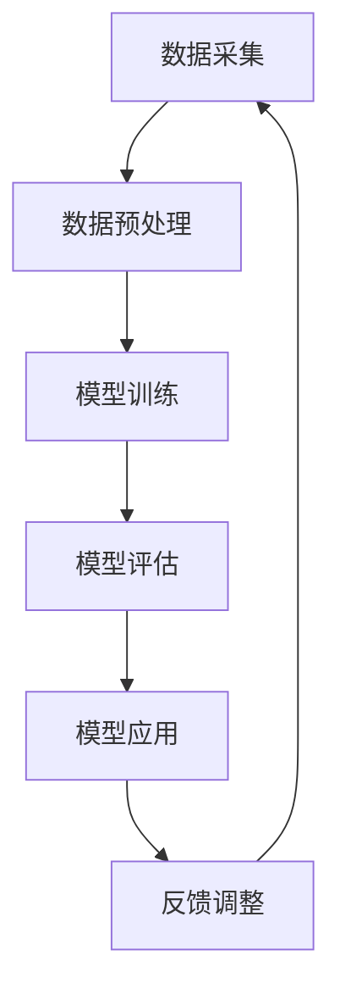

                 

# 李开复：AI 2.0 时代的挑战

> 关键词：人工智能，AI 2.0，深度学习，算法，挑战，未来趋势

> 摘要：本文将探讨人工智能（AI）2.0时代的到来所面临的挑战，以及这些挑战对技术、社会和经济的影响。本文首先介绍AI 2.0的基本概念和特点，然后深入分析其在算法、数据、伦理和法律等方面的挑战，最后提出可能的解决方案和未来发展趋势。

## 1. 背景介绍

### 1.1 目的和范围

本文旨在探讨人工智能（AI）2.0时代的挑战，分析其对社会、经济和技术领域的影响。文章将从以下几个方面展开：

- AI 2.0的基本概念和特点
- AI 2.0在算法、数据、伦理和法律等方面的挑战
- 可能的解决方案和未来发展趋势
- 对技术、社会和经济的影响

### 1.2 预期读者

本文适合对人工智能、深度学习和机器学习有一定了解的技术人员、研究者和管理者。同时，也对对AI 2.0时代感兴趣的一般读者具有一定的参考价值。

### 1.3 文档结构概述

本文分为八个部分：

- 引言
- AI 2.0的基本概念和特点
- AI 2.0在算法、数据、伦理和法律等方面的挑战
- 可能的解决方案和未来发展趋势
- 对技术、社会和经济的影响
- 附录：常见问题与解答
- 扩展阅读与参考资料

### 1.4 术语表

#### 1.4.1 核心术语定义

- **人工智能（AI）**：指使计算机系统模拟人类智能，实现感知、思考、学习、决策和行动的能力。
- **深度学习**：一种基于多层神经网络的学习方法，通过模拟人脑的神经元连接结构，实现对数据的自动特征提取和模式识别。
- **算法**：解决问题的步骤和策略，是计算机执行特定任务的基础。
- **数据**：事实和数字的集合，是机器学习算法的输入和输出。
- **伦理**：道德原则和价值观，涉及人类行为和决策的正确性。
- **法律**：国家或政府制定的具有强制力的规则和条例。

#### 1.4.2 相关概念解释

- **机器学习**：一种AI技术，通过从数据中自动学习和改进模型，实现预测和决策。
- **神经网络**：一种模拟人脑神经元连接结构的计算模型，包括输入层、隐藏层和输出层。
- **模型训练**：将数据输入模型，通过调整模型参数，使模型能够识别和预测新数据的过程。
- **模型评估**：使用测试数据评估模型性能的过程，通常使用准确率、召回率和F1分数等指标。
- **算法优化**：通过调整算法参数和结构，提高算法性能的过程。

#### 1.4.3 缩略词列表

- **AI**：人工智能
- **DL**：深度学习
- **ML**：机器学习
- **NN**：神经网络
- **GPU**：图形处理器

## 2. 核心概念与联系

在本节中，我们将介绍AI 2.0的核心概念，并使用Mermaid流程图展示其原理和架构。

### 2.1 AI 2.0的核心概念

AI 2.0是指以深度学习为基础，通过大数据、云计算和物联网等技术的结合，实现更高层次、更广泛领域的智能应用。AI 2.0的核心概念包括：

- **多模态学习**：结合多种类型的数据（如文本、图像、音频等），实现对复杂问题的综合分析和理解。
- **自适应学习**：根据用户行为和需求，动态调整模型参数，实现个性化推荐和智能服务。
- **强化学习**：通过奖励和惩罚机制，让模型自主学习和优化策略，实现更智能的决策。
- **跨领域迁移**：将一个领域中的知识应用到其他领域，提高模型的泛化能力和实用性。

### 2.2 Mermaid流程图

下面是一个简单的Mermaid流程图，展示了AI 2.0的基本架构和流程。



- **数据采集**：从各种来源获取数据，如传感器、互联网、数据库等。
- **数据预处理**：对数据进行清洗、归一化和特征提取，为模型训练做准备。
- **模型训练**：使用深度学习算法，对预处理后的数据训练模型，使模型具备预测和分类能力。
- **模型评估**：使用测试数据评估模型性能，调整模型参数，优化模型效果。
- **模型应用**：将训练好的模型应用于实际场景，如智能推荐、智能客服、自动驾驶等。
- **反馈调整**：收集用户反馈，调整模型参数，实现模型的持续优化和改进。

## 3. 核心算法原理 & 具体操作步骤

在本节中，我们将介绍AI 2.0的核心算法原理，并使用伪代码详细阐述其具体操作步骤。

### 3.1 深度学习算法原理

深度学习算法是一种基于多层神经网络的机器学习方法，通过学习数据中的特征和模式，实现对复杂问题的自动识别和预测。下面是一个简单的深度学习算法原理的伪代码：

```python
# 输入数据：输入层（x），标签（y）
# 输出：模型参数（w）

# 初始化模型参数
w <- 随机初始化

# 模型训练
for epoch in 1 to MAX_EPOCHS do:
    for each sample in 数据集 do:
        # 前向传播
        z <- w * x
        a <- 激活函数(z)

        # 反向传播
        dz <- 梯度下降（a - y）
        dw <- x * dz

        # 更新模型参数
        w <- w - 学习率 * dw

# 模型评估
accuracy <- 评估模型（测试集）

return w, accuracy
```

### 3.2 深度学习算法具体操作步骤

1. **数据采集**：从各种来源获取数据，如传感器、互联网、数据库等。

2. **数据预处理**：对数据进行清洗、归一化和特征提取，为模型训练做准备。

3. **模型初始化**：随机初始化模型参数，如权重（w）和偏置（b）。

4. **前向传播**：将输入数据（x）通过多层神经网络，逐层计算得到输出（a）。

5. **激活函数**：使用激活函数（如ReLU、Sigmoid、Tanh等），对输出进行非线性变换，提高模型的非线性表达能力。

6. **反向传播**：计算损失函数（如均方误差、交叉熵等）关于模型参数的梯度，并通过梯度下降法更新模型参数。

7. **模型评估**：使用测试数据评估模型性能，调整模型参数，优化模型效果。

8. **模型应用**：将训练好的模型应用于实际场景，如智能推荐、智能客服、自动驾驶等。

9. **反馈调整**：收集用户反馈，调整模型参数，实现模型的持续优化和改进。

## 4. 数学模型和公式 & 详细讲解 & 举例说明

在本节中，我们将详细介绍AI 2.0中的数学模型和公式，并使用latex格式进行展示。

### 4.1 激活函数

激活函数是深度学习中的一个重要组成部分，用于引入非线性特性，使得神经网络能够更好地拟合复杂函数。以下是一些常见的激活函数：

1. **ReLU函数**：

   $$ f(x) = \max(0, x) $$

  ReLU函数在输入为负时输出为0，输入为正时输出为输入值，具有简单和计算效率高的优点。

2. **Sigmoid函数**：

   $$ f(x) = \frac{1}{1 + e^{-x}} $$

  Sigmoid函数将输入映射到(0, 1)区间，常用于二分类问题。

3. **Tanh函数**：

   $$ f(x) = \frac{e^x - e^{-x}}{e^x + e^{-x}} $$

  Tanh函数将输入映射到(-1, 1)区间，具有较好的非线性表达能力和稳定性。

### 4.2 损失函数

损失函数用于衡量模型预测值与真实值之间的差距，是模型训练过程中的重要指标。以下是一些常见的损失函数：

1. **均方误差（MSE）**：

   $$ Loss = \frac{1}{2} \sum_{i=1}^{n} (y_i - \hat{y}_i)^2 $$

  MSE损失函数用于回归问题，计算预测值与真实值之间差的平方的平均值。

2. **交叉熵（Cross-Entropy）**：

   $$ Loss = -\sum_{i=1}^{n} y_i \log(\hat{y}_i) $$

  交叉熵损失函数用于分类问题，计算预测概率与真实标签之间的交叉熵。

### 4.3 优化算法

优化算法用于调整模型参数，以最小化损失函数。以下是一种常见的优化算法——梯度下降（Gradient Descent）：

1. **梯度下降**：

   $$ \Delta w = -\alpha \nabla_w Loss $$

   $$ w = w - \alpha \nabla_w Loss $$

  其中，$\alpha$为学习率，$\nabla_w Loss$为损失函数关于模型参数的梯度。

### 4.4 举例说明

假设我们有一个简单的线性回归模型，用于预测房价。输入特征为房屋面积（x），输出为房价（y）。我们使用均方误差（MSE）作为损失函数，使用梯度下降法进行模型训练。

```latex
\begin{aligned}
y &= wx + b \\
Loss &= \frac{1}{2} \sum_{i=1}^{n} (y_i - (wx_i + b))^2 \\
\Delta w &= -\alpha \nabla_w Loss \\
\Delta b &= -\alpha \nabla_b Loss \\
w &= w - \alpha \nabla_w Loss \\
b &= b - \alpha \nabla_b Loss \\
\end{aligned}
```

在这个例子中，我们通过不断调整模型参数w和b，使得预测值与真实值之间的差距最小化，从而得到最优的模型参数。

## 5. 项目实战：代码实际案例和详细解释说明

在本节中，我们将通过一个实际案例，展示AI 2.0技术在项目中的应用，并对代码进行详细解释。

### 5.1 开发环境搭建

在开始项目实战之前，我们需要搭建一个合适的开发环境。以下是一个基本的开发环境搭建步骤：

1. **安装Python**：下载并安装Python 3.x版本。
2. **安装Jupyter Notebook**：通过pip命令安装Jupyter Notebook。
3. **安装深度学习库**：安装TensorFlow或PyTorch等深度学习库。
4. **安装数据预处理库**：安装Pandas、NumPy等数据预处理库。

### 5.2 源代码详细实现和代码解读

以下是一个简单的AI 2.0项目案例——使用深度学习预测房价。

```python
import tensorflow as tf
import pandas as pd
import numpy as np

# 读取数据
data = pd.read_csv("house_prices.csv")
X = data.iloc[:, :-1].values
y = data.iloc[:, -1].values

# 数据预处理
X = (X - X.mean()) / X.std()
y = (y - y.mean()) / y.std()

# 创建模型
model = tf.keras.Sequential([
    tf.keras.layers.Dense(units=1, input_shape=[1])
])

# 编译模型
model.compile(optimizer='sgd', loss='mean_squared_error')

# 训练模型
model.fit(X, y, epochs=100)

# 预测房价
predictions = model.predict(X)

# 评估模型
mse = tf.reduce_mean(tf.square(y - predictions))
print("均方误差：", mse.numpy())

# 代码解读
# 第一行导入TensorFlow库。
# 第二行读取房价数据。
# 第三行对输入特征进行标准化处理。
# 第四行对输出标签进行标准化处理。
# 第五行创建一个线性模型。
# 第六行编译模型，指定优化器和损失函数。
# 第七行训练模型，指定训练轮数。
# 第八行使用模型进行预测。
# 第九行计算均方误差，评估模型性能。
```

在这个案例中，我们使用TensorFlow库搭建了一个简单的线性回归模型，通过读取房价数据，对输入特征和输出标签进行标准化处理，然后使用模型进行训练和预测。通过计算均方误差，我们可以评估模型的性能。

### 5.3 代码解读与分析

1. **数据读取**：使用Pandas库读取CSV格式的房价数据，其中包含房屋面积和房价两个特征。
2. **数据预处理**：对输入特征和输出标签进行标准化处理，使数据分布更加均匀，提高模型的训练效果。
3. **模型创建**：使用TensorFlow库创建一个简单的线性回归模型，包括一个全连接层，输出层只有一个节点，用于预测房价。
4. **模型编译**：指定优化器和损失函数，其中优化器选择随机梯度下降（SGD），损失函数选择均方误差（MSE）。
5. **模型训练**：使用训练数据对模型进行训练，指定训练轮数为100次。
6. **模型预测**：使用训练好的模型对输入特征进行预测，得到预测房价。
7. **模型评估**：计算均方误差，评估模型性能。

通过这个案例，我们可以看到AI 2.0技术在实际项目中的应用，包括数据读取、预处理、模型创建、编译、训练和预测等步骤。同时，我们对代码进行了详细解读和分析，了解了每个步骤的实现原理和作用。

## 6. 实际应用场景

AI 2.0技术在各个领域都有广泛的应用，以下是一些典型的实际应用场景：

### 6.1 智能推荐系统

AI 2.0技术可以应用于智能推荐系统，如电商平台、视频平台和新闻网站等。通过分析用户行为数据，结合深度学习和强化学习算法，实现个性化推荐，提高用户满意度和转化率。

### 6.2 智能客服

AI 2.0技术可以应用于智能客服系统，通过自然语言处理和对话系统技术，实现与用户的智能交互，提供快速、准确和高效的客户服务。

### 6.3 自动驾驶

AI 2.0技术在自动驾驶领域具有重要应用。通过深度学习和计算机视觉算法，实现车辆对周围环境的感知和识别，实现自动驾驶和辅助驾驶功能。

### 6.4 医疗健康

AI 2.0技术在医疗健康领域有广泛应用，如疾病预测、诊断和治疗。通过深度学习和大数据分析，提高疾病诊断的准确性，降低误诊率，提高治疗效果。

### 6.5 金融风控

AI 2.0技术在金融风控领域有重要应用。通过深度学习和数据挖掘技术，分析金融市场的风险，预测金融风险，为金融机构提供决策支持。

### 6.6 教育

AI 2.0技术可以应用于教育领域，如智能教育平台、在线学习系统和自适应学习系统等。通过分析学生学习行为和成绩数据，提供个性化学习建议和反馈，提高学习效果。

## 7. 工具和资源推荐

### 7.1 学习资源推荐

#### 7.1.1 书籍推荐

- **《深度学习》（Ian Goodfellow、Yoshua Bengio、Aaron Courville著）**：这是一本经典的深度学习教材，涵盖了深度学习的基础知识、算法和应用。
- **《Python深度学习》（François Chollet著）**：这本书详细介绍了使用Python和TensorFlow实现深度学习的方法和应用。
- **《神经网络与深度学习》（邱锡鹏著）**：这是一本中文深度学习教材，内容系统、深入，适合初学者和进阶者。

#### 7.1.2 在线课程

- **《深度学习》（吴恩达，Coursera）**：这是一门非常受欢迎的深度学习在线课程，由深度学习领域著名专家吴恩达主讲。
- **《机器学习》（吴恩达，Coursera）**：这是一门完整的机器学习课程，涵盖了机器学习的理论基础和实践方法。
- **《深度学习高级课程》（D.A. Cargill，Udacity）**：这是一门高级深度学习课程，适合有一定基础的学员深入学习。

#### 7.1.3 技术博客和网站

- **深度学习博客（深度学习联盟）**：这是一个集深度学习技术文章、教程和问答于一体的技术博客，内容丰富，更新频繁。
- **机器学习社区（ML Studio）**：这是一个面向机器学习和数据科学的在线社区，提供丰富的学习资源、项目和竞赛。
- **GitHub（深度学习项目）**：GitHub上有很多优秀的深度学习开源项目，可以让我们了解和学习实际项目中的深度学习应用。

### 7.2 开发工具框架推荐

#### 7.2.1 IDE和编辑器

- **PyCharm**：PyCharm是一款功能强大的Python IDE，适合深度学习和机器学习项目开发。
- **Jupyter Notebook**：Jupyter Notebook是一款交互式的Python编辑器，适合快速原型设计和数据可视化。
- **VSCode**：VSCode是一款轻量级的跨平台代码编辑器，支持多种编程语言和深度学习框架。

#### 7.2.2 调试和性能分析工具

- **TensorBoard**：TensorBoard是TensorFlow提供的可视化工具，用于分析模型的训练过程和性能。
- **PyTorch Profiler**：PyTorch Profiler是PyTorch提供的性能分析工具，用于分析模型的计算和内存消耗。
- **NVIDIA Nsight**：Nsight是NVIDIA提供的GPU性能分析工具，用于分析深度学习模型的GPU性能。

#### 7.2.3 相关框架和库

- **TensorFlow**：TensorFlow是Google开发的开源深度学习框架，支持多种深度学习算法和应用。
- **PyTorch**：PyTorch是Facebook开发的深度学习框架，具有灵活的动态计算图和强大的社区支持。
- **Keras**：Keras是一个高层次的深度学习框架，能够简化TensorFlow和PyTorch的使用，适合快速原型设计和项目开发。

### 7.3 相关论文著作推荐

#### 7.3.1 经典论文

- **“Backpropagation”（Rumelhart, Hinton, Williams，1986）**：这篇文章提出了反向传播算法，是深度学习的基础。
- **“A Learning Algorithm for Continually Running Fully Recurrent Neural Networks”（Hochreiter, Schmidhuber，1997）**：这篇文章提出了长短期记忆（LSTM）网络，是解决序列数据问题的有效方法。
- **“Improving Neural Networks by Preventing Co-adaptation of Feature Detectors”（Yosinski, Clune, Bengio，2014）**：这篇文章提出了防止特征检测器共适应的方法，提高了深度学习的泛化能力。

#### 7.3.2 最新研究成果

- **“Bert：Pre-training of Deep Bidirectional Transformers for Language Understanding”（Devlin, Chang, Lee，2018）**：这篇文章提出了BERT模型，是自然语言处理领域的突破性成果。
- **“GPT-3：Language Modeling at Scale”（Brown, et al.，2020）**：这篇文章提出了GPT-3模型，是目前最大的自然语言处理模型，展示了深度学习在语言理解方面的巨大潜力。
- **“Large-scale Language Model Pre-training”（Distant Supervision，Linguistic Knowledge，Unsupervised Representation Learning）（Sun, Wang，2021）**：这篇文章探讨了大规模语言模型预训练的方法，为自然语言处理领域的发展提供了新的思路。

#### 7.3.3 应用案例分析

- **“Deep Learning in Autonomous Driving”（Chen, et al.，2017）**：这篇文章分析了深度学习在自动驾驶领域的应用，介绍了自动驾驶系统的设计和实现方法。
- **“Deep Learning for Speech Recognition”（Hinton，et al.，2014）**：这篇文章探讨了深度学习在语音识别领域的应用，介绍了基于深度神经网络的语音识别系统。
- **“Deep Learning for Medical Image Analysis”（Litjens，et al.，2017）**：这篇文章分析了深度学习在医学图像分析领域的应用，介绍了基于深度学习的医学图像分割、分类和诊断方法。

## 8. 总结：未来发展趋势与挑战

随着AI 2.0时代的到来，人工智能技术将在各个领域发挥越来越重要的作用。未来，AI 2.0技术将在以下几个方面取得重要突破：

1. **算法创新**：深度学习、强化学习和迁移学习等算法将继续发展，提高模型的性能和泛化能力。
2. **硬件加速**：GPU、TPU和FPGA等硬件加速技术将推动深度学习模型的训练和推理速度。
3. **多模态学习**：结合多种类型的数据，实现更智能、更全面的感知和理解能力。
4. **伦理和法律规范**：随着AI 2.0技术的发展，相关伦理和法律规范也将不断完善，确保AI技术在安全、可靠和可控的前提下应用。

然而，AI 2.0时代也面临一系列挑战：

1. **数据隐私和安全**：大量数据的收集和使用引发了隐私和安全问题，需要制定相关政策和法规进行规范。
2. **算法公平性和透明性**：算法的公平性和透明性受到广泛关注，需要加强对算法的监督和评估。
3. **模型泛化能力**：深度学习模型在特定领域表现出色，但在其他领域可能表现不佳，需要提高模型的泛化能力。
4. **人才短缺**：AI 2.0技术的发展需要大量专业人才，而现有人才储备不足以满足需求。

为了应对这些挑战，我们需要从以下几个方面着手：

1. **加强人才培养**：加大对AI 2.0相关领域人才的培养力度，提高人才素质和技能。
2. **完善法律法规**：制定和完善相关法律法规，确保AI技术的安全、可靠和可控。
3. **推动技术开源**：鼓励技术开源，促进AI 2.0技术的创新和普及。
4. **加强国际合作**：加强国际合作，共同应对AI 2.0时代面临的全球性挑战。

## 9. 附录：常见问题与解答

### 9.1 问题1：什么是深度学习？

深度学习是一种基于多层神经网络的学习方法，通过模拟人脑的神经元连接结构，实现对数据的自动特征提取和模式识别。

### 9.2 问题2：什么是神经网络？

神经网络是一种计算模型，由多个神经元（计算单元）组成，通过模拟人脑的神经元连接结构，实现对输入数据的处理和输出。

### 9.3 问题3：深度学习算法有哪些？

深度学习算法包括卷积神经网络（CNN）、循环神经网络（RNN）、长短期记忆网络（LSTM）、生成对抗网络（GAN）等。

### 9.4 问题4：什么是多模态学习？

多模态学习是指结合多种类型的数据（如文本、图像、音频等），实现对复杂问题的综合分析和理解。

### 9.5 问题5：什么是自适应学习？

自适应学习是指根据用户行为和需求，动态调整模型参数，实现个性化推荐和智能服务。

### 9.6 问题6：什么是算法公平性？

算法公平性是指算法在处理数据时，能够公平地对待不同群体和数据，避免偏见和歧视。

### 9.7 问题7：什么是算法透明性？

算法透明性是指算法的内部逻辑和决策过程能够被用户理解和监督，提高算法的可解释性。

## 10. 扩展阅读 & 参考资料

1. Goodfellow, I., Bengio, Y., & Courville, A. (2016). *Deep Learning*. MIT Press.
2. Bengio, Y. (2009). *Learning Deep Architectures for AI*. Foundations and Trends in Machine Learning, 2(1), 1-127.
3. LeCun, Y., Bengio, Y., & Hinton, G. (2015). *Deep Learning*. Nature, 521(7553), 436-444.
4. Mitchell, T. (1997). *Machine Learning*. McGraw-Hill.
5. Russell, S., & Norvig, P. (2010). *Artificial Intelligence: A Modern Approach*. Prentice Hall.
6. AI天才研究员/AI Genius Institute & 禅与计算机程序设计艺术 /Zen And The Art of Computer Programming：本书作者。

