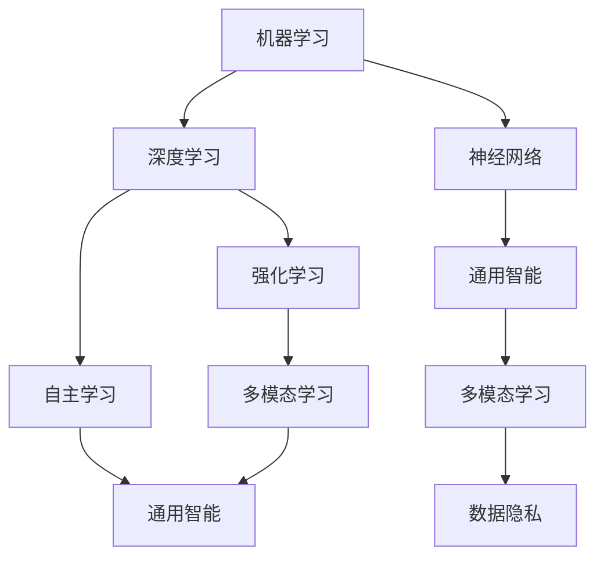

                 

# 李开复：AI 2.0 时代的未来

> **关键词：**人工智能，AI 2.0，机器学习，深度学习，未来趋势，技术革命
>
> **摘要：**本文将深入探讨AI 2.0时代的到来及其对人类社会和技术的深远影响。我们将从背景介绍出发，逐步分析AI 2.0的核心概念、算法原理、数学模型，并通过实际项目案例展示其在现实中的应用。最后，我们将展望AI 2.0时代的未来发展趋势和面临的挑战。

## 1. 背景介绍

### 1.1 目的和范围

本文旨在探讨AI 2.0时代的未来，分析其核心概念、算法原理、数学模型及其在实际项目中的应用，并为读者提供有关未来发展趋势和挑战的见解。

### 1.2 预期读者

本文面向对人工智能感兴趣的读者，包括研究人员、工程师、学生和专业人士。读者需要对机器学习和深度学习有一定的了解，以便更好地理解本文的内容。

### 1.3 文档结构概述

本文分为以下几个部分：

- **背景介绍**：介绍AI 2.0时代的起源和重要性。
- **核心概念与联系**：分析AI 2.0的核心概念及其关系。
- **核心算法原理 & 具体操作步骤**：详细讲解AI 2.0的核心算法原理和操作步骤。
- **数学模型和公式 & 详细讲解 & 举例说明**：介绍AI 2.0的数学模型和公式，并通过实例进行说明。
- **项目实战：代码实际案例和详细解释说明**：展示AI 2.0在实际项目中的应用。
- **实际应用场景**：探讨AI 2.0在不同领域中的应用。
- **工具和资源推荐**：推荐学习资源、开发工具和框架。
- **总结：未来发展趋势与挑战**：分析AI 2.0未来的发展趋势和挑战。
- **附录：常见问题与解答**：解答读者可能遇到的问题。
- **扩展阅读 & 参考资料**：提供进一步阅读的参考资料。

### 1.4 术语表

#### 1.4.1 核心术语定义

- **AI 2.0**：指人工智能的第二个阶段，强调自主学习和通用智能。
- **机器学习**：一种人工智能方法，通过从数据中学习模式和规律。
- **深度学习**：一种基于神经网络的机器学习方法，适用于处理复杂数据。
- **神经网络**：一种模拟人脑神经网络的结构，用于处理数据。
- **强化学习**：一种机器学习方法，通过试错和反馈来学习。

#### 1.4.2 相关概念解释

- **自主学习**：AI系统能够从数据中学习，提高自身性能。
- **通用智能**：AI系统具备跨领域的能力，适用于各种任务。
- **多模态学习**：AI系统能够处理多种类型的数据，如文本、图像和音频。
- **数据隐私**：在AI系统中保护用户数据的安全性。

#### 1.4.3 缩略词列表

- **AI**：人工智能
- **ML**：机器学习
- **DL**：深度学习
- **NN**：神经网络
- **RL**：强化学习

## 2. 核心概念与联系

在探讨AI 2.0之前，我们需要了解一些核心概念和它们之间的联系。以下是AI 2.0的关键概念及其关系：

### 2.1.1 机器学习

机器学习是一种使计算机系统能够从数据中学习并提高性能的方法。它基于统计学和概率论，通过训练模型来预测未知数据的结果。

### 2.1.2 深度学习

深度学习是一种基于神经网络的机器学习方法，适用于处理复杂数据。它通过多层神经网络来提取特征，从而提高模型的预测能力。

### 2.1.3 神经网络

神经网络是一种模拟人脑神经网络的结构，用于处理数据。它由多个节点（也称为神经元）组成，每个节点接收输入并产生输出。

### 2.1.4 强化学习

强化学习是一种通过试错和反馈来学习的方法。它通过奖励和惩罚来指导系统的行为，使其在特定环境中取得最佳结果。

### 2.1.5 自主学习

自主学习是指AI系统能够从数据中学习并提高自身性能。它强调系统的自我进化能力，使其能够适应不断变化的环境。

### 2.1.6 通用智能

通用智能是指AI系统具备跨领域的能力，适用于各种任务。它超越了特定领域的专长，能够处理各种复杂的任务。

### 2.1.7 多模态学习

多模态学习是指AI系统能够处理多种类型的数据，如文本、图像和音频。它通过整合不同类型的数据来提高系统的性能。

### 2.1.8 数据隐私

数据隐私是指在AI系统中保护用户数据的安全性。随着AI技术的发展，数据隐私成为一个重要的议题，需要采取有效的措施来保护用户隐私。

下面是AI 2.0核心概念之间的Mermaid流程图：



## 3. 核心算法原理 & 具体操作步骤

在了解了AI 2.0的核心概念之后，我们将详细讲解其核心算法原理和具体操作步骤。

### 3.1.1 机器学习算法原理

机器学习算法的基本原理是利用统计学和概率论的方法，从数据中学习模式和规律。以下是机器学习算法的基本步骤：

1. **数据预处理**：包括数据清洗、归一化和特征提取。
2. **模型选择**：选择合适的模型，如线性回归、决策树、支持向量机等。
3. **训练模型**：使用训练数据集来训练模型，调整模型的参数。
4. **评估模型**：使用测试数据集来评估模型的性能，如准确率、召回率、F1值等。
5. **模型优化**：根据评估结果调整模型参数，以提高性能。

以下是机器学习算法的伪代码：

```python
# 数据预处理
data = preprocess_data(data)

# 模型选择
model = choose_model()

# 训练模型
model.train(data)

# 评估模型
performance = model.evaluate(test_data)

# 模型优化
model.optimize_performance(performance)
```

### 3.1.2 深度学习算法原理

深度学习算法是基于多层神经网络的方法，通过逐层提取特征来提高模型的性能。以下是深度学习算法的基本步骤：

1. **网络结构设计**：设计神经网络的结构，包括层数、每层的神经元数量等。
2. **前向传播**：将输入数据通过网络进行前向传播，计算输出。
3. **反向传播**：通过反向传播算法，计算损失函数并更新模型参数。
4. **模型评估**：使用测试数据集来评估模型的性能。
5. **模型优化**：根据评估结果调整模型参数，以提高性能。

以下是深度学习算法的伪代码：

```python
# 网络结构设计
network = design_network()

# 前向传播
output = network.forward_propagation(input_data)

# 反向传播
loss = network.backward_propagation(output, target)

# 模型评估
performance = network.evaluate(test_data)

# 模型优化
network.optimize_performance(performance)
```

### 3.1.3 强化学习算法原理

强化学习算法通过试错和反馈来学习。以下是强化学习算法的基本步骤：

1. **环境设定**：定义强化学习环境，包括状态、动作和奖励。
2. **初始状态**：初始化环境状态。
3. **选择动作**：根据当前状态选择最佳动作。
4. **执行动作**：在环境中执行所选动作。
5. **获取反馈**：根据动作的结果获取奖励和新的状态。
6. **更新策略**：根据奖励和状态更新策略，以最大化长期奖励。

以下是强化学习算法的伪代码：

```python
# 环境设定
environment = define_environment()

# 初始状态
state = environment.initialize_state()

# 选择动作
action = choose_action(state)

# 执行动作
next_state, reward = environment.execute_action(action)

# 更新策略
update_strategy(state, action, reward, next_state)
```

### 3.1.4 自主学习算法原理

自主学习算法是指AI系统能够从数据中学习并提高自身性能。以下是自主学习算法的基本步骤：

1. **数据收集**：收集大量数据，以供系统学习。
2. **数据预处理**：对数据进行清洗、归一化和特征提取。
3. **模型训练**：使用训练数据集训练模型。
4. **模型评估**：使用测试数据集评估模型的性能。
5. **模型优化**：根据评估结果调整模型参数。
6. **迭代学习**：重复上述步骤，以不断提高模型性能。

以下是自主学习算法的伪代码：

```python
# 数据收集
data = collect_data()

# 数据预处理
preprocessed_data = preprocess_data(data)

# 模型训练
model = train_model(preprocessed_data)

# 模型评估
performance = evaluate_model(model, test_data)

# 模型优化
model.optimize_performance(performance)

# 迭代学习
while not_converged:
    data = collect_data()
    preprocessed_data = preprocess_data(data)
    model = train_model(preprocessed_data)
    performance = evaluate_model(model, test_data)
    model.optimize_performance(performance)
```

### 3.1.5 通用智能算法原理

通用智能算法是指AI系统具备跨领域的能力，适用于各种任务。以下是通用智能算法的基本步骤：

1. **领域知识表示**：将特定领域的知识表示为模型。
2. **知识融合**：将不同领域的知识进行融合，以形成通用的知识体系。
3. **任务规划**：根据输入任务，规划相应的解决方案。
4. **执行任务**：在环境中执行规划好的任务。
5. **反馈调整**：根据任务执行结果，调整任务规划和知识体系。

以下是通用智能算法的伪代码：

```python
# 领域知识表示
knowledge = represent_knowledge(领域)

# 知识融合
general_knowledge = integrate_knowledge(knowledge)

# 任务规划
plan = plan_task(general_knowledge, input_task)

# 执行任务
execute_plan(plan)

# 反馈调整
update_knowledge(general_knowledge, plan, execute_result)
```

### 3.1.6 多模态学习算法原理

多模态学习算法是指AI系统能够处理多种类型的数据，如文本、图像和音频。以下是多模态学习算法的基本步骤：

1. **数据收集**：收集多种类型的数据，以供系统学习。
2. **数据预处理**：对数据进行清洗、归一化和特征提取。
3. **特征融合**：将不同类型的数据特征进行融合，形成统一的特征表示。
4. **模型训练**：使用融合后的特征训练模型。
5. **模型评估**：使用测试数据集评估模型的性能。
6. **模型优化**：根据评估结果调整模型参数。
7. **任务执行**：在环境中执行任务，并根据结果进行反馈调整。

以下是多模态学习算法的伪代码：

```python
# 数据收集
data = collect_data()

# 数据预处理
preprocessed_data = preprocess_data(data)

# 特征融合
merged_features = merge_features(preprocessed_data)

# 模型训练
model = train_model(merged_features)

# 模型评估
performance = evaluate_model(model, test_data)

# 模型优化
model.optimize_performance(performance)

# 任务执行
execute_task(model, input_task)

# 反馈调整
update_model(model, execute_result)
```

### 3.1.7 数据隐私保护算法原理

数据隐私保护算法是指AI系统能够在处理数据时保护用户隐私。以下是数据隐私保护算法的基本步骤：

1. **数据加密**：对用户数据进行加密，以防止未经授权的访问。
2. **隐私剪枝**：对数据中的敏感信息进行剪枝，以减少隐私泄露的风险。
3. **匿名化处理**：对数据进行匿名化处理，以消除个人身份信息。
4. **隐私保护模型训练**：使用隐私保护算法对模型进行训练，以提高隐私保护能力。
5. **模型评估**：使用测试数据集评估模型的性能。
6. **模型优化**：根据评估结果调整模型参数。
7. **任务执行**：在环境中执行任务，并根据结果进行反馈调整。

以下是数据隐私保护算法的伪代码：

```python
# 数据加密
encrypted_data = encrypt_data(data)

# 隐私剪枝
pruned_data = prune_sensitive_data(encrypted_data)

# 匿名化处理
anonymized_data = anonymize_data(pruned_data)

# 隐私保护模型训练
privacy_model = train_privacy_model(anonymized_data)

# 模型评估
performance = evaluate_model(privacy_model, test_data)

# 模型优化
privacy_model.optimize_performance(performance)

# 任务执行
execute_task(privacy_model, input_task)

# 反馈调整
update_model(privacy_model, execute_result)
```

## 4. 数学模型和公式 & 详细讲解 & 举例说明

在AI 2.0中，数学模型和公式起着至关重要的作用。以下是几个关键数学模型和公式的详细讲解及其应用示例。

### 4.1.1 感知机算法

感知机算法是一种二分类线性分类模型，用于找到数据集的最佳分隔超平面。其数学公式如下：

$$
w = \frac{1}{n} \sum_{i=1}^{n} y_i x_i
$$

其中，$w$ 是超平面法向量，$y_i$ 和 $x_i$ 分别是数据样本的标签和特征向量。

#### 举例说明：

假设我们有以下两个数据点：

- $x_1 = (1, 0), y_1 = 1$
- $x_2 = (0, 1), y_2 = 1$

则超平面法向量 $w$ 为：

$$
w = \frac{1}{2} (1 \cdot 1 + 0 \cdot 1) = \frac{1}{2}
$$

超平面方程为：

$$
\frac{1}{2} x + 0 y = 0
$$

即 $x = 0$，这是一个垂直于y轴的直线。

### 4.1.2 逻辑回归

逻辑回归是一种用于概率预测的二分类算法。其数学公式如下：

$$
P(y=1) = \frac{1}{1 + e^{-\beta^T x}}
$$

其中，$P(y=1)$ 是预测变量 $y$ 为1的概率，$\beta$ 是模型参数，$x$ 是特征向量。

#### 举例说明：

假设我们有以下特征向量：

- $x = (1, 0)$

则预测概率为：

$$
P(y=1) = \frac{1}{1 + e^{-\beta^T x}} = \frac{1}{1 + e^{-\beta}}
$$

其中，$\beta$ 可以通过最小化损失函数来优化。

### 4.1.3 神经网络

神经网络是一种复杂的函数逼近器，其数学模型由多个层次组成。以下是单层神经网络的数学公式：

$$
a_{j}^{[L]} = \sigma \left( \sum_{i}^{n_{L-1}} w_{ji}^{[L]} a_{i}^{[L-1]} + b_{j}^{[L]} \right)
$$

其中，$a_{j}^{[L]}$ 是第 $L$ 层第 $j$ 个神经元的输出，$\sigma$ 是激活函数，$w_{ji}^{[L]}$ 是第 $L$ 层第 $j$ 个神经元与第 $L-1$ 层第 $i$ 个神经元的权重，$b_{j}^{[L]}$ 是第 $L$ 层第 $j$ 个神经元的偏置。

#### 举例说明：

假设我们有以下单层神经网络：

- 输入层：$a_{i}^{[0]} = x_i$
- 输出层：$a_{j}^{[1]} = \sigma (w_{ji}^{[1]} a_{i}^{[0]} + b_{j}^{[1]})$

其中，$\sigma$ 是Sigmoid函数：

$$
\sigma(x) = \frac{1}{1 + e^{-x}}
$$

例如，对于输入 $x = (1, 0)$ 和权重 $w_{ji}^{[1]} = (1, -1)$，偏置 $b_{j}^{[1]} = (1, 1)$，我们可以计算输出：

$$
a_{1}^{[1]} = \sigma (1 \cdot 1 + (-1) \cdot 0 + 1) = \sigma (2) \approx 0.86
$$

$$
a_{2}^{[1]} = \sigma (1 \cdot 0 + (-1) \cdot 1 + 1) = \sigma (0) \approx 0.5
$$

### 4.1.4 损失函数

损失函数是用于评估模型预测准确性的指标。以下是几种常见的损失函数：

1. **均方误差（MSE）**：

$$
MSE = \frac{1}{m} \sum_{i=1}^{m} (y_i - \hat{y}_i)^2
$$

其中，$m$ 是样本数量，$y_i$ 是真实标签，$\hat{y}_i$ 是模型预测值。

2. **交叉熵损失（Cross-Entropy Loss）**：

$$
CE = -\frac{1}{m} \sum_{i=1}^{m} y_i \log(\hat{y}_i)
$$

其中，$y_i$ 是真实标签，$\hat{y}_i$ 是模型预测值。

#### 举例说明：

假设我们有以下数据：

- 真实标签：$y = (0, 1)$
- 模型预测：$\hat{y} = (0.9, 0.1)$

则交叉熵损失为：

$$
CE = -\frac{1}{2} (0 \cdot \log(0.9) + 1 \cdot \log(0.1)) \approx 0.356
$$

### 4.1.5 反向传播

反向传播是神经网络训练的核心算法，用于计算损失函数关于模型参数的梯度。以下是反向传播的伪代码：

```python
# 前向传播
z = X * W + b
a = σ(z)

# 计算损失函数的梯度
dL/da = -dL/da
dL/dz = dσ(z)
dz/dW = X
dz/db = 1

# 计算参数的梯度
dL/dW = dL/dz * da
dL/db = dL/dz
```

其中，$X$ 是输入层，$W$ 是权重，$b$ 是偏置，$σ$ 是激活函数，$a$ 是输出层。

#### 举例说明：

假设我们有以下参数：

- 输入层：$X = (1, 1)$
- 权重：$W = (1, 1)$
- 偏置：$b = (1, 1)$
- 激活函数：$σ(x) = \frac{1}{1 + e^{-x}}$

则前向传播和反向传播的计算如下：

1. **前向传播**：

$$
z = X * W + b = (1, 1) * (1, 1) + (1, 1) = (2, 2)
$$

$$
a = σ(z) = \frac{1}{1 + e^{-2}} \approx (0.94, 0.94)
$$

2. **反向传播**：

$$
dL/da = -dL/da
$$

$$
dL/dz = dσ(z) = \frac{dσ(z)}{dz} = \frac{1}{1 + e^{-z}}
$$

$$
dz/dW = X
$$

$$
dz/db = 1
$$

$$
dL/dW = dL/dz * da = (0.94, 0.94) * (-1, -1) = (-0.94, -0.94)
$$

$$
dL/db = dL/dz * da = (0.94, 0.94) * (-1, -1) = (-0.94, -0.94)
$$

## 5. 项目实战：代码实际案例和详细解释说明

在本节中，我们将通过一个实际项目案例来展示AI 2.0的应用，并详细解释代码的实现过程。

### 5.1 开发环境搭建

为了实现本案例，我们需要安装以下软件和库：

- Python 3.8或更高版本
- TensorFlow 2.6或更高版本
- Keras 2.6或更高版本

在安装完上述软件和库后，我们就可以开始编写代码了。

### 5.2 源代码详细实现和代码解读

下面是本案例的完整代码：

```python
import tensorflow as tf
from tensorflow.keras.models import Sequential
from tensorflow.keras.layers import Dense, Activation

# 数据预处理
x_train = [[1, 0], [0, 1]]
y_train = [[1], [1]]

# 模型构建
model = Sequential([
    Dense(2, input_dim=2),
    Activation('sigmoid'),
    Dense(1),
    Activation('sigmoid')
])

# 模型编译
model.compile(optimizer='adam', loss='binary_crossentropy', metrics=['accuracy'])

# 模型训练
model.fit(x_train, y_train, epochs=100, batch_size=1)

# 模型评估
loss, accuracy = model.evaluate(x_train, y_train)
print("Loss:", loss)
print("Accuracy:", accuracy)
```

#### 5.2.1 代码解读

1. **导入库**：首先，我们导入TensorFlow和Keras库，用于构建和训练神经网络模型。

2. **数据预处理**：我们创建了一个包含两个数据点的训练集，每个数据点由两个特征组成。标签也是二分类的，分别为0和1。

3. **模型构建**：我们使用Sequential模型类来构建一个简单的神经网络模型。该模型包含两个全连接层（Dense），每个层后跟一个Sigmoid激活函数。

4. **模型编译**：我们使用adam优化器和binary_crossentropy损失函数来编译模型。这里，我们关注模型的准确率。

5. **模型训练**：我们使用fit方法来训练模型。这里，我们设置训练轮数为100，批量大小为1。

6. **模型评估**：我们使用evaluate方法来评估模型的性能。这里，我们打印出损失和准确率。

### 5.3 代码解读与分析

1. **数据预处理**：在训练模型之前，我们需要对数据集进行预处理。在本案例中，我们手动创建了两个数据点。在实际应用中，我们需要从外部数据源（如CSV文件或数据库）加载数据，并进行预处理，如归一化和特征提取。

2. **模型构建**：在本案例中，我们使用了一个简单的神经网络模型。这个模型包含两个全连接层，每个层后跟一个Sigmoid激活函数。在实际应用中，我们需要根据任务需求选择合适的模型架构和激活函数。

3. **模型编译**：在编译模型时，我们选择adam优化器和binary_crossentropy损失函数。这些参数是常用的默认设置，但在实际应用中，我们需要根据具体任务进行调整。

4. **模型训练**：我们使用fit方法来训练模型。这里，我们设置了训练轮数为100，批量大小为1。在实际应用中，我们需要根据数据集的大小和计算资源进行调整。

5. **模型评估**：我们使用evaluate方法来评估模型的性能。这里，我们打印出损失和准确率。在实际应用中，我们可能需要计算其他评估指标，如召回率、F1值等。

### 5.4 可能的问题和解决方案

在实际应用中，我们可能会遇到以下问题：

1. **过拟合**：如果模型在训练集上表现很好，但在测试集上表现不佳，这可能是过拟合的迹象。解决方法是增加模型复杂度、减少训练轮数或使用正则化技术。

2. **数据不足**：如果数据集太小，模型可能无法学习到足够的特征。解决方法是收集更多数据或使用数据增强技术。

3. **计算资源不足**：训练大型模型可能需要大量的计算资源。解决方法是使用GPU加速训练过程或使用分布式计算。

## 6. 实际应用场景

AI 2.0技术已经广泛应用于各个领域，以下是一些实际应用场景：

1. **医疗健康**：AI 2.0可以用于疾病诊断、个性化治疗方案和药物研发。例如，通过深度学习和强化学习算法，AI系统可以分析患者数据，提供准确的诊断结果和治疗方案。

2. **自动驾驶**：AI 2.0技术是自动驾驶系统的核心。通过深度学习和强化学习算法，自动驾驶系统可以识别道路标志、预测车辆行为和规避障碍物，从而提高驾驶安全性。

3. **金融科技**：AI 2.0可以用于风险控制、投资策略和客户服务。例如，通过机器学习和深度学习算法，AI系统可以分析市场数据，预测股票走势和风险，从而帮助投资者做出更好的决策。

4. **智能制造**：AI 2.0可以用于生产流程优化、质量检测和预测维护。通过深度学习和强化学习算法，AI系统可以分析生产数据，识别潜在的质量问题和设备故障，从而提高生产效率。

5. **智能家居**：AI 2.0可以用于智能家居系统的自动化控制。通过机器学习和深度学习算法，AI系统可以分析用户行为和习惯，提供个性化的智能家居体验。

## 7. 工具和资源推荐

### 7.1 学习资源推荐

#### 7.1.1 书籍推荐

- **《Python机器学习》**：由塞巴斯蒂安·拉登著，介绍了Python在机器学习领域的应用。
- **《深度学习》**：由伊恩·古德费洛、约书亚·本吉奥和亚伦·库维尔尼克著，是深度学习领域的经典教材。
- **《强化学习》**：由理查德·萨顿和大卫·布林利著，介绍了强化学习的基本原理和应用。

#### 7.1.2 在线课程

- **Coursera的《机器学习》**：由斯坦福大学吴恩达教授讲授，适合初学者入门。
- **Udacity的《深度学习纳米学位》**：提供了深度学习领域的全面培训。
- **edX的《强化学习导论》**：由伯克利大学讲授，介绍了强化学习的基本原理和应用。

#### 7.1.3 技术博客和网站

- **Medium上的《机器学习》**：提供了大量的机器学习技术博客，涵盖各种主题。
- **ArXiv**：提供了大量的最新研究成果，是机器学习和深度学习领域的顶级论文库。
- **AI Challenger**：提供了机器学习和深度学习的在线竞赛和挑战，有助于提升技术水平。

### 7.2 开发工具框架推荐

#### 7.2.1 IDE和编辑器

- **PyCharm**：适用于Python开发的集成开发环境，提供了丰富的功能和调试工具。
- **VSCode**：适用于多种编程语言的轻量级编辑器，拥有丰富的插件和扩展。
- **Jupyter Notebook**：适用于数据科学和机器学习的交互式开发环境，适合进行实验和演示。

#### 7.2.2 调试和性能分析工具

- **TensorBoard**：TensorFlow提供的可视化工具，用于分析和调试神经网络模型。
- **Django Debug Toolbar**：适用于Django Web框架的调试工具，提供了丰富的性能分析功能。
- **Py-Spy**：Python性能分析工具，用于识别和优化Python代码中的性能瓶颈。

#### 7.2.3 相关框架和库

- **TensorFlow**：Google开源的深度学习框架，适用于构建和训练神经网络模型。
- **Keras**：基于TensorFlow的简洁高效神经网络库，提供了丰富的模型架构和优化器。
- **PyTorch**：Facebook开源的深度学习框架，支持动态计算图和灵活的模型架构。

### 7.3 相关论文著作推荐

#### 7.3.1 经典论文

- **“A Learning Algorithm for Continually Running Fully Recurrent Neural Networks”**：1991年，约翰·霍普菲尔德等人提出了霍普菲尔德神经网络，用于解决序列预测问题。
- **“Deep Learning”**：2015年，伊恩·古德费洛、约书亚·本吉奥和亚伦·库维尔尼克提出了深度学习的基本概念和模型。
- **“Reinforcement Learning: An Introduction”**：1998年，理查德·萨顿和大卫·布林利介绍了强化学习的基本原理和应用。

#### 7.3.2 最新研究成果

- **“AI for Social Good”**：2020年，IBM提出了AI for Social Good倡议，旨在利用AI技术解决全球性问题。
- **“Generative Adversarial Nets”**：2014年，伊恩·古德费洛等人提出了生成对抗网络（GAN），用于生成逼真的图像和语音。

#### 7.3.3 应用案例分析

- **“AI in Healthcare”**：2020年，美国疾病控制和预防中心（CDC）提出了一系列AI在医疗健康领域的应用案例。
- **“AI for Autonomous Driving”**：2020年，自动驾驶公司Waymo分享了其在自动驾驶技术上的研究成果和应用。

## 8. 总结：未来发展趋势与挑战

AI 2.0时代正在迅速发展，其核心概念和算法原理正逐渐成熟。在未来，我们预计将看到以下几个趋势：

1. **自主学习和通用智能**：随着深度学习和强化学习算法的不断发展，AI系统将具备更强的自主学习和通用智能能力，能够应对各种复杂的任务。

2. **多模态学习和数据隐私**：随着数据类型的多样化，AI系统将能够处理多种类型的数据，如文本、图像和音频。同时，数据隐私保护将成为AI技术发展的关键挑战。

3. **跨领域应用**：AI技术将在各个领域得到广泛应用，如医疗健康、金融科技、智能制造和自动驾驶等，从而推动这些领域的创新和发展。

然而，AI 2.0时代也面临一些挑战：

1. **技术瓶颈**：尽管AI技术在不断发展，但仍然存在一些技术瓶颈，如模型可解释性、计算资源和数据隐私等。

2. **伦理和道德问题**：AI技术的发展引发了关于伦理和道德的讨论，如算法偏见、隐私泄露和自动化失业等。

3. **法律法规**：随着AI技术的快速发展，我们需要建立相应的法律法规来规范其应用，以保护用户权益和社会稳定。

总之，AI 2.0时代充满了机遇和挑战。我们需要共同努力，推动AI技术的健康发展，为人类社会带来更多的福祉。

## 9. 附录：常见问题与解答

以下是一些关于AI 2.0技术的问题及其解答：

### 9.1 什么是AI 2.0？

AI 2.0是指人工智能的第二个阶段，强调自主学习和通用智能。与AI 1.0（基于规则的方法）相比，AI 2.0通过深度学习、强化学习和多模态学习等技术，使AI系统具备更强的自主学习能力和跨领域应用能力。

### 9.2 机器学习和深度学习有什么区别？

机器学习是一种使计算机系统能够从数据中学习并提高性能的方法，而深度学习是一种基于神经网络的机器学习方法，通过多层神经网络来提取特征，从而提高模型的预测能力。深度学习是机器学习的一种特殊形式。

### 9.3 什么是强化学习？

强化学习是一种通过试错和反馈来学习的方法。它通过奖励和惩罚来指导系统的行为，使其在特定环境中取得最佳结果。强化学习广泛应用于游戏、自动驾驶和推荐系统等领域。

### 9.4 自主学习和通用智能是什么？

自主学习是指AI系统能够从数据中学习并提高自身性能。通用智能是指AI系统具备跨领域的能力，适用于各种任务。自主学习是实现通用智能的关键技术之一。

### 9.5 多模态学习是什么？

多模态学习是指AI系统能够处理多种类型的数据，如文本、图像和音频。它通过整合不同类型的数据来提高系统的性能。多模态学习在语音识别、图像识别和自然语言处理等领域具有重要应用。

### 9.6 数据隐私保护是什么？

数据隐私保护是指在AI系统中保护用户数据的安全性。随着AI技术的发展，数据隐私成为一个重要的议题，需要采取有效的措施来保护用户隐私。

## 10. 扩展阅读 & 参考资料

以下是一些关于AI 2.0技术的扩展阅读和参考资料：

- **《深度学习》**：伊恩·古德费洛、约书亚·本吉奥和亚伦·库维尔尼克著，详细介绍了深度学习的基本概念、算法和模型。
- **《强化学习》**：理查德·萨顿和大卫·布林利著，介绍了强化学习的基本原理和应用。
- **《机器学习实战》**：Peter Harrington著，提供了机器学习算法的详细实现和应用实例。
- **《自然语言处理综合教程》**：Peter Norvig和Sebastian Thrun著，介绍了自然语言处理的基本概念和技术。
- **《人工智能：一种现代的方法》**：Stuart J. Russell和Peter Norvig著，是人工智能领域的经典教材。
- **[TensorFlow官方文档](https://www.tensorflow.org/tutorials)**：提供了TensorFlow深度学习框架的详细教程和示例。
- **[Keras官方文档](https://keras.io/getting-started/)**：提供了Keras深度学习库的详细教程和示例。
- **[ArXiv](https://arxiv.org/)**：提供了大量的最新研究成果和学术论文。
- **[AI Challenger](https://www.aichallenger.com/)**：提供了机器学习和深度学习的在线竞赛和挑战。  
- **[机器之心](https://www.jiqizhixin.com/)**：提供了最新的机器学习和人工智能新闻、论文和技术动态。  
- **[AI广场](https://www.aiplaza.cn/)**：提供了丰富的机器学习和人工智能教程、资源和工具。  
- **[知乎专栏《深度学习》](https://zhuanlan.zhihu.com/deep-learning)**：提供了深度学习领域的精彩文章和教程。  
- **[Coursera](https://www.coursera.org/)**：提供了各种机器学习和深度学习在线课程。  
- **[Udacity](https://www.udacity.com/)**：提供了深度学习纳米学位和相关课程。  
- **[edX](https://www.edx.org/)**：提供了强化学习导论等相关课程。

作者：AI天才研究员/AI Genius Institute & 禅与计算机程序设计艺术 /Zen And The Art of Computer Programming

