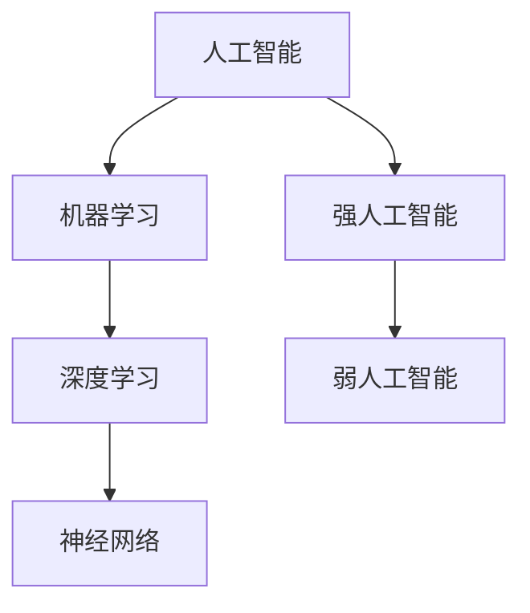

                 

# 李开复：AI 2.0 时代的生态

> 关键词：人工智能、AI 2.0、生态、核心概念、算法原理、数学模型、项目实战、应用场景、未来发展趋势与挑战

> 摘要：本文将深入探讨 AI 2.0 时代的生态，从核心概念、算法原理、数学模型、项目实战等多个角度，全面解析人工智能在新时代的发展趋势与挑战。通过本文的阅读，读者将全面了解 AI 2.0 时代的生态，掌握核心技术和应用场景，为未来的人工智能研究和实践提供有力指导。

## 1. 背景介绍

### 1.1 目的和范围

本文旨在深入探讨 AI 2.0 时代的生态，分析其核心概念、算法原理、数学模型、项目实战等方面的内容，帮助读者全面了解和掌握人工智能在新时代的发展趋势与挑战。本文将涵盖以下几个方面：

1. AI 2.0 的核心概念与联系。
2. AI 2.0 的核心算法原理与具体操作步骤。
3. AI 2.0 的数学模型与公式解析。
4. AI 2.0 的项目实战案例分析。
5. AI 2.0 的实际应用场景。
6. AI 2.0 的未来发展趋势与挑战。

### 1.2 预期读者

本文适合以下读者群体：

1. 人工智能领域的研究人员和技术爱好者。
2. 对人工智能技术感兴趣的高校师生。
3. IT 行业从业者，特别是开发者和架构师。
4. 对未来科技发展趋势感兴趣的一般读者。

### 1.3 文档结构概述

本文分为十个部分，具体结构如下：

1. 背景介绍
2. 核心概念与联系
3. 核心算法原理与具体操作步骤
4. 数学模型与公式解析
5. 项目实战案例分析
6. 实际应用场景
7. 工具和资源推荐
8. 总结：未来发展趋势与挑战
9. 附录：常见问题与解答
10. 扩展阅读与参考资料

### 1.4 术语表

#### 1.4.1 核心术语定义

- AI 2.0：指第二代人工智能，具备更强的自主学习和推理能力，能够实现智能决策和智能行动。
- 人工智能：指由人制造出来的具有一定智能和思维能力的计算机系统。
- 机器学习：指通过数据训练模型，让计算机自动学习和优化的一种方法。
- 深度学习：指多层神经网络模型，能够自动提取数据特征，进行复杂模式的识别和学习。
- 神经网络：指一种基于生物神经系统的计算模型，由多个神经元组成，用于处理和识别信息。

#### 1.4.2 相关概念解释

- 算法：指解决问题的步骤和方法，通常用伪代码或编程语言实现。
- 数据集：指用于训练和测试模型的样本数据集合。
- 模型：指通过训练得到的一系列参数和权重，用于预测和分类等任务。
- 推理：指根据已知事实，推导出新的结论或判断。

#### 1.4.3 缩略词列表

- AI：人工智能
- ML：机器学习
- DL：深度学习
- NN：神经网络

## 2. 核心概念与联系

在 AI 2.0 时代，人工智能的核心概念主要包括人工智能、机器学习、深度学习、神经网络等。这些概念相互关联，共同构成了 AI 2.0 的核心框架。以下是对这些核心概念的原理和架构的详细阐述。

### 2.1 人工智能

人工智能（AI）是指由人制造出来的具有一定智能和思维能力的计算机系统。它包括两个层次：弱人工智能和强人工智能。

- 弱人工智能：指在某些特定领域表现出人类智能水平的计算机系统，如语音识别、图像识别、自然语言处理等。
- 强人工智能：指具备全面人类智能的计算机系统，能够像人类一样思考、学习和决策。

### 2.2 机器学习

机器学习（ML）是一种通过数据训练模型，让计算机自动学习和优化的一种方法。机器学习可以分为监督学习、无监督学习和强化学习。

- 监督学习：指在有标注的数据集上进行训练，从而建立一个预测模型，用于对新数据进行预测。
- 无监督学习：指在没有标注的数据集上进行训练，从而发现数据中的结构和模式。
- 强化学习：指通过与环境交互，不断优化决策策略，从而实现目标。

### 2.3 深度学习

深度学习（DL）是一种基于多层神经网络模型，能够自动提取数据特征，进行复杂模式的识别和学习的算法。深度学习具有以下几个特点：

- 多层结构：由多个隐含层组成的神经网络，能够提取更高层次的特征。
- 自动特征提取：通过反向传播算法，自动从数据中提取特征，减轻人工特征工程的工作量。
- 强大泛化能力：通过大规模数据训练，深度学习模型能够泛化到未见过的数据上。

### 2.4 神经网络

神经网络（NN）是一种基于生物神经系统的计算模型，由多个神经元组成，用于处理和识别信息。神经网络可以分为以下几种类型：

- 线性神经网络（LNN）：由一个输入层、一个隐含层和一个输出层组成，适用于线性可分的数据。
- 卷积神经网络（CNN）：由卷积层、池化层、全连接层等组成，适用于图像和视频等数据。
- 循环神经网络（RNN）：由循环结构组成，适用于序列数据，如文本和语音。
- 长短时记忆网络（LSTM）：是 RNN 的一种变体，适用于处理长序列数据。

### 2.5 核心概念的联系

人工智能、机器学习、深度学习和神经网络这四个核心概念之间存在紧密的联系。

- 人工智能是机器学习的总体目标，而机器学习是实现人工智能的手段。
- 深度学习是机器学习的一种重要方法，能够自动提取数据特征，实现更复杂的模式识别和学习任务。
- 神经网络是深度学习的基础，通过多层结构自动提取特征，实现复杂的信息处理和识别任务。

### 2.6 Mermaid 流程图

以下是一个简单的 Mermaid 流程图，展示了核心概念之间的联系：



通过这个流程图，我们可以清晰地看到人工智能、机器学习、深度学习和神经网络之间的逻辑关系。

## 3. 核心算法原理 & 具体操作步骤

在 AI 2.0 时代，核心算法原理主要包括机器学习、深度学习和神经网络等。下面将详细讲解这些算法的原理和具体操作步骤。

### 3.1 机器学习算法原理

机器学习算法是基于统计学和概率论的，通过从数据中学习规律，从而实现预测和分类等功能。以下是机器学习算法的基本原理：

1. **数据预处理**：对原始数据进行清洗、归一化、标准化等处理，以提高模型训练的效果。

2. **特征提取**：从原始数据中提取有用的特征，这些特征可以是数值型的，也可以是类别型的。

3. **模型选择**：根据问题类型和特征数据，选择合适的模型，如线性回归、逻辑回归、决策树、随机森林等。

4. **模型训练**：使用训练数据集对模型进行训练，通过调整模型参数，使得模型能够更好地拟合训练数据。

5. **模型评估**：使用验证数据集对模型进行评估，通过指标如准确率、召回率、F1 分数等来衡量模型性能。

6. **模型优化**：根据评估结果，对模型进行调整和优化，以提高模型性能。

7. **模型应用**：将训练好的模型应用到实际问题中，进行预测或分类等任务。

### 3.2 深度学习算法原理

深度学习算法是基于多层神经网络，通过学习数据中的特征，实现复杂模式的识别和预测。以下是深度学习算法的基本原理：

1. **前向传播**：输入数据经过网络中的每个层，通过激活函数将输入映射到输出。

2. **反向传播**：计算输出与真实值之间的误差，通过反向传播算法，将误差传播到网络中的每个层，并更新每个层的权重和偏置。

3. **梯度下降**：使用梯度下降算法，不断调整网络中的权重和偏置，以最小化损失函数。

4. **激活函数**：常用的激活函数有 sigmoid、ReLU、Tanh 等，用于将线性变换转换为非线性变换。

5. **优化器**：常用的优化器有 SGD、Adam、RMSprop 等，用于加速梯度下降算法。

6. **正则化**：为了防止过拟合，可以采用正则化方法，如 L1 正则化、L2 正则化、Dropout 等。

7. **超参数调整**：通过调整学习率、批量大小、层数、隐藏单元数等超参数，以优化模型性能。

### 3.3 神经网络算法原理

神经网络算法是通过模拟生物神经系统的计算方式，实现复杂模式的识别和预测。以下是神经网络算法的基本原理：

1. **神经网络结构**：神经网络由多个神经元组成，每个神经元都是一个简单的计算单元，通过加权连接进行信息的传递。

2. **神经元激活函数**：每个神经元有一个激活函数，用于将输入映射到输出，常用的激活函数有 sigmoid、ReLU、Tanh 等。

3. **前向传播**：输入数据经过网络中的每个层，通过激活函数将输入映射到输出。

4. **反向传播**：计算输出与真实值之间的误差，通过反向传播算法，将误差传播到网络中的每个层，并更新每个层的权重和偏置。

5. **梯度下降**：使用梯度下降算法，不断调整网络中的权重和偏置，以最小化损失函数。

6. **激活函数**：激活函数用于将线性变换转换为非线性变换，使得神经网络具有更强的表达能力。

7. **优化器**：优化器用于加速梯度下降算法，如 SGD、Adam、RMSprop 等。

### 3.4 具体操作步骤

以下是使用深度学习算法进行图像分类的具体操作步骤：

1. **数据预处理**：对图像数据进行归一化处理，将像素值缩放到 [0, 1] 范围内。

2. **数据增强**：为了提高模型的泛化能力，可以采用数据增强方法，如随机裁剪、翻转、旋转等。

3. **构建模型**：使用深度学习框架（如 TensorFlow、PyTorch）构建模型，通常采用卷积神经网络（CNN）。

4. **模型训练**：使用训练数据集对模型进行训练，通过反向传播算法和梯度下降优化器调整模型参数。

5. **模型评估**：使用验证数据集对模型进行评估，通过指标（如准确率、召回率、F1 分数）来衡量模型性能。

6. **模型优化**：根据评估结果，对模型进行调整和优化，以提高模型性能。

7. **模型应用**：将训练好的模型应用到实际问题中，对新的图像进行分类预测。

### 3.5 伪代码

以下是使用深度学习算法进行图像分类的伪代码：

```
# 数据预处理
data = preprocess_data(images)

# 构建模型
model = build_model()

# 模型训练
for epoch in range(num_epochs):
    for batch in data_loader:
        loss = model.train_one_batch(batch)
        print(f"Epoch {epoch}: Loss = {loss}")

# 模型评估
accuracy = model.evaluate(test_data)

# 模型应用
predictions = model.predict(new_images)
```

通过以上伪代码，我们可以看到深度学习算法的基本操作步骤，包括数据预处理、模型构建、模型训练、模型评估和模型应用等。

## 4. 数学模型和公式 & 详细讲解 & 举例说明

在 AI 2.0 时代，数学模型和公式是理解和实现核心算法的关键。本文将详细讲解几个重要的数学模型和公式，并给出具体的举例说明。

### 4.1 损失函数

损失函数是机器学习和深度学习中最常用的数学模型之一。它用于衡量模型预测值与真实值之间的差距，是优化模型参数的重要依据。以下是几个常用的损失函数：

#### 4.1.1 均方误差（MSE）

均方误差（MSE）是最常用的损失函数之一，用于回归问题。其公式如下：

$$
MSE = \frac{1}{m} \sum_{i=1}^{m} (y_i - \hat{y}_i)^2
$$

其中，$y_i$ 是真实值，$\hat{y}_i$ 是预测值，$m$ 是样本数量。

#### 4.1.2 交叉熵（Cross-Entropy）

交叉熵是用于分类问题的损失函数，其公式如下：

$$
H(y, \hat{y}) = -\sum_{i=1}^{m} y_i \log(\hat{y}_i)
$$

其中，$y_i$ 是真实标签，$\hat{y}_i$ 是预测概率。

#### 4.1.3 对数损失（Log-Loss）

对数损失是交叉熵的另一种表示方式，其公式与交叉熵相同。

### 4.2 优化算法

优化算法用于调整模型参数，以最小化损失函数。以下是几个常用的优化算法：

#### 4.2.1 梯度下降（Gradient Descent）

梯度下降是一种简单的优化算法，其公式如下：

$$
\theta = \theta - \alpha \nabla_{\theta} J(\theta)
$$

其中，$\theta$ 是模型参数，$J(\theta)$ 是损失函数，$\alpha$ 是学习率。

#### 4.2.2 Adam 优化器

Adam 优化器是一种基于梯度下降的优化算法，其公式如下：

$$
m_t = \beta_1 m_{t-1} + (1 - \beta_1) (g_t - \epsilon)
$$

$$
v_t = \beta_2 v_{t-1} + (1 - \beta_2) (\nabla_{\theta} J(\theta)_t - \epsilon)
$$

$$
\theta = \theta - \alpha \frac{m_t}{\sqrt{v_t} + \epsilon}
$$

其中，$m_t$ 是一阶矩估计，$v_t$ 是二阶矩估计，$\beta_1$ 和 $\beta_2$ 是惯性系数，$\alpha$ 是学习率，$\epsilon$ 是一个很小的常数。

### 4.3 激活函数

激活函数是神经网络中的关键组成部分，用于引入非线性特性。以下是几个常用的激活函数：

#### 4.3.1 Sigmoid 函数

Sigmoid 函数是一个 S 形的函数，其公式如下：

$$
\sigma(x) = \frac{1}{1 + e^{-x}}
$$

#### 4.3.2 ReLU 函数

ReLU 函数是一个简单的线性函数，其公式如下：

$$
\text{ReLU}(x) = \max(0, x)
$$

#### 4.3.3 Tanh 函数

Tanh 函数是 Sigmoid 函数的扩展，其公式如下：

$$
\tanh(x) = \frac{e^x - e^{-x}}{e^x + e^{-x}}
$$

### 4.4 举例说明

以下是一个简单的示例，用于说明如何使用数学模型和公式进行图像分类：

#### 4.4.1 数据预处理

假设我们有一个包含 1000 张图像的数据集，每张图像的大小为 28x28 像素。

```python
# 数据预处理
images = preprocess_images(images)
```

#### 4.4.2 模型构建

假设我们使用一个简单的卷积神经网络进行图像分类。

```python
# 模型构建
model = build_model()
```

#### 4.4.3 模型训练

使用梯度下降优化器和交叉熵损失函数进行模型训练。

```python
# 模型训练
for epoch in range(num_epochs):
    for batch in data_loader:
        loss = model.train_one_batch(batch)
        print(f"Epoch {epoch}: Loss = {loss}")
```

#### 4.4.4 模型评估

使用验证数据集对模型进行评估。

```python
# 模型评估
accuracy = model.evaluate(test_data)
print(f"Test Accuracy: {accuracy}")
```

#### 4.4.5 模型应用

使用训练好的模型对新的图像进行分类。

```python
# 模型应用
predictions = model.predict(new_images)
```

通过以上示例，我们可以看到如何使用数学模型和公式进行图像分类，包括数据预处理、模型构建、模型训练、模型评估和模型应用等步骤。

## 5. 项目实战：代码实际案例和详细解释说明

在本节中，我们将通过一个实际项目案例——手写数字识别，来展示如何使用深度学习进行图像分类。这个项目将涉及到数据预处理、模型构建、训练、评估和应用等步骤。以下是该项目的主要实现细节和代码解释。

### 5.1 开发环境搭建

为了实现手写数字识别项目，我们需要搭建一个开发环境。以下是一个简单的环境搭建步骤：

1. 安装 Python 3.6 或更高版本。
2. 安装 TensorFlow 2.0 或更高版本。
3. 安装 NumPy、Pandas、Matplotlib 等常用库。

```shell
pip install tensorflow numpy pandas matplotlib
```

### 5.2 源代码详细实现和代码解读

#### 5.2.1 数据预处理

首先，我们需要加载数据集，并进行预处理。MNIST 数据集是一个常用的手写数字识别数据集，包含了 60,000 张训练图像和 10,000 张测试图像。

```python
import tensorflow as tf
from tensorflow.keras.datasets import mnist
from tensorflow.keras.utils import to_categorical

# 加载数据集
(train_images, train_labels), (test_images, test_labels) = mnist.load_data()

# 数据预处理
train_images = train_images.reshape((60000, 28, 28, 1))
test_images = test_images.reshape((10000, 28, 28, 1))
train_images = train_images / 255.0
test_images = test_images / 255.0
train_labels = to_categorical(train_labels)
test_labels = to_categorical(test_labels)
```

#### 5.2.2 模型构建

接下来，我们构建一个简单的卷积神经网络（CNN）模型。这个模型包含一个卷积层、一个池化层和一个全连接层。

```python
from tensorflow.keras.models import Sequential
from tensorflow.keras.layers import Conv2D, MaxPooling2D, Flatten, Dense

# 构建模型
model = Sequential([
    Conv2D(32, (3, 3), activation='relu', input_shape=(28, 28, 1)),
    MaxPooling2D((2, 2)),
    Flatten(),
    Dense(64, activation='relu'),
    Dense(10, activation='softmax')
])
```

#### 5.2.3 模型训练

使用训练数据集对模型进行训练，并设置适当的优化器和损失函数。

```python
# 编译模型
model.compile(optimizer='adam',
              loss='categorical_crossentropy',
              metrics=['accuracy'])

# 训练模型
model.fit(train_images, train_labels, epochs=5, batch_size=64)
```

#### 5.2.4 模型评估

使用测试数据集对模型进行评估，以检查模型的性能。

```python
# 评估模型
test_loss, test_acc = model.evaluate(test_images, test_labels)
print(f"Test accuracy: {test_acc}")
```

#### 5.2.5 模型应用

使用训练好的模型对新的图像进行分类。

```python
# 预测
predictions = model.predict(test_images[:10])
predicted_labels = np.argmax(predictions, axis=1)

# 显示预测结果
for i in range(10):
    print(f"Predicted label for image {i}: {predicted_labels[i]}")
    plt.imshow(test_images[i], cmap=plt.cm.binary)
    plt.show()
```

### 5.3 代码解读与分析

在本节中，我们详细解读了手写数字识别项目的代码，并分析了关键步骤：

1. **数据预处理**：数据预处理是深度学习项目的重要步骤，它包括数据归一化、重塑和数据标签转换等。在本项目中，我们将图像数据重塑为 (28, 28, 1) 的形状，并将其像素值归一化到 [0, 1] 范围内。

2. **模型构建**：我们使用 TensorFlow 的 Keras API 构建了一个简单的卷积神经网络模型。该模型包含一个卷积层，用于提取图像特征，一个池化层用于减小数据维度，一个全连接层用于分类。

3. **模型训练**：我们使用 Adam 优化器对模型进行训练，并设置交叉熵损失函数。训练过程中，模型将在训练数据集上迭代更新参数，以提高分类准确性。

4. **模型评估**：使用测试数据集对模型进行评估，以检查其在未知数据上的性能。在本项目中，我们使用准确率作为评估指标。

5. **模型应用**：训练好的模型可以用于对新的图像进行分类。我们使用测试数据集的前 10 张图像进行演示，并显示预测结果。

通过以上步骤，我们可以实现一个简单但有效的手写数字识别模型。这个项目展示了如何使用深度学习进行图像分类，并提供了一个实用的案例，读者可以根据需要对其进行扩展和改进。

## 6. 实际应用场景

AI 2.0 时代的人工智能技术具有广泛的应用场景，下面列举几个典型的应用领域：

### 6.1 医疗保健

- **疾病诊断**：利用深度学习模型对医疗影像进行分析，如 X 光、CT、MRI 等，辅助医生进行疾病诊断。
- **个性化治疗**：通过分析患者的病史、基因信息等，为患者提供个性化的治疗方案。
- **药物研发**：利用人工智能加速新药研发，通过虚拟筛选和模拟实验来预测药物效果。

### 6.2 金融科技

- **风险控制**：通过机器学习模型对金融市场的波动进行分析，预测风险并采取相应的控制措施。
- **欺诈检测**：使用深度学习模型对交易行为进行分析，识别潜在的欺诈行为。
- **智能投顾**：利用人工智能为投资者提供个性化的投资建议，实现资产配置和风险控制。

### 6.3 智能交通

- **自动驾驶**：利用深度学习技术实现无人驾驶汽车，提高交通效率和安全性。
- **智能交通管理**：通过分析交通数据，优化交通信号灯、路线规划和交通流量控制。
- **智能导航**：提供实时导航信息，帮助用户避开拥堵路段。

### 6.4 娱乐产业

- **内容推荐**：利用深度学习模型对用户行为进行分析，推荐个性化内容，如音乐、电影、游戏等。
- **虚拟现实**：通过人工智能技术生成高质量的虚拟现实内容，提高用户体验。
- **智能客服**：使用自然语言处理技术，为用户提供智能客服服务，提高客户满意度。

### 6.5 教育

- **个性化学习**：通过分析学生的学习数据，为学生提供个性化的学习建议和资源。
- **智能评估**：利用人工智能对学生的作业和考试进行分析和评估，提高教学质量。
- **智能辅导**：通过虚拟教师或机器人，为学生提供智能辅导服务。

### 6.6 制造业

- **设备预测维护**：通过机器学习模型分析设备运行数据，预测设备故障并提前进行维护。
- **生产优化**：利用人工智能优化生产流程，提高生产效率和质量。
- **供应链管理**：通过分析供应链数据，优化库存管理和物流调度。

这些实际应用场景展示了 AI 2.0 时代人工智能技术的广泛应用和巨大潜力。随着技术的不断发展和完善，人工智能将在更多领域发挥重要作用，为人类社会带来更多的便利和创新。

## 7. 工具和资源推荐

### 7.1 学习资源推荐

为了帮助读者深入了解 AI 2.0 时代的生态，我们推荐以下学习资源：

#### 7.1.1 书籍推荐

1. 《深度学习》（Ian Goodfellow、Yoshua Bengio 和 Aaron Courville 著）：这是一本深度学习领域的经典教材，全面介绍了深度学习的基础理论和应用。
2. 《Python 深度学习》（Francesco Marinelli 著）：这本书通过丰富的示例和案例，详细介绍了使用 Python 进行深度学习的实际操作。
3. 《人工智能简史》（李开复 著）：这本书系统地介绍了人工智能的发展历程、核心概念和应用领域，是了解人工智能的必读之作。

#### 7.1.2 在线课程

1. [Udacity 人工智能纳米学位](https://www.udacity.com/course/nd101)：这是一个全面的在线课程，涵盖了人工智能的基础知识、机器学习和深度学习的应用。
2. [Coursera 机器学习专项课程](https://www.coursera.org/specializations/machine-learning)：由斯坦福大学教授 Andrew Ng 主讲，提供了深入浅出的机器学习教程。
3. [edX 人工智能专项课程](https://www.edx.org/course/artificial-intelligence)：涵盖了人工智能的基础知识、深度学习和自然语言处理等内容。

#### 7.1.3 技术博客和网站

1. [Deep Learning AI](https://www.deeplearning.ai/): 由 Andrew Ng 创建的深度学习资源网站，提供了丰富的教程、课程和工具。
2. [TensorFlow 官方文档](https://www.tensorflow.org/): TensorFlow 是 Google 开发的一款开源深度学习框架，这里提供了详细的框架文档和教程。
3. [Keras 官方文档](https://keras.io/): Keras 是一个简洁高效的深度学习库，其官方文档包含了丰富的示例和教程。

### 7.2 开发工具框架推荐

为了高效地实现 AI 2.0 时代的人工智能项目，我们推荐以下开发工具和框架：

#### 7.2.1 IDE和编辑器

1. **PyCharm**：一款功能强大的 Python IDE，支持 TensorFlow、PyTorch 等深度学习库，适合进行复杂的深度学习项目开发。
2. **Jupyter Notebook**：一款流行的交互式开发环境，支持多种编程语言，特别是 Python，适合进行数据分析和模型原型开发。
3. **Visual Studio Code**：一款轻量级的开源编辑器，支持多种编程语言，提供了丰富的扩展库，适合快速开发和调试。

#### 7.2.2 调试和性能分析工具

1. **TensorBoard**：TensorFlow 提供的可视化工具，可以监控训练过程、查看模型结构和性能指标，帮助调试和优化深度学习模型。
2. **PyTorch TensorBoard**：PyTorch 提供的可视化工具，与 TensorBoard 类似，可以监控 PyTorch 模型的训练过程和性能。
3. **NVIDIA Nsight**：一款针对 NVIDIA 显卡的调试和性能分析工具，可以帮助开发者优化 GPU 性能。

#### 7.2.3 相关框架和库

1. **TensorFlow**：Google 开发的开源深度学习框架，具有丰富的功能和强大的社区支持。
2. **PyTorch**：Facebook 开发的开源深度学习框架，具有动态计算图和灵活的编程接口，适合快速原型开发。
3. **Keras**：一个简化的深度学习库，基于 TensorFlow 和 Theano 开发，提供了简洁高效的接口，适合快速实现深度学习模型。

通过以上工具和资源的推荐，读者可以更加系统地学习 AI 2.0 时代的生态，掌握核心技术和应用实践。

## 8. 总结：未来发展趋势与挑战

在 AI 2.0 时代，人工智能正快速发展，逐渐渗透到各个行业和领域。然而，随着技术的发展，我们也面临着一系列挑战和问题。

### 8.1 未来发展趋势

1. **自主学习和推理能力提升**：随着深度学习和其他人工智能技术的发展，AI 将具备更强的自主学习和推理能力，能够在复杂环境中进行智能决策和行动。
2. **跨领域融合**：人工智能与其他领域（如医疗、金融、交通等）的深度融合，将推动各行业的智能化转型，提高生产效率和创新能力。
3. **边缘计算和云计算的协同**：随着 5G 和边缘计算技术的发展，人工智能将实现云端和边缘端的协同计算，提供更加高效和实时的智能服务。
4. **人工智能治理**：随着人工智能应用的普及，人工智能治理问题日益凸显，包括数据隐私、算法公平性、责任归属等，需要制定相应的法规和标准。
5. **人机协作**：人工智能将在更多领域与人类协作，辅助人类完成任务，提高工作效率和生活质量。

### 8.2 挑战与问题

1. **数据隐私和安全**：人工智能需要大量数据训练模型，如何保障数据隐私和安全是一个重要挑战。
2. **算法公平性和透明性**：人工智能算法的决策过程往往不够透明，容易导致歧视和不公平现象，需要加强对算法的监管和优化。
3. **人机交互**：如何设计更加自然和直观的人机交互界面，提高用户体验，是人工智能领域的重要研究方向。
4. **计算资源和能耗**：深度学习模型训练需要大量计算资源和能源，如何提高计算效率、降低能耗，是一个紧迫的问题。
5. **伦理和道德**：人工智能的发展涉及到伦理和道德问题，如机器人权利、人工智能武器等，需要全社会共同探讨和解决。

总之，AI 2.0 时代的生态充满了机遇和挑战。通过不断的技术创新和行业合作，我们可以更好地应对这些挑战，推动人工智能的健康发展，为社会带来更多的便利和创新。

## 9. 附录：常见问题与解答

在本节中，我们将回答一些关于 AI 2.0 时代生态的常见问题，以帮助读者更好地理解相关概念和技术。

### 9.1 问题一：什么是 AI 2.0？

**解答**：AI 2.0 是指第二代人工智能，它在自主学习、推理和决策能力上相比第一代人工智能（AI 1.0）有显著提升。AI 2.0 能够在复杂环境中进行智能决策和行动，具备更强的自主学习和推理能力。

### 9.2 问题二：AI 2.0 的核心概念是什么？

**解答**：AI 2.0 的核心概念包括机器学习、深度学习、神经网络等。机器学习是一种通过数据训练模型的方法，深度学习是基于多层神经网络的一种机器学习方法，神经网络是一种模拟生物神经系统的计算模型。

### 9.3 问题三：如何实现 AI 2.0 的项目实战？

**解答**：实现 AI 2.0 的项目实战通常包括以下步骤：

1. 数据收集和预处理：收集相关的数据集，并进行数据清洗、归一化等预处理。
2. 模型构建：选择合适的模型架构，如卷积神经网络（CNN）、循环神经网络（RNN）等。
3. 模型训练：使用训练数据集对模型进行训练，通过反向传播算法和优化器调整模型参数。
4. 模型评估：使用验证数据集对模型进行评估，通过指标如准确率、召回率等衡量模型性能。
5. 模型应用：将训练好的模型应用到实际问题中，进行预测或分类等任务。

### 9.4 问题四：AI 2.0 的未来发展趋势是什么？

**解答**：AI 2.0 的未来发展趋势包括：

1. 自主学习和推理能力的提升：通过不断优化算法和模型，提升人工智能的自主学习和推理能力。
2. 跨领域融合：与医疗、金融、交通等领域深度融合，推动各行业的智能化转型。
3. 边缘计算和云计算的协同：实现云端和边缘端的协同计算，提供更加高效和实时的智能服务。
4. 人工智能治理：制定相应的法规和标准，解决数据隐私、算法公平性等问题。
5. 人机协作：推动人工智能与人类更紧密的协作，提高工作效率和生活质量。

### 9.5 问题五：如何学习 AI 2.0 时代的生态？

**解答**：学习 AI 2.0 时代的生态可以从以下几个方面入手：

1. 阅读相关书籍和资料：如《深度学习》、《Python 深度学习》等，了解基础理论和应用实践。
2. 参加在线课程：如 Coursera、Udacity 等平台上的相关课程，系统学习人工智能知识。
3. 实践项目：通过实际项目操作，如手写数字识别、图像分类等，掌握核心技术和应用实践。
4. 加入技术社区：如 Stack Overflow、GitHub 等，与同行交流，获取最新的技术动态和经验分享。

通过以上方法，读者可以全面了解 AI 2.0 时代的生态，掌握核心技术和应用实践，为未来的学习和职业发展打下坚实基础。

## 10. 扩展阅读 & 参考资料

为了深入了解 AI 2.0 时代的生态，我们推荐以下扩展阅读和参考资料：

### 10.1 书籍推荐

1. 《深度学习》（Ian Goodfellow、Yoshua Bengio 和 Aaron Courville 著）：这是一本深度学习领域的经典教材，全面介绍了深度学习的基础理论和应用。
2. 《Python 深度学习》（Francesco Marinelli 著）：这本书通过丰富的示例和案例，详细介绍了使用 Python 进行深度学习的实际操作。
3. 《人工智能简史》（李开复 著）：这本书系统地介绍了人工智能的发展历程、核心概念和应用领域，是了解人工智能的必读之作。

### 10.2 在线课程

1. [Udacity 人工智能纳米学位](https://www.udacity.com/course/nd101)：这是一个全面的在线课程，涵盖了人工智能的基础知识、机器学习和深度学习的应用。
2. [Coursera 机器学习专项课程](https://www.coursera.org/specializations/machine-learning)：由斯坦福大学教授 Andrew Ng 主讲，提供了深入浅出的机器学习教程。
3. [edX 人工智能专项课程](https://www.edx.org/course/artificial-intelligence)：涵盖了人工智能的基础知识、深度学习和自然语言处理等内容。

### 10.3 技术博客和网站

1. [Deep Learning AI](https://www.deeplearning.ai/): 由 Andrew Ng 创建的深度学习资源网站，提供了丰富的教程、课程和工具。
2. [TensorFlow 官方文档](https://www.tensorflow.org/): TensorFlow 是 Google 开发的一款开源深度学习框架，这里提供了详细的框架文档和教程。
3. [Keras 官方文档](https://keras.io/): Keras 是一个简化的深度学习库，基于 TensorFlow 和 Theano 开发，提供了简洁高效的接口，适合快速实现深度学习模型。

### 10.4 论文著作推荐

1. **经典论文**：
    - "A Brief History of Machine Learning"（机器学习简史）
    - "Deep Learning: A Methodology and Application"（深度学习方法与应用）
    - "Neural Networks and Deep Learning"（神经网络与深度学习）

2. **最新研究成果**：
    - "Transformers: State-of-the-Art Natural Language Processing"（Transformer：自然语言处理的新范式）
    - "Generative Adversarial Networks: An Overview"（生成对抗网络：概述）

3. **应用案例分析**：
    - "Deep Learning in Autonomous Driving"（自动驾驶中的深度学习）
    - "AI in Healthcare: The Future is Now"（医疗健康中的 AI：未来已来）

通过阅读以上书籍、课程、博客和论文，读者可以更深入地了解 AI 2.0 时代的生态，掌握相关技术和应用实践，为未来的学习和职业发展提供有力支持。

