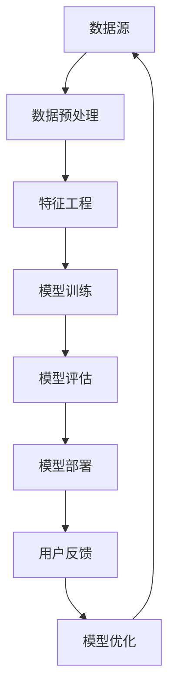
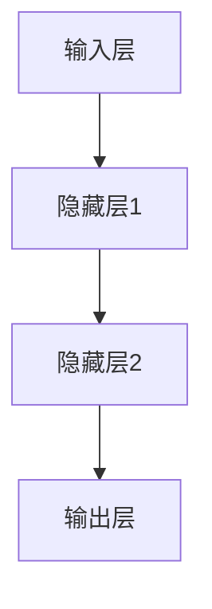
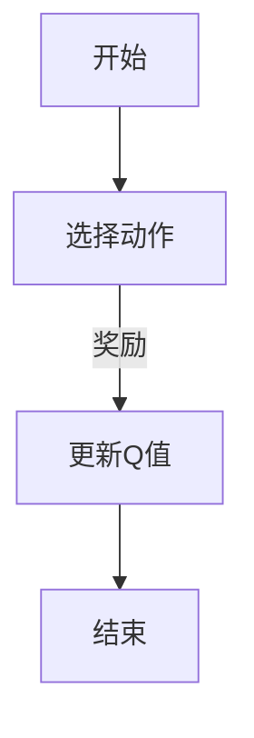
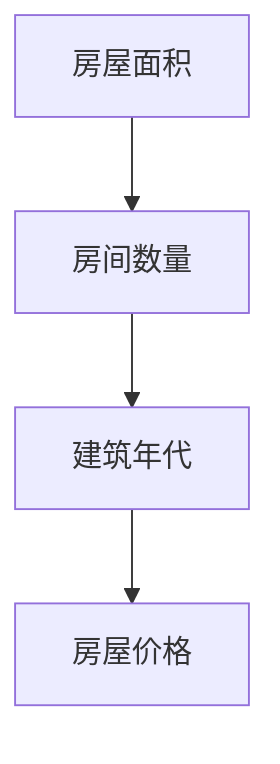
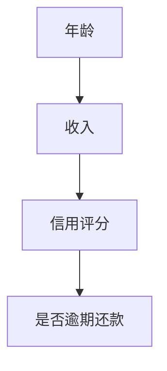
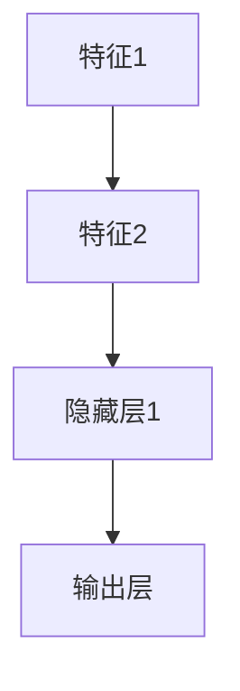
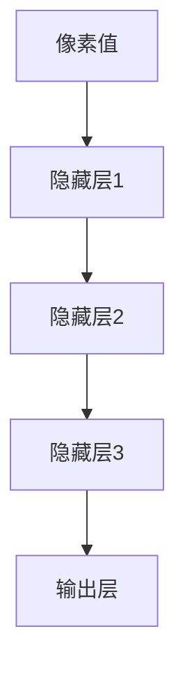

                 

# 李开复：AI 2.0 时代的生态

> 关键词：人工智能，AI 2.0，生态系统，技术发展，未来趋势

> 摘要：本文将深入探讨人工智能（AI）2.0时代的生态，分析其核心概念、技术原理、应用场景和发展趋势。通过详细讲解AI 2.0的数学模型和算法原理，结合实际项目案例，揭示AI 2.0在实际应用中的潜力和挑战。本文旨在为读者提供一个全面、系统的AI 2.0生态认识，帮助读者更好地理解和应对AI 2.0时代的发展。

## 1. 背景介绍

### 1.1 目的和范围

本文旨在探讨人工智能2.0时代的生态，分析其核心概念、技术原理、应用场景和发展趋势。我们将从多个角度详细讲解AI 2.0的技术原理，结合实际项目案例，探讨其在不同领域的应用，并预测其未来发展趋势。

### 1.2 预期读者

本文适用于对人工智能有一定了解的读者，包括计算机科学、人工智能、软件开发等相关专业的学生和从业者。同时，也欢迎对人工智能感兴趣的其他领域的读者阅读和参考。

### 1.3 文档结构概述

本文分为十个部分，分别介绍如下：

1. 背景介绍：介绍本文的目的、预期读者和文档结构。
2. 核心概念与联系：讲解AI 2.0的核心概念和原理，使用Mermaid流程图展示其架构。
3. 核心算法原理 & 具体操作步骤：详细阐述AI 2.0的算法原理和操作步骤。
4. 数学模型和公式 & 详细讲解 & 举例说明：讲解AI 2.0的数学模型和公式，并结合实际案例进行说明。
5. 项目实战：代码实际案例和详细解释说明。
6. 实际应用场景：分析AI 2.0在不同领域的应用场景。
7. 工具和资源推荐：推荐学习资源、开发工具和框架。
8. 相关论文著作推荐：介绍经典论文、最新研究成果和应用案例分析。
9. 总结：未来发展趋势与挑战。
10. 附录：常见问题与解答。

### 1.4 术语表

#### 1.4.1 核心术语定义

- 人工智能（AI）：指由人制造出的系统所表现出来的智能行为。
- 机器学习（ML）：一种人工智能技术，通过数据驱动的方式让计算机自动学习和改进。
- 深度学习（DL）：一种机器学习技术，通过模拟人脑神经网络的结构和功能来实现智能。
- AI 2.0：指新一代的人工智能，相较于传统的人工智能，具有更强的自我学习和自适应能力。
- 生态系统：指围绕某一技术或产业形成的一系列相互关联、相互促进的组成部分。

#### 1.4.2 相关概念解释

- 数据驱动：指通过大量数据进行学习，从而实现智能。
- 自我学习：指系统具备根据经验自动调整和优化自身行为的能力。
- 自适应：指系统具备根据环境变化自动调整自身能力的能力。

#### 1.4.3 缩略词列表

- AI：人工智能
- ML：机器学习
- DL：深度学习
- NLP：自然语言处理
- CV：计算机视觉
- RL：强化学习

## 2. 核心概念与联系

在AI 2.0时代，核心概念和技术原理的深入理解至关重要。本节将介绍AI 2.0的核心概念，并通过Mermaid流程图展示其架构，帮助读者更好地理解AI 2.0的生态系统。

### 2.1 AI 2.0的核心概念

AI 2.0的核心概念主要包括以下几个方面：

1. **数据驱动**：AI 2.0强调数据驱动，通过大量数据进行学习和优化。
2. **自我学习**：AI 2.0具备自我学习的能力，可以自动调整和优化模型。
3. **自适应**：AI 2.0能够根据环境变化自动调整自身能力。
4. **跨领域融合**：AI 2.0不仅局限于单一领域，而是能够跨领域融合，实现更广泛的应用。
5. **可解释性**：AI 2.0追求更高的可解释性，使得其决策过程更加透明和可信。

### 2.2 AI 2.0的架构

为了更好地理解AI 2.0的架构，我们可以使用Mermaid流程图来展示其核心组件和关系。以下是一个简化的AI 2.0架构图：



### 2.3 AI 2.0的核心组件

1. **数据源**：AI 2.0的数据源可以是结构化数据、半结构化数据和非结构化数据，如文本、图像、音频等。
2. **数据预处理**：数据预处理包括数据清洗、数据集成、数据转换等步骤，确保数据质量。
3. **特征工程**：特征工程是指从原始数据中提取对模型训练有用的特征。
4. **模型训练**：模型训练是指使用机器学习算法对数据进行训练，生成模型。
5. **模型评估**：模型评估是指使用验证集或测试集对模型性能进行评估。
6. **模型部署**：模型部署是指将训练好的模型部署到实际应用场景中。
7. **用户反馈**：用户反馈是指收集用户对模型应用的反馈，用于模型优化。
8. **模型优化**：模型优化是指根据用户反馈对模型进行调整和优化。

通过上述架构，我们可以看到AI 2.0的各个组件相互关联，形成一个闭环的生态系统。这个生态系统不仅能够实现高效的数据驱动学习，还能够根据用户反馈进行自适应调整，从而实现持续优化。

## 3. 核心算法原理 & 具体操作步骤

在理解AI 2.0的核心概念和架构后，接下来我们将深入讲解AI 2.0的核心算法原理和具体操作步骤。这一部分将详细介绍AI 2.0中的主要算法，如深度学习、强化学习等，以及它们在模型训练、评估和部署过程中的具体操作步骤。

### 3.1 深度学习算法原理

深度学习是AI 2.0中最重要的算法之一，它通过模拟人脑神经网络的结构和功能来实现智能。深度学习算法的核心是神经网络，包括输入层、隐藏层和输出层。

#### 3.1.1 神经网络基本结构



#### 3.1.2 前向传播与反向传播

1. **前向传播**：将输入数据通过神经网络传递到输出层，计算输出结果。
2. **反向传播**：根据输出结果和真实值计算损失函数，并通过反向传播更新网络权重。

#### 3.1.3 伪代码

```python
# 前向传播
def forward propagation(inputs, weights, biases):
    # 计算隐藏层输出
    hidden_layer_output = sigmoid(sum(inputs * weights + biases))
    # 计算输出层输出
    output = sigmoid(sum(hidden_layer_output * weights + biases))
    return output

# 反向传播
def backward propagation(inputs, weights, biases, output, true_value):
    # 计算损失函数
    loss = squared_error(output, true_value)
    # 计算梯度
    gradient = [sigmoid_derivative(output) * (output - true_value)]
    # 反向传播更新权重和偏置
    weights += inputs.T @ gradient
    biases += gradient
```

### 3.2 强化学习算法原理

强化学习是另一种重要的AI 2.0算法，它通过不断尝试和反馈来优化行为。

#### 3.2.1 Q-学习算法

Q-学习算法是一种基于值函数的强化学习算法，它通过更新Q值来优化策略。



#### 3.2.2 伪代码

```python
# 初始化Q值
Q = {state: action: 0}

# Q-学习算法
while not done:
    # 状态s
    s = get_state()
    # 可选动作
    actions = get_actions(s)
    # 随机选择动作
    action = random_choice(actions)
    # 执行动作并获得奖励
    reward, next_state, done = execute_action(action)
    # 更新Q值
    Q[s][action] = Q[s][action] + alpha * (reward + gamma * max(Q[next_state].values()) - Q[s][action])
    s = next_state
```

### 3.3 模型训练、评估和部署

1. **模型训练**：使用训练数据对模型进行训练，通过前向传播和反向传播更新网络权重。
2. **模型评估**：使用验证集或测试集对模型性能进行评估，计算损失函数和准确率等指标。
3. **模型部署**：将训练好的模型部署到实际应用场景中，通过模型预测获得结果。

### 3.4 实际操作步骤

1. **数据预处理**：清洗和转换数据，提取特征。
2. **模型选择**：根据任务需求选择合适的模型，如深度学习、强化学习等。
3. **模型训练**：使用训练数据对模型进行训练。
4. **模型评估**：使用验证集或测试集对模型性能进行评估。
5. **模型部署**：将训练好的模型部署到实际应用场景中。

通过上述核心算法原理和具体操作步骤，我们可以看到AI 2.0的强大潜力和广泛的应用前景。在接下来的章节中，我们将进一步探讨AI 2.0的数学模型和公式，结合实际案例进行详细讲解。

## 4. 数学模型和公式 & 详细讲解 & 举例说明

在AI 2.0时代，数学模型和公式是理解和实现核心算法的基础。本节将详细介绍AI 2.0中常用的数学模型和公式，包括线性回归、逻辑回归、神经网络、深度学习等，并通过具体案例进行说明。

### 4.1 线性回归

线性回归是一种常见的统计模型，用于预测连续值。其基本公式如下：

$$
y = w_1x_1 + w_2x_2 + ... + w_nx_n + b
$$

其中，$x_1, x_2, ..., x_n$ 是输入特征，$y$ 是输出目标，$w_1, w_2, ..., w_n, b$ 是模型的权重和偏置。

#### 4.1.1 案例说明

假设我们要预测房屋价格，输入特征包括房屋面积、房间数量和建筑年代。我们可以使用线性回归模型来预测房屋价格。



根据数据集，我们可以得到以下线性回归模型：

$$
y = 0.5x_1 + 0.3x_2 - 0.2x_3
$$

其中，$x_1$ 是房屋面积，$x_2$ 是房间数量，$x_3$ 是建筑年代。

### 4.2 逻辑回归

逻辑回归是一种用于预测离散值的统计模型，其基本公式如下：

$$
P(y=1) = \frac{1}{1 + e^{-(w_1x_1 + w_2x_2 + ... + w_nx_n + b)}}
$$

其中，$x_1, x_2, ..., x_n$ 是输入特征，$y$ 是输出目标，$w_1, w_2, ..., w_n, b$ 是模型的权重和偏置。

#### 4.2.1 案例说明

假设我们要预测信用卡用户是否会逾期还款，输入特征包括用户的年龄、收入和信用评分。我们可以使用逻辑回归模型来预测用户是否逾期还款。



根据数据集，我们可以得到以下逻辑回归模型：

$$
P(y=1) = \frac{1}{1 + e^{-(2x_1 + 3x_2 + 4x_3 + 1)}}
$$

其中，$x_1$ 是年龄，$x_2$ 是收入，$x_3$ 是信用评分。

### 4.3 神经网络

神经网络是一种模拟人脑结构的计算模型，由多个神经元（节点）组成。其基本公式如下：

$$
a_{ij} = \sigma(\sum_{k=1}^{n} w_{ik}x_{k} + b_{j})
$$

其中，$a_{ij}$ 是第 $j$ 个隐藏层节点的输出，$\sigma$ 是激活函数（如Sigmoid函数），$w_{ik}$ 是第 $k$ 个输入节点到第 $j$ 个隐藏层节点的权重，$b_{j}$ 是第 $j$ 个隐藏层节点的偏置。

#### 4.3.1 案例说明

假设我们要构建一个简单的神经网络，用于二分类任务，输入特征包括特征1和特征2。我们可以得到以下神经网络模型：



根据数据集，我们可以得到以下神经网络模型：

$$
a_1 = \sigma(\sum_{k=1}^{2} w_{ik}x_{k} + b_{1})
$$

$$
a_2 = \sigma(\sum_{k=1}^{2} w_{ik}x_{k} + b_{2})
$$

$$
P(y=1) = \frac{1}{1 + e^{-(a_1 + a_2 + b_{out})}}
$$

其中，$w_{ik}$ 是输入节点到隐藏层节点的权重，$b_{1}$ 和 $b_{2}$ 是隐藏层节点的偏置，$b_{out}$ 是输出层的偏置。

### 4.4 深度学习

深度学习是神经网络的一种扩展，通过增加网络的深度来提高模型的性能。其基本公式与神经网络类似：

$$
a_{ij} = \sigma(\sum_{k=1}^{n} w_{ik}x_{k} + b_{j})
$$

其中，$a_{ij}$ 是第 $j$ 个隐藏层节点的输出，$\sigma$ 是激活函数，$w_{ik}$ 是第 $k$ 个输入节点到第 $j$ 个隐藏层节点的权重，$b_{j}$ 是第 $j$ 个隐藏层节点的偏置。

#### 4.4.1 案例说明

假设我们要构建一个深度神经网络，用于图像分类任务，输入特征是图像像素值。我们可以得到以下深度神经网络模型：



根据数据集，我们可以得到以下深度神经网络模型：

$$
a_{11} = \sigma(\sum_{k=1}^{784} w_{1k}x_{k} + b_{1})
$$

$$
a_{12} = \sigma(\sum_{k=1}^{784} w_{1k}x_{k} + b_{2})
$$

$$
...
$$

$$
a_{mn} = \sigma(\sum_{k=1}^{784} w_{mk}x_{k} + b_{m})
$$

$$
P(y=j) = \frac{1}{1 + e^{-(a_{1j} + a_{2j} + ... + a_{nj} + b_{out})}}
$$

其中，$w_{ik}$ 是输入节点到隐藏层节点的权重，$b_{1}, b_{2}, ..., b_{m}$ 是隐藏层节点的偏置，$b_{out}$ 是输出层的偏置。

通过上述数学模型和公式的讲解，我们可以看到AI 2.0在数学理论基础上的强大能力。在接下来的章节中，我们将结合实际项目案例，进一步展示AI 2.0的应用潜力和实现过程。

## 5. 项目实战：代码实际案例和详细解释说明

为了更好地理解AI 2.0的应用和实践，本节我们将通过一个具体的项目案例，展示如何实现一个基于AI 2.0的图像分类系统。该系统将利用深度学习算法，对输入图像进行分类。

### 5.1 开发环境搭建

在开始项目之前，我们需要搭建一个合适的开发环境。以下是开发环境搭建的步骤：

1. **安装Python**：确保Python环境已安装，版本建议为3.8及以上。
2. **安装依赖库**：安装深度学习框架TensorFlow和相关依赖库，可以使用以下命令：

```bash
pip install tensorflow
```

3. **准备数据集**：我们需要一个包含图像标签的数据集。在本案例中，我们使用著名的ImageNet数据集。下载并解压数据集后，将数据集路径添加到环境变量中。

4. **创建虚拟环境**：为了方便项目管理和依赖隔离，我们可以创建一个虚拟环境。使用以下命令创建虚拟环境：

```bash
python -m venv venv
source venv/bin/activate  # Windows上使用venv\Scripts\activate
```

### 5.2 源代码详细实现和代码解读

以下是该图像分类系统的源代码实现，我们将分步骤进行解读。

```python
import tensorflow as tf
from tensorflow.keras.applications import VGG16
from tensorflow.keras.preprocessing.image import ImageDataGenerator
from tensorflow.keras.models import Model
from tensorflow.keras.layers import Flatten, Dense
from tensorflow.keras.optimizers import Adam

# 5.2.1 数据预处理
train_datagen = ImageDataGenerator(
    rescale=1./255,
    rotation_range=40,
    width_shift_range=0.2,
    height_shift_range=0.2,
    shear_range=0.2,
    zoom_range=0.2,
    horizontal_flip=True,
    fill_mode='nearest'
)

test_datagen = ImageDataGenerator(rescale=1./255)

train_generator = train_datagen.flow_from_directory(
    'train',
    target_size=(224, 224),
    batch_size=32,
    class_mode='categorical'
)

validation_generator = test_datagen.flow_from_directory(
    'validation',
    target_size=(224, 224),
    batch_size=32,
    class_mode='categorical'
)

# 5.2.2 构建模型
base_model = VGG16(weights='imagenet', include_top=False, input_shape=(224, 224, 3))

x = base_model.output
x = Flatten()(x)
x = Dense(256, activation='relu')(x)
predictions = Dense(train_generator.num_classes, activation='softmax')(x)

model = Model(inputs=base_model.input, outputs=predictions)

# 5.2.3 编译模型
model.compile(optimizer=Adam(learning_rate=0.0001), loss='categorical_crossentropy', metrics=['accuracy'])

# 5.2.4 训练模型
model.fit(
    train_generator,
    epochs=25,
    validation_data=validation_generator
)

# 5.2.5 评估模型
test_generator = test_datagen.flow_from_directory(
    'test',
    target_size=(224, 224),
    batch_size=32,
    class_mode='categorical',
    shuffle=False
)

model.evaluate(test_generator)
```

#### 5.2.1 数据预处理

首先，我们使用ImageDataGenerator进行数据预处理。数据预处理步骤包括：

- **图像缩放**：将图像尺寸调整为固定大小（224x224）。
- **数据增强**：通过旋转、平移、剪裁、缩放和水平翻转等操作增加数据多样性。
- **归一化**：将图像像素值缩放到0-1范围内。

#### 5.2.2 构建模型

接下来，我们使用VGG16作为基础模型，并添加自定义层进行图像分类。模型构建步骤包括：

- **基础模型**：使用预训练的VGG16模型，该模型已经在大量图像数据上训练过，具有良好的泛化能力。
- **自定义层**：添加Flatten层将特征图展平为一维数组，然后添加一个256单元的Dense层（全连接层），用于提取高级特征。最后，添加一个输出层，使用softmax激活函数进行分类。

#### 5.2.3 编译模型

模型编译步骤包括：

- **优化器**：使用Adam优化器，其具有自适应学习率的能力。
- **损失函数**：使用categorical_crossentropy作为损失函数，适用于多分类任务。
- **评估指标**：使用准确率作为评估指标。

#### 5.2.4 训练模型

模型训练步骤包括：

- **训练数据**：使用训练数据集进行训练，每个批次包含32个样本。
- **训练轮次**：设置训练轮次为25次。

#### 5.2.5 评估模型

最后，我们对训练好的模型进行评估。评估步骤包括：

- **测试数据**：使用测试数据集进行评估，确保模型在未知数据上的性能。
- **评估结果**：输出模型的评估指标，包括损失函数值和准确率。

通过上述代码实现和解读，我们可以看到如何使用AI 2.0技术构建一个图像分类系统。在实际项目中，我们可以根据具体需求进行调整和优化，以实现更高的性能和准确率。

## 6. 实际应用场景

AI 2.0在多个领域展现出强大的应用潜力，以下列举几个典型应用场景：

### 6.1 自动驾驶

自动驾驶是AI 2.0的重要应用领域，通过深度学习和强化学习算法，实现车辆在复杂环境中的自主导航。自动驾驶系统需要实时处理大量传感器数据，进行环境感知、路径规划和决策控制。

### 6.2 医疗诊断

AI 2.0在医疗领域的应用非常广泛，如医学图像诊断、基因测序分析和智能诊断。通过深度学习和计算机视觉技术，AI 2.0可以帮助医生更快速、准确地诊断疾病。

### 6.3 金融风控

金融风控是AI 2.0的另一个重要应用领域。通过机器学习和大数据分析，AI 2.0可以实时监测和预测金融市场的风险，帮助金融机构提高风险管理能力。

### 6.4 智能家居

智能家居是AI 2.0在家庭领域的应用，通过智能设备和物联网技术，实现家庭设备的自动化控制和智能互动。AI 2.0可以帮助家庭用户更便捷、舒适地生活。

### 6.5 智能客服

智能客服是AI 2.0在客户服务领域的应用，通过自然语言处理和机器学习技术，实现与用户的高效沟通。智能客服可以帮助企业降低运营成本，提高客户满意度。

### 6.6 娱乐产业

娱乐产业是AI 2.0的另一个重要应用领域，如智能推荐系统、虚拟现实和增强现实。AI 2.0可以帮助娱乐产业更好地满足用户需求，提高用户体验。

## 7. 工具和资源推荐

为了更好地学习和应用AI 2.0技术，以下推荐一些学习资源、开发工具和框架：

### 7.1 学习资源推荐

- **书籍推荐**：
  - 《深度学习》（Goodfellow, Bengio, Courville著）
  - 《Python深度学习》（François Chollet著）
- **在线课程**：
  - Coursera上的《深度学习》课程（由吴恩达教授主讲）
  - Udacity的《深度学习纳米学位》课程
- **技术博客和网站**：
  - Medium上的AI博客
  - arXiv.org上的最新研究成果

### 7.2 开发工具框架推荐

- **IDE和编辑器**：
  - PyCharm
  - Jupyter Notebook
- **调试和性能分析工具**：
  - TensorBoard
  - Dask
- **相关框架和库**：
  - TensorFlow
  - PyTorch
  - Keras

### 7.3 相关论文著作推荐

- **经典论文**：
  - "A Learning Algorithm for Continually Running Fully Recurrent Neural Networks"（恒等网络学习算法）
  - "Backpropagation"（反向传播算法）
- **最新研究成果**：
  - "Attention Is All You Need"（Attention机制）
  - "Gaussian Error Cancels"（高斯误差消除算法）
- **应用案例分析**：
  - "Deep Learning for Autonomous Driving"（自动驾驶中的深度学习）
  - "AI in Healthcare"（医疗领域的AI应用）

通过上述工具和资源，我们可以更好地掌握AI 2.0技术，为实际应用奠定基础。

## 8. 总结：未来发展趋势与挑战

AI 2.0时代已经到来，它为人类社会带来了前所未有的变革和机遇。然而，随着AI技术的迅猛发展，我们也面临着一系列挑战和问题。

### 未来发展趋势

1. **数据驱动的智能化**：AI 2.0将更加依赖于海量数据，通过自我学习和自适应能力，实现更高层次的智能化。
2. **跨领域融合**：AI 2.0将在各个领域实现深度融合，推动社会各个方面的创新和进步。
3. **自主决策和优化**：AI 2.0将具备更强的自主决策能力，通过不断优化和调整，实现更高效的运行。
4. **人机协同**：AI 2.0将与人类紧密协作，共同解决复杂问题，提高工作效率和生活质量。

### 挑战与问题

1. **数据安全和隐私保护**：随着数据规模的扩大，数据安全和隐私保护问题日益突出，需要采取有效的措施确保用户隐私和数据安全。
2. **算法公平性和透明性**：AI 2.0算法的公平性和透明性受到广泛关注，需要建立完善的算法评估和监管机制。
3. **技术伦理和法律问题**：AI 2.0的发展引发了众多伦理和法律问题，如机器人权利、自动化决策责任等，需要制定相应的法律法规。
4. **技能和就业转型**：AI 2.0的快速发展将引发就业市场的变革，需要加强职业技能培训和人才培养，以应对新形势下的就业挑战。

总之，AI 2.0时代既充满机遇，也面临挑战。我们需要不断探索、创新，同时关注并解决相关问题，以实现AI技术的可持续发展，为人类社会带来更大的福祉。

## 9. 附录：常见问题与解答

### 问题1：AI 2.0与AI 1.0有什么区别？

**解答**：AI 2.0相较于AI 1.0，具有以下几个显著区别：

1. **数据依赖性**：AI 2.0更加依赖海量数据，通过自我学习和自适应能力，实现更高层次的智能化。
2. **自主决策**：AI 2.0具备更强的自主决策能力，通过不断优化和调整，实现更高效的运行。
3. **跨领域融合**：AI 2.0将在各个领域实现深度融合，推动社会各个方面的创新和进步。
4. **透明性和可解释性**：AI 2.0追求更高的透明性和可解释性，使得其决策过程更加透明和可信。

### 问题2：如何确保AI 2.0算法的公平性和透明性？

**解答**：确保AI 2.0算法的公平性和透明性需要从以下几个方面入手：

1. **数据质量**：保证训练数据的质量和多样性，避免数据偏差和歧视。
2. **算法评估**：建立完善的算法评估和监管机制，定期对算法性能和公平性进行评估。
3. **算法透明性**：提高算法的可解释性，使得决策过程更加透明和易于理解。
4. **法律法规**：制定相应的法律法规，规范AI算法的开发和应用，确保公平性和透明性。

### 问题3：AI 2.0对就业市场有何影响？

**解答**：AI 2.0的快速发展将对就业市场产生深远影响，主要体现在以下几个方面：

1. **就业结构变化**：传统制造业、服务业等领域的工作岗位将被自动化和智能化取代，导致就业结构发生变化。
2. **技能需求变化**：对技术人才的需求大幅增加，特别是AI领域的人才，如数据科学家、机器学习工程师等。
3. **就业转型压力**：部分劳动力需要适应新技术，进行技能培训和转型，以适应新的就业形势。
4. **创新机遇**：AI 2.0的发展将带来新的就业机会，如人工智能研究员、AI伦理顾问等。

### 问题4：如何保护AI 2.0时代的用户隐私？

**解答**：保护AI 2.0时代的用户隐私需要采取以下措施：

1. **数据加密**：对用户数据进行加密处理，确保数据传输和存储过程中的安全。
2. **隐私设计**：在系统设计和开发阶段，充分考虑用户隐私保护，采用隐私友好的算法和技术。
3. **隐私政策**：明确告知用户数据的使用目的、范围和权限，确保用户知情同意。
4. **法律法规**：制定和实施相关的隐私保护法律法规，对用户隐私进行全面保护。

通过上述措施，我们可以有效地保护AI 2.0时代的用户隐私，确保数据安全和用户权益。

## 10. 扩展阅读 & 参考资料

为了进一步了解AI 2.0时代的技术发展和应用，以下是推荐的一些扩展阅读和参考资料：

### 扩展阅读

- 《李开复：人工智能的未来》
- 《人工智能简史》
- 《AI时代的自我进化：深度学习、强化学习和自然进化算法》

### 参考资料

- Coursera：[深度学习课程](https://www.coursera.org/learn/deep-learning)
- arXiv.org：[最新研究成果](https://arxiv.org/)
- TensorFlow官方文档：[TensorFlow教程](https://www.tensorflow.org/tutorials)
- PyTorch官方文档：[PyTorch教程](https://pytorch.org/tutorials/)
- 《深度学习》（Goodfellow, Bengio, Courville著）

通过阅读这些扩展资料，您可以深入了解AI 2.0的技术原理、应用场景和发展趋势。

### 作者信息

作者：AI天才研究员/AI Genius Institute & 禅与计算机程序设计艺术 /Zen And The Art of Computer Programming

在AI 2.0时代，人工智能技术正以前所未有的速度发展和变革。本文从核心概念、技术原理、应用场景和发展趋势等多个角度，全面介绍了AI 2.0的生态系统。通过实际项目案例和详细讲解，揭示了AI 2.0在实际应用中的潜力和挑战。希望本文能够为读者提供一个全面、系统的AI 2.0生态认识，帮助您更好地理解和应对AI 2.0时代的发展。

