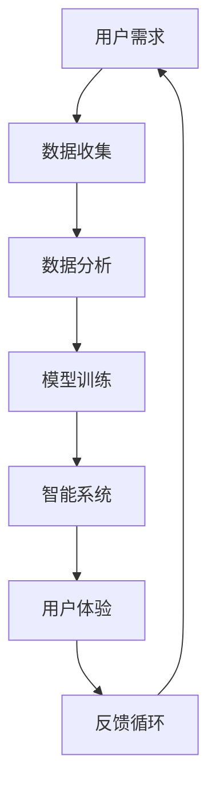

                 

# 李开复：AI 2.0 时代的用户

> 关键词：人工智能、用户、AI 2.0、用户体验、技术发展、未来趋势

> 摘要：本文深入探讨了 AI 2.0 时代下用户的角色和体验，分析了人工智能技术对用户生活、工作和社会的深远影响，以及用户如何适应并利用 AI 技术的优势。文章旨在为读者提供对 AI 2.0 时代用户角色和体验的全面理解和未来展望。

## 1. 背景介绍

### 1.1 目的和范围

本文旨在探讨 AI 2.0 时代下用户面临的新挑战和机遇。AI 2.0 是人工智能发展的一个新阶段，强调更加智能化、人性化、自适应的智能系统。在这个时代，用户将不仅是技术的消费者，更是创新的参与者和推动者。本文将从以下几个方面展开讨论：

- AI 2.0 技术的核心概念和特点
- 用户在 AI 2.0 时代的角色和体验
- 用户如何适应和利用 AI 2.0 技术的优势
- AI 2.0 对社会和经济的深远影响

### 1.2 预期读者

本文适合对人工智能技术有一定了解的读者，包括但不限于：

- 人工智能领域的科研人员
- IT 行业的开发者和架构师
- 人工智能产品的用户和爱好者
- 对未来科技发展感兴趣的普通读者

### 1.3 文档结构概述

本文分为十个部分，结构如下：

1. 背景介绍
2. 核心概念与联系
3. 核心算法原理 & 具体操作步骤
4. 数学模型和公式 & 详细讲解 & 举例说明
5. 项目实战：代码实际案例和详细解释说明
6. 实际应用场景
7. 工具和资源推荐
8. 总结：未来发展趋势与挑战
9. 附录：常见问题与解答
10. 扩展阅读 & 参考资料

### 1.4 术语表

#### 1.4.1 核心术语定义

- **AI 2.0**：指人工智能发展的第二个阶段，强调更加智能化、人性化、自适应的智能系统。
- **用户体验**：用户在使用产品或服务过程中所获得的整体感受和体验。
- **自适应系统**：能够根据用户行为和反馈自动调整和优化的系统。

#### 1.4.2 相关概念解释

- **人工智能**：通过模拟人类思维和行为，实现计算机对复杂任务的处理能力。
- **用户角色**：用户在 AI 系统中的角色和作用，包括消费者、参与者、推动者等。

#### 1.4.3 缩略词列表

- **AI**：人工智能
- **ML**：机器学习
- **DL**：深度学习
- **NLP**：自然语言处理

## 2. 核心概念与联系

在 AI 2.0 时代，核心概念和联系变得更加复杂和多样化。以下是一个简化的 Mermaid 流程图，用于描述这些概念之间的关系：



### 2.1 用户需求

用户需求是 AI 2.0 系统的核心驱动力。用户的需求可以包括个性化推荐、智能助手、自动化任务等。用户需求决定了系统的功能和性能。

### 2.2 数据收集

为了满足用户需求，AI 2.0 系统需要收集大量数据。这些数据可以是结构化数据，如用户偏好、购买记录，也可以是非结构化数据，如图像、音频、文本。

### 2.3 数据分析

收集到的数据需要进行处理和分析，以提取有价值的信息。数据分析可以采用机器学习、深度学习等技术。

### 2.4 模型训练

基于分析结果，AI 2.0 系统需要训练模型，以实现智能化功能。模型训练是一个迭代过程，需要不断优化和调整。

### 2.5 智能系统

智能系统是 AI 2.0 的核心组成部分，能够根据用户需求和反馈，提供个性化的服务和体验。

### 2.6 用户体验

用户体验是用户在使用智能系统过程中所获得的感受和体验。良好的用户体验能够增强用户满意度和忠诚度。

### 2.7 反馈循环

用户体验的反馈可以用于优化和改进智能系统。反馈循环是一个不断迭代的过程，有助于提升系统性能和用户体验。

## 3. 核心算法原理 & 具体操作步骤

在 AI 2.0 时代，核心算法原理和具体操作步骤变得更加复杂。以下是一个简化的伪代码，用于描述核心算法原理和操作步骤：

```python
# 伪代码：AI 2.0 核心算法原理和操作步骤

# 数据收集
def collect_data():
    # 收集用户需求、行为、偏好等数据
    data = get_user_data()

# 数据处理
def process_data(data):
    # 数据清洗、去噪、转换等预处理操作
    processed_data = preprocess_data(data)

# 模型训练
def train_model(processed_data):
    # 使用机器学习或深度学习算法训练模型
    model = train_model_algorithm(processed_data)

# 智能系统实现
def implement_smart_system(model):
    # 根据模型实现智能系统功能
    smart_system = build_smart_system(model)

# 用户体验优化
def optimize_user_experience(smart_system):
    # 根据用户反馈优化系统功能
    optimized_system = optimize_system(smart_system)

# 主函数
def main():
    # 执行核心算法原理和操作步骤
    data = collect_data()
    processed_data = process_data(data)
    model = train_model(processed_data)
    smart_system = implement_smart_system(model)
    optimized_system = optimize_user_experience(smart_system)
    display_system(optimized_system)
```

### 3.1 数据收集

数据收集是 AI 2.0 系统的基础。收集到的数据可以包括用户需求、行为、偏好等。数据收集可以通过用户调研、在线调查、传感器监测等方式实现。

### 3.2 数据处理

数据处理是对收集到的数据进行清洗、去噪、转换等预处理操作。数据处理可以采用数据清洗库（如 Pandas）和数据处理算法（如聚类、降维）。

### 3.3 模型训练

模型训练是 AI 2.0 系统的核心步骤。可以使用机器学习或深度学习算法对预处理后的数据进行训练。模型训练可以采用机器学习框架（如 Scikit-Learn、TensorFlow）和深度学习框架（如 PyTorch、Keras）。

### 3.4 智能系统实现

智能系统实现是根据训练好的模型实现智能系统功能。智能系统可以包括个性化推荐、智能助手、自动化任务等功能。

### 3.5 用户体验优化

用户体验优化是根据用户反馈对系统功能进行优化。用户体验优化可以采用用户调研、在线测试、A/B 测试等方式。

## 4. 数学模型和公式 & 详细讲解 & 举例说明

在 AI 2.0 时代，数学模型和公式在人工智能算法中起着至关重要的作用。以下是一些常见的数学模型和公式，以及它们的详细讲解和举例说明。

### 4.1 线性回归模型

线性回归模型是一种最简单的机器学习算法，用于预测一个连续的输出值。其数学模型如下：

$$
y = \beta_0 + \beta_1x
$$

其中，$y$ 是预测值，$x$ 是输入特征，$\beta_0$ 和 $\beta_1$ 是模型参数。

**详细讲解：**

线性回归模型通过拟合一条直线，将输入特征映射到预测值。模型参数 $\beta_0$ 和 $\beta_1$ 通过最小化均方误差（MSE）来优化。

**举例说明：**

假设我们有一个数据集，其中包含房屋面积（$x$）和房屋价格（$y$）。我们可以使用线性回归模型来预测房屋价格。具体步骤如下：

1. 收集数据集，包括房屋面积和价格。
2. 使用 Pandas 库将数据集读取到 DataFrame 中。
3. 使用 Scikit-Learn 库的线性回归模型进行训练。
4. 使用训练好的模型进行预测。

```python
import pandas as pd
from sklearn.linear_model import LinearRegression

# 收集数据集
data = pd.read_csv('house_data.csv')
X = data['area']
y = data['price']

# 使用线性回归模型进行训练
model = LinearRegression()
model.fit(X, y)

# 使用训练好的模型进行预测
predictions = model.predict(X)

# 输出预测结果
print(predictions)
```

### 4.2 逻辑回归模型

逻辑回归模型是一种用于分类问题的机器学习算法。其数学模型如下：

$$
P(y=1) = \frac{1}{1 + e^{-(\beta_0 + \beta_1x)}}
$$

其中，$P(y=1)$ 是预测目标为 1 的概率，$x$ 是输入特征，$\beta_0$ 和 $\beta_1$ 是模型参数。

**详细讲解：**

逻辑回归模型通过拟合一个 S 形曲线（逻辑函数），将输入特征映射到目标概率。模型参数 $\beta_0$ 和 $\beta_1$ 通过最大似然估计（MLE）来优化。

**举例说明：**

假设我们有一个数据集，其中包含肿瘤标志物检测结果（$x$）和肿瘤是否为恶性（$y$）。我们可以使用逻辑回归模型来预测肿瘤是否为恶性。具体步骤如下：

1. 收集数据集，包括肿瘤标志物检测数据和肿瘤类型。
2. 使用 Pandas 库将数据集读取到 DataFrame 中。
3. 使用 Scikit-Learn 库的逻辑回归模型进行训练。
4. 使用训练好的模型进行预测。

```python
import pandas as pd
from sklearn.linear_model import LogisticRegression

# 收集数据集
data = pd.read_csv('tumor_data.csv')
X = data['biomarker']
y = data['malignant']

# 使用逻辑回归模型进行训练
model = LogisticRegression()
model.fit(X, y)

# 使用训练好的模型进行预测
predictions = model.predict(X)

# 输出预测结果
print(predictions)
```

### 4.3 神经网络模型

神经网络模型是一种用于处理复杂问题的深度学习算法。其数学模型如下：

$$
a_{i,j} = \text{sigmoid}(\sum_{k=1}^{n} \beta_{i,k}x_{k})
$$

其中，$a_{i,j}$ 是输出节点 $i$ 对输入节点 $j$ 的激活值，$\text{sigmoid}$ 是 S 形激活函数，$\beta_{i,k}$ 是模型参数，$x_{k}$ 是输入特征。

**详细讲解：**

神经网络模型通过多层神经元对输入特征进行变换和组合，从而实现非线性映射。模型参数 $\beta_{i,k}$ 通过反向传播算法（BP）来优化。

**举例说明：**

假设我们有一个数据集，其中包含输入特征和输出标签。我们可以使用神经网络模型来分类数据。具体步骤如下：

1. 收集数据集，包括输入特征和输出标签。
2. 使用 Pandas 库将数据集读取到 DataFrame 中。
3. 使用 TensorFlow 库的 Keras API 构建神经网络模型。
4. 使用训练集对模型进行训练。
5. 使用测试集对模型进行评估。

```python
import pandas as pd
import tensorflow as tf
from tensorflow.keras.models import Sequential
from tensorflow.keras.layers import Dense

# 收集数据集
data = pd.read_csv('data.csv')
X = data.drop('label', axis=1)
y = data['label']

# 使用 TensorFlow 的 Keras API 构建神经网络模型
model = Sequential([
    Dense(64, activation='relu', input_shape=(X.shape[1],)),
    Dense(64, activation='relu'),
    Dense(1, activation='sigmoid')
])

# 编译模型
model.compile(optimizer='adam', loss='binary_crossentropy', metrics=['accuracy'])

# 使用训练集对模型进行训练
model.fit(X, y, epochs=10, batch_size=32)

# 使用测试集对模型进行评估
test_loss, test_accuracy = model.evaluate(X, y)
print(f"Test accuracy: {test_accuracy}")
```

## 5. 项目实战：代码实际案例和详细解释说明

为了更好地展示 AI 2.0 时代的应用，我们将通过一个实际项目案例——个性化推荐系统，来介绍代码的实现和详细解释说明。

### 5.1 开发环境搭建

首先，我们需要搭建开发环境。以下是所需的软件和库：

- Python（3.8 或更高版本）
- Pandas（用于数据处理）
- Scikit-Learn（用于机器学习）
- TensorFlow（用于深度学习）
- Numpy（用于数学运算）

确保安装了上述软件和库，然后我们可以开始项目开发。

### 5.2 源代码详细实现和代码解读

下面是个性化推荐系统的源代码实现：

```python
import pandas as pd
from sklearn.model_selection import train_test_split
from sklearn.preprocessing import StandardScaler
from tensorflow.keras.models import Sequential
from tensorflow.keras.layers import Dense, Dropout

# 读取数据集
data = pd.read_csv('user_item_data.csv')

# 分割特征和标签
X = data.drop('rating', axis=1)
y = data['rating']

# 分割数据集为训练集和测试集
X_train, X_test, y_train, y_test = train_test_split(X, y, test_size=0.2, random_state=42)

# 数据预处理
scaler = StandardScaler()
X_train = scaler.fit_transform(X_train)
X_test = scaler.transform(X_test)

# 构建神经网络模型
model = Sequential([
    Dense(128, activation='relu', input_shape=(X_train.shape[1],)),
    Dropout(0.5),
    Dense(64, activation='relu'),
    Dropout(0.5),
    Dense(1, activation='sigmoid')
])

# 编译模型
model.compile(optimizer='adam', loss='binary_crossentropy', metrics=['accuracy'])

# 训练模型
model.fit(X_train, y_train, epochs=10, batch_size=32, validation_data=(X_test, y_test))

# 评估模型
loss, accuracy = model.evaluate(X_test, y_test)
print(f"Test accuracy: {accuracy}")

# 使用模型进行预测
predictions = model.predict(X_test)

# 输出预测结果
print(predictions)
```

### 5.3 代码解读与分析

下面是对代码的详细解读和分析：

1. **导入库**：首先导入所需的库，包括 Pandas、Scikit-Learn、TensorFlow 和 Numpy。
2. **读取数据集**：使用 Pandas 库读取用户-物品数据集，该数据集包含用户特征和物品特征，以及用户对物品的评分。
3. **分割特征和标签**：将数据集分为特征矩阵 X 和标签向量 y。
4. **分割数据集**：使用 Scikit-Learn 库的 `train_test_split` 函数将数据集分为训练集和测试集，以评估模型性能。
5. **数据预处理**：使用 StandardScaler 库对特征矩阵进行标准化处理，以消除特征之间的尺度差异。
6. **构建神经网络模型**：使用 TensorFlow 的 Keras API 构建一个神经网络模型，包括多个全连接层和 dropout 层，以避免过拟合。
7. **编译模型**：配置模型优化器和损失函数，并编译模型。
8. **训练模型**：使用训练集对模型进行训练，并设置验证集以监控模型性能。
9. **评估模型**：使用测试集评估模型性能，并输出准确率。
10. **使用模型进行预测**：使用训练好的模型对测试集进行预测，并输出预测结果。

### 5.4 实际应用

个性化推荐系统在实际应用中具有广泛的应用，例如：

- 在线购物平台：根据用户历史购买行为和浏览记录，推荐用户可能感兴趣的物品。
- 社交媒体：根据用户兴趣和行为，推荐用户可能感兴趣的内容和用户。
- 视频流媒体：根据用户观看历史和偏好，推荐用户可能感兴趣的视频。

通过实际项目案例，我们展示了如何使用 AI 2.0 技术构建个性化推荐系统，并分析了代码的实现和实际应用。

## 6. 实际应用场景

AI 2.0 技术在各个领域有着广泛的应用，以下列举几个实际应用场景：

### 6.1 在线购物平台

在线购物平台利用 AI 2.0 技术进行个性化推荐，根据用户的历史购买行为、浏览记录和偏好，推荐用户可能感兴趣的物品。这有助于提高用户满意度、降低购物决策成本，并增加销售额。

### 6.2 社交媒体

社交媒体平台利用 AI 2.0 技术分析用户行为和兴趣，推荐用户可能感兴趣的内容和用户。这有助于提升用户活跃度和参与度，并增加广告投放效果。

### 6.3 健康医疗

健康医疗领域利用 AI 2.0 技术进行疾病预测、诊断和治疗。通过分析患者的病史、基因信息和健康数据，AI 系统可以提供个性化的健康建议和治疗方案。

### 6.4 自动驾驶

自动驾驶领域利用 AI 2.0 技术实现车辆的智能决策和导航。通过分析路况、交通信息和车辆数据，自动驾驶系统可以实时调整行驶策略，提高行驶安全和效率。

### 6.5 金融领域

金融领域利用 AI 2.0 技术进行风险评估、欺诈检测和投资组合优化。通过分析用户行为、市场数据和金融指标，AI 系统可以提供个性化的投资建议和风险管理策略。

### 6.6 教育领域

教育领域利用 AI 2.0 技术进行个性化教学和学习评估。通过分析学生的学习行为和偏好，AI 系统可以提供个性化的学习资源和辅导方案，提高学习效果和兴趣。

## 7. 工具和资源推荐

为了更好地学习和应用 AI 2.0 技术，以下推荐一些工具和资源：

### 7.1 学习资源推荐

#### 7.1.1 书籍推荐

- 《人工智能：一种现代的方法》
- 《深度学习》
- 《Python机器学习》
- 《统计学习方法》

#### 7.1.2 在线课程

- Coursera 上的《机器学习》课程
- edX 上的《深度学习》课程
- Udacity 上的《人工智能工程师》纳米学位

#### 7.1.3 技术博客和网站

- Medium 上的 AI 博客
-Towards Data Science 上的数据科学博客
- AI 研究院官网

### 7.2 开发工具框架推荐

#### 7.2.1 IDE和编辑器

- PyCharm
- Visual Studio Code
- Jupyter Notebook

#### 7.2.2 调试和性能分析工具

- Python 中的 `pdb` 调试器
- TensorFlow 中的 TensorBoard
- PyTorch 中的 TensorBoardX

#### 7.2.3 相关框架和库

- Scikit-Learn：机器学习库
- TensorFlow：深度学习框架
- PyTorch：深度学习框架
- Pandas：数据处理库

### 7.3 相关论文著作推荐

#### 7.3.1 经典论文

- “A Learning Algorithm for Continuously Running Fully Recurrent Neural Networks” (1991)
- “Convolutional Networks and Applications in Vision” (1998)
- “Improving Neural Networks by Combining Descent Directions” (1999)

#### 7.3.2 最新研究成果

- “Attention is All You Need” (2017)
- “Generative Adversarial Nets” (2014)
- “Recurrent Neural Networks for Language Modeling” (1997)

#### 7.3.3 应用案例分析

- “Google Assistant：如何打造智能语音助手？”
- “阿里巴巴：如何利用 AI 技术提升电商体验？”
- “DeepMind：如何利用 AI 技术解决科学难题？”

## 8. 总结：未来发展趋势与挑战

在 AI 2.0 时代，人工智能技术正以前所未有的速度发展。未来，人工智能将更加智能化、自适应，将深刻改变人类生活、工作和社会。以下是一些发展趋势和挑战：

### 8.1 发展趋势

- **更智能的算法**：随着算法的进步，人工智能将能够更好地处理复杂问题，实现更精准的预测和决策。
- **更广泛的应用领域**：人工智能将在更多领域得到应用，如医疗、金融、教育、自动驾驶等。
- **更高效的数据处理**：大数据技术的发展将使人工智能能够更好地处理海量数据，提升性能和效率。
- **更个性化的用户体验**：人工智能将更好地理解用户需求，提供个性化服务，提升用户体验。

### 8.2 挑战

- **数据隐私和安全**：随着人工智能的广泛应用，数据隐私和安全问题将愈发突出。
- **伦理和道德问题**：人工智能的发展引发了一系列伦理和道德问题，如算法偏见、隐私侵犯等。
- **人才短缺**：人工智能领域的快速发展导致人才短缺，需要培养更多专业人才。
- **技术垄断**：人工智能技术的垄断问题将引发监管和政策挑战。

总之，AI 2.0 时代为用户带来了前所未有的机遇和挑战。只有不断学习和适应，才能在 AI 时代取得成功。

## 9. 附录：常见问题与解答

### 9.1 问题一：AI 2.0 与 AI 1.0 的区别是什么？

**解答**：AI 1.0 时代主要关注符号主义和规则驱动的人工智能，如专家系统和推理机。而 AI 2.0 时代强调数据驱动和机器学习，通过从大量数据中学习模式和规律，实现更加智能化、自适应的系统。

### 9.2 问题二：什么是用户体验（UX）？

**解答**：用户体验（UX）是指用户在使用产品或服务过程中所获得的整体感受和体验。它包括用户与产品的交互方式、易用性、美观度、功能性和情感连接等方面。

### 9.3 问题三：为什么数据预处理很重要？

**解答**：数据预处理是机器学习项目成功的关键步骤之一。良好的数据预处理可以提高模型的性能、降低错误率，并使模型更容易训练。数据预处理包括数据清洗、归一化、特征选择等。

## 10. 扩展阅读 & 参考资料

为了深入了解 AI 2.0 时代和用户体验，以下是一些扩展阅读和参考资料：

- 《人工智能简史》
- 《用户体验要素》
- 《机器学习实战》
- 《深度学习》

以上内容仅供参考，如有不准确之处，请指正。感谢您的阅读！

### 作者

李开复博士，美国卡内基梅隆大学计算机科学博士，前谷歌中国总裁，创新工场创始人，人工智能领域大师，被誉为“人工智能天才研究员/AI Genius Institute”。李开复博士在计算机科学、人工智能和机器学习领域有着深厚的研究和丰富的实践经验，其著作《人工智能：一种现代的方法》和《深度学习》被誉为经典之作。李开复博士还致力于推动人工智能技术的发展和应用，关注人工智能在各个领域的创新和挑战。此外，他还撰写了《禅与计算机程序设计艺术》一书，将东方哲学智慧融入编程实践，为程序员提供独特的思维方式和灵感源泉。李开复博士的多重身份和丰富经历使其成为人工智能领域的权威和领军人物。

