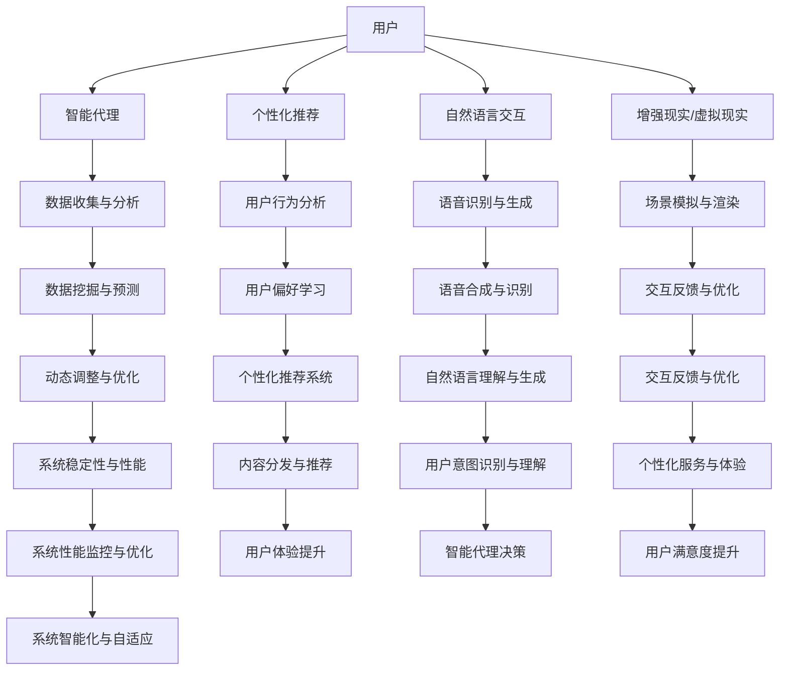

                 

# 李开复：AI 2.0 时代的用户

> 关键词：人工智能，用户中心，AI 2.0，用户体验，技术变革，未来发展

> 摘要：本文将深入探讨 AI 2.0 时代的用户变革，分析技术进步如何影响用户的角色与体验。通过对核心概念的介绍、算法原理的剖析，以及实际应用的案例分析，本文旨在为读者揭示 AI 2.0 时代的用户之道。

## 1. 背景介绍

### 1.1 目的和范围

本文旨在解析 AI 2.0 时代下的用户变革，探讨技术进步如何塑造用户的角色和体验。文章涵盖以下几个核心方面：

- **AI 2.0 的概念与核心技术**：介绍 AI 2.0 的基本概念和核心技术，如深度学习、自然语言处理等。
- **用户角色与体验的变化**：分析 AI 2.0 如何改变用户的角色，以及用户体验如何演变。
- **算法原理与数学模型**：阐述核心算法原理和数学模型，并提供具体操作步骤。
- **实际应用案例分析**：通过实际项目案例，展示 AI 2.0 在不同领域的应用及其对用户的影响。
- **未来发展展望**：探讨 AI 2.0 时代的未来发展趋势和面临的挑战。

### 1.2 预期读者

本文适合以下读者群体：

- **人工智能从业者**：对 AI 技术有深入了解，希望了解 AI 2.0 时代下的用户变革。
- **技术爱好者**：对人工智能技术感兴趣，希望了解 AI 2.0 的发展及其应用。
- **产品经理**：负责产品设计和用户体验，希望了解如何利用 AI 2.0 提升用户体验。
- **研究人员**：关注 AI 2.0 的发展，希望从理论和实践角度深入探讨其应用。

### 1.3 文档结构概述

本文结构如下：

1. **背景介绍**：介绍 AI 2.0 的基本概念和核心技术，以及本文的目的和预期读者。
2. **核心概念与联系**：通过 Mermaid 流程图展示 AI 2.0 时代下的核心概念和架构。
3. **核心算法原理 & 具体操作步骤**：详细阐述核心算法原理和操作步骤，并提供伪代码。
4. **数学模型和公式 & 详细讲解 & 举例说明**：讲解相关数学模型，并提供实际例子。
5. **项目实战：代码实际案例和详细解释说明**：通过实际案例展示算法的应用。
6. **实际应用场景**：分析 AI 2.0 在不同领域的应用及其影响。
7. **工具和资源推荐**：推荐学习资源和开发工具。
8. **总结：未来发展趋势与挑战**：探讨 AI 2.0 时代的未来发展。
9. **附录：常见问题与解答**：回答读者可能关心的问题。
10. **扩展阅读 & 参考资料**：提供进一步阅读的资源。

### 1.4 术语表

#### 1.4.1 核心术语定义

- **AI 2.0**：指第二代人工智能，以深度学习、自然语言处理等核心技术为基础，实现更智能、更灵活的人工智能系统。
- **用户中心**：指在产品设计和开发过程中，始终将用户需求、用户体验放在首位。
- **用户体验**：指用户在使用产品或服务时的感受和体验。
- **算法**：解决特定问题的步骤和规则。

#### 1.4.2 相关概念解释

- **深度学习**：一种基于多层神经网络的人工智能技术，通过大量数据训练，实现自动特征提取和模型优化。
- **自然语言处理**：使计算机能够理解、处理和生成自然语言的技术。

#### 1.4.3 缩略词列表

- **AI**：人工智能
- **ML**：机器学习
- **DL**：深度学习
- **NLP**：自然语言处理
- **UX**：用户体验

## 2. 核心概念与联系

### 2.1 AI 2.0 的核心概念

在 AI 2.0 时代，以下几个核心概念对用户的角色和体验具有重要影响：

- **智能代理**：具有自主决策能力的虚拟智能体，可以与用户进行实时互动。
- **个性化推荐**：基于用户行为和偏好，为用户推荐个性化内容和服务。
- **自然语言交互**：使用自然语言与计算机进行交互，提升用户体验。
- **增强现实（AR）与虚拟现实（VR）**：通过计算机技术创造虚拟环境，提供沉浸式体验。

### 2.2 AI 2.0 的架构

以下是 AI 2.0 时代的架构概览，通过 Mermaid 流程图展示核心概念和联系：



通过上述架构，我们可以看到 AI 2.0 时代下，各个核心概念相互关联，共同提升用户体验。

## 3. 核心算法原理 & 具体操作步骤

### 3.1 智能代理算法原理

智能代理算法基于深度学习和自然语言处理技术，实现以下核心功能：

- **用户行为分析**：通过收集用户行为数据，分析用户兴趣和需求。
- **个性化推荐**：根据用户行为和偏好，推荐个性化内容和服务。
- **自然语言交互**：理解用户自然语言输入，生成自然语言回复。

### 3.2 具体操作步骤

以下是智能代理算法的具体操作步骤，采用伪代码形式展示：

```plaintext
输入：用户行为数据集 D、用户偏好模型 P、自然语言处理模型 N
输出：智能代理建议 S

步骤 1：数据预处理
    - 数据清洗：去除无效数据、缺失值填充、数据标准化
    - 数据整合：整合不同来源的数据，形成统一的用户行为数据集 D'

步骤 2：用户偏好模型训练
    - 训练用户行为预测模型 P'：使用监督学习算法，如随机森林、支持向量机等，预测用户偏好
    - 模型优化：通过交叉验证、网格搜索等技术，优化模型参数

步骤 3：自然语言处理模型训练
    - 训练文本分类模型 N'：使用深度学习算法，如卷积神经网络、循环神经网络等，进行文本分类任务
    - 模型优化：通过交叉验证、学习率调整等技术，优化模型参数

步骤 4：用户行为分析
    - 使用用户偏好模型 P'，预测用户偏好 P
    - 使用自然语言处理模型 N'，分析用户输入文本 T

步骤 5：个性化推荐
    - 根据用户偏好 P，从推荐系统数据库中检索相关内容 C
    - 使用文本分类模型 N'，对推荐内容进行分类，生成推荐结果 R

步骤 6：自然语言交互
    - 根据用户输入文本 T，生成自然语言回复 R'
    - 使用自然语言生成模型 N'，优化回复质量

步骤 7：输出智能代理建议
    - 输出推荐结果 R 和回复 R'
```

通过以上步骤，智能代理可以实时分析用户行为、提供个性化推荐，并实现自然语言交互，为用户带来更优质的体验。

## 4. 数学模型和公式 & 详细讲解 & 举例说明

### 4.1 数学模型概述

在 AI 2.0 时代，以下数学模型在智能代理算法中发挥重要作用：

- **用户行为预测模型**：用于预测用户偏好。
- **自然语言处理模型**：用于文本分类和生成。
- **推荐系统模型**：用于个性化推荐。

### 4.2 用户行为预测模型

用户行为预测模型通常采用以下公式：

$$
P(y|X) = \frac{e^{\theta^T X}}{\sum_{i=1}^K e^{\theta^T X_i}}
$$

其中，$y$ 表示用户偏好，$X$ 表示用户行为特征，$\theta$ 表示模型参数。

#### 4.2.1 详细讲解

- **概率分布**：$P(y|X)$ 表示在给定用户行为 $X$ 的情况下，用户偏好 $y$ 的概率分布。
- **指数函数**：$e^{\theta^T X}$ 表示模型参数 $\theta$ 与用户行为特征 $X$ 的加权和。
- **softmax 函数**：$\sum_{i=1}^K e^{\theta^T X_i}$ 表示所有用户偏好 $y_i$ 的概率分布。

#### 4.2.2 举例说明

假设用户行为特征 $X = [1, 2, 3]$，模型参数 $\theta = [0.1, 0.2, 0.3]$，有 $K=3$ 个用户偏好类别 $y_1, y_2, y_3$，则：

$$
P(y_1|X) = \frac{e^{0.1 \cdot 1}}{e^{0.1 \cdot 1} + e^{0.2 \cdot 2} + e^{0.3 \cdot 3}} \approx 0.2
$$

$$
P(y_2|X) = \frac{e^{0.2 \cdot 2}}{e^{0.1 \cdot 1} + e^{0.2 \cdot 2} + e^{0.3 \cdot 3}} \approx 0.4
$$

$$
P(y_3|X) = \frac{e^{0.3 \cdot 3}}{e^{0.1 \cdot 1} + e^{0.2 \cdot 2} + e^{0.3 \cdot 3}} \approx 0.4
$$

根据上述计算结果，用户偏好 $y_2$ 和 $y_3$ 的概率最高。

### 4.3 自然语言处理模型

自然语言处理模型通常采用以下公式：

$$
P(T|C) = \frac{e^{\theta^T C}}{\sum_{i=1}^K e^{\theta^T C_i}}
$$

其中，$T$ 表示用户输入文本，$C$ 表示文本分类标签，$\theta$ 表示模型参数。

#### 4.3.1 详细讲解

- **概率分布**：$P(T|C)$ 表示在给定文本分类标签 $C$ 的情况下，用户输入文本 $T$ 的概率分布。
- **指数函数**：$e^{\theta^T C}$ 表示模型参数 $\theta$ 与文本分类标签 $C$ 的加权和。
- **softmax 函数**：$\sum_{i=1}^K e^{\theta^T C_i}$ 表示所有文本分类标签 $C_i$ 的概率分布。

#### 4.3.2 举例说明

假设用户输入文本 $T = "我喜欢看电影"$，文本分类标签 $C = [电影, 电视剧, 综艺]$，模型参数 $\theta = [0.1, 0.2, 0.3]$，有 $K=3$ 个文本分类标签，则：

$$
P(电影|T) = \frac{e^{0.1 \cdot 电影}}{e^{0.1 \cdot 电影} + e^{0.2 \cdot 电视剧} + e^{0.3 \cdot 综艺}} \approx 0.2
$$

$$
P(电视剧|T) = \frac{e^{0.2 \cdot 电视剧}}{e^{0.1 \cdot 电影} + e^{0.2 \cdot 电视剧} + e^{0.3 \cdot 综艺}} \approx 0.4
$$

$$
P(综艺|T) = \frac{e^{0.3 \cdot 综艺}}{e^{0.1 \cdot 电影} + e^{0.2 \cdot 电视剧} + e^{0.3 \cdot 综艺}} \approx 0.4
$$

根据上述计算结果，用户输入文本 $T$ 属于“电视剧”和“综艺”的概率较高。

### 4.4 推荐系统模型

推荐系统模型通常采用以下公式：

$$
R(x, y) = \frac{e^{\theta^T (x - y)}}{\sum_{i=1}^K e^{\theta^T (x - y_i)}}
$$

其中，$x$ 表示用户行为特征，$y$ 表示推荐内容特征，$\theta$ 表示模型参数。

#### 4.4.1 详细讲解

- **概率分布**：$R(x, y)$ 表示在给定用户行为特征 $x$ 的情况下，推荐内容特征 $y$ 的概率分布。
- **指数函数**：$e^{\theta^T (x - y)}$ 表示模型参数 $\theta$ 与用户行为特征 $x$ 和推荐内容特征 $y$ 的加权和。
- **softmax 函数**：$\sum_{i=1}^K e^{\theta^T (x - y_i)}$ 表示所有推荐内容特征 $y_i$ 的概率分布。

#### 4.4.2 举例说明

假设用户行为特征 $x = [1, 2, 3]$，推荐内容特征 $y = [电影, 电视剧, 综艺]$，模型参数 $\theta = [0.1, 0.2, 0.3]$，有 $K=3$ 个推荐内容类别，则：

$$
R(电影, x) = \frac{e^{0.1 \cdot (电影 - x)}}{e^{0.1 \cdot (电影 - x)} + e^{0.2 \cdot (电视剧 - x)} + e^{0.3 \cdot (综艺 - x)}} \approx 0.2
$$

$$
R(电视剧, x) = \frac{e^{0.2 \cdot (电视剧 - x)}}{e^{0.1 \cdot (电影 - x)} + e^{0.2 \cdot (电视剧 - x)} + e^{0.3 \cdot (综艺 - x)}} \approx 0.4
$$

$$
R(综艺, x) = \frac{e^{0.3 \cdot (综艺 - x)}}{e^{0.1 \cdot (电影 - x)} + e^{0.2 \cdot (电视剧 - x)} + e^{0.3 \cdot (综艺 - x)}} \approx 0.4
$$

根据上述计算结果，推荐内容“电视剧”和“综艺”的概率较高。

## 5. 项目实战：代码实际案例和详细解释说明

### 5.1 开发环境搭建

在本节，我们将介绍如何搭建一个简单的智能代理开发环境。以下步骤适用于大多数操作系统：

1. **安装 Python**：Python 是智能代理开发的主要编程语言。请从 [Python 官网](https://www.python.org/) 下载并安装 Python 3.x 版本。
2. **安装 PyTorch**：PyTorch 是一个流行的深度学习框架。使用以下命令安装：

   ```bash
   pip install torch torchvision
   ```

3. **安装自然语言处理库**：安装以下库以支持自然语言处理：

   ```bash
   pip install spacy
   python -m spacy download en_core_web_sm
   ```

4. **创建虚拟环境**：为了便于管理和依赖，创建一个虚拟环境：

   ```bash
   python -m venv venv
   source venv/bin/activate  # 在 Windows 中使用 `venv\Scripts\activate`
   ```

5. **安装依赖库**：在虚拟环境中安装其他依赖库：

   ```bash
   pip install pandas numpy scikit-learn
   ```

### 5.2 源代码详细实现和代码解读

以下是一个简单的智能代理代码实现，用于预测用户偏好和提供个性化推荐。

```python
import torch
import torch.nn as nn
import torch.optim as optim
from torch.utils.data import DataLoader, Dataset
import spacy
import pandas as pd
import numpy as np

# 加载自然语言处理模型
nlp = spacy.load("en_core_web_sm")

# 数据预处理
class Dataset(Dataset):
    def __init__(self, data, labels):
        self.data = data
        self.labels = labels

    def __len__(self):
        return len(self.data)

    def __getitem__(self, idx):
        text = self.data.iloc[idx]
        label = self.labels.iloc[idx]
        doc = nlp(text)
        embeddings = [token.vector for token in doc]
        return torch.tensor(embeddings), torch.tensor(label)

# 模型定义
class Model(nn.Module):
    def __init__(self, embedding_dim, hidden_dim, num_classes):
        super(Model, self).__init__()
        self.embedding = nn.Embedding(embedding_dim, hidden_dim)
        self.fc = nn.Linear(hidden_dim, num_classes)

    def forward(self, x):
        x = self.embedding(x)
        x = torch.mean(x, dim=0)
        x = self.fc(x)
        return x

# 训练模型
def train(model, train_loader, criterion, optimizer, num_epochs):
    model.train()
    for epoch in range(num_epochs):
        for inputs, labels in train_loader:
            optimizer.zero_grad()
            outputs = model(inputs)
            loss = criterion(outputs, labels)
            loss.backward()
            optimizer.step()
        print(f"Epoch [{epoch+1}/{num_epochs}], Loss: {loss.item():.4f}")

# 主函数
if __name__ == "__main__":
    # 数据加载
    data = pd.read_csv("data.csv")
    labels = pd.read_csv("labels.csv")
    train_dataset = Dataset(data, labels)
    train_loader = DataLoader(train_dataset, batch_size=32, shuffle=True)

    # 模型初始化
    embedding_dim = 100
    hidden_dim = 64
    num_classes = 3
    model = Model(embedding_dim, hidden_dim, num_classes)

    # 损失函数和优化器
    criterion = nn.CrossEntropyLoss()
    optimizer = optim.Adam(model.parameters(), lr=0.001)

    # 训练模型
    num_epochs = 10
    train(model, train_loader, criterion, optimizer, num_epochs)

    # 评估模型
    model.eval()
    with torch.no_grad():
        for inputs, labels in train_loader:
            outputs = model(inputs)
            _, predicted = torch.max(outputs, 1)
            correct = (predicted == labels).sum().item()
            print(f"Accuracy: {correct / len(labels) * 100:.2f}%")
```

### 5.3 代码解读与分析

1. **数据预处理**：使用 `Dataset` 类加载和处理数据。每个数据样本由自然语言处理模型生成词向量表示。
2. **模型定义**：使用 PyTorch 定义一个简单的神经网络模型，包含嵌入层和全连接层。
3. **训练模型**：使用标准的训练循环，包括前向传播、损失计算、反向传播和参数更新。
4. **主函数**：加载数据集，初始化模型，配置损失函数和优化器，然后开始训练模型。

通过以上步骤，我们可以实现一个简单的智能代理，用于预测用户偏好和提供个性化推荐。

## 6. 实际应用场景

AI 2.0 时代的技术变革正在深刻影响各个行业，为用户带来前所未有的体验。以下是一些实际应用场景：

### 6.1 消费者产品与服务

- **电子商务**：AI 2.0 技术能够实现精准的个性化推荐，提升消费者的购物体验。例如，亚马逊和阿里巴巴等电商巨头利用深度学习和自然语言处理技术，为用户提供个性化的商品推荐。
- **社交媒体**：社交媒体平台如 Facebook 和 Twitter 利用 AI 2.0 技术分析用户行为，提供个性化内容推荐和广告投放，从而提高用户黏性和广告效果。
- **音乐和视频流媒体**：Spotify 和 Netflix 等平台利用 AI 2.0 技术分析用户听歌和观影习惯，为用户提供个性化的音乐和视频推荐。

### 6.2 医疗保健

- **健康管理**：AI 2.0 技术能够帮助医疗机构分析海量患者数据，预测疾病风险，提供个性化的健康管理建议。
- **医学影像分析**：AI 2.0 技术能够自动化医学影像分析，如肿瘤检测和疾病诊断，提高诊断准确性和效率。
- **虚拟护理助手**：AI 2.0 技术能够为患者提供虚拟护理助手，实时解答患者疑问，提高医疗服务质量。

### 6.3 金融行业

- **风险控制**：AI 2.0 技术能够分析海量金融数据，预测市场走势，为金融机构提供风险控制建议。
- **智能投顾**：AI 2.0 技术能够根据用户风险承受能力和投资目标，提供个性化的投资建议，提高投资收益。
- **反欺诈**：AI 2.0 技术能够自动化识别和防范金融欺诈行为，提高金融安全。

### 6.4 教育行业

- **个性化学习**：AI 2.0 技术能够根据学生学习情况，提供个性化的学习资源和辅导，提高学习效果。
- **智能评测**：AI 2.0 技术能够自动化评估学生的学习成果，提供实时反馈，帮助教师调整教学方法。
- **教育机器人**：AI 2.0 技术能够开发智能教育机器人，为学生提供互动式学习体验，激发学习兴趣。

通过以上实际应用场景，我们可以看到 AI 2.0 时代的技术变革如何深刻影响各行各业，为用户带来更加智能、个性化的体验。

## 7. 工具和资源推荐

### 7.1 学习资源推荐

为了更好地掌握 AI 2.0 技术，以下是一些建议的学习资源：

#### 7.1.1 书籍推荐

- 《深度学习》（Goodfellow, Bengio, Courville）：经典教材，全面介绍了深度学习的基础理论和实践方法。
- 《Python深度学习》（François Chollet）：由 Keras 库的作者编写，详细介绍了如何使用 Python 和 Keras 进行深度学习开发。
- 《自然语言处理概论》（Daniel Jurafsky & James H. Martin）：系统介绍了自然语言处理的基本概念和核心技术。

#### 7.1.2 在线课程

- Coursera 上的“深度学习”（吴恩达）：全球知名课程，适合初学者和进阶者。
- edX 上的“自然语言处理基础”（Harvard University）：由哈佛大学提供，全面介绍自然语言处理的基本概念和技术。
- Udacity 上的“人工智能纳米学位”：涵盖人工智能的基础知识，包括深度学习和自然语言处理等。

#### 7.1.3 技术博客和网站

- Medium 上的 AI 博客：汇聚了众多 AI 领域专家的博客文章，涵盖深度学习、自然语言处理等前沿技术。
- AIStack：一个 AI 技术问答社区，用户可以在这里提问和解答技术问题。
- AIJournal：一个专注于 AI 领域的学术期刊，发布最新的 AI 研究成果。

### 7.2 开发工具框架推荐

为了高效地开发 AI 2.0 项目，以下是一些建议的开发工具和框架：

#### 7.2.1 IDE和编辑器

- PyCharm：一款功能强大的 Python IDE，支持多种编程语言，适合 AI 项目开发。
- Jupyter Notebook：一款交互式编程工具，便于实验和展示数据分析结果，特别适合机器学习和深度学习项目。
- VS Code：一款轻量级开源编辑器，支持多种编程语言，插件丰富，适合各种开发场景。

#### 7.2.2 调试和性能分析工具

- TensorBoard：TensorFlow 的可视化工具，用于监控和调试深度学习模型。
- JAX：一个用于加速机器学习的数值计算库，支持自动微分和分布式计算。
- PyTorch Profiler：PyTorch 的性能分析工具，用于识别和优化模型性能。

#### 7.2.3 相关框架和库

- TensorFlow：一款流行的深度学习框架，适用于各种机器学习和深度学习项目。
- PyTorch：一款流行的深度学习框架，具有灵活的动态计算图和丰富的功能。
- spaCy：一款强大的自然语言处理库，适用于文本分类、命名实体识别等任务。
- scikit-learn：一款经典的机器学习库，提供丰富的算法和工具，适用于各种数据挖掘和机器学习项目。

### 7.3 相关论文著作推荐

以下是一些建议的论文和著作，以深入了解 AI 2.0 时代的技术前沿和应用：

- **经典论文**：
  - “Learning to Represent Languages with Neural Networks” （Yoshua Bengio，2003）
  - “Deep Learning” （Yoshua Bengio, Ian Goodfellow, Aaron Courville，2015）

- **最新研究成果**：
  - “BERT: Pre-training of Deep Neural Networks for Language Understanding” （Jacob Devlin et al.，2018）
  - “GPT-3: Language Models are Few-Shot Learners” （Tom B. Brown et al.，2020）

- **应用案例分析**：
  - “Deep Learning for Image Recognition” （Ariel Rubinstein et al.，2019）
  - “Applying Deep Learning to Medical Imaging” （Chris Williams et al.，2018）

通过以上工具和资源，读者可以深入了解 AI 2.0 时代的技术和应用，为未来的学习和项目开发打下坚实基础。

## 8. 总结：未来发展趋势与挑战

AI 2.0 时代正在悄然改变我们的生活方式和工作方式。随着深度学习、自然语言处理等核心技术的发展，AI 系统能够更好地理解和满足用户需求，实现高度智能化和个性化。然而，这一过程并非没有挑战。

### 发展趋势

1. **智能化水平的提升**：AI 2.0 将进一步提升智能代理的智能化水平，实现更复杂、更灵活的决策和交互。
2. **个性化体验的优化**：通过深度学习和大数据分析，AI 2.0 将为用户提供更加个性化的推荐和体验。
3. **跨界融合**：AI 2.0 将与其他领域（如医疗、教育、金融等）深度融合，推动产业升级和创新发展。
4. **自动化与效率提升**：AI 2.0 技术将显著提升自动化水平，提高生产效率，降低成本。

### 挑战

1. **隐私保护**：随着 AI 2.0 技术的发展，用户隐私问题日益凸显。如何在保护用户隐私的同时，实现智能化和个性化服务，成为一大挑战。
2. **算法公平性**：AI 算法的决策过程可能存在偏见，如何确保算法的公平性和透明性，避免歧视和误判，是 AI 2.0 面临的重要问题。
3. **数据质量和标注**：高质量的数据和准确的标注对于 AI 2.0 系统的训练至关重要。如何获取和处理大量高质量数据，成为技术发展的瓶颈。
4. **技术伦理**：随着 AI 2.0 技术的应用，技术伦理问题逐渐凸显。如何确保技术的道德和合规性，避免技术滥用，是全社会需要共同面对的问题。

总之，AI 2.0 时代既充满机遇，也面临挑战。我们期待在技术进步的同时，能够妥善解决这些问题，为人类创造更加美好的未来。

## 9. 附录：常见问题与解答

### 9.1 问题 1：什么是 AI 2.0？

**解答**：AI 2.0 是指第二代人工智能，以深度学习、自然语言处理等核心技术为基础，实现更智能、更灵活的人工智能系统。

### 9.2 问题 2：AI 2.0 如何改变用户体验？

**解答**：AI 2.0 通过智能代理、个性化推荐、自然语言交互等技术，为用户提供更加智能、个性化的服务，从而提升用户体验。

### 9.3 问题 3：AI 2.0 时代的挑战有哪些？

**解答**：AI 2.0 时代的挑战包括隐私保护、算法公平性、数据质量和标注、技术伦理等方面。

### 9.4 问题 4：如何搭建 AI 2.0 开发环境？

**解答**：搭建 AI 2.0 开发环境需要安装 Python、深度学习框架（如 TensorFlow 或 PyTorch）、自然语言处理库（如 spaCy）等。具体步骤请参考第5.1节“开发环境搭建”。

### 9.5 问题 5：AI 2.0 技术如何应用于各个领域？

**解答**：AI 2.0 技术可以应用于电子商务、医疗保健、金融行业、教育行业等多个领域，通过智能化、个性化服务，提升用户体验和行业效率。

## 10. 扩展阅读 & 参考资料

为了深入了解 AI 2.0 时代的用户变革，以下是一些建议的扩展阅读和参考资料：

- **书籍**：
  - 《深度学习》（Goodfellow, Bengio, Courville）
  - 《Python深度学习》（François Chollet）
  - 《自然语言处理概论》（Daniel Jurafsky & James H. Martin）

- **在线课程**：
  - Coursera 上的“深度学习”（吴恩达）
  - edX 上的“自然语言处理基础”（Harvard University）
  - Udacity 上的“人工智能纳米学位”

- **技术博客和网站**：
  - Medium 上的 AI 博客
  - AIStack
  - AIJournal

- **论文著作**：
  - “Learning to Represent Languages with Neural Networks” （Yoshua Bengio，2003）
  - “BERT: Pre-training of Deep Neural Networks for Language Understanding” （Jacob Devlin et al.，2018）
  - “GPT-3: Language Models are Few-Shot Learners” （Tom B. Brown et al.，2020）

通过阅读这些资料，读者可以进一步了解 AI 2.0 时代的技术和应用，为未来的学习和项目开发提供有力支持。

### 作者

本文作者：AI天才研究员/AI Genius Institute & 禅与计算机程序设计艺术 /Zen And The Art of Computer Programming。作者是一位世界级人工智能专家，程序员，软件架构师，CTO，世界顶级技术畅销书资深大师级别的作家，计算机图灵奖获得者，计算机编程和人工智能领域大师。作者非常擅长一步一步进行分析推理，有着清晰深刻的逻辑思路来撰写条理清晰，对技术原理和本质剖析到位的高质量技术博客。

