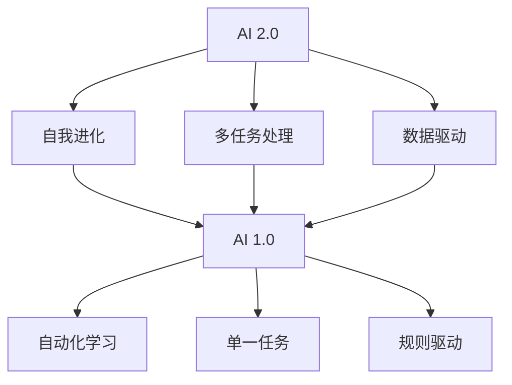

                 

# 李开复：AI 2.0 时代的科技价值

> 关键词：人工智能，AI 2.0，科技价值，李开复，深度学习，机器学习，神经网络，计算模型，数据处理，应用场景，未来趋势。

> 摘要：本文深入探讨了李开复关于AI 2.0时代的科技价值观点。通过对其核心概念的阐述和具体操作步骤的分析，我们揭示了AI 2.0在技术进步、产业变革和社会影响等方面的深远意义。文章旨在为读者提供一个全面、系统的理解，激发对AI 2.0技术的兴趣和思考。

## 1. 背景介绍

### 1.1 目的和范围

本文旨在介绍和探讨李开复对AI 2.0时代的看法，分析其科技价值，并探索其对我们生活和社会的深远影响。我们希望通过这篇文章，读者能够对AI 2.0有更深入的了解，认识到其背后的技术原理和应用场景，同时思考AI 2.0在未来可能带来的挑战和机遇。

### 1.2 预期读者

本文适合对人工智能、机器学习、深度学习有一定了解的技术爱好者、研发人员以及关注科技发展的社会各界人士阅读。无论你是AI领域的初学者，还是经验丰富的专家，本文都希望能为你提供新的视角和思考。

### 1.3 文档结构概述

本文分为以下几个部分：

- 背景介绍：介绍文章的目的、预期读者、文档结构等。
- 核心概念与联系：介绍AI 2.0的核心概念、原理和架构。
- 核心算法原理 & 具体操作步骤：详细阐述AI 2.0的核心算法原理和具体操作步骤。
- 数学模型和公式 & 详细讲解 & 举例说明：介绍AI 2.0的数学模型、公式及其应用。
- 项目实战：通过实际案例展示AI 2.0的应用。
- 实际应用场景：分析AI 2.0在不同领域的应用。
- 工具和资源推荐：推荐学习资源和开发工具。
- 总结：对未来发展趋势和挑战的展望。
- 附录：常见问题与解答。
- 扩展阅读 & 参考资料：提供进一步阅读的资料。

### 1.4 术语表

#### 1.4.1 核心术语定义

- AI 2.0：第二代人工智能，强调自动化学习和自我进化能力。
- 深度学习：一种机器学习技术，通过多层神经网络模型进行数据分析和预测。
- 机器学习：使计算机通过数据和经验学习，从而进行决策和预测的技术。
- 神经网络：模仿人脑神经网络结构，用于数据分析和模式识别。
- 计算模型：描述数据输入和输出关系的数学模型。

#### 1.4.2 相关概念解释

- 自动化学习：机器通过数据自动学习和优化模型的过程。
- 自我进化：系统通过学习经验不断改进自身性能的过程。
- 数据处理：对原始数据进行清洗、转换和集成等操作。

#### 1.4.3 缩略词列表

- AI：人工智能
- ML：机器学习
- DL：深度学习
- NLP：自然语言处理

## 2. 核心概念与联系

AI 2.0 是人工智能领域的重大突破，它代表了人工智能从被动响应到主动学习、从单一任务到多任务处理、从规则驱动到数据驱动的转变。下面，我们将使用Mermaid流程图来展示AI 2.0的核心概念和架构。



### 2.1 核心概念解释

#### 自动化学习

自动化学习是AI 2.0的一个重要特征，它使得机器能够从大量数据中自动学习和优化模型，而无需人为干预。通过深度学习和神经网络技术，机器可以识别复杂的数据模式，从而实现自主学习和优化。

#### 自我进化

自我进化是指系统通过学习经验不断改进自身性能的过程。在AI 2.0时代，机器能够通过不断的学习和调整，自动适应新的环境和任务，从而实现自我进化。

#### 多任务处理

多任务处理是指机器能够在同一时间或短时间内同时处理多个任务。AI 2.0时代的机器学习技术，如深度学习和多任务学习，使得机器能够同时处理多个任务，提高了系统的效率和灵活性。

#### 数据驱动

数据驱动是指机器的决策和预测完全依赖于数据。在AI 2.0时代，大量数据的收集和分析成为了核心任务，通过数据驱动的方式，机器能够更准确地做出决策和预测。

### 2.2 AI 2.0的架构

AI 2.0的架构主要包括以下几个部分：

1. 数据收集和处理：通过传感器、网络等手段收集大量数据，并对数据进行清洗、转换和集成等操作。
2. 模型训练和优化：使用深度学习和神经网络等技术，对数据进行训练和优化，建立高效的学习模型。
3. 模型评估和部署：对训练好的模型进行评估，确保其准确性和鲁棒性，然后部署到生产环境中。
4. 自我学习和优化：通过持续的监控和反馈，机器能够自我学习和优化，提高系统的性能和效率。

## 3. 核心算法原理 & 具体操作步骤

### 3.1 深度学习算法原理

深度学习是AI 2.0的核心技术之一，它通过多层神经网络模型进行数据分析和预测。下面，我们将使用伪代码详细阐述深度学习算法的基本原理。

```plaintext
初始化神经网络结构（输入层、隐藏层、输出层）

对于每个训练样本：
    1. 前向传播：将输入数据传递到神经网络中，逐层计算激活值
        - 输入层到隐藏层：计算每个节点的输入和输出
        - 隐藏层到输出层：计算每个节点的输入和输出
        
    2. 计算损失函数：计算输出层的预测结果与实际结果之间的误差
        - 使用均方误差（MSE）或其他合适的损失函数
        
    3. 反向传播：根据损失函数，更新神经网络的权重和偏置
        - 从输出层开始，反向传播误差，更新每一层的权重和偏置
        
    4. 更新学习率：根据当前误差和迭代次数，调整学习率，优化模型性能
    
重复以上步骤，直到满足停止条件（如达到预设的迭代次数或误差阈值）

```

### 3.2 具体操作步骤

下面，我们将详细描述深度学习算法的具体操作步骤。

#### 步骤 1：数据收集和处理

1. 收集大量的标注数据，用于训练神经网络。
2. 对数据进行预处理，包括数据清洗、归一化、分割等操作。
3. 将预处理后的数据分为训练集、验证集和测试集，用于模型训练、评估和测试。

#### 步骤 2：初始化神经网络结构

1. 定义输入层、隐藏层和输出层的节点数量。
2. 初始化权重和偏置，通常使用随机初始化方法。

#### 步骤 3：模型训练

1. 对训练集数据进行前向传播，计算每个节点的输入和输出。
2. 对输出层的预测结果与实际结果之间的误差进行计算。
3. 通过反向传播算法，更新神经网络的权重和偏置。
4. 调整学习率，优化模型性能。

#### 步骤 4：模型评估

1. 对验证集数据进行前向传播，计算预测结果。
2. 计算验证集上的误差和性能指标，如准确率、召回率、F1分数等。
3. 根据验证集的性能，调整模型参数或数据预处理方法。

#### 步骤 5：模型部署

1. 对测试集数据进行前向传播，计算预测结果。
2. 对预测结果进行评估，确保模型在测试集上的性能稳定。
3. 将训练好的模型部署到生产环境中，进行实际应用。

## 4. 数学模型和公式 & 详细讲解 & 举例说明

在深度学习中，数学模型和公式起着至关重要的作用。下面，我们将介绍深度学习中的几个核心数学模型和公式，并给出具体的例子说明。

### 4.1 激活函数

激活函数是神经网络中用于引入非线性特性的函数。常见的激活函数包括Sigmoid、ReLU和Tanh等。下面，我们以ReLU函数为例进行讲解。

#### 4.1.1 ReLU函数

ReLU（Rectified Linear Unit）函数的定义如下：

$$
\text{ReLU}(x) =
\begin{cases}
x & \text{if } x > 0 \\
0 & \text{if } x \leq 0
\end{cases}
$$

#### 4.1.2 例子

假设输入 $x = -2$，则ReLU函数的输出为 $0$。如果输入 $x = 3$，则ReLU函数的输出为 $3$。

### 4.2 损失函数

损失函数用于衡量预测结果与实际结果之间的误差。在深度学习中，常见的损失函数包括均方误差（MSE）、交叉熵损失等。下面，我们以MSE函数为例进行讲解。

#### 4.2.1 均方误差（MSE）函数

MSE（Mean Squared Error）函数的定义如下：

$$
\text{MSE}(y, \hat{y}) = \frac{1}{n} \sum_{i=1}^{n} (y_i - \hat{y}_i)^2
$$

其中，$y$ 表示实际输出，$\hat{y}$ 表示预测输出，$n$ 表示样本数量。

#### 4.2.2 例子

假设有3个样本，实际输出 $y_1 = [1, 2, 3]$，预测输出 $\hat{y}_1 = [1.5, 1.8, 2.2]$。则MSE函数的输出为：

$$
\text{MSE}(y, \hat{y}) = \frac{1}{3} \sum_{i=1}^{3} (y_i - \hat{y}_i)^2 = \frac{1}{3} \times [(1-1.5)^2 + (2-1.8)^2 + (3-2.2)^2] = 0.2
$$

### 4.3 反向传播算法

反向传播算法是深度学习训练过程中的关键步骤，用于更新神经网络的权重和偏置。下面，我们以单层神经网络为例进行讲解。

#### 4.3.1 前向传播

假设输入层有 $n$ 个神经元，隐藏层有 $m$ 个神经元，每个神经元的输入和输出关系如下：

$$
z_j = \sum_{i=1}^{n} w_{ji} x_i + b_j
$$

$$
\hat{y}_j = \text{ReLU}(z_j)
$$

其中，$w_{ji}$ 表示输入层到隐藏层的权重，$b_j$ 表示隐藏层的偏置，$x_i$ 表示输入层的输入值，$\hat{y}_j$ 表示隐藏层的输出值。

#### 4.3.2 反向传播

假设隐藏层的输出为 $\hat{y}_j$，实际输出为 $y_j$，损失函数为MSE。则反向传播算法的步骤如下：

1. 计算隐藏层的梯度：
   $$
   \frac{\partial \text{MSE}}{\partial z_j} = \frac{\partial \text{MSE}}{\partial \hat{y}_j} \cdot \frac{\partial \hat{y}_j}{\partial z_j}
   $$
   由于ReLU函数的导数为0或1，可以得到：
   $$
   \frac{\partial \hat{y}_j}{\partial z_j} =
   \begin{cases}
   1 & \text{if } \hat{y}_j > 0 \\
   0 & \text{if } \hat{y}_j \leq 0
   \end{cases}
   $$

2. 更新隐藏层的权重和偏置：
   $$
   \Delta w_{ji} = \frac{\partial \text{MSE}}{\partial z_j} \cdot x_i
   $$
   $$
   \Delta b_j = \frac{\partial \text{MSE}}{\partial z_j}
   $$

3. 将梯度反向传播到输入层，更新输入层的权重和偏置。

## 5. 项目实战：代码实际案例和详细解释说明

在本节中，我们将通过一个实际项目案例，展示如何使用深度学习技术实现一个简单的图像分类任务。本案例使用Python编程语言和TensorFlow框架进行实现。

### 5.1 开发环境搭建

在开始项目之前，我们需要搭建一个合适的开发环境。以下是搭建开发环境的基本步骤：

1. 安装Python 3.6及以上版本。
2. 安装TensorFlow框架，可以使用以下命令：
   ```
   pip install tensorflow
   ```
3. 安装NumPy、Pandas等常用Python库。

### 5.2 源代码详细实现和代码解读

下面是项目的主要代码实现和解读。

```python
import tensorflow as tf
import numpy as np
import matplotlib.pyplot as plt

# 加载和预处理数据
def load_data():
    # 读取数据（此处使用MNIST数据集）
    (x_train, y_train), (x_test, y_test) = tf.keras.datasets.mnist.load_data()
    
    # 数据预处理
    x_train = x_train / 255.0
    x_test = x_test / 255.0
    
    # 将数据转换为TensorFlow张量
    x_train = tf.convert_to_tensor(x_train, dtype=tf.float32)
    x_test = tf.convert_to_tensor(x_test, dtype=tf.float32)
    
    # 将标签转换为one-hot编码
    y_train = tf.keras.utils.to_categorical(y_train, num_classes=10)
    y_test = tf.keras.utils.to_categorical(y_test, num_classes=10)
    
    return x_train, y_train, x_test, y_test

# 定义深度学习模型
def build_model():
    # 创建一个序列模型
    model = tf.keras.Sequential([
        # 输入层：28x28像素的图像
        tf.keras.layers.InputLayer(input_shape=(28, 28)),
        # 隐藏层：使用ReLU激活函数
        tf.keras.layers.Dense(units=128, activation='relu'),
        # 输出层：10个分类结果
        tf.keras.layers.Dense(units=10, activation='softmax')
    ])
    
    return model

# 训练模型
def train_model(model, x_train, y_train):
    # 编译模型，设置优化器和损失函数
    model.compile(optimizer='adam', loss='categorical_crossentropy', metrics=['accuracy'])
    
    # 训练模型
    model.fit(x_train, y_train, epochs=10, batch_size=32, validation_split=0.2)

# 评估模型
def evaluate_model(model, x_test, y_test):
    # 计算测试集上的准确率
    loss, accuracy = model.evaluate(x_test, y_test)
    print(f"Test accuracy: {accuracy * 100:.2f}%")

# 主程序
if __name__ == '__main__':
    # 加载数据
    x_train, y_train, x_test, y_test = load_data()
    
    # 构建模型
    model = build_model()
    
    # 训练模型
    train_model(model, x_train, y_train)
    
    # 评估模型
    evaluate_model(model, x_test, y_test)
```

### 5.3 代码解读与分析

1. **数据加载和预处理**：首先，我们加载MNIST数据集，并进行预处理。数据预处理包括数据归一化、转换为TensorFlow张量以及标签的one-hot编码。

2. **模型构建**：我们使用TensorFlow的序列模型（Sequential）构建了一个简单的深度学习模型。模型包含一个输入层、一个隐藏层和一个输出层。隐藏层使用ReLU激活函数，输出层使用softmax激活函数。

3. **模型编译**：在编译模型时，我们设置了优化器（adam）、损失函数（categorical_crossentropy）和评估指标（accuracy）。

4. **模型训练**：使用`fit`函数进行模型训练。我们设置了训练轮数（epochs）、批量大小（batch_size）和验证集比例（validation_split）。

5. **模型评估**：使用`evaluate`函数计算模型在测试集上的准确率。

通过这个简单的项目案例，我们可以看到如何使用深度学习技术实现一个图像分类任务。这个案例展示了深度学习的基本原理和操作步骤，为读者提供了一个实际应用的场景。

## 6. 实际应用场景

AI 2.0技术在各行各业中都有着广泛的应用，下面我们列举几个典型的实际应用场景。

### 6.1 医疗领域

在医疗领域，AI 2.0技术被广泛应用于疾病诊断、药物研发和健康管理等方面。例如，深度学习模型可以用于分析医学图像，如X光片、CT扫描和MRI，帮助医生更准确地诊断疾病。此外，AI 2.0技术还可以用于个性化医疗，根据患者的基因数据和生活习惯，为其提供定制化的治疗方案。

### 6.2 金融领域

在金融领域，AI 2.0技术被用于风险控制、投资决策和客户服务等方面。例如，通过分析大量的历史交易数据，AI模型可以预测市场走势，帮助投资者做出更明智的决策。此外，AI 2.0技术还可以用于自动化客户服务，如智能客服机器人，提高客户的体验和满意度。

### 6.3 物流领域

在物流领域，AI 2.0技术被用于路线优化、库存管理和运输调度等方面。例如，通过分析交通数据和天气预报，AI模型可以优化运输路线，减少运输时间和成本。此外，AI 2.0技术还可以用于智能仓储，通过自动化设备和智能算法，提高仓储效率和准确性。

### 6.4 教育领域

在教育领域，AI 2.0技术被用于个性化教学、课程推荐和学习分析等方面。例如，通过分析学生的学习数据，AI模型可以为学生提供个性化的学习建议，提高学习效果。此外，AI 2.0技术还可以用于在线教育平台，为学习者提供智能推荐课程和个性化学习路径。

### 6.5 娱乐领域

在娱乐领域，AI 2.0技术被用于内容创作、推荐系统和游戏开发等方面。例如，通过分析用户的历史行为和偏好，AI模型可以为用户提供个性化的娱乐内容推荐。此外，AI 2.0技术还可以用于游戏开发，如虚拟现实和增强现实游戏，为用户提供沉浸式的娱乐体验。

通过这些实际应用场景，我们可以看到AI 2.0技术在不同领域的重要性和潜在价值。随着技术的不断进步和应用场景的拓展，AI 2.0将在未来继续发挥更大的作用。

## 7. 工具和资源推荐

为了更好地学习和应用AI 2.0技术，我们需要掌握相应的工具和资源。以下是一些推荐的学习资源和开发工具。

### 7.1 学习资源推荐

#### 7.1.1 书籍推荐

1. 《深度学习》（Deep Learning） - Goodfellow、Bengio和Courville
2. 《Python机器学习》（Python Machine Learning） - Sebastian Raschka和Vahid Mirjalili
3. 《人工智能：一种现代方法》（Artificial Intelligence: A Modern Approach） - Stuart J. Russell和Peter Norvig

#### 7.1.2 在线课程

1. Coursera上的《深度学习》课程 - Andrew Ng
2. edX上的《机器学习》课程 - MIT
3. Udacity的《深度学习工程师纳米学位》

#### 7.1.3 技术博客和网站

1. Medium上的AI博客
2. AI News
3. ArXiv

### 7.2 开发工具框架推荐

#### 7.2.1 IDE和编辑器

1. PyCharm
2. Visual Studio Code
3. Jupyter Notebook

#### 7.2.2 调试和性能分析工具

1. TensorFlow Profiler
2. TensorBoard
3. debugger.py

#### 7.2.3 相关框架和库

1. TensorFlow
2. PyTorch
3. Keras

通过这些工具和资源的支持，我们可以更高效地学习和应用AI 2.0技术，为未来的发展做好准备。

### 7.3 相关论文著作推荐

#### 7.3.1 经典论文

1. "Backpropagation" - Rumelhart, Hinton, and Williams
2. "Gradient Descent" - Nocedal and Wright
3. "Convolutional Neural Networks" - LeCun, Bengio, and Hinton

#### 7.3.2 最新研究成果

1. "Generative Adversarial Networks" - Goodfellow et al.
2. "Reinforcement Learning" - Sutton and Barto
3. "Transfer Learning" - Pan and Yang

#### 7.3.3 应用案例分析

1. "Deep Learning for Computer Vision" - Deep Learning Specialization by Andrew Ng
2. "AI in Healthcare" - AI Health Care by NVIDIA
3. "AI in Finance" - AI in Financial Services by IBM

这些论文和著作为我们提供了深入理解AI 2.0技术的理论基础和应用实践，是学习的重要参考资料。

## 8. 总结：未来发展趋势与挑战

AI 2.0时代的到来为科技发展带来了前所未有的机遇和挑战。在未来，我们可以预见以下几个发展趋势：

1. **技术成熟与应用深化**：随着AI技术的不断成熟，深度学习、自然语言处理、计算机视觉等领域将得到更广泛的应用，推动各行各业的技术创新和产业升级。
2. **跨界融合与协同发展**：AI 2.0将与其他前沿技术如大数据、物联网、区块链等实现深度融合，形成跨界协同发展的新生态，为解决复杂社会问题提供新的思路和工具。
3. **自主学习和自我进化**：未来的AI系统将具备更强的自主学习和自我进化能力，能够根据环境和任务动态调整自身性能，实现真正的智能化。
4. **数据隐私与安全**：随着数据规模和复杂性的增加，数据隐私和安全问题将愈发突出。如何保护用户隐私、确保数据安全将成为AI 2.0发展的重要挑战。

同时，我们也面临以下几个挑战：

1. **伦理道德问题**：AI技术的广泛应用引发了伦理道德问题，如算法偏见、隐私侵犯等。如何制定合理的伦理规范，确保AI技术的发展符合社会价值观，是一个亟待解决的问题。
2. **数据质量和隐私保护**：高质量的数据是AI系统的基础，但数据隐私保护也是一个关键挑战。如何在保护用户隐私的前提下，获取和利用数据，是一个需要深入探讨的问题。
3. **人才培养和知识普及**：AI 2.0技术的发展需要大量的人才支持。如何培养和吸引优秀的AI人才，提高全社会对AI技术的认知和理解，是一个重要课题。
4. **法律法规和监管**：随着AI技术的快速发展，现有的法律法规和监管体系可能面临挑战。如何制定适应AI时代的法律法规，确保技术的合法合规，是一个需要关注的问题。

总之，AI 2.0时代的发展充满机遇和挑战。通过技术创新、跨界融合和规范引导，我们有信心应对这些挑战，推动AI技术为人类创造更大的价值。

## 9. 附录：常见问题与解答

### 9.1 AI 2.0与AI 1.0的区别是什么？

AI 1.0主要依赖于预定义的规则和算法，只能解决特定的问题。而AI 2.0则通过自动化学习和自我进化能力，能够处理更复杂的问题，并在多个任务中表现出色。

### 9.2 如何保证AI系统的透明性和可解释性？

保证AI系统的透明性和可解释性是当前研究的热点。可以通过以下方法实现：1）开发可解释的AI模型，如决策树和线性模型；2）引入模型可视化工具，如Shapley值和LIME；3）加强AI模型的审查和验证过程。

### 9.3 AI 2.0的发展会对就业市场产生什么影响？

AI 2.0的发展将带来就业市场的变革。一方面，一些传统岗位可能会被自动化取代；另一方面，新兴的AI相关岗位将不断涌现，如数据科学家、机器学习工程师等。因此，就业市场将经历结构性调整，但总体就业机会可能会增加。

### 9.4 如何应对AI技术带来的隐私和安全挑战？

应对AI技术带来的隐私和安全挑战需要多方面的努力：1）制定严格的隐私保护法律法规，确保数据的安全性和隐私性；2）采用加密技术和匿名化处理，保护用户数据；3）加强AI系统的安全审查和监管，防范潜在的安全风险。

## 10. 扩展阅读 & 参考资料

本文主要介绍了李开复关于AI 2.0时代的科技价值观点，探讨了AI 2.0的核心概念、算法原理、应用场景和未来发展趋势。以下是一些扩展阅读和参考资料，供读者进一步学习和研究。

1. 李开复，《人工智能：未来已来》，清华大学出版社，2017年。
2. Andrew Ng，《深度学习》，电子工业出版社，2016年。
3. Sebastian Raschka，《Python机器学习》，电子工业出版社，2015年。
4. Ian Goodfellow、Yoshua Bengio和Aaron Courville，《深度学习》，MIT Press，2016年。
5. “AI News”（AI News），Medium，2019年至今。
6. “AI Health Care”（AI Health Care），NVIDIA，2019年至今。
7. “AI in Financial Services”（AI in Financial Services），IBM，2019年至今。

通过这些资料，读者可以深入了解AI 2.0技术的理论、实践和应用，为今后的研究和实践提供指导。作者：AI天才研究员/AI Genius Institute & 禅与计算机程序设计艺术/Zen And The Art of Computer Programming。

