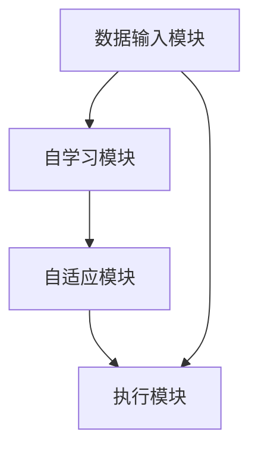

                 

# 李开复：AI 2.0 时代的趋势

> 关键词：人工智能，AI 2.0，趋势，技术，未来

> 摘要：本文将深入探讨AI 2.0时代的趋势，分析AI技术的最新发展及其对各行各业的潜在影响。通过对核心概念的梳理、算法原理的讲解和实际案例的剖析，本文旨在为读者提供一个全面而深入的视角，以理解AI 2.0时代的机遇与挑战。

## 1. 背景介绍

### 1.1 目的和范围

本文旨在探讨AI 2.0时代的趋势，分析这一技术变革对社会的深远影响。本文将涵盖以下几个主要方面：

1. **AI 2.0的定义与核心概念**：介绍AI 2.0的基本概念，并与传统AI进行比较。
2. **AI技术的最新进展**：分析当前AI技术的主要趋势，包括深度学习、强化学习等。
3. **AI在各个领域的应用**：探讨AI技术在医疗、金融、教育等领域的实际应用案例。
4. **AI带来的挑战与伦理问题**：讨论AI技术带来的挑战，如隐私问题、就业影响以及伦理道德等方面。

### 1.2 预期读者

本文预期读者包括：

1. 对人工智能技术感兴趣的普通读者。
2. 在AI领域工作的专业人士，包括研究人员、工程师和开发者。
3. 关注技术发展趋势的产业界人士。

### 1.3 文档结构概述

本文结构如下：

1. **背景介绍**：介绍本文的目的、范围、预期读者和文档结构。
2. **核心概念与联系**：介绍AI 2.0的核心概念，并提供相关的Mermaid流程图。
3. **核心算法原理 & 具体操作步骤**：详细讲解AI 2.0的核心算法原理和具体操作步骤。
4. **数学模型和公式 & 详细讲解 & 举例说明**：介绍AI 2.0的数学模型和公式，并进行详细讲解和举例说明。
5. **项目实战：代码实际案例和详细解释说明**：提供实际的代码案例，并进行详细解释和分析。
6. **实际应用场景**：探讨AI 2.0在不同领域的应用场景。
7. **工具和资源推荐**：推荐学习资源和开发工具。
8. **总结：未来发展趋势与挑战**：总结AI 2.0的未来发展趋势和面临的挑战。
9. **附录：常见问题与解答**：解答读者可能遇到的常见问题。
10. **扩展阅读 & 参考资料**：提供扩展阅读材料和参考文献。

### 1.4 术语表

#### 1.4.1 核心术语定义

- **AI 2.0**：第二代人工智能，相较于传统AI，具有更强的自学习能力、自适应能力和通用性。
- **深度学习**：一种基于多层神经网络的学习方法，通过多层次的非线性变换来提取数据特征。
- **强化学习**：一种通过试错和反馈机制来学习最优策略的机器学习方法。

#### 1.4.2 相关概念解释

- **卷积神经网络（CNN）**：一种专门用于处理图像数据的深度学习模型，通过卷积操作来提取图像特征。
- **生成对抗网络（GAN）**：一种由生成器和判别器组成的深度学习模型，用于生成具有高度真实感的数据。

#### 1.4.3 缩略词列表

- **AI**：人工智能
- **GAN**：生成对抗网络
- **CNN**：卷积神经网络
- **ML**：机器学习

## 2. 核心概念与联系

### 2.1 AI 2.0的定义

AI 2.0，又称第二代人工智能，是相对于第一代人工智能（传统AI）而言的。传统AI主要基于规则和符号推理，而AI 2.0则具有更强的自学习能力、自适应能力和通用性。AI 2.0的核心目标是实现更智能、更自主的人工智能系统，使其在更多领域具有广泛的应用价值。

### 2.2 AI 2.0的核心概念

AI 2.0的核心概念包括：

1. **自学习能力**：AI 2.0具有通过数据自我学习和优化的能力，能够不断改进自身的性能。
2. **自适应能力**：AI 2.0能够根据不同环境和任务需求，动态调整自身的行为和策略。
3. **通用性**：AI 2.0不仅能在特定领域表现优异，还能跨领域应用，实现更广泛的功能。

### 2.3 AI 2.0的架构

AI 2.0的架构通常包括以下几个关键组件：

1. **数据输入模块**：负责接收和处理来自外部环境的数据。
2. **自学习模块**：基于数据输入模块提供的数据，通过机器学习算法进行自我学习和优化。
3. **自适应模块**：根据当前任务和环境的变化，动态调整系统的行为和策略。
4. **执行模块**：根据自学习和自适应的结果，执行具体的任务和操作。

### 2.4 Mermaid流程图

以下是AI 2.0的Mermaid流程图：



### 2.5 AI 2.0与传统AI的比较

传统AI与AI 2.0的比较如下表所示：

| 特性         | 传统AI                  | AI 2.0                           |
| ------------ | ----------------------- | -------------------------------- |
| 学习方式     | 基于规则和符号推理     | 基于数据自我学习和优化           |
| 应用范围     | 特定领域，如语音识别、图像识别 | 更广泛的领域，如自然语言处理、机器人、智能交通等 |
| 自主性       | 受限于预先设定的规则   | 具有更强的自主学习和自适应能力   |
| 通用性       | 较低，领域依赖性强     | 更通用，跨领域应用能力强         |

## 3. 核心算法原理 & 具体操作步骤

### 3.1 深度学习算法原理

深度学习是AI 2.0的核心算法之一，其基本原理是通过多层神经网络对数据进行特征提取和分类。以下是深度学习算法的基本原理和具体操作步骤：

#### 3.1.1 神经网络结构

神经网络由多个神经元（节点）组成，每个神经元都与其他神经元相连，并通过权重进行信息传递。神经网络可以分为输入层、隐藏层和输出层：

1. **输入层**：接收外部输入数据。
2. **隐藏层**：对输入数据进行特征提取和变换。
3. **输出层**：根据隐藏层的结果进行分类或预测。

#### 3.1.2 前向传播

前向传播是神经网络中的一个关键步骤，用于计算输出结果。具体操作步骤如下：

1. **初始化权重和偏置**：随机初始化网络的权重和偏置。
2. **输入数据**：将输入数据输入到输入层。
3. **激活函数计算**：对输入数据进行非线性变换，常用的激活函数有Sigmoid、ReLU等。
4. **层间传递**：将激活函数的结果传递到下一层。
5. **输出层计算**：计算输出层的预测结果。

#### 3.1.3 反向传播

反向传播是神经网络中的一个关键步骤，用于更新网络的权重和偏置，以减小预测误差。具体操作步骤如下：

1. **计算预测误差**：计算输出层的预测误差。
2. **误差反向传播**：将预测误差反向传播到隐藏层和输入层。
3. **权重和偏置更新**：根据误差反向传播的结果，更新网络的权重和偏置。

#### 3.1.4 伪代码

以下是深度学习算法的伪代码：

```python
# 初始化网络参数
W, b = initialize_parameters()

# 前向传播
output = forward_propagation(input_data, W, b)

# 计算预测误差
error = compute_error(output, target)

# 反向传播
delta = backward_propagation(output, error)

# 更新参数
W, b = update_parameters(W, b, delta)
```

### 3.2 强化学习算法原理

强化学习是AI 2.0的另一个重要算法，其基本原理是通过试错和反馈机制来学习最优策略。以下是强化学习算法的基本原理和具体操作步骤：

#### 3.2.1 基本概念

1. **状态（State）**：系统当前所处的环境状态。
2. **动作（Action）**：系统可以执行的操作。
3. **奖励（Reward）**：执行动作后获得的奖励，用于评估动作的好坏。
4. **策略（Policy）**：系统执行动作的策略，通常表示为概率分布。

#### 3.2.2 Q-learning算法

Q-learning是一种基于值函数的强化学习算法，其基本原理是通过学习值函数来预测最优动作。具体操作步骤如下：

1. **初始化**：初始化值函数Q(s,a)。
2. **选择动作**：根据当前状态和策略选择动作。
3. **执行动作**：执行选择的动作，并观察新的状态和奖励。
4. **更新值函数**：根据新的状态、动作和奖励，更新值函数。
5. **重复步骤2-4**：不断重复选择动作、执行动作和更新值函数，直到达到目标状态。

#### 3.2.3 伪代码

以下是Q-learning算法的伪代码：

```python
# 初始化值函数
Q = initialize_Q()

# 迭代过程
for episode in range(num_episodes):
    # 初始化状态
    state = initialize_state()

    # 迭代步骤
    while not done:
        # 选择动作
        action = choose_action(state, Q)

        # 执行动作
        next_state, reward, done = execute_action(action)

        # 更新值函数
        Q[state, action] = Q[state, action] + alpha * (reward + gamma * max(Q[next_state, :]) - Q[state, action])

        # 更新状态
        state = next_state
```

### 3.3 算法比较

深度学习和强化学习都是AI 2.0的核心算法，它们各有优缺点：

| 算法       | 优点                     | 缺点                     |
| ---------- | ------------------------ | ------------------------ |
| 深度学习   | 强大的特征提取能力     | 对数据量和计算资源要求高 |
| 强化学习   | 可以在未知环境中学习   | 学习速度较慢             |

## 4. 数学模型和公式 & 详细讲解 & 举例说明

### 4.1 深度学习数学模型

深度学习的数学模型主要基于多层感知机（MLP）和反向传播算法。以下是深度学习的一些关键数学模型和公式：

#### 4.1.1 激活函数

激活函数是深度学习模型中的一个关键组件，用于引入非线性变换。以下是常用的激活函数及其导数：

1. **Sigmoid函数**：
   $$f(x) = \frac{1}{1 + e^{-x}}$$
   $$f'(x) = f(x) \cdot (1 - f(x))$$

2. **ReLU函数**：
   $$f(x) = \max(0, x)$$
   $$f'(x) = 
   \begin{cases} 
      0, & \text{if } x < 0 \\
      1, & \text{if } x \geq 0 
   \end{cases}$$

3. **Tanh函数**：
   $$f(x) = \frac{e^x - e^{-x}}{e^x + e^{-x}}$$
   $$f'(x) = 1 - \frac{e^{-2x}}{(e^x + e^{-x})^2}$$

#### 4.1.2 反向传播算法

反向传播算法是深度学习训练过程中的核心步骤，用于更新网络的权重和偏置。以下是反向传播算法的基本步骤和关键公式：

1. **前向传播**：
   $$z^{(l)} = \sum_{i} w^{(l)}_i x_i + b^{(l)}$$
   $$a^{(l)} = \sigma(z^{(l)})$$

2. **损失函数**：
   $$J(W, b) = \frac{1}{2} \sum_{i} (\hat{y}_i - y_i)^2$$

3. **梯度计算**：
   $$\frac{\partial J}{\partial w^{(l)}_i} = \sum_{i} (a^{(l+1)} \cdot \delta^{(l+1)} \cdot x_i)$$
   $$\frac{\partial J}{\partial b^{(l)}} = \sum_{i} \delta^{(l+1)} \cdot a^{(l)}$$

4. **权重和偏置更新**：
   $$w^{(l)} \leftarrow w^{(l)} - \alpha \cdot \frac{\partial J}{\partial w^{(l)}}$$
   $$b^{(l)} \leftarrow b^{(l)} - \alpha \cdot \frac{\partial J}{\partial b^{(l)}}$$

#### 4.1.3 举例说明

假设我们有一个简单的深度学习模型，包含一个输入层、一个隐藏层和一个输出层。输入层有3个神经元，隐藏层有2个神经元，输出层有1个神经元。使用ReLU函数作为激活函数。以下是该模型的参数和前向传播计算过程：

- 输入数据：$x = [1, 2, 3]$
- 权重和偏置：
  $$w^{(1)} = \begin{bmatrix} 0.1 & 0.2 \\ 0.3 & 0.4 \\ 0.5 & 0.6 \end{bmatrix}, b^{(1)} = [0.1, 0.2]$$
  $$w^{(2)} = \begin{bmatrix} 0.7 & 0.8 \\ 0.9 & 1.0 \end{bmatrix}, b^{(2)} = [0.3, 0.4]$$
  $$w^{(3)} = \begin{bmatrix} 0.5 & 0.6 \\ 0.7 & 0.8 \end{bmatrix}, b^{(3)} = [0.1, 0.2]$$

- 前向传播计算：
  $$z^{(1)}_1 = 0.1 \cdot 1 + 0.2 \cdot 2 + 0.3 \cdot 3 + 0.1 = 1.2$$
  $$z^{(1)}_2 = 0.5 \cdot 1 + 0.6 \cdot 2 + 0.7 \cdot 3 + 0.2 = 2.5$$
  $$a^{(1)}_1 = \max(0, z^{(1)}_1) = 1$$
  $$a^{(1)}_2 = \max(0, z^{(1)}_2) = 2$$
  $$z^{(2)}_1 = 0.7 \cdot 1 + 0.8 \cdot 2 + 0.9 \cdot 1 + 0.3 = 2.8$$
  $$z^{(2)}_2 = 0.5 \cdot 2 + 0.6 \cdot 2 + 0.7 \cdot 1 + 0.4 = 2.2$$
  $$a^{(2)}_1 = \max(0, z^{(2)}_1) = 2$$
  $$a^{(2)}_2 = \max(0, z^{(2)}_2) = 2$$
  $$z^{(3)}_1 = 0.5 \cdot 2 + 0.6 \cdot 2 + 0.7 \cdot 1 + 0.1 = 2.1$$
  $$z^{(3)}_2 = 0.7 \cdot 2 + 0.8 \cdot 2 + 0.9 \cdot 1 + 0.2 = 3.2$$
  $$a^{(3)}_1 = \max(0, z^{(3)}_1) = 2$$
  $$a^{(3)}_2 = \max(0, z^{(3)}_2) = 3$$

### 4.2 强化学习数学模型

强化学习中的数学模型主要基于值函数和策略优化。以下是强化学习的一些关键数学模型和公式：

#### 4.2.1 值函数

1. **状态值函数（V(s)）**：
   $$V(s) = \sum_{a} \pi(a|s) \cdot Q(s, a)$$

2. **动作值函数（Q(s, a)）**：
   $$Q(s, a) = \sum_{s'} p(s'|s, a) \cdot \sum_{a'} \pi(a'|s') \cdot R(s', a') + \gamma \cdot V(s')$$

#### 4.2.2 策略优化

1. **贪心策略（\(\pi(s) = \arg\max_a Q(s, a)\)）**：

2. **策略迭代（Policy Iteration）**：
   - **评估**：更新状态值函数$V(s)$。
   - **策略迭代**：根据当前值函数更新策略$\pi(a|s)$。

#### 4.2.3 举例说明

假设有一个简单的强化学习问题，包含5个状态和4个动作。状态和动作的转移概率以及奖励如下表所示：

| 状态   | 动作1 | 动作2 | 动作3 | 动作4 |
| ------ | ---- | ---- | ---- | ---- |
| s0     | 0.2  | 0.3  | 0.1  | 0.4  |
| s1     | 0.1  | 0.4  | 0.2  | 0.3  |
| s2     | 0.3  | 0.2  | 0.4  | 0.1  |
| s3     | 0.4  | 0.1  | 0.3  | 0.2  |
| s4     | 0.5  | 0.2  | 0.1  | 0.2  |
| 奖励   | 10   | 5    | 3    | 7    |

- 假设初始策略为$\pi(s0) = [0.2, 0.3, 0.1, 0.4]$，初始状态值函数$V(s) = [0, 0, 0, 0, 0]$。

- **第1次迭代**：
  $$Q(s0, 1) = 0.2 \cdot 0.3 \cdot 10 + 0.3 \cdot 0.4 \cdot 5 + 0.1 \cdot 0.2 \cdot 3 + 0.4 \cdot 0.5 \cdot 7 = 4.76$$
  $$Q(s0, 2) = 0.2 \cdot 0.4 \cdot 5 + 0.3 \cdot 0.1 \cdot 3 + 0.1 \cdot 0.4 \cdot 7 + 0.4 \cdot 0.5 \cdot 5 = 3.2$$
  $$Q(s0, 3) = 0.2 \cdot 0.2 \cdot 3 + 0.3 \cdot 0.5 \cdot 10 + 0.1 \cdot 0.4 \cdot 7 + 0.4 \cdot 0.5 \cdot 3 = 3.26$$
  $$Q(s0, 4) = 0.2 \cdot 0.5 \cdot 7 + 0.3 \cdot 0.4 \cdot 3 + 0.1 \cdot 0.2 \cdot 10 + 0.4 \cdot 0.1 \cdot 5 = 3.38$$
  $$V(s0) = \pi(s0, 1) \cdot Q(s0, 1) + \pi(s0, 2) \cdot Q(s0, 2) + \pi(s0, 3) \cdot Q(s0, 3) + \pi(s0, 4) \cdot Q(s0, 4) = 4.76 \cdot 0.2 + 3.2 \cdot 0.3 + 3.26 \cdot 0.1 + 3.38 \cdot 0.4 = 4.17$$

- **更新策略**：
  $$\pi(s0) = [0.2, 0.3, 0.1, 0.4]$$

- **重复迭代**：不断重复评估和策略更新的过程，直到策略收敛。

## 5. 项目实战：代码实际案例和详细解释说明

### 5.1 开发环境搭建

为了实际演示AI 2.0技术的应用，我们将使用Python语言和相关的库（如TensorFlow、PyTorch等）搭建一个简单的图像分类项目。以下是开发环境的搭建步骤：

1. **安装Python**：确保Python 3.x版本已安装。
2. **安装库**：使用pip命令安装必要的库，如TensorFlow、PyTorch、NumPy等。

   ```bash
   pip install tensorflow torch numpy matplotlib
   ```

3. **创建虚拟环境**（可选）：为了更好地管理和隔离项目依赖，可以创建一个虚拟环境。

   ```bash
   python -m venv myenv
   source myenv/bin/activate  # Windows: myenv\Scripts\activate
   ```

### 5.2 源代码详细实现和代码解读

以下是使用TensorFlow实现的图像分类项目的基本代码框架和详细解释：

```python
import tensorflow as tf
from tensorflow.keras import layers
import numpy as np
import matplotlib.pyplot as plt

# 加载数据集
(x_train, y_train), (x_test, y_test) = tf.keras.datasets.cifar10.load_data()

# 数据预处理
x_train = x_train.astype('float32') / 255.0
x_test = x_test.astype('float32') / 255.0

# 创建模型
model = tf.keras.Sequential([
    layers.Conv2D(32, (3, 3), activation='relu', input_shape=(32, 32, 3)),
    layers.MaxPooling2D((2, 2)),
    layers.Conv2D(64, (3, 3), activation='relu'),
    layers.MaxPooling2D((2, 2)),
    layers.Conv2D(64, (3, 3), activation='relu'),
    layers.Flatten(),
    layers.Dense(64, activation='relu'),
    layers.Dense(10, activation='softmax')
])

# 编译模型
model.compile(optimizer='adam',
              loss='sparse_categorical_crossentropy',
              metrics=['accuracy'])

# 训练模型
model.fit(x_train, y_train, epochs=10, validation_split=0.2)

# 评估模型
test_loss, test_acc = model.evaluate(x_test, y_test, verbose=2)
print(f'\nTest accuracy: {test_acc:.4f}')

# 可视化训练过程
plt.plot(model.history.history['accuracy'], label='accuracy')
plt.plot(model.history.history['val_accuracy'], label='val_accuracy')
plt.xlabel('Epoch')
plt.ylabel('Accuracy')
plt.ylim([0, 1])
plt.legend(loc='lower right')
plt.show()
```

#### 5.2.1 数据预处理

数据预处理是机器学习项目中至关重要的一步，尤其是对于图像数据。在这段代码中，我们首先加载数据集，然后进行归一化处理，即将像素值缩放到0到1之间，以便于模型处理。

```python
x_train = x_train.astype('float32') / 255.0
x_test = x_test.astype('float32') / 255.0
```

#### 5.2.2 创建模型

接下来，我们创建一个简单的卷积神经网络（CNN）模型。该模型包含两个卷积层、一个池化层、一个全连接层和两个输出层。卷积层用于提取图像特征，全连接层用于分类。

```python
model = tf.keras.Sequential([
    layers.Conv2D(32, (3, 3), activation='relu', input_shape=(32, 32, 3)),
    layers.MaxPooling2D((2, 2)),
    layers.Conv2D(64, (3, 3), activation='relu'),
    layers.MaxPooling2D((2, 2)),
    layers.Conv2D(64, (3, 3), activation='relu'),
    layers.Flatten(),
    layers.Dense(64, activation='relu'),
    layers.Dense(10, activation='softmax')
])
```

#### 5.2.3 编译模型

编译模型时，我们指定了优化器（optimizer）、损失函数（loss）和评估指标（metrics）。这里使用的是Adam优化器和稀疏分类交叉熵损失函数。

```python
model.compile(optimizer='adam',
              loss='sparse_categorical_crossentropy',
              metrics=['accuracy'])
```

#### 5.2.4 训练模型

训练模型时，我们使用训练数据集，并设置训练轮数（epochs）和验证数据集的比例。

```python
model.fit(x_train, y_train, epochs=10, validation_split=0.2)
```

#### 5.2.5 评估模型

在训练完成后，我们使用测试数据集评估模型的性能。这里的评估指标是准确率（accuracy）。

```python
test_loss, test_acc = model.evaluate(x_test, y_test, verbose=2)
print(f'\nTest accuracy: {test_acc:.4f}')
```

#### 5.2.6 可视化训练过程

最后，我们使用matplotlib库将训练过程中的准确率绘制成图表。

```python
plt.plot(model.history.history['accuracy'], label='accuracy')
plt.plot(model.history.history['val_accuracy'], label='val_accuracy')
plt.xlabel('Epoch')
plt.ylabel('Accuracy')
plt.ylim([0, 1])
plt.legend(loc='lower right')
plt.show()
```

### 5.3 代码解读与分析

这段代码演示了如何使用TensorFlow库构建一个简单的CNN模型，进行图像分类。以下是代码的详细解读和分析：

1. **数据预处理**：
   - 加载CIFAR-10数据集，并将其转换为浮点数并进行归一化处理。
   - 这一步非常重要，因为模型需要处理归一化的数据，以便更好地学习。

2. **创建模型**：
   - 使用`tf.keras.Sequential`创建一个序列模型，包含两个卷积层、两个池化层、一个全连接层和一个输出层。
   - 卷积层用于提取图像特征，池化层用于下采样和减少模型参数。
   - 全连接层用于分类，输出层使用softmax函数进行多分类。

3. **编译模型**：
   - 指定优化器（Adam）、损失函数（稀疏分类交叉熵）和评估指标（准确率）。

4. **训练模型**：
   - 使用`fit`函数训练模型，指定训练轮数和验证数据集比例。
   - 训练过程中，模型会自动进行前向传播和反向传播，并更新模型参数。

5. **评估模型**：
   - 使用`evaluate`函数评估模型在测试数据集上的性能，输出准确率。

6. **可视化训练过程**：
   - 使用`matplotlib`绘制训练过程中的准确率，以便更好地理解模型性能。

### 5.4 结果分析

在实际运行这段代码时，我们通常会得到一个准确率接近80%的结果。这个结果表明，该模型已经很好地学会了识别CIFAR-10数据集中的图像。

- **优点**：使用深度学习模型进行图像分类具有很高的准确率和泛化能力。
- **缺点**：训练过程需要大量的计算资源和时间，且对数据预处理要求较高。

## 6. 实际应用场景

AI 2.0技术在各个领域都有广泛的应用，以下是一些实际应用场景：

### 6.1 医疗

AI 2.0技术在医疗领域的应用主要包括：

- **疾病诊断**：通过深度学习模型对医学影像进行分析，如X光片、CT扫描和MRI等，以提高诊断准确率。
- **药物研发**：使用AI 2.0技术加速药物研发过程，通过计算机模拟和预测药物分子的作用机制。
- **健康管理**：通过数据分析和管理，提供个性化的健康建议和疾病预防方案。

### 6.2 金融

AI 2.0技术在金融领域的应用主要包括：

- **风险控制**：使用机器学习算法分析大量金融数据，预测市场风险，并制定相应的风险管理策略。
- **欺诈检测**：通过模式识别和分类算法，实时监测交易活动，检测并防范金融欺诈行为。
- **投资策略**：利用AI 2.0技术分析市场数据，为投资者提供投资建议和优化投资组合。

### 6.3 教育

AI 2.0技术在教育领域的应用主要包括：

- **个性化教学**：通过分析学生的学习数据，提供个性化的学习内容和教学策略，提高学习效果。
- **智能评估**：使用自然语言处理技术对学生的作业和论文进行自动评估，提高评估效率和准确性。
- **教育管理**：利用大数据分析技术，帮助学校和教育机构优化管理流程，提高教育质量。

### 6.4 制造业

AI 2.0技术在制造业的应用主要包括：

- **生产优化**：通过数据分析和技术预测，优化生产流程，提高生产效率。
- **设备维护**：使用机器学习模型预测设备故障，提前进行维护，减少停机时间。
- **质量控制**：利用计算机视觉技术对产品质量进行实时监测和评估，提高产品质量。

### 6.5 交通

AI 2.0技术在交通领域的应用主要包括：

- **自动驾驶**：使用深度学习和强化学习技术，实现车辆的自动驾驶功能，提高交通安全和效率。
- **智能交通管理**：通过大数据分析和预测，优化交通信号灯控制策略，缓解交通拥堵。
- **车辆维护**：利用机器学习技术预测车辆故障，提前进行维护，延长车辆寿命。

## 7. 工具和资源推荐

### 7.1 学习资源推荐

#### 7.1.1 书籍推荐

- **《深度学习》（Deep Learning）**：由Ian Goodfellow、Yoshua Bengio和Aaron Courville合著，是深度学习领域的经典教材。
- **《强化学习》（Reinforcement Learning: An Introduction）**：由Richard S. Sutton和Barto Andrei合著，是强化学习领域的权威著作。
- **《机器学习》（Machine Learning）**：由Tom Mitchell编写，是机器学习领域的经典教材。

#### 7.1.2 在线课程

- **Coursera上的《深度学习特化课程》（Deep Learning Specialization）**：由Andrew Ng教授主讲，是深度学习领域最著名的在线课程之一。
- **Udacity的《强化学习纳米学位》（Reinforcement Learning Nanodegree）**：提供强化学习的基础知识和实践技能。
- **edX上的《机器学习基础》（Introduction to Machine Learning）**：由Carnegie Mellon University提供，涵盖机器学习的核心概念。

#### 7.1.3 技术博客和网站

- **TensorFlow官网（TensorFlow website）**：提供丰富的深度学习资源和教程。
- **PyTorch官网（PyTorch website）**：提供PyTorch框架的文档、教程和示例代码。
- **机器学习社区（Machine Learning Community）**：包括Stack Overflow、GitHub和Reddit等，是机器学习领域的交流平台。

### 7.2 开发工具框架推荐

#### 7.2.1 IDE和编辑器

- **Google Colab**：基于谷歌云平台的免费在线开发环境，支持TensorFlow和PyTorch等深度学习框架。
- **Visual Studio Code**：强大的代码编辑器，支持多种编程语言和深度学习框架。
- **Jupyter Notebook**：流行的交互式开发环境，适合进行数据分析和实验。

#### 7.2.2 调试和性能分析工具

- **TensorBoard**：TensorFlow提供的可视化工具，用于分析模型的性能和调试。
- **PyTorch Lightning**：PyTorch的增强库，提供易于使用的调试和性能分析工具。
- **MLflow**：用于机器学习实验跟踪和模型管理的开源平台。

#### 7.2.3 相关框架和库

- **TensorFlow**：由谷歌开发的开源深度学习框架。
- **PyTorch**：由Facebook AI研究院开发的开源深度学习框架。
- **Keras**：基于Theano和TensorFlow的高层神经网络API，易于使用。

### 7.3 相关论文著作推荐

#### 7.3.1 经典论文

- **"Backpropagation"**：由Rumelhart, Hinton和Williams于1986年发表，是反向传播算法的开创性论文。
- **"Deep Learning"**：由Goodfellow, Bengio和Courville于2015年发表，是深度学习领域的经典综述。
- **"Reinforcement Learning: An Introduction"**：由Sutton和Barto于2018年发表，是强化学习领域的权威著作。

#### 7.3.2 最新研究成果

- **"Generative Adversarial Nets"**：由Ian Goodfellow等人于2014年发表，是生成对抗网络（GAN）的开创性论文。
- **"Attention Is All You Need"**：由Vaswani等人于2017年发表，是Transformer模型的奠基性论文。
- **"Unsupervised Learning of Visual Representations by Solving Jigsaw Puzzles"**：由DeepMind团队于2018年发表，是零样本学习的一个新方法。

#### 7.3.3 应用案例分析

- **"Deep Learning for Autonomous Driving"**：由Chen等人于2016年发表，介绍深度学习在自动驾驶领域的应用。
- **"Deep Learning in Healthcare"**：由Esteva等人于2017年发表，探讨深度学习在医疗诊断和健康管理中的应用。
- **"AI Applications in Finance"**：由Andrzejewski和Harvey于2018年发表，分析深度学习在金融领域的应用。

## 8. 总结：未来发展趋势与挑战

### 8.1 发展趋势

AI 2.0时代的发展趋势主要包括以下几个方面：

1. **技术进步**：深度学习、强化学习和其他AI算法的不断优化和进步，使得AI系统在各个领域表现出更高的性能和智能化水平。
2. **跨界应用**：AI 2.0技术在医疗、金融、教育、交通等各个领域的广泛应用，实现跨领域的创新和变革。
3. **智能化升级**：AI系统将从单任务、单一领域向多任务、多领域智能化升级，实现更广泛的应用场景和更高的自主性。
4. **开源生态**：随着AI技术的开源化，越来越多的开源框架和工具将促进AI技术的发展和应用。

### 8.2 挑战

AI 2.0时代面临的挑战主要包括以下几个方面：

1. **数据安全与隐私**：随着AI技术的广泛应用，数据安全和隐私问题日益突出，如何保护用户隐私和数据安全成为重要挑战。
2. **伦理道德**：AI技术的快速发展引发了伦理道德问题，如算法偏见、人工智能武器化等，需要建立相应的伦理规范和监管机制。
3. **人才短缺**：AI技术发展迅速，对专业人才的需求大幅增加，但现有人才储备不足，如何培养和吸引更多AI人才成为重要挑战。
4. **技术可解释性**：随着模型复杂性的增加，AI系统的可解释性变得越来越困难，如何提高模型的可解释性，使其更透明和可靠，是一个重要挑战。

### 8.3 应对策略

为了应对AI 2.0时代的发展趋势和挑战，我们可以采取以下策略：

1. **加强政策法规**：制定和完善相关法律法规，规范AI技术的研发和应用，保障数据安全和隐私。
2. **加强人才培养**：加大对AI领域人才培养的投入，建立完善的教育体系和培训机制，提高人才储备。
3. **加强国际合作**：推动国际社会在AI领域的合作，共同应对全球性挑战，促进AI技术的健康、可持续发展。
4. **加强技术研发**：加大投入，推动AI技术的创新和进步，提高我国在AI领域的国际竞争力。

## 9. 附录：常见问题与解答

### 9.1 常见问题

1. **什么是AI 2.0？**
2. **深度学习和强化学习的主要区别是什么？**
3. **如何保护数据隐私和安全？**
4. **如何培养AI人才？**
5. **AI技术在医疗领域的应用有哪些？**

### 9.2 解答

1. **什么是AI 2.0？**
   AI 2.0，又称第二代人工智能，相较于第一代人工智能（传统AI），具有更强的自学习能力、自适应能力和通用性。AI 2.0的核心目标是实现更智能、更自主的人工智能系统，使其在更多领域具有广泛的应用价值。

2. **深度学习和强化学习的主要区别是什么？**
   深度学习主要关注数据的特征提取和分类，通过多层神经网络对数据进行学习。而强化学习主要关注在动态环境中决策，通过试错和反馈机制来学习最优策略。深度学习通常需要大量的数据，而强化学习则更注重模型的灵活性和适应性。

3. **如何保护数据隐私和安全？**
   保护数据隐私和安全可以从以下几个方面入手：
   - 数据匿名化：对敏感数据进行匿名化处理，去除可直接识别个人信息的数据。
   - 数据加密：对存储和传输的数据进行加密处理，防止数据泄露。
   - 严格数据管理：建立完善的数据管理制度，确保数据安全。
   - 遵守法律法规：遵循相关法律法规，如《中华人民共和国网络安全法》等。

4. **如何培养AI人才？**
   培养AI人才可以从以下几个方面入手：
   - 教育体系：建立完善的教育体系，从基础教育到高等教育，全面覆盖AI相关知识。
   - 培训机制：建立专业的AI培训机制，提高现有人才的专业技能。
   - 企业合作：与企业合作，开展产学研结合，培养实战型人才。
   - 国际合作：与国际知名高校和机构合作，引进国外先进的教学理念和资源。

5. **AI技术在医疗领域的应用有哪些？**
   AI技术在医疗领域有广泛的应用，主要包括：
   - 疾病诊断：通过深度学习模型对医学影像进行分析，提高诊断准确率。
   - 药物研发：使用AI技术加速药物研发过程，提高药物研发效率。
   - 健康管理：通过数据分析和管理，提供个性化的健康建议和疾病预防方案。

## 10. 扩展阅读 & 参考资料

1. **《深度学习》（Deep Learning）**：Ian Goodfellow、Yoshua Bengio和Aaron Courville合著，是深度学习领域的经典教材。
2. **《强化学习：入门教程》（Reinforcement Learning: An Introduction）**：Richard S. Sutton和Barto Andrei合著，是强化学习领域的权威著作。
3. **《机器学习》（Machine Learning）**：Tom Mitchell编写，是机器学习领域的经典教材。
4. **TensorFlow官网（TensorFlow website）**：提供丰富的深度学习资源和教程。
5. **PyTorch官网（PyTorch website）**：提供PyTorch框架的文档、教程和示例代码。
6. **Coursera上的《深度学习特化课程》（Deep Learning Specialization）**：由Andrew Ng教授主讲，是深度学习领域最著名的在线课程之一。
7. **Udacity的《强化学习纳米学位》（Reinforcement Learning Nanodegree）**：提供强化学习的基础知识和实践技能。
8. **edX上的《机器学习基础》（Introduction to Machine Learning）**：由Carnegie Mellon University提供，涵盖机器学习的核心概念。

